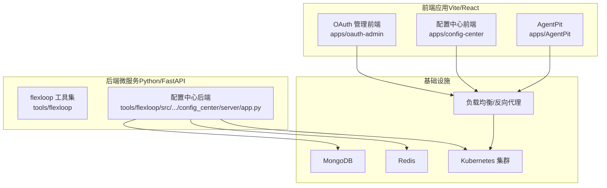
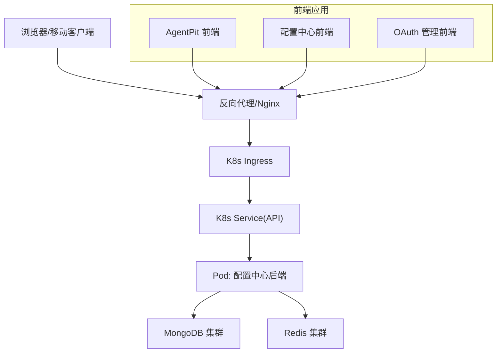
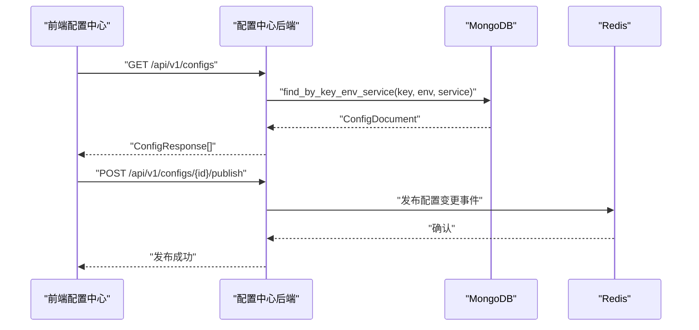
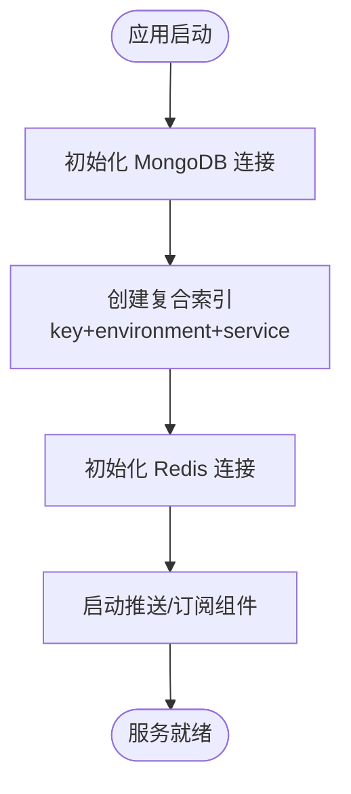
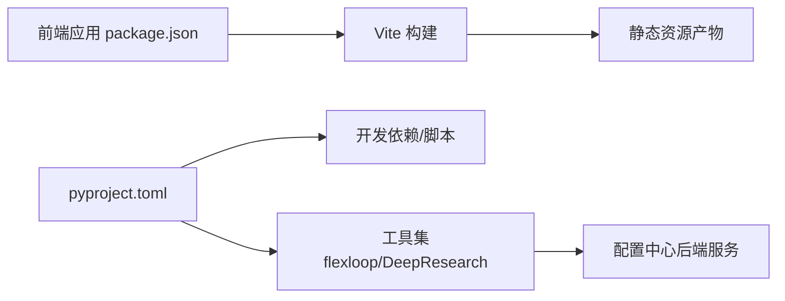

# 部署架构

<cite>
**本文引用的文件**
- [pyproject.toml](file://pyproject.toml)
- [pnpm-workspace.yaml](file://apps/DaoMind/pnpm-workspace.yaml)
- [deployment.md](file://tools/DeepResearch/doc/deployment/deployment.md)
- [dev-environment.yml](file://tools/flexloop/tests/testing/dev-environment.yml)
- [package.json](file://apps/AgentPit/package.json)
- [package.json](file://apps/config-center/package.json)
- [app.py](file://tools/flexloop/src/taolib/testing/config_center/server/app.py)
- [config_repo.py](file://tools/flexloop/src/taolib/testing/config_center/repository/config_repo.py)
- [configs.ts](file://apps/config-center/src/api/configs.ts)
- [DashboardPage.tsx](file://apps/config-center/src/pages/DashboardPage.tsx)
- [ProvidersPage.tsx](file://apps/oauth-admin/src/pages/ProvidersPage.tsx)
</cite>

## 目录
1. [简介](#简介)
2. [项目结构](#项目结构)
3. [核心组件](#核心组件)
4. [架构总览](#架构总览)
5. [详细组件分析](#详细组件分析)
6. [依赖关系分析](#依赖关系分析)
7. [性能考量](#性能考量)
8. [故障排查指南](#故障排查指南)
9. [结论](#结论)
10. [附录](#附录)

## 简介
本文件面向 DAO Collective 项目，提供一套完整的部署架构文档，涵盖 monorepo 多应用部署策略、前端应用独立部署、后端微服务部署模式、容器化与 Kubernetes 部署、负载均衡与服务发现、数据库（MongoDB/Redis）集群与高可用、不同环境（开发/测试/生产）的差异化配置，以及安全架构（SSL、防火墙、访问控制）等关键主题。文档以仓库现有配置与代码为依据，结合可落地的实践建议，帮助团队高效、稳定地交付与运维。

## 项目结构
DAO Collective 采用 monorepo 组织方式，前端应用通过 Vite/React 技术栈构建，后端服务基于 Python 工具链与 FastAPI 微服务架构，数据库采用 MongoDB 与 Redis。整体结构如下：

图表来源
- [pyproject.toml](file://pyproject.toml)
- [pnpm-workspace.yaml](file://apps/DaoMind/pnpm-workspace.yaml)
- [app.py](file://tools/flexloop/src/taolib/testing/config_center/server/app.py)

章节来源
- [pyproject.toml](file://pyproject.toml)
- [pnpm-workspace.yaml](file://apps/DaoMind/pnpm-workspace.yaml)

## 核心组件
- 前端应用（Vite/React）
  - AgentPit、配置中心前端、OAuth 管理前端均采用 Vite 构建，具备独立开发、构建与预览脚本，适合容器化与静态资源托管。
- 后端微服务（Python/FastAPI）
  - 配置中心后端服务基于 FastAPI，使用异步 MongoDB（Motor）与 Redis 进行配置存储与推送/订阅能力。
- 数据库与缓存
  - MongoDB：用于持久化配置、用户、审计日志等；通过复合索引提升查询效率。
  - Redis：用于消息缓冲、在线状态跟踪、WebSocket 推送桥接与事件发布。
- 开发与测试环境
  - 提供 Python 开发环境配置与测试脚本，便于本地联调与自动化测试。

章节来源
- [package.json](file://apps/AgentPit/package.json)
- [package.json](file://apps/config-center/package.json)
- [app.py](file://tools/flexloop/src/taolib/testing/config_center/server/app.py)
- [config_repo.py](file://tools/flexloop/src/taolib/testing/config_center/repository/config_repo.py)
- [pyproject.toml](file://pyproject.toml)

## 架构总览
下图展示从客户端到后端服务与数据库的整体部署视图，强调容器化、Kubernetes 托管、服务间通信与数据流：

图表来源
- [app.py](file://tools/flexloop/src/taolib/testing/config_center/server/app.py)
- [config_repo.py](file://tools/flexloop/src/taolib/testing/config_center/repository/config_repo.py)

## 详细组件分析

### 前端应用独立部署
- 构建与产物
  - 各前端应用通过 Vite 构建生成静态资源，可部署至对象存储或反向代理服务器，实现零运行时依赖的纯静态分发。
- 独立域名与路由
  - 建议为每个前端应用配置独立子域或路径前缀，配合反向代理统一入口与 SSL 终止。
- 缓存与回源
  - 对静态资源设置长缓存，对动态接口走 API 域名，避免缓存污染。

章节来源
- [package.json](file://apps/AgentPit/package.json)
- [package.json](file://apps/config-center/package.json)

### 后端微服务部署模式
- 配置中心后端服务
  - 使用 FastAPI 提供 REST API 与 WebSocket 推送能力，集成 MongoDB 与 Redis。
  - 生命周期管理中完成数据库连接、索引创建、系统角色初始化、推送与订阅组件启动。
- 服务发现与负载均衡
  - 在 Kubernetes 中通过 Service 暴露服务，结合 Ingress 实现外部流量接入与 TLS 终止。
- 配置与版本管理
  - 前端配置中心页面支持按环境/服务统计与可视化，后端通过 MongoDB 文档键+环境+服务唯一索引保证一致性。

图表来源
- [configs.ts](file://apps/config-center/src/api/configs.ts)
- [config_repo.py](file://tools/flexloop/src/taolib/testing/config_center/repository/config_repo.py)
- [app.py](file://tools/flexloop/src/taolib/testing/config_center/server/app.py)

章节来源
- [app.py](file://tools/flexloop/src/taolib/testing/config_center/server/app.py)
- [config_repo.py](file://tools/flexloop/src/taolib/testing/config_center/repository/config_repo.py)
- [configs.ts](file://apps/config-center/src/api/configs.ts)

### 容器化与 Kubernetes 部署策略
- 容器镜像
  - 前端：使用 Nginx 镜像部署静态资源，配置 gzip、缓存头与 HTTPS。
  - 后端：使用精简基础镜像（如 python:slim），安装依赖后运行 uvicorn/Gunicorn，暴露健康检查端点。
- Kubernetes 资源编排
  - Deployment：副本数、滚动更新策略、就绪/存活探针。
  - Service：ClusterIP/LoadBalancer，暴露后端 API。
  - ConfigMap/Secret：存放环境变量与敏感配置，避免硬编码。
  - Ingress：TLS 证书、路径路由、限流与压缩。
- 健康检查与扩缩容
  - 就绪探针探测 /health，存活探针探测 /ready。
  - HPA 基于 CPU/内存或自定义指标进行弹性伸缩。

[本节为通用部署实践说明，不直接分析具体文件，故无“章节来源”]

### 负载均衡、服务发现与网络配置
- 负载均衡
  - Ingress 控制器负责 4/7 层负载均衡，结合 TLS 终止与 WAF 规则。
- 服务发现
  - Kubernetes DNS 服务名解析，后端通过服务名访问数据库与缓存。
- 网络策略
  - 默认拒绝入站，仅开放必要端口；数据库与缓存置于私有网络，通过专用 Service 暴露。

[本节为通用网络实践说明，不直接分析具体文件，故无“章节来源”]

### 数据库部署架构（MongoDB 与 Redis）
- MongoDB
  - 集群部署（副本集/分片）以保障高可用与数据冗余。
  - 在应用启动时创建复合唯一索引（键+环境+服务），避免重复配置。
- Redis
  - 集群或哨兵模式，支持主从切换与故障恢复。
  - 用于消息缓冲、在线状态跟踪与 WebSocket 推送桥接，降低后端压力。

图表来源
- [app.py](file://tools/flexloop/src/taolib/testing/config_center/server/app.py)
- [config_repo.py](file://tools/flexloop/src/taolib/testing/config_center/repository/config_repo.py)

章节来源
- [app.py](file://tools/flexloop/src/taolib/testing/config_center/server/app.py)
- [config_repo.py](file://tools/flexloop/src/taolib/testing/config_center/repository/config_repo.py)

### 不同环境（开发/测试/生产）的部署差异
- 开发环境
  - 本地 Docker Compose 或 Minikube，简化依赖与调试；使用内存数据库/缓存替代品进行快速验证。
  - Python 开发环境通过 Conda/PyEnv 管理，依赖安装与测试脚本齐全。
- 测试环境
  - 使用轻量级集群，数据隔离与最小化资源占用；自动化测试覆盖单元、集成与端到端。
- 生产环境
  - 严格资源规划与监控告警；数据库与缓存采用高可用集群；Ingress/TLS 证书由平台统一管理；RBAC 与审计日志完备。

章节来源
- [dev-environment.yml](file://tools/flexloop/tests/testing/dev-environment.yml)
- [deployment.md](file://tools/DeepResearch/doc/deployment/deployment.md)

### 安全架构考虑
- SSL/TLS
  - Ingress 统一终止 TLS，证书由平台或外部 CA 签发；禁用弱密码套件与过期协议。
- 防火墙与网络
  - 仅开放必要端口；数据库与缓存置于内网；对外仅暴露 API 与静态资源端点。
- 访问控制
  - RBAC 角色与权限分离；OAuth 提供商配置集中管理；审计日志记录关键操作。
- 配置与密钥
  - 敏感信息放入 Secret，避免硬编码；配置中心支持按环境/服务隔离与版本化管理。

章节来源
- [ProvidersPage.tsx](file://apps/oauth-admin/src/pages/ProvidersPage.tsx)
- [DashboardPage.tsx](file://apps/config-center/src/pages/DashboardPage.tsx)
- [app.py](file://tools/flexloop/src/taolib/testing/config_center/server/app.py)

## 依赖关系分析
- 前端应用依赖
  - React 生态与 Vite 构建工具链，各应用独立维护依赖与脚本。
- 后端服务依赖
  - FastAPI、Motor（异步 MongoDB）、Redis 客户端、WebSocket 推送组件。
- Monorepo 管理
  - pnpm workspace 管理共享包与工作区依赖，便于统一升级与测试。

图表来源
- [package.json](file://apps/AgentPit/package.json)
- [package.json](file://apps/config-center/package.json)
- [pyproject.toml](file://pyproject.toml)

章节来源
- [package.json](file://apps/AgentPit/package.json)
- [package.json](file://apps/config-center/package.json)
- [pyproject.toml](file://pyproject.toml)
- [pnpm-workspace.yaml](file://apps/DaoMind/pnpm-workspace.yaml)

## 性能考量
- 前端
  - 启用静态资源压缩与缓存；拆分代码与懒加载；CDN 加速。
- 后端
  - 异步 I/O（MongoDB/Redis）降低阻塞；合理设置连接池大小；对热点查询建立索引。
- 数据库
  - 分片与副本集提升吞吐与可用性；慢查询分析与定期维护。
- 缓存
  - 合理 TTL 与失效策略；热点数据预热；写后读一致性处理。

[本节提供通用性能建议，不直接分析具体文件，故无“章节来源”]

## 故障排查指南
- 健康检查失败
  - 检查就绪/存活探针路径与响应；查看 Pod 日志与事件。
- 数据库连接异常
  - 校验连接字符串、网络连通性与认证信息；确认索引创建流程未阻塞启动。
- Redis 推送/订阅异常
  - 检查 Redis 集群状态与通道订阅；确认消息缓冲与在线状态跟踪组件正常运行。
- 前端静态资源 404
  - 核对 Nginx 配置与静态目录映射；确认构建产物上传与缓存头设置。

章节来源
- [app.py](file://tools/flexloop/src/taolib/testing/config_center/server/app.py)
- [config_repo.py](file://tools/flexloop/src/taolib/testing/config_center/repository/config_repo.py)

## 结论
DAO Collective 的部署架构以 monorepo 为核心，前端采用 Vite/React 独立部署，后端以 FastAPI 微服务与 MongoDB/Redis 为基础，结合 Kubernetes 实现弹性与可观测性。通过环境隔离、安全加固与完善的监控告警体系，可在开发、测试与生产环境中稳定交付。建议后续补充容器化清单与 Ingress/TLS 配置样例，以进一步完善可操作性。

[本节为总结性内容，不直接分析具体文件，故无“章节来源”]

## 附录
- 开发环境参考
  - Python 开发环境配置与依赖安装示例，便于本地联调与测试。
- 部署文档参考
  - 第三方工具的部署与配置说明，可作为外部依赖的参考模板。

章节来源
- [dev-environment.yml](file://tools/flexloop/tests/testing/dev-environment.yml)
- [deployment.md](file://tools/DeepResearch/doc/deployment/deployment.md)