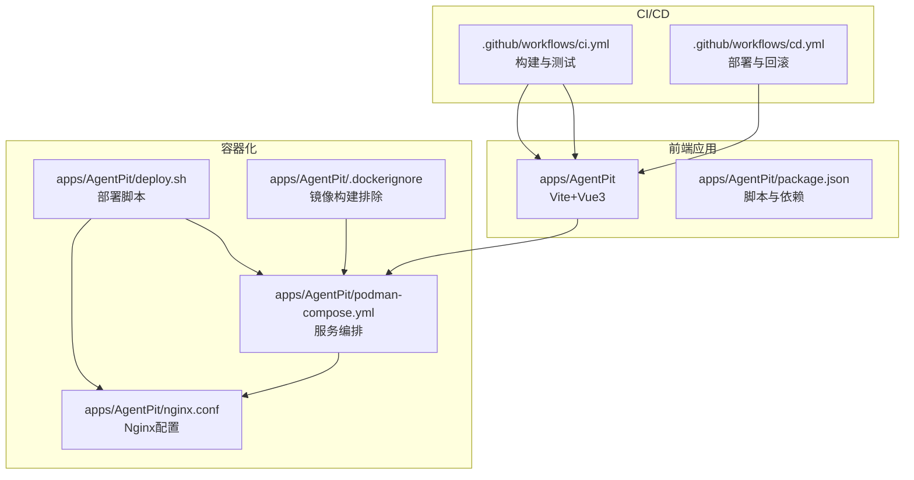
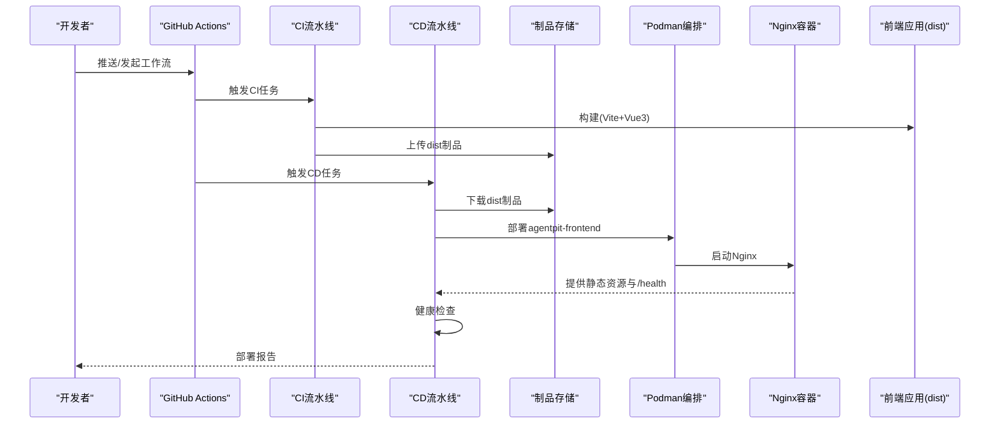
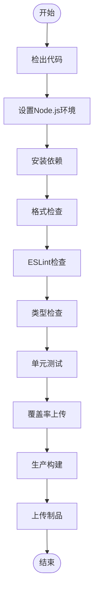
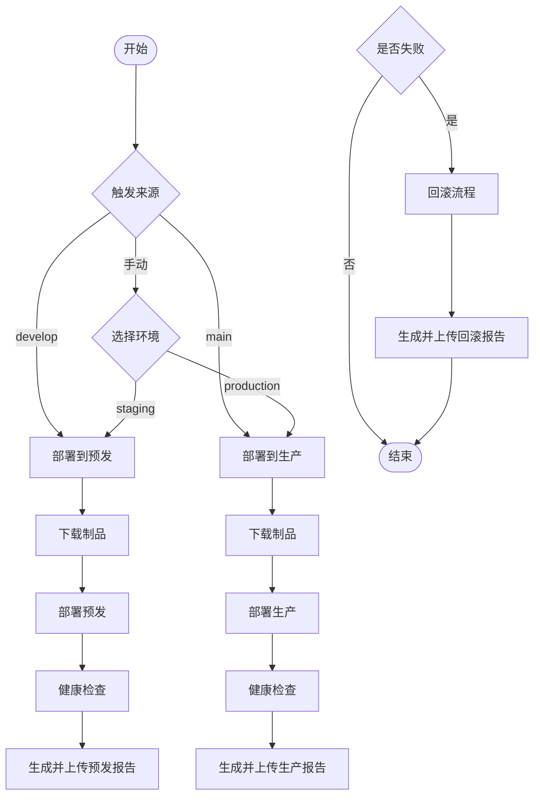
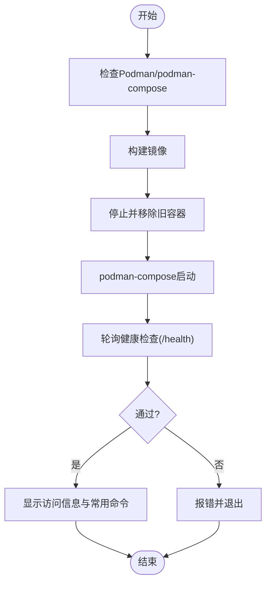
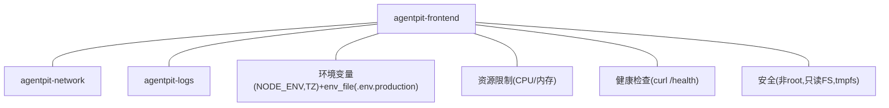
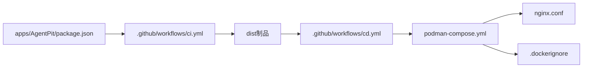

# 部署运维

<cite>
**本文引用的文件**
- [.github/workflows/ci.yml](file://.github/workflows/ci.yml)
- [.github/workflows/cd.yml](file://.github/workflows/cd.yml)
- [apps/AgentPit/deploy.sh](file://apps/AgentPit/deploy.sh)
- [apps/AgentPit/podman-compose.yml](file://apps/AgentPit/podman-compose.yml)
- [apps/AgentPit/nginx.conf](file://apps/AgentPit/nginx.conf)
- [apps/AgentPit/.dockerignore](file://apps/AgentPit/.dockerignore)
- [apps/AgentPit/package.json](file://apps/AgentPit/package.json)
</cite>

## 目录
1. [简介](#简介)
2. [项目结构](#项目结构)
3. [核心组件](#核心组件)
4. [架构总览](#架构总览)
5. [详细组件分析](#详细组件分析)
6. [依赖关系分析](#依赖关系分析)
7. [性能考虑](#性能考虑)
8. [故障排查指南](#故障排查指南)
9. [结论](#结论)
10. [附录](#附录)

## 简介
本文件面向DAOApps项目的运维与平台工程团队，提供从CI/CD流水线、容器化与编排、环境变量与安全策略，到监控告警、日志与崩溃报告、负载均衡与自动扩缩容、以及性能调优与问题排查的完整运维指南。当前仓库以GitHub Actions实现CI/CD，并提供基于Podman的容器化部署脚本与Nginx配置；后续可在现有基础上扩展至Kubernetes集群与云原生监控体系。

## 项目结构
- CI/CD流水线位于 .github/workflows，包含CI与CD两个工作流，分别负责代码质量校验、测试、构建与制品上传，以及按分支或手动触发的预发/生产部署与健康检查。
- 前端应用AgentPit使用Vite+Vue3技术栈，构建产物输出至dist目录，供静态Web服务器提供服务。
- 容器化采用Podman与podman-compose，结合Nginx作为反向代理与静态资源服务，提供健康检查、压缩、缓存与安全头等能力。
- 部署脚本封装了镜像构建、旧容器清理、容器启动、健康检查与状态展示，便于本地或自动化环境一键部署。



**图示来源**
- [.github/workflows/ci.yml:1-67](file://.github/workflows/ci.yml#L1-L67)
- [.github/workflows/cd.yml:1-247](file://.github/workflows/cd.yml#L1-L247)
- [apps/AgentPit/package.json:1-74](file://apps/AgentPit/package.json#L1-L74)
- [apps/AgentPit/podman-compose.yml:1-70](file://apps/AgentPit/podman-compose.yml#L1-L70)
- [apps/AgentPit/nginx.conf:1-68](file://apps/AgentPit/nginx.conf#L1-L68)
- [apps/AgentPit/deploy.sh:1-184](file://apps/AgentPit/deploy.sh#L1-L184)
- [apps/AgentPit/.dockerignore:1-39](file://apps/AgentPit/.dockerignore#L1-L39)

**章节来源**
- [.github/workflows/ci.yml:1-67](file://.github/workflows/ci.yml#L1-L67)
- [.github/workflows/cd.yml:1-247](file://.github/workflows/cd.yml#L1-L247)
- [apps/AgentPit/package.json:1-74](file://apps/AgentPit/package.json#L1-L74)

## 核心组件
- CI流水线（ci.yml）
  - 触发条件：推送到main或PR至main
  - 步骤：Node.js环境准备、依赖安装、格式与ESLint检查、类型检查、单元测试、覆盖率上传、生产构建、制品上传
- CD流水线（cd.yml）
  - 触发条件：develop或main推送，或手动选择环境（staging/production）
  - 步骤：下载制品、部署到目标环境、健康检查、生成部署报告、上传报告；失败时触发回滚流程
- 部署脚本（deploy.sh）
  - 功能：检查Podman/podman-compose、构建镜像、停止并移除旧容器、启动新容器、健康检查、状态提示
- 容器编排（podman-compose.yml）
  - 服务：agentpit-frontend（基于Podmanfile的多阶段构建）
  - 网络：agentpit-network
  - 存储：agentpit-logs卷
  - 资源：CPU/内存限制与保留
  - 健康检查：/health端点
  - 安全：非root用户、只读根文件系统、临时目录
- Nginx配置（nginx.conf）
  - 监听80端口、Gzip压缩、静态资源长期缓存、SPA路由回退、健康检查端点、安全头、隐藏版本号、错误页
- 构建排除（.dockerignore）
  - 排除node_modules、dist、.git、IDE配置、测试与文档、备份与临时文件、操作系统文件、TS构建缓存，仅保留.env.production

**章节来源**
- [.github/workflows/ci.yml:1-67](file://.github/workflows/ci.yml#L1-L67)
- [.github/workflows/cd.yml:1-247](file://.github/workflows/cd.yml#L1-L247)
- [apps/AgentPit/deploy.sh:1-184](file://apps/AgentPit/deploy.sh#L1-L184)
- [apps/AgentPit/podman-compose.yml:1-70](file://apps/AgentPit/podman-compose.yml#L1-L70)
- [apps/AgentPit/nginx.conf:1-68](file://apps/AgentPit/nginx.conf#L1-L68)
- [apps/AgentPit/.dockerignore:1-39](file://apps/AgentPit/.dockerignore#L1-L39)

## 架构总览
下图展示了从代码提交到部署验证的整体流程，以及容器内Nginx如何提供静态资源与健康检查。



**图示来源**
- [.github/workflows/ci.yml:1-67](file://.github/workflows/ci.yml#L1-L67)
- [.github/workflows/cd.yml:1-247](file://.github/workflows/cd.yml#L1-L247)
- [apps/AgentPit/podman-compose.yml:1-70](file://apps/AgentPit/podman-compose.yml#L1-L70)
- [apps/AgentPit/nginx.conf:1-68](file://apps/AgentPit/nginx.conf#L1-L68)

## 详细组件分析

### CI流水线（ci.yml）
- 关键步骤
  - 环境准备：Node.js 24.x，启用npm缓存
  - 质量检查：Prettier、ESLint、TypeScript类型检查
  - 测试：Vitest单元测试，覆盖率上传Codecov
  - 构建：Vite生产构建，产物dist
  - 制品：上传dist目录为构建制品
- 影响范围
  - 保障代码质量与构建稳定性
  - 为CD流水线提供可信制品



**图示来源**
- [.github/workflows/ci.yml:1-67](file://.github/workflows/ci.yml#L1-L67)

**章节来源**
- [.github/workflows/ci.yml:1-67](file://.github/workflows/ci.yml#L1-L67)

### CD流水线（cd.yml）
- 分支与触发
  - develop → 预发(staging)
  - main → 生产(production)
  - workflow_dispatch：手动选择环境
- 步骤
  - 下载制品、部署到对应环境、健康检查、生成并上传部署报告
  - 失败时触发回滚流程，生成回滚报告
- 产物与报告
  - 部署报告与回滚报告保存为工作流制品，便于审计与复盘



**图示来源**
- [.github/workflows/cd.yml:1-247](file://.github/workflows/cd.yml#L1-L247)

**章节来源**
- [.github/workflows/cd.yml:1-247](file://.github/workflows/cd.yml#L1-L247)

### 部署脚本（deploy.sh）
- 流程
  - 检查Podman与podman-compose
  - 构建镜像（基于Podmanfile）
  - 停止并移除旧容器
  - 使用podman-compose启动服务
  - 健康检查（/health），超时处理
  - 展示访问地址、健康检查URL与常用命令
- 可靠性
  - set -e确保失败即停
  - 健康检查轮询与超时控制
  - 清晰的日志与彩色输出



**图示来源**
- [apps/AgentPit/deploy.sh:1-184](file://apps/AgentPit/deploy.sh#L1-L184)
- [apps/AgentPit/podman-compose.yml:1-70](file://apps/AgentPit/podman-compose.yml#L1-L70)
- [apps/AgentPit/nginx.conf:1-68](file://apps/AgentPit/nginx.conf#L1-L68)

**章节来源**
- [apps/AgentPit/deploy.sh:1-184](file://apps/AgentPit/deploy.sh#L1-L184)

### 容器编排（podman-compose.yml）
- 服务
  - agentpit-frontend：基于Podmanfile的多阶段构建，目标为production
  - 端口映射：8080:80
  - 卷：agentpit-logs持久化日志
  - 环境变量：NODE_ENV、TZ，加载.env.production
  - 资源限制：内存上限与CPU配额，预留内存
  - 重启策略：unless-stopped
  - 健康检查：curl探测/health
  - 安全：非root用户、只读根文件系统、临时目录
- 网络：agentpit-network桥接网络



**图示来源**
- [apps/AgentPit/podman-compose.yml:1-70](file://apps/AgentPit/podman-compose.yml#L1-L70)

**章节来源**
- [apps/AgentPit/podman-compose.yml:1-70](file://apps/AgentPit/podman-compose.yml#L1-L70)

### Nginx配置（nginx.conf）
- 监听与根目录：80端口，root指向dist
- 压缩：Gzip开启与类型列表
- 健康检查：/health返回200，关闭访问日志
- 缓存：静态资源一年缓存immutable，index.html禁用缓存
- 路由：SPA回退到/index.html
- 安全头：X-Frame-Options、X-Content-Type-Options、X-XSS-Protection、Referrer-Policy、Content-Security-Policy
- 错误页：404回退到/index.html，5xx错误页指向dist内50x.html

```mermaid
flowchart TD
N0["请求进入(80端口)"] --> N1{"路径"}
N1 --> |/health| H["返回200 OK"]
N1 --> |静态资源(js/css/图片等)| C["设置长缓存immutable"]
N1 --> |其他| F["SPA回退到/index.html"]
F --> E404["404错误页(index.html)"]
N1 --> |5xx错误| E50x["50x错误页"]
```

**图示来源**
- [apps/AgentPit/nginx.conf:1-68](file://apps/AgentPit/nginx.conf#L1-L68)

**章节来源**
- [apps/AgentPit/nginx.conf:1-68](file://apps/AgentPit/nginx.conf#L1-L68)

### 构建排除（.dockerignore）
- 排除node_modules、dist、.git、IDE配置、测试与文档、备份与临时文件、操作系统文件、TS构建缓存
- 例外：保留.env.production，避免在镜像中泄露开发机敏感变量

**章节来源**
- [apps/AgentPit/.dockerignore:1-39](file://apps/AgentPit/.dockerignore#L1-L39)

## 依赖关系分析
- CI依赖
  - Node.js版本与npm缓存策略影响构建速度
  - Vite+Vue3构建链路决定dist产物结构
  - 测试与覆盖率上传依赖Codecov
- CD依赖
  - CI成功产出的dist制品为CD输入
  - podman-compose与Nginx镜像为运行时依赖
  - 健康检查依赖容器内/health端点
- 运行时依赖
  - Nginx提供静态资源与安全头
  - podman-compose管理容器生命周期与资源限制



**图示来源**
- [.github/workflows/ci.yml:1-67](file://.github/workflows/ci.yml#L1-L67)
- [.github/workflows/cd.yml:1-247](file://.github/workflows/cd.yml#L1-L247)
- [apps/AgentPit/package.json:1-74](file://apps/AgentPit/package.json#L1-L74)
- [apps/AgentPit/podman-compose.yml:1-70](file://apps/AgentPit/podman-compose.yml#L1-L70)
- [apps/AgentPit/nginx.conf:1-68](file://apps/AgentPit/nginx.conf#L1-L68)
- [apps/AgentPit/.dockerignore:1-39](file://apps/AgentPit/.dockerignore#L1-L39)

**章节来源**
- [.github/workflows/ci.yml:1-67](file://.github/workflows/ci.yml#L1-L67)
- [.github/workflows/cd.yml:1-247](file://.github/workflows/cd.yml#L1-L247)
- [apps/AgentPit/package.json:1-74](file://apps/AgentPit/package.json#L1-L74)

## 性能考虑
- 构建优化
  - CI中启用npm缓存，减少重复安装依赖的时间
  - 使用Vite快速构建与热更新，缩短迭代周期
- 运行时优化
  - Nginx开启Gzip压缩，降低带宽占用
  - 静态资源长期缓存，提升二次访问性能
  - SPA回退减少后端路由复杂度
- 资源治理
  - 容器内存/CPU限制防止资源争用
  - 只读文件系统与非root运行降低攻击面
- 可观测性
  - 健康检查端点用于存活探针
  - 日志卷持久化，便于离线分析

[本节为通用指导，无需特定文件引用]

## 故障排查指南
- 健康检查失败
  - 现象：CD流水线或部署脚本健康检查超时
  - 排查：查看容器日志、确认Nginx监听与/health端点可用
  - 建议：检查Nginx配置、静态资源路径与错误页
- 构建失败
  - 现象：CI流水线在类型检查或测试阶段中断
  - 排查：查看CI日志定位具体错误；修复后再触发CD
- 权限与只读文件系统
  - 现象：容器启动后无法写入或权限不足
  - 排查：确认卷挂载与用户UID/GID、tmpfs配置
- 回滚流程
  - 现象：CD失败自动触发回滚
  - 排查：下载回滚报告，核对原因与状态
- 常用命令
  - 查看日志：podman logs -f
  - 查看状态：podman ps
  - 停止/重启：podman-compose down/restart

**章节来源**
- [apps/AgentPit/deploy.sh:1-184](file://apps/AgentPit/deploy.sh#L1-L184)
- [apps/AgentPit/podman-compose.yml:1-70](file://apps/AgentPit/podman-compose.yml#L1-L70)
- [apps/AgentPit/nginx.conf:1-68](file://apps/AgentPit/nginx.conf#L1-L68)
- [.github/workflows/cd.yml:209-247](file://.github/workflows/cd.yml#L209-L247)

## 结论
DAOApps当前以GitHub Actions实现CI/CD，配合Podman容器化与Nginx静态服务，形成从代码到上线的闭环。建议在现有基础上逐步引入Kubernetes编排、云原生监控与日志聚合、自动扩缩容策略与更完善的回滚与灰度发布机制，以满足生产级稳定性与可观测性要求。

[本节为总结性内容，无需特定文件引用]

## 附录

### 环境变量与密钥管理
- 当前使用.env.production注入环境变量，构建排除文件确保敏感变量不进入镜像
- 建议
  - 在CI/CD中使用受控的密钥管理服务（如GitHub Secrets）
  - 对外暴露的环境变量在制品中最小化，避免硬编码敏感信息
  - 使用配置中心或Secret管理方案统一维护

**章节来源**
- [apps/AgentPit/podman-compose.yml:32-38](file://apps/AgentPit/podman-compose.yml#L32-L38)
- [apps/AgentPit/.dockerignore:11-14](file://apps/AgentPit/.dockerignore#L11-L14)

### 安全策略与访问控制
- 容器安全
  - 非root用户运行、只读文件系统、限制CPU/内存
  - 仅开放必要端口与卷挂载
- 网络与传输
  - 在生产环境启用HTTPS与安全头
  - 使用受信网络与防火墙规则
- 访问控制
  - 限制对CI/CD与部署系统的访问
  - 使用最小权限原则与角色分离

**章节来源**
- [apps/AgentPit/podman-compose.yml:63-69](file://apps/AgentPit/podman-compose.yml#L63-L69)
- [apps/AgentPit/nginx.conf:52-57](file://apps/AgentPit/nginx.conf#L52-L57)

### 监控告警与日志
- 健康检查
  - 使用/health端点作为存活探针
- 日志
  - 使用agentpit-logs卷持久化日志
  - 建议接入集中式日志系统（如ELK/Fluentd/Loki）
- 告警
  - 基于健康检查失败与错误码阈值建立告警
  - 建议引入Prometheus/Grafana与告警策略

**章节来源**
- [apps/AgentPit/podman-compose.yml:55-61](file://apps/AgentPit/podman-compose.yml#L55-L61)
- [apps/AgentPit/nginx.conf:27-32](file://apps/AgentPit/nginx.conf#L27-L32)

### 负载均衡与自动扩缩容
- 负载均衡
  - 在Kubernetes中使用Ingress/NLB分发流量
- 自动扩缩容
  - 基于CPU/内存与QPS指标设置HPA
- 故障恢复
  - 多副本部署与滚动更新
  - 回滚策略与蓝绿/金丝雀发布

[本节为概念性内容，无需特定文件引用]