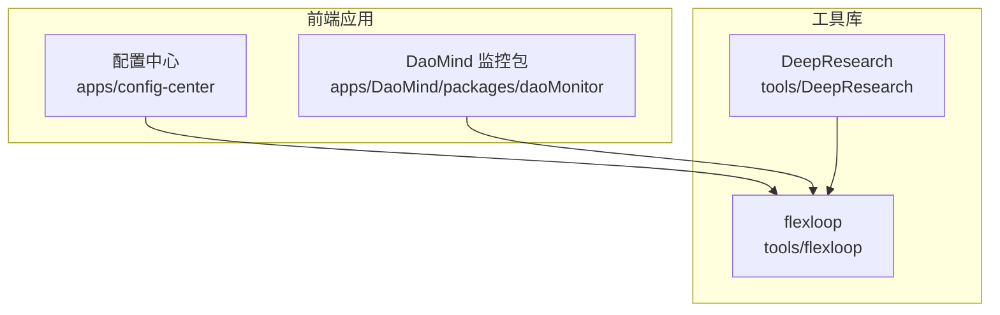
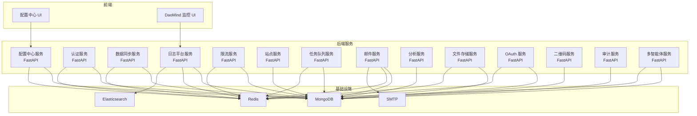
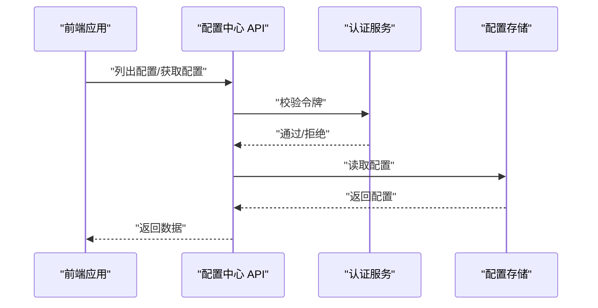
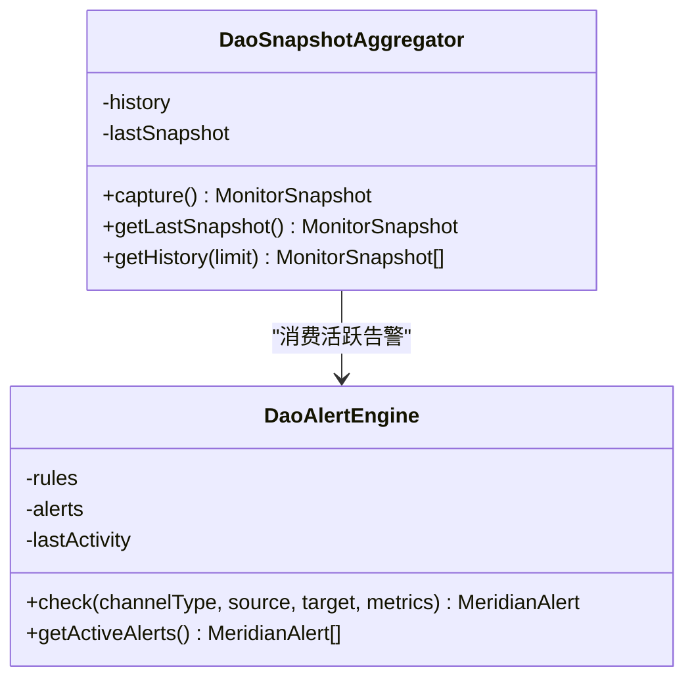
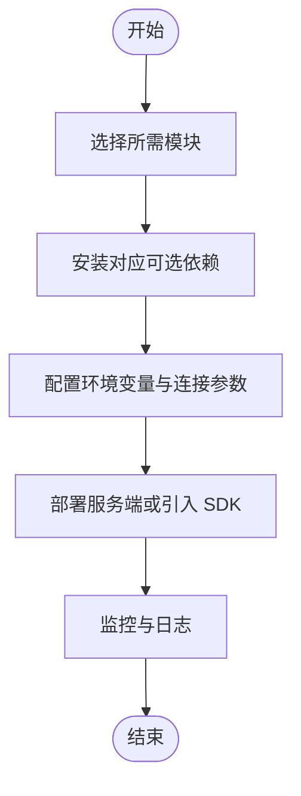
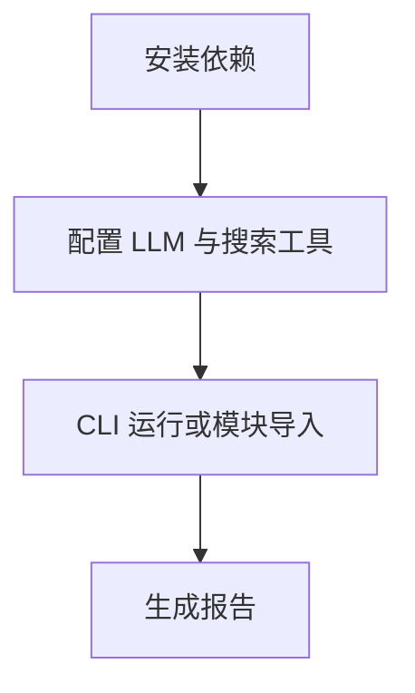
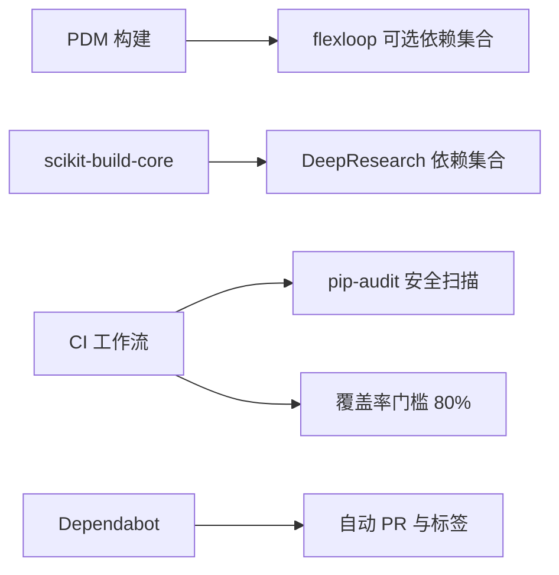

# 部署运维

<cite>
**本文引用的文件**
- [tools/DeepResearch/doc/deployment/deployment.md](file://tools/DeepResearch/doc/deployment/deployment.md)
- [tools/DeepResearch/pyproject.toml](file://tools/DeepResearch/pyproject.toml)
- [tools/flexloop/pyproject.toml](file://tools/flexloop/pyproject.toml)
- [tools/flexloop/.github/workflows/ci.yml](file://tools/flexloop/.github/workflows/ci.yml)
- [tools/flexloop/.github/workflows/pages.yml](file://tools/flexloop/.github/workflows/pages.yml)
- [tools/flexloop/.github/dependabot.yml](file://tools/flexloop/.github/dependabot.yml)
- [tools/flexloop/README.md](file://tools/flexloop/README.md)
- [apps/config-center/src/api/configs.ts](file://apps/config-center/src/api/configs.ts)
- [apps/DaoMind/packages/daoMonitor/src/snapshot.ts](file://apps/DaoMind/packages/daoMonitor/src/snapshot.ts)
- [apps/DaoMind/packages/daoMonitor/src/alerts.ts](file://apps/DaoMind/packages/daoMonitor/src/alerts.ts)
- [apps/DaoMind/tests/test-monitor-system.test.ts](file://apps/DaoMind/tests/test-monitor-system.test.ts)
- [tools/DeepResearch/tests/performance/stability_test.py](file://tools/DeepResearch/tests/performance/stability_test.py)
- [tools/flexloop/src/taolib/testing/config_center/server/api/push.py](file://tools/flexloop/src/taolib/testing/config_center/server/api/push.py)
- [tools/flexloop/tests/testing/dev-environment.yml](file://tools/flexloop/tests/testing/dev-environment.yml)
- [tools/flexloop/.trae/specs/container_workflow_fix/spec.md](file://tools/flexloop/.trae/specs/container_workflow_fix/spec.md)
- [tools/flexloop/.trae/specs/container_workflow_fix/checklist.md](file://tools/flexloop/.trae/specs/container_workflow_fix/checklist.md)
- [tools/flexloop/.trae/specs/container_workflow_fix/tasks.md](file://tools/flexloop/.trae/specs/container_workflow_fix/tasks.md)
</cite>

## 目录
1. [简介](#简介)
2. [项目结构](#项目结构)
3. [核心组件](#核心组件)
4. [架构总览](#架构总览)
5. [详细组件分析](#详细组件分析)
6. [依赖关系分析](#依赖关系分析)
7. [性能考量](#性能考量)
8. [故障排查指南](#故障排查指南)
9. [结论](#结论)
10. [附录](#附录)

## 简介
本文件面向 DAO Collective 项目，提供一套系统化的部署与运维指南。内容涵盖部署架构设计、CI/CD 流程配置、各应用的部署要求与配置项、容器化与微服务运维考虑、监控与日志策略、生产环境部署与配置最佳实践、性能监控与告警、故障恢复流程、数据库与缓存配置、第三方服务集成，以及运维脚本与自动化工具链的使用方法。

## 项目结构
DAO Collective 由多子应用与工具库构成，核心包括前端应用（如配置中心、DaoMind 监控包）、Python 工具库（flexloop）与研究型工具（DeepResearch）。整体采用多包/多应用的 monorepo 结构，便于统一测试、发布与文档维护。

图示来源
- [tools/flexloop/pyproject.toml](file://tools/flexloop/pyproject.toml)
- [apps/config-center/src/api/configs.ts](file://apps/config-center/src/api/configs.ts)
- [apps/DaoMind/packages/daoMonitor/src/snapshot.ts](file://apps/DaoMind/packages/daoMonitor/src/snapshot.ts)

章节来源
- [tools/flexloop/pyproject.toml](file://tools/flexloop/pyproject.toml)
- [tools/DeepResearch/pyproject.toml](file://tools/DeepResearch/pyproject.toml)

## 核心组件
- 配置中心（前端）：提供配置的增删改查、版本管理与审计日志，前端通过 API 与后端交互。
- DaoMind 监控包：提供快照采集、热力图、向量场、仪表盘、告警与诊断等能力，用于系统健康度评估。
- flexloop 工具库：提供认证、配置中心、数据同步、日志平台、限流、站点、任务队列、邮件服务、分析、文件存储、OAuth、二维码、审计、多智能体等模块，配套丰富的可选依赖与测试覆盖。
- DeepResearch：研究型工具，提供 LLM 协作研究框架，包含 CLI、配置与测试体系。

章节来源
- [apps/config-center/src/api/configs.ts](file://apps/config-center/src/api/configs.ts)
- [apps/DaoMind/packages/daoMonitor/src/snapshot.ts](file://apps/DaoMind/packages/daoMonitor/src/snapshot.ts)
- [apps/DaoMind/packages/daoMonitor/src/alerts.ts](file://apps/DaoMind/packages/daoMonitor/src/alerts.ts)
- [tools/flexloop/pyproject.toml](file://tools/flexloop/pyproject.toml)
- [tools/DeepResearch/pyproject.toml](file://tools/DeepResearch/pyproject.toml)

## 架构总览
整体采用“前端应用 + 工具库（后端服务与 SDK）”的架构。前端应用通过 API 与工具库提供的服务交互；工具库内部按功能拆分为多个子模块，部分模块自带 FastAPI 服务端，支持独立部署或作为 SDK 被前端调用。

图示来源
- [tools/flexloop/pyproject.toml](file://tools/flexloop/pyproject.toml)

## 详细组件分析

### 配置中心（前端应用）
- 功能要点
  - 列表查询、详情获取、创建、更新、删除、发布配置。
  - 支持按环境、服务、状态等筛选。
- 部署要求
  - 前端应用需能访问后端服务端点，确保网络连通与鉴权有效。
- 配置项
  - 后端服务地址、鉴权令牌、环境与服务维度的配置键值。
- 运维关注
  - 发布流程与版本审计，确保变更可追溯。
  - WebSocket 推送端点用于实时配置变更通知。

图示来源
- [apps/config-center/src/api/configs.ts](file://apps/config-center/src/api/configs.ts)
- [tools/flexloop/src/taolib/testing/config_center/server/api/push.py](file://tools/flexloop/src/taolib/testing/config_center/server/api/push.py)

章节来源
- [apps/config-center/src/api/configs.ts](file://apps/config-center/src/api/configs.ts)
- [tools/flexloop/src/taolib/testing/config_center/server/api/push.py](file://tools/flexloop/src/taolib/testing/config_center/server/api/push.py)

### DaoMind 监控包
- 功能要点
  - 快照聚合：热力图、流向向量、仪表盘、活跃告警、诊断结果。
  - 告警引擎：基于规则触发，支持严重级别与描述模板。
  - 健康度计算：综合告警、仪表盘与诊断结果得出系统健康分数。
- 部署要求
  - 前端监控 UI 与后端日志平台服务协同，确保数据采集与展示链路畅通。
- 配置项
  - 规则条件、严重级别、描述模板、阈值。
- 运维关注
  - 健康度阈值与告警联动，定期复盘诊断结果。

图示来源
- [apps/DaoMind/packages/daoMonitor/src/snapshot.ts](file://apps/DaoMind/packages/daoMonitor/src/snapshot.ts)
- [apps/DaoMind/packages/daoMonitor/src/alerts.ts](file://apps/DaoMind/packages/daoMonitor/src/alerts.ts)

章节来源
- [apps/DaoMind/packages/daoMonitor/src/snapshot.ts](file://apps/DaoMind/packages/daoMonitor/src/snapshot.ts)
- [apps/DaoMind/packages/daoMonitor/src/alerts.ts](file://apps/DaoMind/packages/daoMonitor/src/alerts.ts)
- [apps/DaoMind/tests/test-monitor-system.test.ts](file://apps/DaoMind/tests/test-monitor-system.test.ts)

### flexloop 工具库（后端服务与 SDK）
- 模块与可选依赖
  - 认证、配置中心、数据同步、日志平台、限流、站点、任务队列、邮件服务、分析、文件存储、OAuth、二维码、审计、多智能体等。
  - 每个模块提供服务端与客户端 SDK，便于按需组合。
- 部署要求
  - Python 版本要求与依赖安装；按需启用对应模块的可选依赖。
- 配置项
  - 各模块通过 Pydantic Settings 与环境变量进行配置，支持 MongoDB、Redis、Elasticsearch、SMTP 等外部依赖。
- 运维关注
  - 模块化部署，独立扩缩容；统一测试与覆盖率门槛；安全扫描与依赖审计。

图示来源
- [tools/flexloop/pyproject.toml](file://tools/flexloop/pyproject.toml)

章节来源
- [tools/flexloop/pyproject.toml](file://tools/flexloop/pyproject.toml)
- [tools/flexloop/README.md](file://tools/flexloop/README.md)

### DeepResearch（研究型工具）
- 功能要点
  - 基于多 LLM 的协作研究框架，支持 CLI 与模块导入。
- 部署要求
  - Python 版本与构建依赖；LLM 与搜索工具配置。
- 配置项
  - LLM API 基础地址、模型名、密钥；搜索工具引擎与密钥。
- 运维关注
  - 日志目录与依赖版本；性能稳定性测试。

图示来源
- [tools/DeepResearch/doc/deployment/deployment.md](file://tools/DeepResearch/doc/deployment/deployment.md)
- [tools/DeepResearch/pyproject.toml](file://tools/DeepResearch/pyproject.toml)

章节来源
- [tools/DeepResearch/doc/deployment/deployment.md](file://tools/DeepResearch/doc/deployment/deployment.md)
- [tools/DeepResearch/pyproject.toml](file://tools/DeepResearch/pyproject.toml)

## 依赖关系分析
- 语言与构建
  - flexloop 使用 PDM 作为构建与依赖管理，Python 版本要求 3.14+。
  - DeepResearch 使用 scikit-build-core 作为构建后端，wheel 安装目录位于 src。
- 依赖管理与安全
  - CI 中包含 pip-audit 安全扫描与覆盖率检查。
  - Dependabot 自动化依赖升级与审阅人分配。
- 模块间耦合
  - 各模块通过可选依赖解耦，按需启用；公共依赖（如 Pydantic、Motor、Redis）在多模块复用。

图示来源
- [tools/flexloop/pyproject.toml](file://tools/flexloop/pyproject.toml)
- [tools/DeepResearch/pyproject.toml](file://tools/DeepResearch/pyproject.toml)
- [tools/flexloop/.github/workflows/ci.yml](file://tools/flexloop/.github/workflows/ci.yml)
- [tools/flexloop/.github/dependabot.yml](file://tools/flexloop/.github/dependabot.yml)

章节来源
- [tools/flexloop/pyproject.toml](file://tools/flexloop/pyproject.toml)
- [tools/DeepResearch/pyproject.toml](file://tools/DeepResearch/pyproject.toml)
- [tools/flexloop/.github/workflows/ci.yml](file://tools/flexloop/.github/workflows/ci.yml)
- [tools/flexloop/.github/dependabot.yml](file://tools/flexloop/.github/dependabot.yml)

## 性能考量
- 性能测试与稳定性
  - DeepResearch 提供性能稳定性测试脚本，持续监控响应时间、CPU/内存使用与成功率。
- 监控与告警
  - DaoMind 监控包内置告警引擎，支持规则化阈值与严重级别；结合健康度计算，形成闭环。
- 限流与队列
  - flexloop 提供限流与任务队列模块，建议在高并发场景启用并合理配置 Redis/Mongo 存储。

章节来源
- [tools/DeepResearch/tests/performance/stability_test.py](file://tools/DeepResearch/tests/performance/stability_test.py)
- [apps/DaoMind/packages/daoMonitor/src/alerts.ts](file://apps/DaoMind/packages/daoMonitor/src/alerts.ts)
- [tools/flexloop/pyproject.toml](file://tools/flexloop/pyproject.toml)

## 故障排查指南
- 常见问题定位
  - LLM/搜索工具调用失败：检查 API 密钥与权限；核对配置文件。
  - 系统运行缓慢：增加资源、优化 LLM 生成长度、更换高效搜索引擎。
  - 日志查看：系统日志位于 logs 目录。
- 依赖与版本
  - 确保 Python 版本满足要求，依赖版本兼容。
- 容器化与工作流
  - 项目为纯 Python 库，无需容器化；CI 工作流已清理不适用的容器工作流文件。

章节来源
- [tools/DeepResearch/doc/deployment/deployment.md](file://tools/DeepResearch/doc/deployment/deployment.md)
- [tools/flexloop/.trae/specs/container_workflow_fix/spec.md](file://tools/flexloop/.trae/specs/container_workflow_fix/spec.md)
- [tools/flexloop/.trae/specs/container_workflow_fix/checklist.md](file://tools/flexloop/.trae/specs/container_workflow_fix/checklist.md)
- [tools/flexloop/.trae/specs/container_workflow_fix/tasks.md](file://tools/flexloop/.trae/specs/container_workflow_fix/tasks.md)

## 结论
DAO Collective 项目通过模块化的工具库与多前端应用，实现了灵活的部署与运维能力。建议在生产环境中遵循统一的 CI/CD 流程、严格的依赖与安全审计、模块化服务部署与监控告警体系，确保系统稳定、可观测与可扩展。

## 附录

### CI/CD 流程配置
- 测试与覆盖率
  - 使用 pytest 执行测试，覆盖率报告与 HTML 报告上传；覆盖率门槛 80%。
- 代码规范与安全
  - pre-commit 钩子执行静态检查；pip-audit 执行依赖安全扫描。
- 文档与发布
  - Pages 工作流用于静态内容部署；PDM SCM 版本管理。

章节来源
- [tools/flexloop/.github/workflows/ci.yml](file://tools/flexloop/.github/workflows/ci.yml)
- [tools/flexloop/.github/workflows/pages.yml](file://tools/flexloop/.github/workflows/pages.yml)
- [tools/flexloop/.github/dependabot.yml](file://tools/flexloop/.github/dependabot.yml)

### 生产环境部署指南与最佳实践
- 环境要求
  - Python 版本与硬件资源满足各模块需求；容器化方面，项目为纯 Python 库，无需 Docker 容器构建。
- 数据库与缓存
  - MongoDB 与 Redis 作为默认存储；Elasticsearch 用于日志平台；按需横向扩展。
- 第三方服务集成
  - LLM 与搜索工具需配置 API 密钥；邮件服务需配置 SMTP。
- 配置中心与推送
  - 通过 API 管理配置与发布；WebSocket 推送用于实时通知。

章节来源
- [tools/DeepResearch/doc/deployment/deployment.md](file://tools/DeepResearch/doc/deployment/deployment.md)
- [tools/flexloop/pyproject.toml](file://tools/flexloop/pyproject.toml)
- [apps/config-center/src/api/configs.ts](file://apps/config-center/src/api/configs.ts)
- [tools/flexloop/src/taolib/testing/config_center/server/api/push.py](file://tools/flexloop/src/taolib/testing/config_center/server/api/push.py)

### 运维脚本与自动化工具链
- 开发环境
  - 提供 conda 环境配置示例，包含 Python、Jupyter、Black 等工具。
- 文档构建
  - 使用 Invoke 与 Sphinx 构建文档，支持本地预览。
- 测试与覆盖率
  - pytest 集成覆盖率统计与 HTML 报告生成。

章节来源
- [tools/flexloop/tests/testing/dev-environment.yml](file://tools/flexloop/tests/testing/dev-environment.yml)
- [tools/flexloop/README.md](file://tools/flexloop/README.md)
- [tools/flexloop/.github/workflows/ci.yml](file://tools/flexloop/.github/workflows/ci.yml)