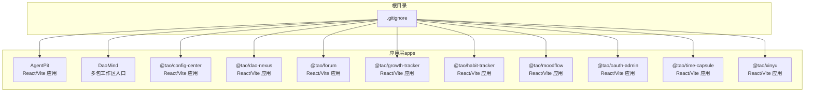
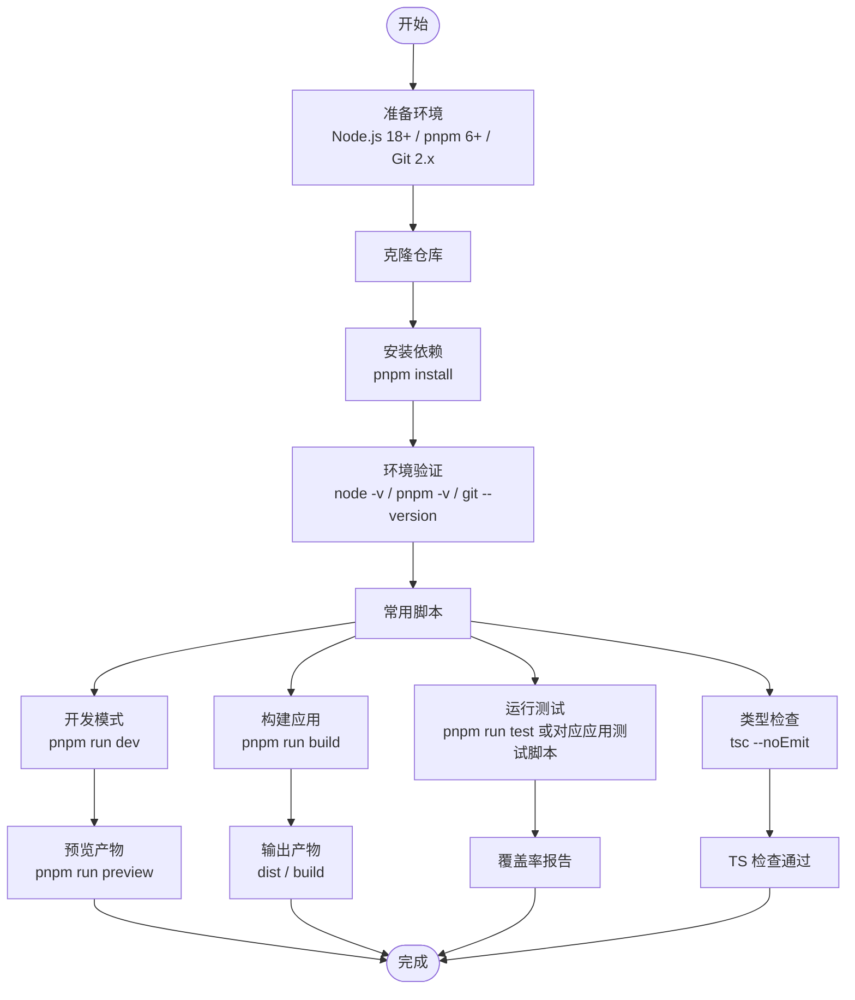
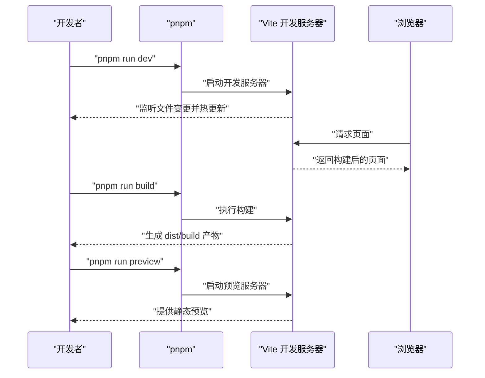
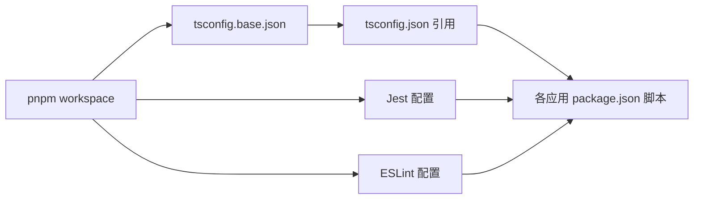

# 快速开始

<cite>
**本文引用的文件**
- [apps/DaoMind/package.json](file://apps/DaoMind/package.json)
- [apps/DaoMind/pnpm-workspace.yaml](file://apps/DaoMind/pnpm-workspace.yaml)
- [apps/DaoMind/tsconfig.base.json](file://apps/DaoMind/tsconfig.base.json)
- [apps/DaoMind/tsconfig.json](file://apps/DaoMind/tsconfig.json)
- [apps/DaoMind/jest.config.js](file://apps/DaoMind/jest.config.js)
- [apps/DaoMind/eslint.config.js](file://apps/DaoMind/eslint.config.js)
- [apps/AgentPit/package.json](file://apps/AgentPit/package.json)
- [apps/config-center/package.json](file://apps/config-center/package.json)
- [apps/daoNexus/package.json](file://apps/daoNexus/package.json)
- [apps/forum/package.json](file://apps/forum/package.json)
- [apps/growth-tracker/package.json](file://apps/growth-tracker/package.json)
- [apps/habit-tracker/package.json](file://apps/habit-tracker/package.json)
- [apps/moodflow/package.json](file://apps/moodflow/package.json)
- [apps/oauth-admin/package.json](file://apps/oauth-admin/package.json)
- [apps/time-capsule/package.json](file://apps/time-capsule/package.json)
- [apps/xinyu/package.json](file://apps/xinyu/package.json)
- [.gitignore](file://.gitignore)
</cite>

## 目录
1. [简介](#简介)
2. [项目结构](#项目结构)
3. [核心组件](#核心组件)
4. [架构总览](#架构总览)
5. [详细组件分析](#详细组件分析)
6. [依赖关系分析](#依赖关系分析)
7. [性能考虑](#性能考虑)
8. [故障排除指南](#故障排除指南)
9. [结论](#结论)
10. [附录](#附录)

## 简介
本指南面向首次接触 DAO Collective 项目的开发者，提供从零到一的完整快速开始路径：环境准备、项目克隆、依赖安装、环境验证、运行与构建示例，以及常见问题排查。项目采用多包工作区（pnpm workspace）组织前端应用与工具模块，统一的 TypeScript 配置与测试/代码质量工具链贯穿各子包。

## 项目结构
DAO Collective 仓库采用 monorepo 结构，核心在 apps 目录下包含多个前端应用与工具模块。根目录提供通用忽略规则，DaoMind 应用作为主要的多包工作区入口，定义了 TypeScript 基础配置与 Jest 测试配置，并通过 pnpm workspace 管理子包。

图表来源
- [.gitignore](file://.gitignore)
- [apps/AgentPit/package.json](file://apps/AgentPit/package.json)
- [apps/config-center/package.json](file://apps/config-center/package.json)
- [apps/daoNexus/package.json](file://apps/daoNexus/package.json)
- [apps/forum/package.json](file://apps/forum/package.json)
- [apps/growth-tracker/package.json](file://apps/growth-tracker/package.json)
- [apps/habit-tracker/package.json](file://apps/habit-tracker/package.json)
- [apps/moodflow/package.json](file://apps/moodflow/package.json)
- [apps/oauth-admin/package.json](file://apps/oauth-admin/package.json)
- [apps/time-capsule/package.json](file://apps/time-capsule/package.json)
- [apps/xinyu/package.json](file://apps/xinyu/package.json)

章节来源
- [.gitignore](file://.gitignore)
- [apps/DaoMind/pnpm-workspace.yaml](file://apps/DaoMind/pnpm-workspace.yaml)

## 核心组件
- 多包工作区（pnpm workspace）
  - 通过 pnpm workspace 组织各应用与共享包，实现依赖复用与统一安装。
  - 参考：[apps/DaoMind/pnpm-workspace.yaml](file://apps/DaoMind/pnpm-workspace.yaml)
- TypeScript 配置
  - 基础配置与复合编译引用，确保跨包类型检查与构建一致性。
  - 参考：[apps/DaoMind/tsconfig.base.json](file://apps/DaoMind/tsconfig.base.json)、[apps/DaoMind/tsconfig.json](file://apps/DaoMind/tsconfig.json)
- 测试与代码质量
  - Jest 测试配置与 ESLint 规则，覆盖多包源码与测试文件。
  - 参考：[apps/DaoMind/jest.config.js](file://apps/DaoMind/jest.config.js)、[apps/DaoMind/eslint.config.js](file://apps/DaoMind/eslint.config.js)
- 应用脚本与引擎约束
  - 各应用 package.json 定义了开发、构建、预览、类型检查、测试等常用脚本；部分应用声明了 Node 引擎版本要求。
  - 参考：[apps/DaoMind/package.json](file://apps/DaoMind/package.json)、[apps/AgentPit/package.json](file://apps/AgentPit/package.json)、[apps/config-center/package.json](file://apps/config-center/package.json)、[apps/daoNexus/package.json](file://apps/daoNexus/package.json)、[apps/forum/package.json](file://apps/forum/package.json)、[apps/growth-tracker/package.json](file://apps/growth-tracker/package.json)、[apps/habit-tracker/package.json](file://apps/habit-tracker/package.json)、[apps/moodflow/package.json](file://apps/moodflow/package.json)、[apps/oauth-admin/package.json](file://apps/oauth-admin/package.json)、[apps/time-capsule/package.json](file://apps/time-capsule/package.json)、[apps/xinyu/package.json](file://apps/xinyu/package.json)

章节来源
- [apps/DaoMind/pnpm-workspace.yaml](file://apps/DaoMind/pnpm-workspace.yaml)
- [apps/DaoMind/tsconfig.base.json](file://apps/DaoMind/tsconfig.base.json)
- [apps/DaoMind/tsconfig.json](file://apps/DaoMind/tsconfig.json)
- [apps/DaoMind/jest.config.js](file://apps/DaoMind/jest.config.js)
- [apps/DaoMind/eslint.config.js](file://apps/DaoMind/eslint.config.js)
- [apps/DaoMind/package.json](file://apps/DaoMind/package.json)
- [apps/AgentPit/package.json](file://apps/AgentPit/package.json)
- [apps/config-center/package.json](file://apps/config-center/package.json)
- [apps/daoNexus/package.json](file://apps/daoNexus/package.json)
- [apps/forum/package.json](file://apps/forum/package.json)
- [apps/growth-tracker/package.json](file://apps/growth-tracker/package.json)
- [apps/habit-tracker/package.json](file://apps/habit-tracker/package.json)
- [apps/moodflow/package.json](file://apps/moodflow/package.json)
- [apps/oauth-admin/package.json](file://apps/oauth-admin/package.json)
- [apps/time-capsule/package.json](file://apps/time-capsule/package.json)
- [apps/xinyu/package.json](file://apps/xinyu/package.json)

## 架构总览
下图展示了从本地开发到应用构建与测试的整体流程，涵盖环境准备、依赖安装、脚本执行与产物生成的关键节点。

## 详细组件分析

### 环境准备与工具链
- 操作系统要求
  - Windows 10+、macOS 10.15+、Linux Ubuntu 20.04+
- 编程语言与工具
  - Node.js 18.0+（部分应用声明 engines 要求）
  - TypeScript 6.0+（部分应用声明 devDependencies 版本）
  - pnpm 6.0+（工作区管理）
  - Git 2.20+（版本控制）

章节来源
- [apps/DaoMind/package.json](file://apps/DaoMind/package.json)
- [apps/AgentPit/package.json](file://apps/AgentPit/package.json)
- [apps/config-center/package.json](file://apps/config-center/package.json)
- [apps/daoNexus/package.json](file://apps/daoNexus/package.json)
- [apps/forum/package.json](file://apps/forum/package.json)
- [apps/growth-tracker/package.json](file://apps/growth-tracker/package.json)
- [apps/habit-tracker/package.json](file://apps/habit-tracker/package.json)
- [apps/moodflow/package.json](file://apps/moodflow/package.json)
- [apps/oauth-admin/package.json](file://apps/oauth-admin/package.json)
- [apps/time-capsule/package.json](file://apps/time-capsule/package.json)
- [apps/xinyu/package.json](file://apps/xinyu/package.json)

### 安装与初始化
- 步骤概览
  1) 准备 Node.js 18+、pnpm 6+、Git 2+ 环境并验证版本。
  2) 克隆仓库后，在根目录或应用目录执行 pnpm install 完成依赖安装。
  3) 使用 pnpm run dev 在目标应用目录启动开发服务器。
  4) 使用 pnpm run build 进行生产构建。
  5) 使用 pnpm run test 或各应用测试脚本运行单元/集成测试。
  6) 使用 tsc --noEmit 执行全局类型检查。
- 关键脚本参考
  - 通用构建与测试：参见 [apps/DaoMind/package.json](file://apps/DaoMind/package.json)
  - 各应用脚本（dev/build/test/typecheck/preview）：参见
    - [apps/AgentPit/package.json](file://apps/AgentPit/package.json)
    - [apps/config-center/package.json](file://apps/config-center/package.json)
    - [apps/daoNexus/package.json](file://apps/daoNexus/package.json)
    - [apps/forum/package.json](file://apps/forum/package.json)
    - [apps/growth-tracker/package.json](file://apps/growth-tracker/package.json)
    - [apps/habit-tracker/package.json](file://apps/habit-tracker/package.json)
    - [apps/moodflow/package.json](file://apps/moodflow/package.json)
    - [apps/oauth-admin/package.json](file://apps/oauth-admin/package.json)
    - [apps/time-capsule/package.json](file://apps/time-capsule/package.json)
    - [apps/xinyu/package.json](file://apps/xinyu/package.json)

章节来源
- [apps/DaoMind/package.json](file://apps/DaoMind/package.json)
- [apps/AgentPit/package.json](file://apps/AgentPit/package.json)
- [apps/config-center/package.json](file://apps/config-center/package.json)
- [apps/daoNexus/package.json](file://apps/daoNexus/package.json)
- [apps/forum/package.json](file://apps/forum/package.json)
- [apps/growth-tracker/package.json](file://apps/growth-tracker/package.json)
- [apps/habit-tracker/package.json](file://apps/habit-tracker/package.json)
- [apps/moodflow/package.json](file://apps/moodflow/package.json)
- [apps/oauth-admin/package.json](file://apps/oauth-admin/package.json)
- [apps/time-capsule/package.json](file://apps/time-capsule/package.json)
- [apps/xinyu/package.json](file://apps/xinyu/package.json)

### 基本使用示例
- 运行项目
  - 在任一应用目录执行 pnpm run dev 启动开发服务器。
  - 示例参考：[apps/AgentPit/package.json](file://apps/AgentPit/package.json)、[apps/config-center/package.json](file://apps/config-center/package.json)、[apps/daoNexus/package.json](file://apps/daoNexus/package.json)、[apps/forum/package.json](file://apps/forum/package.json)、[apps/growth-tracker/package.json](file://apps/growth-tracker/package.json)、[apps/habit-tracker/package.json](file://apps/habit-tracker/package.json)、[apps/moodflow/package.json](file://apps/moodflow/package.json)、[apps/oauth-admin/package.json](file://apps/oauth-admin/package.json)、[apps/time-capsule/package.json](file://apps/time-capsule/package.json)、[apps/xinyu/package.json](file://apps/xinyu/package.json)
- 构建应用
  - 在任一应用目录执行 pnpm run build 生成生产构建产物。
  - 示例参考：同上各应用 package.json 的 build 脚本。
- 运行测试
  - 在根目录执行 pnpm run test 运行 Jest 测试（DaoMind 工作区）。
  - 在各应用目录执行 pnpm run test 或对应测试脚本（如 vitest）。
  - 示例参考：
    - [apps/DaoMind/package.json](file://apps/DaoMind/package.json)（Jest）
    - [apps/config-center/package.json](file://apps/config-center/package.json)（Vitest）
    - [apps/forum/package.json](file://apps/forum/package.json)（Vitest）
    - [apps/oauth-admin/package.json](file://apps/oauth-admin/package.json)（Vitest）
- 类型检查
  - 在任一应用目录执行 tsc --noEmit 进行类型检查。
  - 示例参考：各应用 package.json 的 typecheck 脚本。

章节来源
- [apps/DaoMind/package.json](file://apps/DaoMind/package.json)
- [apps/AgentPit/package.json](file://apps/AgentPit/package.json)
- [apps/config-center/package.json](file://apps/config-center/package.json)
- [apps/daoNexus/package.json](file://apps/daoNexus/package.json)
- [apps/forum/package.json](file://apps/forum/package.json)
- [apps/growth-tracker/package.json](file://apps/growth-tracker/package.json)
- [apps/habit-tracker/package.json](file://apps/habit-tracker/package.json)
- [apps/moodflow/package.json](file://apps/moodflow/package.json)
- [apps/oauth-admin/package.json](file://apps/oauth-admin/package.json)
- [apps/time-capsule/package.json](file://apps/time-capsule/package.json)
- [apps/xinyu/package.json](file://apps/xinyu/package.json)

### 代码级流程示意（以典型 React/Vite 应用为例）
以下序列图展示从开发到预览的典型流程，适用于大多数前端应用（如 AgentPit、config-center 等）。

图表来源
- [apps/AgentPit/package.json](file://apps/AgentPit/package.json)
- [apps/config-center/package.json](file://apps/config-center/package.json)
- [apps/daoNexus/package.json](file://apps/daoNexus/package.json)
- [apps/forum/package.json](file://apps/forum/package.json)
- [apps/growth-tracker/package.json](file://apps/growth-tracker/package.json)
- [apps/habit-tracker/package.json](file://apps/habit-tracker/package.json)
- [apps/moodflow/package.json](file://apps/moodflow/package.json)
- [apps/oauth-admin/package.json](file://apps/oauth-admin/package.json)
- [apps/time-capsule/package.json](file://apps/time-capsule/package.json)
- [apps/xinyu/package.json](file://apps/xinyu/package.json)

## 依赖关系分析
- 工作区与包管理
  - pnpm workspace 将多包统一管理，减少重复安装与提升安装速度。
  - 参考：[apps/DaoMind/pnpm-workspace.yaml](file://apps/DaoMind/pnpm-workspace.yaml)
- TypeScript 复合编译
  - 通过 tsconfig.base.json 与 tsconfig.json 的复合引用，确保跨包类型一致与增量编译。
  - 参考：[apps/DaoMind/tsconfig.base.json](file://apps/DaoMind/tsconfig.base.json)、[apps/DaoMind/tsconfig.json](file://apps/DaoMind/tsconfig.json)
- 测试与代码质量
  - Jest 配置覆盖多包源码与测试文件，ESLint 规则统一风格与潜在问题。
  - 参考：[apps/DaoMind/jest.config.js](file://apps/DaoMind/jest.config.js)、[apps/DaoMind/eslint.config.js](file://apps/DaoMind/eslint.config.js)

图表来源
- [apps/DaoMind/pnpm-workspace.yaml](file://apps/DaoMind/pnpm-workspace.yaml)
- [apps/DaoMind/tsconfig.base.json](file://apps/DaoMind/tsconfig.base.json)
- [apps/DaoMind/tsconfig.json](file://apps/DaoMind/tsconfig.json)
- [apps/DaoMind/jest.config.js](file://apps/DaoMind/jest.config.js)
- [apps/DaoMind/eslint.config.js](file://apps/DaoMind/eslint.config.js)
- [apps/DaoMind/package.json](file://apps/DaoMind/package.json)

章节来源
- [apps/DaoMind/pnpm-workspace.yaml](file://apps/DaoMind/pnpm-workspace.yaml)
- [apps/DaoMind/tsconfig.base.json](file://apps/DaoMind/tsconfig.base.json)
- [apps/DaoMind/tsconfig.json](file://apps/DaoMind/tsconfig.json)
- [apps/DaoMind/jest.config.js](file://apps/DaoMind/jest.config.js)
- [apps/DaoMind/eslint.config.js](file://apps/DaoMind/eslint.config.js)
- [apps/DaoMind/package.json](file://apps/DaoMind/package.json)

## 性能考虑
- 使用 pnpm workspace 统一安装与去重，降低磁盘占用与安装时间。
- 利用 TypeScript 复合编译与增量构建，缩短二次构建时间。
- 在大型测试场景中，合理拆分测试套件与并发策略，避免单测阻塞。
- 生产构建时启用压缩与最小化（如各应用使用的 terser），平衡体积与加载性能。

## 故障排除指南
- Node 版本不满足要求
  - 症状：安装或运行时报错，提示 Node 版本过低。
  - 解决：升级至 Node.js 18.0+。
  - 参考：[apps/DaoMind/package.json](file://apps/DaoMind/package.json)
- pnpm 版本过低
  - 症状：pnpm install 报错或工作区无法识别。
  - 解决：升级至 pnpm 6.0+。
- Git 版本过低
  - 症状：克隆或提交相关操作失败。
  - 解决：升级至 Git 2.20+。
- 依赖安装失败（网络/权限）
  - 症状：pnpm install 卡住或报错。
  - 解决：检查网络与代理设置，必要时更换镜像源；确保对仓库目录有写权限。
- 类型检查失败
  - 症状：tsc 报错或 CI 中类型检查失败。
  - 解决：修复类型错误；在应用目录执行 tsc --noEmit 进行逐项排查。
- 测试失败或覆盖率不足
  - 症状：Jest/Vitest 测试失败或覆盖率低于阈值。
  - 解决：根据测试输出定位问题；补充缺失的测试用例；调整覆盖率阈值（谨慎）。
- 开发服务器端口冲突
  - 症状：pnpm run dev 提示端口被占用。
  - 解决：修改应用的 Vite 配置或关闭占用端口的进程。

章节来源
- [apps/DaoMind/package.json](file://apps/DaoMind/package.json)
- [apps/AgentPit/package.json](file://apps/AgentPit/package.json)
- [apps/config-center/package.json](file://apps/config-center/package.json)
- [apps/daoNexus/package.json](file://apps/daoNexus/package.json)
- [apps/forum/package.json](file://apps/forum/package.json)
- [apps/growth-tracker/package.json](file://apps/growth-tracker/package.json)
- [apps/habit-tracker/package.json](file://apps/habit-tracker/package.json)
- [apps/moodflow/package.json](file://apps/moodflow/package.json)
- [apps/oauth-admin/package.json](file://apps/oauth-admin/package.json)
- [apps/time-capsule/package.json](file://apps/time-capsule/package.json)
- [apps/xinyu/package.json](file://apps/xinyu/package.json)

## 结论
通过本快速开始指南，您可以在本地完成环境准备、项目克隆与依赖安装，并掌握运行开发服务器、构建应用、运行测试与类型检查等核心操作。遇到问题时，可依据“故障排除指南”逐项定位与解决。建议在后续开发中持续完善测试与类型检查，保持代码质量与可维护性。

## 附录
- 常用命令速查
  - 安装依赖：pnpm install
  - 启动开发：pnpm run dev（在具体应用目录）
  - 构建应用：pnpm run build（在具体应用目录）
  - 运行测试：pnpm run test（在 DaoMind 工作区）或各应用测试脚本
  - 类型检查：tsc --noEmit（在具体应用目录）
- 目录与文件清单（节选）
  - 工作区配置：[apps/DaoMind/pnpm-workspace.yaml](file://apps/DaoMind/pnpm-workspace.yaml)
  - TypeScript 基础配置：[apps/DaoMind/tsconfig.base.json](file://apps/DaoMind/tsconfig.base.json)、[apps/DaoMind/tsconfig.json](file://apps/DaoMind/tsconfig.json)
  - 测试配置：[apps/DaoMind/jest.config.js](file://apps/DaoMind/jest.config.js)
  - 代码质量：[apps/DaoMind/eslint.config.js](file://apps/DaoMind/eslint.config.js)
  - 通用忽略规则：[.gitignore](file://.gitignore)