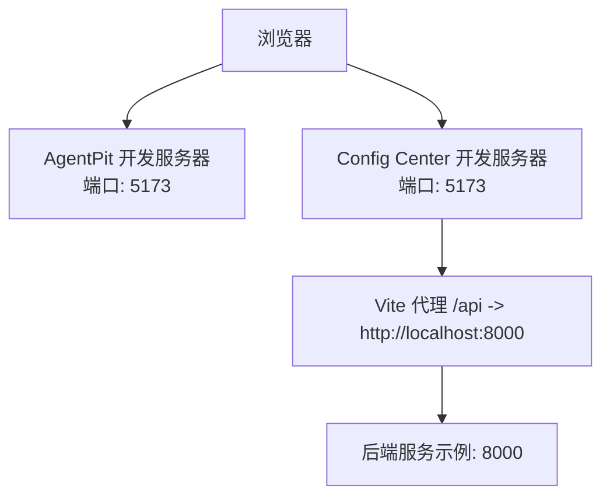
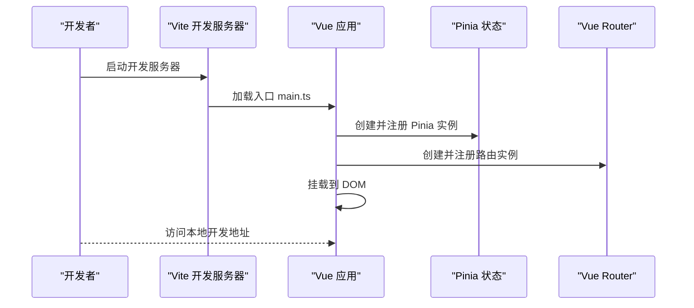
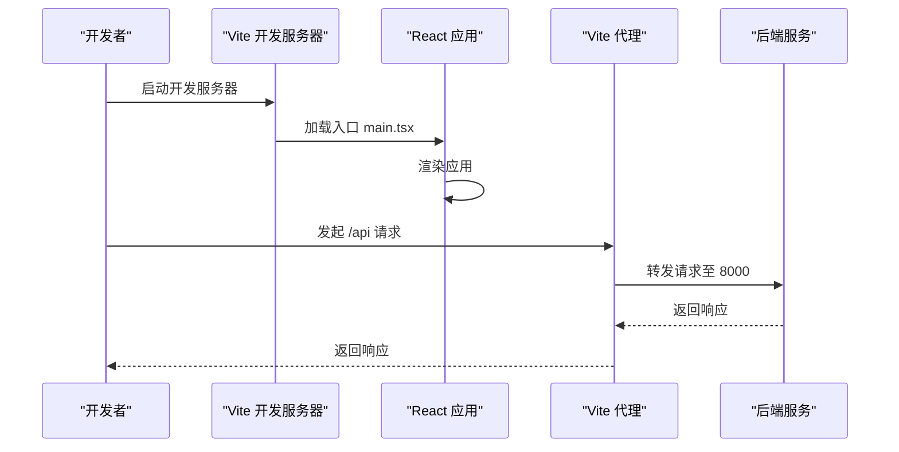
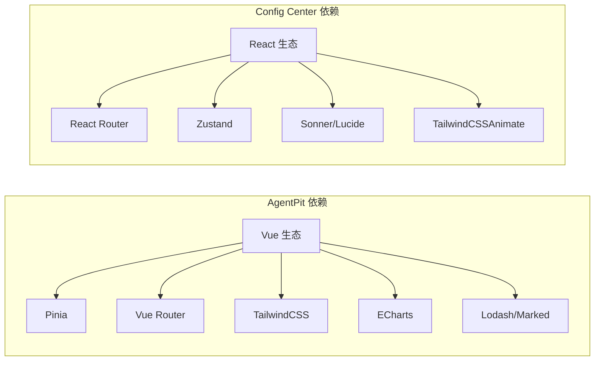

# 快速开始

<cite>
**本文引用的文件**   
- [apps/AgentPit/package.json](file://apps/AgentPit/package.json)
- [apps/AgentPit/vite.config.ts](file://apps/AgentPit/vite.config.ts)
- [apps/AgentPit/tailwind.config.ts](file://apps/AgentPit/tailwind.config.ts)
- [apps/AgentPit/src/main.ts](file://apps/AgentPit/src/main.ts)
- [apps/AgentPit/README.md](file://apps/AgentPit/README.md)
- [apps/config-center/package.json](file://apps/config-center/package.json)
- [apps/config-center/vite.config.ts](file://apps/config-center/vite.config.ts)
- [apps/config-center/tailwind.config.ts](file://apps/config-center/tailwind.config.ts)
- [apps/config-center/src/main.tsx](file://apps/config-center/src/main.tsx)
- [apps/DaoMind/package.json](file://apps/DaoMind/package.json)
- [apps/DaoMind/pnpm-workspace.yaml](file://apps/DaoMind/pnpm-workspace.yaml)
- [apps/DaoMind/packages/daoAgents/package.json](file://apps/DaoMind/packages/daoAgents/package.json)
- [apps/DaoMind/packages/daoApps/package.json](file://apps/DaoMind/packages/daoApps/package.json)
- [apps/DaoMind/packages/daoCollective/package.json](file://apps/DaoMind/packages/daoCollective/package.json)
- [apps/DaoMind/packages/daoDocs/package.json](file://apps/DaoMind/packages/daoDocs/package.json)
- [apps/DaoMind/packages/daoFeedback/package.json](file://apps/DaoMind/packages/daoFeedback/package.json)
- [apps/DaoMind/packages/daoMonitor/package.json](file://apps/DaoMind/packages/daoMonitor/package.json)
- [apps/DaoMind/packages/daoNexus/package.json](file://apps/DaoMind/packages/daoNexus/package.json)
- [apps/DaoMind/packages/daoQi/package.json](file://apps/DaoMind/packages/daoQi/package.json)
- [apps/DaoMind/packages/daoSkilLs/package.json](file://apps/DaoMind/packages/daoSkilLs/package.json)
- [apps/DaoMind/packages/daoSpaces/package.json](file://apps/DaoMind/packages/daoSpaces/package.json)
- [apps/DaoMind/packages/daoVerify/package.json](file://apps/DaoMind/packages/daoVerify/package.json)
- [apps/DaoMind/packages/daotimes/package.json](file://apps/DaoMind/packages/daotimes/package.json)
- [apps/DaoMind/packages/daoAnything/package.json](file://apps/DaoMind/packages/daoAnything/package.json)
- [apps/DaoMind/packages/daoBenchmark/package.json](file://apps/DaoMind/packages/daoBenchmark/package.json)
- [apps/DaoMind/packages/daoChronos/package.json](file://apps/DaoMind/packages/daoChronos/package.json)
- [apps/DaoMind/packages/daoPages/package.json](file://apps/DaoMind/packages/daoPages/package.json)
- [apps/DaoMind/packages/daoNothing/package.json](file://apps/DaoMind/packages/daoNothing/package.json)
- [apps/DaoMind/packages/daoTimes/package.json](file://apps/DaoMind/packages/daoTimes/package.json)
- [apps/DaoMind/packages/daoPages/package.json](file://apps/DaoMind/packages/daoPages/package.json)
- [apps/DaoMind/packages/daoQi/package.json](file://apps/DaoMind/packages/daoQi/package.json)
- [apps/DaoMind/packages/daoSkilLs/package.json](file://apps/DaoMind/packages/daoSkilLs/package.json)
- [apps/DaoMind/packages/daoSpaces/package.json](file://apps/DaoMind/packages/daoSpaces/package.json)
- [apps/DaoMind/packages/daoVerify/package.json](file://apps/DaoMind/packages/daoVerify/package.json)
- [apps/DaoMind/packages/daotimes/package.json](file://apps/DaoMind/packages/daotimes/package.json)
- [apps/DaoMind/packages/daoAnything/package.json](file://apps/DaoMind/packages/daoAnything/package.json)
- [apps/DaoMind/packages/daoBenchmark/package.json](file://apps/DaoMind/packages/daoBenchmark/package.json)
- [apps/DaoMind/packages/daoChronos/package.json](file://apps/DaoMind/packages/daoChronos/package.json)
- [apps/DaoMind/packages/daoPages/package.json](file://apps/DaoMind/packages/daoPages/package.json)
- [apps/DaoMind/packages/daoNothing/package.json](file://apps/DaoMind/packages/daoNothing/package.json)
- [apps/DaoMind/packages/daoTimes/package.json](file://apps/DaoMind/packages/daoTimes/package.json)
- [apps/DaoMind/packages/daoPages/package.json](file://apps/DaoMind/packages/daoPages/package.json)
- [apps/DaoMind/packages/daoQi/package.json](file://apps/DaoMind/packages/daoQi/package.json)
- [apps/DaoMind/packages/daoSkilLs/package.json](file://apps/DaoMind/packages/daoSkilLs/package.json)
- [apps/DaoMind/packages/daoSpaces/package.json](file://apps/DaoMind/packages/daoSpaces/package.json)
- [apps/DaoMind/packages/daoVerify/package.json](file://apps/DaoMind/packages/daoVerify/package.json)
- [apps/DaoMind/packages/daotimes/package.json](file://apps/DaoMind/packages/daotimes/package.json)
- [apps/DaoMind/packages/daoAnything/package.json](file://apps/DaoMind/packages/daoAnything/package.json)
- [apps/DaoMind/packages/daoBenchmark/package.json](file://apps/DaoMind/packages/daoBenchmark/package.json)
- [apps/DaoMind/packages/daoChronos/package.json](file://apps/DaoMind/packages/daoChronos/package.json)
- [apps/DaoMind/packages/daoPages/package.json](file://apps/DaoMind/packages/daoPages/package.json)
- [apps/DaoMind/packages/daoNothing/package.json](file://apps/DaoMind/packages/daoNothing/package.json)
- [apps/DaoMind/packages/daoTimes/package.json](file://apps/DaoMind/packages/daoTimes/package.json)
- [apps/DaoMind/packages/daoPages/package.json](file://apps/DaoMind/packages/daoPages/package.json)
- [apps/DaoMind/packages/daoQi/package.json](file://apps/DaoMind/packages/daoQi/package.json)
- [apps/DaoMind/packages/daoSkilLs/package.json](file://apps/DaoMind/packages/daoSkilLs/package.json)
- [apps/DaoMind/packages/daoSpaces/package.json](file://apps/DaoMind/packages/daoSpaces/package.json)
- [apps/DaoMind/packages/daoVerify/package.json](file://apps/DaoMind/packages/daoVerify/package.json)
- [apps/DaoMind/packages/daotimes/package.json](file://apps/DaoMind/packages/daotimes/package.json)
- [apps/DaoMind/packages/daoAnything/package.json](file://apps/DaoMind/packages/daoAnything/package.json)
- [apps/DaoMind/packages/daoBenchmark/package.json](file://apps/DaoMind/packages/daoBenchmark/package.json)
- [apps/DaoMind/packages/daoChronos/package.json](file://apps/DaoMind/packages/daoChronos/package.json)
- [apps/DaoMind/packages/daoPages/package.json](file://apps/DaoMind/packages/daoPages/package.json)
- [apps/DaoMind/packages/daoNothing/package.json](file://apps/DaoMind/packages/daoNothing/package.json)
- [apps/DaoMind/packages/daoTimes/package.json](file://apps/DaoMind/packages/daoTimes/package.json)
- [apps/DaoMind/packages/daoPages/package.json](file://apps/DaoMind/packages/daoPages/package.json)
- [apps/DaoMind/packages/daoQi/package.json](file://apps/DaoMind/packages/daoQi/package.json)
- [apps/DaoMind/packages/daoSkilLs/package.json](file://apps/DaoMind/packages/daoSkilLs/package.json)
- [apps/DaoMind/packages/daoSpaces/package.json](file://apps/DaoMind/packages/daoSpaces/package.json)
- [apps/DaoMind/packages/daoVerify/package.json](file://apps/DaoMind/packages/daoVerify/package.json)
- [apps/DaoMind/packages/daotimes/package.json](file://apps/DaoMind/packages/daotimes/package.json)
- [apps/DaoMind/packages/daoAnything/package.json](file://apps/DaoMind/packages/daoAnything/package.json)
- [apps/DaoMind/packages/daoBenchmark/package.json](file://apps/DaoMind/packages/daoBenchmark/package.json)
- [apps/DaoMind/packages/daoChronos/package.json](file://apps/DaoMind/packages/daoChronos/package.json)
- [apps/DaoMind/packages/daoPages/package.json](file://apps/DaoMind/packages/daoPages/package.json)
- [apps/DaoMind/packages/daoNothing/package.json](file://apps/DaoMind/packages/daoNothing/package.json)
- [apps/DaoMind/packages/daoTimes/package.json](file://apps/DaoMind/packages/daoTimes/package.json)
- [apps/DaoMind/packages/daoPages/package.json](file://apps/DaoMind/packages/daoPages/package.json)
- [apps/DaoMind/packages/daoQi/package.json](file://apps/DaoMind/packages/daoQi/package.json)
- [apps/DaoMind/packages/daoSkilLs/package.json](file://apps/DaoMind/packages/daoSkilLs/package.json)
- [apps/DaoMind/packages/daoSpaces/package.json](file://apps/DaoMind/packages/daoSpaces/package.json)
- [apps/DaoMind/packages/daoVerify/package.json](file://apps/DaoMind/packages/daoVerify/package.json)
- [apps/DaoMind/packages/daotimes/package.json](file://apps/DaoMind/packages/daotimes/package.json)
- [apps/DaoMind/packages/daoAnything/package.json](file://apps/DaoMind/packages/daoAnything/package.json)
- [apps/DaoMind/packages/daoBenchmark/package.json](file://apps/DaoMind/packages/daoBenchmark/package.json)
- [apps/DaoMind/packages/daoChronos/package.json](file://apps/DaoMind/packages/daoChronos/package.json)
- [apps/DaoMind/packages/daoPages/package.json](file://apps/DaoMind/packages/daoPages/package.json)
- [apps/DaoMind/packages/daoNothing/package.json](file://apps/DaoMind/packages/daoNothing/package.json)
- [apps/DaoMind/packages/daoTimes/package.json](file://apps/DaoMind/packages/daoTimes/package.json)
- [apps/DaoMind/packages/daoPages/package.json](file://apps/DaoMind/packages/daoPages/package.json)
- [apps/DaoMind/packages/daoQi/package.json](file://apps/DaoMind/packages/daoQi/package.json)
- [apps/DaoMind/packages/daoSkilLs/package.json](file://apps/DaoMind/packages/daoSkilLs/package.json)
- [apps/DaoMind/packages/daoSpaces/package.json](file://apps/DaoMind......)
</cite>

## 目录
1. [简介](#简介)
2. [项目结构](#项目结构)
3. [核心组件](#核心组件)
4. [架构总览](#架构总览)
5. [详细组件分析](#详细组件分析)
6. [依赖分析](#依赖分析)
7. [性能考虑](#性能考虑)
8. [故障排除指南](#故障排除指南)
9. [结论](#结论)
10. [附录](#附录)

## 简介
本指南面向新手开发者，帮助你在本地快速搭建 DAOApps 项目的开发与运行环境。你将完成环境准备、依赖安装、应用启动与访问、以及常见问题排查。DAOApps 采用多应用与多包的工作区组织方式，核心前端应用包括 Vue 应用 AgentPit 与 React 应用 Config Center；同时包含 DaoMind 工作区及其多个子包。我们将按步骤说明如何在本地启动这些应用，并给出访问方式与常用配置示例。

## 项目结构
DAOApps 仓库采用多包工作区（workspace）组织，主要由以下部分组成：
- AgentPit：基于 Vue 3 + TypeScript 的前端应用，使用 Vite 构建与 TailwindCSS 样式。
- Config Center：基于 React + TypeScript 的管理端应用，使用 Vite 构建与 TailwindCSS 样式，并通过代理访问后端服务。
- DaoMind：另一个工作区，包含多个子包（如 daoAgents、daoApps、daoCollective 等），用于构建更复杂的系统模块。
- 其他应用与工具：如 forum、growth-tracker、habit-tracker、moodflow、oauth-admin、time-capsule、xinyu、skills 等，均以独立应用或工具形式存在。

**图表来源**
- [apps/AgentPit/package.json:1-74](file://apps/AgentPit/package.json#L1-L74)
- [apps/AgentPit/vite.config.ts:1-15](file://apps/AgentPit/vite.config.ts#L1-L15)
- [apps/AgentPit/src/main.ts:1-13](file://apps/AgentPit/src/main.ts#L1-L13)
- [apps/AgentPit/tailwind.config.ts:1-27](file://apps/AgentPit/tailwind.config.ts#L1-L27)
- [apps/config-center/package.json:1-41](file://apps/config-center/package.json#L1-L41)
- [apps/config-center/vite.config.ts:1-41](file://apps/config-center/vite.config.ts#L1-L41)
- [apps/config-center/src/main.tsx:1-11](file://apps/config-center/src/main.tsx#L1-L11)
- [apps/config-center/tailwind.config.ts:1-104](file://apps/config-center/tailwind.config.ts#L1-L104)
- [apps/DaoMind/pnpm-workspace.yaml](file://apps/DaoMind/pnpm-workspace.yaml)
- [apps/DaoMind/packages/daoAgents/package.json](file://apps/DaoMind/packages/daoAgents/package.json)
- [apps/DaoMind/packages/daoApps/package.json](file://apps/DaoMind/packages/daoApps/package.json)
- [apps/DaoMind/packages/daoCollective/package.json](file://apps/DaoMind/packages/daoCollective/package.json)
- [apps/DaoMind/packages/daoDocs/package.json](file://apps/DaoMind/packages/daoDocs/package.json)
- [apps/DaoMind/packages/daoFeedback/package.json](file://apps/DaoMind/packages/daoFeedback/package.json)
- [apps/DaoMind/packages/daoMonitor/package.json](file://apps/DaoMind/packages/daoMonitor/package.json)
- [apps/DaoMind/packages/daoNexus/package.json](file://apps/DaoMind/packages/daoNexus/package.json)
- [apps/DaoMind/packages/daoQi/package.json](file://apps/DaoMind/packages/daoQi/package.json)
- [apps/DaoMind/packages/daoSkilLs/package.json](file://apps/DaoMind/packages/daoSkilLs/package.json)
- [apps/DaoMind/packages/daoSpaces/package.json](file://apps/DaoMind/packages/daoSpaces/package.json)
- [apps/DaoMind/packages/daoVerify/package.json](file://apps/DaoMind/packages/daoVerify/package.json)
- [apps/DaoMind/packages/daotimes/package.json](file://apps/DaoMind/packages/daotimes/package.json)
- [apps/DaoMind/packages/daoAnything/package.json](file://apps/DaoMind/packages/daoAnything/package.json)
- [apps/DaoMind/packages/daoBenchmark/package.json](file://apps/DaoMind/packages/daoBenchmark/package.json)
- [apps/DaoMind/packages/daoChronos/package.json](file://apps/DaoMind/packages/daoChronos/package.json)
- [apps/DaoMind/packages/daoPages/package.json](file://apps/DaoMind/packages/daoPages/package.json)
- [apps/DaoMind/packages/daoNothing/package.json](file://apps/DaoMind/packages/daoNothing/package.json)
- [apps/DaoMind/packages/daoTimes/package.json](file://apps/DaoMind/packages/daoTimes/package.json)

**章节来源**
- [apps/AgentPit/README.md:1-6](file://apps/AgentPit/README.md#L1-L6)
- [apps/AgentPit/package.json:1-74](file://apps/AgentPit/package.json#L1-L74)
- [apps/config-center/package.json:1-41](file://apps/config-center/package.json#L1-L41)
- [apps/DaoMind/package.json:1-1](file://apps/DaoMind/package.json#L1-L1)

## 核心组件
- AgentPit（Vue 应用）
  - 使用 Vite 作为开发服务器与打包工具，支持 Vue 单文件组件与 TypeScript。
  - 使用 Pinia 进行状态管理，路由使用 Vue Router。
  - 样式使用 TailwindCSS，支持主题色与动画扩展。
- Config Center（React 应用）
  - 使用 Vite + React + TypeScript，采用 React Router 管理页面。
  - 通过代理将 /api 请求转发到本地后端服务（默认端口 8000）。
  - 样式使用 TailwindCSS 并引入动画插件。
- DaoMind（工作区）
  - 通过 pnpm workspace 组织多个子包，便于统一管理与发布。
  - 包含多个业务模块（如 agents、apps、collective、docs、feedback、monitor、nexus、qi、skilLs、spaces、verify、times、anything、benchmark、chronos、pages、nothing、times 等）。

**章节来源**
- [apps/AgentPit/package.json:1-74](file://apps/AgentPit/package.json#L1-L74)
- [apps/AgentPit/vite.config.ts:1-15](file://apps/AgentPit/vite.config.ts#L1-L15)
- [apps/AgentPit/src/main.ts:1-13](file://apps/AgentPit/src/main.ts#L1-L13)
- [apps/AgentPit/tailwind.config.ts:1-27](file://apps/AgentPit/tailwind.config.ts#L1-L27)
- [apps/config-center/package.json:1-41](file://apps/config-center/package.json#L1-L41)
- [apps/config-center/vite.config.ts:1-41](file://apps/config-center/vite.config.ts#L1-L41)
- [apps/config-center/src/main.tsx:1-11](file://apps/config-center/src/main.tsx#L1-L11)
- [apps/config-center/tailwind.config.ts:1-104](file://apps/config-center/tailwind.config.ts#L1-L104)
- [apps/DaoMind/pnpm-workspace.yaml](file://apps/DaoMind/pnpm-workspace.yaml)
- [apps/DaoMind/package.json:1-1](file://apps/DaoMind/package.json#L1-L1)

## 架构总览
下图展示了前端应用与代理配置的关系，以及典型启动顺序与访问路径：

**图表来源**
- [apps/AgentPit/vite.config.ts:1-15](file://apps/AgentPit/vite.config.ts#L1-L15)
- [apps/config-center/vite.config.ts:1-41](file://apps/config-center/vite.config.ts#L1-L41)

## 详细组件分析

### AgentPit（Vue 应用）
- 启动方式
  - 安装依赖后，使用 Vite 启动开发服务器。
  - 访问地址通常为本地开发服务器端口（默认 5173）。
- 关键配置
  - Vite 配置启用 Vue 插件与 TailwindCSS 插件，并设置别名。
  - 主入口注册 Pinia 与路由并挂载应用。
  - Tailwind 配置定义了主题色与动画扩展。
- 常见命令
  - 开发：使用脚本启动开发服务器。
  - 构建：TypeScript 类型检查与打包。
  - 预览：本地预览打包结果。
  - Lint 与格式化：ESLint 与 Prettier。
  - 测试：Vitest 单元测试与覆盖率。

**图表来源**
- [apps/AgentPit/src/main.ts:1-13](file://apps/AgentPit/src/main.ts#L1-L13)
- [apps/AgentPit/vite.config.ts:1-15](file://apps/AgentPit/vite.config.ts#L1-L15)

**章节来源**
- [apps/AgentPit/package.json:1-74](file://apps/AgentPit/package.json#L1-L74)
- [apps/AgentPit/vite.config.ts:1-15](file://apps/AgentPit/vite.config.ts#L1-L15)
- [apps/AgentPit/src/main.ts:1-13](file://apps/AgentPit/src/main.ts#L1-L13)
- [apps/AgentPit/tailwind.config.ts:1-27](file://apps/AgentPit/tailwind.config.ts#L1-L27)

### Config Center（React 应用）
- 启动方式
  - 安装依赖后，使用 Vite 启动开发服务器。
  - 访问地址通常为本地开发服务器端口（默认 5173）。
- 关键配置
  - Vite 配置启用 React 插件，设置路径别名。
  - 通过代理将 /api 请求转发到本地后端服务（默认 8000）。
  - 主入口使用 React DOM 渲染应用。
  - Tailwind 配置包含深色模式、容器、颜色变量、动画与字体扩展。
- 常见命令
  - 开发：启动开发服务器。
  - 构建：TypeScript 编译与打包。
  - 预览：本地预览打包结果。
  - 类型检查：TypeScript 类型检查。
  - 测试：Vitest 单元测试与监听。

**图表来源**
- [apps/config-center/vite.config.ts:1-41](file://apps/config-center/vite.config.ts#L1-L41)
- [apps/config-center/src/main.tsx:1-11](file://apps/config-center/src/main.tsx#L1-L11)

**章节来源**
- [apps/config-center/package.json:1-41](file://apps/config-center/package.json#L1-L41)
- [apps/config-center/vite.config.ts:1-41](file://apps/config-center/vite.config.ts#L1-L41)
- [apps/config-center/src/main.tsx:1-11](file://apps/config-center/src/main.tsx#L1-L11)
- [apps/config-center/tailwind.config.ts:1-104](file://apps/config-center/tailwind.config.ts#L1-L104)

### DaoMind（工作区）
- 组织方式
  - 通过 pnpm workspace 统一管理多个子包。
  - 子包涵盖 agents、apps、collective、docs、feedback、monitor、nexus、qi、skilLs、spaces、verify、times、anything、benchmark、chronos、pages、nothing、times 等。
- 启动方式
  - 在工作区根目录执行构建或测试命令，可批量处理所有子包。
- 建议
  - 根据需要单独启动某个子包或在工作区内进行联调。

**章节来源**
- [apps/DaoMind/pnpm-workspace.yaml](file://apps/DaoMind/pnpm-workspace.yaml)
- [apps/DaoMind/package.json:1-1](file://apps/DaoMind/package.json#L1-L1)
- [apps/DaoMind/packages/daoAgents/package.json](file://apps/DaoMind/packages/daoAgents/package.json)
- [apps/DaoMind/packages/daoApps/package.json](file://apps/DaoMind/packages/daoApps/package.json)
- [apps/DaoMind/packages/daoCollective/package.json](file://apps/DaoMind/packages/daoCollective/package.json)
- [apps/DaoMind/packages/daoDocs/package.json](file://apps/DaoMind/packages/daoDocs/package.json)
- [apps/DaoMind/packages/daoFeedback/package.json](file://apps/DaoMind/packages/daoFeedback/package.json)
- [apps/DaoMind/packages/daoMonitor/package.json](file://apps/DaoMind/packages/daoMonitor/package.json)
- [apps/DaoMind/packages/daoNexus/package.json](file://apps/DaoMind/packages/daoNexus/package.json)
- [apps/DaoMind/packages/daoQi/package.json](file://apps/DaoMind/packages/daoQi/package.json)
- [apps/DaoMind/packages/daoSkilLs/package.json](file://apps/DaoMind/packages/daoSkilLs/package.json)
- [apps/DaoMind/packages/daoSpaces/package.json](file://apps/DaoMind/packages/daoSpaces/package.json)
- [apps/DaoMind/packages/daoVerify/package.json](file://apps/DaoMind/packages/daoVerify/package.json)
- [apps/DaoMind/packages/daotimes/package.json](file://apps/DaoMind/packages/daotimes/package.json)
- [apps/DaoMind/packages/daoAnything/package.json](file://apps/DaoMind/packages/daoAnything/package.json)
- [apps/DaoMind/packages/daoBenchmark/package.json](file://apps/DaoMind/packages/daoBenchmark/package.json)
- [apps/DaoMind/packages/daoChronos/package.json](file://apps/DaoMind/packages/daoChronos/package.json)
- [apps/DaoMind/packages/daoPages/package.json](file://apps/DaoMind/packages/daoPages/package.json)
- [apps/DaoMind/packages/daoNothing/package.json](file://apps/DaoMind/packages/daoNothing/package.json)
- [apps/DaoMind/packages/daoTimes/package.json](file://apps/DaoMind/packages/daoTimes/package.json)

## 依赖分析
- AgentPit
  - 依赖类型：Vue 3、TypeScript、Pinia、Vue Router、TailwindCSS、ECharts、Lodash、Marked、VeeValidate、Yup 等。
  - 开发依赖：Vite、Vue TS、ESLint、Prettier、Vitest、Vue Test Utils 等。
- Config Center
  - 依赖类型：React 18、React Router、Zustand、Sonner、Lucide React、TailwindCSSAnimate 等。
  - 开发依赖：React 插件、TailwindCSS、TypeScript、Vite、Vitest 等。
- DaoMind
  - 通过 workspace:* 引用内部共享包与 UI 组件库，便于跨应用复用。

**图表来源**
- [apps/AgentPit/package.json:20-63](file://apps/AgentPit/package.json#L20-L63)
- [apps/config-center/package.json:14-40](file://apps/config-center/package.json#L14-L40)

**章节来源**
- [apps/AgentPit/package.json:1-74](file://apps/AgentPit/package.json#L1-L74)
- [apps/config-center/package.json:1-41](file://apps/config-center/package.json#L1-L41)

## 性能考虑
- 代码分割与分块
  - Config Center 的 Vite 配置中对 vendor 与 UI 组件进行了手动分块，有助于提升缓存命中率与首屏加载性能。
- 构建优化
  - 启用 Terser 压缩与移除 console/debugger，减少生产包体积。
  - Rollup 输出命名策略统一，便于长期缓存。
- 样式与动画
  - TailwindCSS 提供原子化样式，结合动画扩展可减少自定义样式的开销。
- 建议
  - 在本地开发时开启源码映射以便调试；生产构建关闭源码映射以减小体积。
  - 对第三方库进行合理拆分，避免单个包过大。

**章节来源**
- [apps/config-center/vite.config.ts:17-40](file://apps/config-center/vite.config.ts#L17-L40)
- [apps/config-center/tailwind.config.ts:1-104](file://apps/config-center/tailwind.config.ts#L1-L104)

## 故障排除指南
- 无法启动 AgentPit 或 Config Center
  - 确认 Node.js 版本满足要求（工作区根目录与各应用 package.json 中有引擎版本约束）。
  - 清理依赖缓存并重新安装：删除 node_modules 与 lock 文件后重新安装。
  - 检查端口占用：默认开发端口为 5173，若被占用请修改 Vite 配置中的 server.port。
- 代理请求失败（Config Center）
  - 确认代理配置正确指向后端服务地址与端口。
  - 确保后端服务已启动且可访问。
- 样式未生效
  - 确认 Tailwind 配置的 content 路径包含对应组件文件。
  - 检查 TailwindCSS 插件是否正确加载。
- TypeScript 报错
  - 执行类型检查命令定位问题，逐步修复类型错误。
- 测试失败
  - 使用 Vitest 的监听模式运行测试，定位失败用例并修复。

**章节来源**
- [apps/AgentPit/package.json:1-74](file://apps/AgentPit/package.json#L1-L74)
- [apps/config-center/package.json:1-41](file://apps/config-center/package.json#L1-L41)
- [apps/config-center/vite.config.ts:12-16](file://apps/config-center/vite.config.ts#L12-L16)
- [apps/AgentPit/tailwind.config.ts:3-6](file://apps/AgentPit/tailwind.config.ts#L3-L6)
- [apps/config-center/tailwind.config.ts:5-10](file://apps/config-center/tailwind.config.ts#L5-L10)

## 结论
通过本指南，你可以完成 DAOApps 项目的环境准备、依赖安装与应用启动。AgentPit 与 Config Center 分别代表了 Vue 与 React 的现代前端实践，配合工作区组织方式，便于模块化开发与维护。建议在本地先启动前端应用，再根据需要启动后端服务或相关工具，逐步验证核心功能。

## 附录
- 常用命令清单（示例）
  - AgentPit：开发、构建、预览、类型检查、Lint、格式化、测试。
  - Config Center：开发、构建、预览、类型检查、测试。
  - DaoMind：在工作区根目录执行批量构建或测试。
- 访问方式
  - AgentPit：本地开发服务器地址（默认端口 5173）。
  - Config Center：本地开发服务器地址（默认端口 5173），并通过代理访问后端服务。
- 环境配置示例
  - Node.js 版本：参考各应用 package.json 中 engines 字段。
  - 代理配置：参考 Config Center 的 Vite 代理规则。
  - 样式配置：参考 Tailwind 配置文件中的 content、colors、animation 等扩展。

**章节来源**
- [apps/AgentPit/package.json:6-18](file://apps/AgentPit/package.json#L6-L18)
- [apps/config-center/package.json:6-13](file://apps/config-center/package.json#L6-L13)
- [apps/config-center/vite.config.ts:12-16](file://apps/config-center/vite.config.ts#L12-L16)
- [apps/AgentPit/tailwind.config.ts:3-26](file://apps/AgentPit/tailwind.config.ts#L3-L26)
- [apps/config-center/tailwind.config.ts:3-101](file://apps/config-center/tailwind.config.ts#L3-L101)