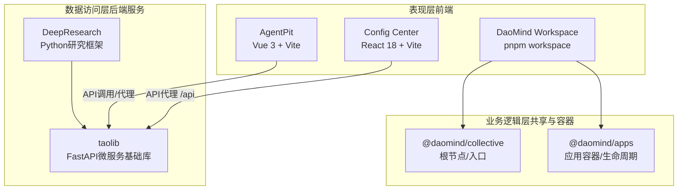
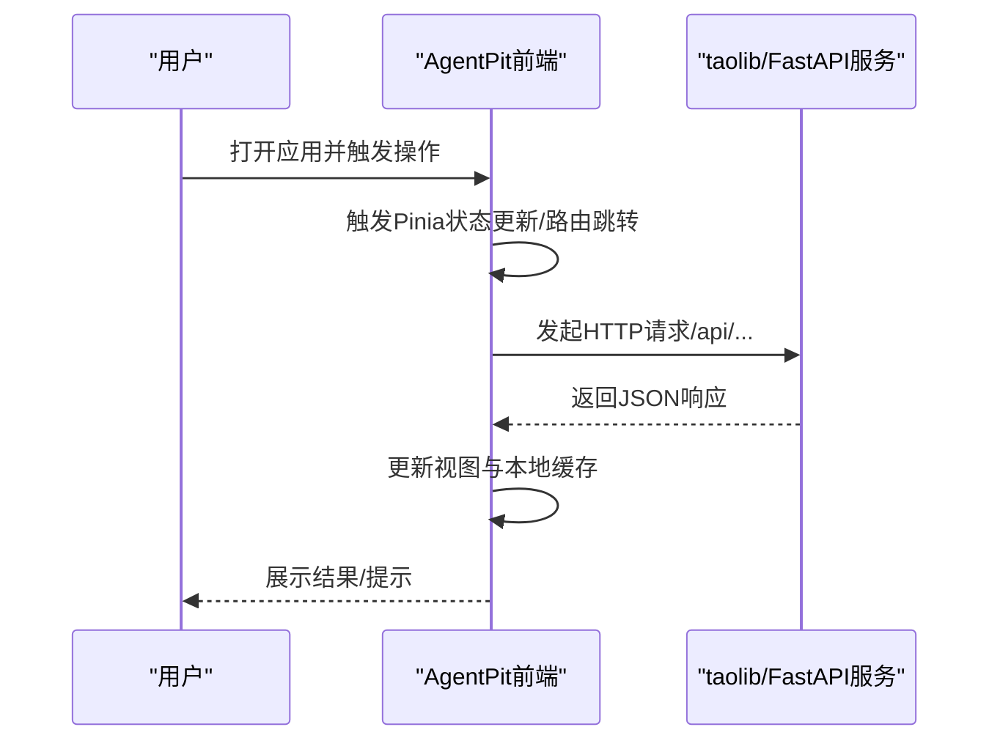
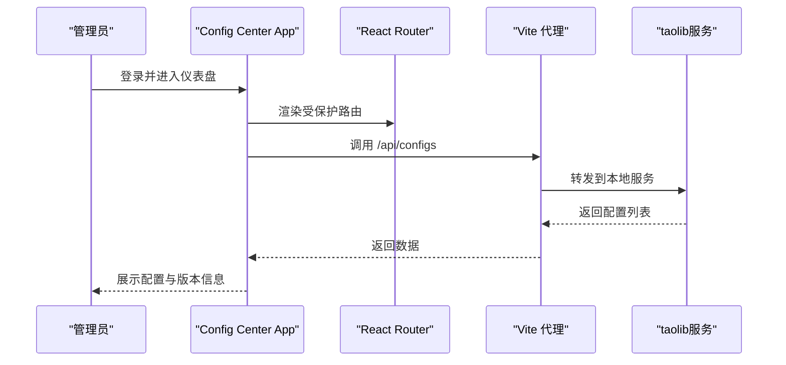
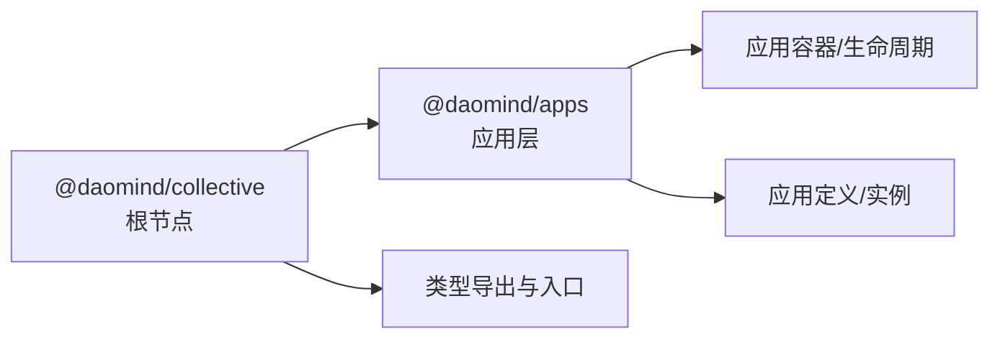
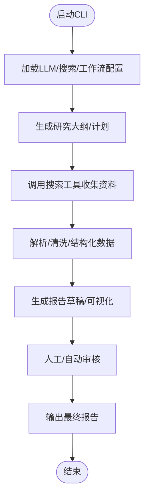
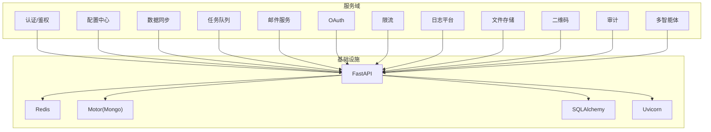
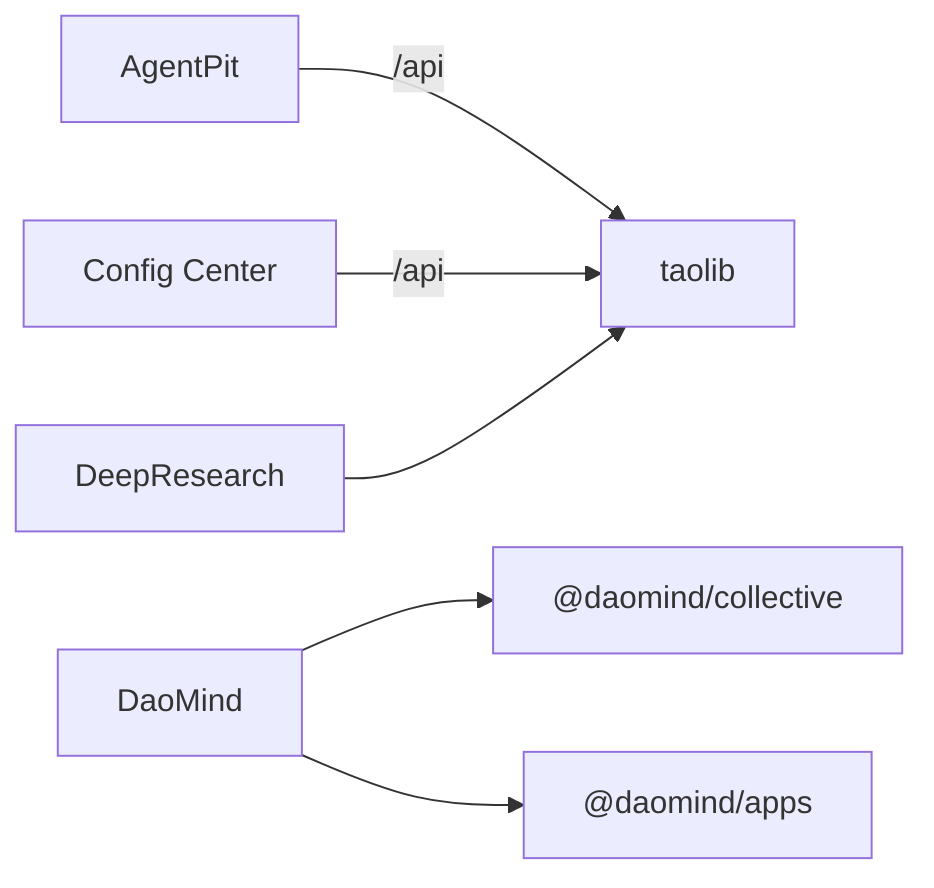

# 技术架构概览

<cite>
**本文引用的文件**
- [pyproject.toml](file://pyproject.toml)
- [apps/AgentPit/package.json](file://apps/AgentPit/package.json)
- [apps/AgentPit/vite.config.ts](file://apps/AgentPit/vite.config.ts)
- [apps/config-center/package.json](file://apps/config-center/package.json)
- [apps/config-center/vite.config.ts](file://apps/config-center/vite.config.ts)
- [apps/config-center/src/App.tsx](file://apps/config-center/src/App.tsx)
- [apps/DaoMind/pnpm-workspace.yaml](file://apps/DaoMind/pnpm-workspace.yaml)
- [apps/DaoMind/tsconfig.base.json](file://apps/DaoMind/tsconfig.base.json)
- [apps/DaoMind/packages/daoCollective/package.json](file://apps/DaoMind/packages/daoCollective/package.json)
- [apps/DaoMind/packages/daoApps/package.json](file://apps/DaoMind/packages/daoApps/package.json)
- [apps/DaoMind/packages/daoCollective/src/index.ts](file://apps/DaoMind/packages/daoCollective/src/index.ts)
- [apps/DaoMind/packages/daoApps/src/index.ts](file://apps/DaoMind/packages/daoApps/src/index.ts)
- [tools/DeepResearch/pyproject.toml](file://tools/DeepResearch/pyproject.toml)
- [tools/flexloop/pyproject.toml](file://tools/flexloop/pyproject.toml)
</cite>

## 目录
1. [引言](#引言)
2. [项目结构](#项目结构)
3. [核心组件](#核心组件)
4. [架构总览](#架构总览)
5. [详细组件分析](#详细组件分析)
6. [依赖关系分析](#依赖关系分析)
7. [性能考虑](#性能考虑)
8. [故障排查指南](#故障排查指南)
9. [结论](#结论)
10. [附录](#附录)

## 引言
本文件面向DAO Collective项目，提供全面的技术架构概览。重点阐述以下方面：
- 单体仓库（monorepo）架构模式与包管理策略
- 前后端分离架构与微服务理念的落地方式
- Vue.js 与 React 混合技术栈的选择动机与协同机制
- TypeScript 在大型项目中的应用优势与实践
- 分层架构设计：表现层、业务逻辑层、数据访问层的职责划分
- 核心依赖库选择标准：Vue 3、React、FastAPI、LangChain 等的集成方案
- 构建工具链、开发环境配置与部署架构设计

## 项目结构
DAO Collective采用monorepo组织形式，将前端应用、Python工具与共享库统一管理。前端侧包含多个独立应用（如 AgentPit、Config Center、DaoMind 等），并通过工作区（workspace）或包管理器（pnpm）进行依赖与构建协调；后端侧通过Python子项目（如 DeepResearch、flexloop）提供服务化能力。

```mermaid
graph TB
subgraph "前端应用"
AgentPit["AgentPit<br/>Vue 3 + TypeScript"]
ConfigCenter["Config Center<br/>React 18 + TypeScript"]
DaoMind["DaoMind Workspace<br/>pnpm workspace"]
end
subgraph "Python工具与服务"
DeepResearch["DeepResearch<br/>多LLM协作研究框架"]
TaoLib["taolib<br/>FastAPI生态与微服务基础库"]
end
subgraph "共享与根包"
Collective["@daomind/collective<br/>根节点/架构入口"]
Apps["@daomind/apps<br/>应用层容器与生命周期"]
end
AgentPit --> |"使用"| ConfigCenter
DaoMind --> Collective
DaoMind --> Apps
ConfigCenter --> |"代理转发"/api"| TaoLib
DeepResearch --> TaoLib
```

图表来源
- [apps/AgentPit/package.json:1-73](file://apps/AgentPit/package.json#L1-L73)
- [apps/config-center/package.json:1-41](file://apps/config-center/package.json#L1-L41)
- [apps/DaoMind/pnpm-workspace.yaml:1-3](file://apps/DaoMind/pnpm-workspace.yaml#L1-L3)
- [apps/DaoMind/packages/daoCollective/package.json:1-1](file://apps/DaoMind/packages/daoCollective/package.json#L1-L1)
- [apps/DaoMind/packages/daoApps/package.json:1-1](file://apps/DaoMind/packages/daoApps/package.json#L1-L1)
- [tools/DeepResearch/pyproject.toml:1-93](file://tools/DeepResearch/pyproject.toml#L1-L93)
- [tools/flexloop/pyproject.toml:1-318](file://tools/flexloop/pyproject.toml#L1-L318)

章节来源
- [pyproject.toml:1-161](file://pyproject.toml#L1-L161)
- [apps/AgentPit/package.json:1-73](file://apps/AgentPit/package.json#L1-L73)
- [apps/config-center/package.json:1-41](file://apps/config-center/package.json#L1-L41)
- [apps/DaoMind/pnpm-workspace.yaml:1-3](file://apps/DaoMind/pnpm-workspace.yaml#L1-L3)
- [apps/DaoMind/tsconfig.base.json:1-1](file://apps/DaoMind/tsconfig.base.json#L1-L1)

## 核心组件
- 前端应用
  - AgentPit：基于Vue 3 + TypeScript 的单页应用，采用Vite作为构建工具，集成了TailwindCSS、Pinia、Vue Router 等生态库，用于智能体协作与定制化场景。
  - Config Center：基于React 18 + TypeScript 的管理后台，采用Vite构建，具备路由保护、UI状态管理与API代理功能，服务于配置中心与审计日志等管理页面。
  - DaoMind：通过 pnpm workspace 组织的前端包集合，包含 @daomind/collective 与 @daomind/apps 等根级与应用层包，提供统一的类型导出与容器/生命周期抽象。
- 后端与工具
  - DeepResearch：Python 工具，集成 LangChain、LangGraph、Tavily、MCP 等，支持多LLM协作与深度研究流程，提供CLI与测试体系。
  - taolib：Python 微服务基础库，覆盖认证、配置中心、数据同步、任务队列、邮件服务、OAuth、限流、日志平台、文件存储、二维码、审计、多智能体等子域，配套 FastAPI 服务示例与测试。

章节来源
- [apps/AgentPit/package.json:1-73](file://apps/AgentPit/package.json#L1-L73)
- [apps/config-center/package.json:1-41](file://apps/config-center/package.json#L1-L41)
- [apps/DaoMind/packages/daoCollective/package.json:1-1](file://apps/DaoMind/packages/daoCollective/package.json#L1-L1)
- [apps/DaoMind/packages/daoApps/package.json:1-1](file://apps/DaoMind/packages/daoApps/package.json#L1-L1)
- [tools/DeepResearch/pyproject.toml:1-93](file://tools/DeepResearch/pyproject.toml#L1-L93)
- [tools/flexloop/pyproject.toml:1-318](file://tools/flexloop/pyproject.toml#L1-L318)

## 架构总览
DAO Collective采用“monorepo + 前后端分离 + 微服务”的混合架构：
- monorepo：统一版本控制、共享工具链与测试规范，降低跨项目重复成本。
- 前后端分离：前端以应用为中心，后端以服务为中心，通过API交互与代理联结。
- 微服务理念：taolib 将通用能力模块化，按需组合为不同服务（如配置中心、任务队列、文件存储等），形成可插拔的服务网格。



图表来源
- [apps/AgentPit/vite.config.ts:1-15](file://apps/AgentPit/vite.config.ts#L1-L15)
- [apps/config-center/vite.config.ts:1-41](file://apps/config-center/vite.config.ts#L1-L41)
- [apps/DaoMind/packages/daoCollective/src/index.ts:1-5](file://apps/DaoMind/packages/daoCollective/src/index.ts#L1-L5)
- [apps/DaoMind/packages/daoApps/src/index.ts:1-9](file://apps/DaoMind/packages/daoApps/src/index.ts#L1-L9)
- [tools/flexloop/pyproject.toml:1-318](file://tools/flexloop/pyproject.toml#L1-L318)
- [tools/DeepResearch/pyproject.toml:1-93](file://tools/DeepResearch/pyproject.toml#L1-L93)

## 详细组件分析

### AgentPit（Vue 3 + TypeScript）
- 技术选型动机
  - Vue 3 提供响应式与Composition API，适合复杂交互与状态管理；TypeScript 提升大型项目的可维护性与类型安全。
  - Vite 提供快速冷启动与热更新，适配迭代频繁的前端应用。
- 关键特性
  - 使用 Pinia 进行全局状态管理，结合持久化插件提升用户体验。
  - 集成 TailwindCSS 与自定义主题，保证样式一致性与可扩展性。
  - 采用 Vue Router 实现页面级导航与懒加载。
- 构建与测试
  - 脚本涵盖开发、构建、类型检查、格式化与单元测试，配合 Vitest 与 Vue Test Utils。



图表来源
- [apps/AgentPit/package.json:1-73](file://apps/AgentPit/package.json#L1-L73)
- [apps/AgentPit/vite.config.ts:1-15](file://apps/AgentPit/vite.config.ts#L1-L15)
- [tools/flexloop/pyproject.toml:1-318](file://tools/flexloop/pyproject.toml#L1-L318)

章节来源
- [apps/AgentPit/package.json:1-73](file://apps/AgentPit/package.json#L1-L73)
- [apps/AgentPit/vite.config.ts:1-15](file://apps/AgentPit/vite.config.ts#L1-L15)

### Config Center（React 18 + TypeScript）
- 技术选型动机
  - React 18 提供并发特性与更好的性能；TypeScript 提升复杂表单与状态管理的可靠性。
  - Vite 提供快速开发体验；React Router DOM 实现SPA路由。
- 关键特性
  - 路由保护组件（ProtectedRoute）确保受控访问。
  - 使用 zustand 管理轻量状态，结合 react-hook-form 处理表单校验。
  - 通过 Vite 代理将 /api 请求转发至本地后端服务，便于联调。
- 构建优化
  - 按需拆分 vendor 包，减少首屏体积；生产环境移除 console 与 debugger，提升安全性与性能。



图表来源
- [apps/config-center/src/App.tsx:1-39](file://apps/config-center/src/App.tsx#L1-L39)
- [apps/config-center/vite.config.ts:1-41](file://apps/config-center/vite.config.ts#L1-L41)
- [tools/flexloop/pyproject.toml:1-318](file://tools/flexloop/pyproject.toml#L1-L318)

章节来源
- [apps/config-center/package.json:1-41](file://apps/config-center/package.json#L1-L41)
- [apps/config-center/vite.config.ts:1-41](file://apps/config-center/vite.config.ts#L1-L41)
- [apps/config-center/src/App.tsx:1-39](file://apps/config-center/src/App.tsx#L1-L39)

### DaoMind（pnpm workspace + TypeScript）
- 工作区组织
  - 通过 pnpm-workspace.yaml 定义 packages/*，集中管理多个前端包。
  - tsconfig.base.json 统一编译选项与路径映射，便于跨包引用与类型导出。
- 根包与应用层
  - @daomind/collective 作为根节点/架构入口，提供统一标识与入口对象。
  - @daomind/apps 作为应用层容器与生命周期抽象，承载具体应用定义与实例化逻辑。



图表来源
- [apps/DaoMind/pnpm-workspace.yaml:1-3](file://apps/DaoMind/pnpm-workspace.yaml#L1-L3)
- [apps/DaoMind/tsconfig.base.json:1-1](file://apps/DaoMind/tsconfig.base.json#L1-L1)
- [apps/DaoMind/packages/daoCollective/src/index.ts:1-5](file://apps/DaoMind/packages/daoCollective/src/index.ts#L1-L5)
- [apps/DaoMind/packages/daoApps/src/index.ts:1-9](file://apps/DaoMind/packages/daoApps/src/index.ts#L1-L9)

章节来源
- [apps/DaoMind/pnpm-workspace.yaml:1-3](file://apps/DaoMind/pnpm-workspace.yaml#L1-L3)
- [apps/DaoMind/tsconfig.base.json:1-1](file://apps/DaoMind/tsconfig.base.json#L1-L1)
- [apps/DaoMind/packages/daoCollective/package.json:1-1](file://apps/DaoMind/packages/daoCollective/package.json#L1-L1)
- [apps/DaoMind/packages/daoApps/package.json:1-1](file://apps/DaoMind/packages/daoApps/package.json#L1-L1)
- [apps/DaoMind/packages/daoCollective/src/index.ts:1-5](file://apps/DaoMind/packages/daoCollective/src/index.ts#L1-L5)
- [apps/DaoMind/packages/daoApps/src/index.ts:1-9](file://apps/DaoMind/packages/daoApps/src/index.ts#L1-L9)

### DeepResearch（Python + LangChain 生态）
- 技术选型动机
  - LangChain/LangGraph 提供多智能体协作与流程编排能力；Tavily/MCP 等工具增强检索与外部接口接入。
  - Python 生态在AI/数据处理领域成熟稳定，适合构建研究型工具。
- 关键特性
  - CLI 入口与测试体系完善，支持端到端与集成测试。
  - 配置化工作流与模板化提示词，便于扩展与复用。



图表来源
- [tools/DeepResearch/pyproject.toml:1-93](file://tools/DeepResearch/pyproject.toml#L1-L93)

章节来源
- [tools/DeepResearch/pyproject.toml:1-93](file://tools/DeepResearch/pyproject.toml#L1-L93)

### taolib（FastAPI 微服务基础库）
- 微服务理念
  - 将通用能力模块化为独立子域（认证、配置中心、数据同步、任务队列、邮件服务、OAuth、限流、日志平台、文件存储、二维码、审计、多智能体等），按需组合为服务。
- 技术选型动机
  - FastAPI 提供高性能、自动生成OpenAPI文档与强类型校验；uvicorn 作为ASGI服务器。
  - Redis/Motor/SQLAlchemy 等中间件满足缓存、数据库与异步IO需求。
- 测试与质量
  - 完整的测试矩阵（单元/集成/性能/端到端）与覆盖率要求，保障稳定性。



图表来源
- [tools/flexloop/pyproject.toml:1-318](file://tools/flexloop/pyproject.toml#L1-L318)

章节来源
- [tools/flexloop/pyproject.toml:1-318](file://tools/flexloop/pyproject.toml#L1-L318)

## 依赖关系分析
- 前端应用间耦合度低，通过共享UI库与API客户端进行弱耦合协作。
- Config Center 通过 Vite 代理将 /api 请求转发至本地后端服务，避免跨域与环境差异带来的问题。
- DaoMind 通过 pnpm workspace 与 tsconfig.base.json 统一路径别名与类型导出，降低循环依赖风险。
- Python 工具与服务通过 pyproject.toml 的 optional-dependencies 与 dev-dependencies 明确边界，便于按需安装与测试。



图表来源
- [apps/AgentPit/vite.config.ts:1-15](file://apps/AgentPit/vite.config.ts#L1-L15)
- [apps/config-center/vite.config.ts:1-41](file://apps/config-center/vite.config.ts#L1-L41)
- [apps/DaoMind/packages/daoCollective/src/index.ts:1-5](file://apps/DaoMind/packages/daoCollective/src/index.ts#L1-L5)
- [apps/DaoMind/packages/daoApps/src/index.ts:1-9](file://apps/DaoMind/packages/daoApps/src/index.ts#L1-L9)
- [tools/flexloop/pyproject.toml:1-318](file://tools/flexloop/pyproject.toml#L1-L318)
- [tools/DeepResearch/pyproject.toml:1-93](file://tools/DeepResearch/pyproject.toml#L1-L93)

章节来源
- [apps/AgentPit/vite.config.ts:1-15](file://apps/AgentPit/vite.config.ts#L1-L15)
- [apps/config-center/vite.config.ts:1-41](file://apps/config-center/vite.config.ts#L1-L41)
- [apps/DaoMind/tsconfig.base.json:1-1](file://apps/DaoMind/tsconfig.base.json#L1-L1)

## 性能考虑
- 前端
  - 代码分割与按需加载：React 应用通过手动分包策略减少首屏体积；Vue 应用采用路由懒加载与按需引入第三方库。
  - 构建优化：移除 console 与 debugger，启用压缩与最小化，合理设置 sourcemap。
  - 状态管理：Pinia 与 Zustand 均提供轻量状态模型，避免过度订阅与无谓重渲染。
- 后端
  - FastAPI 异步IO与连接池：结合 uvicorn 的高性能运行时，提升并发处理能力。
  - 缓存与数据库：Redis 用于热点数据与会话缓存，Motor/SQLAlchemy 提供异步ORM支持。
- 工具链
  - 类型检查与静态分析：TypeScript + Ruff + Mypy 双重保障，减少运行期错误。
  - 测试驱动：完备的测试矩阵与覆盖率门槛，确保变更质量。

## 故障排查指南
- 前端
  - 开发代理：确认 Vite 代理规则是否正确指向后端服务端口，避免 404/502。
  - 类型错误：优先修复 TypeScript 报错，再逐步放宽严格模式规则。
  - 构建失败：检查 vue-tsc 与 tsc 的类型检查输出，定位未声明类型或导入路径问题。
- 后端
  - 服务不可用：确认 FastAPI 服务已启动且监听端口开放，检查依赖注入与配置中心连接。
  - 数据异常：核对 Redis/Mongo/SQLAlchemy 连接参数与权限，查看日志平台聚合信息。
- 工具链
  - 依赖冲突：pnpm workspace 下统一版本与路径别名，避免重复安装与循环依赖。
  - 测试失败：从单元测试到集成测试逐级定位，关注环境变量与外部服务可用性。

章节来源
- [apps/config-center/vite.config.ts:1-41](file://apps/config-center/vite.config.ts#L1-L41)
- [apps/AgentPit/package.json:1-73](file://apps/AgentPit/package.json#L1-L73)
- [tools/flexloop/pyproject.toml:1-318](file://tools/flexloop/pyproject.toml#L1-L318)
- [tools/DeepResearch/pyproject.toml:1-93](file://tools/DeepResearch/pyproject.toml#L1-L93)

## 结论
DAO Collective通过monorepo统一治理、前后端分离与微服务理念，实现了高内聚、低耦合的系统架构。Vue 3 与 React 的混合技术栈满足不同场景下的开发效率与性能诉求；TypeScript 在大型项目中提供了可靠的类型安全与可维护性。Python 工具与 taolib 微服务基础库则为AI与数据密集型场景提供了坚实支撑。建议持续完善测试与可观测性建设，进一步提升交付质量与运维效率。

## 附录
- 版本与许可证
  - Python 运行时：>=3.14
  - Node 运行时：前端应用脚本中要求 Node >=18
- 开发与构建脚本
  - 前端：Vite + TypeScript + ESLint/Prettier + Vitest
  - 后端：FastAPI + uvicorn + pytest + coverage
  - 工具：Ruff + Mypy + scikit-build-core（部分子项目）