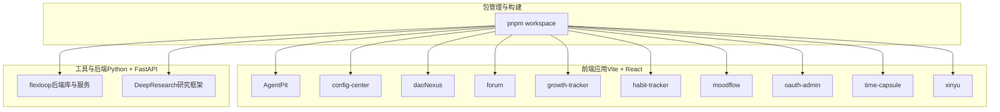
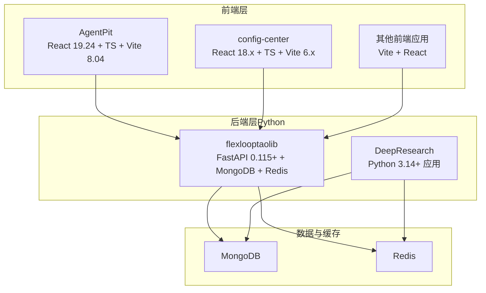
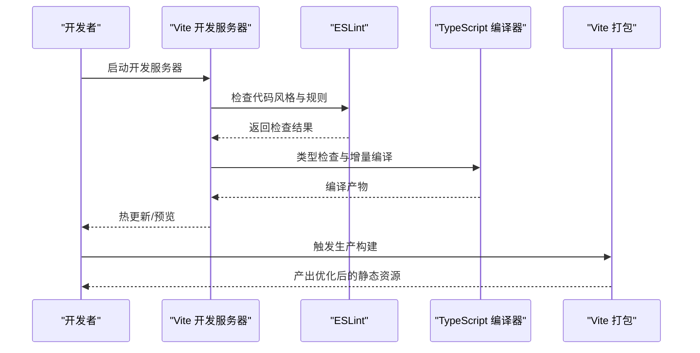
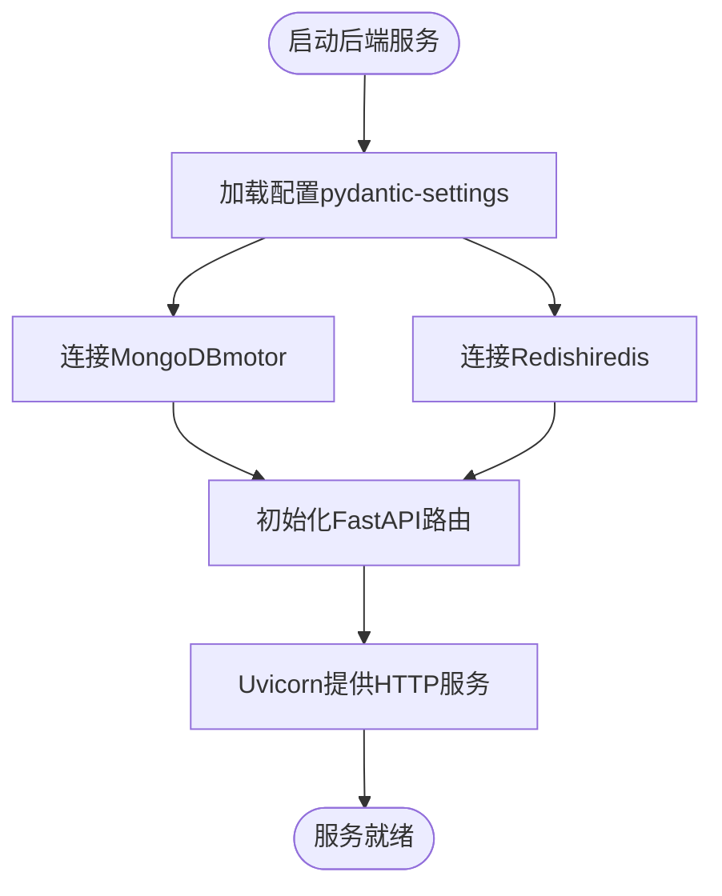
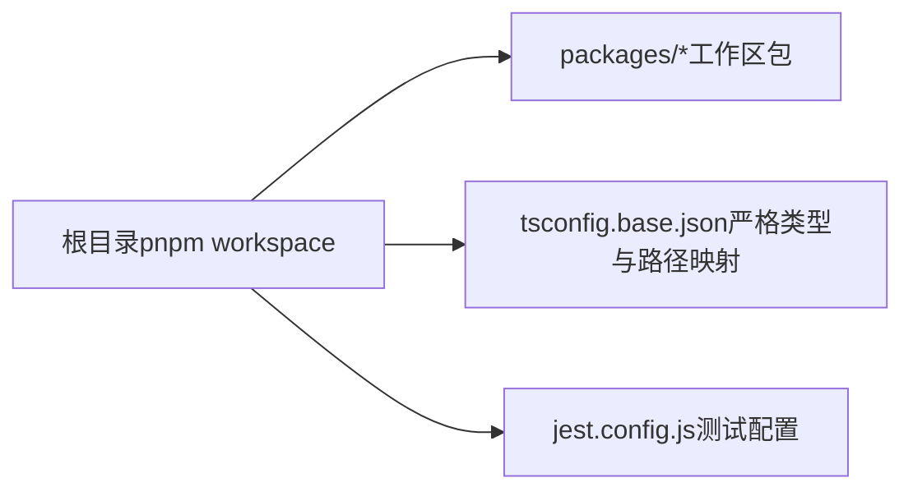
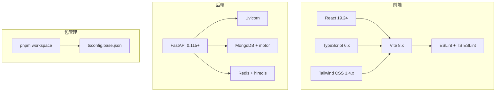

# 技术栈

<cite>
**本文引用的文件**
- [apps/AgentPit/package.json](file://apps/AgentPit/package.json)
- [apps/AgentPit/vite.config.ts](file://apps/AgentPit/vite.config.ts)
- [apps/AgentPit/eslint.config.js](file://apps/AgentPit/eslint.config.js)
- [apps/config-center/package.json](file://apps/config-center/package.json)
- [apps/config-center/vite.config.ts](file://apps/config-center/vite.config.ts)
- [apps/DaoMind/package.json](file://apps/DaoMind/package.json)
- [apps/DaoMind/pnpm-workspace.yaml](file://apps/DaoMind/pnpm-workspace.yaml)
- [apps/DaoMind/tsconfig.base.json](file://apps/DaoMind/tsconfig.base.json)
- [apps/DaoMind/eslint.config.js](file://apps/DaoMind/eslint.config.js)
- [apps/DaoMind/jest.config.js](file://apps/DaoMind/jest.config.js)
- [tools/flexloop/pyproject.toml](file://tools/flexloop/pyproject.toml)
- [tools/DeepResearch/pyproject.toml](file://tools/DeepResearch/pyproject.toml)
</cite>

## 目录
1. [引言](#引言)
2. [项目结构](#项目结构)
3. [核心组件](#核心组件)
4. [架构总览](#架构总览)
5. [详细组件分析](#详细组件分析)
6. [依赖关系分析](#依赖关系分析)
7. [性能考量](#性能考量)
8. [故障排查指南](#故障排查指南)
9. [结论](#结论)
10. [附录](#附录)

## 引言
本文件面向DAO Collective项目的开发者与维护者，系统性梳理并解释项目采用的技术栈与工具链：前端以React 19.2.4、TypeScript 6.0+、Vite 8.0.4、Tailwind CSS 3.4.19为核心；后端以Python 3.14+、FastAPI 0.115+为基础；数据库与缓存采用MongoDB与Redis；包管理采用pnpm monorepo。文档同时阐述各技术选型的背景与优势，并给出它们在本项目中的协同工作机制与最佳实践建议。

## 项目结构
DAO Collective采用多应用与多工具并行的组织方式：
- 前端应用位于 apps/ 下，包含多个独立的Vite + React应用（如 AgentPit、config-center、daoNexus、forum、growth-tracker、habit-tracker、moodflow、oauth-admin、time-capsule、xinyu）。
- 工具与基础设施位于 tools/ 下，包含Python库与工具（如 flexloop、DeepResearch），其中 flexloop 提供后端服务能力（FastAPI + MongoDB + Redis）。
- 顶层使用 pnpm workspace 进行monorepo管理，统一脚本与依赖策略。

图表来源
- [apps/AgentPit/package.json:1-37](file://apps/AgentPit/package.json#L1-L37)
- [apps/config-center/package.json:1-41](file://apps/config-center/package.json#L1-L41)
- [apps/DaoMind/pnpm-workspace.yaml:1-3](file://apps/DaoMind/pnpm-workspace.yaml#L1-L3)
- [tools/flexloop/pyproject.toml:1-318](file://tools/flexloop/pyproject.toml#L1-L318)

章节来源
- [apps/DaoMind/pnpm-workspace.yaml:1-3](file://apps/DaoMind/pnpm-workspace.yaml#L1-L3)
- [apps/AgentPit/package.json:1-37](file://apps/AgentPit/package.json#L1-L37)
- [apps/config-center/package.json:1-41](file://apps/config-center/package.json#L1-L41)

## 核心组件
本节从“前端技术栈”“后端技术栈”“数据库与缓存”“包管理工具”四个维度，系统介绍DAO Collective所用技术及其在项目中的定位与作用。

- 前端技术栈
  - React 19.2.4：用于构建用户界面，强调组件化与状态管理。
  - TypeScript 6.0+：提供类型安全与更好的开发体验。
  - Vite 8.0.4：快速的开发服务器与打包工具，支持热更新与按需编译。
  - Tailwind CSS 3.4.19：原子化CSS框架，便于快速样式迭代与主题一致性。
  - 开发工具：ESLint、Prettier（通过ESLint配置体现）、Jest、Vitest（部分应用使用）。

- 后端技术栈
  - Python 3.14+：语言基础，强调生态与易用性。
  - FastAPI 0.115+：高性能Web框架，自动生成OpenAPI文档，具备强类型校验与异步能力。
  - 数据库与缓存：MongoDB（文档型数据库）、Redis（键值存储/缓存/队列）。

- 包管理工具
  - pnpm monorepo：统一管理多应用与多工具，实现共享依赖与跨包引用。

章节来源
- [apps/AgentPit/package.json:12-35](file://apps/AgentPit/package.json#L12-L35)
- [apps/AgentPit/eslint.config.js:1-24](file://apps/AgentPit/eslint.config.js#L1-L24)
- [apps/DaoMind/package.json:1-1](file://apps/DaoMind/package.json#L1-L1)
- [apps/DaoMind/eslint.config.js:1-27](file://apps/DaoMind/eslint.config.js#L1-L27)
- [apps/DaoMind/jest.config.js:1-59](file://apps/DaoMind/jest.config.js#L1-L59)
- [apps/config-center/package.json:14-40](file://apps/config-center/package.json#L14-L40)
- [tools/flexloop/pyproject.toml:14-78](file://tools/flexloop/pyproject.toml#L14-L78)

## 架构总览
DAO Collective采用“前端多应用 + 后端Python库 + 数据与缓存”的分层架构。前端应用通过Vite进行本地开发与构建，后端服务由Python库提供，使用FastAPI作为HTTP接口层，数据访问通过MongoDB，缓存与限流等场景使用Redis。pnpm workspace统一管理多包与脚本。

图表来源
- [apps/AgentPit/package.json:12-35](file://apps/AgentPit/package.json#L12-L35)
- [apps/config-center/package.json:14-40](file://apps/config-center/package.json#L14-L40)
- [tools/flexloop/pyproject.toml:63-78](file://tools/flexloop/pyproject.toml#L63-L78)
- [tools/DeepResearch/pyproject.toml:1-26](file://tools/DeepResearch/pyproject.toml#L1-L26)

## 详细组件分析

### 前端组件分析（以AgentPit与config-center为例）
- 构建与开发
  - 使用Vite进行开发与打包，支持React插件与TypeScript编译。
  - ESLint配置采用flat config风格，结合TypeScript ESLint插件，确保代码质量与风格一致。
  - Tailwind CSS用于样式体系，配合PostCSS与autoprefixer完成自动前缀处理。
- 测试与质量
  - Jest（在DaoMind monorepo中）用于单元测试与覆盖率统计。
  - Vitest（在config-center中）用于测试运行与快照对比。
- 依赖与版本
  - React 19.2.4、TypeScript ~6.0、Vite 8.0.4、Tailwind CSS 3.4.19等版本在package.json中明确声明。

图表来源
- [apps/AgentPit/vite.config.ts:1-8](file://apps/AgentPit/vite.config.ts#L1-L8)
- [apps/AgentPit/eslint.config.js:1-24](file://apps/AgentPit/eslint.config.js#L1-L24)
- [apps/AgentPit/package.json:6-11](file://apps/AgentPit/package.json#L6-L11)

章节来源
- [apps/AgentPit/package.json:1-37](file://apps/AgentPit/package.json#L1-L37)
- [apps/AgentPit/vite.config.ts:1-8](file://apps/AgentPit/vite.config.ts#L1-L8)
- [apps/AgentPit/eslint.config.js:1-24](file://apps/AgentPit/eslint.config.js#L1-L24)
- [apps/config-center/package.json:1-41](file://apps/config-center/package.json#L1-L41)
- [apps/config-center/vite.config.ts:1-41](file://apps/config-center/vite.config.ts#L1-L41)
- [apps/DaoMind/eslint.config.js:1-27](file://apps/DaoMind/eslint.config.js#L1-L27)
- [apps/DaoMind/jest.config.js:1-59](file://apps/DaoMind/jest.config.js#L1-L59)

### 后端组件分析（flexloop）
- 语言与框架
  - Python 3.14+，FastAPI 0.115+，提供高性能API能力。
- 数据与缓存
  - MongoDB（motor驱动）用于文档存储；Redis（hiredis驱动）用于缓存与限流等。
- 依赖分层
  - 通过可选依赖组合不同子系统（认证、配置中心、任务队列、邮件服务、审计、OAuth等），便于按需启用。
- 测试与质量
  - pytest用于测试执行，ruff用于lint/format，coverage用于覆盖率统计。

图表来源
- [tools/flexloop/pyproject.toml:71-78](file://tools/flexloop/pyproject.toml#L71-L78)
- [tools/flexloop/pyproject.toml:91-95](file://tools/flexloop/pyproject.toml#L91-L95)
- [tools/flexloop/pyproject.toml:116-121](file://tools/flexloop/pyproject.toml#L116-L121)
- [tools/flexloop/pyproject.toml:187-203](file://tools/flexloop/pyproject.toml#L187-L203)

章节来源
- [tools/flexloop/pyproject.toml:14-78](file://tools/flexloop/pyproject.toml#L14-L78)
- [tools/flexloop/pyproject.toml:245-318](file://tools/flexloop/pyproject.toml#L245-L318)

### 数据与缓存组件分析
- MongoDB
  - 在配置中心、数据同步、日志平台、文件存储、审计等多个子系统中使用motor进行异步访问。
- Redis
  - 在认证、限流、任务队列、文件存储、OAuth等子系统中使用redis[hiredis]进行高性能读写与缓存。

章节来源
- [tools/flexloop/pyproject.toml:71-78](file://tools/flexloop/pyproject.toml#L71-L78)
- [tools/flexloop/pyproject.toml:82-89](file://tools/flexloop/pyproject.toml#L82-L89)
- [tools/flexloop/pyproject.toml:116-121](file://tools/flexloop/pyproject.toml#L116-L121)
- [tools/flexloop/pyproject.toml:136-142](file://tools/flexloop/pyproject.toml#L136-L142)
- [tools/flexloop/pyproject.toml:168-174](file://tools/flexloop/pyproject.toml#L168-L174)
- [tools/flexloop/pyproject.toml:187-195](file://tools/flexloop/pyproject.toml#L187-L195)

### 包管理与Monorepo（pnpm）
- workspace组织
  - 通过 pnpm-workspace.yaml 将 packages/* 纳入工作区，实现跨包引用与统一脚本。
- 依赖与版本
  - tsconfig.base.json定义了严格模式、路径映射与类型导出，便于多包共享类型与路径别名。
- 脚本与测试
  - DaoMind monorepo中使用jest进行测试与覆盖率统计；部分应用使用vitest。

图表来源
- [apps/DaoMind/pnpm-workspace.yaml:1-3](file://apps/DaoMind/pnpm-workspace.yaml#L1-L3)
- [apps/DaoMind/tsconfig.base.json:1-1](file://apps/DaoMind/tsconfig.base.json#L1-L1)
- [apps/DaoMind/jest.config.js:1-59](file://apps/DaoMind/jest.config.js#L1-L59)

章节来源
- [apps/DaoMind/pnpm-workspace.yaml:1-3](file://apps/DaoMind/pnpm-workspace.yaml#L1-L3)
- [apps/DaoMind/tsconfig.base.json:1-1](file://apps/DaoMind/tsconfig.base.json#L1-L1)
- [apps/DaoMind/jest.config.js:1-59](file://apps/DaoMind/jest.config.js#L1-L59)

## 依赖关系分析
- 前端应用对工具链的依赖
  - React、TypeScript、Vite、Tailwind CSS构成前端开发与构建的核心链路。
  - ESLint与TypeScript ESLint插件共同保障代码质量。
- 后端服务对基础设施的依赖
  - FastAPI依赖Uvicorn提供ASGI服务；MongoDB与Redis分别承担持久化与缓存。
  - 可选依赖按功能拆分，降低耦合度与部署复杂度。
- Monorepo对多包的依赖
  - pnpm workspace统一管理包间引用与脚本；tsconfig.base.json集中定义路径别名与严格类型。

图表来源
- [apps/AgentPit/package.json:12-35](file://apps/AgentPit/package.json#L12-L35)
- [apps/AgentPit/eslint.config.js:1-24](file://apps/AgentPit/eslint.config.js#L1-L24)
- [apps/config-center/package.json:14-40](file://apps/config-center/package.json#L14-L40)
- [tools/flexloop/pyproject.toml:63-78](file://tools/flexloop/pyproject.toml#L63-L78)
- [apps/DaoMind/pnpm-workspace.yaml:1-3](file://apps/DaoMind/pnpm-workspace.yaml#L1-L3)
- [apps/DaoMind/tsconfig.base.json:1-1](file://apps/DaoMind/tsconfig.base.json#L1-L1)

章节来源
- [apps/AgentPit/package.json:1-37](file://apps/AgentPit/package.json#L1-L37)
- [apps/config-center/package.json:1-41](file://apps/config-center/package.json#L1-L41)
- [tools/flexloop/pyproject.toml:14-78](file://tools/flexloop/pyproject.toml#L14-L78)
- [apps/DaoMind/pnpm-workspace.yaml:1-3](file://apps/DaoMind/pnpm-workspace.yaml#L1-L3)
- [apps/DaoMind/tsconfig.base.json:1-1](file://apps/DaoMind/tsconfig.base.json#L1-L1)

## 性能考量
- 前端性能
  - Vite的按需编译与热更新显著提升开发效率；生产构建开启压缩与分包策略（如将react、router、UI库拆分为独立chunk），减少首屏体积。
  - Tailwind CSS与原子类有助于避免样式冗余，但需注意未使用样式的清理与Tree-shaking。
- 后端性能
  - FastAPI的异步特性与Pydantic的高效序列化/反序列化，结合Uvicorn的高性能ASGI服务，适合高并发API场景。
  - MongoDB与Redis的异步驱动（motor、redis[hiredis]）可充分利用异步IO，降低延迟。
- 构建与测试
  - Jest/Vitest的并行测试与覆盖率统计，有助于在CI中快速反馈质量指标。

章节来源
- [apps/AgentPit/vite.config.ts:1-8](file://apps/AgentPit/vite.config.ts#L1-L8)
- [apps/config-center/vite.config.ts:17-40](file://apps/config-center/vite.config.ts#L17-L40)
- [tools/flexloop/pyproject.toml:63-78](file://tools/flexloop/pyproject.toml#L63-L78)

## 故障排查指南
- 前端常见问题
  - ESLint报错：检查ESLint配置与TypeScript解析路径，确保项目根tsconfig正确指向。
  - Vite代理失败：确认代理目标地址与端口是否正确，以及后端服务是否已启动。
  - 样式不生效：检查Tailwind配置与PostCSS是否正确引入。
- 后端常见问题
  - FastAPI路由未注册：检查可选依赖组合与导入顺序，确保子系统按需启用。
  - 数据库连接失败：核对MongoDB连接字符串与网络可达性；确认motor版本兼容。
  - Redis连接异常：核对Redis地址、密码与网络策略；确认hiredis安装与版本。
- 测试与覆盖率
  - Jest/Vitest测试失败：检查测试环境配置、模块映射与tsconfig设置；确保测试文件命名与路径匹配。

章节来源
- [apps/AgentPit/eslint.config.js:1-24](file://apps/AgentPit/eslint.config.js#L1-L24)
- [apps/config-center/vite.config.ts:12-16](file://apps/config-center/vite.config.ts#L12-L16)
- [apps/DaoMind/jest.config.js:1-59](file://apps/DaoMind/jest.config.js#L1-L59)
- [tools/flexloop/pyproject.toml:297-318](file://tools/flexloop/pyproject.toml#L297-L318)

## 结论
DAO Collective的技术栈围绕“现代前端 + 高性能后端 + 统一包管理”的理念构建：前端以Vite与React为核心，辅以TypeScript与Tailwind CSS；后端以FastAPI与Python 3.14+为基础，结合MongoDB与Redis实现灵活的数据与缓存方案；pnpm monorepo统一管理多应用与多工具，提升协作效率与可维护性。该技术栈在开发体验、性能表现与扩展性方面形成良好平衡，适合持续演进的多应用与多工具并行项目。

## 附录
- 最佳实践建议
  - 前端：保持ESLint规则与TypeScript严格模式一致；合理拆分Vite分包策略；在CI中加入类型检查与lint步骤。
  - 后端：按功能拆分可选依赖，最小化部署面；在FastAPI中充分利用Pydantic模型进行输入输出校验；为关键流程添加监控与日志。
  - 数据与缓存：为MongoDB与Redis建立健康检查与重试机制；在高并发场景下评估连接池大小与超时参数。
  - 包管理：在pnpm workspace中规范路径别名与类型导出；定期同步依赖版本，避免锁定文件冲突。