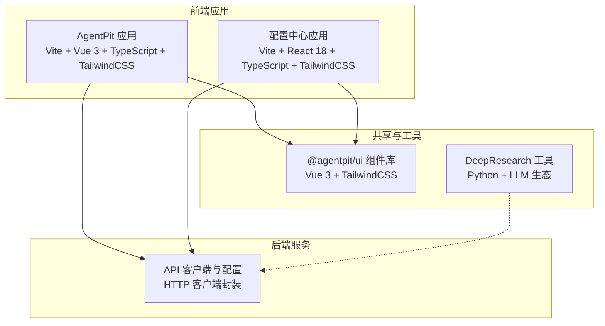
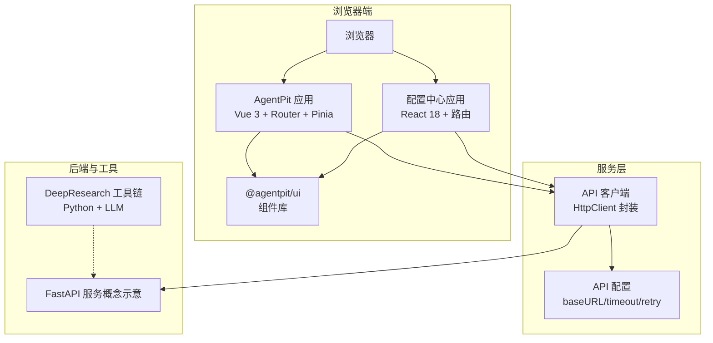
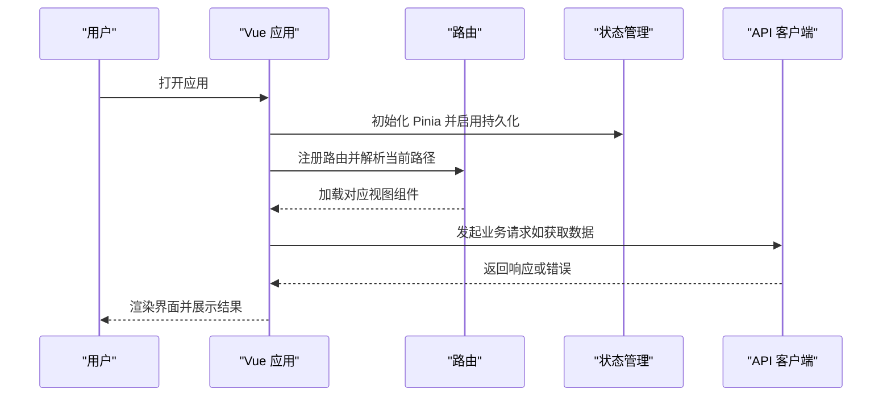
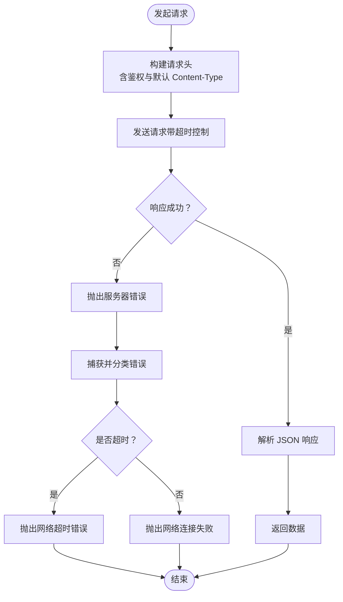
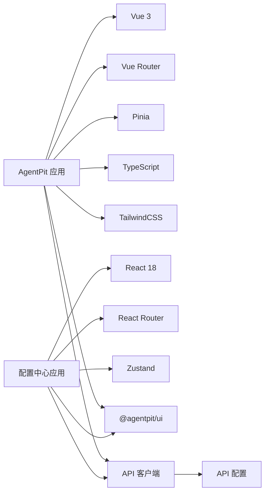

# 技术栈概览

<cite>
**本文引用的文件**
- [apps/AgentPit/package.json](file://apps/AgentPit/package.json)
- [apps/AgentPit/vite.config.ts](file://apps/AgentPit/vite.config.ts)
- [apps/AgentPit/tailwind.config.ts](file://apps/AgentPit/tailwind.config.ts)
- [apps/AgentPit/tsconfig.json](file://apps/AgentPit/tsconfig.json)
- [apps/AgentPit/src/main.ts](file://apps/AgentPit/src/main.ts)
- [apps/AgentPit/src/App.vue](file://apps/AgentPit/src/App.vue)
- [apps/AgentPit/src/router/index.ts](file://apps/AgentPit/src/router/index.ts)
- [apps/AgentPit/src/stores/index.ts](file://apps/AgentPit/src/stores/index.ts)
- [apps/AgentPit/packages/ui/package.json](file://apps/AgentPit/packages/ui/package.json)
- [apps/config-center/package.json](file://apps/config-center/package.json)
- [src/services/api/client.ts](file://src/services/api/client.ts)
- [src/services/config.ts](file://src/services/config.ts)
- [pyproject.toml](file://pyproject.toml)
- [tools/DeepResearch/pyproject.toml](file://tools/DeepResearch/pyproject.toml)
</cite>

## 目录
1. [简介](#简介)
2. [项目结构](#项目结构)
3. [核心组件](#核心组件)
4. [架构总览](#架构总览)
5. [详细组件分析](#详细组件分析)
6. [依赖分析](#依赖分析)
7. [性能考虑](#性能考虑)
8. [故障排除指南](#故障排除指南)
9. [结论](#结论)
10. [附录](#附录)

## 简介
本文件为 DAOApps 项目的整体技术栈概览，聚焦于前端技术栈（Vue.js 3、TypeScript、TailwindCSS）、后端技术栈（Python、工具链与服务层）、数据库与微服务相关的设计思路、以及各组件间的协作关系。文档同时给出版本信息、兼容性要求与升级路径建议，帮助开发者快速建立对项目架构的整体认知。

## 项目结构
DAOApps 采用多应用与多包并行的组织方式：前端以 Vite + Vue 3 为核心，配合 TypeScript 与 TailwindCSS；后端与工具链以 Python 为主，结合 FastAPI（在服务层体现）与各类工具模块；配置中心与 UI 组件库通过工作区（workspace）进行统一管理。

图表来源
- [apps/AgentPit/package.json:1-74](file://apps/AgentPit/package.json#L1-L74)
- [apps/config-center/package.json:1-41](file://apps/config-center/package.json#L1-L41)
- [apps/AgentPit/packages/ui/package.json:1-58](file://apps/AgentPit/packages/ui/package.json#L1-L58)
- [src/services/api/client.ts:1-105](file://src/services/api/client.ts#L1-L105)
- [tools/DeepResearch/pyproject.toml:1-93](file://tools/DeepResearch/pyproject.toml#L1-L93)

章节来源
- [apps/AgentPit/package.json:1-74](file://apps/AgentPit/package.json#L1-L74)
- [apps/config-center/package.json:1-41](file://apps/config-center/package.json#L1-L41)
- [apps/AgentPit/packages/ui/package.json:1-58](file://apps/AgentPit/packages/ui/package.json#L1-L58)
- [src/services/api/client.ts:1-105](file://src/services/api/client.ts#L1-L105)
- [tools/DeepResearch/pyproject.toml:1-93](file://tools/DeepResearch/pyproject.toml#L1-L93)

## 核心组件
- 前端框架与构建
  - Vue 3 应用（AgentPit）：使用 Vite 作为构建工具，Vue Router 进行路由管理，Pinia 状态管理，并通过 TypeScript 提供类型安全。
  - 配置中心应用（React）：同样基于 Vite，使用 React 18 与 TypeScript。
- 样式与主题
  - TailwindCSS 用于原子化样式与主题定制，支持按需扫描与自定义颜色体系。
- 组件库
  - @agentpit/ui 作为可复用的 Vue 3 组件库，提供样式导出与类型声明，便于跨应用统一风格。
- 后端与服务层
  - API 客户端封装：统一的 HTTP 客户端，内置超时控制、错误分类与本地鉴权头注入。
  - 配置中心：集中管理配置与用户权限，提供受保护路由与状态管理。
- 工具与脚手架
  - Python 工具链（DeepResearch）：集成 LLM、搜索与可视化能力，支持 CLI 与测试框架。
  - 项目级 Python 配置：使用 PDM 管理依赖与脚本，统一 lint/format/type-check 流程。

章节来源
- [apps/AgentPit/src/main.ts:1-13](file://apps/AgentPit/src/main.ts#L1-L13)
- [apps/AgentPit/src/router/index.ts:1-73](file://apps/AgentPit/src/router/index.ts#L1-L73)
- [apps/AgentPit/src/stores/index.ts:1-15](file://apps/AgentPit/src/stores/index.ts#L1-L15)
- [apps/AgentPit/packages/ui/package.json:1-58](file://apps/AgentPit/packages/ui/package.json#L1-L58)
- [apps/config-center/package.json:1-41](file://apps/config-center/package.json#L1-L41)
- [src/services/api/client.ts:1-105](file://src/services/api/client.ts#L1-L105)
- [tools/DeepResearch/pyproject.toml:1-93](file://tools/DeepResearch/pyproject.toml#L1-L93)
- [pyproject.toml:1-161](file://pyproject.toml#L1-L161)

## 架构总览
下图展示了前端应用、组件库、服务层与工具链之间的交互关系，以及环境变量驱动的配置策略。

图表来源
- [apps/AgentPit/src/main.ts:1-13](file://apps/AgentPit/src/main.ts#L1-L13)
- [apps/AgentPit/src/router/index.ts:1-73](file://apps/AgentPit/src/router/index.ts#L1-L73)
- [apps/AgentPit/src/stores/index.ts:1-15](file://apps/AgentPit/src/stores/index.ts#L1-L15)
- [apps/AgentPit/packages/ui/package.json:1-58](file://apps/AgentPit/packages/ui/package.json#L1-L58)
- [apps/config-center/package.json:1-41](file://apps/config-center/package.json#L1-L41)
- [src/services/api/client.ts:1-105](file://src/services/api/client.ts#L1-L105)
- [src/services/config.ts:1-11](file://src/services/config.ts#L1-L11)
- [tools/DeepResearch/pyproject.toml:1-93](file://tools/DeepResearch/pyproject.toml#L1-L93)

## 详细组件分析

### 前端应用（AgentPit）
- 技术组合
  - 框架：Vue 3 + Vue Router + Pinia
  - 构建：Vite
  - 样式：TailwindCSS
  - 类型：TypeScript
- 关键特性
  - 路由懒加载与多页面视图
  - 状态持久化（Pinia 插件）
  - 统一入口初始化（应用挂载、插件注册）

图表来源
- [apps/AgentPit/src/main.ts:1-13](file://apps/AgentPit/src/main.ts#L1-L13)
- [apps/AgentPit/src/router/index.ts:1-73](file://apps/AgentPit/src/router/index.ts#L1-L73)
- [apps/AgentPit/src/stores/index.ts:1-15](file://apps/AgentPit/src/stores/index.ts#L1-L15)
- [src/services/api/client.ts:1-105](file://src/services/api/client.ts#L1-L105)

章节来源
- [apps/AgentPit/src/main.ts:1-13](file://apps/AgentPit/src/main.ts#L1-L13)
- [apps/AgentPit/src/App.vue:1-8](file://apps/AgentPit/src/App.vue#L1-L8)
- [apps/AgentPit/src/router/index.ts:1-73](file://apps/AgentPit/src/router/index.ts#L1-L73)
- [apps/AgentPit/src/stores/index.ts:1-15](file://apps/AgentPit/src/stores/index.ts#L1-L15)

### 配置中心应用（React）
- 技术组合
  - 框架：React 18 + 路由
  - 构建：Vite
  - 样式：TailwindCSS
  - 类型：TypeScript
- 关键特性
  - 工作区依赖（@tao/*）统一管理
  - 受保护路由与状态管理

章节来源
- [apps/config-center/package.json:1-41](file://apps/config-center/package.json#L1-L41)

### 组件库（@agentpit/ui）
- 角色定位
  - 作为 Vue 3 的可复用组件库，提供样式与类型导出，支持文档站点生成。
- 依赖关系
  - 与 TailwindCSS 协同，通过构建产物暴露样式与类型。

章节来源
- [apps/AgentPit/packages/ui/package.json:1-58](file://apps/AgentPit/packages/ui/package.json#L1-L58)

### API 客户端与配置
- 设计要点
  - 统一封装 HTTP 请求，自动注入鉴权头，支持超时与重试策略。
  - 通过环境变量控制基础地址、是否使用 Mock 与重试参数。
- 错误处理
  - 区分网络错误、服务器错误与业务异常，便于前端统一处理。

图表来源
- [src/services/api/client.ts:19-102](file://src/services/api/client.ts#L19-L102)
- [src/services/config.ts:1-11](file://src/services/config.ts#L1-L11)

章节来源
- [src/services/api/client.ts:1-105](file://src/services/api/client.ts#L1-L105)
- [src/services/config.ts:1-11](file://src/services/config.ts#L1-L11)

### 工具与后端（Python 生态）
- 语言与版本
  - Python >= 3.14（项目与工具链均要求）
- 依赖与工具
  - LLM 与检索：httpx、LangChain、LangGraph、Tavily、MCP 等
  - 开发与测试：pytest、ruff、mypy、coverage
- 项目管理
  - 使用 PDM 管理依赖与脚本，统一 lint/format/type-check 流程。

章节来源
- [pyproject.toml:14-31](file://pyproject.toml#L14-L31)
- [pyproject.toml:54-56](file://pyproject.toml#L54-L56)
- [pyproject.toml:71-79](file://pyproject.toml#L71-L79)
- [pyproject.toml:81-129](file://pyproject.toml#L81-L129)
- [pyproject.toml:130-161](file://pyproject.toml#L130-L161)
- [tools/DeepResearch/pyproject.toml:9-26](file://tools/DeepResearch/pyproject.toml#L9-L26)
- [tools/DeepResearch/pyproject.toml:48-52](file://tools/DeepResearch/pyproject.toml#L48-L52)

## 依赖分析
- 前端依赖关系
  - AgentPit 依赖 Vue 3、Vue Router、Pinia、TailwindCSS、TypeScript 等；UI 组件库作为 peerDependencies 与主应用协同。
  - 配置中心应用依赖 React 18、路由与状态管理库。
- 服务层依赖关系
  - API 客户端依赖配置模块与错误类型，通过 fetch 实现请求。
- 工具链依赖关系
  - DeepResearch 依赖 LLM 与检索工具，服务于研究与报告生成场景。

图表来源
- [apps/AgentPit/package.json:20-40](file://apps/AgentPit/package.json#L20-L40)
- [apps/AgentPit/packages/ui/package.json:31-39](file://apps/AgentPit/packages/ui/package.json#L31-L39)
- [apps/config-center/package.json:14-26](file://apps/config-center/package.json#L14-L26)
- [src/services/api/client.ts:1-105](file://src/services/api/client.ts#L1-L105)
- [src/services/config.ts:1-11](file://src/services/config.ts#L1-L11)

章节来源
- [apps/AgentPit/package.json:1-74](file://apps/AgentPit/package.json#L1-L74)
- [apps/config-center/package.json:1-41](file://apps/config-center/package.json#L1-L41)
- [apps/AgentPit/packages/ui/package.json:1-58](file://apps/AgentPit/packages/ui/package.json#L1-L58)
- [src/services/api/client.ts:1-105](file://src/services/api/client.ts#L1-L105)
- [src/services/config.ts:1-11](file://src/services/config.ts#L1-L11)

## 性能考虑
- 前端
  - 路由懒加载与组件动态导入，减少首屏体积。
  - TailwindCSS 按需扫描与构建优化，避免无用样式。
  - Pinia 持久化状态仅保存必要数据，降低存储压力。
- 服务层
  - 超时控制与重试策略平衡用户体验与资源占用。
  - 明确的错误分类有助于前端快速降级与提示。
- 工具链
  - Python 版本与依赖锁定，确保执行稳定性与可重复性。

## 故障排除指南
- 网络与超时
  - 若出现“请求超时”，检查 API 配置中的超时时间与后端响应延迟。
- 鉴权问题
  - 确认本地存储中是否存在有效的认证令牌，客户端会自动附加到请求头。
- 构建与类型
  - 前端可通过类型检查脚本定位类型错误；Python 通过 mypy 与 ruff 提前发现潜在问题。
- 配置中心访问
  - 确认受保护路由与登录状态，避免未授权访问。

章节来源
- [src/services/api/client.ts:56-68](file://src/services/api/client.ts#L56-L68)
- [src/services/config.ts:1-11](file://src/services/config.ts#L1-L11)
- [pyproject.toml:152-161](file://pyproject.toml#L152-L161)

## 结论
DAOApps 采用“前端多应用 + 组件库 + 服务层 + Python 工具链”的混合架构：前端以 Vue 3/React 为基础，结合 Vite、TypeScript 与 TailwindCSS 实现高开发效率与一致体验；服务层通过统一的 API 客户端与配置实现稳定的数据交互；Python 工具链（尤其是 DeepResearch）为复杂场景提供强大的研究与可视化能力。该架构既保证了工程化与可维护性，也为未来扩展与演进提供了清晰路径。

## 附录

### 版本与兼容性要求
- 前端
  - Vue 3、Vue Router、Pinia、TailwindCSS、TypeScript 等版本以各应用的 package.json 为准。
- Python
  - 项目与工具链均要求 Python >= 3.14。
- 构建工具
  - Vite、TypeScript 编译器、ESLint、Prettier 等版本以各应用与根目录配置为准。

章节来源
- [apps/AgentPit/package.json:1-74](file://apps/AgentPit/package.json#L1-L74)
- [apps/config-center/package.json:1-41](file://apps/config-center/package.json#L1-L41)
- [apps/AgentPit/packages/ui/package.json:1-58](file://apps/AgentPit/packages/ui/package.json#L1-L58)
- [pyproject.toml:14-31](file://pyproject.toml#L14-L31)
- [tools/DeepResearch/pyproject.toml:9-26](file://tools/DeepResearch/pyproject.toml#L9-L26)

### 升级路径建议
- 前端
  - 优先升级 Vite 与 Vue 生态至最新稳定版，同步更新 TypeScript 与 ESLint 配置。
  - 对 TailwindCSS 进行版本升级时，注意按需扫描路径与自定义配置的兼容性。
- 服务层
  - 在引入新功能前，先完善 API 客户端的错误处理与日志记录，确保升级过程可回滚。
- Python
  - 逐步提升 Python 主版本与关键依赖版本，利用 mypy 与 pytest 保障兼容性。
  - 通过 PDM 脚本统一 lint/format/type-check，减少升级摩擦。