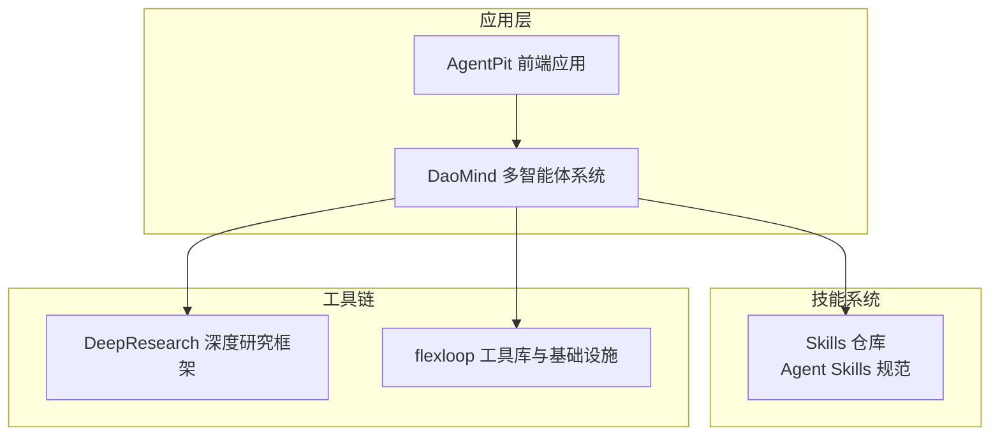
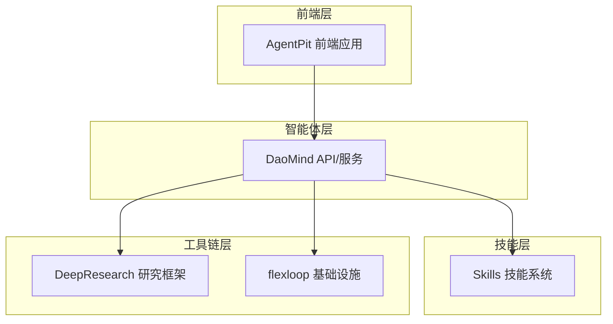
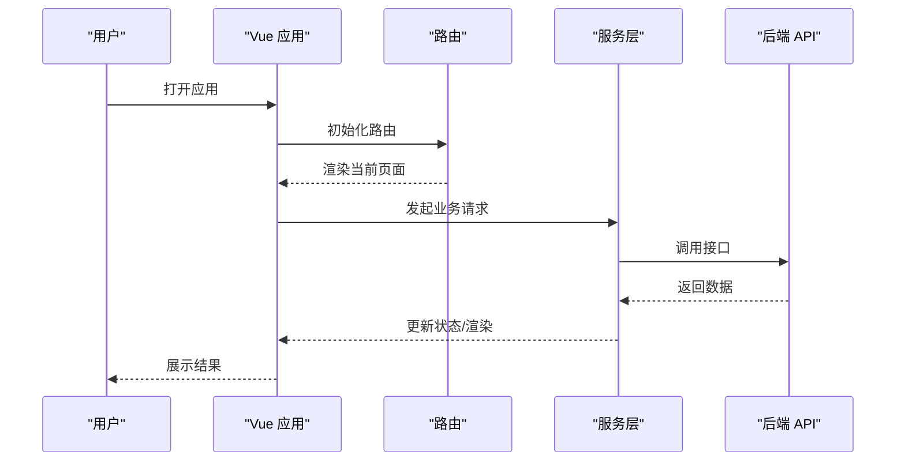
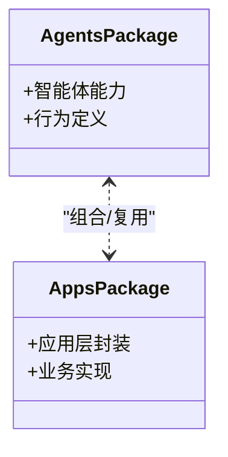
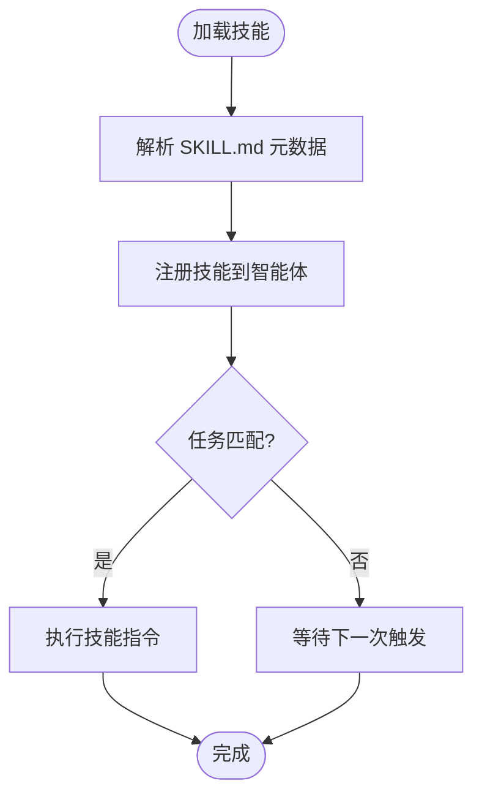
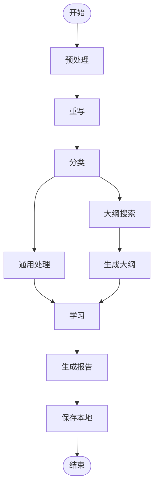
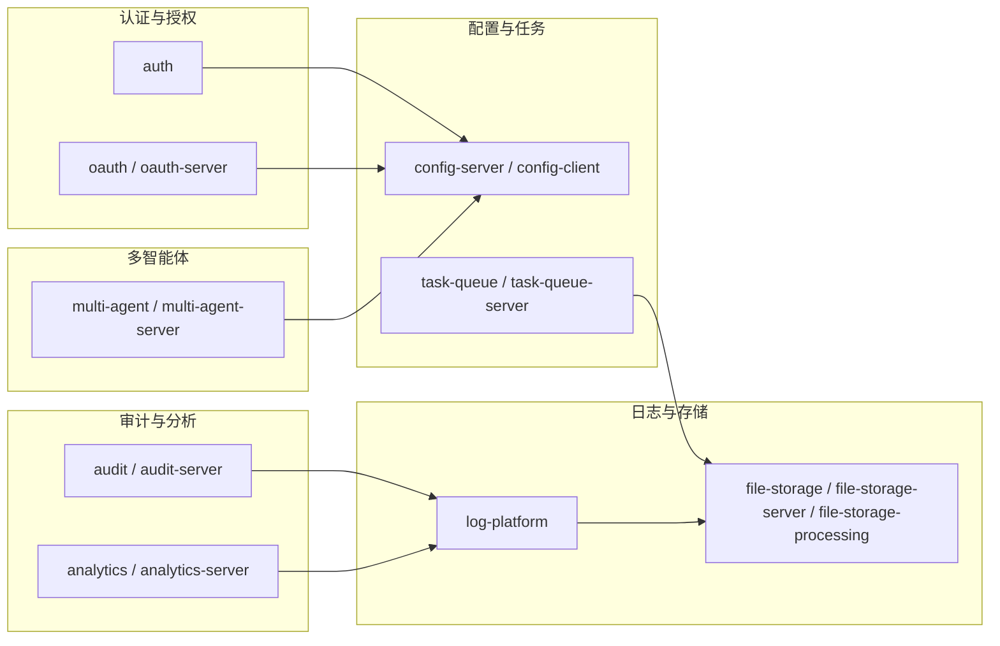
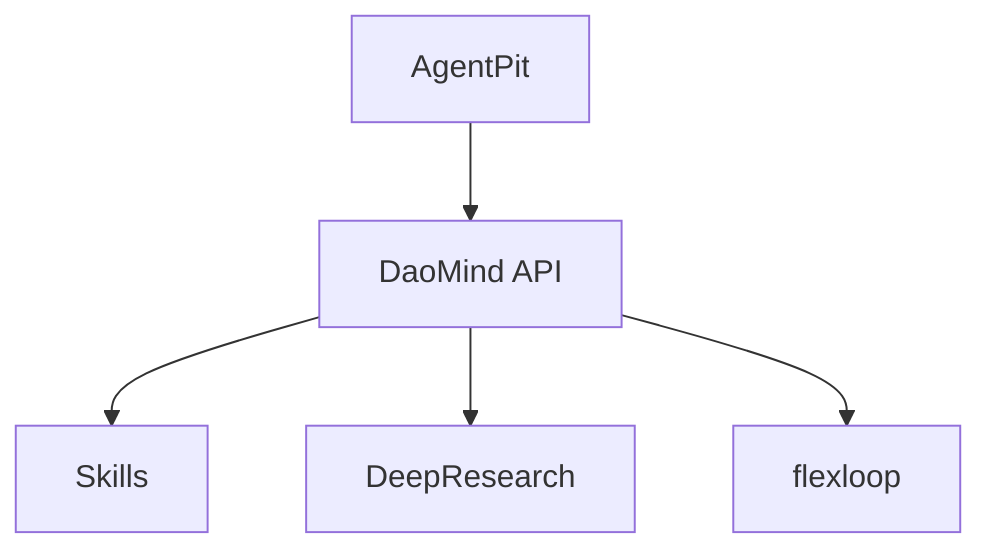

# 架构设计概览

<cite>
**本文引用的文件**
- [apps/AgentPit/package.json](file://apps/AgentPit/package.json)
- [apps/AgentPit/src/main.ts](file://apps/AgentPit/src/main.ts)
- [apps/AgentPit/src/App.vue](file://apps/AgentPit/src/App.vue)
- [apps/DaoMind/package.json](file://apps/DaoMind/package.json)
- [apps/DaoMind/packages/daoAgents/package.json](file://apps/DaoMind/packages/daoAgents/package.json)
- [apps/DaoMind/packages/daoApps/package.json](file://apps/DaoMind/packages/daoApps/package.json)
- [skills/daoSkilLs/skills/anthropics-skills/README.md](file://skills/daoSkilLs/skills/anthropics-skills/README.md)
- [skills/daoSkilLs/skills/anthropics-skills/template/SKILL.md](file://skills/daoSkilLs/skills/anthropics-skills/template/SKILL.md)
- [tools/DeepResearch/pyproject.toml](file://tools/DeepResearch/pyproject.toml)
- [tools/DeepResearch/src/deepresearch/__init__.py](file://tools/DeepResearch/src/deepresearch/__init__.py)
- [tools/DeepResearch/src/deepresearch/agent/agent.py](file://tools/DeepResearch/src/deepresearch/agent/agent.py)
- [tools/flexloop/pyproject.toml](file://tools/flexloop/pyproject.toml)
</cite>

## 目录
1. [引言](#引言)
2. [项目结构](#项目结构)
3. [核心组件](#核心组件)
4. [架构总览](#架构总览)
5. [详细组件分析](#详细组件分析)
6. [依赖分析](#依赖分析)
7. [性能考虑](#性能考虑)
8. [故障排查指南](#故障排查指南)
9. [结论](#结论)
10. [附录](#附录)

## 引言
DAOApps 是一个面向多智能体协作与技能扩展的现代化系统，采用 Monorepo 管理模式，包含前端应用（AgentPit）、多智能体系统（DaoMind）、技能体系（Skills）、以及研究与工具链（DeepResearch、flexloop）。系统以“前后端分离 + 微服务化”为设计原则，强调模块化、可扩展性与可维护性。本文档从架构视角梳理系统边界、核心组件及其交互关系，并给出可扩展性、安全性和性能优化建议。

## 项目结构
DAOApps 采用 Monorepo 结构，按功能域划分应用与工具：
- apps：前端应用与业务子域
  - AgentPit：基于 Vue3 的前端应用，负责用户交互与页面编排
  - DaoMind：多智能体系统与模块化组件库，包含 agents、apps 等包
  - 其他业务应用：如 config-center、forum、growth-tracker 等（本节不展开）
- skills：技能系统与模板，遵循 Agent Skills 标准
- tools：研究与工具链
  - DeepResearch：多智能体深度研究框架，基于 LangGraph
  - flexloop：通用工具库与多智能体基础设施（FastAPI、Redis、Mongo 等）

图表来源
- [apps/AgentPit/package.json:1-74](file://apps/AgentPit/package.json#L1-L74)
- [apps/DaoMind/package.json:1-1](file://apps/DaoMind/package.json#L1-L1)
- [skills/daoSkilLs/skills/anthropics-skills/README.md:1-95](file://skills/daoSkilLs/skills/anthropics-skills/README.md#L1-L95)
- [tools/DeepResearch/pyproject.toml:1-93](file://tools/DeepResearch/pyproject.toml#L1-L93)
- [tools/flexloop/pyproject.toml:1-318](file://tools/flexloop/pyproject.toml#L1-L318)

章节来源
- [apps/AgentPit/package.json:1-74](file://apps/AgentPit/package.json#L1-L74)
- [apps/DaoMind/package.json:1-1](file://apps/DaoMind/package.json#L1-L1)

## 核心组件
- AgentPit 前端应用
  - 技术栈：Vue3 + Pinia + Vue Router + TailwindCSS
  - 职责：用户界面、路由编排、状态管理、组件库使用
- DaoMind 多智能体系统
  - 组件：agents、apps 等包，提供智能体能力与应用层封装
  - 职责：多智能体编排、任务调度、与外部工具链集成
- 技能系统（Skills）
  - 规范：遵循 Agent Skills 标准，通过 SKILL.md 描述技能元数据与指令
  - 职责：为智能体提供可复用的任务执行能力
- DeepResearch 深度研究框架
  - 技术栈：Python + LangGraph + MCP + LangChain
  - 职责：构建多智能体状态图，完成主题研究、大纲生成、学习与报告输出
- flexloop 工具库
  - 技术栈：Python + FastAPI + Redis/Mongo + Elasticsearch
  - 职责：提供认证、配置中心、任务队列、日志平台、文件存储、OAuth 等基础设施能力

章节来源
- [apps/AgentPit/src/main.ts:1-13](file://apps/AgentPit/src/main.ts#L1-L13)
- [apps/AgentPit/src/App.vue:1-8](file://apps/AgentPit/src/App.vue#L1-L8)
- [apps/DaoMind/packages/daoAgents/package.json:1-1](file://apps/DaoMind/packages/daoAgents/package.json#L1-L1)
- [apps/DaoMind/packages/daoApps/package.json:1-1](file://apps/DaoMind/packages/daoApps/package.json#L1-L1)
- [skills/daoSkilLs/skills/anthropics-skills/README.md:1-95](file://skills/daoSkilLs/skills/anthropics-skills/README.md#L1-L95)
- [skills/daoSkilLs/skills/anthropics-skills/template/SKILL.md:1-7](file://skills/daoSkilLs/skills/anthropics-skills/template/SKILL.md#L1-L7)
- [tools/DeepResearch/src/deepresearch/agent/agent.py:1-45](file://tools/DeepResearch/src/deepresearch/agent/agent.py#L1-L45)
- [tools/flexloop/pyproject.toml:1-318](file://tools/flexloop/pyproject.toml#L1-L318)

## 架构总览
DAOApps 采用“前端应用 + 多智能体系统 + 技能体系 + 工具链”的分层架构：
- 前端层：AgentPit 提供用户交互入口，承载页面与组件逻辑
- 智能体层：DaoMind 将智能体能力抽象为可复用模块，支持多智能体协作
- 技能层：Skills 定义标准化任务能力，便于在不同场景复用
- 工具链层：DeepResearch 与 flexloop 提供研究与基础设施能力，支撑上层业务

图表来源
- [apps/AgentPit/package.json:1-74](file://apps/AgentPit/package.json#L1-L74)
- [apps/DaoMind/package.json:1-1](file://apps/DaoMind/package.json#L1-L1)
- [skills/daoSkilLs/skills/anthropics-skills/README.md:1-95](file://skills/daoSkilLs/skills/anthropics-skills/README.md#L1-L95)
- [tools/DeepResearch/pyproject.toml:1-93](file://tools/DeepResearch/pyproject.toml#L1-L93)
- [tools/flexloop/pyproject.toml:1-318](file://tools/flexloop/pyproject.toml#L1-L318)

## 详细组件分析

### AgentPit 前端应用
- 架构要点
  - 使用 Vue3 + Pinia + Vue Router 进行页面与状态管理
  - 通过 main.ts 初始化应用并挂载根组件
  - App.vue 作为路由视图容器，承载各页面组件
- 数据流与交互
  - 页面组件通过路由切换，Pinia 管理全局状态
  - 与后端 API 交互由服务层封装，前端不直接处理网络细节

图表来源
- [apps/AgentPit/src/main.ts:1-13](file://apps/AgentPit/src/main.ts#L1-L13)
- [apps/AgentPit/src/App.vue:1-8](file://apps/AgentPit/src/App.vue#L1-L8)

章节来源
- [apps/AgentPit/src/main.ts:1-13](file://apps/AgentPit/src/main.ts#L1-L13)
- [apps/AgentPit/src/App.vue:1-8](file://apps/AgentPit/src/App.vue#L1-L8)

### DaoMind 多智能体系统
- 组件职责
  - agents 包：智能体能力与行为定义
  - apps 包：应用层封装与业务实现
- 设计模式
  - 模块化导出与类型定义，便于在其他应用中复用
  - 通过包管理器统一构建与发布

图表来源
- [apps/DaoMind/packages/daoAgents/package.json:1-1](file://apps/DaoMind/packages/daoAgents/package.json#L1-L1)
- [apps/DaoMind/packages/daoApps/package.json:1-1](file://apps/DaoMind/packages/daoApps/package.json#L1-L1)

章节来源
- [apps/DaoMind/packages/daoAgents/package.json:1-1](file://apps/DaoMind/packages/daoAgents/package.json#L1-L1)
- [apps/DaoMind/packages/daoApps/package.json:1-1](file://apps/DaoMind/packages/daoApps/package.json#L1-L1)

### 技能系统（Skills）
- 规范与模板
  - 遵循 Agent Skills 标准，通过 SKILL.md 描述技能名称、描述与指令
  - 提供模板文件，便于快速创建新技能
- 作用机制
  - 智能体加载技能后，可在特定任务中调用对应能力
  - 支持多种技能集合（创意设计、开发技术、企业流程等）

图表来源
- [skills/daoSkilLs/skills/anthropics-skills/README.md:1-95](file://skills/daoSkilLs/skills/anthropics-skills/README.md#L1-L95)
- [skills/daoSkilLs/skills/anthropics-skills/template/SKILL.md:1-7](file://skills/daoSkilLs/skills/anthropics-skills/template/SKILL.md#L1-L7)

章节来源
- [skills/daoSkilLs/skills/anthropics-skills/README.md:1-95](file://skills/daoSkilLs/skills/anthropics-skills/README.md#L1-L95)
- [skills/daoSkilLs/skills/anthropics-skills/template/SKILL.md:1-7](file://skills/daoSkilLs/skills/anthropics-skills/template/SKILL.md#L1-L7)

### DeepResearch 深度研究框架
- 技术栈与能力
  - 基于 LangGraph 构建状态图，节点覆盖预处理、重写、分类、学习、生成、保存等
  - 集成 MCP、LangChain 等工具，支持搜索与报告可视化
- 流程图
  - 从 START 开始，依次经过预处理、重写、分类、大纲搜索与生成、学习与最终保存

图表来源
- [tools/DeepResearch/src/deepresearch/agent/agent.py:1-45](file://tools/DeepResearch/src/deepresearch/agent/agent.py#L1-L45)
- [tools/DeepResearch/src/deepresearch/__init__.py:1-30](file://tools/DeepResearch/src/deepresearch/__init__.py#L1-L30)

章节来源
- [tools/DeepResearch/pyproject.toml:1-93](file://tools/DeepResearch/pyproject.toml#L1-L93)
- [tools/DeepResearch/src/deepresearch/agent/agent.py:1-45](file://tools/DeepResearch/src/deepresearch/agent/agent.py#L1-L45)
- [tools/DeepResearch/src/deepresearch/__init__.py:1-30](file://tools/DeepResearch/src/deepresearch/__init__.py#L1-L30)

### flexloop 工具库
- 能力矩阵
  - 认证与授权（auth、oauth）
  - 配置中心（config-server/client）
  - 任务队列（task-queue/server）
  - 日志平台（log-platform）
  - 文件存储（file-storage/server/processing）
  - 多智能体支持（multi-agent/server）
  - 审计与分析（audit/analytics）
- 设计原则
  - 通过可选依赖与子包形式提供能力，按需启用
  - 以 FastAPI + Redis/Mongo/Elasticsearch 等中间件支撑高可用

图表来源
- [tools/flexloop/pyproject.toml:1-318](file://tools/flexloop/pyproject.toml#L1-L318)

章节来源
- [tools/flexloop/pyproject.toml:1-318](file://tools/flexloop/pyproject.toml#L1-L318)

## 依赖分析
- 组件耦合
  - AgentPit 与 DaoMind 通过 API 接口解耦，前端不直接依赖智能体内部实现
  - DaoMind 与 Skills 通过标准规范解耦，技能可独立演进
  - DeepResearch 与 flexloop 通过 Python 包管理与 FastAPI 服务解耦
- 外部依赖
  - 前端：Vue3、Pinia、TailwindCSS、Vue Router
  - 智能体：LangGraph、LangChain、MCP
  - 基础设施：FastAPI、Redis、Mongo、Elasticsearch

图表来源
- [apps/AgentPit/package.json:1-74](file://apps/AgentPit/package.json#L1-L74)
- [apps/DaoMind/package.json:1-1](file://apps/DaoMind/package.json#L1-L1)
- [tools/DeepResearch/pyproject.toml:1-93](file://tools/DeepResearch/pyproject.toml#L1-L93)
- [tools/flexloop/pyproject.toml:1-318](file://tools/flexloop/pyproject.toml#L1-L318)

章节来源
- [apps/AgentPit/package.json:1-74](file://apps/AgentPit/package.json#L1-L74)
- [apps/DaoMind/package.json:1-1](file://apps/DaoMind/package.json#L1-L1)
- [tools/DeepResearch/pyproject.toml:1-93](file://tools/DeepResearch/pyproject.toml#L1-L93)
- [tools/flexloop/pyproject.toml:1-318](file://tools/flexloop/pyproject.toml#L1-L318)

## 性能考虑
- 前端性能
  - 使用 Vue3 的响应式与组件懒加载，减少首屏负载
  - Pinia 状态持久化插件按需启用，避免不必要的持久化
- 智能体与研究
  - LangGraph 状态图按需节点执行，避免冗余计算
  - MCP 与 LangChain 工具调用应设置超时与重试策略
- 基础设施
  - Redis 缓存热点数据，Mongo 存储结构化配置，Elasticsearch 支撑日志检索
  - 任务队列异步化，降低请求延迟

## 故障排查指南
- 前端问题
  - 检查路由与组件是否正确挂载，确认 main.ts 初始化顺序
  - 使用浏览器开发者工具定位网络请求与状态更新异常
- 智能体与研究
  - 关注 DeepResearch 的日志配置与错误类型，定位状态图节点异常
  - 核对 MCP 服务器连通性与权限
- 基础设施
  - 检查 Redis/Mongo/Elasticsearch 连接参数与健康状态
  - 使用 FastAPI 的 OpenAPI 文档验证接口行为

章节来源
- [apps/AgentPit/src/main.ts:1-13](file://apps/AgentPit/src/main.ts#L1-L13)
- [tools/DeepResearch/src/deepresearch/__init__.py:1-30](file://tools/DeepResearch/src/deepresearch/__init__.py#L1-L30)
- [tools/flexloop/pyproject.toml:1-318](file://tools/flexloop/pyproject.toml#L1-L318)

## 结论
DAOApps 通过“Monorepo + 前后端分离 + 微服务化”的架构设计，实现了前端应用、多智能体系统、技能体系与工具链的协同。系统以模块化与标准化为核心，既保证了可扩展性，也为未来引入更多智能体能力与业务场景提供了清晰路径。

## 附录
- 快速参考
  - AgentPit：Vue3 + Pinia + Vue Router
  - DaoMind：模块化包（agents/apps），面向多智能体协作
  - Skills：Agent Skills 标准，SKILL.md 元数据驱动
  - DeepResearch：LangGraph + MCP + LangChain，状态图驱动的研究流程
  - flexloop：FastAPI + Redis/Mongo/Elasticsearch，提供认证、配置、任务、日志、存储、多智能体、审计与分析能力