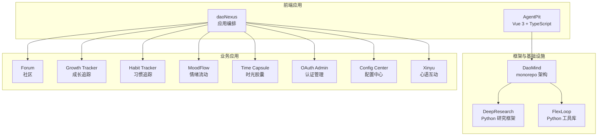
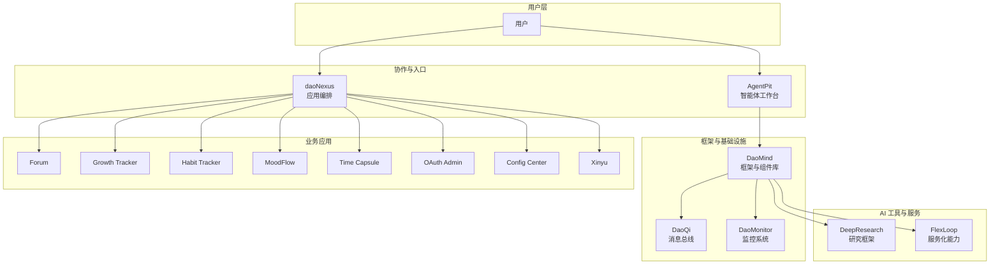
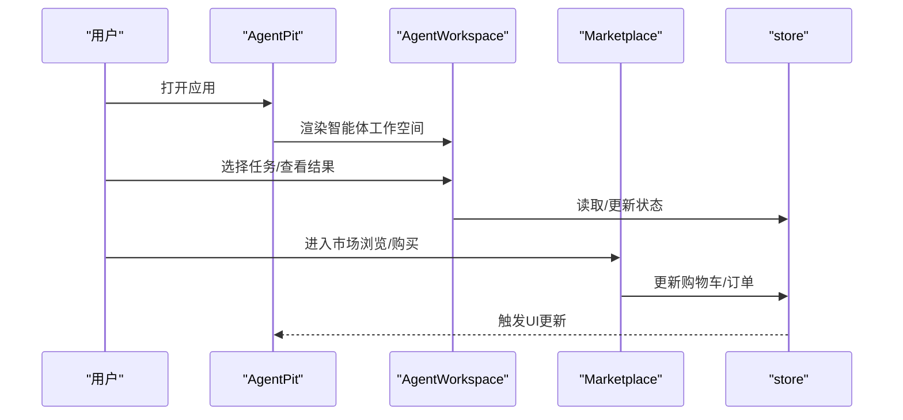
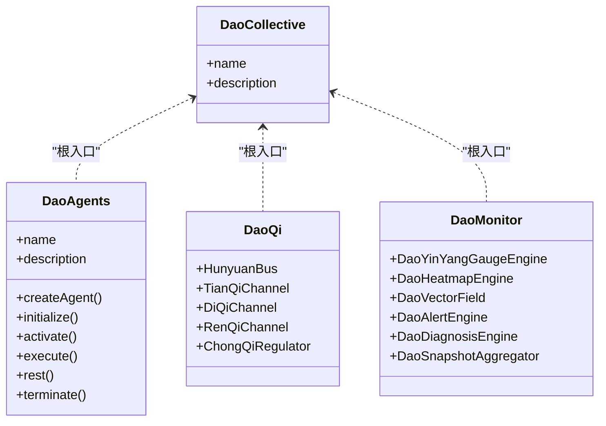
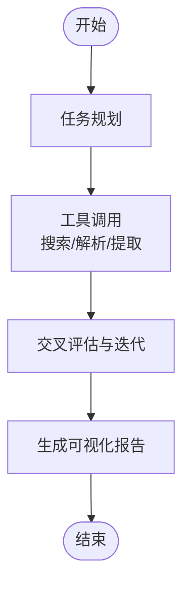
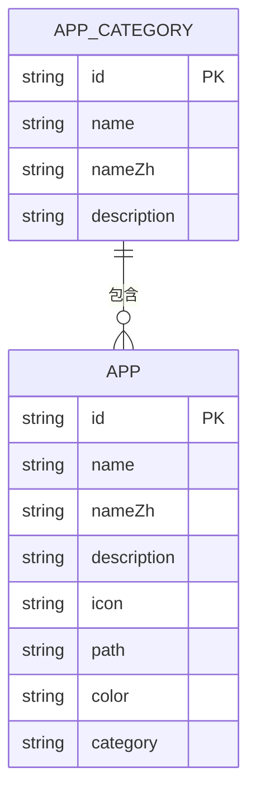
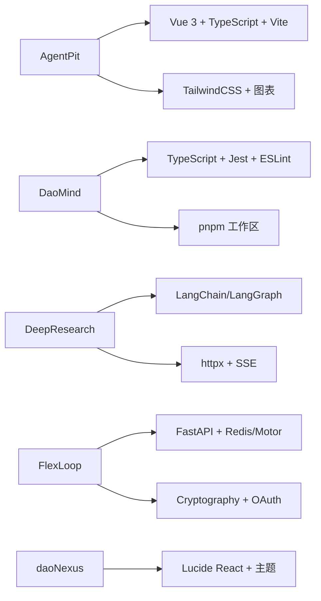

# 核心模块介绍

<cite>
**本文引用的文件**
- [apps/AgentPit/README.md](file://apps/AgentPit/README.md)
- [apps/AgentPit/package.json](file://apps/AgentPit/package.json)
- [apps/AgentPit/src/App.tsx](file://apps/AgentPit/src/App.tsx)
- [apps/AgentPit/src/pages/HomePage.tsx](file://apps/AgentPit/src/pages/HomePage.tsx)
- [apps/AgentPit/src/components/collaboration/AgentWorkspace.tsx](file://apps/AgentPit/src/components/collaboration/AgentWorkspace.tsx)
- [apps/AgentPit/src/components/customize/AgentCreatorWizard.tsx](file://apps/AgentPit/src/components/customize/AgentCreatorWizard.tsx)
- [apps/AgentPit/src/components/marketplace/ProductGrid.tsx](file://apps/AgentPit/src/components/marketplace/ProductGrid.tsx)
- [apps/AgentPit/src/store/useAppStore.ts](file://apps/AgentPit/src/store/useAppStore.ts)
- [apps/DaoMind/README.md](file://apps/DaoMind/README.md)
- [apps/DaoMind/package.json](file://apps/DaoMind/package.json)
- [apps/DaoMind/packages/daoCollective/src/index.ts](file://apps/DaoMind/packages/daoCollective/src/index.ts)
- [apps/DaoMind/packages/daoAgents/src/index.ts](file://apps/DaoMind/packages/daoAgents/src/index.ts)
- [apps/DaoMind/packages/daoQi/src/index.ts](file://apps/DaoMind/packages/daoQi/src/index.ts)
- [apps/DaoMind/packages/daoMonitor/src/index.ts](file://apps/DaoMind/packages/daoMonitor/src/index.ts)
- [apps/daoNexus/src/data/apps.ts](file://apps/daoNexus/src/data/apps.ts)
- [apps/daoNexus/src/App.tsx](file://apps/daoNexus/src/App.tsx)
- [apps/forum/src/App.tsx](file://apps/forum/src/App.tsx)
- [apps/growth-tracker/src/App.tsx](file://apps/growth-tracker/src/App.tsx)
- [apps/habit-tracker/src/App.tsx](file://apps/habit-tracker/src/App.tsx)
- [apps/moodflow/src/App.tsx](file://apps/moodflow/src/App.tsx)
- [apps/time-capsule/src/App.tsx](file://apps/time-capsule/src/App.tsx)
- [apps/oauth-admin/src/App.tsx](file://apps/oauth-admin/src/App.tsx)
- [apps/config-center/src/App.tsx](file://apps/config-center/src/App.tsx)
- [apps/xinyu/src/App.tsx](file://apps/xinyu/src/App.tsx)
- [tools/DeepResearch/README.md](file://tools/DeepResearch/README.md)
- [tools/DeepResearch/pyproject.toml](file://tools/DeepResearch/pyproject.toml)
- [tools/flexloop/README.md](file://tools/flexloop/README.md)
- [tools/flexloop/pyproject.toml](file://tools/flexloop/pyproject.toml)
</cite>

## 目录
1. [引言](#引言)
2. [项目结构](#项目结构)
3. [核心组件](#核心组件)
4. [架构总览](#架构总览)
5. [详细组件分析](#详细组件分析)
6. [依赖分析](#依赖分析)
7. [性能考虑](#性能考虑)
8. [故障排查指南](#故障排查指南)
9. [结论](#结论)
10. [附录](#附录)

## 引言
DAO Collective 是一个融合道家哲学思想与现代技术的多模态、多语言、多框架的生态体系。项目围绕四大核心模块展开：智能体协作平台（AgentPit）、DAO 应用开发框架（DaoMind）、AI 工具平台（DeepResearch/FlexLoop），以及业务应用集合（daoNexus 下的各类应用）。这些模块既相对独立，又通过统一的框架与工具链实现协同与数据流转，形成“道生一，一生二，二生三，三生万物”的系统化能力。

## 项目结构
项目采用多仓库/多应用并存的组织方式，核心模块分布如下：
- AgentPit：基于 Vue 3 + TypeScript 的前端应用，聚焦智能体协作与工作空间。
- DaoMind：基于 monorepo 的系统框架与组件库，提供代理、消息总线、监控等能力。
- DeepResearch：基于 Python 的深度研究框架，强调多模型协作与可视化报告。
- FlexLoop：基于 Python 的通用工具库与服务化能力集合，覆盖认证、配置中心、任务队列、文件存储、邮件服务、数据分析、OAuth、二维码、审计、多智能体等。
- daoNexus：应用编排与入口，聚合社区、效率、工具、管理类应用。

图表来源
- [apps/AgentPit/package.json:1-73](file://apps/AgentPit/package.json#L1-L73)
- [apps/DaoMind/package.json:1-1](file://apps/DaoMind/package.json#L1-L1)
- [apps/DaoMind/README.md:323-350](file://apps/DaoMind/README.md#L323-L350)
- [apps/daoNexus/src/data/apps.ts:41-132](file://apps/daoNexus/src/data/apps.ts#L41-L132)

章节来源
- [apps/AgentPit/README.md:1-6](file://apps/AgentPit/README.md#L1-L6)
- [apps/DaoMind/README.md:1-552](file://apps/DaoMind/README.md#L1-L552)
- [apps/daoNexus/src/data/apps.ts:14-137](file://apps/daoNexus/src/data/apps.ts#L14-L137)

## 核心组件
本节对四大核心模块的功能定位、技术特色与生态作用进行概览式说明，并给出使用场景与价值边界。

- 智能体协作平台（AgentPit）
  - 功能定位：提供智能体的创建、配置、工作空间与协作界面，支持聊天、任务分配、市场交易与商业化展示。
  - 技术特色：Vue 3 + TypeScript + Vite；Pinia 状态管理；TailwindCSS；组件化布局与模块卡片。
  - 生态作用：作为智能体使用者的入口与工作台，承载个性化定制与协作流程。
  - 使用场景：智能体开发者与运营者日常工作、团队协作、产品展示与交易。

- DAO 应用开发框架（DaoMind）
  - 功能定位：提供系统化的框架与组件库，包括代理管理、消息总线（四气通道）、监控系统、模块化开发与基准测试。
  - 技术特色：monorepo 架构；TypeScript；基于道家哲学的架构映射（道/无/有/气/反馈回归/阴阳平衡/自然无为）。
  - 生态作用：为 AgentPit 与业务应用提供底层能力与统一范式，保障系统可观测与可扩展。
  - 使用场景：构建可复用的模块化组件、实现跨模块通信、进行系统监控与诊断。

- AI 工具平台（DeepResearch/FlexLoop）
  - 功能定位：DeepResearch 提供多模型协作与可视化报告；FlexLoop 提供认证、配置中心、任务队列、文件存储、邮件服务、数据分析、OAuth、二维码、审计、多智能体等服务化能力。
  - 技术特色：Python 生态；LangChain/LangGraph；HTTPX/MCP；Pydantic；FastAPI；异步与并发；丰富的可选依赖组合。
  - 生态作用：为生态提供 AI 研究与工程化工具链，支撑业务应用的数据与服务能力。
  - 使用场景：复杂信息分析、报告生成、服务化组件复用、多智能体编排。

- 业务应用集合（daoNexus）
  - 功能定位：应用编排与入口，聚合社区、效率、工具、管理类应用。
  - 技术特色：分类与图标化展示；路由与颜色主题；统一入口导航。
  - 生态作用：作为生态应用的统一门户，串联各子应用，提升用户体验与发现效率。
  - 使用场景：社区交流、个人成长追踪、习惯养成、情绪记录、时光胶囊、配置与认证管理、互动娱乐。

章节来源
- [apps/AgentPit/package.json:1-73](file://apps/AgentPit/package.json#L1-L73)
- [apps/DaoMind/README.md:7-26](file://apps/DaoMind/README.md#L7-L26)
- [tools/DeepResearch/README.md:15-38](file://tools/DeepResearch/README.md#L15-L38)
- [tools/flexloop/README.md:1-100](file://tools/flexloop/README.md#L1-L100)
- [apps/daoNexus/src/data/apps.ts:14-137](file://apps/daoNexus/src/data/apps.ts#L14-L137)

## 架构总览
四大模块之间的协作关系与数据流转机制如下：

图表来源
- [apps/AgentPit/src/App.tsx](file://apps/AgentPit/src/App.tsx)
- [apps/DaoMind/packages/daoCollective/src/index.ts:1-5](file://apps/DaoMind/packages/daoCollective/src/index.ts#L1-L5)
- [apps/DaoMind/packages/daoQi/src/index.ts:1-28](file://apps/DaoMind/packages/daoQi/src/index.ts#L1-L28)
- [apps/DaoMind/packages/daoMonitor/src/index.ts:1-17](file://apps/DaoMind/packages/daoMonitor/src/index.ts#L1-L17)
- [apps/daoNexus/src/App.tsx](file://apps/daoNexus/src/App.tsx)
- [apps/daoNexus/src/data/apps.ts:41-132](file://apps/daoNexus/src/data/apps.ts#L41-L132)

## 详细组件分析

### 智能体协作平台（AgentPit）
- 功能列表
  - 智能体工作空间：集中展示与操作智能体，支持任务分发与协作结果查看。
  - 智能体创建向导：引导完成智能体基本信息、外观与能力配置。
  - 市场与交易：商品网格、搜索过滤、订单管理、评价系统与购物车。
  - 个性化定制：智能体预览、外观定制、商业模式设置与分析面板。
  - 商业化与钱包：收入图表、交易历史、钱包卡片与提现弹窗。
  - 社交与沟通：社交页、聊天页、日历与会议安排。
  - 生活方式：游戏中心、旅行规划与生活仪表盘。
  - 内存与知识：文件管理、知识图谱、记忆搜索与时间线、备份与配额。
  - 设置与布局：主布局、侧边栏、头部与页脚。
- 使用场景
  - 智能体开发者：通过工作空间与创建向导快速搭建与调试智能体。
  - 团队协作：利用任务分发与沟通面板提升协作效率。
  - 商业运营：通过市场与钱包模块实现智能体相关产品的交易与收益管理。
- 数据流与状态
  - 使用 Pinia 管理全局状态，组件通过 store 进行读写与订阅。
  - 页面组件负责路由与视图渲染，工作空间与创建向导承担核心交互逻辑。

图表来源
- [apps/AgentPit/src/components/collaboration/AgentWorkspace.tsx](file://apps/AgentPit/src/components/collaboration/AgentWorkspace.tsx)
- [apps/AgentPit/src/components/marketplace/ProductGrid.tsx](file://apps/AgentPit/src/components/marketplace/ProductGrid.tsx)
- [apps/AgentPit/src/store/useAppStore.ts](file://apps/AgentPit/src/store/useAppStore.ts)
- [apps/AgentPit/src/App.tsx](file://apps/AgentPit/src/App.tsx)

章节来源
- [apps/AgentPit/src/pages/HomePage.tsx](file://apps/AgentPit/src/pages/HomePage.tsx)
- [apps/AgentPit/src/components/collaboration/AgentWorkspace.tsx](file://apps/AgentPit/src/components/collaboration/AgentWorkspace.tsx)
- [apps/AgentPit/src/components/customize/AgentCreatorWizard.tsx](file://apps/AgentPit/src/components/customize/AgentCreatorWizard.tsx)
- [apps/AgentPit/src/components/marketplace/ProductGrid.tsx](file://apps/AgentPit/src/components/marketplace/ProductGrid.tsx)
- [apps/AgentPit/src/store/useAppStore.ts](file://apps/AgentPit/src/store/useAppStore.ts)

### DAO 应用开发框架（DaoMind）
- 功能列表
  - 代理管理：创建、初始化、激活、执行动作与终止。
  - 模块管理：注册、初始化、激活与查询模块。
  - 消息总线（DaoQi）：四通道（天/地/人/冲）消息通道与混元总线。
  - 监控系统（DaoMonitor）：阴阳仪表盘、热力图、向量场、告警引擎、诊断引擎与快照聚合。
  - 基准测试与类型安全：内置基准测试套件与完整 TypeScript 支持。
- 技术特色
  - 道家哲学映射：道（daoCollective）→ 无（daoNothing）→ 有（daoAnything）→ 气（Qi）→ 反者道之动 → 阴阳平衡 → 自然无为。
  - 统一消息协议与通道：四通道系统与冲气调节机制。
  - 全面监控：热力图、向量场、仪表盘、告警与诊断一体化。
- 使用场景
  - 构建可复用组件与模块，实现跨模块通信与可观测性。
  - 在 AgentPit 与业务应用中复用代理与监控能力，保障系统稳定性与性能。

图表来源
- [apps/DaoMind/packages/daoCollective/src/index.ts:1-5](file://apps/DaoMind/packages/daoCollective/src/index.ts#L1-L5)
- [apps/DaoMind/packages/daoAgents/src/index.ts:1-9](file://apps/DaoMind/packages/daoAgents/src/index.ts#L1-L9)
- [apps/DaoMind/packages/daoQi/src/index.ts:1-28](file://apps/DaoMind/packages/daoQi/src/index.ts#L1-L28)
- [apps/DaoMind/packages/daoMonitor/src/index.ts:1-17](file://apps/DaoMind/packages/daoMonitor/src/index.ts#L1-L17)

章节来源
- [apps/DaoMind/README.md:7-26](file://apps/DaoMind/README.md#L7-L26)
- [apps/DaoMind/README.md:482-521](file://apps/DaoMind/README.md#L482-L521)
- [apps/DaoMind/packages/daoCollective/src/index.ts:1-5](file://apps/DaoMind/packages/daoCollective/src/index.ts#L1-L5)
- [apps/DaoMind/packages/daoAgents/src/index.ts:1-9](file://apps/DaoMind/packages/daoAgents/src/index.ts#L1-L9)
- [apps/DaoMind/packages/daoQi/src/index.ts:1-28](file://apps/DaoMind/packages/daoQi/src/index.ts#L1-L28)
- [apps/DaoMind/packages/daoMonitor/src/index.ts:1-17](file://apps/DaoMind/packages/daoMonitor/src/index.ts#L1-L17)

### AI 工具平台（DeepResearch/FlexLoop）
- DeepResearch
  - 功能定位：多模型协作、搜索工具集成、可视化报告生成。
  - 技术特色：轻量部署、灵活配置、减少幻觉、跨评估验证。
  - 使用场景：复杂信息分析、行业全景分析、产品与应用研究。
- FlexLoop
  - 功能定位：服务化能力集合，覆盖认证、配置中心、任务队列、文件存储、邮件服务、数据分析、OAuth、二维码、审计、多智能体等。
  - 技术特色：FastAPI、异步并发、丰富的可选依赖组合、模块化服务拆分。
  - 使用场景：企业级服务化组件复用、多智能体编排与治理、统一认证与配置管理。

图表来源
- [tools/DeepResearch/README.md:15-38](file://tools/DeepResearch/README.md#L15-L38)

章节来源
- [tools/DeepResearch/README.md:15-38](file://tools/DeepResearch/README.md#L15-L38)
- [tools/DeepResearch/pyproject.toml:12-26](file://tools/DeepResearch/pyproject.toml#L12-L26)
- [tools/flexloop/README.md:1-100](file://tools/flexloop/README.md#L1-L100)
- [tools/flexloop/pyproject.toml:55-318](file://tools/flexloop/pyproject.toml#L55-L318)

### 业务应用集合（daoNexus）
- 功能列表
  - 应用分类：社区交流、效率工具、实用工具、系统管理。
  - 应用展示：图标、名称、描述、颜色主题与路由路径。
  - 分类筛选：按类别获取应用列表。
- 使用场景
  - 作为生态应用的统一入口，提升用户发现与使用效率。
  - 与各子应用（论坛、成长追踪、习惯追踪、情绪流动、时光胶囊、OAuth 管理后台、配置中心、心语互动）协同工作。

图表来源
- [apps/daoNexus/src/data/apps.ts:14-137](file://apps/daoNexus/src/data/apps.ts#L14-L137)

章节来源
- [apps/daoNexus/src/data/apps.ts:14-137](file://apps/daoNexus/src/data/apps.ts#L14-L137)
- [apps/daoNexus/src/App.tsx](file://apps/daoNexus/src/App.tsx)

## 依赖分析
- AgentPit
  - 依赖：Vue 3、TypeScript、Vite、TailwindCSS、Pinia、Vue Router、ECharts、vee-validate、yup 等。
  - 用途：前端应用开发与状态管理、UI 组件与图表展示。
- DaoMind
  - 依赖：TypeScript、Jest、ESLint、Prettier 等；monorepo 工作区管理。
  - 用途：框架与组件库开发、测试与质量保证。
- DeepResearch
  - 依赖：httpx、httpx-sse、mcp、pydantic、pydantic-settings、tavily-python、langchain、langgraph、json-repair、beautifulsoup4、lxml、mistune 等。
  - 用途：LLM 协作、搜索与解析、报告生成。
- FlexLoop
  - 依赖：FastAPI、Redis、Motor、Uvicorn、Pydantic、Pydantic-Settings、Jinja2、SQLAlchemy、Cryptography、Pillow、QrCode 等。
  - 用途：认证、配置中心、任务队列、文件存储、邮件服务、数据分析、OAuth、二维码、审计、多智能体等。
- daoNexus
  - 依赖：Lucide React、TailwindCSS、路由与主题配置。
  - 用途：应用编排与入口导航。

图表来源
- [apps/AgentPit/package.json:20-40](file://apps/AgentPit/package.json#L20-L40)
- [apps/DaoMind/package.json:1-1](file://apps/DaoMind/package.json#L1-L1)
- [tools/DeepResearch/pyproject.toml:12-26](file://tools/DeepResearch/pyproject.toml#L12-L26)
- [tools/flexloop/pyproject.toml:55-318](file://tools/flexloop/pyproject.toml#L55-L318)
- [apps/daoNexus/src/data/apps.ts:14-137](file://apps/daoNexus/src/data/apps.ts#L14-L137)

章节来源
- [apps/AgentPit/package.json:1-73](file://apps/AgentPit/package.json#L1-L73)
- [apps/DaoMind/package.json:1-1](file://apps/DaoMind/package.json#L1-L1)
- [tools/DeepResearch/pyproject.toml:12-26](file://tools/DeepResearch/pyproject.toml#L12-L26)
- [tools/flexloop/pyproject.toml:55-318](file://tools/flexloop/pyproject.toml#L55-L318)
- [apps/daoNexus/src/data/apps.ts:14-137](file://apps/daoNexus/src/data/apps.ts#L14-L137)

## 性能考虑
- AgentPit
  - 前端性能：合理拆分组件、按需加载、TailwindCSS 与 ECharts 的使用需关注体积与渲染开销。
  - 状态管理：Pinia 的持久化插件可提升体验，但需注意存储大小与序列化成本。
- DaoMind
  - 消息总线与监控：高频消息与监控指标采集需关注吞吐与延迟，建议结合 DaoMonitor 的热力图与向量场进行性能观测。
  - 基准测试：定期运行基准测试，确保启动时间、内存占用与消息吞吐满足预期。
- DeepResearch
  - 多模型协作与搜索工具调用的成本较高，建议通过缓存与批处理降低重复计算与网络请求。
- FlexLoop
  - 服务化组件的并发与限流策略至关重要，建议结合速率限制与队列机制保障稳定性。
- daoNexus
  - 应用分类与图标渲染应避免过度重绘，保持路由与主题切换的流畅性。

## 故障排查指南
- AgentPit
  - 构建失败：检查 TypeScript 类型检查与依赖安装；确认 Vite 与 Vue 版本兼容。
  - 测试失败：查看 Vitest 输出与覆盖率报告，定位具体组件或状态逻辑问题。
- DaoMind
  - 子包导入失败：确保已构建项目并检查 tsconfig 路径映射；确认包名与导出路径正确。
  - 性能问题：运行基准测试与 DaoMonitor 的监控工具，识别瓶颈并优化。
- DeepResearch
  - 依赖缺失：根据 pyproject.toml 安装所需依赖；注意 Python 版本要求。
  - CLI 使用：参考 README 的快速开始与命令行参数说明。
- FlexLoop
  - 服务依赖：根据可选依赖组合安装对应模块（如 auth-server、config-server、task-queue-server 等）。
  - 测试与覆盖率：使用 pytest 与覆盖率工具验证功能与质量。
- daoNexus
  - 应用列表为空：检查分类配置与路由路径；确认应用图标与颜色主题正确加载。

章节来源
- [apps/AgentPit/README.md:1-6](file://apps/AgentPit/README.md#L1-L6)
- [apps/DaoMind/README.md:398-444](file://apps/DaoMind/README.md#L398-L444)
- [tools/DeepResearch/README.md:39-56](file://tools/DeepResearch/README.md#L39-L56)
- [tools/flexloop/README.md:45-80](file://tools/flexloop/README.md#L45-L80)
- [apps/daoNexus/src/data/apps.ts:14-137](file://apps/daoNexus/src/data/apps.ts#L14-L137)

## 结论
DAO Collective 通过 AgentPit 的智能体协作、DaoMind 的框架与基础设施、DeepResearch/FlexLoop 的 AI 工具与服务化能力，以及 daoNexus 的应用编排，形成了从“道”到“器”的完整能力闭环。四大模块在统一的哲学与技术范式下协同工作，既保证了系统的可扩展性与可观测性，也为开发者提供了清晰的工具链与实践路径。

## 附录
- 快速入门
  - AgentPit：安装依赖后运行开发服务器，访问应用首页。
  - DaoMind：安装 pnpm 并在根目录运行构建与测试脚本。
  - DeepResearch：克隆仓库、安装依赖并运行 CLI。
  - FlexLoop：根据需要安装可选依赖，运行相应服务或测试。
- 参考文件
  - AgentPit：[apps/AgentPit/package.json](file://apps/AgentPit/package.json)、[apps/AgentPit/src/App.tsx](file://apps/AgentPit/src/App.tsx)
  - DaoMind：[apps/DaoMind/README.md](file://apps/DaoMind/README.md)、[apps/DaoMind/packages/daoQi/src/index.ts](file://apps/DaoMind/packages/daoQi/src/index.ts)
  - DeepResearch：[tools/DeepResearch/README.md](file://tools/DeepResearch/README.md)、[tools/DeepResearch/pyproject.toml](file://tools/DeepResearch/pyproject.toml)
  - FlexLoop：[tools/flexloop/README.md](file://tools/flexloop/README.md)、[tools/flexloop/pyproject.toml](file://tools/flexloop/pyproject.toml)
  - daoNexus：[apps/daoNexus/src/data/apps.ts](file://apps/daoNexus/src/data/apps.ts)、[apps/daoNexus/src/App.tsx](file://apps/daoNexus/src/App.tsx)