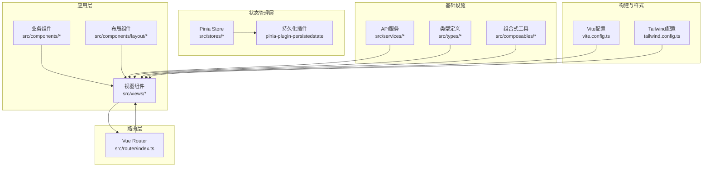
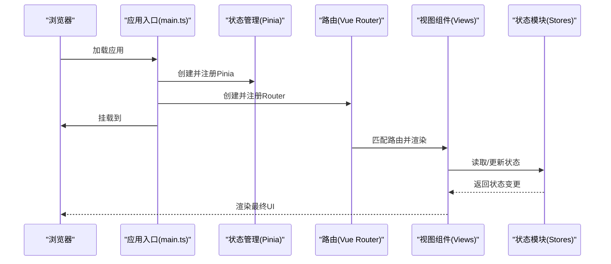
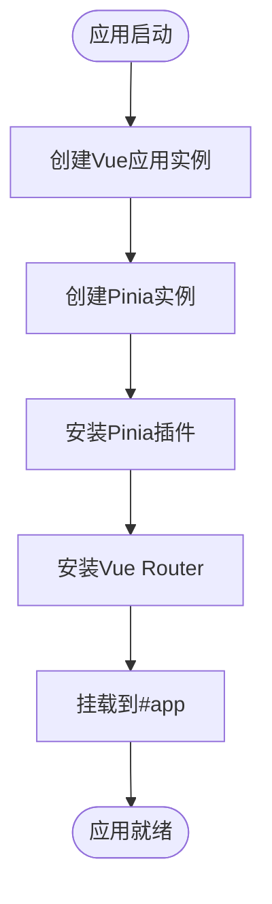
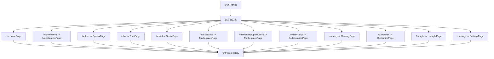
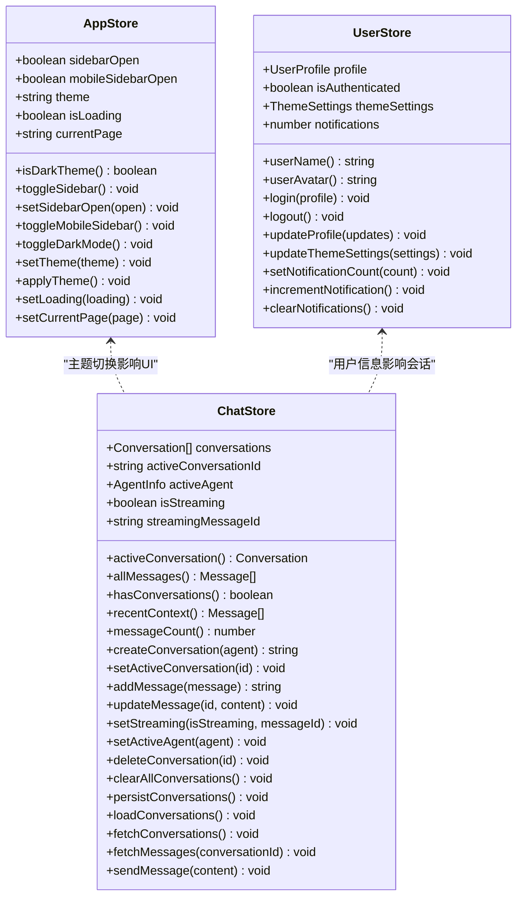
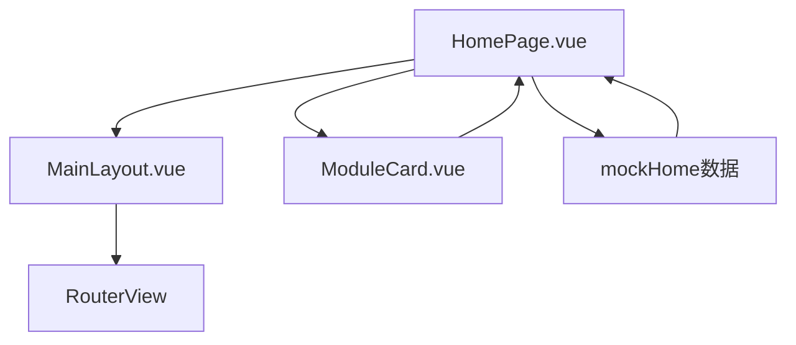
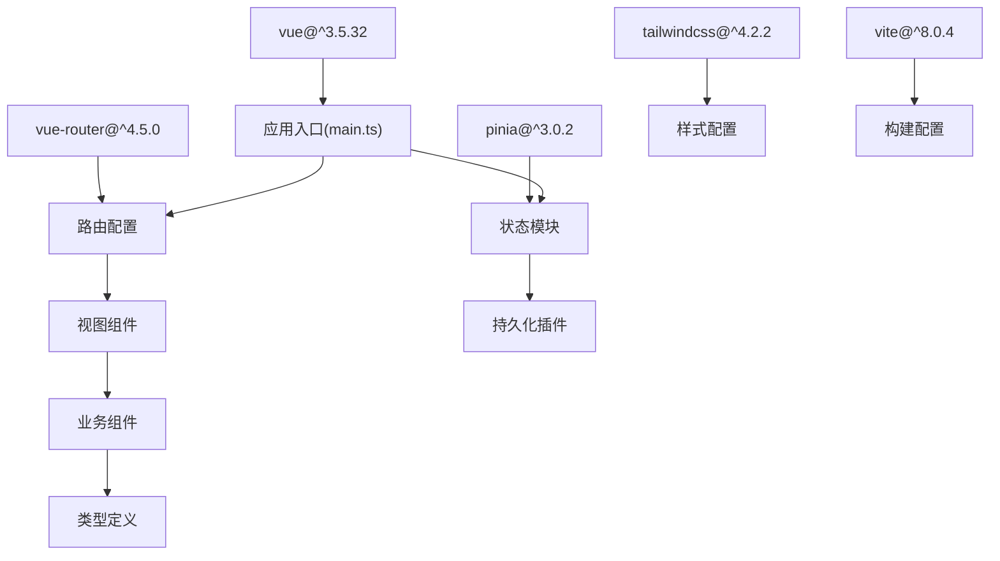

# AgentPit智能体平台

<cite>
**本文档引用的文件**
- [package.json](file://apps/AgentPit/package.json)
- [main.ts](file://apps/AgentPit/src/main.ts)
- [App.vue](file://apps/AgentPit/src/App.vue)
- [router/index.ts](file://apps/AgentPit/src/router/index.ts)
- [stores/index.ts](file://apps/AgentPit/src/stores/index.ts)
- [stores/useAppStore.ts](file://apps/AgentPit/src/stores/useAppStore.ts)
- [stores/useUserStore.ts](file://apps/AgentPit/src/stores/useUserStore.ts)
- [stores/useChatStore.ts](file://apps/AgentPit/src/stores/useChatStore.ts)
- [vite.config.ts](file://apps/AgentPit/vite.config.ts)
- [tailwind.config.ts](file://apps/AgentPit/tailwind.config.ts)
- [views/HomePage.vue](file://apps/AgentPit/src/views/HomePage.vue)
- [types/index.ts](file://apps/AgentPit/src/types/index.ts)
- [composables/useDebounce.ts](file://apps/AgentPit/src/composables/useDebounce.ts)
- [README.md](file://apps/AgentPit/README.md)
</cite>

## 目录
1. [简介](#简介)
2. [项目结构](#项目结构)
3. [核心组件](#核心组件)
4. [架构总览](#架构总览)
5. [详细组件分析](#详细组件分析)
6. [依赖关系分析](#依赖关系分析)
7. [性能考虑](#性能考虑)
8. [故障排除指南](#故障排除指南)
9. [结论](#结论)
10. [附录](#附录)

## 简介
AgentPit智能体平台是一个基于Vue 3 + TypeScript + Vite构建的现代化前端应用，采用模块化架构与组件化开发模式，围绕智能体的创建、配置、管理和运营提供统一的用户体验。平台通过Pinia进行状态管理，结合Vue Router实现多页面路由，并集成TailwindCSS进行样式管理。核心功能覆盖主页导航、聊天交互、变现模块、社交协作、市场交易、个性化定制、生活方式服务等多个业务域。

## 项目结构
AgentPit位于工作空间/apps/AgentPit目录下，采用单包多页面架构，主要目录组织如下：
- src：源代码根目录
  - components：可复用UI组件与业务组件
  - views：页面级视图组件
  - stores：Pinia状态管理模块
  - router：路由配置
  - services：API服务封装
  - composables：组合式工具函数
  - types：类型定义聚合
  - assets：静态资源
- packages/ui：独立UI组件库包
- 配置文件：vite.config.ts、tailwind.config.ts、tsconfig.* 等

**图表来源**
- [main.ts:1-13](file://apps/AgentPit/src/main.ts#L1-L13)
- [router/index.ts:1-73](file://apps/AgentPit/src/router/index.ts#L1-L73)
- [stores/index.ts:1-15](file://apps/AgentPit/src/stores/index.ts#L1-L15)
- [vite.config.ts:1-15](file://apps/AgentPit/vite.config.ts#L1-L15)
- [tailwind.config.ts:1-27](file://apps/AgentPit/tailwind.config.ts#L1-L27)

**章节来源**
- [README.md:1-6](file://apps/AgentPit/README.md#L1-L6)
- [package.json:1-74](file://apps/AgentPit/package.json#L1-L74)

## 核心组件
本节概述平台的关键技术组件及其职责：
- 应用入口与初始化：负责创建Vue实例、挂载Pinia与Router，并引导应用启动。
- 路由系统：定义平台各功能页面的路由映射，支持动态导入以优化首屏加载。
- 状态管理：通过Pinia集中管理应用状态，包含应用配置、用户信息、聊天会话等。
- 视图与布局：页面级组件承载具体业务功能，配合布局组件实现一致的视觉与交互体验。
- 构建与样式：Vite提供开发与生产构建能力，TailwindCSS提供原子化样式支持。

**章节来源**
- [main.ts:1-13](file://apps/AgentPit/src/main.ts#L1-L13)
- [router/index.ts:1-73](file://apps/AgentPit/src/router/index.ts#L1-L73)
- [stores/index.ts:1-15](file://apps/AgentPit/src/stores/index.ts#L1-L15)
- [vite.config.ts:1-15](file://apps/AgentPit/vite.config.ts#L1-L15)
- [tailwind.config.ts:1-27](file://apps/AgentPit/tailwind.config.ts#L1-L27)

## 架构总览
AgentPit采用分层架构与模块化设计，确保高内聚、低耦合与可扩展性。整体交互流程如下：

**图表来源**
- [main.ts:1-13](file://apps/AgentPit/src/main.ts#L1-L13)
- [router/index.ts:1-73](file://apps/AgentPit/src/router/index.ts#L1-L73)
- [stores/index.ts:1-15](file://apps/AgentPit/src/stores/index.ts#L1-L15)

## 详细组件分析

### 应用入口与初始化
应用入口负责创建Vue实例、安装Pinia与Router，并将应用挂载到DOM节点。该流程确保了后续组件树能够正确访问全局状态与路由能力。

**图表来源**
- [main.ts:1-13](file://apps/AgentPit/src/main.ts#L1-L13)

**章节来源**
- [main.ts:1-13](file://apps/AgentPit/src/main.ts#L1-L13)

### 路由系统
平台通过Vue Router定义了多页面路由，支持按需加载视图组件以提升性能。路由表包含主页、聊天、社交、市场、协作、记忆、定制、生活、设置以及变现等模块页面。

**图表来源**
- [router/index.ts:1-73](file://apps/AgentPit/src/router/index.ts#L1-L73)

**章节来源**
- [router/index.ts:1-73](file://apps/AgentPit/src/router/index.ts#L1-L73)

### Pinia状态管理
平台采用Pinia进行状态管理，包含应用配置、用户信息、聊天会话等核心状态模块。状态管理具备持久化能力，确保用户偏好与会话数据在刷新后仍可恢复。

**图表来源**
- [stores/useAppStore.ts:1-89](file://apps/AgentPit/src/stores/useAppStore.ts#L1-L89)
- [stores/useUserStore.ts:1-72](file://apps/AgentPit/src/stores/useUserStore.ts#L1-L72)
- [stores/useChatStore.ts:1-218](file://apps/AgentPit/src/stores/useChatStore.ts#L1-L218)

**章节来源**
- [stores/index.ts:1-15](file://apps/AgentPit/src/stores/index.ts#L1-L15)
- [stores/useAppStore.ts:1-89](file://apps/AgentPit/src/stores/useAppStore.ts#L1-L89)
- [stores/useUserStore.ts:1-72](file://apps/AgentPit/src/stores/useUserStore.ts#L1-L72)
- [stores/useChatStore.ts:1-218](file://apps/AgentPit/src/stores/useChatStore.ts#L1-L218)

### 视图组件与页面
主页作为平台入口，采用模块化卡片布局展示核心功能与扩展模块，并通过过渡动画增强用户体验。页面结构清晰，便于扩展新的功能模块。

**图表来源**
- [views/HomePage.vue:1-469](file://apps/AgentPit/src/views/HomePage.vue#L1-L469)

**章节来源**
- [views/HomePage.vue:1-469](file://apps/AgentPit/src/views/HomePage.vue#L1-L469)

### 组合式工具与类型系统
平台提供了通用的组合式工具函数与完善的类型定义体系，用于提升开发效率与代码质量。

- 组合式工具：如防抖工具，用于优化输入响应与搜索场景。
- 类型系统：集中导出各类业务类型，便于全局引用与IDE智能提示。

**章节来源**
- [composables/useDebounce.ts:1-21](file://apps/AgentPit/src/composables/useDebounce.ts#L1-L21)
- [types/index.ts:1-29](file://apps/AgentPit/src/types/index.ts#L1-L29)

## 依赖关系分析
AgentPit的核心依赖包括Vue 3、TypeScript、Pinia、Vue Router、TailwindCSS等，构建工具链由Vite提供支持。依赖关系如下：

**图表来源**
- [package.json:20-40](file://apps/AgentPit/package.json#L20-L40)
- [main.ts:1-13](file://apps/AgentPit/src/main.ts#L1-L13)
- [router/index.ts:1-73](file://apps/AgentPit/src/router/index.ts#L1-L73)
- [stores/index.ts:1-15](file://apps/AgentPit/src/stores/index.ts#L1-L15)
- [vite.config.ts:1-15](file://apps/AgentPit/vite.config.ts#L1-L15)
- [tailwind.config.ts:1-27](file://apps/AgentPit/tailwind.config.ts#L1-L27)

**章节来源**
- [package.json:1-74](file://apps/AgentPit/package.json#L1-L74)

## 性能考虑
- 路由懒加载：通过动态导入视图组件，减少初始包体积，提升首屏加载速度。
- 状态持久化：Pinia持久化插件仅保存必要字段，避免冗余数据占用存储空间。
- 样式按需：TailwindCSS扫描源码路径，确保未使用的样式被移除，降低CSS体积。
- 组件拆分：模块化与组件化设计便于按需加载与缓存，提升交互流畅度。

## 故障排除指南
- 启动失败：检查Node版本与依赖安装，确保执行安装脚本后再次启动开发服务器。
- 路由不生效：确认路由配置中的路径与视图组件是否正确匹配，检查动态导入语法。
- 状态异常：检查持久化键名与存储位置，清理浏览器本地存储后重试。
- 样式问题：确认Tailwind配置的content路径包含目标文件，重新生成样式缓存。

## 结论
AgentPit智能体平台通过Vue 3 + TypeScript + Vite构建，采用Pinia与Vue Router实现清晰的分层架构与模块化设计。平台具备良好的扩展性与可维护性，适合在多业务场景下快速迭代与部署。建议在后续开发中持续完善测试体系与性能监控，以保障用户体验与系统稳定性。

## 附录
- 开发环境搭建
  - 安装依赖：使用包管理器安装项目依赖
  - 启动开发服务器：运行开发脚本
  - 代码格式化与类型检查：使用提供的脚本进行格式化与类型检查
- 构建与预览
  - 生产构建：生成优化后的静态资源
  - 预览构建：本地预览生产构建结果
- 测试与覆盖率
  - 单元测试：使用测试框架运行测试
  - 覆盖率报告：生成并查看测试覆盖率

**章节来源**
- [package.json:6-18](file://apps/AgentPit/package.json#L6-L18)