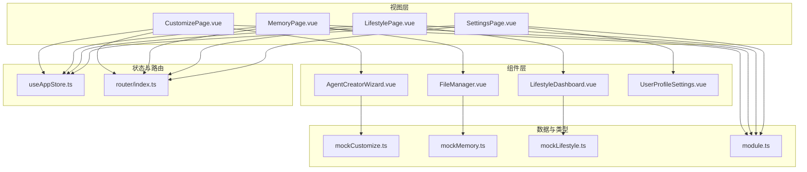
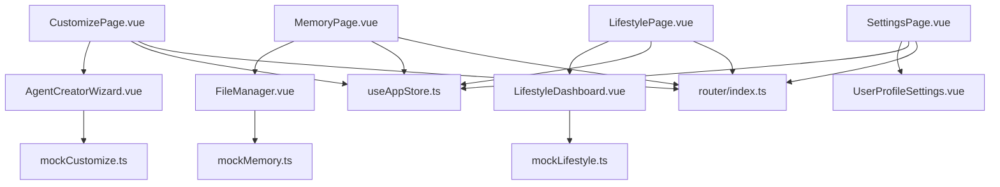
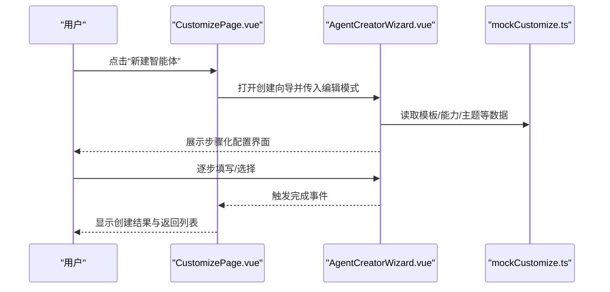
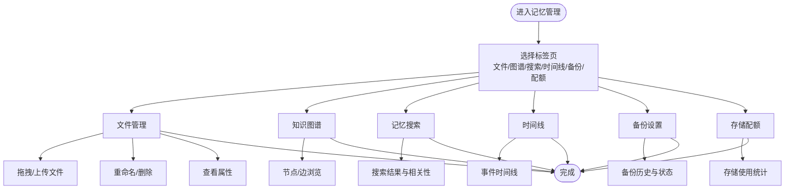
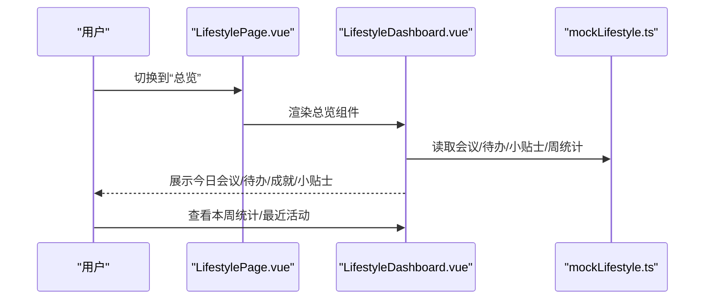
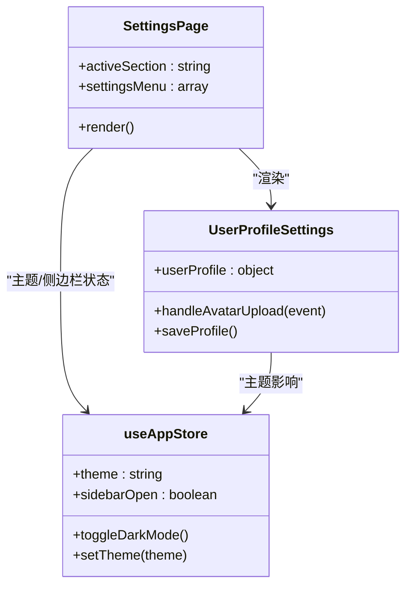
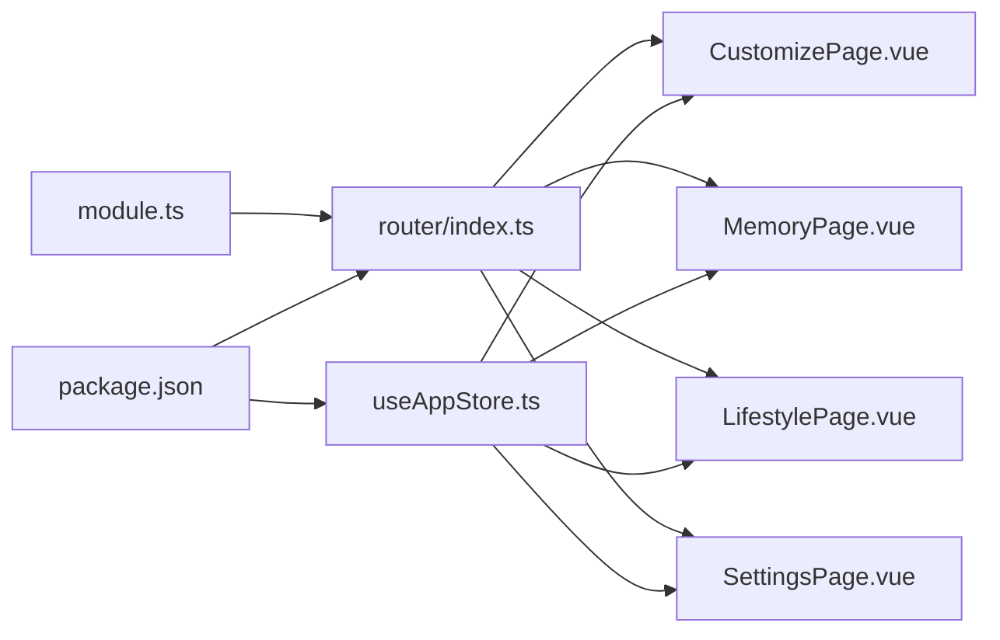

# 扩展功能模块

<cite>
**本文引用的文件**
- [CustomizePage.vue](file://apps/AgentPit/src/views/CustomizePage.vue)
- [AgentCreatorWizard.vue](file://apps/AgentPit/src/components/customize/AgentCreatorWizard.vue)
- [mockCustomize.ts](file://apps/AgentPit/src/data/mockCustomize.ts)
- [MemoryPage.vue](file://apps/AgentPit/src/views/MemoryPage.vue)
- [FileManager.vue](file://apps/AgentPit/src/components/memory/FileManager.vue)
- [mockMemory.ts](file://apps/AgentPit/src/data/mockMemory.ts)
- [LifestylePage.vue](file://apps/AgentPit/src/views/LifestylePage.vue)
- [LifestyleDashboard.vue](file://apps/AgentPit/src/components/lifestyle/LifestyleDashboard.vue)
- [mockLifestyle.ts](file://apps/AgentPit/src/data/mockLifestyle.ts)
- [SettingsPage.vue](file://apps/AgentPit/src/views/SettingsPage.vue)
- [UserProfileSettings.vue](file://apps/AgentPit/src/components/settings/UserProfileSettings.vue)
- [useAppStore.ts](file://apps/AgentPit/src/stores/useAppStore.ts)
- [module.ts](file://apps/AgentPit/src/types/module.ts)
- [index.ts（路由）](file://apps/AgentPit/src/router/index.ts)
- [package.json](file://apps/AgentPit/package.json)
</cite>

## 目录
1. [简介](#简介)
2. [项目结构](#项目结构)
3. [核心组件](#核心组件)
4. [架构总览](#架构总览)
5. [详细组件分析](#详细组件分析)
6. [依赖分析](#依赖分析)
7. [性能考虑](#性能考虑)
8. [故障排查指南](#故障排查指南)
9. [结论](#结论)
10. [附录](#附录)

## 简介
本文件面向 AgentPit 智能体平台的扩展功能模块，系统性阐述以下模块的设计理念与技术实现：
- 智能体定制化系统：提供模板选择、基础信息、外观定制、能力配置与商业模式的全链路创建流程。
- 记忆管理系统：涵盖文件管理、知识图谱、记忆搜索、时间线、备份与存储配额等能力。
- 生活服务系统：整合日历、旅行规划、游戏中心与生活总览，提升用户日常效率与体验。
- 设置管理系统：集中管理用户资料、主题偏好、通知与隐私安全、帮助中心与版本信息。

扩展模块通过清晰的视图组件、可复用的业务组件、类型定义与状态管理，增强智能体的功能性与用户体验；并通过路由与模块类型系统实现与核心模块的统一集成。

## 项目结构
扩展功能模块位于 AgentPit 前端工程中，采用按功能域划分的目录结构：
- 视图层：各模块对应的页面视图，负责布局与导航。
- 组件层：可复用的业务组件，封装交互与状态。
- 数据层：Mock 数据与类型定义，支撑演示与开发。
- 状态层：Pinia Store 管理全局状态（如主题、加载状态）。
- 路由层：统一注册扩展模块路由，便于导航与集成。

**图表来源**
- [CustomizePage.vue:1-217](file://apps/AgentPit/src/views/CustomizePage.vue#L1-L217)
- [AgentCreatorWizard.vue:1-355](file://apps/AgentPit/src/components/customize/AgentCreatorWizard.vue#L1-L355)
- [MemoryPage.vue:1-280](file://apps/AgentPit/src/views/MemoryPage.vue#L1-L280)
- [FileManager.vue:1-440](file://apps/AgentPit/src/components/memory/FileManager.vue#L1-L440)
- [LifestylePage.vue:1-90](file://apps/AgentPit/src/views/LifestylePage.vue#L1-L90)
- [LifestyleDashboard.vue:1-284](file://apps/AgentPit/src/components/lifestyle/LifestyleDashboard.vue#L1-L284)
- [SettingsPage.vue:1-178](file://apps/AgentPit/src/views/SettingsPage.vue#L1-L178)
- [UserProfileSettings.vue:1-142](file://apps/AgentPit/src/components/settings/UserProfileSettings.vue#L1-L142)
- [mockCustomize.ts:1-1267](file://apps/AgentPit/src/data/mockCustomize.ts#L1-L1267)
- [mockMemory.ts:1-754](file://apps/AgentPit/src/data/mockMemory.ts#L1-L754)
- [mockLifestyle.ts:1-841](file://apps/AgentPit/src/data/mockLifestyle.ts#L1-L841)
- [module.ts:1-143](file://apps/AgentPit/src/types/module.ts#L1-L143)
- [useAppStore.ts:1-89](file://apps/AgentPit/src/stores/useAppStore.ts#L1-L89)
- [index.ts（路由）:1-73](file://apps/AgentPit/src/router/index.ts#L1-L73)

**章节来源**
- [CustomizePage.vue:1-217](file://apps/AgentPit/src/views/CustomizePage.vue#L1-L217)
- [MemoryPage.vue:1-280](file://apps/AgentPit/src/views/MemoryPage.vue#L1-L280)
- [LifestylePage.vue:1-90](file://apps/AgentPit/src/views/LifestylePage.vue#L1-L90)
- [SettingsPage.vue:1-178](file://apps/AgentPit/src/views/SettingsPage.vue#L1-L178)
- [index.ts（路由）:1-73](file://apps/AgentPit/src/router/index.ts#L1-L73)

## 核心组件
- 智能体定制化系统
  - 视图：[CustomizePage.vue:1-217](file://apps/AgentPit/src/views/CustomizePage.vue#L1-L217)
  - 创建向导：[AgentCreatorWizard.vue:1-355](file://apps/AgentPit/src/components/customize/AgentCreatorWizard.vue#L1-L355)
  - 配置数据：[mockCustomize.ts:1-1267](file://apps/AgentPit/src/data/mockCustomize.ts#L1-L1267)
- 记忆管理系统
  - 视图：[MemoryPage.vue:1-280](file://apps/AgentPit/src/views/MemoryPage.vue#L1-L280)
  - 文件管理：[FileManager.vue:1-440](file://apps/AgentPit/src/components/memory/FileManager.vue#L1-L440)
  - 数据：[mockMemory.ts:1-754](file://apps/AgentPit/src/data/mockMemory.ts#L1-L754)
- 生活服务系统
  - 视图：[LifestylePage.vue:1-90](file://apps/AgentPit/src/views/LifestylePage.vue#L1-L90)
  - 总览：[LifestyleDashboard.vue:1-284](file://apps/AgentPit/src/components/lifestyle/LifestyleDashboard.vue#L1-L284)
  - 数据：[mockLifestyle.ts:1-841](file://apps/AgentPit/src/data/mockLifestyle.ts#L1-L841)
- 设置管理系统
  - 视图：[SettingsPage.vue:1-178](file://apps/AgentPit/src/views/SettingsPage.vue#L1-L178)
  - 用户资料：[UserProfileSettings.vue:1-142](file://apps/AgentPit/src/components/settings/UserProfileSettings.vue#L1-L142)
- 全局状态与模块类型
  - 状态：[useAppStore.ts:1-89](file://apps/AgentPit/src/stores/useAppStore.ts#L1-L89)
  - 模块类型：[module.ts:1-143](file://apps/AgentPit/src/types/module.ts#L1-L143)
- 路由集成
  - 路由：[index.ts（路由）:1-73](file://apps/AgentPit/src/router/index.ts#L1-L73)

**章节来源**
- [AgentCreatorWizard.vue:1-355](file://apps/AgentPit/src/components/customize/AgentCreatorWizard.vue#L1-L355)
- [FileManager.vue:1-440](file://apps/AgentPit/src/components/memory/FileManager.vue#L1-L440)
- [LifestyleDashboard.vue:1-284](file://apps/AgentPit/src/components/lifestyle/LifestyleDashboard.vue#L1-L284)
- [UserProfileSettings.vue:1-142](file://apps/AgentPit/src/components/settings/UserProfileSettings.vue#L1-L142)
- [useAppStore.ts:1-89](file://apps/AgentPit/src/stores/useAppStore.ts#L1-L89)
- [module.ts:1-143](file://apps/AgentPit/src/types/module.ts#L1-L143)
- [index.ts（路由）:1-73](file://apps/AgentPit/src/router/index.ts#L1-L73)

## 架构总览
扩展模块采用“视图-组件-数据-状态-路由”的分层架构：
- 视图层负责页面布局与导航，使用 KeepAlive 缓存与过渡动画提升交互体验。
- 组件层封装业务能力，通过 provide/inject、props/emits 与父组件通信。
- 数据层提供 Mock 数据与类型定义，支撑开发与演示。
- 状态层通过 Pinia 管理主题、加载状态等跨页面状态。
- 路由层统一注册扩展模块路由，便于与核心模块协同。

**图表来源**
- [CustomizePage.vue:1-217](file://apps/AgentPit/src/views/CustomizePage.vue#L1-L217)
- [AgentCreatorWizard.vue:1-355](file://apps/AgentPit/src/components/customize/AgentCreatorWizard.vue#L1-L355)
- [MemoryPage.vue:1-280](file://apps/AgentPit/src/views/MemoryPage.vue#L1-L280)
- [FileManager.vue:1-440](file://apps/AgentPit/src/components/memory/FileManager.vue#L1-L440)
- [LifestylePage.vue:1-90](file://apps/AgentPit/src/views/LifestylePage.vue#L1-L90)
- [LifestyleDashboard.vue:1-284](file://apps/AgentPit/src/components/lifestyle/LifestyleDashboard.vue#L1-L284)
- [SettingsPage.vue:1-178](file://apps/AgentPit/src/views/SettingsPage.vue#L1-L178)
- [UserProfileSettings.vue:1-142](file://apps/AgentPit/src/components/settings/UserProfileSettings.vue#L1-L142)
- [mockCustomize.ts:1-1267](file://apps/AgentPit/src/data/mockCustomize.ts#L1-L1267)
- [mockMemory.ts:1-754](file://apps/AgentPit/src/data/mockMemory.ts#L1-L754)
- [mockLifestyle.ts:1-841](file://apps/AgentPit/src/data/mockLifestyle.ts#L1-L841)
- [useAppStore.ts:1-89](file://apps/AgentPit/src/stores/useAppStore.ts#L1-L89)
- [index.ts（路由）:1-73](file://apps/AgentPit/src/router/index.ts#L1-L73)

## 详细组件分析

### 智能体定制化系统
- 设计理念
  - 以“模板驱动 + 步骤化配置”为核心，降低用户上手成本，同时提供高度可定制能力。
  - 通过能力模板与业务模型配置，实现从“可用”到“可变现”的闭环。
- 关键实现
  - 视图组件 [CustomizePage.vue:1-217](file://apps/AgentPit/src/views/CustomizePage.vue#L1-L217) 提供“我的智能体/创建智能体/数据分析”三大标签页与统计概览。
  - 创建向导 [AgentCreatorWizard.vue:1-355](file://apps/AgentPit/src/components/customize/AgentCreatorWizard.vue#L1-L355) 包含模板选择、基础信息、外观定制、能力配置、商业模式五个步骤，使用进度条与步骤导航提升可感知性。
  - 配置数据 [mockCustomize.ts:1-1267](file://apps/AgentPit/src/data/mockCustomize.ts#L1-L1267) 定义头像库、主题色、能力清单、模板集合与示例智能体配置。
- 状态与交互
  - 使用响应式对象与 provide/inject 在向导内部传递配置，避免深层 props。
  - 通过 emits 与父组件通信，完成创建提交与取消操作。
- 用户界面
  - 支持模板卡片选择、表单校验、进度百分比显示与预览组件联动。
  - 采用渐进式动画与过渡，优化页面切换体验。

**图表来源**
- [CustomizePage.vue:1-217](file://apps/AgentPit/src/views/CustomizePage.vue#L1-L217)
- [AgentCreatorWizard.vue:1-355](file://apps/AgentPit/src/components/customize/AgentCreatorWizard.vue#L1-L355)
- [mockCustomize.ts:1-1267](file://apps/AgentPit/src/data/mockCustomize.ts#L1-L1267)

**章节来源**
- [CustomizePage.vue:1-217](file://apps/AgentPit/src/views/CustomizePage.vue#L1-L217)
- [AgentCreatorWizard.vue:1-355](file://apps/AgentPit/src/components/customize/AgentCreatorWizard.vue#L1-L355)
- [mockCustomize.ts:1-1267](file://apps/AgentPit/src/data/mockCustomize.ts#L1-L1267)

### 记忆管理系统
- 设计理念
  - 以“文件树 + 知识图谱 + 搜索 + 时间线 + 备份 + 存储配额”构成一体化记忆资产管理平台。
  - 通过面包屑导航、右键菜单、拖拽上传等交互提升易用性。
- 关键实现
  - 视图组件 [MemoryPage.vue:1-280](file://apps/AgentPit/src/views/MemoryPage.vue#L1-L280) 提供六个标签页与统计概览。
  - 文件管理组件 [FileManager.vue:1-440](file://apps/AgentPit/src/components/memory/FileManager.vue#L1-L440) 支持文件/文件夹浏览、重命名、删除、新建、拖拽上传、右键菜单与属性查看。
  - 数据 [mockMemory.ts:1-754](file://apps/AgentPit/src/data/mockMemory.ts#L1-L754) 提供文件树、知识节点/边、搜索结果、备份历史与存储统计。
- 状态与交互
  - 使用计算属性统计文件数量、知识节点数与存储使用率。
  - 通过 Teleport 实现右键菜单与重命名对话框的全局渲染。
- 用户界面
  - 采用卡片式统计、标签页切换与 KeepAlive 缓存，兼顾性能与体验。

**图表来源**
- [MemoryPage.vue:1-280](file://apps/AgentPit/src/views/MemoryPage.vue#L1-L280)
- [FileManager.vue:1-440](file://apps/AgentPit/src/components/memory/FileManager.vue#L1-L440)
- [mockMemory.ts:1-754](file://apps/AgentPit/src/data/mockMemory.ts#L1-L754)

**章节来源**
- [MemoryPage.vue:1-280](file://apps/AgentPit/src/views/MemoryPage.vue#L1-L280)
- [FileManager.vue:1-440](file://apps/AgentPit/src/components/memory/FileManager.vue#L1-L440)
- [mockMemory.ts:1-754](file://apps/AgentPit/src/data/mockMemory.ts#L1-L754)

### 生活服务系统
- 设计理念
  - 以“总览 + 日历 + 旅行 + 游戏”四大板块，覆盖用户日常管理与休闲娱乐。
  - 通过最近活动时间线与快捷入口，提升信息密度与操作效率。
- 关键实现
  - 视图组件 [LifestylePage.vue:1-90](file://apps/AgentPit/src/views/LifestylePage.vue#L1-L90) 提供四个标签页与整体布局。
  - 总览组件 [LifestyleDashboard.vue:1-284](file://apps/AgentPit/src/components/lifestyle/LifestyleDashboard.vue#L1-L284) 展示今日会议、待办、游戏成就、生活小贴士与本周活动统计。
  - 数据 [mockLifestyle.ts:1-841](file://apps/AgentPit/src/data/mockLifestyle.ts#L1-L841) 提供会议、目的地、行程、待办、小贴士与周统计。
- 状态与交互
  - 使用本地存储记录游戏最高分，实现轻量持久化。
  - 通过计算属性聚合今日会议、待办与随机活动，形成动态时间线。
- 用户界面
  - 采用渐变卡片、图标与悬停效果，营造轻松愉悦的视觉体验。

**图表来源**
- [LifestylePage.vue:1-90](file://apps/AgentPit/src/views/LifestylePage.vue#L1-L90)
- [LifestyleDashboard.vue:1-284](file://apps/AgentPit/src/components/lifestyle/LifestyleDashboard.vue#L1-L284)
- [mockLifestyle.ts:1-841](file://apps/AgentPit/src/data/mockLifestyle.ts#L1-L841)

**章节来源**
- [LifestylePage.vue:1-90](file://apps/AgentPit/src/views/LifestylePage.vue#L1-L90)
- [LifestyleDashboard.vue:1-284](file://apps/AgentPit/src/components/lifestyle/LifestyleDashboard.vue#L1-L284)
- [mockLifestyle.ts:1-841](file://apps/AgentPit/src/data/mockLifestyle.ts#L1-L841)

### 设置管理系统
- 设计理念
  - 以“个人资料 + 主题偏好 + 通知设置 + 隐私安全 + 帮助中心 + 关于”六大板块，统一管理用户偏好与系统信息。
  - 通过左侧菜单与右侧内容区的布局，实现信息层级清晰与操作便捷。
- 关键实现
  - 视图组件 [SettingsPage.vue:1-178](file://apps/AgentPit/src/views/SettingsPage.vue#L1-L178) 提供菜单导航与内容区。
  - 用户资料组件 [UserProfileSettings.vue:1-142](file://apps/AgentPit/src/components/settings/UserProfileSettings.vue#L1-L142) 支持头像上传与表单编辑。
  - 全局状态 [useAppStore.ts:1-89](file://apps/AgentPit/src/stores/useAppStore.ts#L1-L89) 管理主题、侧边栏与页面状态。
- 状态与交互
  - 主题切换通过 Store 动态应用到 documentElement，支持系统跟随。
  - 侧边栏状态持久化到 localStorage，提升用户体验一致性。
- 用户界面
  - 采用卡片式布局与渐变标题，突出“关于”版本信息与更新日志。

**图表来源**
- [SettingsPage.vue:1-178](file://apps/AgentPit/src/views/SettingsPage.vue#L1-L178)
- [UserProfileSettings.vue:1-142](file://apps/AgentPit/src/components/settings/UserProfileSettings.vue#L1-L142)
- [useAppStore.ts:1-89](file://apps/AgentPit/src/stores/useAppStore.ts#L1-L89)

**章节来源**
- [SettingsPage.vue:1-178](file://apps/AgentPit/src/views/SettingsPage.vue#L1-L178)
- [UserProfileSettings.vue:1-142](file://apps/AgentPit/src/components/settings/UserProfileSettings.vue#L1-L142)
- [useAppStore.ts:1-89](file://apps/AgentPit/src/stores/useAppStore.ts#L1-L89)

## 依赖分析
- 模块类型与路由
  - 模块类型定义 [module.ts:1-143](file://apps/AgentPit/src/types/module.ts#L1-L143) 明确核心模块与扩展模块的路由映射，便于首页模块卡片统一管理。
  - 路由注册 [index.ts（路由）:1-73](file://apps/AgentPit/src/router/index.ts#L1-L73) 将扩展模块路由纳入统一导航体系。
- 状态与持久化
  - 全局状态 [useAppStore.ts:1-89](file://apps/AgentPit/src/stores/useAppStore.ts#L1-L89) 使用 pinia-plugin-persistedstate 实现主题与侧边栏状态持久化。
- 依赖清单
  - 依赖管理 [package.json:1-74](file://apps/AgentPit/package.json#L1-L74) 明确 Vue3、Pinia、Vue Router、ECharts、TailwindCSS 等核心依赖。

**图表来源**
- [module.ts:1-143](file://apps/AgentPit/src/types/module.ts#L1-L143)
- [index.ts（路由）:1-73](file://apps/AgentPit/src/router/index.ts#L1-L73)
- [useAppStore.ts:1-89](file://apps/AgentPit/src/stores/useAppStore.ts#L1-L89)
- [package.json:1-74](file://apps/AgentPit/package.json#L1-L74)

**章节来源**
- [module.ts:1-143](file://apps/AgentPit/src/types/module.ts#L1-L143)
- [index.ts（路由）:1-73](file://apps/AgentPit/src/router/index.ts#L1-L73)
- [useAppStore.ts:1-89](file://apps/AgentPit/src/stores/useAppStore.ts#L1-L89)
- [package.json:1-74](file://apps/AgentPit/package.json#L1-L74)

## 性能考虑
- 组件缓存
  - 使用 KeepAlive 对高频切换的标签页组件进行缓存，减少重复渲染与数据请求。
- 虚拟化与懒加载
  - 对于大量数据的列表（如记忆搜索、文件列表），建议引入虚拟滚动与懒加载以降低首屏压力。
- 图表与媒体
  - ECharts 图表按需渲染，避免不必要的重绘；图片与视频采用懒加载与压缩策略。
- 状态持久化
  - 仅持久化必要状态（如主题、侧边栏），避免存储过多数据导致性能下降。
- 路由懒加载
  - 路由组件采用动态导入，减少初始包体积与首屏加载时间。

## 故障排查指南
- 主题切换无效
  - 检查 [useAppStore.ts:1-89](file://apps/AgentPit/src/stores/useAppStore.ts#L1-L89) 中 applyTheme 是否正确设置 documentElement 的类与属性。
- 文件管理右键菜单不显示
  - 确认 [FileManager.vue:1-440](file://apps/AgentPit/src/components/memory/FileManager.vue#L1-L440) 中 Teleport 的挂载目标与样式冲突。
- 创建向导无法下一步
  - 检查 [AgentCreatorWizard.vue:1-355](file://apps/AgentPit/src/components/customize/AgentCreatorWizard.vue#L1-L355) 中 canGoNext 的校验逻辑与模板选择状态。
- 生活服务数据未更新
  - 确认 [mockLifestyle.ts:1-841](file://apps/AgentPit/src/data/mockLifestyle.ts#L1-L841) 的日期生成逻辑与本地存储键值是否一致。
- 设置页面关于信息未显示
  - 检查 [SettingsPage.vue:1-178](file://apps/AgentPit/src/views/SettingsPage.vue#L1-L178) 中版本信息对象与模板字符串绑定。

**章节来源**
- [useAppStore.ts:1-89](file://apps/AgentPit/src/stores/useAppStore.ts#L1-L89)
- [FileManager.vue:1-440](file://apps/AgentPit/src/components/memory/FileManager.vue#L1-L440)
- [AgentCreatorWizard.vue:1-355](file://apps/AgentPit/src/components/customize/AgentCreatorWizard.vue#L1-L355)
- [mockLifestyle.ts:1-841](file://apps/AgentPit/src/data/mockLifestyle.ts#L1-L841)
- [SettingsPage.vue:1-178](file://apps/AgentPit/src/views/SettingsPage.vue#L1-L178)

## 结论
扩展功能模块通过清晰的视图-组件-数据-状态-路由分层，实现了智能体定制化、记忆管理、生活服务与设置管理的统一集成。模块化设计与类型约束提升了可维护性，而状态持久化与缓存策略则保障了用户体验。未来可在大数据场景下引入虚拟化与懒加载，在主题与路由层面进一步抽象，以支持更复杂的扩展场景。

## 附录
- 开发与测试
  - 使用 Vite 与 Vue 3 + TypeScript 构建，结合 Vitest 进行单元测试与覆盖率统计。
  - ESLint 与 Prettier 保障代码风格一致性，husky 与 lint-staged 自动化检查。
- 部署与预览
  - 通过 npm scripts 启动开发服务器、构建产物与本地预览，满足持续集成与交付需求。

**章节来源**
- [package.json:1-74](file://apps/AgentPit/package.json#L1-L74)