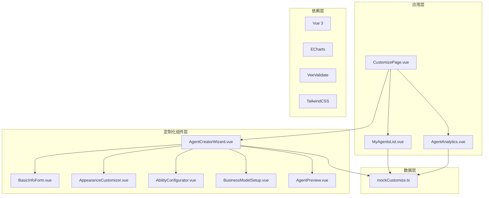
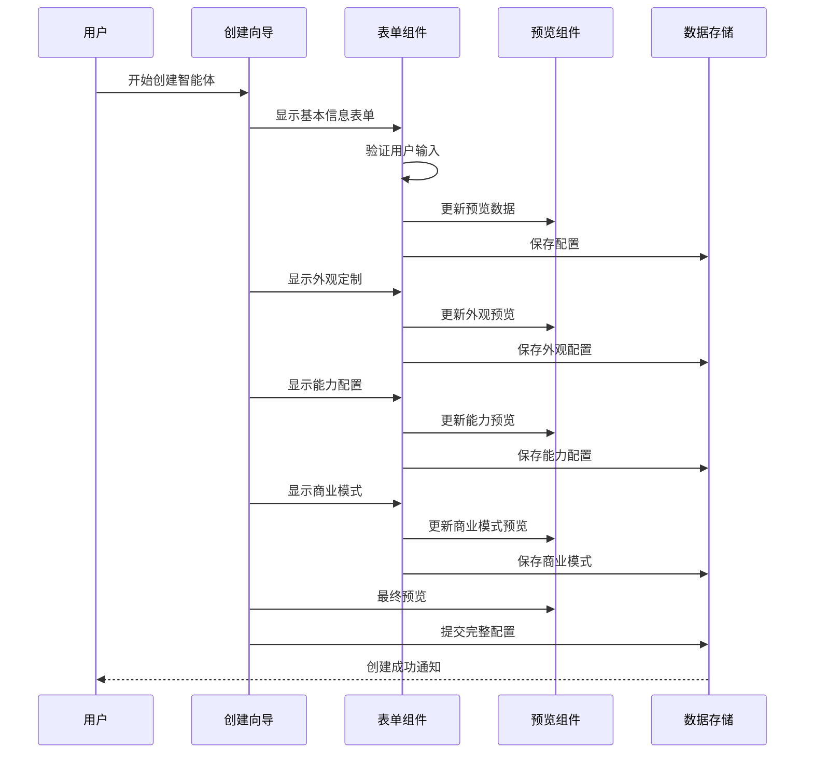
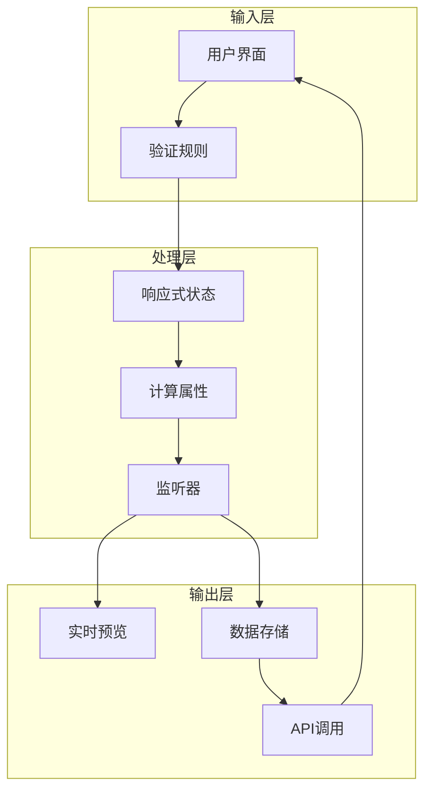
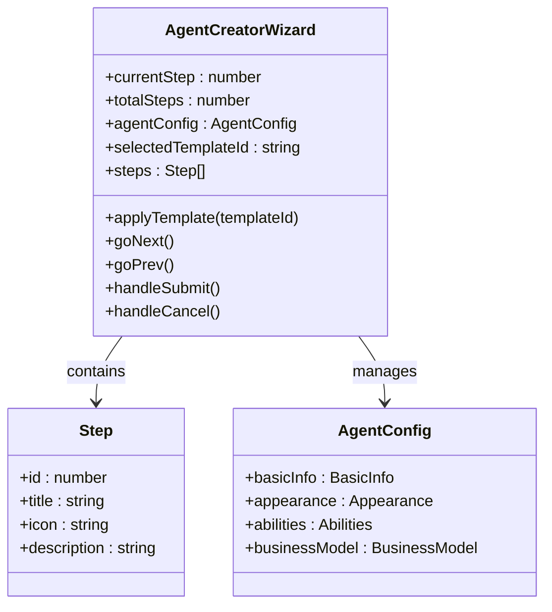
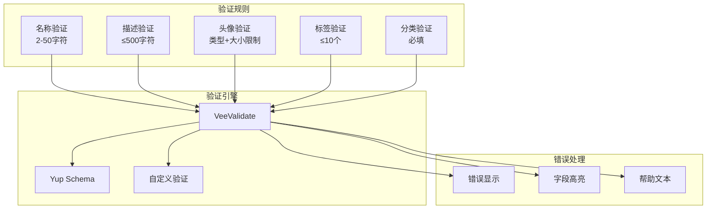
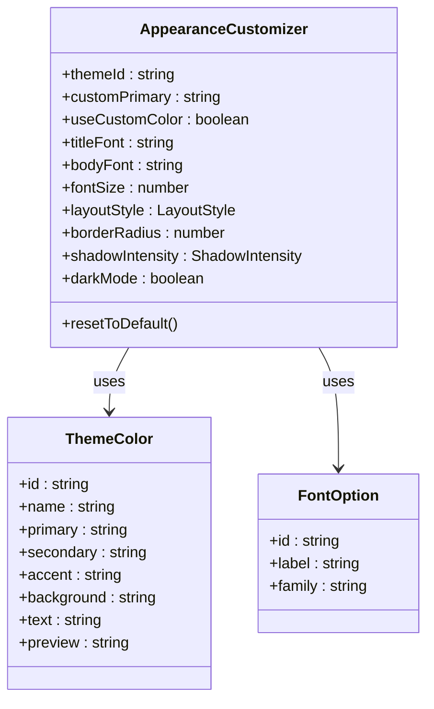
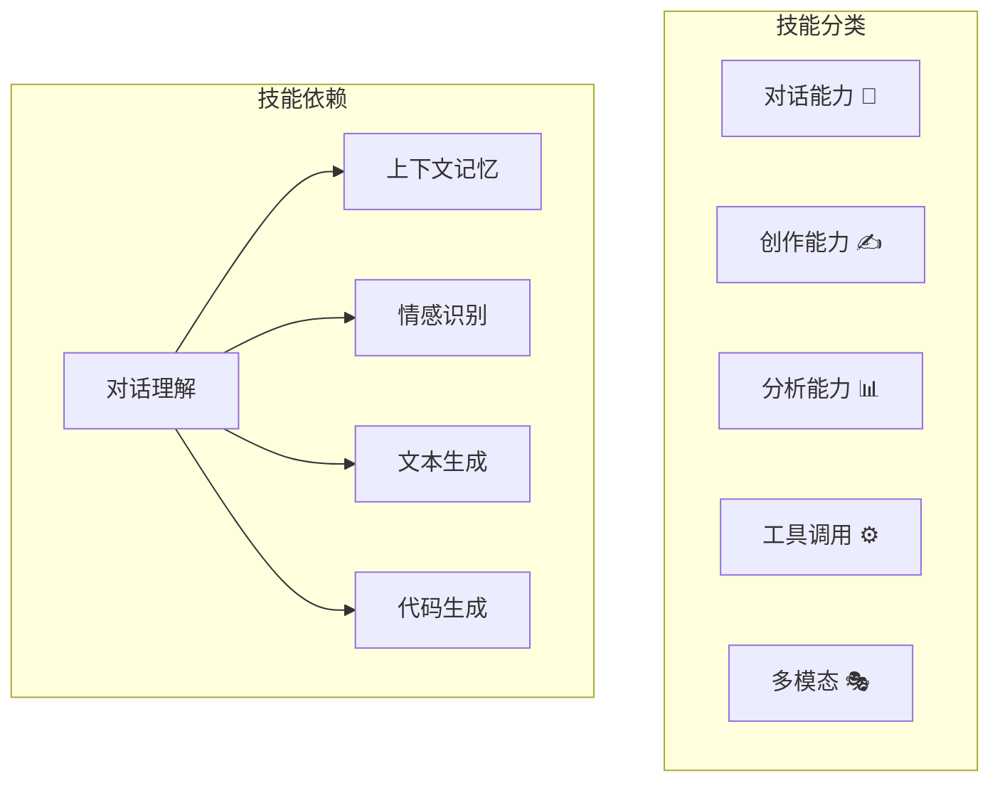
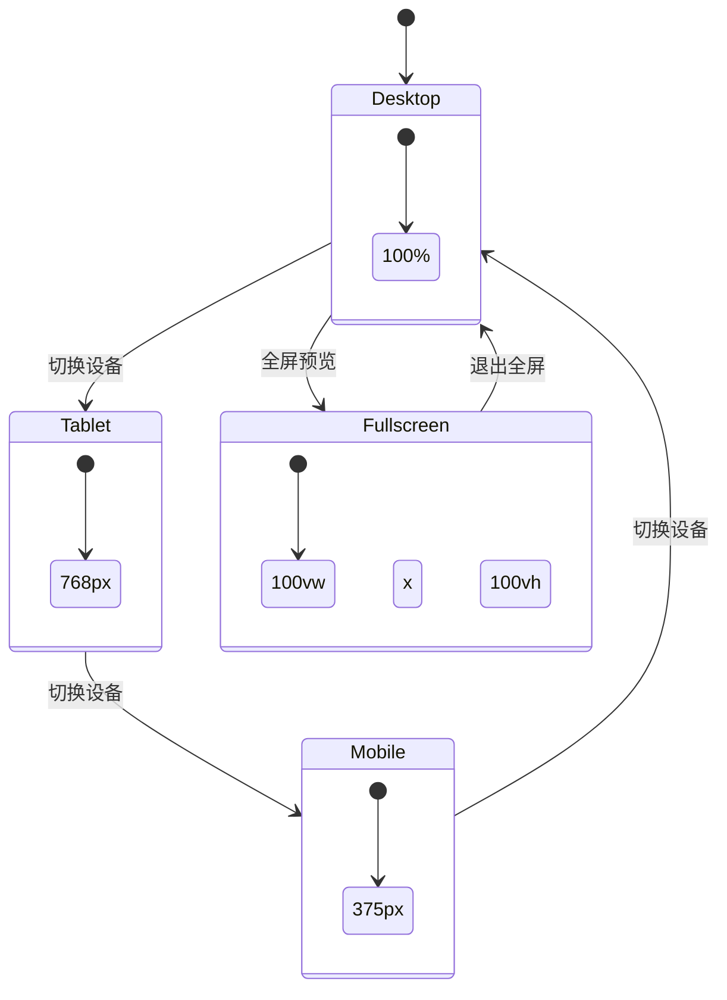
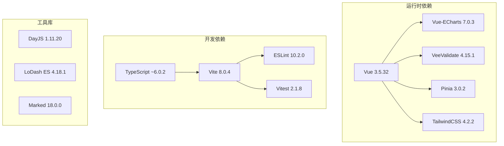

# 智能体定制化系统

<cite>
**本文档引用的文件**
- [CustomizePage.vue](file://apps/AgentPit/src/views/CustomizePage.vue)
- [AgentCreatorWizard.vue](file://apps/AgentPit/src/components/customize/AgentCreatorWizard.vue)
- [MyAgentsList.vue](file://apps/AgentPit/src/components/customize/MyAgentsList.vue)
- [AgentAnalytics.vue](file://apps/AgentPit/src/components/customize/AgentAnalytics.vue)
- [BasicInfoForm.vue](file://apps/AgentPit/src/components/customize/BasicInfoForm.vue)
- [AppearanceCustomizer.vue](file://apps/AgentPit/src/components/customize/AppearanceCustomizer.vue)
- [AbilityConfigurator.vue](file://apps/AgentPit/src/components/customize/AbilityConfigurator.vue)
- [BusinessModelSetup.vue](file://apps/AgentPit/src/components/customize/BusinessModelSetup.vue)
- [AgentPreview.vue](file://apps/AgentPit/src/components/customize/AgentPreview.vue)
- [mockCustomize.ts](file://apps/AgentPit/src/data/mockCustomize.ts)
- [package.json](file://apps/AgentPit/package.json)
</cite>

## 目录
1. [简介](#简介)
2. [项目结构](#项目结构)
3. [核心组件](#核心组件)
4. [架构概览](#架构概览)
5. [详细组件分析](#详细组件分析)
6. [依赖关系分析](#依赖关系分析)
7. [性能考虑](#性能考虑)
8. [故障排除指南](#故障排除指南)
9. [结论](#结论)

## 简介

智能体定制化系统是一个基于 Vue 3 的现代化智能体创建和管理系统。该系统提供了完整的智能体生命周期管理，从创建向导到最终发布，涵盖了所有必要的定制化选项。

系统采用模块化设计，通过多个专门的组件来实现不同的功能领域，包括智能体基本信息配置、外观定制、能力配置、商业模式设置等。每个组件都经过精心设计，确保用户体验的一致性和功能的完整性。

## 项目结构

智能体定制化系统主要位于 `apps/AgentPit` 目录下，采用清晰的分层架构：

**图表来源**
- [CustomizePage.vue:1-217](file://apps/AgentPit/src/views/CustomizePage.vue#L1-L217)
- [AgentCreatorWizard.vue:1-355](file://apps/AgentPit/src/components/customize/AgentCreatorWizard.vue#L1-L355)

**章节来源**
- [CustomizePage.vue:1-217](file://apps/AgentPit/src/views/CustomizePage.vue#L1-L217)
- [package.json:1-74](file://apps/AgentPit/package.json#L1-L74)

## 核心组件

系统的核心组件围绕智能体定制化流程构建，每个组件都有明确的职责和功能：

### 主要组件概览

| 组件名称 | 职责 | 关键特性 |
|---------|------|----------|
| AgentCreatorWizard | 智能体创建向导 | 多步骤向导、模板选择、实时预览 |
| BasicInfoForm | 基本信息表单 | 验证规则、头像选择、标签管理 |
| AppearanceCustomizer | 外观定制器 | 主题选择、字体设置、布局配置 |
| AbilityConfigurator | 能力配置器 | 技能树管理、依赖关系、参数配置 |
| BusinessModelSetup | 商业模式设置 | 定价策略、服务限制、收入估算 |
| AgentPreview | 实时预览 | 设备适配、全屏预览、分享功能 |
| MyAgentsList | 智能体管理 | 列表展示、搜索过滤、批量操作 |
| AgentAnalytics | 数据分析 | 图表展示、性能监控、导出功能 |

**章节来源**
- [AgentCreatorWizard.vue:1-355](file://apps/AgentPit/src/components/customize/AgentCreatorWizard.vue#L1-L355)
- [BasicInfoForm.vue:1-306](file://apps/AgentPit/src/components/customize/BasicInfoForm.vue#L1-L306)
- [AppearanceCustomizer.vue:1-409](file://apps/AgentPit/src/components/customize/AppearanceCustomizer.vue#L1-L409)

## 架构概览

系统采用组件化架构，通过父子组件通信和事件传递实现数据流转：

**图表来源**
- [AgentCreatorWizard.vue:99-104](file://apps/AgentPit/src/components/customize/AgentCreatorWizard.vue#L99-L104)
- [BasicInfoForm.vue:117-119](file://apps/AgentPit/src/components/customize/BasicInfoForm.vue#L117-L119)

### 数据流架构

**图表来源**
- [AgentCreatorWizard.vue:37-44](file://apps/AgentPit/src/components/customize/AgentCreatorWizard.vue#L37-L44)
- [mockCustomize.ts:39-95](file://apps/AgentPit/src/data/mockCustomize.ts#L39-L95)

**章节来源**
- [AgentCreatorWizard.vue:1-355](file://apps/AgentPit/src/components/customize/AgentCreatorWizard.vue#L1-L355)
- [mockCustomize.ts:1-1267](file://apps/AgentPit/src/data/mockCustomize.ts#L1-L1267)

## 详细组件分析

### AgentCreatorWizard 组件

AgentCreatorWizard 是整个智能体定制化流程的核心，采用多步骤向导设计：

#### 组件架构

**图表来源**
- [AgentCreatorWizard.vue:15-35](file://apps/AgentPit/src/components/customize/AgentCreatorWizard.vue#L15-L35)
- [mockCustomize.ts:39-95](file://apps/AgentPit/src/data/mockCustomize.ts#L39-L95)

#### 步骤流程控制

组件实现了智能的步骤导航和验证机制：

| 步骤 | 内容 | 验证规则 | 功能特性 |
|------|------|----------|----------|
| 1 | 模板选择 | 选择模板 | 预设配置、推荐技能 |
| 2 | 基本信息 | 名称2-50字符、分类必填 | 头像上传、标签管理 |
| 3 | 外观定制 | 配置完成 | 主题选择、字体设置 |
| 4 | 能力配置 | 技能启用 | 依赖关系检查、参数调整 |
| 5 | 商业模式 | 定价设置 | 服务限制、收入估算 |

**章节来源**
- [AgentCreatorWizard.vue:1-355](file://apps/AgentPit/src/components/customize/AgentCreatorWizard.vue#L1-L355)

### BasicInfoForm 组件

基本信息表单提供了智能体的基础配置功能：

#### 表单验证体系

**图表来源**
- [BasicInfoForm.vue:16-26](file://apps/AgentPit/src/components/customize/BasicInfoForm.vue#L16-L26)

#### 头像管理系统

组件支持多种头像选择方式：

| 选择方式 | 支持格式 | 限制条件 | 使用场景 |
|----------|----------|----------|----------|
| 预设头像 | Emoji表情 | 无 | 快速选择、默认选项 |
| 自定义上传 | JPG/PNG/WebP | ≤2MB | 个性化定制 |
| 分类浏览 | 全部头像 | 分类筛选 | 浏览发现 |

**章节来源**
- [BasicInfoForm.vue:1-306](file://apps/AgentPit/src/components/customize/BasicInfoForm.vue#L1-L306)

### AppearanceCustomizer 组件

外观定制器提供了丰富的视觉定制选项：

#### 主题系统架构

**图表来源**
- [AppearanceCustomizer.vue:14-23](file://apps/AgentPit/src/components/customize/AppearanceCustomizer.vue#L14-L23)
- [mockCustomize.ts:8-17](file://apps/AgentPit/src/data/mockCustomize.ts#L8-L17)

#### 布局样式系统

| 布局类型 | 图标 | 特点 | 适用场景 |
|----------|------|------|----------|
| Card | 🎴 | 卡片式展示 | 信息密度高、交互频繁 |
| List | 📋 | 列表式排列 | 内容简洁、快速浏览 |
| Timeline | 📅 | 时间轴布局 | 历史记录、流程展示 |
| Dashboard | 📊 | 仪表盘样式 | 数据可视化、统计信息 |

**章节来源**
- [AppearanceCustomizer.vue:1-409](file://apps/AgentPit/src/components/customize/AppearanceCustomizer.vue#L1-L409)

### AbilityConfigurator 组件

能力配置器是系统最复杂的组件之一，实现了技能树管理和依赖关系处理：

#### 技能树管理架构

**图表来源**
- [AbilityConfigurator.vue:24-38](file://apps/AgentPit/src/components/customize/AbilityConfigurator.vue#L24-L38)

#### 依赖关系验证

组件实现了智能的依赖关系检查机制：

| 技能 | 依赖技能 | 说明 |
|------|----------|------|
| 上下文记忆 | 对话理解 | 必须先启用基础对话能力 |
| 情感识别 | 对话理解 | 需要理解用户意图才能识别情感 |
| 创意写作 | 文本生成 | 基于文本生成能力的高级应用 |
| 代码执行 | 代码生成 | 需要生成代码才能执行 |

**章节来源**
- [AbilityConfigurator.vue:1-447](file://apps/AgentPit/src/components/customize/AbilityConfigurator.vue#L1-L447)

### BusinessModelSetup 组件

商业模式设置组件提供了灵活的定价和运营策略配置：

#### 定价模式对比

| 定价模式 | 适用场景 | 优势 | 局限性 |
|----------|----------|------|--------|
| 免费模式 | 个人使用、测试环境 | 低门槛、易推广 | 收入有限、功能受限 |
| 订阅制 | 企业用户、长期使用 | 稳定收入、功能完整 | 需要持续付费、转换成本 |
| 按次付费 | 临时使用、成本控制 | 成本透明、灵活付费 | 可能产生高额费用 |
| 会员等级 | 分层服务、增值服务 | 提升用户粘性、增加收入 | 管理复杂度较高 |

#### 服务限制配置

组件允许精细化的服务限制设置：

| 限制类型 | 默认值 | 调整范围 | 影响 |
|----------|--------|----------|------|
| 并发用户 | 50 | 1-100 | 系统负载、用户体验 |
| 日请求量 | 1000 | 0-∞ | 业务规模、成本控制 |
| API频率 | 60 | 1-∞ | 系统稳定性、防刷机制 |

**章节来源**
- [BusinessModelSetup.vue:1-508](file://apps/AgentPit/src/components/customize/BusinessModelSetup.vue#L1-L508)

### AgentPreview 组件

实时预览组件提供了完整的智能体外观展示功能：

#### 设备适配系统

**图表来源**
- [AgentPreview.vue:17-65](file://apps/AgentPit/src/components/customize/AgentPreview.vue#L17-L65)

#### 预览功能特性

| 功能 | 实现方式 | 用户价值 |
|------|----------|----------|
| 设备切换 | 动态宽度计算 | 全面的响应式测试 |
| 全屏预览 | 绝对定位布局 | 沉浸式体验 |
| 预览刷新 | 键值重渲染 | 实时反映配置变化 |
| 分享链接 | Clipboard API | 快速分享给他人 |

**章节来源**
- [AgentPreview.vue:1-413](file://apps/AgentPit/src/components/customize/AgentPreview.vue#L1-L413)

## 依赖关系分析

系统采用了现代化的前端技术栈，各依赖项协同工作：

### 核心依赖关系

**图表来源**
- [package.json:20-39](file://apps/AgentPit/package.json#L20-L39)

### 组件间通信机制

系统通过多种方式实现组件间的通信：

| 通信方式 | 实现机制 | 使用场景 |
|----------|----------|----------|
| Props传递 | 父组件向子组件传值 | 配置数据传递、只读信息 |
| Emits事件 | 子组件向父组件发送事件 | 用户操作、状态变更 |
| Provide/Inject | 跨层级共享数据 | 全局配置、主题信息 |
| 响应式状态 | Vue响应式系统 | 实时数据绑定、计算属性 |

**章节来源**
- [AgentCreatorWizard.vue:44](file://apps/AgentPit/src/components/customize/AgentCreatorWizard.vue#L44)
- [package.json:1-74](file://apps/AgentPit/package.json#L1-L74)

## 性能考虑

系统在设计时充分考虑了性能优化：

### 渲染性能优化

1. **组件懒加载**: 使用 `KeepAlive` 缓存组件状态
2. **虚拟滚动**: 大数据集使用分页和虚拟滚动
3. **防抖处理**: 搜索和过滤操作使用防抖优化
4. **计算属性缓存**: 复杂计算结果缓存避免重复计算

### 数据流优化

1. **响应式更新**: 精确的响应式数据绑定
2. **事件节流**: 高频事件使用节流处理
3. **内存管理**: 合理的组件销毁和资源清理

## 故障排除指南

### 常见问题及解决方案

#### 表单验证问题

**问题**: 表单验证不生效
**解决方案**: 
1. 检查验证规则是否正确配置
2. 确认 VeeValidate 和 Yup 版本兼容性
3. 验证字段名称与模型属性匹配

#### 预览功能异常

**问题**: 实时预览不更新
**解决方案**:
1. 检查响应式数据绑定是否正确
2. 确认 watch 监听器是否触发
3. 验证组件 key 值是否正确更新

#### 性能问题

**问题**: 页面加载缓慢
**解决方案**:
1. 检查是否有不必要的组件重渲染
2. 优化大数据集的渲染逻辑
3. 使用浏览器开发者工具分析性能瓶颈

**章节来源**
- [BasicInfoForm.vue:117-119](file://apps/AgentPit/src/components/customize/BasicInfoForm.vue#L117-L119)
- [AgentPreview.vue:67-69](file://apps/AgentPit/src/components/customize/AgentPreview.vue#L67-L69)

## 结论

智能体定制化系统通过模块化设计和组件化架构，成功实现了复杂的智能体创建和管理功能。系统具有以下特点：

1. **完整的功能覆盖**: 从基本信息到商业模式的全方位定制
2. **优秀的用户体验**: 直观的向导式操作和实时预览
3. **强大的扩展性**: 模块化设计便于功能扩展和维护
4. **良好的性能表现**: 优化的数据流和渲染机制

该系统为智能体的创建、定制和管理提供了完整的解决方案，是构建智能体平台的理想基础。