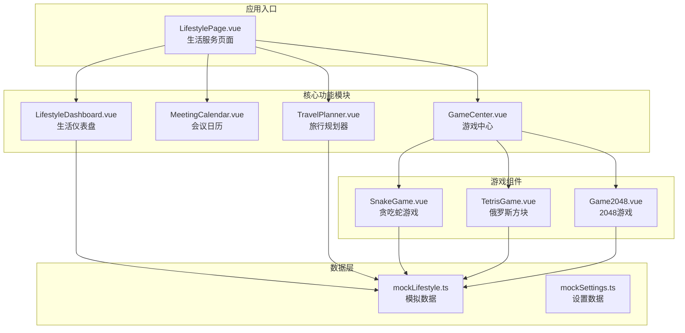
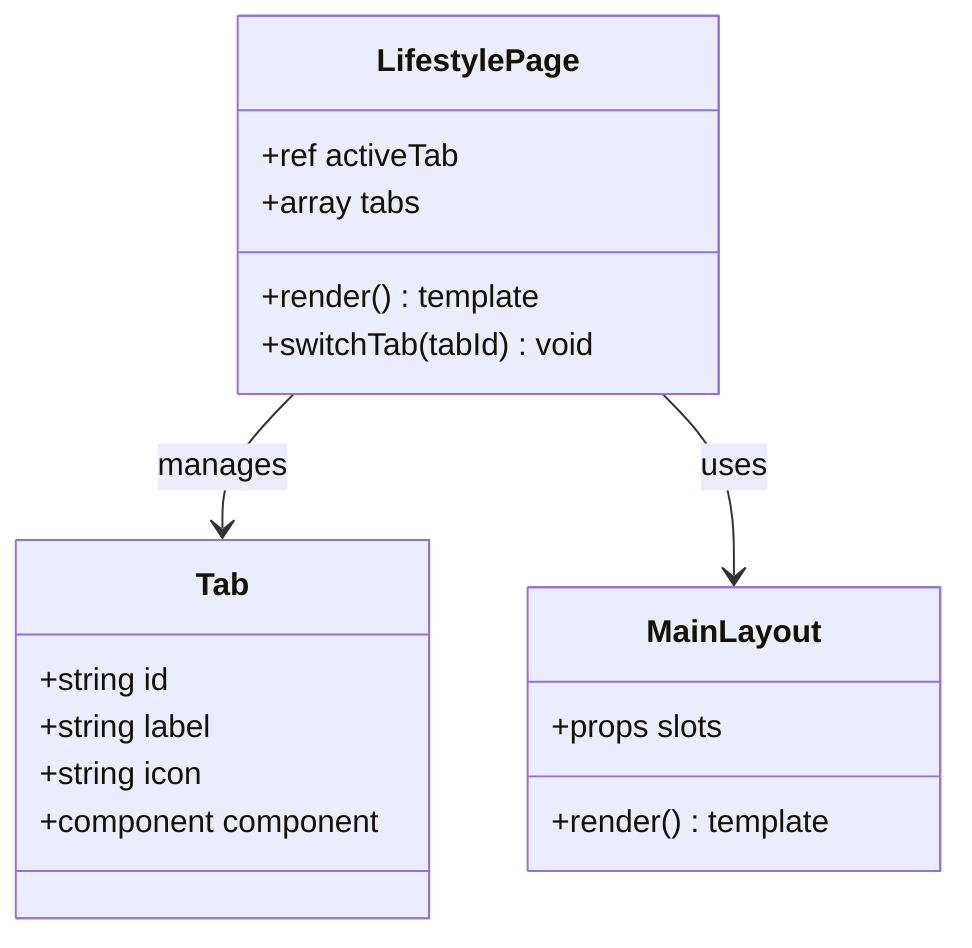
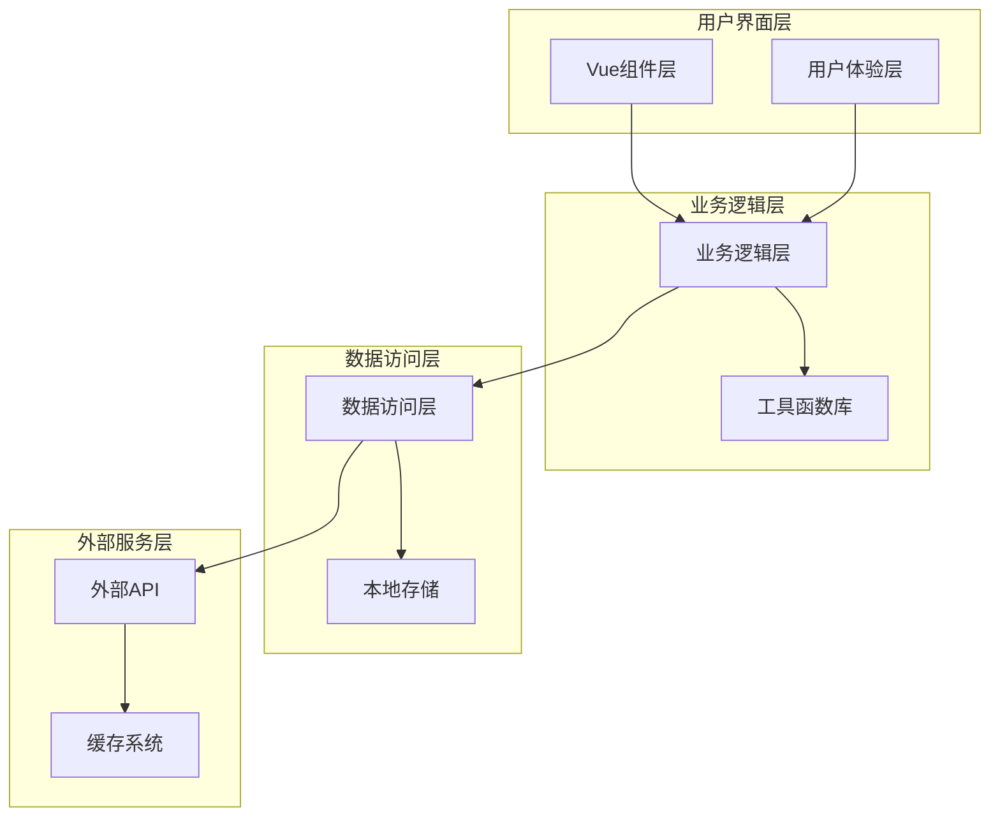
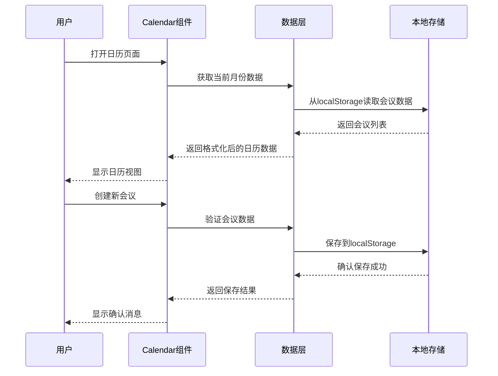
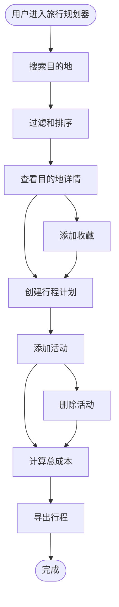
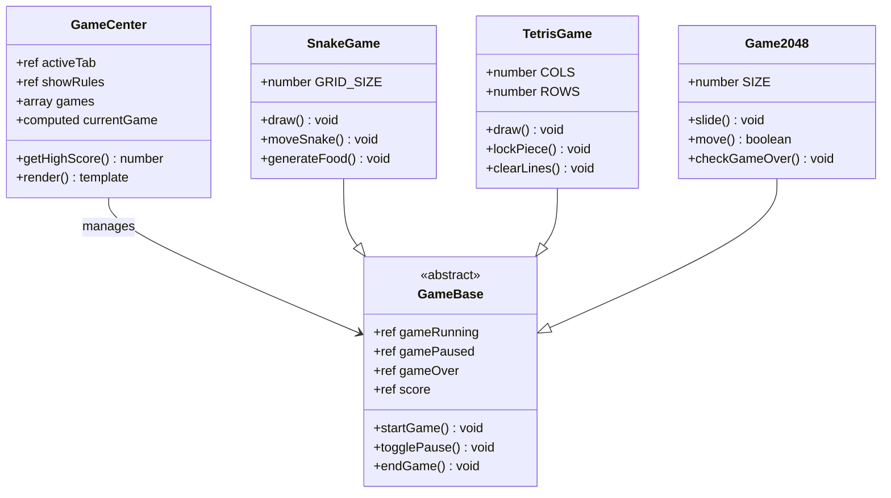
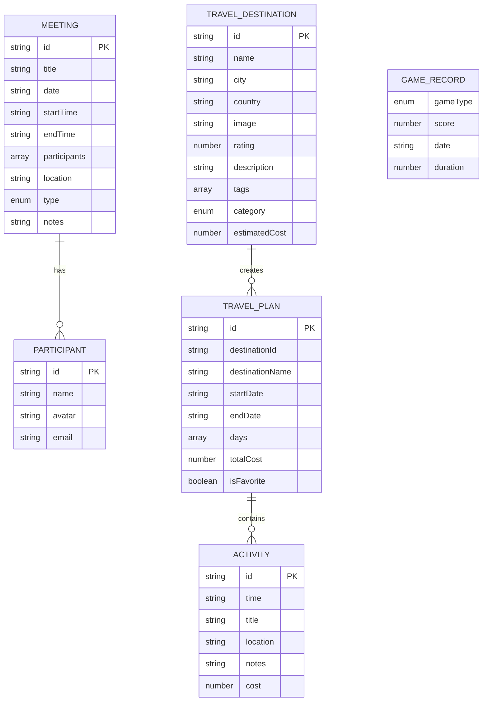
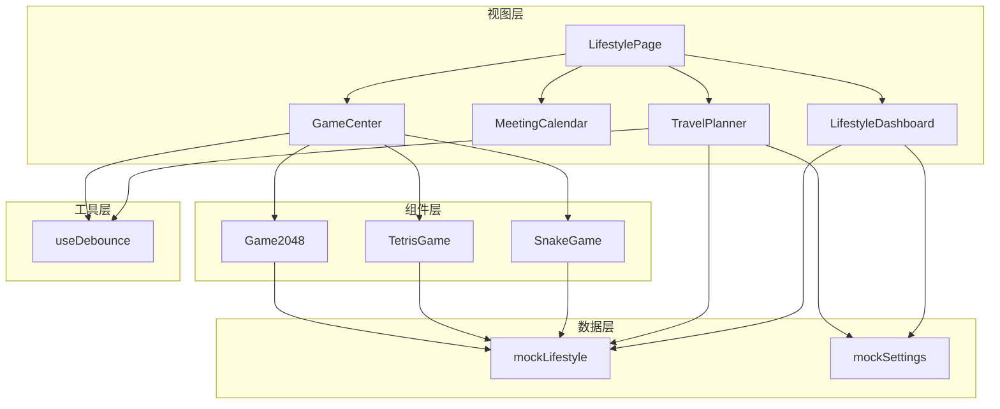

# 生活服务系统

<cite>
**本文档引用的文件**
- [LifestylePage.vue](file://apps/AgentPit/src/views/LifestylePage.vue)
- [LifestyleDashboard.vue](file://apps/AgentPit/src/components/lifestyle/LifestyleDashboard.vue)
- [MeetingCalendar.vue](file://apps/AgentPit/src/components/lifestyle/MeetingCalendar.vue)
- [TravelPlanner.vue](file://apps/AgentPit/src/components/lifestyle/TravelPlanner.vue)
- [GameCenter.vue](file://apps/AgentPit/src/components/lifestyle/GameCenter.vue)
- [SnakeGame.vue](file://apps/AgentPit/src/components/lifestyle/SnakeGame.vue)
- [TetrisGame.vue](file://apps/AgentPit/src/components/lifestyle/TetrisGame.vue)
- [Game2048.vue](file://apps/AgentPit/src/components/lifestyle/Game2048.vue)
- [mockLifestyle.ts](file://apps/AgentPit/src/data/mockLifestyle.ts)
- [mockSettings.ts](file://apps/AgentPit/src/data/mockSettings.ts)
</cite>

## 目录
1. [简介](#简介)
2. [项目结构](#项目结构)
3. [核心组件](#核心组件)
4. [架构概览](#架构概览)
5. [详细组件分析](#详细组件分析)
6. [依赖关系分析](#依赖关系分析)
7. [性能考虑](#性能考虑)
8. [故障排除指南](#故障排除指南)
9. [结论](#结论)
10. [附录](#附录)

## 简介

生活服务系统是DAO应用生态系统中的重要组成部分，旨在为用户提供一站式的生活管理解决方案。该系统集成了多个实用功能模块，包括日历管理、旅行规划、休闲游戏等，通过现代化的前端技术栈实现流畅的用户体验。

系统采用Vue 3 + TypeScript技术栈构建，结合响应式设计和渐进式Web应用特性，为用户提供了跨平台的使用体验。通过模块化的架构设计，系统既保证了功能的完整性，又确保了代码的可维护性和扩展性。

## 项目结构

生活服务系统在AgentPit应用中采用了清晰的组件化架构，主要文件组织如下：

**图表来源**
- [LifestylePage.vue:1-90](file://apps/AgentPit/src/views/LifestylePage.vue#L1-L90)
- [LifestyleDashboard.vue:1-284](file://apps/AgentPit/src/components/lifestyle/LifestyleDashboard.vue#L1-L284)
- [mockLifestyle.ts:1-841](file://apps/AgentPit/src/data/mockLifestyle.ts#L1-L841)

**章节来源**
- [LifestylePage.vue:1-90](file://apps/AgentPit/src/views/LifestylePage.vue#L1-L90)
- [mockLifestyle.ts:1-841](file://apps/AgentPit/src/data/mockLifestyle.ts#L1-L841)

## 核心组件

### 生活服务总览页

生活服务总览页作为系统的入口界面，提供了统一的导航和内容展示功能。该组件实现了动态标签页切换，支持仪表盘、日历、旅行规划和游戏中心四个主要功能模块的无缝切换。

**图表来源**
- [LifestylePage.vue:1-90](file://apps/AgentPit/src/views/LifestylePage.vue#L1-L90)

### 生活仪表盘

生活仪表盘提供了用户日常生活的综合概览，集成了会议统计、待办事项、游戏成就和生活小贴士等功能模块。通过可视化图表展示用户的周活动统计，帮助用户更好地管理时间和生活节奏。

**章节来源**
- [LifestyleDashboard.vue:1-284](file://apps/AgentPit/src/components/lifestyle/LifestyleDashboard.vue#L1-L284)

## 架构概览

生活服务系统采用了模块化的组件架构，各功能模块相对独立又相互关联：

**图表来源**
- [LifestylePage.vue:1-90](file://apps/AgentPit/src/views/LifestylePage.vue#L1-L90)
- [GameCenter.vue:1-227](file://apps/AgentPit/src/components/lifestyle/GameCenter.vue#L1-L227)

系统架构具有以下特点：
- **响应式设计**：支持桌面端和移动端的自适应布局
- **模块化开发**：每个功能模块独立开发、测试和部署
- **状态管理**：使用Vue 3的响应式系统进行状态管理
- **数据持久化**：通过localStorage实现游戏进度和用户偏好的持久化存储

## 详细组件分析

### 日历管理系统

日历管理系统提供了完整的会议管理功能，包括日历视图、会议创建、参与者管理和会议提醒等核心功能。

**图表来源**
- [MeetingCalendar.vue:1-111](file://apps/AgentPit/src/components/lifestyle/MeetingCalendar.vue#L1-L111)

**章节来源**
- [MeetingCalendar.vue:1-111](file://apps/AgentPit/src/components/lifestyle/MeetingCalendar.vue#L1-L111)

### 旅行规划器

旅行规划器是一个功能完整的旅行管理工具，支持目的地搜索、行程创建、活动安排和成本计算等功能。

**图表来源**
- [TravelPlanner.vue:1-472](file://apps/AgentPit/src/components/lifestyle/TravelPlanner.vue#L1-L472)

旅行规划器的核心功能包括：
- **智能搜索**：支持按名称、城市、标签等多种条件搜索目的地
- **行程管理**：支持多日行程的创建和编辑
- **成本控制**：实时计算和更新行程总成本
- **数据持久化**：使用localStorage保存用户的行程数据

**章节来源**
- [TravelPlanner.vue:1-472](file://apps/AgentPit/src/components/lifestyle/TravelPlanner.vue#L1-L472)
- [mockLifestyle.ts:319-440](file://apps/AgentPit/src/data/mockLifestyle.ts#L319-L440)

### 游戏中心

游戏中心整合了三个经典小游戏：贪吃蛇、俄罗斯方块和2048，提供了完整的游戏体验和统计数据。

**图表来源**
- [GameCenter.vue:1-227](file://apps/AgentPit/src/components/lifestyle/GameCenter.vue#L1-L227)
- [SnakeGame.vue:1-423](file://apps/AgentPit/src/components/lifestyle/SnakeGame.vue#L1-L423)
- [TetrisGame.vue:1-599](file://apps/AgentPit/src/components/lifestyle/TetrisGame.vue#L1-L599)
- [Game2048.vue:1-440](file://apps/AgentPit/src/components/lifestyle/Game2048.vue#L1-L440)

#### 贪吃蛇游戏引擎

贪吃蛇游戏实现了经典的贪吃蛇玩法，具有以下技术特点：

**游戏核心算法**：
- **网格系统**：20x20的网格空间，使用Canvas进行渲染
- **碰撞检测**：检测蛇头与墙壁、自身身体的碰撞
- **食物生成**：随机生成食物位置，确保不在蛇身上
- **速度递增**：随着分数增加，游戏速度逐渐加快

**交互逻辑**：
- **键盘控制**：支持方向键和WASD控制
- **触摸控制**：移动端支持手势滑动控制
- **暂停机制**：空格键控制游戏暂停和继续

**章节来源**
- [SnakeGame.vue:1-423](file://apps/AgentPit/src/components/lifestyle/SnakeGame.vue#L1-L423)

#### 俄罗斯方块游戏引擎

俄罗斯方块游戏实现了标准的俄罗斯方块玩法，包含完整的游戏逻辑：

**游戏核心算法**：
- **形状系统**：7种经典方块形状（I、O、T、S、Z、J、L）
- **旋转算法**：使用矩阵旋转实现方块旋转
- **碰撞检测**：检测方块与边界、其他方块的碰撞
- **行消除**：完整行消除并计算分数

**游戏机制**：
- **等级系统**：根据消除行数计算等级，提升下落速度
- **预览系统**：显示下一个方块
- **硬降功能**：空格键快速下落

**章节来源**
- [TetrisGame.vue:1-599](file://apps/AgentPit/src/components/lifestyle/TetrisGame.vue#L1-L599)

#### 2048游戏引擎

2048游戏实现了数字合并的经典玩法，具有以下特色功能：

**游戏核心算法**：
- **网格操作**：4x4网格的滑动合并算法
- **概率生成**：90%概率生成2，10%概率生成4
- **撤销系统**：最多支持5步撤销操作
- **胜利检测**：达到2048时触发胜利动画

**交互特性**：
- **键盘控制**：支持方向键和WASD
- **触摸控制**：支持滑动手势
- **动画效果**：平滑的瓦片移动和合并动画

**章节来源**
- [Game2048.vue:1-440](file://apps/AgentPit/src/components/lifestyle/Game2048.vue#L1-L440)

### 数据模型设计

系统使用TypeScript定义了完整的数据模型，确保类型安全和开发效率。

**图表来源**
- [mockLifestyle.ts:1-841](file://apps/AgentPit/src/data/mockLifestyle.ts#L1-L841)

**章节来源**
- [mockLifestyle.ts:1-841](file://apps/AgentPit/src/data/mockLifestyle.ts#L1-L841)

## 依赖关系分析

生活服务系统各组件之间的依赖关系体现了清晰的层次结构：

**图表来源**
- [LifestylePage.vue:1-90](file://apps/AgentPit/src/views/LifestylePage.vue#L1-L90)
- [TravelPlanner.vue:1-472](file://apps/AgentPit/src/components/lifestyle/TravelPlanner.vue#L1-L472)
- [GameCenter.vue:1-227](file://apps/AgentPit/src/components/lifestyle/GameCenter.vue#L1-L227)

**章节来源**
- [LifestylePage.vue:1-90](file://apps/AgentPit/src/views/LifestylePage.vue#L1-L90)
- [TravelPlanner.vue:1-472](file://apps/AgentPit/src/components/lifestyle/TravelPlanner.vue#L1-L472)

## 性能考虑

### 游戏性能优化

三个游戏组件都采用了Canvas渲染技术，确保流畅的游戏体验：

**贪吃蛇性能优化**：
- 使用requestAnimationFrame替代setInterval，避免帧率波动
- Canvas绘制优化，减少重绘次数
- 响应式速度调整，根据分数动态调整游戏速度

**俄罗斯方块性能优化**：
- 预计算颜色映射，避免运行时计算
- 使用位运算优化碰撞检测
- 双缓冲绘制，减少闪烁

**2048性能优化**：
- 矩阵操作优化，使用原生数组方法
- 动画性能优化，使用CSS3硬件加速
- 内存管理优化，及时释放历史记录

### 数据持久化策略

系统采用localStorage进行数据持久化，具有以下优势：
- **本地存储**：无需网络请求，访问速度快
- **容量适中**：适合存储用户偏好和游戏进度
- **跨浏览器兼容**：所有现代浏览器都支持

### 响应式设计

系统实现了完整的响应式设计：
- **移动端优先**：针对移动设备优化交互体验
- **自适应布局**：根据屏幕尺寸调整组件布局
- **触摸友好**：提供触摸友好的交互元素

## 故障排除指南

### 常见问题及解决方案

**游戏无法启动**：
1. 检查浏览器是否支持Canvas API
2. 确认JavaScript已启用
3. 清除浏览器缓存后重试

**游戏进度丢失**：
1. 检查浏览器是否允许使用localStorage
2. 确认没有启用无痕浏览模式
3. 检查浏览器存储空间是否充足

**日历数据显示异常**：
1. 检查系统时间和时区设置
2. 确认数据格式正确
3. 刷新页面重新加载数据

**旅行规划器功能异常**：
1. 检查网络连接状态
2. 确认目的地数据完整
3. 清除浏览器缓存后重试

**章节来源**
- [mockSettings.ts:262-283](file://apps/AgentPit/src/data/mockSettings.ts#L262-L283)

## 结论

生活服务系统通过精心设计的架构和丰富的功能模块，为用户提供了全面的生活管理解决方案。系统不仅具备优秀的用户体验，还展现了良好的技术实现水平。

### 主要优势

1. **功能完整性**：涵盖了日历管理、旅行规划、游戏娱乐等多个生活场景
2. **技术先进性**：采用Vue 3、TypeScript等现代技术栈
3. **用户体验优秀**：响应式设计和流畅的交互体验
4. **可扩展性强**：模块化架构便于功能扩展和维护

### 技术亮点

- **游戏引擎实现**：三个经典游戏的完整实现，展现了扎实的前端技术功底
- **数据持久化**：合理的数据存储策略确保用户体验的连续性
- **性能优化**：针对不同场景的性能优化策略
- **类型安全**：完整的TypeScript类型定义确保代码质量

## 附录

### 开发指南

**添加新游戏功能**：
1. 创建新的游戏组件文件
2. 实现游戏核心逻辑和渲染
3. 在GameCenter中注册新游戏
4. 添加相应的统计数据和本地存储支持

**扩展旅行规划功能**：
1. 在mockLifestyle.ts中添加新的目的地数据
2. 更新TravelPlanner组件的UI逻辑
3. 实现新的搜索和筛选功能
4. 添加相应的数据验证和错误处理

**定制现有服务**：
1. 修改组件的样式和布局
2. 调整数据模型和接口
3. 更新相关的TypeScript类型定义
4. 测试和验证功能的正确性

**章节来源**
- [GameCenter.vue:1-227](file://apps/AgentPit/src/components/lifestyle/GameCenter.vue#L1-L227)
- [TravelPlanner.vue:1-472](file://apps/AgentPit/src/components/lifestyle/TravelPlanner.vue#L1-L472)