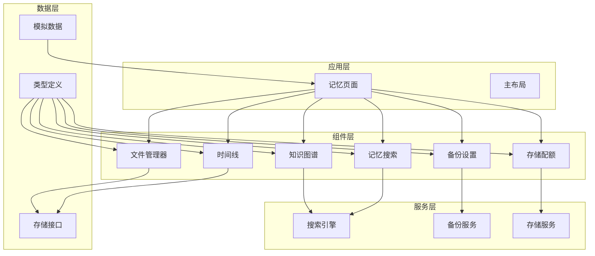
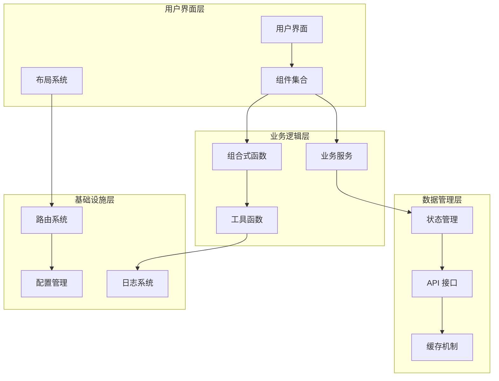
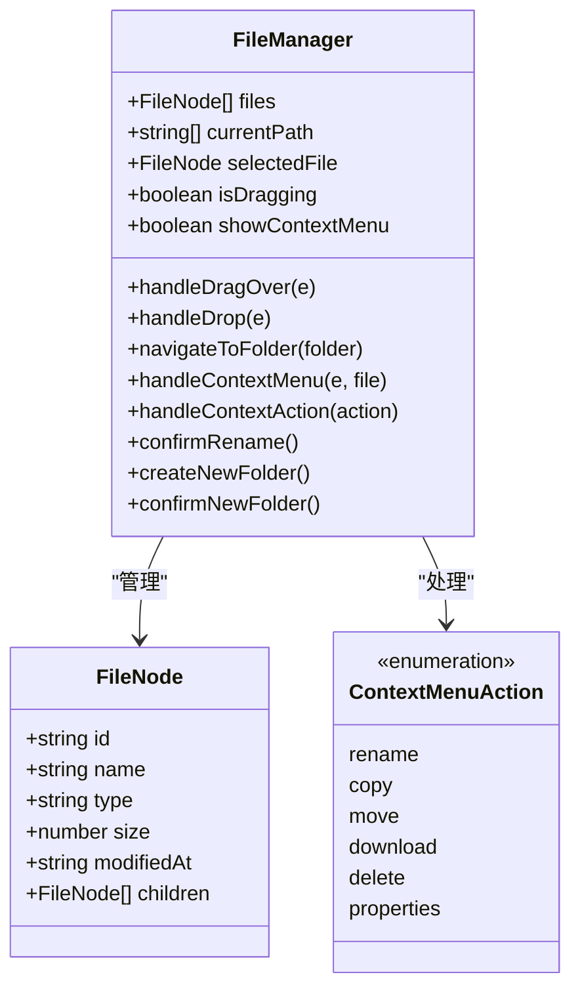
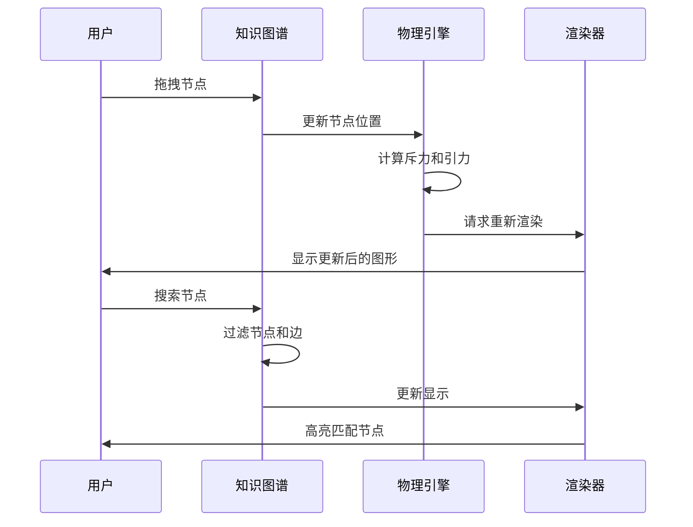
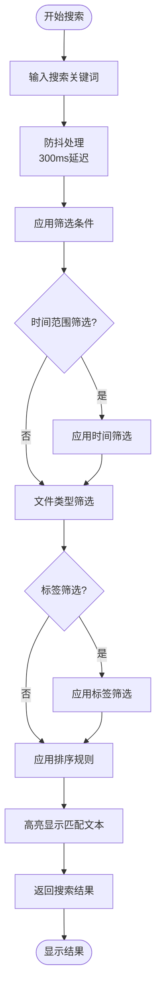
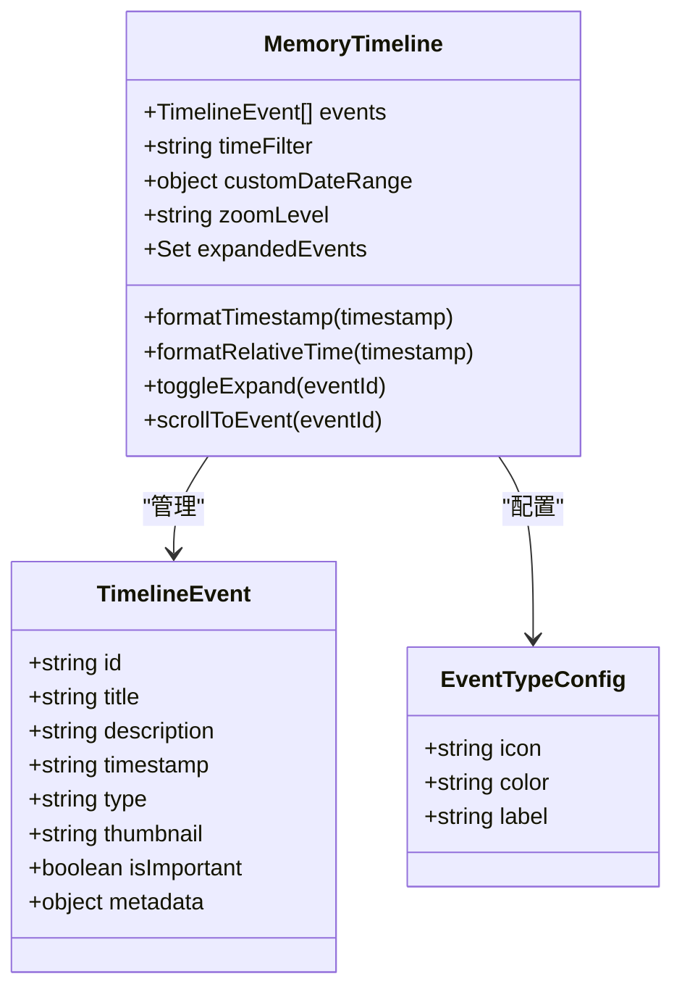
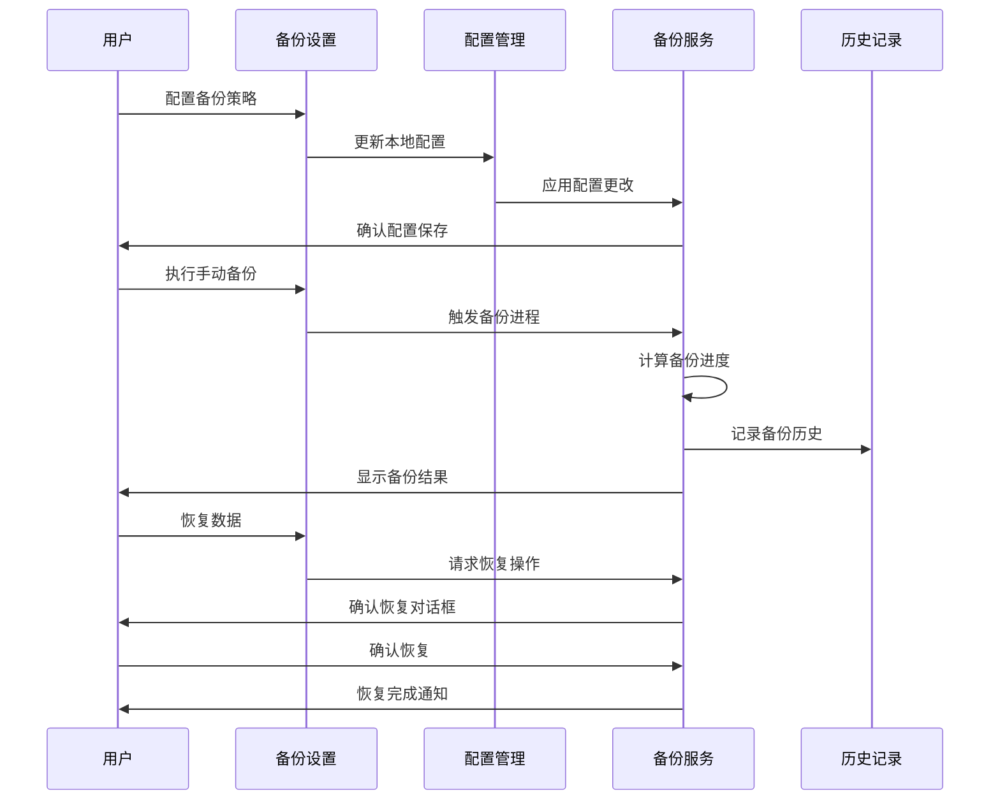
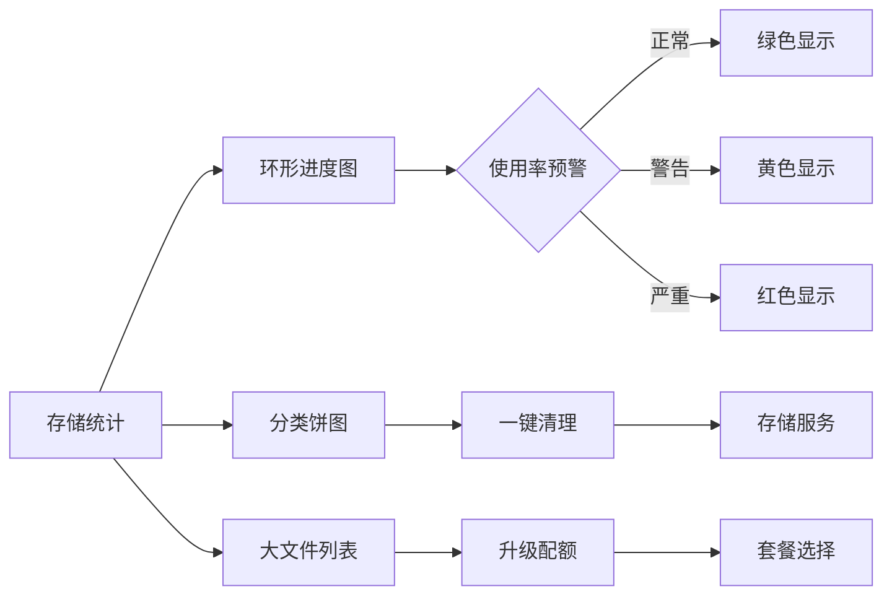
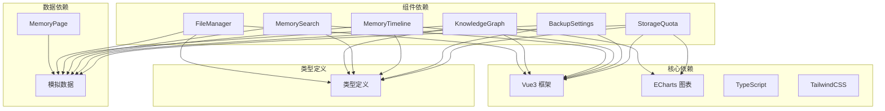

# 记忆管理系统

<cite>
**本文档引用的文件**
- [memory.ts](file://apps/AgentPit/src/types/memory.ts)
- [mockMemory.ts](file://apps/AgentPit/src/data/mockMemory.ts)
- [MemoryPage.vue](file://apps/AgentPit/src/views/MemoryPage.vue)
- [FileManager.vue](file://apps/AgentPit/src/components/memory/FileManager.vue)
- [KnowledgeGraph.vue](file://apps/AgentPit/src/components/memory/KnowledgeGraph.vue)
- [MemorySearch.vue](file://apps/AgentPit/src/components/memory/MemorySearch.vue)
- [MemoryTimeline.vue](file://apps/AgentPit/src/components/memory/MemoryTimeline.vue)
- [BackupSettings.vue](file://apps/AgentPit/src/components/memory/BackupSettings.vue)
- [StorageQuota.vue](file://apps/AgentPit/src/components/memory/StorageQuota.vue)
- [MemoryComponents.spec.ts](file://apps/AgentPit/src/__tests__/components/memory/MemoryComponents.spec.ts)
</cite>

## 目录
1. [简介](#简介)
2. [项目结构](#项目结构)
3. [核心组件](#核心组件)
4. [架构概览](#架构概览)
5. [详细组件分析](#详细组件分析)
6. [依赖关系分析](#依赖关系分析)
7. [性能考虑](#性能考虑)
8. [故障排除指南](#故障排除指南)
9. [结论](#结论)

## 简介

记忆管理系统是一个基于 Vue3 的智能记忆存储和管理平台，专为 DAO Collective 生态系统设计。该系统提供了完整的记忆资产管理解决方案，包括文件管理、知识图谱构建、智能搜索、时间线视图、备份设置和存储配额管理等核心功能。

系统采用现代化的前端架构，结合响应式设计和高性能渲染技术，为用户提供流畅的交互体验。通过模块化的组件设计，系统能够有效管理各种类型的记忆数据（文档、图片、视频、代码等），并提供智能化的知识组织和检索能力。

## 项目结构

记忆管理系统采用清晰的分层架构，主要由以下核心模块组成：

**图表来源**
- [MemoryPage.vue:1-280](file://apps/AgentPit/src/views/MemoryPage.vue#L1-L280)
- [memory.ts:1-89](file://apps/AgentPit/src/types/memory.ts#L1-L89)

**章节来源**
- [MemoryPage.vue:1-280](file://apps/AgentPit/src/views/MemoryPage.vue#L1-L280)
- [memory.ts:1-89](file://apps/AgentPit/src/types/memory.ts#L1-L89)

## 核心组件

记忆管理系统的核心组件围绕五大功能模块构建，每个模块都有明确的职责分工和接口定义：

### 文件管理器组件
文件管理器提供完整的文件系统操作能力，支持拖拽上传、批量操作、树形导航和丰富的文件操作功能。组件采用响应式设计，支持多种文件类型图标显示和上下文菜单操作。

### 知识图谱组件
知识图谱采用 SVG 力导向图算法，实现智能的节点布局和关系可视化。组件支持节点拖拽、缩放平移、搜索过滤和详情弹窗等交互功能。

### 记忆搜索组件
记忆搜索提供强大的全文检索能力，支持防抖搜索、高级筛选、结果排序和历史记录管理。组件集成了智能的相关度计算和高亮显示功能。

### 时间线组件
时间线组件提供多维度的时间视图，支持日/周/月/年的切换和自定义时间范围筛选。组件采用渐进式的时间轴设计，支持事件详情展开和重要事件标记。

### 备份设置组件
备份设置组件提供完整的数据保护策略，支持自动备份配置、手动备份执行、备份历史管理和恢复操作。组件包含进度监控和状态反馈功能。

### 存储配额组件
存储配额组件提供直观的存储使用情况展示，支持环形进度图、分类统计和大文件管理。组件包含一键清理和升级提醒功能。

**章节来源**
- [FileManager.vue:1-440](file://apps/AgentPit/src/components/memory/FileManager.vue#L1-L440)
- [KnowledgeGraph.vue:1-515](file://apps/AgentPit/src/components/memory/KnowledgeGraph.vue#L1-L515)
- [MemorySearch.vue:1-436](file://apps/AgentPit/src/components/memory/MemorySearch.vue#L1-L436)
- [MemoryTimeline.vue:1-423](file://apps/AgentPit/src/components/memory/MemoryTimeline.vue#L1-L423)
- [BackupSettings.vue:1-496](file://apps/AgentPit/src/components/memory/BackupSettings.vue#L1-L496)
- [StorageQuota.vue:1-464](file://apps/AgentPit/src/components/memory/StorageQuota.vue#L1-L464)

## 架构概览

记忆管理系统采用模块化的微前端架构，各组件间通过清晰的接口进行通信。系统的设计原则包括高内聚、低耦合、可扩展性和可维护性。

**图表来源**
- [MemoryPage.vue:1-280](file://apps/AgentPit/src/views/MemoryPage.vue#L1-L280)
- [FileManager.vue:1-440](file://apps/AgentPit/src/components/memory/FileManager.vue#L1-L440)
- [KnowledgeGraph.vue:1-515](file://apps/AgentPit/src/components/memory/KnowledgeGraph.vue#L1-L515)

系统采用响应式数据绑定和虚拟 DOM 技术，确保高效的渲染性能和良好的用户体验。组件间的通信通过事件总线和状态管理模式实现，避免了复杂的层级传递。

**章节来源**
- [MemoryPage.vue:1-280](file://apps/AgentPit/src/views/MemoryPage.vue#L1-L280)
- [FileManager.vue:1-440](file://apps/AgentPit/src/components/memory/FileManager.vue#L1-L440)

## 详细组件分析

### 文件管理器组件分析

文件管理器组件是记忆系统的基础操作界面，提供了完整的文件系统管理功能。

**图表来源**
- [FileManager.vue:1-440](file://apps/AgentPit/src/components/memory/FileManager.vue#L1-L440)
- [memory.ts:1-10](file://apps/AgentPit/src/types/memory.ts#L1-L10)

组件的核心特性包括：
- **拖拽上传**：支持 HTML5 拖拽 API，提供直观的文件上传体验
- **树形导航**：实现多层级目录结构的层级导航和面包屑显示
- **上下文菜单**：提供右键菜单操作，支持重命名、删除、下载等常用功能
- **文件类型识别**：根据文件扩展名自动匹配相应的图标和类型标识

**章节来源**
- [FileManager.vue:1-440](file://apps/AgentPit/src/components/memory/FileManager.vue#L1-L440)
- [memory.ts:1-10](file://apps/AgentPit/src/types/memory.ts#L1-L10)

### 知识图谱组件分析

知识图谱组件采用 SVG 力导向图算法，实现了智能的知识关系可视化。

**图表来源**
- [KnowledgeGraph.vue:1-515](file://apps/AgentPit/src/components/memory/KnowledgeGraph.vue#L1-L515)

组件的关键算法实现：
- **力导向算法**：实现节点间的斥力和引力计算，确保图形的稳定布局
- **交互控制**：支持节点拖拽、画布平移、鼠标滚轮缩放等操作
- **搜索过滤**：实时搜索匹配的节点和边，提供高亮显示效果
- **响应式设计**：自适应容器大小变化，保持图形的最佳显示效果

**章节来源**
- [KnowledgeGraph.vue:1-515](file://apps/AgentPit/src/components/memory/KnowledgeGraph.vue#L1-L515)

### 记忆搜索组件分析

记忆搜索组件提供了强大的全文检索功能，支持多种筛选和排序选项。

**图表来源**
- [MemorySearch.vue:1-436](file://apps/AgentPit/src/components/memory/MemorySearch.vue#L1-L436)

搜索算法的核心实现：
- **防抖机制**：使用 300ms 防抖延迟，减少不必要的搜索请求
- **多维过滤**：支持时间范围、文件类型、标签等多种筛选条件
- **智能排序**：支持相关度、时间、大小三种排序方式
- **高亮显示**：使用正则表达式匹配关键词并高亮显示

**章节来源**
- [MemorySearch.vue:1-436](file://apps/AgentPit/src/components/memory/MemorySearch.vue#L1-L436)

### 时间线组件分析

时间线组件提供了多维度的时间视图，支持灵活的时间范围筛选和缩放控制。

**图表来源**
- [MemoryTimeline.vue:1-423](file://apps/AgentPit/src/components/memory/MemoryTimeline.vue#L1-L423)
- [memory.ts:46-55](file://apps/AgentPit/src/types/memory.ts#L46-L55)

组件的特色功能：
- **多时间维度**：支持今天、本周、本月、自定义时间范围的切换
- **缩放控制**：提供年、月、日、小时四个缩放级别的时间显示
- **事件详情**：支持事件卡片展开显示详细信息和元数据
- **重要事件标记**：特殊事件带有醒目标记，便于快速识别

**章节来源**
- [MemoryTimeline.vue:1-423](file://apps/AgentPit/src/components/memory/MemoryTimeline.vue#L1-L423)
- [memory.ts:46-55](file://apps/AgentPit/src/types/memory.ts#L46-L55)

### 备份设置组件分析

备份设置组件提供了完整的数据保护策略配置和管理功能。

**图表来源**
- [BackupSettings.vue:1-496](file://apps/AgentPit/src/components/memory/BackupSettings.vue#L1-L496)

备份管理的核心功能：
- **策略配置**：支持自动备份开关、频率设置、备份类型选择
- **进度监控**：实时显示备份进度和状态信息
- **历史管理**：提供备份历史列表和恢复操作
- **状态反馈**：清晰的状态指示和错误处理机制

**章节来源**
- [BackupSettings.vue:1-496](file://apps/AgentPit/src/components/memory/BackupSettings.vue#L1-L496)

### 存储配额组件分析

存储配额组件提供了直观的存储使用情况展示和管理功能。

**图表来源**
- [StorageQuota.vue:1-464](file://apps/AgentPit/src/components/memory/StorageQuota.vue#L1-L464)

存储管理的特色功能：
- **可视化展示**：环形进度图和分类饼图直观显示存储使用情况
- **智能预警**：根据使用率提供不同级别的预警状态
- **清理优化**：提供一键清理功能，帮助用户释放存储空间
- **套餐升级**：集成存储套餐升级功能，满足不同用户需求

**章节来源**
- [StorageQuota.vue:1-464](file://apps/AgentPit/src/components/memory/StorageQuota.vue#L1-L464)

## 依赖关系分析

记忆管理系统采用模块化的依赖管理，各组件间的依赖关系清晰明确。

**图表来源**
- [memory.ts:1-89](file://apps/AgentPit/src/types/memory.ts#L1-L89)
- [mockMemory.ts:1-754](file://apps/AgentPit/src/data/mockMemory.ts#L1-L754)

系统的主要依赖特点：
- **轻量级框架**：Vue3 提供响应式数据绑定和组件化开发
- **专业图表库**：ECharts 提供专业的数据可视化能力
- **强类型支持**：TypeScript 确保代码质量和开发体验
- **原子化样式**：TailwindCSS 提供实用的样式工具类

**章节来源**
- [memory.ts:1-89](file://apps/AgentPit/src/types/memory.ts#L1-L89)
- [mockMemory.ts:1-754](file://apps/AgentPit/src/data/mockMemory.ts#L1-L754)

## 性能考虑

记忆管理系统在设计时充分考虑了性能优化，采用了多种技术和策略来确保系统的高效运行。

### 渲染性能优化

系统采用虚拟 DOM 和响应式数据绑定技术，通过以下方式优化渲染性能：

- **组件缓存**：使用 KeepAlive 组件缓存机制，避免频繁的组件销毁和重建
- **条件渲染**：通过 v-if 和 v-show 控制元素的显示和隐藏，减少不必要的 DOM 操作
- **过渡动画**：使用内置的过渡系统实现流畅的动画效果，避免 JavaScript 动画的性能问题

### 数据处理优化

针对大量数据的处理，系统采用了以下优化策略：

- **防抖机制**：搜索功能使用 300ms 防抖延迟，减少频繁的搜索请求
- **分页加载**：对于大量数据的列表，采用分页或虚拟滚动技术
- **数据缓存**：使用本地缓存存储常用数据，减少重复的数据获取

### 内存管理

系统注重内存的合理使用和及时释放：

- **事件监听器清理**：在组件卸载时及时清理事件监听器和定时器
- **引用管理**：避免循环引用，及时释放不再使用的对象引用
- **垃圾回收**：合理使用 JavaScript 的垃圾回收机制

## 故障排除指南

### 常见问题及解决方案

**文件管理器无法拖拽上传**
- 检查浏览器是否支持 HTML5 拖拽 API
- 确认文件大小是否超过限制
- 验证文件类型是否被允许

**知识图谱渲染异常**
- 检查 SVG 支持情况
- 验证节点数据格式是否正确
- 确认 ECharts 库是否正确加载

**搜索功能响应缓慢**
- 检查网络连接状况
- 验证搜索关键词的复杂度
- 确认数据量是否过大

**备份功能失败**
- 检查存储空间是否充足
- 验证备份路径的可访问性
- 确认备份权限设置

### 调试技巧

系统提供了完善的调试和监控功能：

- **控制台日志**：详细的错误信息和调试输出
- **状态监控**：实时显示组件状态和数据流
- **性能分析**：内置的性能监控和分析工具

**章节来源**
- [MemoryComponents.spec.ts:86-138](file://apps/AgentPit/src/__tests__/components/memory/MemoryComponents.spec.ts#L86-L138)

## 结论

记忆管理系统是一个功能完整、架构清晰、性能优秀的智能记忆管理平台。系统通过模块化的组件设计和专业的技术实现，为用户提供了高效的记忆资产管理解决方案。

系统的主要优势包括：

- **功能完整性**：涵盖了记忆管理的所有核心功能
- **用户体验优秀**：直观的界面设计和流畅的交互体验
- **技术架构先进**：采用现代化的前端技术和最佳实践
- **可扩展性强**：模块化设计便于功能扩展和维护

未来的发展方向包括：
- 增强 AI 驱动的记忆分类和标签功能
- 优化大数据量下的性能表现
- 扩展多用户协作和共享功能
- 集成更多外部服务和 API 接口

通过持续的优化和功能扩展，记忆管理系统将成为 DAO Collective 生态系统中不可或缺的重要组成部分。