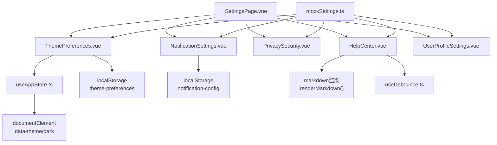
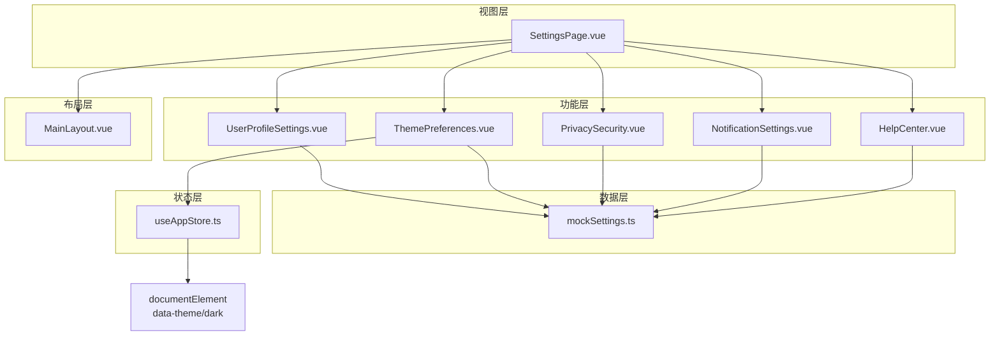
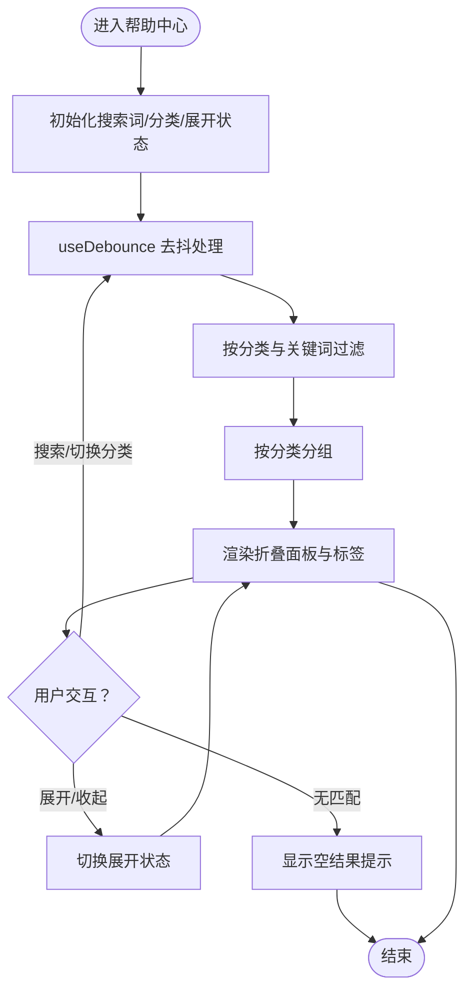
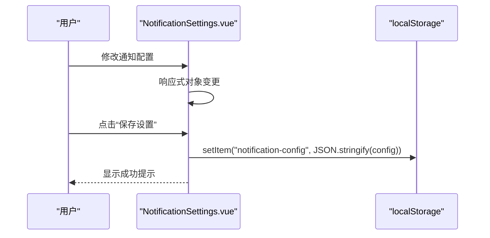
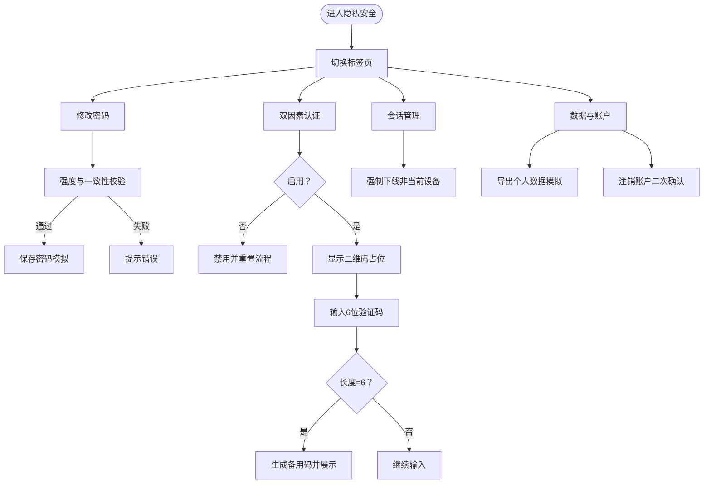
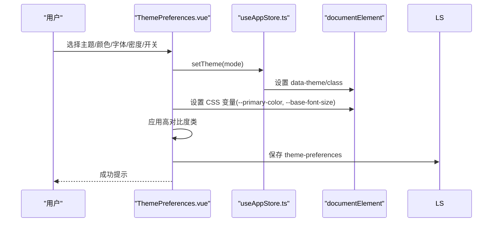
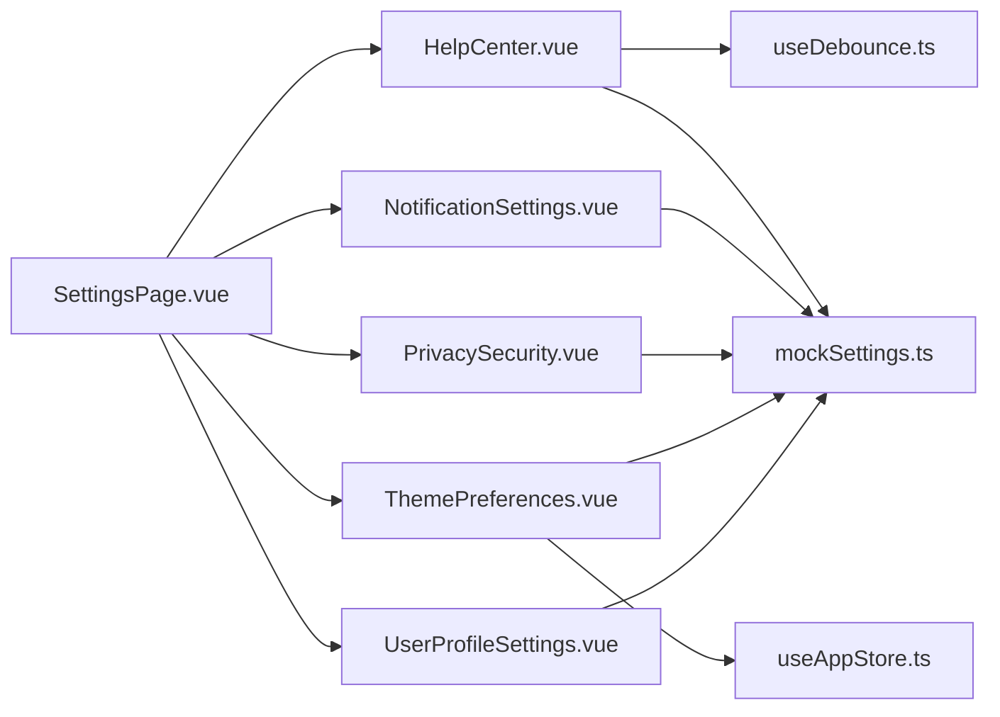

# 设置管理系统

<cite>
**本文档引用的文件**
- [SettingsPage.vue](file://apps/AgentPit/src/views/SettingsPage.vue)
- [HelpCenter.vue](file://apps/AgentPit/src/components/settings/HelpCenter.vue)
- [NotificationSettings.vue](file://apps/AgentPit/src/components/settings/NotificationSettings.vue)
- [PrivacySecurity.vue](file://apps/AgentPit/src/components/settings/PrivacySecurity.vue)
- [ThemePreferences.vue](file://apps/AgentPit/src/components/settings/ThemePreferences.vue)
- [UserProfileSettings.vue](file://apps/AgentPit/src/components/settings/UserProfileSettings.vue)
- [mockSettings.ts](file://apps/AgentPit/src/data/mockSettings.ts)
- [useAppStore.ts](file://apps/AgentPit/src/stores/useAppStore.ts)
- [MainLayout.vue](file://apps/AgentPit/src/components/layout/MainLayout.vue)
- [useDebounce.ts](file://apps/AgentPit/src/composables/useDebounce.ts)
</cite>

## 目录
1. [引言](#引言)
2. [项目结构](#项目结构)
3. [核心组件](#核心组件)
4. [架构总览](#架构总览)
5. [详细组件分析](#详细组件分析)
6. [依赖关系分析](#依赖关系分析)
7. [性能考量](#性能考量)
8. [故障排查指南](#故障排查指南)
9. [结论](#结论)
10. [附录](#附录)

## 引言
本文件为设置管理系统的全面技术文档，覆盖帮助中心、通知设置、隐私安全、主题偏好、用户资料设置等核心配置功能。文档从架构、数据流、处理逻辑、集成点、错误处理与性能特性等方面进行深入解析，并提供主题切换与界面动态更新的实现原理说明，以及隐私设置的安全保障与数据保护策略。同时，给出新增设置项的实践路径与设置项验证、持久化的实现范式。

## 项目结构
设置系统位于 AgentPit 应用中，采用基于组件的组织方式，页面由 SettingsPage.vue 负责导航与内容区调度，各设置子组件负责具体功能实现；数据模型与默认值集中在 mockSettings.ts 中；主题状态由 Pinia store 管理并通过 DOM 属性与 CSS 变量驱动 UI 更新；布局由 MainLayout.vue 提供统一容器与侧边栏交互。

图表来源
- [SettingsPage.vue:1-178](file://apps/AgentPit/src/views/SettingsPage.vue#L1-L178)
- [HelpCenter.vue:1-333](file://apps/AgentPit/src/components/settings/HelpCenter.vue#L1-L333)
- [NotificationSettings.vue:1-329](file://apps/AgentPit/src/components/settings/NotificationSettings.vue#L1-L329)
- [PrivacySecurity.vue:1-580](file://apps/AgentPit/src/components/settings/PrivacySecurity.vue#L1-L580)
- [ThemePreferences.vue:1-385](file://apps/AgentPit/src/components/settings/ThemePreferences.vue#L1-L385)
- [UserProfileSettings.vue:1-142](file://apps/AgentPit/src/components/settings/UserProfileSettings.vue#L1-L142)
- [mockSettings.ts:1-452](file://apps/AgentPit/src/data/mockSettings.ts#L1-L452)
- [useAppStore.ts:1-89](file://apps/AgentPit/src/stores/useAppStore.ts#L1-L89)
- [useDebounce.ts:1-21](file://apps/AgentPit/src/composables/useDebounce.ts#L1-L21)

章节来源
- [SettingsPage.vue:1-178](file://apps/AgentPit/src/views/SettingsPage.vue#L1-L178)

## 核心组件
- 帮助中心：提供 FAQ 搜索、分类筛选、折叠面板展示与 Markdown 渲染，支持防抖搜索与分组展示。
- 通知设置：集中管理通知渠道（浏览器推送、应用内、邮件、短信）、免打扰时段、聚合模式、提示音与震动反馈，并提供重置与保存。
- 隐私安全：密码修改（含强度校验与一致性校验）、双因素认证（TOTP 流程与备用码）、会话管理（设备列表与强制下线）、数据导出与账户注销。
- 主题偏好：主题模式（亮/暗/跟随系统）、强调色（预设与自定义）、字体大小、布局密度、动画与高对比度开关，并实时预览与持久化。
- 用户资料设置：头像上传预览、个人资料字段编辑与保存。

章节来源
- [HelpCenter.vue:1-333](file://apps/AgentPit/src/components/settings/HelpCenter.vue#L1-L333)
- [NotificationSettings.vue:1-329](file://apps/AgentPit/src/components/settings/NotificationSettings.vue#L1-L329)
- [PrivacySecurity.vue:1-580](file://apps/AgentPit/src/components/settings/PrivacySecurity.vue#L1-L580)
- [ThemePreferences.vue:1-385](file://apps/AgentPit/src/components/settings/ThemePreferences.vue#L1-L385)
- [UserProfileSettings.vue:1-142](file://apps/AgentPit/src/components/settings/UserProfileSettings.vue#L1-L142)

## 架构总览
设置系统采用“页面调度 + 子组件功能 + 数据模型 + 状态存储”的分层架构：
- 视图层：SettingsPage.vue 负责左侧导航与右侧内容区切换。
- 功能层：各设置子组件封装各自业务逻辑与 UI。
- 数据层：mockSettings.ts 定义类型与默认值，作为本地持久化与演示数据源。
- 状态层：useAppStore.ts 管理主题状态与全局应用状态，并通过 DOM 属性与 CSS 变量驱动主题切换。
- 布局层：MainLayout.vue 提供统一布局与侧边栏交互。

图表来源
- [SettingsPage.vue:1-178](file://apps/AgentPit/src/views/SettingsPage.vue#L1-L178)
- [ThemePreferences.vue:1-385](file://apps/AgentPit/src/components/settings/ThemePreferences.vue#L1-L385)
- [useAppStore.ts:1-89](file://apps/AgentPit/src/stores/useAppStore.ts#L1-L89)
- [mockSettings.ts:1-452](file://apps/AgentPit/src/data/mockSettings.ts#L1-L452)
- [MainLayout.vue:1-79](file://apps/AgentPit/src/components/layout/MainLayout.vue#L1-L79)

## 详细组件分析

### 帮助中心（HelpCenter.vue）
- 搜索与过滤：使用防抖组合式函数对搜索词进行去抖处理，支持按标题、内容与标签匹配；支持按分类筛选。
- 分类与分组：内置分类数组，统计各分类下的 FAQ 数量；按分类分组渲染。
- 渲染与交互：折叠面板展开/收起，支持 Markdown 简易渲染（加粗、换行、列表），提供联系客服与快捷键帮助。
- 性能与体验：使用 TransitionGroup 和 Transition 控制动画，避免频繁重排；空结果友好提示。

图表来源
- [HelpCenter.vue:1-333](file://apps/AgentPit/src/components/settings/HelpCenter.vue#L1-L333)
- [useDebounce.ts:1-21](file://apps/AgentPit/src/composables/useDebounce.ts#L1-L21)

章节来源
- [HelpCenter.vue:1-333](file://apps/AgentPit/src/components/settings/HelpCenter.vue#L1-L333)
- [useDebounce.ts:1-21](file://apps/AgentPit/src/composables/useDebounce.ts#L1-L21)

### 通知设置（NotificationSettings.vue）
- 配置模型：基于默认通知配置对象，支持通道开关（浏览器推送、应用内、邮件、短信）、免打扰时段、聚合模式、提示音与震动。
- 交互与持久化：通过响应式对象绑定 UI，保存时写入 localStorage；提供重置默认功能。
- UI 设计：表格化通道矩阵、卡片化聚合模式选择、按钮式声音选择、开关式震动控制。

图表来源
- [NotificationSettings.vue:1-329](file://apps/AgentPit/src/components/settings/NotificationSettings.vue#L1-L329)

章节来源
- [NotificationSettings.vue:1-329](file://apps/AgentPit/src/components/settings/NotificationSettings.vue#L1-L329)
- [mockSettings.ts:32-103](file://apps/AgentPit/src/data/mockSettings.ts#L32-L103)

### 隐私安全（PrivacySecurity.vue）
- 密码管理：当前密码、新密码、确认密码输入，密码强度计算与一致性校验，提交时进行条件判断。
- 双因素认证（TOTP）：启用/禁用开关，二维码占位，6位验证码输入与校验，生成/重新生成备用码。
- 会话管理：设备列表展示（类型、系统、浏览器、IP、最后活跃时间），当前设备标识，非当前设备强制下线。
- 数据与账户：导出个人数据（模拟）、危险区域（账户注销，二次确认弹窗）。

图表来源
- [PrivacySecurity.vue:1-580](file://apps/AgentPit/src/components/settings/PrivacySecurity.vue#L1-L580)
- [mockSettings.ts:41-57](file://apps/AgentPit/src/data/mockSettings.ts#L41-L57)
- [mockSettings.ts:185-196](file://apps/AgentPit/src/data/mockSettings.ts#L185-L196)

章节来源
- [PrivacySecurity.vue:1-580](file://apps/AgentPit/src/components/settings/PrivacySecurity.vue#L1-L580)
- [mockSettings.ts:41-57](file://apps/AgentPit/src/data/mockSettings.ts#L41-L57)
- [mockSettings.ts:185-196](file://apps/AgentPit/src/data/mockSettings.ts#L185-L196)

### 主题偏好（ThemePreferences.vue）
- 主题模式：亮/暗/跟随系统，实时应用到 documentElement 的 data-theme 与 class。
- 强调色：预设颜色与自定义色（色轮），通过 CSS 变量 --primary-color 生效。
- 字体大小与布局密度：映射到 CSS 变量 --base-font-size 与间距变量。
- 开关选项：动画减少与高对比度模式，分别通过 CSS 类与变量控制。
- 持久化与初始化：组件挂载时从 localStorage 读取并应用；watch 监听变化自动保存。

图表来源
- [ThemePreferences.vue:1-385](file://apps/AgentPit/src/components/settings/ThemePreferences.vue#L1-L385)
- [useAppStore.ts:1-89](file://apps/AgentPit/src/stores/useAppStore.ts#L1-L89)

章节来源
- [ThemePreferences.vue:1-385](file://apps/AgentPit/src/components/settings/ThemePreferences.vue#L1-L385)
- [useAppStore.ts:1-89](file://apps/AgentPit/src/stores/useAppStore.ts#L1-L89)

### 用户资料设置（UserProfileSettings.vue）
- 头像上传：FileReader 读取本地图片，预览头像；保存时输出当前资料对象（模拟）。
- 表单字段：昵称、个人简介、邮箱、电话、所在地、个人网站，均为双向绑定。

章节来源
- [UserProfileSettings.vue:1-142](file://apps/AgentPit/src/components/settings/UserProfileSettings.vue#L1-L142)

## 依赖关系分析
- 组件耦合与内聚：各设置子组件相对独立，仅通过 props/事件或共享数据模型进行交互；SettingsPage.vue 作为单一入口负责内容区切换。
- 外部依赖：useDebounce 提供通用防抖能力；localStorage 提供前端持久化；documentElement 与 CSS 变量用于主题与样式动态更新。
- 状态与存储：useAppStore 管理主题与全局状态；各设置组件通过 localStorage 管理自身配置；mockSettings.ts 提供类型与默认值。

图表来源
- [HelpCenter.vue:1-333](file://apps/AgentPit/src/components/settings/HelpCenter.vue#L1-L333)
- [NotificationSettings.vue:1-329](file://apps/AgentPit/src/components/settings/NotificationSettings.vue#L1-L329)
- [PrivacySecurity.vue:1-580](file://apps/AgentPit/src/components/settings/PrivacySecurity.vue#L1-L580)
- [ThemePreferences.vue:1-385](file://apps/AgentPit/src/components/settings/ThemePreferences.vue#L1-L385)
- [UserProfileSettings.vue:1-142](file://apps/AgentPit/src/components/settings/UserProfileSettings.vue#L1-L142)
- [mockSettings.ts:1-452](file://apps/AgentPit/src/data/mockSettings.ts#L1-L452)
- [useAppStore.ts:1-89](file://apps/AgentPit/src/stores/useAppStore.ts#L1-L89)
- [useDebounce.ts:1-21](file://apps/AgentPit/src/composables/useDebounce.ts#L1-L21)
- [SettingsPage.vue:1-178](file://apps/AgentPit/src/views/SettingsPage.vue#L1-L178)

章节来源
- [SettingsPage.vue:1-178](file://apps/AgentPit/src/views/SettingsPage.vue#L1-L178)
- [mockSettings.ts:1-452](file://apps/AgentPit/src/data/mockSettings.ts#L1-L452)
- [useAppStore.ts:1-89](file://apps/AgentPit/src/stores/useAppStore.ts#L1-L89)

## 性能考量
- 防抖搜索：HelpCenter 对搜索词使用 300ms 防抖，降低过滤频率，提升输入流畅度。
- 虚拟滚动与懒渲染：当前实现未引入虚拟滚动，若 FAQ 数量增长，建议引入虚拟列表以降低 DOM 压力。
- 主题切换：通过 CSS 变量与 class 切换，避免重排；建议在大型页面中按需更新样式，减少不必要的重绘。
- 通知设置：保存时一次性序列化并写入 localStorage，避免多次 IO；建议在批量变更时合并写入。
- 图片上传：头像预览使用 FileReader，建议限制文件大小与类型，避免内存占用过高。

## 故障排查指南
- 主题不生效
  - 检查 useAppStore 是否正确设置 theme 并调用 applyTheme。
  - 确认 documentElement 上 data-theme 与 dark class 是否存在。
  - 清除浏览器缓存后重试。
- 通知设置未保存
  - 确认 localStorage 中 notification-config 键是否存在。
  - 检查保存按钮事件绑定与 JSON 序列化过程。
- 帮助中心搜索无响应
  - 确认 useDebounce 返回的去抖值是否更新。
  - 检查过滤逻辑中的关键词匹配与分类筛选。
- 隐私安全页面异常
  - 密码强度与一致性校验：确保新密码长度与字符要求满足，确认两次输入一致。
  - 2FA 流程：验证码必须为 6 位数字；备用码生成后需妥善保存。
- 用户资料保存
  - 保存逻辑为模拟输出，实际项目需对接后端 API 并处理错误与成功回调。

章节来源
- [ThemePreferences.vue:1-385](file://apps/AgentPit/src/components/settings/ThemePreferences.vue#L1-L385)
- [useAppStore.ts:1-89](file://apps/AgentPit/src/stores/useAppStore.ts#L1-L89)
- [NotificationSettings.vue:1-329](file://apps/AgentPit/src/components/settings/NotificationSettings.vue#L1-L329)
- [HelpCenter.vue:1-333](file://apps/AgentPit/src/components/settings/HelpCenter.vue#L1-L333)
- [PrivacySecurity.vue:1-580](file://apps/AgentPit/src/components/settings/PrivacySecurity.vue#L1-L580)
- [UserProfileSettings.vue:1-142](file://apps/AgentPit/src/components/settings/UserProfileSettings.vue#L1-L142)

## 结论
设置管理系统以清晰的组件边界与数据模型为基础，结合 Pinia 状态管理与 localStorage 持久化，实现了主题、通知、隐私安全、帮助中心与用户资料等核心配置功能。主题切换通过 CSS 变量与 DOM 属性实现即时生效，用户体验流畅。建议后续在 FAQ 量增长时引入虚拟列表与更完善的权限控制与服务端同步策略。

## 附录

### 数据存储机制
- 本地存储
  - 主题偏好：键名 "theme-preferences"，值为序列化后的主题设置对象。
  - 通知设置：键名 "notification-config"，值为序列化后的通知配置对象。
  - 应用主题：键名 "theme"，值为字符串（light/dark/system）。
- 状态存储
  - useAppStore 管理应用主题与全局状态，支持持久化 pick 选择。

章节来源
- [ThemePreferences.vue:52](file://apps/AgentPit/src/components/settings/ThemePreferences.vue#L52)
- [NotificationSettings.vue:9](file://apps/AgentPit/src/components/settings/NotificationSettings.vue#L9)
- [useAppStore.ts:15](file://apps/AgentPit/src/stores/useAppStore.ts#L15)
- [useAppStore.ts:83-87](file://apps/AgentPit/src/stores/useAppStore.ts#L83-L87)

### 权限控制与同步策略
- 权限控制
  - 当前实现为前端本地配置，未涉及后端鉴权与细粒度权限控制。建议在接入后端时，为每个设置项增加权限标识与路由守卫。
- 同步策略
  - 本地 localStorage 同步：主题与通知设置在本地生效；建议在用户登录后与服务端同步，支持跨设备一致性。
  - 会话管理：设备列表为本地模拟，真实场景需后端维护并提供强制下线接口。

### 主题切换实现原理与界面动态更新
- 主题模式切换：通过 useAppStore.setTheme 写入 localStorage 并调用 applyTheme，设置 documentElement 的 data-theme 与 dark class。
- 强调色与字体：通过 CSS 变量 --primary-color 与 --base-font-size 动态更新。
- 高对比度与动画：通过添加/移除 CSS 类实现无障碍与体验优化。
- 实时预览：ThemePreferences 组件提供预览区域，便于即时反馈。

章节来源
- [ThemePreferences.vue:31-53](file://apps/AgentPit/src/components/settings/ThemePreferences.vue#L31-L53)
- [useAppStore.ts:54-72](file://apps/AgentPit/src/stores/useAppStore.ts#L54-L72)

### 隐私设置的安全保障与数据保护策略
- 密码管理：前端进行强度与一致性校验，提交时进行条件判断；实际项目需后端加密存储与安全传输。
- 双因素认证：TOTP 流程与备用码生成，备用码需妥善保存并在使用后可重新生成。
- 会话管理：模拟设备列表，真实场景需后端维护登录会话并提供强制下线能力。
- 数据导出与账户注销：当前为模拟功能，实际项目需提供安全的数据导出与删除流程，并遵循最小化与可撤销原则。

章节来源
- [PrivacySecurity.vue:22-52](file://apps/AgentPit/src/components/settings/PrivacySecurity.vue#L22-L52)
- [PrivacySecurity.vue:65-75](file://apps/AgentPit/src/components/settings/PrivacySecurity.vue#L65-L75)
- [mockSettings.ts:185-196](file://apps/AgentPit/src/data/mockSettings.ts#L185-L196)

### 新增设置项的实践路径与范式
- 新增设置项步骤
  - 定义数据模型与默认值：在 mockSettings.ts 中新增接口与默认值。
  - 编写设置组件：参考现有组件结构，使用响应式对象绑定 UI，提供保存与重置逻辑。
  - 持久化策略：在组件中使用 localStorage.setItem 保存配置，必要时在应用启动时从 localStorage 读取。
  - 集成到页面：在 SettingsPage.vue 中添加导航项与组件挂载。
- 设置项验证与持久化范式
  - 验证：在保存前进行必填与格式校验；对于敏感项（如密码）进行强度与一致性校验。
  - 持久化：统一使用键名前缀（如 "setting-"）区分不同设置域，避免键名冲突；批量更新时合并写入，减少 IO 次数。
  - 同步：登录后与服务端同步，支持跨设备一致性；提供回滚与撤销能力。

章节来源
- [mockSettings.ts:15-103](file://apps/AgentPit/src/data/mockSettings.ts#L15-L103)
- [SettingsPage.vue:12-19](file://apps/AgentPit/src/views/SettingsPage.vue#L12-L19)
- [ThemePreferences.vue:55-67](file://apps/AgentPit/src/components/settings/ThemePreferences.vue#L55-L67)
- [NotificationSettings.vue:8-18](file://apps/AgentPit/src/components/settings/NotificationSettings.vue#L8-L18)