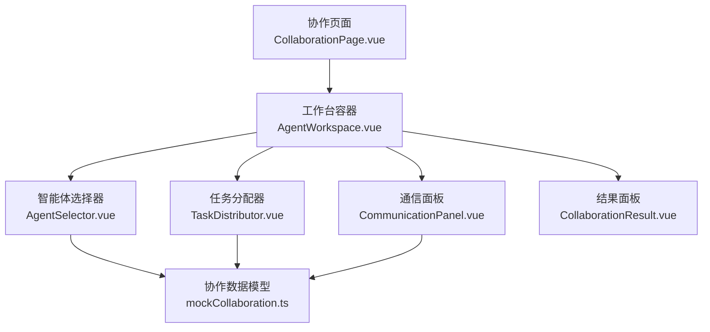
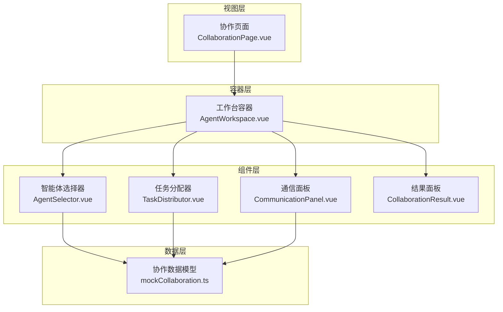
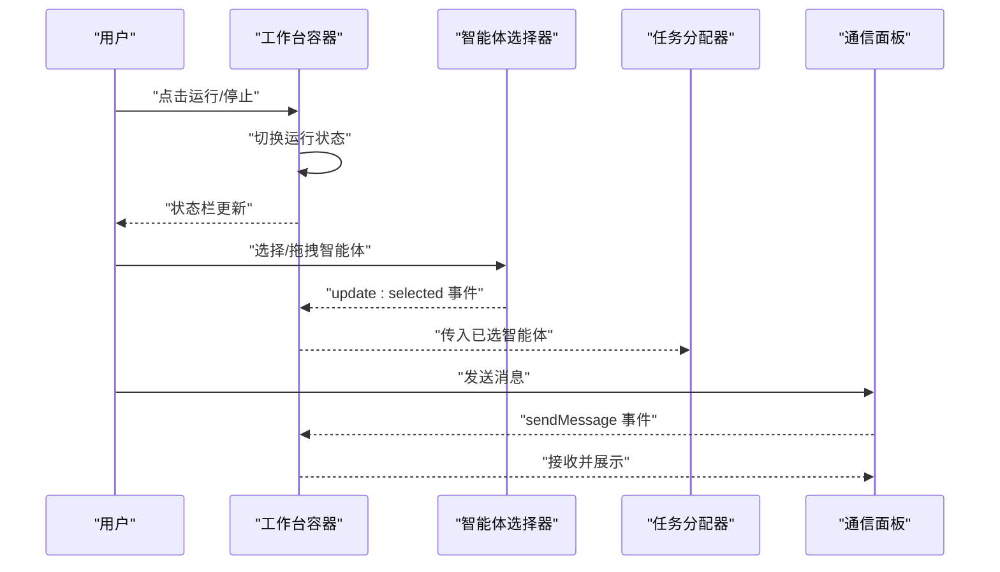
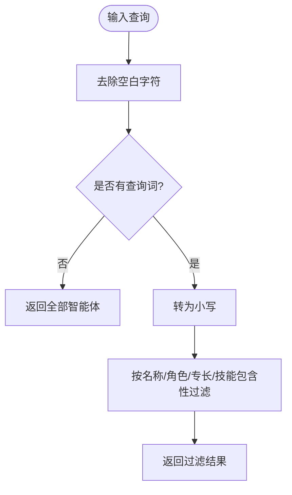
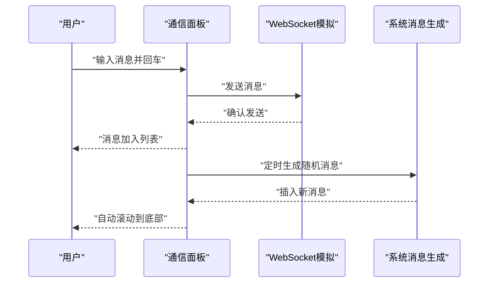
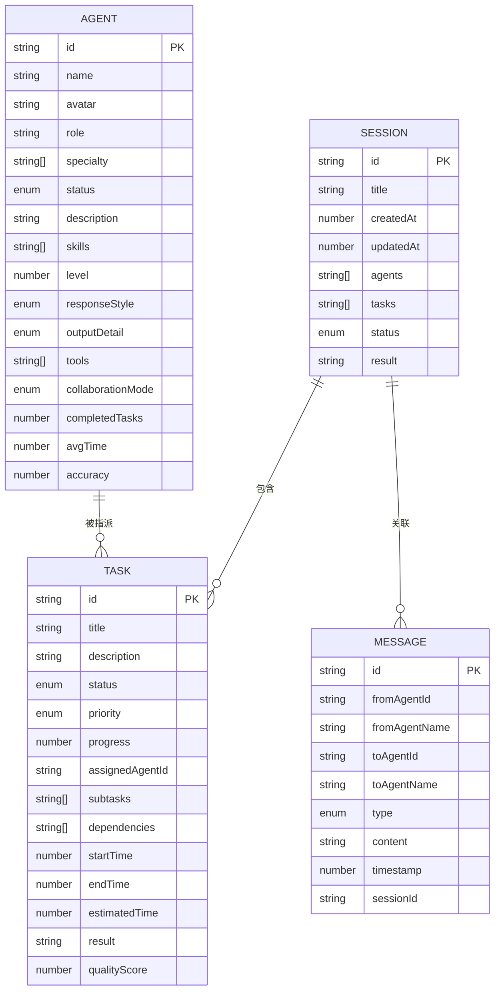
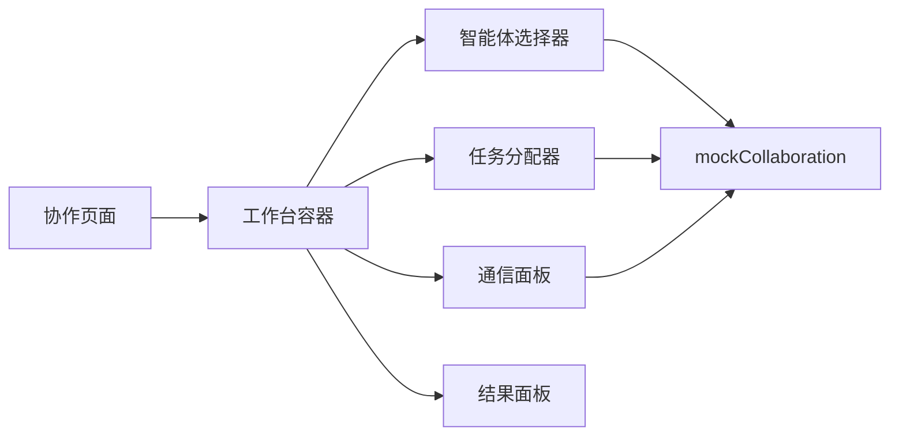

# 协作系统

<cite>
**本文档引用的文件**
- [CollaborationPage.vue](file://apps/AgentPit/src/views/CollaborationPage.vue)
- [AgentWorkspace.vue](file://apps/AgentPit/src/components/collaboration/AgentWorkspace.vue)
- [AgentSelector.vue](file://apps/AgentPit/src/components/collaboration/AgentSelector.vue)
- [CommunicationPanel.vue](file://apps/AgentPit/src/components/collaboration/CommunicationPanel.vue)
- [mockCollaboration.ts](file://apps/AgentPit/src/data/mockCollaboration.ts)
</cite>

## 目录
1. [简介](#简介)
2. [项目结构](#项目结构)
3. [核心组件](#核心组件)
4. [架构总览](#架构总览)
5. [详细组件分析](#详细组件分析)
6. [依赖关系分析](#依赖关系分析)
7. [性能考虑](#性能考虑)
8. [故障排查指南](#故障排查指南)
9. [结论](#结论)

## 简介
本文件面向AgentPit智能体平台的协作系统，聚焦于多智能体工作空间、任务分配、通信面板等核心模块，系统性阐述多个智能体之间的协同工作机制（任务分解、进度跟踪、资源共享）、协作流程实现机制（权限管理、冲突解决、状态同步）以及效率优化、故障处理与性能监控策略。文档同时提供基于仓库现有源码的实现路径指引，帮助开发者快速理解与扩展协作系统。

## 项目结构
协作系统位于AgentPit应用内，采用视图-组件分层组织：
- 视图层：协作页面负责承载工作台容器与布局
- 组件层：工作台容器协调智能体选择、任务分配、通信与结果展示
- 数据层：模拟协作数据模型（智能体、任务、会话、消息）

图表来源
- [CollaborationPage.vue:1-13](file://apps/AgentPit/src/views/CollaborationPage.vue#L1-L13)
- [AgentWorkspace.vue:1-354](file://apps/AgentPit/src/components/collaboration/AgentWorkspace.vue#L1-L354)
- [AgentSelector.vue:1-230](file://apps/AgentPit/src/components/collaboration/AgentSelector.vue#L1-L230)
- [CommunicationPanel.vue:1-415](file://apps/AgentPit/src/components/collaboration/CommunicationPanel.vue#L1-L415)
- [mockCollaboration.ts:1-331](file://apps/AgentPit/src/data/mockCollaboration.ts#L1-L331)

章节来源
- [CollaborationPage.vue:1-13](file://apps/AgentPit/src/views/CollaborationPage.vue#L1-L13)
- [AgentWorkspace.vue:1-354](file://apps/AgentPit/src/components/collaboration/AgentWorkspace.vue#L1-L354)
- [AgentSelector.vue:1-230](file://apps/AgentPit/src/components/collaboration/AgentSelector.vue#L1-L230)
- [CommunicationPanel.vue:1-415](file://apps/AgentPit/src/components/collaboration/CommunicationPanel.vue#L1-L415)
- [mockCollaboration.ts:1-331](file://apps/AgentPit/src/data/mockCollaboration.ts#L1-L331)

## 核心组件
- 工作台容器（AgentWorkspace）：统一编排智能体选择、任务分配、通信与结果展示，提供运行/停止控制、键盘快捷键与状态栏信息。
- 智能体选择器（AgentSelector）：支持搜索、单选/多选、全选在线、拖拽重排、配置触发等交互。
- 通信面板（CommunicationPanel）：模拟WebSocket连接状态，支持消息过滤、分组显示、发送与自动回复、清空消息等。
- 协作数据模型（mockCollaboration）：定义Agent、Task、CollaborationSession、Message等类型及示例数据，支撑协作流程的数据结构。

章节来源
- [AgentWorkspace.vue:1-354](file://apps/AgentPit/src/components/collaboration/AgentWorkspace.vue#L1-L354)
- [AgentSelector.vue:1-230](file://apps/AgentPit/src/components/collaboration/AgentSelector.vue#L1-L230)
- [CommunicationPanel.vue:1-415](file://apps/AgentPit/src/components/collaboration/CommunicationPanel.vue#L1-L415)
- [mockCollaboration.ts:1-331](file://apps/AgentPit/src/data/mockCollaboration.ts#L1-L331)

## 架构总览
协作系统采用“视图-容器-组件-数据”四层架构：
- 视图层：协作页面作为入口，渲染工作台容器
- 容器层：工作台容器集中管理协作生命周期与面板切换
- 组件层：各功能面板解耦，通过事件与属性进行数据传递
- 数据层：以mock数据模型驱动，便于演示与扩展

图表来源
- [CollaborationPage.vue:1-13](file://apps/AgentPit/src/views/CollaborationPage.vue#L1-L13)
- [AgentWorkspace.vue:1-354](file://apps/AgentPit/src/components/collaboration/AgentWorkspace.vue#L1-L354)
- [AgentSelector.vue:1-230](file://apps/AgentPit/src/components/collaboration/AgentSelector.vue#L1-L230)
- [CommunicationPanel.vue:1-415](file://apps/AgentPit/src/components/collaboration/CommunicationPanel.vue#L1-L415)
- [mockCollaboration.ts:1-331](file://apps/AgentPit/src/data/mockCollaboration.ts#L1-L331)

## 详细组件分析

### 工作台容器（AgentWorkspace）
职责与特性
- 控制协作生命周期：开始/停止协作、新建会话、状态栏信息展示
- 面板编排：左侧智能体选择器、中部任务分配器与通信面板、右侧配置/结果面板
- 交互增强：全局键盘快捷键（运行/停止、显示快捷键、关闭弹窗）
- 事件桥接：向上抛出任务更新、任务选择、消息发送等事件

协作流程时序

图表来源
- [AgentWorkspace.vue:50-118](file://apps/AgentPit/src/components/collaboration/AgentWorkspace.vue#L50-L118)
- [AgentSelector.vue:18-72](file://apps/AgentPit/src/components/collaboration/AgentSelector.vue#L18-L72)
- [CommunicationPanel.vue:6-202](file://apps/AgentPit/src/components/collaboration/CommunicationPanel.vue#L6-L202)

章节来源
- [AgentWorkspace.vue:1-354](file://apps/AgentPit/src/components/collaboration/AgentWorkspace.vue#L1-L354)

### 智能体选择器（AgentSelector）
职责与特性
- 搜索过滤：按名称、角色、专长、技能关键词过滤
- 选择模式：单选/多选，支持全选在线、清空
- 拖拽重排：在已选列表内拖拽调整优先级顺序
- 事件输出：选中变更与配置触发事件

算法流程（搜索过滤）

图表来源
- [AgentSelector.vue:28-39](file://apps/AgentPit/src/components/collaboration/AgentSelector.vue#L28-L39)

章节来源
- [AgentSelector.vue:1-230](file://apps/AgentPit/src/components/collaboration/AgentSelector.vue#L1-L230)

### 通信面板（CommunicationPanel）
职责与特性
- 连接状态模拟：连接中/已连接/未连接三态
- 消息分组：按日期分组显示，支持消息类型过滤
- 发送与自动回复：输入消息并发送，短暂延迟后模拟收到回复
- 清空历史：一键清空消息记录

消息发送序列

图表来源
- [CommunicationPanel.vue:173-202](file://apps/AgentPit/src/components/collaboration/CommunicationPanel.vue#L173-L202)
- [CommunicationPanel.vue:40-92](file://apps/AgentPit/src/components/collaboration/CommunicationPanel.vue#L40-L92)

章节来源
- [CommunicationPanel.vue:1-415](file://apps/AgentPit/src/components/collaboration/CommunicationPanel.vue#L1-L415)

### 协作数据模型（mockCollaboration）
数据模型与关系

图表来源
- [mockCollaboration.ts:1-76](file://apps/AgentPit/src/data/mockCollaboration.ts#L1-L76)

章节来源
- [mockCollaboration.ts:1-331](file://apps/AgentPit/src/data/mockCollaboration.ts#L1-L331)

## 依赖关系分析
- 视图到容器：协作页面仅负责挂载工作台容器，保持极简职责
- 容器到组件：工作台容器聚合多个功能面板，形成协作主界面
- 组件到数据：智能体选择器、任务分配器、通信面板均依赖mock数据模型
- 事件耦合：组件间通过事件进行弱耦合通信，降低直接依赖

图表来源
- [CollaborationPage.vue:1-13](file://apps/AgentPit/src/views/CollaborationPage.vue#L1-L13)
- [AgentWorkspace.vue:1-354](file://apps/AgentPit/src/components/collaboration/AgentWorkspace.vue#L1-L354)
- [AgentSelector.vue:1-230](file://apps/AgentPit/src/components/collaboration/AgentSelector.vue#L1-L230)
- [CommunicationPanel.vue:1-415](file://apps/AgentPit/src/components/collaboration/CommunicationPanel.vue#L1-L415)
- [mockCollaboration.ts:1-331](file://apps/AgentPit/src/data/mockCollaboration.ts#L1-L331)

章节来源
- [CollaborationPage.vue:1-13](file://apps/AgentPit/src/views/CollaborationPage.vue#L1-L13)
- [AgentWorkspace.vue:1-354](file://apps/AgentPit/src/components/collaboration/AgentWorkspace.vue#L1-L354)
- [AgentSelector.vue:1-230](file://apps/AgentPit/src/components/collaboration/AgentSelector.vue#L1-L230)
- [CommunicationPanel.vue:1-415](file://apps/AgentPit/src/components/collaboration/CommunicationPanel.vue#L1-L415)
- [mockCollaboration.ts:1-331](file://apps/AgentPit/src/data/mockCollaboration.ts#L1-L331)

## 性能考虑
- 列表渲染优化
  - 使用虚拟滚动或分页加载大量智能体/消息时，避免一次性渲染过多DOM节点
  - 对搜索过滤后的列表进行节流/防抖，减少频繁计算
- 事件与状态
  - 合理拆分状态，避免单一组件状态爆炸
  - 使用计算属性缓存过滤结果，减少重复计算
- 通信与刷新
  - WebSocket模拟建议使用心跳与断线重连策略，生产环境接入真实连接
  - 自动滚动与分组渲染可在nextTick后批量执行，避免多次重排
- 资源占用
  - 定时器与监听器在组件卸载时及时清理，防止内存泄漏
  - 图标与头像尽量复用，避免重复下载

## 故障排查指南
常见问题与定位
- 无法发送消息
  - 检查输入框是否为空、按钮禁用状态、事件绑定是否生效
  - 参考路径：[CommunicationPanel.vue:173-202](file://apps/AgentPit/src/components/collaboration/CommunicationPanel.vue#L173-L202)
- 消息不显示或不滚动
  - 确认消息列表容器引用是否存在、自动滚动逻辑是否执行
  - 参考路径：[CommunicationPanel.vue:204-208](file://apps/AgentPit/src/components/collaboration/CommunicationPanel.vue#L204-L208)
- 智能体选择异常
  - 检查单选/多选模式、拖拽事件、选中状态计算
  - 参考路径：[AgentSelector.vue:43-72](file://apps/AgentPit/src/components/collaboration/AgentSelector.vue#L43-L72)
- 协作运行状态异常
  - 确认运行/停止切换逻辑、会话ID生成、状态栏格式化
  - 参考路径：[AgentWorkspace.vue:59-86](file://apps/AgentPit/src/components/collaboration/AgentWorkspace.vue#L59-L86)

章节来源
- [CommunicationPanel.vue:173-208](file://apps/AgentPit/src/components/collaboration/CommunicationPanel.vue#L173-L208)
- [AgentSelector.vue:43-72](file://apps/AgentPit/src/components/collaboration/AgentSelector.vue#L43-L72)
- [AgentWorkspace.vue:59-86](file://apps/AgentPit/src/components/collaboration/AgentWorkspace.vue#L59-L86)

## 结论
协作系统以工作台容器为核心，围绕智能体选择、任务分配与通信三大支柱构建，配合清晰的数据模型与事件机制，实现了从“人机协作”到“多智能体协同”的基础框架。后续可在以下方向演进：
- 引入真实后端与WebSocket，完善权限校验、冲突检测与状态同步
- 扩展任务调度引擎，支持依赖解析、优先级与资源约束
- 加强监控与可观测性，提供性能指标与告警机制
- 丰富协作结果与导出能力，支持多格式产物与质量评估