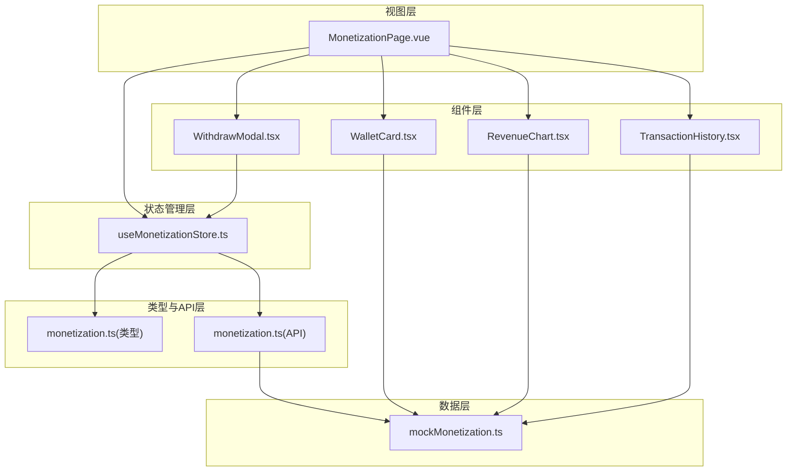
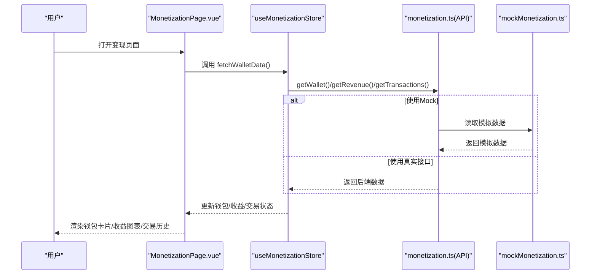
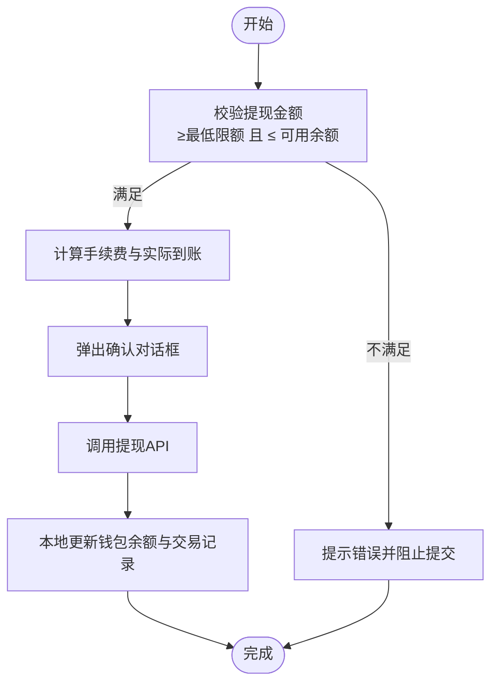
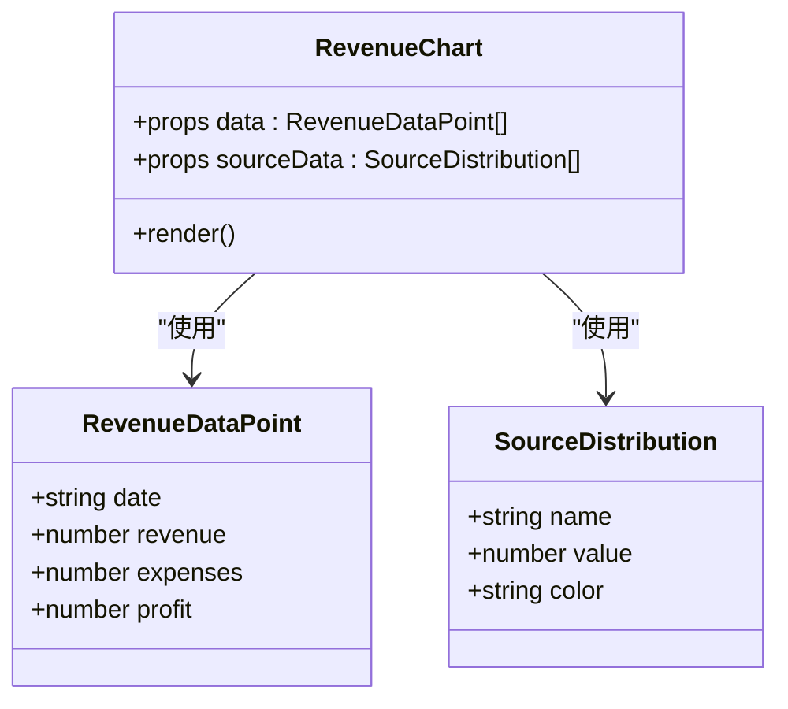
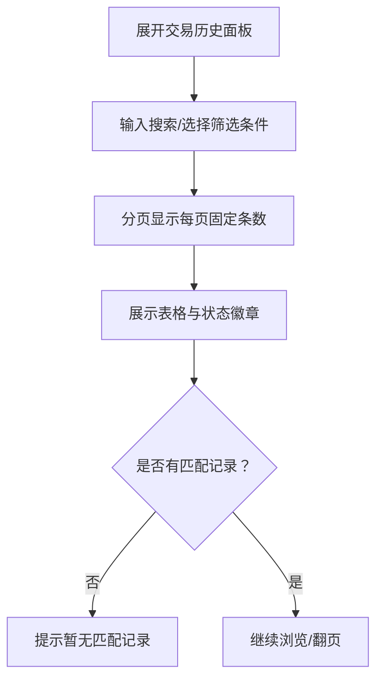
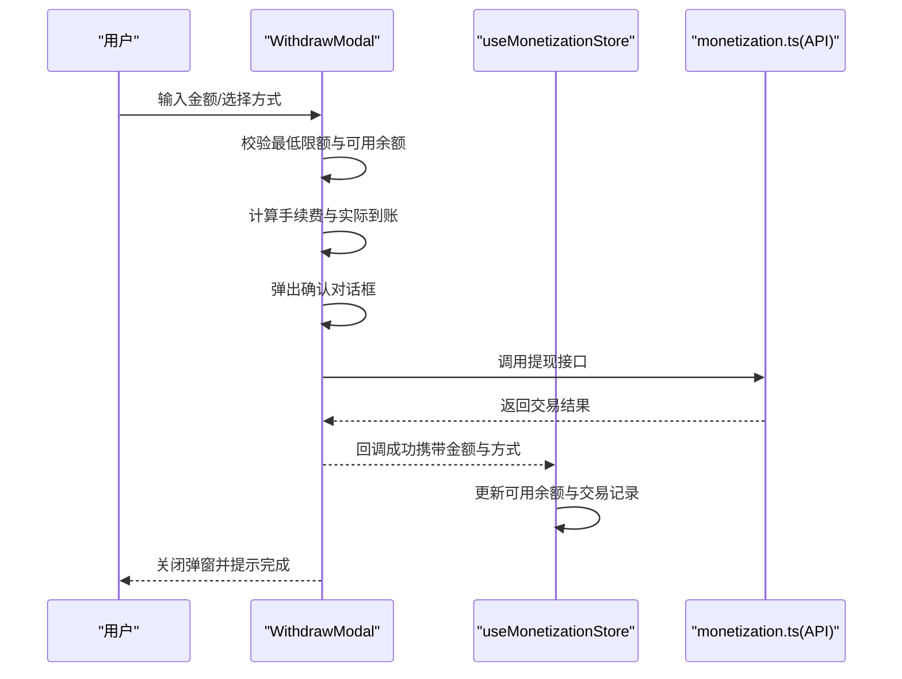
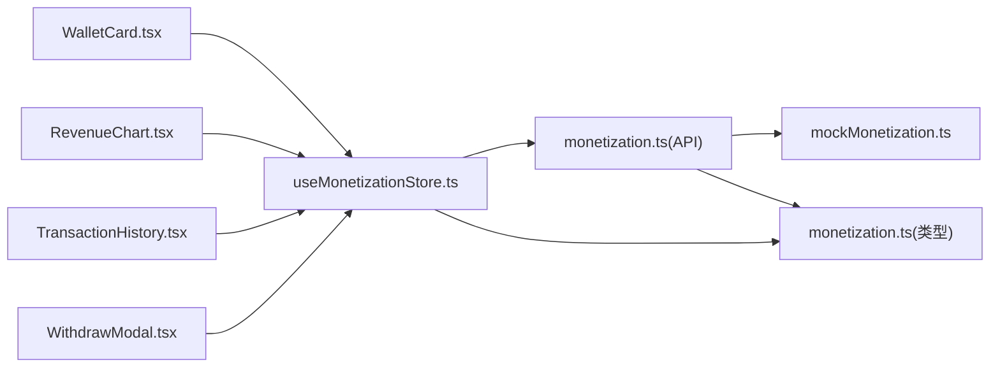

# 变现系统

<cite>
**本文引用的文件**
- [apps/AgentPit/src/stores/useMonetizationStore.ts](file://apps/AgentPit/src/stores/useMonetizationStore.ts)
- [apps/AgentPit/src/types/monetization.ts](file://apps/AgentPit/src/types/monetization.ts)
- [apps/AgentPit/src/services/api/monetization.ts](file://apps/AgentPit/src/services/api/monetization.ts)
- [apps/AgentPit/src/views/MonetizationPage.vue](file://apps/AgentPit/src/views/MonetizationPage.vue)
- [apps/AgentPit/src/data/mockMonetization.ts](file://apps/AgentPit/src/data/mockMonetization.ts)
- [apps/AgentPit/src-react-backup-20260410/components/monetization/WalletCard.tsx](file://apps/AgentPit/src-react-backup-20260410/components/monetization/WalletCard.tsx)
- [apps/AgentPit/src-react-backup-20260410/components/monetization/RevenueChart.tsx](file://apps/AgentPit/src-react-backup-20260410/components/monetization/RevenueChart.tsx)
- [apps/AgentPit/src-react-backup-20260410/components/monetization/TransactionHistory.tsx](file://apps/AgentPit/src-react-backup-20260410/components/monetization/TransactionHistory.tsx)
- [apps/AgentPit/src-react-backup-20260410/components/monetization/WithdrawModal.tsx](file://apps/AgentPit/src-react-backup-20260410/components/monetization/WithdrawModal.tsx)
</cite>

## 目录
1. [简介](#简介)
2. [项目结构](#项目结构)
3. [核心组件](#核心组件)
4. [架构总览](#架构总览)
5. [详细组件分析](#详细组件分析)
6. [依赖关系分析](#依赖关系分析)
7. [性能考量](#性能考量)
8. [故障排查指南](#故障排查指南)
9. [结论](#结论)
10. [附录](#附录)

## 简介
本文件面向AgentPit智能体平台的“变现系统”，系统化阐述其架构设计与实现要点，覆盖钱包管理、收入统计、交易历史、提现流程等关键模块，并结合前端组件与Pinia状态管理，给出可落地的集成参考路径。系统支持多货币、多交易分类、可视化收益趋势与来源分布，并提供提现手续费计算与状态管理能力。

## 项目结构
变现系统主要由以下层次构成：
- 视图层：变现页面负责编排钱包卡片、收益图表、交易历史、提现弹窗与财务报告等组件。
- 组件层：钱包卡片、收益图表、交易历史、提现弹窗等以组合式组件形式提供。
- 状态管理层：Pinia Store统一管理钱包、交易与收益数据，提供加载状态与派生计算。
- 类型与API层：定义交易、钱包、收益等类型，封装HTTP客户端与后端接口。
- Mock数据层：提供钱包、交易、收益与财务指标的模拟数据，便于开发与测试。

**图表来源**
- [apps/AgentPit/src/views/MonetizationPage.vue:1-92](file://apps/AgentPit/src/views/MonetizationPage.vue#L1-L92)
- [apps/AgentPit/src/stores/useMonetizationStore.ts:1-153](file://apps/AgentPit/src/stores/useMonetizationStore.ts#L1-L153)
- [apps/AgentPit/src/services/api/monetization.ts:1-77](file://apps/AgentPit/src/services/api/monetization.ts#L1-L77)
- [apps/AgentPit/src/types/monetization.ts:1-135](file://apps/AgentPit/src/types/monetization.ts#L1-L135)
- [apps/AgentPit/src/data/mockMonetization.ts:1-145](file://apps/AgentPit/src/data/mockMonetization.ts#L1-L145)
- [apps/AgentPit/src-react-backup-20260410/components/monetization/WalletCard.tsx:1-68](file://apps/AgentPit/src-react-backup-20260410/components/monetization/WalletCard.tsx#L1-L68)
- [apps/AgentPit/src-react-backup-20260410/components/monetization/RevenueChart.tsx:1-224](file://apps/AgentPit/src-react-backup-20260410/components/monetization/RevenueChart.tsx#L1-L224)
- [apps/AgentPit/src-react-backup-20260410/components/monetization/TransactionHistory.tsx:1-257](file://apps/AgentPit/src-react-backup-20260410/components/monetization/TransactionHistory.tsx#L1-L257)
- [apps/AgentPit/src-react-backup-20260410/components/monetization/WithdrawModal.tsx:1-240](file://apps/AgentPit/src-react-backup-20260410/components/monetization/WithdrawModal.tsx#L1-L240)

**章节来源**
- [apps/AgentPit/src/views/MonetizationPage.vue:1-92](file://apps/AgentPit/src/views/MonetizationPage.vue#L1-L92)
- [apps/AgentPit/src/stores/useMonetizationStore.ts:1-153](file://apps/AgentPit/src/stores/useMonetizationStore.ts#L1-L153)
- [apps/AgentPit/src/services/api/monetization.ts:1-77](file://apps/AgentPit/src/services/api/monetization.ts#L1-L77)
- [apps/AgentPit/src/types/monetization.ts:1-135](file://apps/AgentPit/src/types/monetization.ts#L1-L135)
- [apps/AgentPit/src/data/mockMonetization.ts:1-145](file://apps/AgentPit/src/data/mockMonetization.ts#L1-L145)

## 核心组件
- Pinia Store（钱包/交易/收益）
  - 管理钱包余额、交易历史、收益数据与加载状态。
  - 提供格式化余额、最近交易、收支合计等派生属性。
  - 提供拉取钱包/收益/交易、发起提现、实时更新余额等动作。
- API服务（monetization.ts）
  - 封装钱包、收益、交易、提现接口；支持Mock模式与真实HTTP调用。
- 类型定义（monetization.ts）
  - 定义货币、交易类型/状态/分类、钱包、交易记录、收益数据点、财务指标等。
- 页面视图（MonetizationPage.vue）
  - 编排钱包卡片、收益图表、交易历史、提现弹窗与财务报告。
- 组件库（React备份）
  - WalletCard、RevenueChart、TransactionHistory、WithdrawModal等组件。

**章节来源**
- [apps/AgentPit/src/stores/useMonetizationStore.ts:13-151](file://apps/AgentPit/src/stores/useMonetizationStore.ts#L13-L151)
- [apps/AgentPit/src/services/api/monetization.ts:40-76](file://apps/AgentPit/src/services/api/monetization.ts#L40-L76)
- [apps/AgentPit/src/types/monetization.ts:6-135](file://apps/AgentPit/src/types/monetization.ts#L6-L135)
- [apps/AgentPit/src/views/MonetizationPage.vue:1-92](file://apps/AgentPit/src/views/MonetizationPage.vue#L1-L92)

## 架构总览
变现系统采用“视图-组件-状态-类型-API-数据”的分层架构。页面通过Store获取数据并驱动组件渲染；Store通过API服务访问后端或Mock数据；类型定义贯穿前后端，保证数据一致性；组件层提供钱包、收益、交易、提现等UI能力。

**图表来源**
- [apps/AgentPit/src/views/MonetizationPage.vue:18-21](file://apps/AgentPit/src/views/MonetizationPage.vue#L18-L21)
- [apps/AgentPit/src/stores/useMonetizationStore.ts:66-112](file://apps/AgentPit/src/stores/useMonetizationStore.ts#L66-L112)
- [apps/AgentPit/src/services/api/monetization.ts:42-75](file://apps/AgentPit/src/services/api/monetization.ts#L42-L75)
- [apps/AgentPit/src/data/mockMonetization.ts:43-144](file://apps/AgentPit/src/data/mockMonetization.ts#L43-L144)

## 详细组件分析

### 钱包管理（Wallet）
- 数据模型
  - 总余额、可用余额、冻结余额、货币单位。
- 功能特性
  - 展示格式化余额（本地化货币格式）。
  - 提供充值/提现按钮事件。
  - 在提现成功后更新可用余额。
- 组件与状态
  - 组件：WalletCard.tsx（React备份）。
  - 状态：useMonetizationStore维护wallet对象与格式化getter。
- 业务逻辑
  - 提现时先校验金额范围与可用余额，再调用API发起提现，最后在本地更新余额并追加交易记录。

**图表来源**
- [apps/AgentPit/src-react-backup-20260410/components/monetization/WithdrawModal.tsx:21-56](file://apps/AgentPit/src-react-backup-20260410/components/monetization/WithdrawModal.tsx#L21-L56)
- [apps/AgentPit/src/stores/useMonetizationStore.ts:114-142](file://apps/AgentPit/src/stores/useMonetizationStore.ts#L114-L142)

**章节来源**
- [apps/AgentPit/src/types/monetization.ts:15-25](file://apps/AgentPit/src/types/monetization.ts#L15-L25)
- [apps/AgentPit/src-react-backup-20260410/components/monetization/WalletCard.tsx:1-68](file://apps/AgentPit/src-react-backup-20260410/components/monetization/WalletCard.tsx#L1-L68)
- [apps/AgentPit/src/stores/useMonetizationStore.ts:66-112](file://apps/AgentPit/src/stores/useMonetizationStore.ts#L66-L112)

### 收入统计（Revenue）
- 数据模型
  - 收益数据点：日期、收入、支出、净利润。
  - 收入来源分布：来源名称、占比、颜色。
- 功能特性
  - 收益趋势折线/柱状图切换。
  - 收入来源饼图与数值列表。
  - 时间范围选择（7/30/90/365天）。
- 组件与数据
  - 组件：RevenueChart.tsx（React备份）。
  - 数据：mockMonetization.ts生成随机收益曲线与分布。

**图表来源**
- [apps/AgentPit/src/types/monetization.ts:27-37](file://apps/AgentPit/src/types/monetization.ts#L27-L37)
- [apps/AgentPit/src/types/monetization.ts:79-87](file://apps/AgentPit/src/types/monetization.ts#L79-L87)
- [apps/AgentPit/src-react-backup-20260410/components/monetization/RevenueChart.tsx:1-224](file://apps/AgentPit/src-react-backup-20260410/components/monetization/RevenueChart.tsx#L1-L224)
- [apps/AgentPit/src/data/mockMonetization.ts:50-74](file://apps/AgentPit/src/data/mockMonetization.ts#L50-L74)
- [apps/AgentPit/src/data/mockMonetization.ts:124-129](file://apps/AgentPit/src/data/mockMonetization.ts#L124-L129)

**章节来源**
- [apps/AgentPit/src-react-backup-20260410/components/monetization/RevenueChart.tsx:50-221](file://apps/AgentPit/src-react-backup-20260410/components/monetization/RevenueChart.tsx#L50-L221)
- [apps/AgentPit/src/data/mockMonetization.ts:50-74](file://apps/AgentPit/src/data/mockMonetization.ts#L50-L74)

### 交易历史（TransactionHistory）
- 数据模型
  - 交易记录：ID、类型（收入/支出）、金额、状态、时间、描述、分类。
- 功能特性
  - 支持按类型与状态筛选。
  - 分页与搜索（交易ID/描述）。
  - 状态徽章（成功/处理中/失败）。
- 组件与状态
  - 组件：TransactionHistory.tsx（React备份）。
  - 状态：useMonetizationStore维护transactions数组。

**图表来源**
- [apps/AgentPit/src-react-backup-20260410/components/monetization/TransactionHistory.tsx:34-256](file://apps/AgentPit/src-react-backup-20260410/components/monetization/TransactionHistory.tsx#L34-L256)
- [apps/AgentPit/src/stores/useMonetizationStore.ts:48-62](file://apps/AgentPit/src/stores/useMonetizationStore.ts#L48-L62)

**章节来源**
- [apps/AgentPit/src/types/monetization.ts:39-55](file://apps/AgentPit/src/types/monetization.ts#L39-L55)
- [apps/AgentPit/src-react-backup-20260410/components/monetization/TransactionHistory.tsx:34-256](file://apps/AgentPit/src-react-backup-20260410/components/monetization/TransactionHistory.tsx#L34-L256)

### 提现流程（WithdrawModal）
- 业务规则
  - 最低提现额度、手续费率、实际到账=提现金额-手续费。
  - 支持三种提现方式（银行卡/支付宝/微信）。
- 用户交互
  - 输入金额、选择方式、确认信息、处理中反馈。
- 状态同步
  - 成功回调后，Store更新可用余额并添加交易记录。

**图表来源**
- [apps/AgentPit/src-react-backup-20260410/components/monetization/WithdrawModal.tsx:21-56](file://apps/AgentPit/src-react-backup-20260410/components/monetization/WithdrawModal.tsx#L21-L56)
- [apps/AgentPit/src/stores/useMonetizationStore.ts:114-142](file://apps/AgentPit/src/stores/useMonetizationStore.ts#L114-L142)
- [apps/AgentPit/src/services/api/monetization.ts:68-75](file://apps/AgentPit/src/services/api/monetization.ts#L68-L75)

**章节来源**
- [apps/AgentPit/src-react-backup-20260410/components/monetization/WithdrawModal.tsx:21-56](file://apps/AgentPit/src-react-backup-20260410/components/monetization/WithdrawModal.tsx#L21-L56)
- [apps/AgentPit/src/stores/useMonetizationStore.ts:114-142](file://apps/AgentPit/src/stores/useMonetizationStore.ts#L114-L142)

### 页面编排（MonetizationPage）
- 职责
  - 初始化加载钱包与收益数据。
  - 启动实时数据更新。
  - 编排钱包卡片、收益图表、交易历史、提现弹窗与财务报告。
- 事件绑定
  - 充值/提现按钮事件处理。
  - 提现成功回调更新状态。

**章节来源**
- [apps/AgentPit/src/views/MonetizationPage.vue:1-92](file://apps/AgentPit/src/views/MonetizationPage.vue#L1-L92)

## 依赖关系分析
- 组件到Store：WalletCard、RevenueChart、TransactionHistory、WithdrawModal均与Store存在数据与事件交互。
- Store到API：Store通过monetizationApi访问后端或Mock数据。
- API到数据：API在Mock模式下直接返回mockMonetization.ts的数据。
- 类型到组件/Store/API：类型定义贯穿于组件props、Store状态与API请求/响应。

**图表来源**
- [apps/AgentPit/src-react-backup-20260410/components/monetization/WalletCard.tsx:1-68](file://apps/AgentPit/src-react-backup-20260410/components/monetization/WalletCard.tsx#L1-L68)
- [apps/AgentPit/src-react-backup-20260410/components/monetization/RevenueChart.tsx:1-224](file://apps/AgentPit/src-react-backup-20260410/components/monetization/RevenueChart.tsx#L1-L224)
- [apps/AgentPit/src-react-backup-20260410/components/monetization/TransactionHistory.tsx:1-257](file://apps/AgentPit/src-react-backup-20260410/components/monetization/TransactionHistory.tsx#L1-L257)
- [apps/AgentPit/src-react-backup-20260410/components/monetization/WithdrawModal.tsx:1-240](file://apps/AgentPit/src-react-backup-20260410/components/monetization/WithdrawModal.tsx#L1-L240)
- [apps/AgentPit/src/stores/useMonetizationStore.ts:1-153](file://apps/AgentPit/src/stores/useMonetizationStore.ts#L1-L153)
- [apps/AgentPit/src/services/api/monetization.ts:1-77](file://apps/AgentPit/src/services/api/monetization.ts#L1-L77)
- [apps/AgentPit/src/data/mockMonetization.ts:1-145](file://apps/AgentPit/src/data/mockMonetization.ts#L1-L145)
- [apps/AgentPit/src/types/monetization.ts:1-135](file://apps/AgentPit/src/types/monetization.ts#L1-L135)

**章节来源**
- [apps/AgentPit/src/stores/useMonetizationStore.ts:1-153](file://apps/AgentPit/src/stores/useMonetizationStore.ts#L1-L153)
- [apps/AgentPit/src/services/api/monetization.ts:1-77](file://apps/AgentPit/src/services/api/monetization.ts#L1-L77)
- [apps/AgentPit/src/types/monetization.ts:1-135](file://apps/AgentPit/src/types/monetization.ts#L1-L135)

## 性能考量
- 数据加载
  - Store在fetchWalletData中串行获取钱包、交易与收益数据；建议在后端具备聚合接口时合并请求，减少往返。
- 图表渲染
  - 收益图表支持折线/柱状切换与时间范围选择，建议对大数据集进行采样或懒加载。
- 分页与筛选
  - 交易历史已内置分页与筛选，建议在服务端实现分页查询以降低前端压力。
- 实时更新
  - 页面启动实时数据更新，建议设置合理的轮询间隔与去抖策略，避免频繁刷新。

## 故障排查指南
- 接口调用失败
  - Store在获取数据与提现时捕获异常并打印错误日志；检查网络与后端服务状态。
- 提现金额校验失败
  - 确认最低提现额度与可用余额限制；检查手续费计算是否正确。
- Mock与真实环境切换
  - 确认API配置开关与Mock数据是否正确加载；避免在生产关闭Mock导致空白数据。

**章节来源**
- [apps/AgentPit/src/stores/useMonetizationStore.ts:107-111](file://apps/AgentPit/src/stores/useMonetizationStore.ts#L107-L111)
- [apps/AgentPit/src/services/api/monetization.ts:42-48](file://apps/AgentPit/src/services/api/monetization.ts#L42-L48)
- [apps/AgentPit/src/services/api/monetization.ts:68-75](file://apps/AgentPit/src/services/api/monetization.ts#L68-L75)

## 结论
AgentPit变现系统以清晰的分层架构实现了钱包、收益、交易与提现的核心能力。通过Pinia集中管理状态、类型约束保障一致性、组件化UI提升可维护性，并辅以Mock数据加速开发与测试。后续可在接口聚合、服务端分页与实时更新策略上进一步优化，以提升整体性能与用户体验。

## 附录

### 集成参考路径（不含具体代码片段）
- 页面入口
  - 变现页面组件：[apps/AgentPit/src/views/MonetizationPage.vue:1-92](file://apps/AgentPit/src/views/MonetizationPage.vue#L1-L92)
- 状态管理
  - Store定义与动作：[apps/AgentPit/src/stores/useMonetizationStore.ts:1-153](file://apps/AgentPit/src/stores/useMonetizationStore.ts#L1-L153)
- 类型定义
  - 交易/钱包/收益/提现类型：[apps/AgentPit/src/types/monetization.ts:1-135](file://apps/AgentPit/src/types/monetization.ts#L1-L135)
- API封装
  - 钱包/收益/交易/提现接口：[apps/AgentPit/src/services/api/monetization.ts:1-77](file://apps/AgentPit/src/services/api/monetization.ts#L1-L77)
- 组件实现
  - 钱包卡片：[apps/AgentPit/src-react-backup-20260410/components/monetization/WalletCard.tsx:1-68](file://apps/AgentPit/src-react-backup-20260410/components/monetization/WalletCard.tsx#L1-L68)
  - 收益图表：[apps/AgentPit/src-react-backup-20260410/components/monetization/RevenueChart.tsx:1-224](file://apps/AgentPit/src-react-backup-20260410/components/monetization/RevenueChart.tsx#L1-L224)
  - 交易历史：[apps/AgentPit/src-react-backup-20260410/components/monetization/TransactionHistory.tsx:1-257](file://apps/AgentPit/src-react-backup-20260410/components/monetization/TransactionHistory.tsx#L1-L257)
  - 提现弹窗：[apps/AgentPit/src-react-backup-20260410/components/monetization/WithdrawModal.tsx:1-240](file://apps/AgentPit/src-react-backup-20260410/components/monetization/WithdrawModal.tsx#L1-L240)
- Mock数据
  - 钱包/交易/收益/财务指标：[apps/AgentPit/src/data/mockMonetization.ts:1-145](file://apps/AgentPit/src/data/mockMonetization.ts#L1-L145)