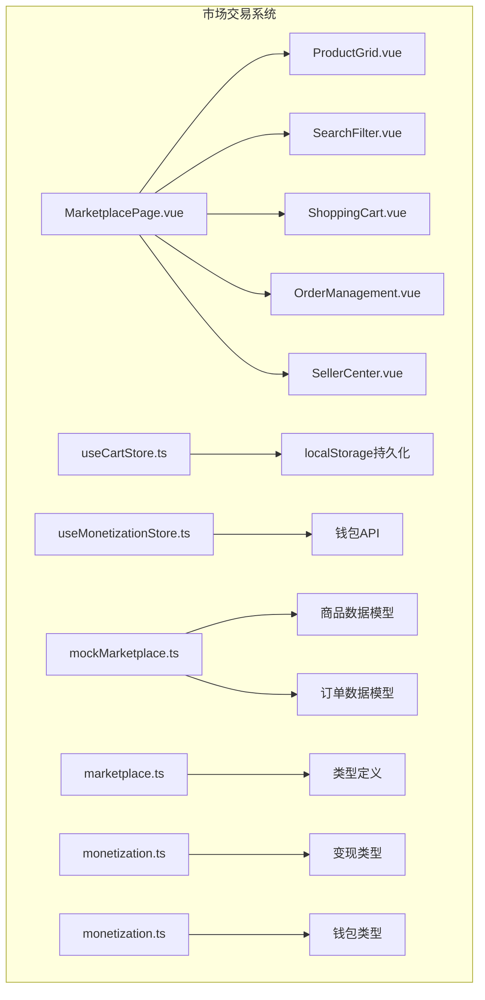
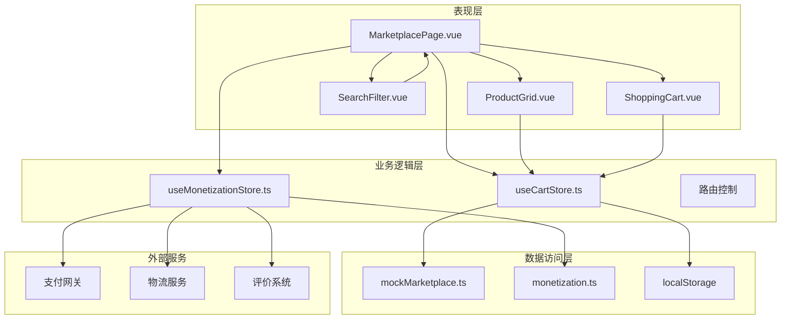
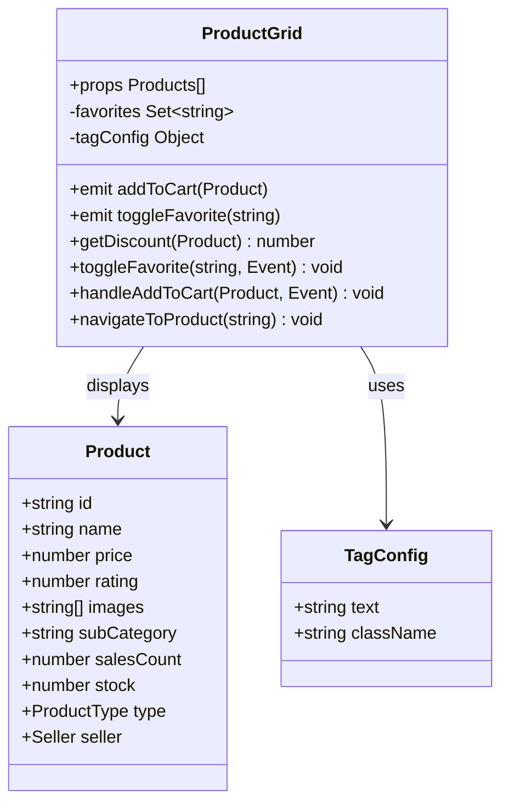
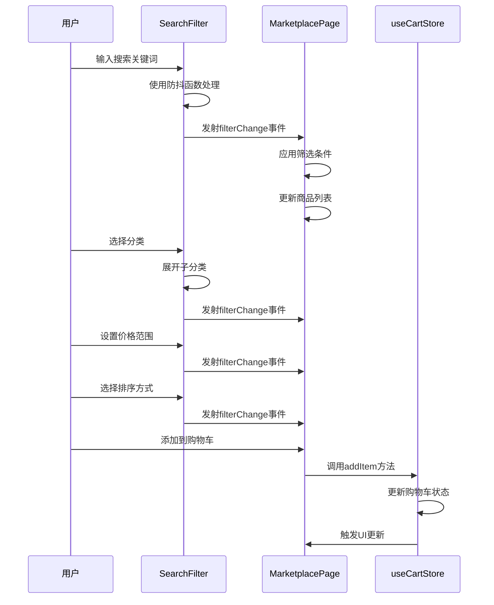
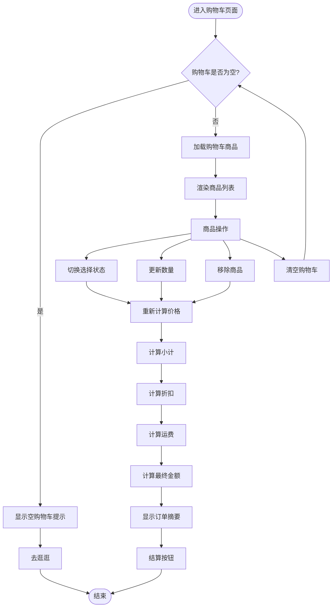
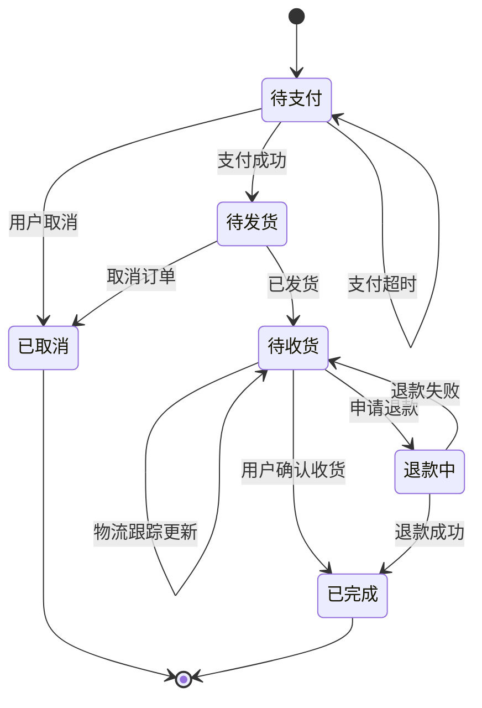
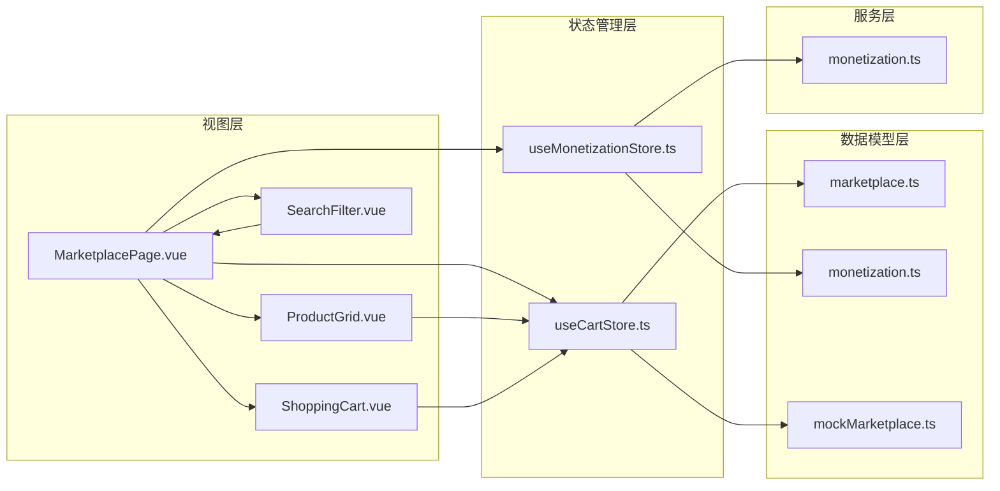

# 市场交易系统

<cite>
**本文档引用的文件**
- [mockMarketplace.ts](file://apps/AgentPit/src/data/mockMarketplace.ts)
- [useCartStore.ts](file://apps/AgentPit/src/stores/useCartStore.ts)
- [useMonetizationStore.ts](file://apps/AgentPit/src/stores/useMonetizationStore.ts)
- [marketplace.ts](file://apps/AgentPit/src/types/marketplace.ts)
- [monetization.ts](file://apps/AgentPit/src/types/monetization.ts)
- [MarketplacePage.vue](file://apps/AgentPit/src/views/MarketplacePage.vue)
- [ProductGrid.vue](file://apps/AgentPit/src/components/marketplace/ProductGrid.vue)
- [SearchFilter.vue](file://apps/AgentPit/src/components/marketplace/SearchFilter.vue)
- [ShoppingCart.vue](file://apps/AgentPit/src/components/marketplace/ShoppingCart.vue)
- [monetization.ts](file://apps/AgentPit/src/services/api/monetization.ts)
</cite>

## 目录
1. [引言](#引言)
2. [项目结构](#项目结构)
3. [核心组件](#核心组件)
4. [架构概览](#架构概览)
5. [详细组件分析](#详细组件分析)
6. [依赖关系分析](#依赖关系分析)
7. [性能考虑](#性能考虑)
8. [故障排除指南](#故障排除指南)
9. [结论](#结论)

## 引言

AgentPit智能体平台的市场交易系统是一个完整的电商解决方案，专为智能体生态系统设计。该系统支持数字产品、实体商品和专业服务的买卖，提供了从商品展示到订单完成的全流程交易体验。

系统的核心目标是为智能体开发者和用户提供一个安全、高效的交易平台，支持：
- 商品上架和管理
- 智能搜索和筛选
- 购物车管理
- 订单处理
- 支付和提现
- 物流跟踪
- 评价系统

## 项目结构

市场交易系统采用模块化架构，主要分为以下几个核心模块：

**图表来源**
- [MarketplacePage.vue:1-221](file://apps/AgentPit/src/views/MarketplacePage.vue#L1-L221)
- [useCartStore.ts:1-138](file://apps/AgentPit/src/stores/useCartStore.ts#L1-L138)
- [mockMarketplace.ts:1-248](file://apps/AgentPit/src/data/mockMarketplace.ts#L1-L248)

**章节来源**
- [MarketplacePage.vue:1-221](file://apps/AgentPit/src/views/MarketplacePage.vue#L1-L221)
- [mockMarketplace.ts:1-248](file://apps/AgentPit/src/data/mockMarketplace.ts#L1-L248)

## 核心组件

### 数据模型层

系统使用TypeScript接口定义了完整的数据模型，确保类型安全和开发效率。

**商品模型**包含以下关键属性：
- 基本信息：名称、描述、价格、库存
- 分类信息：主分类、子分类、标签
- 卖家信息：认证状态、评分、粉丝数
- 类型标识：数字产品、实体商品、服务
- 规格参数：技术规格、兼容性等

**订单模型**支持完整的订单生命周期：
- 状态管理：待支付、待发货、待收货、已完成、已取消、退款中
- 物流信息：配送状态、跟踪号码、物流轨迹
- 支付信息：支付方式、收货地址

**购物车模型**提供灵活的商品管理：
- 选择状态：单个商品选择、批量选择
- 数量控制：增减数量、库存限制
- 价格计算：原价、折扣价、运费计算

**章节来源**
- [marketplace.ts:13-48](file://apps/AgentPit/src/types/marketplace.ts#L13-L48)
- [marketplace.ts:138-159](file://apps/AgentPit/src/types/marketplace.ts#L138-L159)
- [marketplace.ts:200-208](file://apps/AgentPit/src/types/marketplace.ts#L200-L208)

### 状态管理层

系统采用Pinia状态管理，提供响应式的数据流控制。

**购物车状态管理**包含：
- 本地存储持久化
- 实时价格计算
- 选择状态同步
- 库存约束检查

**变现状态管理**提供：
- 钱包余额管理
- 交易历史追踪
- 收益数据分析
- 提现流程控制

**章节来源**
- [useCartStore.ts:6-137](file://apps/AgentPit/src/stores/useCartStore.ts#L6-L137)
- [useMonetizationStore.ts:20-152](file://apps/AgentPit/src/stores/useMonetizationStore.ts#L20-L152)

## 架构概览

市场交易系统采用分层架构设计，确保各层职责清晰、耦合度低。

**图表来源**
- [MarketplacePage.vue:1-221](file://apps/AgentPit/src/views/MarketplacePage.vue#L1-L221)
- [useCartStore.ts:1-138](file://apps/AgentPit/src/stores/useCartStore.ts#L1-L138)
- [useMonetizationStore.ts:1-153](file://apps/AgentPit/src/stores/useMonetizationStore.ts#L1-L153)

系统架构特点：
- **模块化设计**：每个组件职责单一，易于维护和扩展
- **类型安全**：完整的TypeScript类型定义确保编译时错误检测
- **状态分离**：购物车和变现状态独立管理，避免相互影响
- **持久化策略**：关键数据本地存储，提升用户体验

## 详细组件分析

### 商品展示组件

ProductGrid组件负责商品的网格展示，提供丰富的视觉反馈和交互功能。

**图表来源**
- [ProductGrid.vue:10-35](file://apps/AgentPit/src/components/marketplace/ProductGrid.vue#L10-L35)
- [marketplace.ts:13-48](file://apps/AgentPit/src/types/marketplace.ts#L13-L48)

组件特性：
- **响应式布局**：支持2-4列网格布局，适配不同屏幕尺寸
- **标签系统**：新品、热销、折扣、推荐标签动态显示
- **交互反馈**：悬停效果、点击跳转、收藏功能
- **价格展示**：原价划线、折扣百分比、销量统计

**章节来源**
- [ProductGrid.vue:1-234](file://apps/AgentPit/src/components/marketplace/ProductGrid.vue#L1-L234)
- [marketplace.ts:13-48](file://apps/AgentPit/src/types/marketplace.ts#L13-L48)

### 搜索过滤组件

SearchFilter组件提供强大的商品搜索和筛选功能。

**图表来源**
- [SearchFilter.vue:51-61](file://apps/AgentPit/src/components/marketplace/SearchFilter.vue#L51-L61)
- [MarketplacePage.vue:52-118](file://apps/AgentPit/src/views/MarketplacePage.vue#L52-L118)
- [useCartStore.ts:64-77](file://apps/AgentPit/src/stores/useCartStore.ts#L64-L77)

筛选功能包括：
- **关键词搜索**：支持商品名称和描述的模糊匹配
- **分类筛选**：两级分类体系，支持展开/折叠
- **价格区间**：自定义价格范围筛选
- **评分筛选**：最低评分要求
- **类型筛选**：数字产品、实体商品、服务分类
- **排序选项**：价格、销量、评分、最新、折扣等多种排序

**章节来源**
- [SearchFilter.vue:1-580](file://apps/AgentPit/src/components/marketplace/SearchFilter.vue#L1-L580)
- [MarketplacePage.vue:52-118](file://apps/AgentPit/src/views/MarketplacePage.vue#L52-L118)

### 购物车管理组件

ShoppingCart组件提供完整的购物车管理功能。

**图表来源**
- [ShoppingCart.vue:8-16](file://apps/AgentPit/src/components/marketplace/ShoppingCart.vue#L8-L16)
- [useCartStore.ts:40-62](file://apps/AgentPit/src/stores/useCartStore.ts#L40-L62)

价格计算逻辑：
- **小计计算**：单价 × 数量的累加
- **折扣计算**：原价 - 现价的累加
- **运费规则**：满299元免运费，否则15元
- **最终金额**：小计 - 折扣 + 运费

**章节来源**
- [ShoppingCart.vue:1-305](file://apps/AgentPit/src/components/marketplace/ShoppingCart.vue#L1-L305)
- [useCartStore.ts:40-62](file://apps/AgentPit/src/stores/useCartStore.ts#L40-L62)

### 订单处理流程

系统采用状态驱动的订单管理模式，支持完整的订单生命周期。

订单状态转换：
- **支付处理**：支持多种支付方式，实时状态更新
- **物流跟踪**：集成物流API，实时更新配送状态
- **评价系统**：订单完成后支持商品评价和晒图
- **售后服务**：支持退货、换货、退款申请

**章节来源**
- [marketplace.ts:128-159](file://apps/AgentPit/src/types/marketplace.ts#L128-L159)
- [mockMarketplace.ts:66-83](file://apps/AgentPit/src/data/mockMarketplace.ts#L66-L83)

## 依赖关系分析

系统采用清晰的依赖层次结构，确保模块间的松耦合。

**图表来源**
- [MarketplacePage.vue:1-221](file://apps/AgentPit/src/views/MarketplacePage.vue#L1-L221)
- [useCartStore.ts:1-138](file://apps/AgentPit/src/stores/useCartStore.ts#L1-L138)
- [useMonetizationStore.ts:1-153](file://apps/AgentPit/src/stores/useMonetizationStore.ts#L1-L153)

依赖关系特点：
- **单向依赖**：视图层依赖状态层，状态层依赖数据层
- **接口隔离**：通过TypeScript接口定义清晰的契约
- **模块解耦**：各模块独立开发，便于测试和维护
- **类型安全**：完整的类型定义确保编译时检查

**章节来源**
- [marketplace.ts:1-239](file://apps/AgentPit/src/types/marketplace.ts#L1-L239)
- [monetization.ts:1-135](file://apps/AgentPit/src/types/monetization.ts#L1-L135)

## 性能考虑

系统在设计时充分考虑了性能优化，采用多种策略提升用户体验。

### 前端性能优化

**虚拟滚动**：对于大量商品列表，采用虚拟滚动技术减少DOM节点数量。

**懒加载**：商品图片使用懒加载，提升首屏加载速度。

**防抖优化**：搜索功能使用300ms防抖，减少不必要的计算。

**缓存策略**：购物车数据本地持久化，避免重复计算。

### 数据处理优化

**内存管理**：使用computed属性自动缓存计算结果，避免重复计算。

**批量更新**：状态更新采用批量处理，减少Vue响应式系统的负担。

**事件节流**：高频事件使用节流处理，确保UI流畅性。

## 故障排除指南

### 常见问题及解决方案

**购物车数据丢失**
- 检查localStorage权限设置
- 确认浏览器隐私模式不影响localStorage
- 验证数据序列化/反序列化过程

**价格计算异常**
- 检查商品库存限制逻辑
- 验证折扣计算公式
- 确认运费规则应用正确

**搜索功能失效**
- 验证防抖函数配置
- 检查关键词匹配算法
- 确认分类筛选逻辑

**章节来源**
- [useCartStore.ts:11-34](file://apps/AgentPit/src/stores/useCartStore.ts#L11-L34)
- [useCartStore.ts:64-92](file://apps/AgentPit/src/stores/useCartStore.ts#L64-L92)
- [SearchFilter.vue:51-61](file://apps/AgentPit/src/components/marketplace/SearchFilter.vue#L51-L61)

### 开发调试建议

**状态监控**：使用Vue DevTools监控Pinia状态变化。

**网络请求**：检查API调用返回的数据格式。

**错误边界**：在关键位置添加try-catch处理。

**性能分析**：使用浏览器性能工具分析渲染性能。

## 结论

AgentPit智能体平台的市场交易系统是一个设计精良、功能完整的电商解决方案。系统采用现代化的前端技术栈，结合TypeScript的强类型特性，为智能体生态系统提供了可靠的交易基础设施。

系统的主要优势包括：
- **模块化架构**：清晰的分层设计便于维护和扩展
- **类型安全**：完整的TypeScript类型定义确保代码质量
- **用户体验**：响应式设计和流畅的交互体验
- **商业价值**：支持多种商品类型和支付方式
- **安全保障**：完善的错误处理和数据验证机制

未来可以考虑的功能增强：
- 集成真实的支付网关和物流服务
- 添加商品评价和推荐系统
- 实现订单状态的实时通知
- 优化移动端用户体验
- 增强数据分析和报表功能