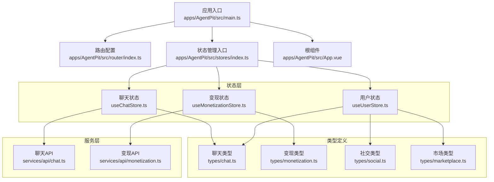
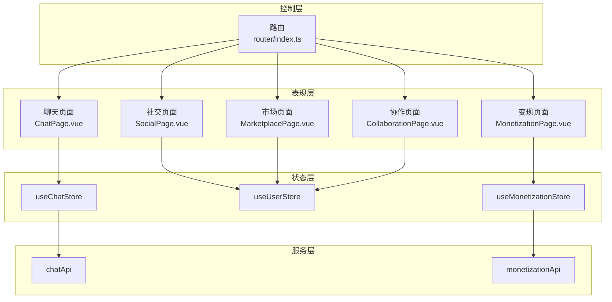
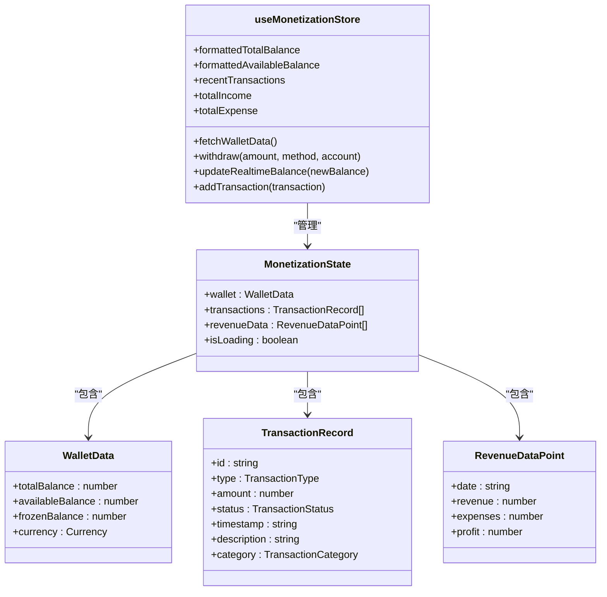
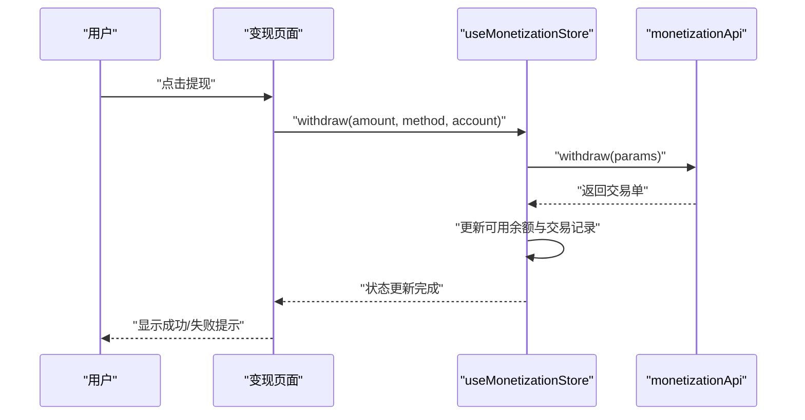
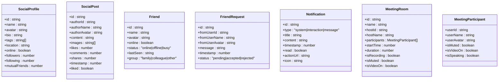
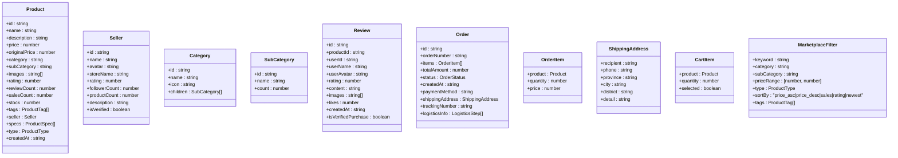
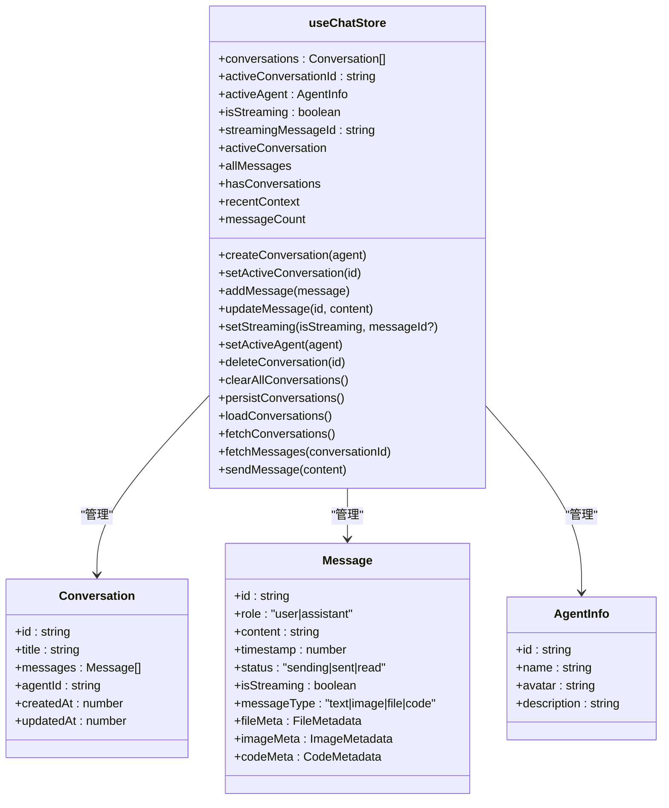
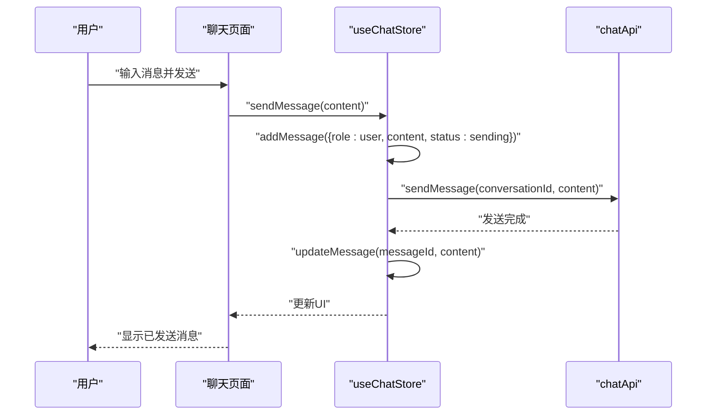
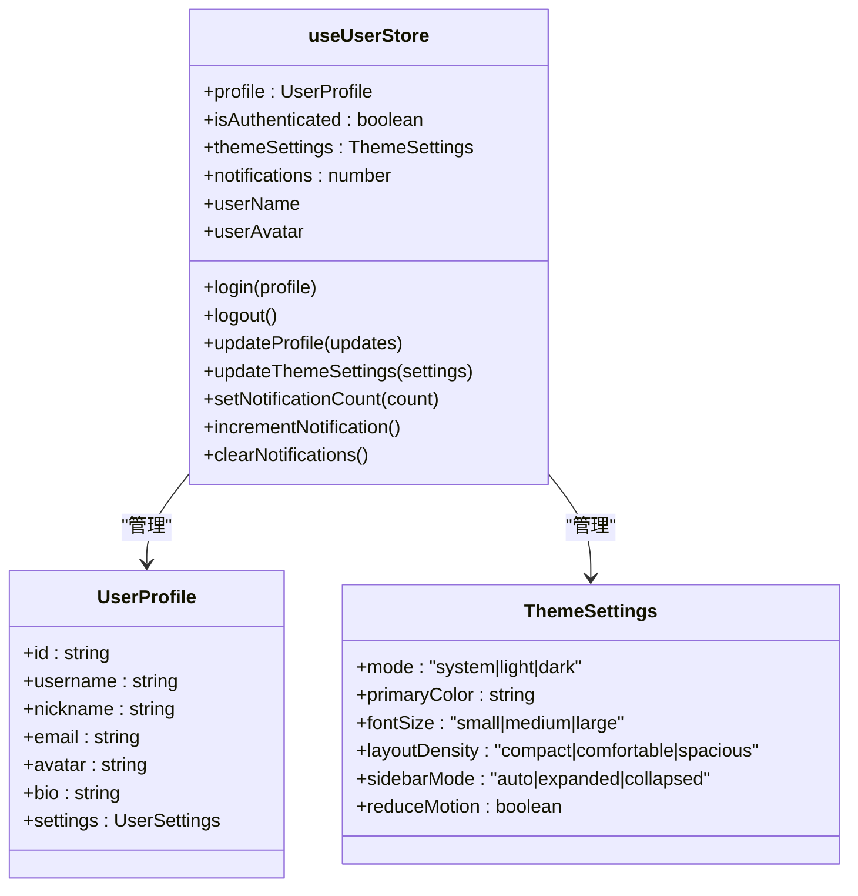
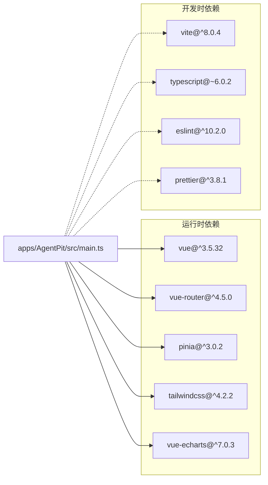

# 核心功能模块

<cite>
**本文引用的文件**
- [apps/AgentPit/src/main.ts](file://apps/AgentPit/src/main.ts)
- [apps/AgentPit/package.json](file://apps/AgentPit/package.json)
- [apps/AgentPit/src/router/index.ts](file://apps/AgentPit/src/router/index.ts)
- [apps/AgentPit/src/App.vue](file://apps/AgentPit/src/App.vue)
- [apps/AgentPit/src/stores/index.ts](file://apps/AgentPit/src/stores/index.ts)
- [apps/AgentPit/src/stores/useMonetizationStore.ts](file://apps/AgentPit/src/stores/useMonetizationStore.ts)
- [apps/AgentPit/src/stores/useUserStore.ts](file://apps/AgentPit/src/stores/useUserStore.ts)
- [apps/AgentPit/src/stores/useChatStore.ts](file://apps/AgentPit/src/stores/useChatStore.ts)
- [apps/AgentPit/src/types/monetization.ts](file://apps/AgentPit/src/types/monetization.ts)
- [apps/AgentPit/src/types/chat.ts](file://apps/AgentPit/src/types/chat.ts)
- [apps/AgentPit/src/types/social.ts](file://apps/AgentPit/src/types/social.ts)
- [apps/AgentPit/src/types/marketplace.ts](file://apps/AgentPit/src/types/marketplace.ts)
- [apps/AgentPit/src/services/api/monetization.ts](file://apps/AgentPit/src/services/api/monetization.ts)
- [apps/AgentPit/src/services/api/chat.ts](file://apps/AgentPit/src/services/api/chat.ts)
</cite>

## 目录
1. [引言](#引言)
2. [项目结构](#项目结构)
3. [核心组件](#核心组件)
4. [架构总览](#架构总览)
5. [详细组件分析](#详细组件分析)
6. [依赖分析](#依赖分析)
7. [性能考虑](#性能考虑)
8. [故障排查指南](#故障排查指南)
9. [结论](#结论)
10. [附录](#附录)

## 引言
本文件面向AgentPit智能体平台的核心功能模块，系统性梳理变现系统、社交连接系统、市场交易系统、协作系统等模块的设计理念与技术实现，解释模块间依赖关系、数据流转与交互机制，并说明模块化设计如何支撑智能体的创建、配置、管理与运营。文档同时提供组件结构、状态管理、API调用与用户交互流程的实现细节，并通过“代码片段路径”指引定位到具体实现位置，便于开发者快速上手与扩展。

## 项目结构
AgentPit采用Vue 3 + Pinia + Vue Router的前端架构，主应用入口在main.ts中初始化应用、路由与状态管理；页面视图通过路由懒加载按需加载；核心业务状态集中在stores目录下的多个store中；类型定义位于types目录；服务层API封装在services/api目录；社交、市场、聊天等业务模块分别对应独立的组件与页面。

图表来源
- [apps/AgentPit/src/main.ts:1-13](file://apps/AgentPit/src/main.ts#L1-L13)
- [apps/AgentPit/src/router/index.ts:1-73](file://apps/AgentPit/src/router/index.ts#L1-L73)
- [apps/AgentPit/src/stores/index.ts:1-15](file://apps/AgentPit/src/stores/index.ts#L1-L15)
- [apps/AgentPit/src/App.vue:1-8](file://apps/AgentPit/src/App.vue#L1-L8)
- [apps/AgentPit/src/stores/useUserStore.ts:1-72](file://apps/AgentPit/src/stores/useUserStore.ts#L1-L72)
- [apps/AgentPit/src/stores/useChatStore.ts:1-218](file://apps/AgentPit/src/stores/useChatStore.ts#L1-L218)
- [apps/AgentPit/src/stores/useMonetizationStore.ts:1-153](file://apps/AgentPit/src/stores/useMonetizationStore.ts#L1-L153)
- [apps/AgentPit/src/services/api/chat.ts:1-18](file://apps/AgentPit/src/services/api/chat.ts#L1-L18)
- [apps/AgentPit/src/services/api/monetization.ts:1-59](file://apps/AgentPit/src/services/api/monetization.ts#L1-L59)
- [apps/AgentPit/src/types/chat.ts:1-151](file://apps/AgentPit/src/types/chat.ts#L1-L151)
- [apps/AgentPit/src/types/monetization.ts:1-135](file://apps/AgentPit/src/types/monetization.ts#L1-L135)
- [apps/AgentPit/src/types/social.ts:1-80](file://apps/AgentPit/src/types/social.ts#L1-L80)
- [apps/AgentPit/src/types/marketplace.ts:1-239](file://apps/AgentPit/src/types/marketplace.ts#L1-L239)

章节来源
- [apps/AgentPit/src/main.ts:1-13](file://apps/AgentPit/src/main.ts#L1-L13)
- [apps/AgentPit/package.json:1-74](file://apps/AgentPit/package.json#L1-L74)
- [apps/AgentPit/src/router/index.ts:1-73](file://apps/AgentPit/src/router/index.ts#L1-L73)
- [apps/AgentPit/src/App.vue:1-8](file://apps/AgentPit/src/App.vue#L1-L8)

## 核心组件
- 应用入口与初始化：创建Vue实例、注册Pinia与路由，挂载根组件。
- 路由系统：定义首页、变现、Sphinx、聊天、社交、市场、协作、记忆、定制、生活、设置等页面路由，支持动态导入与产品详情页。
- 状态管理：统一通过Pinia创建store，持久化插件启用，导出useAppStore、useChatStore、useMonetizationStore、useUserStore等。
- 类型系统：为聊天、变现、社交、市场等模块提供强类型定义，确保跨模块数据一致性与可维护性。
- 服务层API：封装聊天与变现的API调用，当前使用mock数据，便于开发与测试。

章节来源
- [apps/AgentPit/src/main.ts:1-13](file://apps/AgentPit/src/main.ts#L1-L13)
- [apps/AgentPit/src/router/index.ts:1-73](file://apps/AgentPit/src/router/index.ts#L1-L73)
- [apps/AgentPit/src/stores/index.ts:1-15](file://apps/AgentPit/src/stores/index.ts#L1-L15)
- [apps/AgentPit/src/types/chat.ts:1-151](file://apps/AgentPit/src/types/chat.ts#L1-L151)
- [apps/AgentPit/src/types/monetization.ts:1-135](file://apps/AgentPit/src/types/monetization.ts#L1-L135)

## 架构总览
AgentPit采用分层架构：
- 表现层：Vue组件与页面视图，负责用户交互与渲染。
- 控制层：路由与页面控制器，协调导航与生命周期。
- 状态层：Pinia Store，集中管理聊天、用户、变现等状态，支持持久化。
- 服务层：API封装，隔离网络请求与数据模拟。
- 类型层：统一的数据契约，保障跨模块协作的类型安全。

图表来源
- [apps/AgentPit/src/router/index.ts:1-73](file://apps/AgentPit/src/router/index.ts#L1-L73)
- [apps/AgentPit/src/stores/useChatStore.ts:1-218](file://apps/AgentPit/src/stores/useChatStore.ts#L1-L218)
- [apps/AgentPit/src/stores/useUserStore.ts:1-72](file://apps/AgentPit/src/stores/useUserStore.ts#L1-L72)
- [apps/AgentPit/src/stores/useMonetizationStore.ts:1-153](file://apps/AgentPit/src/stores/useMonetizationStore.ts#L1-L153)
- [apps/AgentPit/src/services/api/chat.ts:1-18](file://apps/AgentPit/src/services/api/chat.ts#L1-L18)
- [apps/AgentPit/src/services/api/monetization.ts:1-59](file://apps/AgentPit/src/services/api/monetization.ts#L1-L59)

## 详细组件分析

### 变现系统（Monetization）
- 设计理念：围绕钱包、交易、收益三大核心维度构建，支持余额查询、交易明细、收益可视化与提现流程。
- 数据模型：钱包数据、交易记录、收益数据点、货币与交易分类枚举。
- 状态管理：useMonetizationStore负责钱包余额、交易列表、收益曲线与加载状态；提供格式化余额getter与收入/支出统计。
- API集成：monetizationApi封装钱包、交易、收益与提现接口，当前使用mock数据。
- 用户交互：页面通过store触发异步加载与提现操作，实时更新可用余额与交易记录。

图表来源
- [apps/AgentPit/src/stores/useMonetizationStore.ts:13-153](file://apps/AgentPit/src/stores/useMonetizationStore.ts#L13-L153)
- [apps/AgentPit/src/types/monetization.ts:15-55](file://apps/AgentPit/src/types/monetization.ts#L15-L55)
- [apps/AgentPit/src/types/monetization.ts:27-37](file://apps/AgentPit/src/types/monetization.ts#L27-L37)

图表来源
- [apps/AgentPit/src/stores/useMonetizationStore.ts:114-142](file://apps/AgentPit/src/stores/useMonetizationStore.ts#L114-L142)
- [apps/AgentPit/src/services/api/monetization.ts:35-58](file://apps/AgentPit/src/services/api/monetization.ts#L35-L58)

章节来源
- [apps/AgentPit/src/stores/useMonetizationStore.ts:1-153](file://apps/AgentPit/src/stores/useMonetizationStore.ts#L1-L153)
- [apps/AgentPit/src/types/monetization.ts:1-135](file://apps/AgentPit/src/types/monetization.ts#L1-L135)
- [apps/AgentPit/src/services/api/monetization.ts:1-59](file://apps/AgentPit/src/services/api/monetization.ts#L1-L59)

### 社交连接系统（Social）
- 设计理念：围绕个人资料、社交动态、好友关系、通知与会议房间等能力，构建社交互动与协作基础。
- 数据模型：社交档案、帖子、好友、好友请求、通知、会议室与参与者等。
- 状态管理：用户store中包含主题设置与通知计数，社交store可承载好友列表、动态流等状态（当前仓库未提供独立store，建议后续补充）。
- 用户交互：页面通过用户store更新主题与通知，社交页面负责展示与交互。

图表来源
- [apps/AgentPit/src/types/social.ts:1-80](file://apps/AgentPit/src/types/social.ts#L1-L80)

章节来源
- [apps/AgentPit/src/types/social.ts:1-80](file://apps/AgentPit/src/types/social.ts#L1-L80)

### 市场交易系统（Marketplace）
- 设计理念：围绕商品、订单、购物车、分类与评价体系，构建智能体生态内的商品与交易闭环。
- 数据模型：商品、卖家、分类、子分类、评价、订单、物流轨迹、购物车项与筛选条件。
- 用户交互：页面负责展示商品、加入购物车、下单与查看物流；store可承载购物车与订单状态（当前仓库未提供独立store，建议后续补充）。

图表来源
- [apps/AgentPit/src/types/marketplace.ts:12-239](file://apps/AgentPit/src/types/marketplace.ts#L12-L239)

章节来源
- [apps/AgentPit/src/types/marketplace.ts:1-239](file://apps/AgentPit/src/types/marketplace.ts#L1-L239)

### 协作系统（Collaboration）
- 设计理念：围绕多人协作、任务分配、进度跟踪与知识沉淀，支撑智能体团队工作流。
- 数据模型：协作任务、成员、进度、文档与评论等（当前仓库未提供独立store与类型定义，建议后续补充）。
- 用户交互：页面负责展示协作面板、任务列表与成员互动，store负责状态同步。

章节来源
- [apps/AgentPit/src/router/index.ts:41-44](file://apps/AgentPit/src/router/index.ts#L41-L44)

### 聊天系统（Chat）
- 设计理念：围绕多会话、消息流、智能体切换与上下文管理，提供自然流畅的对话体验。
- 数据模型：消息、会话、智能体信息、快捷指令、流式输出配置等。
- 状态管理：useChatStore管理会话列表、活动会话、活跃智能体、流式状态与本地持久化；提供最近上下文提取与消息计数等getter。
- API集成：chatApi封装会话、消息与发送接口，当前使用mock数据。

图表来源
- [apps/AgentPit/src/stores/useChatStore.ts:5-218](file://apps/AgentPit/src/stores/useChatStore.ts#L5-L218)
- [apps/AgentPit/src/types/chat.ts:38-88](file://apps/AgentPit/src/types/chat.ts#L38-L88)

图表来源
- [apps/AgentPit/src/stores/useChatStore.ts:199-215](file://apps/AgentPit/src/stores/useChatStore.ts#L199-L215)
- [apps/AgentPit/src/services/api/chat.ts:14-16](file://apps/AgentPit/src/services/api/chat.ts#L14-L16)

章节来源
- [apps/AgentPit/src/stores/useChatStore.ts:1-218](file://apps/AgentPit/src/stores/useChatStore.ts#L1-L218)
- [apps/AgentPit/src/types/chat.ts:1-151](file://apps/AgentPit/src/types/chat.ts#L1-L151)
- [apps/AgentPit/src/services/api/chat.ts:1-18](file://apps/AgentPit/src/services/api/chat.ts#L1-L18)

### 用户系统（User）
- 设计理念：围绕用户档案、认证状态、主题设置与通知中心，提供一致的个性化体验。
- 数据模型：用户档案、主题设置（模式、主色、字号、布局密度、侧边栏模式、动效偏好）。
- 状态管理：useUserStore管理登录态、档案更新、主题设置持久化与通知计数。
- 交互流程：登录/登出、主题切换、通知读取与清空。

图表来源
- [apps/AgentPit/src/stores/useUserStore.ts:4-72](file://apps/AgentPit/src/stores/useUserStore.ts#L4-L72)

章节来源
- [apps/AgentPit/src/stores/useUserStore.ts:1-72](file://apps/AgentPit/src/stores/useUserStore.ts#L1-L72)

## 依赖分析
- 组件耦合：聊天与用户store存在弱耦合（用户主题影响聊天界面），变现store与聊天store无直接耦合，保持高内聚低耦合。
- 外部依赖：Vue 3、Pinia、Vue Router、TailwindCSS、ECharts、Vitest等。
- 持久化策略：Pinia持久化插件用于用户store的主题设置；聊天store使用localStorage进行会话持久化。
- API依赖：聊天与变现API封装清晰，便于替换为真实后端。

图表来源
- [apps/AgentPit/package.json:20-62](file://apps/AgentPit/package.json#L20-L62)

章节来源
- [apps/AgentPit/package.json:1-74](file://apps/AgentPit/package.json#L1-L74)

## 性能考虑
- 路由懒加载：页面组件通过动态导入减少首屏体积，提升启动速度。
- 状态持久化：用户主题与聊天会话持久化，避免重复加载与配置丢失。
- 渲染优化：聊天store对消息列表与上下文提取进行合理缓存，避免频繁重算。
- 图表性能：ECharts按需引入，建议在变现页面按需渲染图表组件。

## 故障排查指南
- 路由无法跳转：检查路由配置与页面组件是否存在，确认动态导入路径正确。
- 状态不更新：检查store actions是否正确调用与异步流程是否catch异常；确认Pinia持久化插件已启用。
- API调用失败：检查API封装与mock数据是否匹配类型定义；关注控制台错误日志。
- 主题设置未生效：确认useUserStore的持久化配置与localStorage可用。

章节来源
- [apps/AgentPit/src/router/index.ts:1-73](file://apps/AgentPit/src/router/index.ts#L1-L73)
- [apps/AgentPit/src/stores/index.ts:1-15](file://apps/AgentPit/src/stores/index.ts#L1-L15)
- [apps/AgentPit/src/stores/useChatStore.ts:165-174](file://apps/AgentPit/src/stores/useChatStore.ts#L165-L174)
- [apps/AgentPit/src/services/api/chat.ts:1-18](file://apps/AgentPit/src/services/api/chat.ts#L1-L18)

## 结论
AgentPit通过模块化的状态管理与清晰的类型定义，为智能体平台提供了可扩展的变现、社交、市场与协作能力。聊天系统作为交互中枢，与用户与变现模块形成良好协同。建议后续补充协作与市场store及类型定义，完善模块间数据契约，进一步提升系统的可维护性与可测试性。

## 附录
- 初始化与配置示例（代码片段路径）
  - 应用入口初始化：[apps/AgentPit/src/main.ts:1-13](file://apps/AgentPit/src/main.ts#L1-L13)
  - 路由配置：[apps/AgentPit/src/router/index.ts:1-73](file://apps/AgentPit/src/router/index.ts#L1-L73)
  - Pinia与持久化：[apps/AgentPit/src/stores/index.ts:1-15](file://apps/AgentPit/src/stores/index.ts#L1-L15)
  - 用户store使用：[apps/AgentPit/src/stores/useUserStore.ts:32-41](file://apps/AgentPit/src/stores/useUserStore.ts#L32-L41)
  - 聊天store使用：[apps/AgentPit/src/stores/useChatStore.ts:66-86](file://apps/AgentPit/src/stores/useChatStore.ts#L66-L86)
  - 变现store使用：[apps/AgentPit/src/stores/useMonetizationStore.ts:66-112](file://apps/AgentPit/src/stores/useMonetizationStore.ts#L66-L112)
  - 类型定义参考：
    - 聊天类型：[apps/AgentPit/src/types/chat.ts:38-88](file://apps/AgentPit/src/types/chat.ts#L38-L88)
    - 变现类型：[apps/AgentPit/src/types/monetization.ts:15-55](file://apps/AgentPit/src/types/monetization.ts#L15-L55)
    - 社交类型：[apps/AgentPit/src/types/social.ts:1-80](file://apps/AgentPit/src/types/social.ts#L1-L80)
    - 市场类型：[apps/AgentPit/src/types/marketplace.ts:12-78](file://apps/AgentPit/src/types/marketplace.ts#L12-L78)
  - API封装参考：
    - 聊天API：[apps/AgentPit/src/services/api/chat.ts:1-18](file://apps/AgentPit/src/services/api/chat.ts#L1-L18)
    - 变现API：[apps/AgentPit/src/services/api/monetization.ts:1-59](file://apps/AgentPit/src/services/api/monetization.ts#L1-L59)