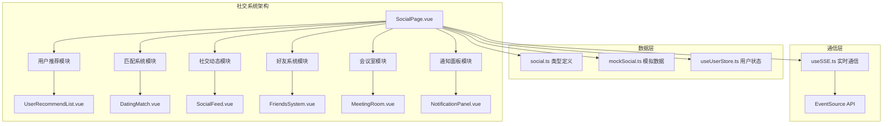
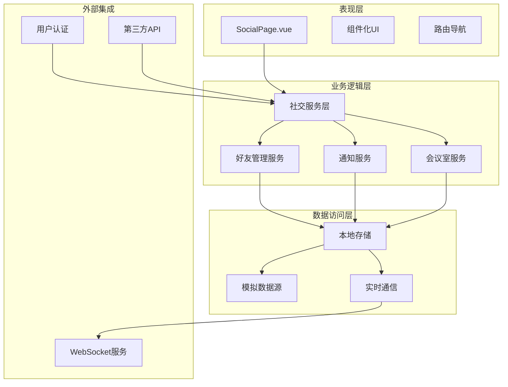
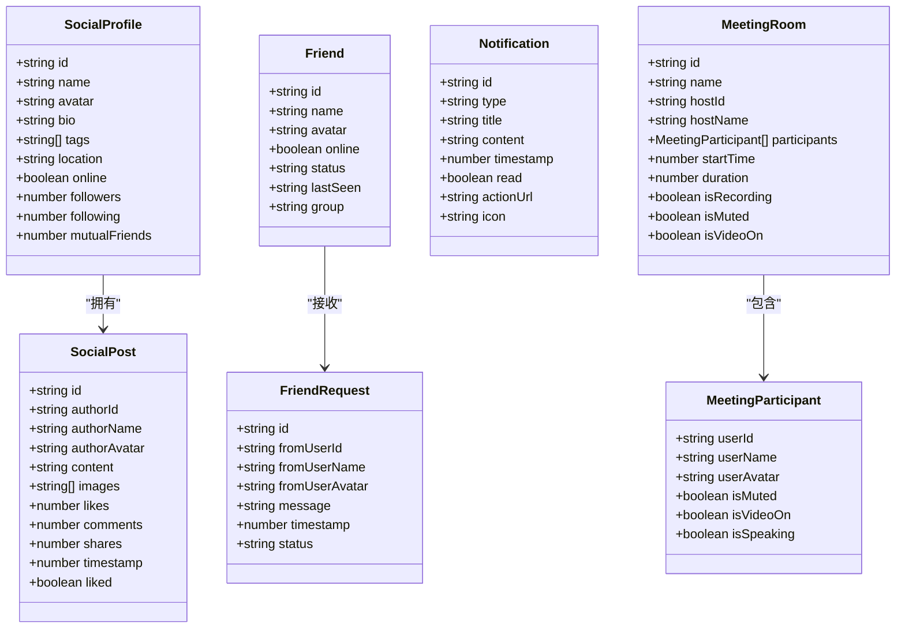
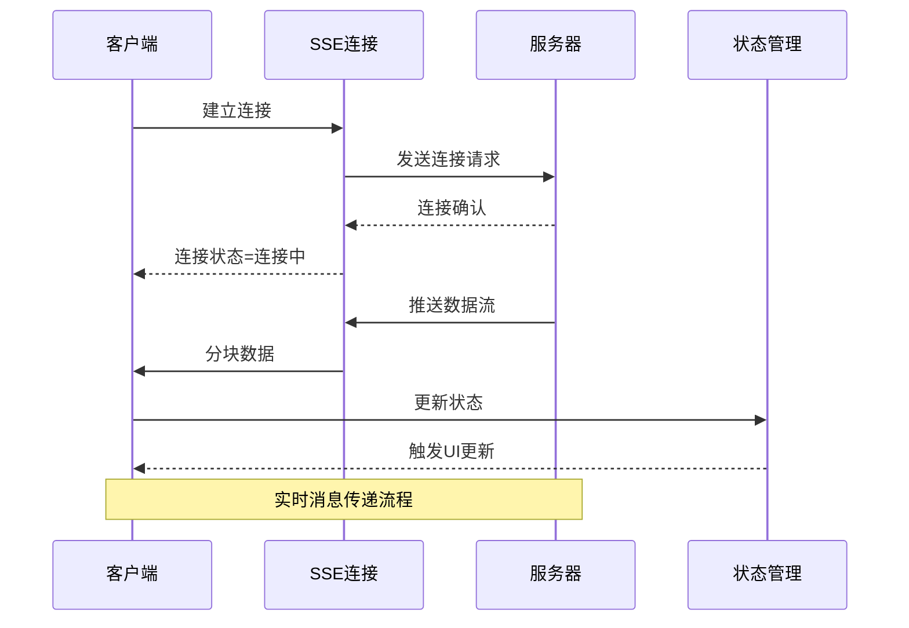
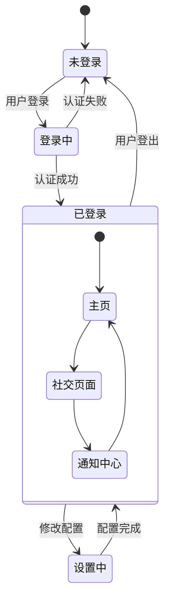
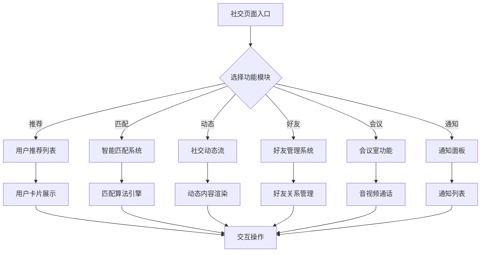
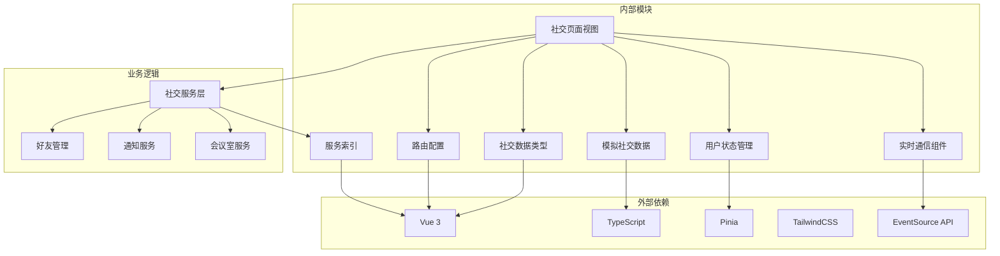

# 社交连接系统

<cite>
**本文档引用的文件**
- [social.ts](file://apps/AgentPit/src/types/social.ts)
- [mockSocial.ts](file://apps/AgentPit/src/data/mockSocial.ts)
- [SocialPage.vue](file://apps/AgentPit/src/views/SocialPage.vue)
- [useSSE.ts](file://apps/AgentPit/src/composables/useSSE.ts)
- [useUserStore.ts](file://apps/AgentPit/src/stores/useUserStore.ts)
- [index.ts](file://apps/AgentPit/src/router/index.ts)
- [index.ts](file://apps/AgentPit/src/services/index.ts)
</cite>

## 目录
1. [引言](#引言)
2. [项目结构](#项目结构)
3. [核心组件](#核心组件)
4. [架构概览](#架构概览)
5. [详细组件分析](#详细组件分析)
6. [依赖分析](#依赖分析)
7. [性能考虑](#性能考虑)
8. [故障排除指南](#故障排除指南)
9. [结论](#结论)

## 引言

AgentPit智能体平台的社交连接系统是一个综合性的社交功能模块，旨在为智能体用户提供丰富的社交互动体验。该系统基于Vue 3 + TypeScript技术栈构建，采用Pinia状态管理和EventSource实时通信技术，实现了用户档案管理、好友系统、通知机制、消息传递、群组协作和活动邀请等核心功能。

系统的核心设计理念是通过模块化架构实现功能解耦，通过类型安全确保数据完整性，并通过实时通信技术提供流畅的用户体验。社交系统不仅支持传统的社交网络功能，还特别针对智能体场景进行了优化，提供了专门的匹配算法和协作工具。

## 项目结构

社交连接系统在AgentPit项目中的组织结构如下：

**图表来源**
- [SocialPage.vue:1-138](file://apps/AgentPit/src/views/SocialPage.vue#L1-L138)
- [social.ts:1-80](file://apps/AgentPit/src/types/social.ts#L1-L80)
- [mockSocial.ts:1-375](file://apps/AgentPit/src/data/mockSocial.ts#L1-L375)

**章节来源**
- [SocialPage.vue:1-138](file://apps/AgentPit/src/views/SocialPage.vue#L1-L138)
- [social.ts:1-80](file://apps/AgentPit/src/types/social.ts#L1-L80)
- [mockSocial.ts:1-375](file://apps/AgentPit/src/data/mockSocial.ts#L1-L375)

## 核心组件

社交连接系统由以下核心组件构成：

### 用户档案管理
系统提供完整的用户档案管理功能，包括基本信息展示、个人资料编辑、在线状态显示等。用户档案数据结构支持头像、简介、标签、位置等字段，为社交互动提供丰富的上下文信息。

### 好友系统
好友系统包含好友列表管理、好友请求处理、分组管理等功能。系统支持多种好友分组（家庭、同事、其他），并提供在线状态跟踪和最后在线时间显示。

### 通知机制
通知系统采用多类型分类（系统通知、交互通知、消息通知），支持实时推送和历史记录管理。用户可以查看通知详情、标记已读状态，并通过操作链接快速响应。

### 社交动态
社交动态模块提供内容发布、点赞、评论、分享等功能。支持文本内容和图片展示，具备完整的社交互动生命周期管理。

### 会议室系统
专为智能体协作设计的会议室功能，支持多人音视频通话、屏幕共享、录制等功能。系统提供参与者状态管理和会议控制选项。

**章节来源**
- [social.ts:14-80](file://apps/AgentPit/src/types/social.ts#L14-L80)
- [mockSocial.ts:109-375](file://apps/AgentPit/src/data/mockSocial.ts#L109-L375)

## 架构概览

社交连接系统采用分层架构设计，确保各组件间的职责清晰和低耦合：

**图表来源**
- [SocialPage.vue:1-138](file://apps/AgentPit/src/views/SocialPage.vue#L1-L138)
- [useSSE.ts:1-129](file://apps/AgentPit/src/composables/useSSE.ts#L1-L129)
- [useUserStore.ts:1-72](file://apps/AgentPit/src/stores/useUserStore.ts#L1-L72)

系统架构的关键特点包括：

1. **模块化设计**：每个社交功能都是独立的模块，可以单独开发、测试和部署
2. **类型安全**：使用TypeScript确保数据结构的完整性和运行时安全性
3. **实时通信**：通过EventSource实现服务器推送，提供即时的社交体验
4. **状态管理**：采用Pinia进行全局状态管理，确保数据一致性
5. **可扩展性**：清晰的接口设计便于未来功能扩展

## 详细组件分析

### 社交数据模型

社交系统的核心数据模型定义了所有社交相关实体的结构：

**图表来源**
- [social.ts:1-80](file://apps/AgentPit/src/types/social.ts#L1-L80)

**章节来源**
- [social.ts:1-80](file://apps/AgentPit/src/types/social.ts#L1-L80)

### 实时通信组件

系统采用EventSource实现高效的实时通信，支持服务器推送和客户端流式处理：

**图表来源**
- [useSSE.ts:18-61](file://apps/AgentPit/src/composables/useSSE.ts#L18-L61)

实时通信组件的关键特性包括：

1. **连接状态管理**：支持连接中、已连接、断开、错误四种状态
2. **流式数据处理**：支持分块传输和增量更新
3. **错误处理**：完善的异常捕获和恢复机制
4. **资源清理**：自动清理事件监听器和定时器

**章节来源**
- [useSSE.ts:1-129](file://apps/AgentPit/src/composables/useSSE.ts#L1-L129)

### 用户状态管理

系统使用Pinia进行全局状态管理，确保用户信息的一致性和持久化：

**图表来源**
- [useUserStore.ts:31-63](file://apps/AgentPit/src/stores/useUserStore.ts#L31-L63)

用户状态管理的核心功能包括：

1. **用户认证**：登录状态跟踪和用户信息管理
2. **主题设置**：支持深色/浅色模式切换
3. **通知管理**：未读通知计数和状态同步
4. **持久化存储**：关键配置的本地存储

**章节来源**
- [useUserStore.ts:1-72](file://apps/AgentPit/src/stores/useUserStore.ts#L1-L72)

### 路由导航系统

社交页面采用动态路由设计，支持灵活的功能模块切换：

**图表来源**
- [SocialPage.vue:13-20](file://apps/AgentPit/src/views/SocialPage.vue#L13-L20)

路由系统的特点包括：

1. **模块化导航**：支持多个功能模块的平滑切换
2. **状态保持**：使用KeepAlive组件保持组件状态
3. **动画过渡**：提供流畅的页面切换效果
4. **响应式设计**：适配不同屏幕尺寸的显示需求

**章节来源**
- [SocialPage.vue:1-138](file://apps/AgentPit/src/views/SocialPage.vue#L1-L138)
- [index.ts:26-29](file://apps/AgentPit/src/router/index.ts#L26-L29)

## 依赖分析

社交连接系统的依赖关系体现了清晰的分层架构：

**图表来源**
- [index.ts:1-10](file://apps/AgentPit/src/services/index.ts#L1-L10)
- [useSSE.ts:1-129](file://apps/AgentPit/src/composables/useSSE.ts#L1-L129)

系统的主要依赖包括：

1. **前端框架**：Vue 3提供响应式数据绑定和组件化开发
2. **状态管理**：Pinia实现全局状态管理和持久化
3. **样式框架**：TailwindCSS提供实用的样式类和响应式设计
4. **通信协议**：EventSource实现服务器推送和实时通信
5. **类型系统**：TypeScript确保代码质量和开发体验

**章节来源**
- [index.ts:1-10](file://apps/AgentPit/src/services/index.ts#L1-L10)
- [useSSE.ts:1-129](file://apps/AgentPit/src/composables/useSSE.ts#L1-L129)

## 性能考虑

社交连接系统在设计时充分考虑了性能优化：

### 数据加载优化
- 使用虚拟滚动技术处理大量社交动态
- 实现数据懒加载和分页机制
- 采用缓存策略减少重复请求

### 实时通信优化
- EventSource连接池管理
- 消息队列和批量处理
- 自动重连机制和错误恢复

### 内存管理
- 组件生命周期管理
- 事件监听器自动清理
- 大数据对象的弱引用处理

### 渲染性能
- 组件按需加载和代码分割
- 图片懒加载和压缩
- CSS类名优化和样式缓存

## 故障排除指南

### 常见问题及解决方案

**实时通信连接失败**
- 检查EventSource API支持情况
- 验证服务器连接地址和权限
- 查看浏览器控制台错误信息

**状态管理异常**
- 确认Pinia存储配置正确
- 检查持久化存储权限
- 验证状态序列化和反序列化

**路由导航问题**
- 检查路由配置和组件导入
- 验证组件名称和路径
- 查看路由守卫逻辑

**章节来源**
- [useSSE.ts:33-38](file://apps/AgentPit/src/composables/useSSE.ts#L33-L38)
- [useUserStore.ts:66-71](file://apps/AgentPit/src/stores/useUserStore.ts#L66-L71)

## 结论

AgentPit智能体平台的社交连接系统通过精心设计的架构和实现，为智能体用户提供了全面而高效的社交体验。系统采用现代化的技术栈和最佳实践，确保了良好的可维护性、可扩展性和用户体验。

系统的核心优势包括：

1. **模块化设计**：清晰的功能分离和职责划分
2. **类型安全**：完整的TypeScript类型定义和验证
3. **实时通信**：高效的EventSource实现和流式处理
4. **状态管理**：可靠的Pinia状态管理和持久化
5. **用户体验**：流畅的界面交互和响应式设计

未来的发展方向包括增强智能匹配算法、扩展多媒体支持、优化移动端体验以及加强隐私保护机制。通过持续的迭代和改进，社交连接系统将成为AgentPit平台的重要组成部分，为智能体社区的繁荣发展提供有力支撑。