# Pinia Store架构设计

<cite>
**本文档引用的文件**
- [apps/AgentPit/src/stores/index.ts](file://apps/AgentPit/src/stores/index.ts)
- [apps/AgentPit/src/main.ts](file://apps/AgentPit/src/main.ts)
- [apps/AgentPit/src/stores/useAppStore.ts](file://apps/AgentPit/src/stores/useAppStore.ts)
- [apps/AgentPit/src/stores/useChatStore.ts](file://apps/AgentPit/src/stores/useChatStore.ts)
- [apps/AgentPit/src/stores/useUserStore.ts](file://apps/AgentPit/src/stores/useUserStore.ts)
- [apps/AgentPit/src/stores/useMonetizationStore.ts](file://apps/AgentPit/src/stores/useMonetizationStore.ts)
- [apps/AgentPit/src/stores/useCartStore.ts](file://apps/AgentPit/src/stores/useCartStore.ts)
- [apps/AgentPit/package.json](file://apps/AgentPit/package.json)
- [apps/AgentPit/src/__tests__/stores/useAppStore.spec.ts](file://apps/AgentPit/src/__tests__/stores/useAppStore.spec.ts)
</cite>

## 目录
1. [简介](#简介)
2. [项目结构](#项目结构)
3. [核心组件](#核心组件)
4. [架构概览](#架构概览)
5. [详细组件分析](#详细组件分析)
6. [依赖分析](#依赖分析)
7. [性能考虑](#性能考虑)
8. [故障排除指南](#故障排除指南)
9. [结论](#结论)
10. [附录](#附录)

## 简介

本文件为Pinia Store架构设计的详细技术文档，深入介绍了基于Vue 3的Pinia状态管理系统的完整实现。该架构涵盖了store的创建、注册和配置过程，详细说明了pinia-plugin-persistedstate插件的作用和配置方法，解释了状态持久化的实现原理，并提供了store的组织结构和模块化设计的最佳实践。

该系统采用模块化设计，包含四个核心store：应用状态管理、聊天系统、用户信息管理和变现系统，每个store都具有明确的职责分工和独立的状态管理能力。

## 项目结构

AgentPit项目中的Pinia架构采用分层模块化组织方式：

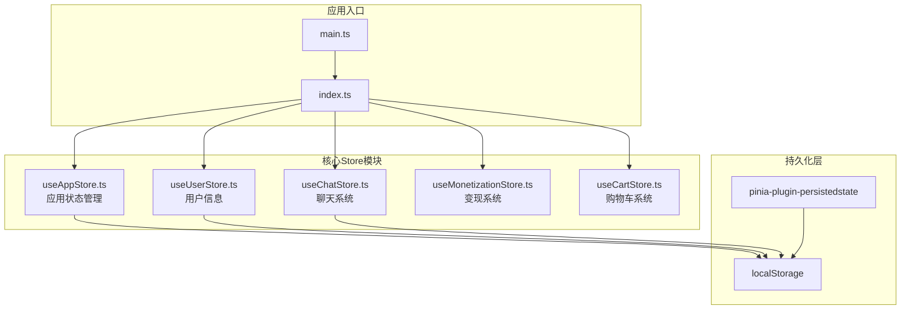

**图表来源**
- [apps/AgentPit/src/main.ts:1-13](file://apps/AgentPit/src/main.ts#L1-L13)
- [apps/AgentPit/src/stores/index.ts:1-15](file://apps/AgentPit/src/stores/index.ts#L1-L15)

**章节来源**
- [apps/AgentPit/src/stores/index.ts:1-15](file://apps/AgentPit/src/stores/index.ts#L1-L15)
- [apps/AgentPit/src/main.ts:1-13](file://apps/AgentPit/src/main.ts#L1-L13)

## 核心组件

### Pinia实例配置

Pinia实例在应用启动时创建并配置，主要负责：

- **插件注册**：集成pinia-plugin-persistedstate实现状态持久化
- **全局访问**：为所有store提供统一的Pinia实例
- **模块导出**：集中导出所有store便于全局使用

### Store模块化设计

系统包含五个核心store，每个store都有特定的功能领域：

1. **应用状态管理**：管理UI状态、主题切换、导航等全局状态
2. **聊天系统**：处理对话、消息流、智能体交互
3. **用户信息管理**：用户认证、个人资料、主题设置
4. **变现系统**：钱包管理、交易记录、收入统计
5. **购物车系统**：商品管理、价格计算、本地持久化

**章节来源**
- [apps/AgentPit/src/stores/index.ts:1-15](file://apps/AgentPit/src/stores/index.ts#L1-L15)
- [apps/AgentPit/src/stores/useAppStore.ts:1-89](file://apps/AgentPit/src/stores/useAppStore.ts#L1-L89)
- [apps/AgentPit/src/stores/useChatStore.ts:1-218](file://apps/AgentPit/src/stores/useChatStore.ts#L1-L218)
- [apps/AgentPit/src/stores/useUserStore.ts:1-72](file://apps/AgentPit/src/stores/useUserStore.ts#L1-L72)
- [apps/AgentPit/src/stores/useMonetizationStore.ts:1-153](file://apps/AgentPit/src/stores/useMonetizationStore.ts#L1-L153)
- [apps/AgentPit/src/stores/useCartStore.ts:1-138](file://apps/AgentPit/src/stores/useCartStore.ts#L1-L138)

## 架构概览

### 系统架构图

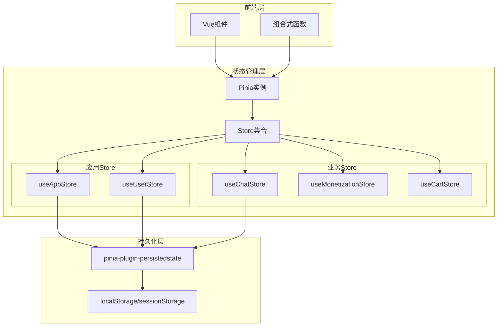

**图表来源**
- [apps/AgentPit/src/stores/index.ts:1-15](file://apps/AgentPit/src/stores/index.ts#L1-L15)
- [apps/AgentPit/src/stores/useAppStore.ts:83-88](file://apps/AgentPit/src/stores/useAppStore.ts#L83-L88)
- [apps/AgentPit/src/stores/useUserStore.ts:66-71](file://apps/AgentPit/src/stores/useUserStore.ts#L66-L71)
- [apps/AgentPit/src/stores/useChatStore.ts:161-174](file://apps/AgentPit/src/stores/useChatStore.ts#L161-L174)

### 数据流架构

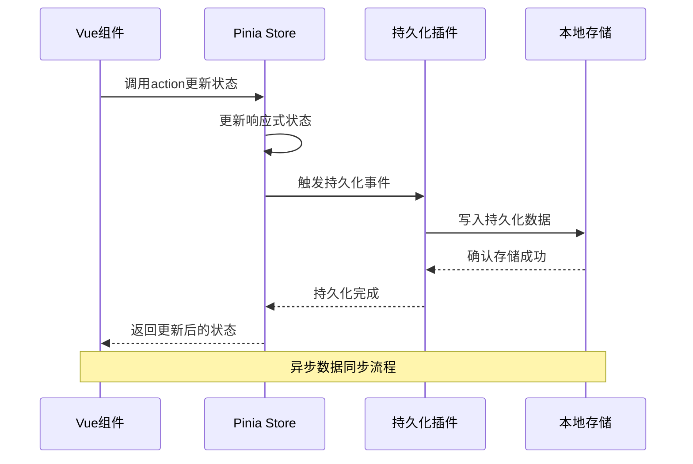

**图表来源**
- [apps/AgentPit/src/stores/useAppStore.ts:54-58](file://apps/AgentPit/src/stores/useAppStore.ts#L54-L58)
- [apps/AgentPit/src/stores/useUserStore.ts:40-41](file://apps/AgentPit/src/stores/useUserStore.ts#L40-L41)
- [apps/AgentPit/src/stores/useChatStore.ts:161-163](file://apps/AgentPit/src/stores/useChatStore.ts#L161-L163)

## 详细组件分析

### 应用状态管理Store

应用状态管理store负责管理全局UI状态和用户偏好设置：

#### 核心状态结构

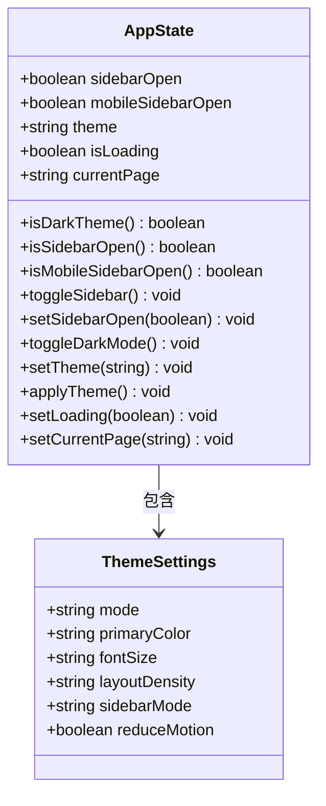

**图表来源**
- [apps/AgentPit/src/stores/useAppStore.ts:3-9](file://apps/AgentPit/src/stores/useAppStore.ts#L3-L9)
- [apps/AgentPit/src/stores/useAppStore.ts:20-81](file://apps/AgentPit/src/stores/useAppStore.ts#L20-L81)

#### 持久化配置

应用store采用选择性持久化策略，仅持久化必要的UI状态：

| 持久化键 | 存储位置 | 持久化字段 | 用途说明 |
|---------|---------|-----------|----------|
| `agentpit-app-store` | localStorage | `sidebarOpen`, `theme` | 用户界面偏好设置 |
| `theme` | localStorage | `theme` | 主题设置值 |

**章节来源**
- [apps/AgentPit/src/stores/useAppStore.ts:83-88](file://apps/AgentPit/src/stores/useAppStore.ts#L83-L88)

### 聊天系统Store

聊天系统store专门处理对话管理和消息流控制：

#### 状态管理架构

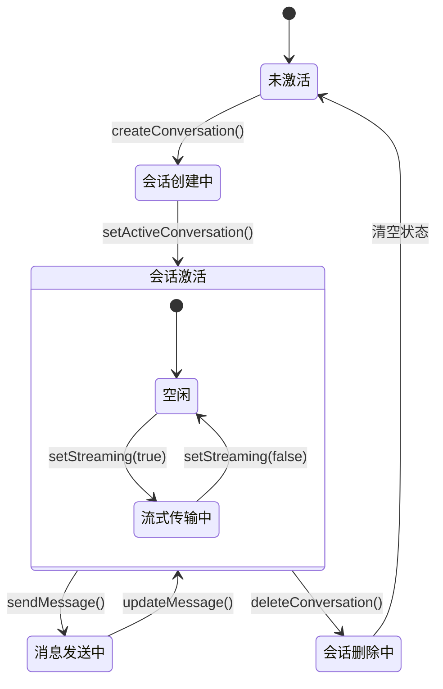

**图表来源**
- [apps/AgentPit/src/stores/useChatStore.ts:66-86](file://apps/AgentPit/src/stores/useChatStore.ts#L66-L86)
- [apps/AgentPit/src/stores/useChatStore.ts:134-137](file://apps/AgentPit/src/stores/useChatStore.ts#L134-L137)

#### 消息处理流程

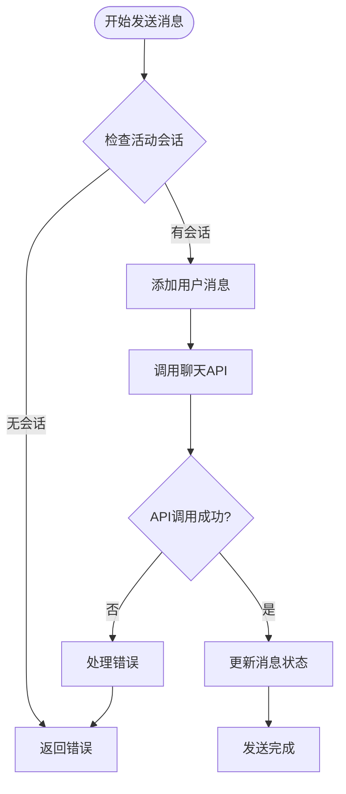

**图表来源**
- [apps/AgentPit/src/stores/useChatStore.ts:199-215](file://apps/AgentPit/src/stores/useChatStore.ts#L199-L215)

**章节来源**
- [apps/AgentPit/src/stores/useChatStore.ts:1-218](file://apps/AgentPit/src/stores/useChatStore.ts#L1-L218)

### 用户信息管理Store

用户信息store负责用户认证状态和个人资料管理：

#### 状态结构设计

| 状态字段 | 类型 | 默认值 | 说明 |
|---------|------|--------|------|
| `profile` | UserProfile \| null | null | 用户个人资料 |
| `isAuthenticated` | boolean | false | 认证状态 |
| `themeSettings` | ThemeSettings | 默认主题设置 | 用户主题偏好 |
| `notifications` | number | 0 | 通知计数器 |

#### 主题设置配置

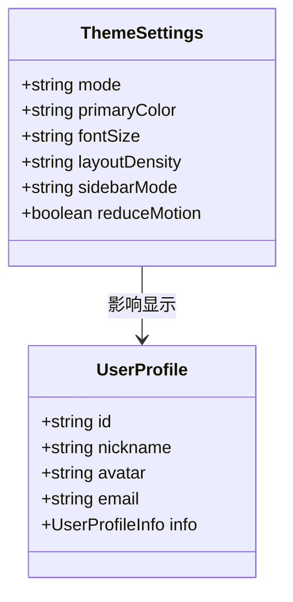

**图表来源**
- [apps/AgentPit/src/stores/useUserStore.ts:4-9](file://apps/AgentPit/src/stores/useUserStore.ts#L4-L9)
- [apps/AgentPit/src/stores/useUserStore.ts:15-22](file://apps/AgentPit/src/stores/useUserStore.ts#L15-L22)

**章节来源**
- [apps/AgentPit/src/stores/useUserStore.ts:1-72](file://apps/AgentPit/src/stores/useUserStore.ts#L1-L72)

### 变现系统Store

变现系统store处理钱包管理和财务数据：

#### 财务数据模型

| 数据字段 | 类型 | 说明 |
|---------|------|------|
| `wallet` | WalletData | 钱包余额信息 |
| `transactions` | TransactionRecord[] | 交易历史记录 |
| `revenueData` | RevenueDataPoint[] | 收益统计数据 |
| `isLoading` | boolean | 加载状态 |

#### 业务流程

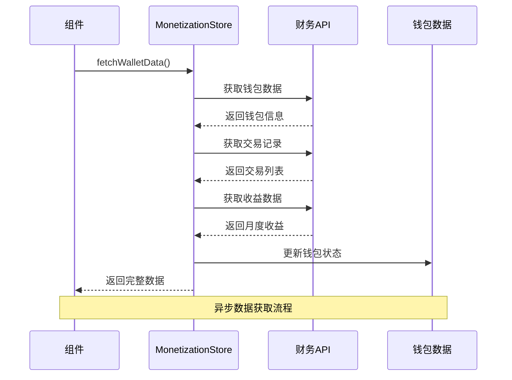

**图表来源**
- [apps/AgentPit/src/stores/useMonetizationStore.ts:66-112](file://apps/AgentPit/src/stores/useMonetizationStore.ts#L66-L112)

**章节来源**
- [apps/AgentPit/src/stores/useMonetizationStore.ts:1-153](file://apps/AgentPit/src/stores/useMonetizationStore.ts#L1-L153)

### 购物车系统Store

购物车store采用Composition API模式，提供本地持久化功能：

#### 本地持久化策略

购物车store采用手动持久化策略，避免复杂对象的序列化问题：

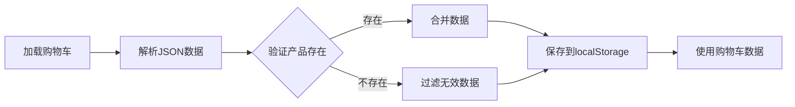

**图表来源**
- [apps/AgentPit/src/stores/useCartStore.ts:11-36](file://apps/AgentPit/src/stores/useCartStore.ts#L11-L36)

**章节来源**
- [apps/AgentPit/src/stores/useCartStore.ts:1-138](file://apps/AgentPit/src/stores/useCartStore.ts#L1-L138)

## 依赖分析

### 外部依赖关系

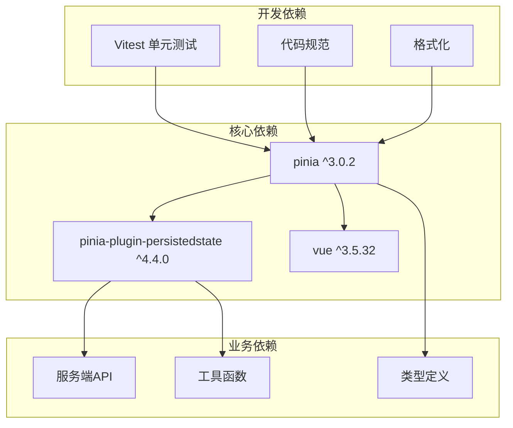

**图表来源**
- [apps/AgentPit/package.json:20-40](file://apps/AgentPit/package.json#L20-L40)

### 内部模块依赖

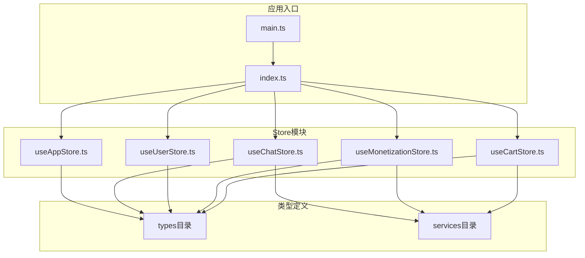

**图表来源**
- [apps/AgentPit/src/stores/index.ts:10-14](file://apps/AgentPit/src/stores/index.ts#L10-L14)

**章节来源**
- [apps/AgentPit/package.json:1-74](file://apps/AgentPit/package.json#L1-L74)

## 性能考虑

### 状态更新优化

1. **选择性持久化**：仅持久化必要状态，减少存储开销
2. **批量更新**：避免频繁的状态变更触发持久化
3. **懒加载**：按需加载大型数据集

### 内存管理

1. **状态清理**：及时清理不再使用的状态数据
2. **引用优化**：避免不必要的对象复制
3. **垃圾回收**：合理管理大对象的生命周期

### 并发处理

1. **异步操作**：使用Promise处理异步状态更新
2. **错误处理**：完善的异常捕获和恢复机制
3. **状态锁定**：防止并发状态冲突

## 故障排除指南

### 常见问题及解决方案

#### 状态不同步问题

**症状**：组件状态与预期不符
**解决方案**：
1. 检查store实例是否正确注入
2. 验证状态更新是否在正确的action中进行
3. 确认持久化配置是否正确

#### 持久化失败问题

**症状**：刷新页面后状态丢失
**解决方案**：
1. 检查localStorage可用性
2. 验证持久化键名是否正确
3. 确认pick配置是否包含必要字段

#### 性能问题

**症状**：应用运行缓慢
**解决方案**：
1. 检查是否有过多的状态订阅
2. 优化getter的计算复杂度
3. 考虑使用缓存策略

**章节来源**
- [apps/AgentPit/src/__tests__/stores/useAppStore.spec.ts:1-105](file://apps/AgentPit/src/__tests__/stores/useAppStore.spec.ts#L1-L105)

## 结论

该Pinia Store架构设计展现了现代Vue 3应用状态管理的最佳实践。通过模块化设计、选择性持久化和完善的错误处理机制，系统实现了高可维护性和良好的用户体验。

关键优势包括：
- **模块化架构**：清晰的职责分离和独立的状态管理
- **持久化策略**：灵活的选择性持久化方案
- **类型安全**：完整的TypeScript类型定义
- **测试覆盖**：全面的单元测试保障代码质量
- **性能优化**：合理的状态更新和内存管理策略

该架构为后续功能扩展提供了良好的基础，支持渐进式增强和功能模块的独立开发。

## 附录

### 配置最佳实践

#### Store创建规范
1. 使用`defineStore`创建store实例
2. 明确state、getters、actions的职责范围
3. 实现必要的类型定义
4. 配置持久化选项（如需要）

#### 持久化配置指南
1. 选择合适的存储位置（localStorage/sessionStorage）
2. 确定需要持久化的状态字段
3. 设置合理的存储键名
4. 处理数据迁移和版本兼容

#### 测试策略
1. 为每个store编写单元测试
2. 测试状态初始化和更新逻辑
3. 验证getter的计算正确性
4. 检查action的异步行为