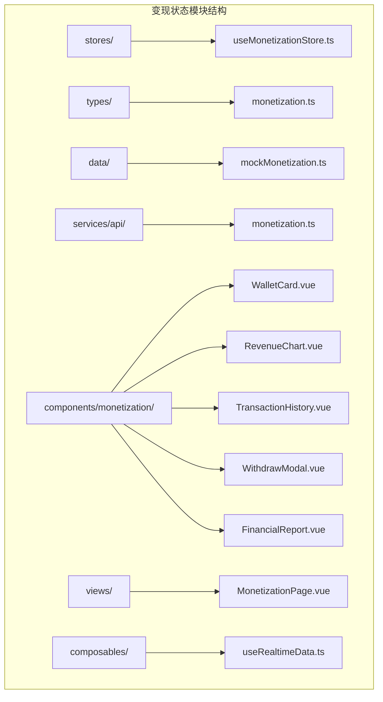
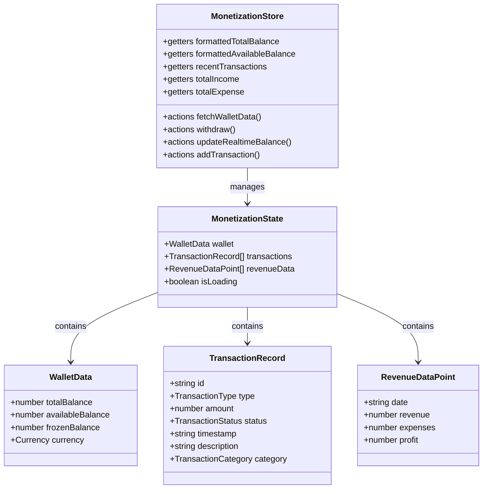
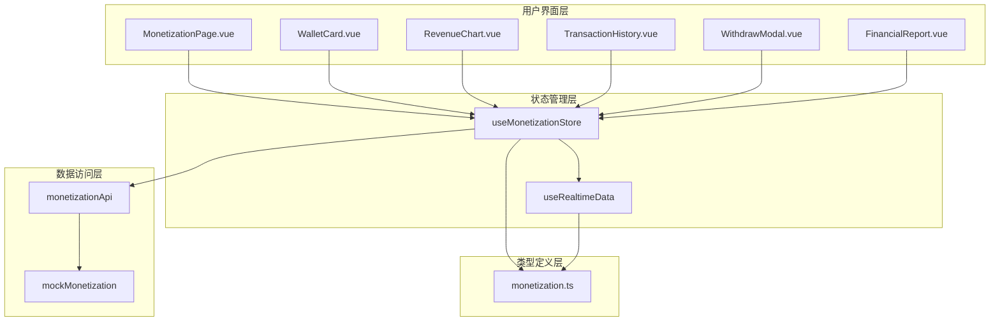
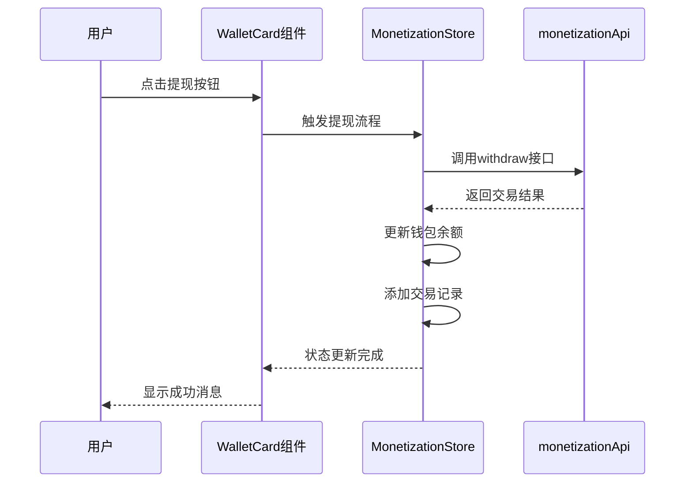
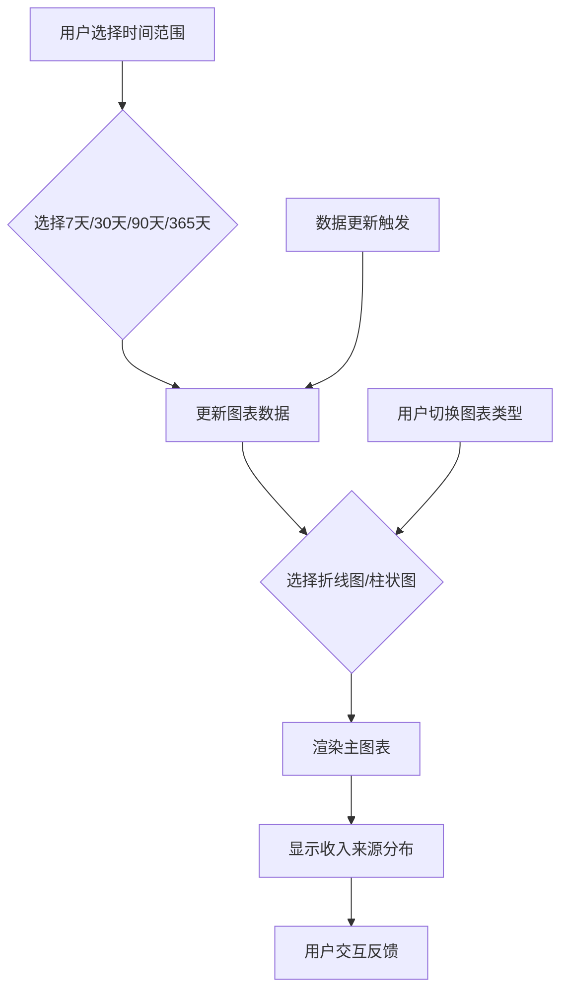
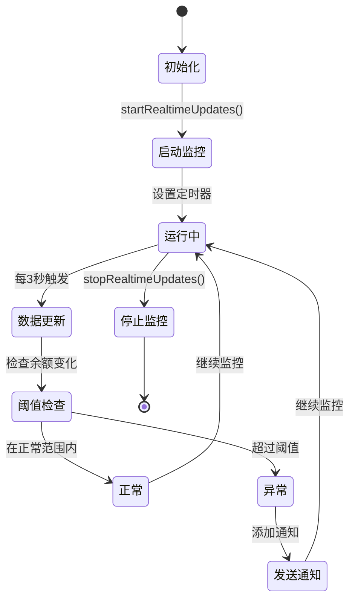
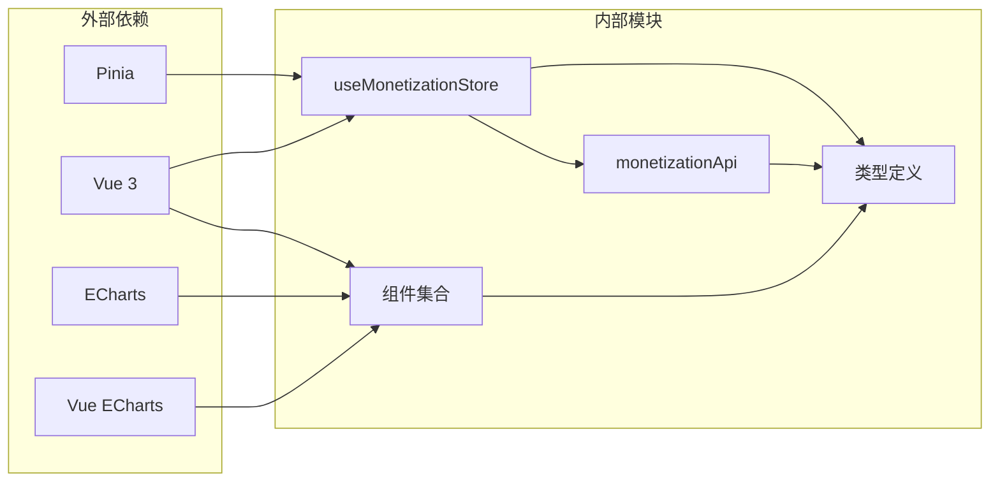

# 变现状态模块

<cite>
**本文档引用的文件**
- [useMonetizationStore.ts](file://apps/AgentPit/src/stores/useMonetizationStore.ts)
- [monetization.ts](file://apps/AgentPit/src/types/monetization.ts)
- [mockMonetization.ts](file://apps/AgentPit/src/data/mockMonetization.ts)
- [MonetizationPage.vue](file://apps/AgentPit/src/views/MonetizationPage.vue)
- [monetization.ts](file://apps/AgentPit/src/services/api/monetization.ts)
- [WalletCard.vue](file://apps/AgentPit/src/components/monetization/WalletCard.vue)
- [RevenueChart.vue](file://apps/AgentPit/src/components/monetization/RevenueChart.vue)
- [TransactionHistory.vue](file://apps/AgentPit/src/components/monetization/TransactionHistory.vue)
- [WithdrawModal.vue](file://apps/AgentPit/src/components/monetization/WithdrawModal.vue)
- [FinancialReport.vue](file://apps/AgentPit/src/components/monetization/FinancialReport.vue)
- [useRealtimeData.ts](file://apps/AgentPit/src/composables/useRealtimeData.ts)
- [RevenueChart.spec.ts](file://apps/AgentPit/src/__tests__/components/monetization/RevenueChart.spec.ts)
- [WalletCard.spec.ts](file://apps/AgentPit/src/__tests__/components/monetization/WalletCard.spec.ts)
</cite>

## 目录
1. [简介](#简介)
2. [项目结构](#项目结构)
3. [核心组件](#核心组件)
4. [架构概览](#架构概览)
5. [详细组件分析](#详细组件分析)
6. [依赖关系分析](#依赖关系分析)
7. [性能考虑](#性能考虑)
8. [故障排除指南](#故障排除指南)
9. [结论](#结论)
10. [附录](#附录)

## 简介

变现状态模块是 DAO Apps 生态系统中的核心财务管理系统，负责处理收益管理、钱包状态和财务数据。该模块采用现代化的前端架构，结合 Pinia 状态管理、Vue 组合式 API 和 ECharts 图表库，为用户提供完整的变现解决方案。

本模块的主要功能包括：
- 钱包余额管理（总余额、可用余额、冻结余额）
- 交易历史追踪和分类
- 收益趋势分析和可视化
- 提现流程管理
- 实时数据监控和通知
- 财务指标计算和报告

## 项目结构

变现状态模块在 AgentPit 应用中的组织结构如下：



**图表来源**
- [useMonetizationStore.ts:1-153](file://apps/AgentPit/src/stores/useMonetizationStore.ts#L1-L153)
- [monetization.ts:1-135](file://apps/AgentPit/src/types/monetization.ts#L1-L135)

**章节来源**
- [useMonetizationStore.ts:1-153](file://apps/AgentPit/src/stores/useMonetizationStore.ts#L1-L153)
- [monetization.ts:1-135](file://apps/AgentPit/src/types/monetization.ts#L1-L135)

## 核心组件

### 状态管理器设计

useMonetizationStore 是整个变现系统的核心状态管理器，采用 Pinia 的组合式 API 设计模式：



**图表来源**
- [useMonetizationStore.ts:13-151](file://apps/AgentPit/src/stores/useMonetizationStore.ts#L13-L151)
- [monetization.ts:15-55](file://apps/AgentPit/src/types/monetization.ts#L15-L55)

### 数据类型定义

模块采用 TypeScript 接口确保类型安全：

| 类型 | 描述 | 字段 |
|------|------|------|
| WalletData | 钱包数据 | totalBalance, availableBalance, frozenBalance, currency |
| TransactionRecord | 交易记录 | id, type, amount, status, timestamp, description, category |
| RevenueDataPoint | 收益数据点 | date, revenue, expenses, profit |
| FinancialMetrics | 财务指标 | totalIncome, totalExpense, netProfit, profitRate, monthlyComparison |

**章节来源**
- [monetization.ts:6-135](file://apps/AgentPit/src/types/monetization.ts#L6-L135)

## 架构概览

变现状态模块采用分层架构设计，确保关注点分离和模块化：



**图表来源**
- [MonetizationPage.vue:1-92](file://apps/AgentPit/src/views/MonetizationPage.vue#L1-L92)
- [useMonetizationStore.ts:20-151](file://apps/AgentPit/src/stores/useMonetizationStore.ts#L20-L151)
- [monetization.ts:1-135](file://apps/AgentPit/src/types/monetization.ts#L1-L135)

## 详细组件分析

### 钱包卡片组件

WalletCard 组件提供直观的钱包余额展示和交互功能：



**图表来源**
- [WalletCard.vue:1-124](file://apps/AgentPit/src/components/monetization/WalletCard.vue#L1-L124)
- [useMonetizationStore.ts:114-142](file://apps/AgentPit/src/stores/useMonetizationStore.ts#L114-L142)

### 收益图表组件

RevenueChart 组件支持多种图表视图和时间范围选择：



**图表来源**
- [RevenueChart.vue:33-253](file://apps/AgentPit/src/components/monetization/RevenueChart.vue#L33-L253)

### 实时数据监控

useRealtimeData 组合式函数提供实时数据监控功能：



**图表来源**
- [useRealtimeData.ts:83-102](file://apps/AgentPit/src/composables/useRealtimeData.ts#L83-L102)

**章节来源**
- [WalletCard.vue:1-124](file://apps/AgentPit/src/components/monetization/WalletCard.vue#L1-L124)
- [RevenueChart.vue:1-333](file://apps/AgentPit/src/components/monetization/RevenueChart.vue#L1-L333)
- [useRealtimeData.ts:1-117](file://apps/AgentPit/src/composables/useRealtimeData.ts#L1-L117)

## 依赖关系分析

变现状态模块的依赖关系清晰明确，遵循单一职责原则：



**图表来源**
- [useMonetizationStore.ts:1-11](file://apps/AgentPit/src/stores/useMonetizationStore.ts#L1-L11)
- [RevenueChart.vue:3-24](file://apps/AgentPit/src/components/monetization/RevenueChart.vue#L3-L24)

**章节来源**
- [useMonetizationStore.ts:1-153](file://apps/AgentPit/src/stores/useMonetizationStore.ts#L1-L153)
- [monetization.ts:1-135](file://apps/AgentPit/src/types/monetization.ts#L1-L135)

## 性能考虑

### 状态更新优化

1. **批量状态更新**：使用 Pinia 的响应式系统避免不必要的重渲染
2. **计算属性缓存**：利用 Vue 的计算属性缓存复杂数据处理结果
3. **虚拟滚动**：交易历史组件使用分页机制减少 DOM 元素数量

### 数据加载策略

1. **懒加载**：钱包数据在页面挂载时才进行加载
2. **防抖处理**：实时监控使用 3 秒间隔，平衡实时性与性能
3. **内存管理**：组件卸载时自动清理定时器和事件监听器

### 图表性能优化

1. **按需渲染**：ECharts 组件仅在需要时重新计算配置
2. **数据压缩**：图表数据采用必要的字段，避免冗余信息
3. **组件复用**：多个图表组件共享相同的 ECharts 配置逻辑

## 故障排除指南

### 常见问题及解决方案

| 问题类型 | 症状 | 解决方案 |
|----------|------|----------|
| 数据加载失败 | 页面空白或错误提示 | 检查 API 连接状态，验证网络请求 |
| 钱包余额异常 | 显示负数或不一致 | 检查实时更新逻辑，验证数据同步 |
| 图表渲染错误 | 图表不显示或显示异常 | 检查 ECharts 版本兼容性，验证数据格式 |
| 提现失败 | 提现请求无响应 | 检查提现参数，验证账户状态 |

### 调试技巧

1. **状态检查**：使用浏览器开发者工具查看 Pinia 状态变化
2. **网络监控**：检查 API 请求响应时间和错误码
3. **控制台日志**：添加关键操作的日志输出便于调试
4. **单元测试**：运行现有测试套件验证功能完整性

**章节来源**
- [useRealtimeData.ts:104-106](file://apps/AgentPit/src/composables/useRealtimeData.ts#L104-L106)

## 结论

变现状态模块通过精心设计的状态管理、清晰的组件架构和完善的类型系统，为 DAO Apps 生态系统提供了可靠的财务管理系统。模块具有以下优势：

1. **模块化设计**：各组件职责明确，易于维护和扩展
2. **类型安全**：完整的 TypeScript 类型定义确保代码质量
3. **用户体验**：直观的界面设计和流畅的交互体验
4. **性能优化**：合理的性能策略确保系统响应速度
5. **可测试性**：完善的单元测试覆盖关键功能

该模块为未来的功能扩展奠定了坚实基础，包括与真实支付系统的集成、更复杂的财务分析功能以及多语言支持等。

## 附录

### 最佳实践指南

1. **状态管理**
   - 使用 Pinia 进行全局状态管理
   - 避免在组件中直接修改状态
   - 合理使用 getters 进行数据派生

2. **数据安全**
   - 对敏感财务数据进行适当的权限控制
   - 实施数据验证和输入过滤
   - 定期备份重要财务数据

3. **状态一致性**
   - 使用事务性操作确保数据完整性
   - 实施冲突解决机制
   - 定期进行数据一致性检查

4. **性能优化**
   - 实施适当的缓存策略
   - 优化图表渲染性能
   - 监控内存使用情况

### 实际使用示例

#### 定义和使用状态管理器

```typescript
// 在组件中使用
const store = useMonetizationStore();
await store.fetchWalletData();

// 访问钱包数据
console.log(store.wallet.availableBalance);
```

#### 处理提现操作

```typescript
// 触发提现流程
await store.withdraw(1000, 'bank_card', 'account_info');
```

#### 实时监控设置

```typescript
// 启动实时监控
const { startRealtimeUpdates } = useRealtimeData(store);
startRealtimeUpdates();
```

**章节来源**
- [MonetizationPage.vue:18-33](file://apps/AgentPit/src/views/MonetizationPage.vue#L18-L33)
- [useMonetizationStore.ts:65-142](file://apps/AgentPit/src/stores/useMonetizationStore.ts#L65-L142)
- [useRealtimeData.ts:83-95](file://apps/AgentPit/src/composables/useRealtimeData.ts#L83-L95)