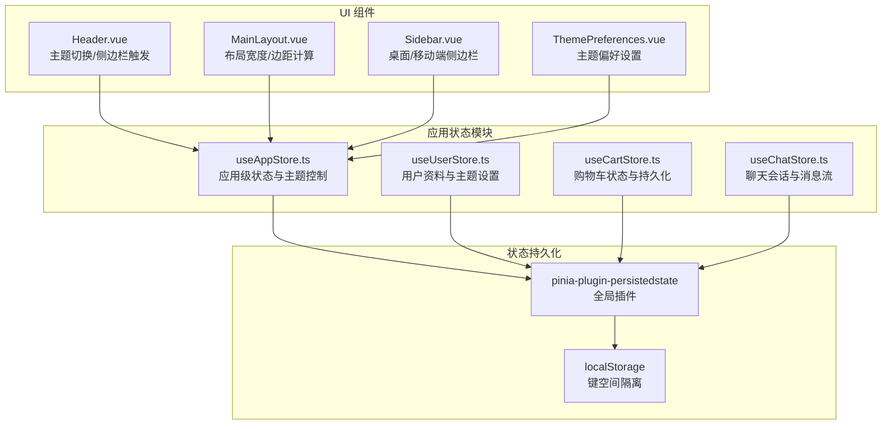
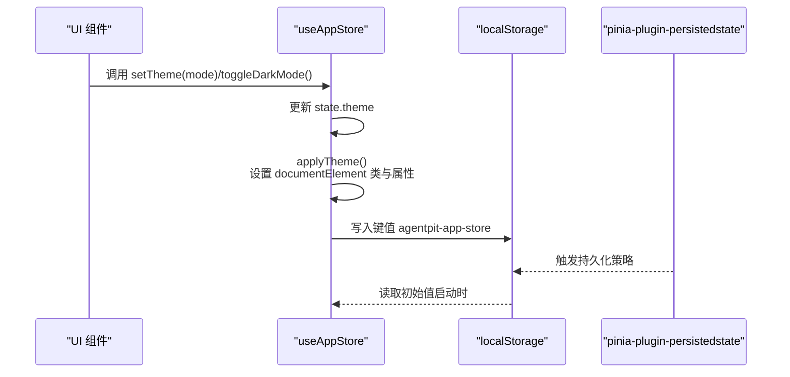
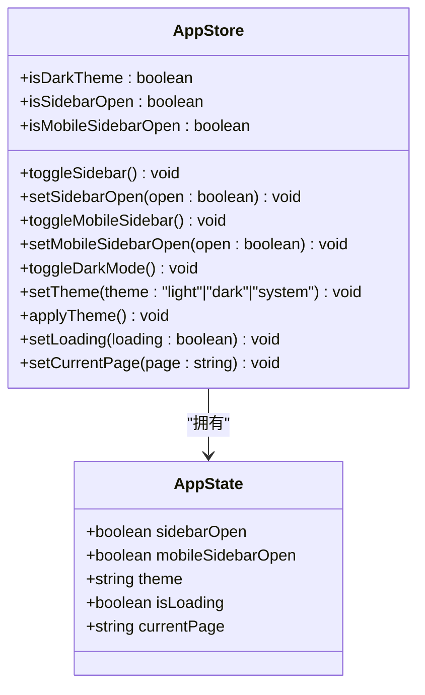
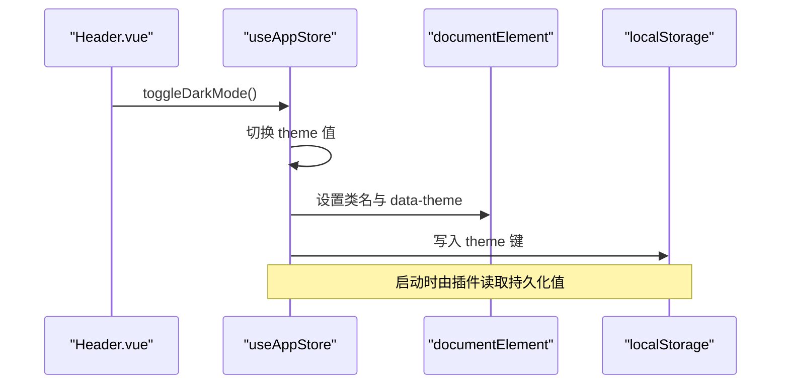
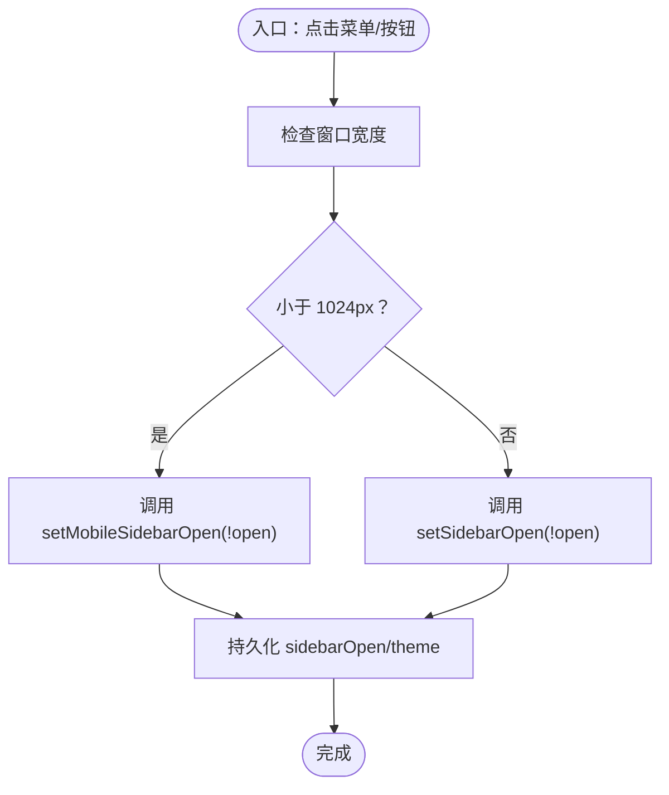
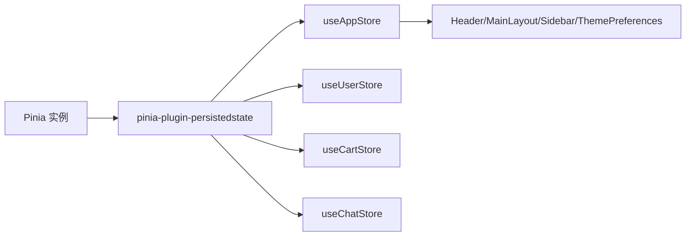

# 应用状态模块

<cite>
**本文引用的文件**
- [useAppStore.ts](file://apps/AgentPit/src/stores/useAppStore.ts)
- [index.ts](file://apps/AgentPit/src/stores/index.ts)
- [useUserStore.ts](file://apps/AgentPit/src/stores/useUserStore.ts)
- [useCartStore.ts](file://apps/AgentPit/src/stores/useCartStore.ts)
- [useChatStore.ts](file://apps/AgentPit/src/stores/useChatStore.ts)
- [user.ts](file://apps/AgentPit/src/types/user.ts)
- [chat.ts](file://apps/AgentPit/src/types/chat.ts)
- [Header.vue](file://apps/AgentPit/src/components/layout/Header.vue)
- [MainLayout.vue](file://apps/AgentPit/src/components/layout/MainLayout.vue)
- [Sidebar.vue](file://apps/AgentPit/src/components/layout/Sidebar.vue)
- [ThemePreferences.vue](file://apps/AgentPit/src/components/settings/ThemePreferences.vue)
</cite>

## 目录
1. [引言](#引言)
2. [项目结构](#项目结构)
3. [核心组件](#核心组件)
4. [架构总览](#架构总览)
5. [详细组件分析](#详细组件分析)
6. [依赖关系分析](#依赖关系分析)
7. [性能考量](#性能考量)
8. [故障排查指南](#故障排查指南)
9. [结论](#结论)
10. [附录](#附录)

## 引言
本文件聚焦于应用状态模块，系统性阐述 useAppStore 的设计与实现，涵盖应用级状态管理、全局配置与用户界面状态。文档将从数据结构、状态定义与更新方法入手，解析其与其它 store 的关系与交互，并总结最佳实践（状态设计原则、响应式更新与性能优化），最后提供可直接定位到源码位置的示例路径，便于实际开发与调试。

## 项目结构
应用状态模块位于 AgentPit 应用的 stores 目录，采用 Pinia 进行状态管理；UI 层通过组件消费 store 的状态与动作，形成清晰的单向数据流。

**图表来源**
- [useAppStore.ts:11-88](file://apps/AgentPit/src/stores/useAppStore.ts#L11-L88)
- [index.ts:1-15](file://apps/AgentPit/src/stores/index.ts#L1-L15)
- [Header.vue:40](file://apps/AgentPit/src/components/layout/Header.vue#L40)
- [MainLayout.vue:8](file://apps/AgentPit/src/components/layout/MainLayout.vue#L8)
- [Sidebar.vue:44](file://apps/AgentPit/src/components/layout/Sidebar.vue#L44)
- [ThemePreferences.vue:6](file://apps/AgentPit/src/components/settings/ThemePreferences.vue#L6)

**章节来源**
- [useAppStore.ts:1-89](file://apps/AgentPit/src/stores/useAppStore.ts#L1-L89)
- [index.ts:1-15](file://apps/AgentPit/src/stores/index.ts#L1-L15)

## 核心组件
本节聚焦 useAppStore 的数据结构、状态与动作，以及与 UI 的交互方式。

- 数据结构与状态
  - 侧边栏状态：sidebarOpen、mobileSidebarOpen
  - 主题模式：theme（支持 light/dark/system）
  - 加载状态：isLoading
  - 当前页面：currentPage
- Getter
  - isDarkTheme：根据 theme 与系统偏好动态判定
  - isSidebarOpen、isMobileSidebarOpen：便捷访问器
- Actions
  - 侧边栏控制：toggleSidebar、setSidebarOpen、toggleMobileSidebar、setMobileSidebarOpen
  - 主题控制：toggleDarkMode、setTheme、applyTheme（写入 DOM 属性与类名）
  - 页面状态：setLoading、setCurrentPage
- 持久化
  - 使用 pinia-plugin-persistedstate，键名为 agentpit-app-store，持久化字段：sidebarOpen、theme

上述定义与实现均来自以下文件：

**章节来源**
- [useAppStore.ts:3-18](file://apps/AgentPit/src/stores/useAppStore.ts#L3-L18)
- [useAppStore.ts:20-30](file://apps/AgentPit/src/stores/useAppStore.ts#L20-L30)
- [useAppStore.ts:32-81](file://apps/AgentPit/src/stores/useAppStore.ts#L32-L81)
- [useAppStore.ts:83-88](file://apps/AgentPit/src/stores/useAppStore.ts#L83-L88)

## 架构总览
useAppStore 作为应用级状态中心，与 UI 组件之间形成“状态驱动视图”的单向数据流。同时，它与 useUserStore、useCartStore、useChatStore 协同，分别负责用户偏好、购物车与聊天会话等业务域的状态。

**图表来源**
- [useAppStore.ts:49-72](file://apps/AgentPit/src/stores/useAppStore.ts#L49-L72)
- [useAppStore.ts:83-88](file://apps/AgentPit/src/stores/useAppStore.ts#L83-L88)
- [index.ts:6](file://apps/AgentPit/src/stores/index.ts#L6)

## 详细组件分析

### useAppStore 类图

**图表来源**
- [useAppStore.ts:3-18](file://apps/AgentPit/src/stores/useAppStore.ts#L3-L18)
- [useAppStore.ts:20-30](file://apps/AgentPit/src/stores/useAppStore.ts#L20-L30)
- [useAppStore.ts:32-81](file://apps/AgentPit/src/stores/useAppStore.ts#L32-L81)

**章节来源**
- [useAppStore.ts:11-88](file://apps/AgentPit/src/stores/useAppStore.ts#L11-L88)

### 主题切换与持久化序列图

**图表来源**
- [Header.vue:170](file://apps/AgentPit/src/components/layout/Header.vue#L170)
- [useAppStore.ts:49-72](file://apps/AgentPit/src/stores/useAppStore.ts#L49-L72)
- [useAppStore.ts:83-88](file://apps/AgentPit/src/stores/useAppStore.ts#L83-L88)
- [index.ts:6](file://apps/AgentPit/src/stores/index.ts#L6)

### 侧边栏控制流程图

**图表来源**
- [Header.vue:59-64](file://apps/AgentPit/src/components/layout/Header.vue#L59-L64)
- [useAppStore.ts:33-47](file://apps/AgentPit/src/stores/useAppStore.ts#L33-L47)
- [useAppStore.ts:83-88](file://apps/AgentPit/src/stores/useAppStore.ts#L83-L88)

### UI 与应用状态的交互
- Header.vue
  - 通过 useAppStore 控制移动端侧边栏开关与主题切换
  - 参考路径：[Header.vue:40](file://apps/AgentPit/src/components/layout/Header.vue#L40)，[Header.vue:59-64](file://apps/AgentPit/src/components/layout/Header.vue#L59-L64)，[Header.vue:170](file://apps/AgentPit/src/components/layout/Header.vue#L170)
- MainLayout.vue
  - 基于 sidebarOpen 动态计算侧边栏宽度与主内容区左边距
  - 参考路径：[MainLayout.vue:8](file://apps/AgentPit/src/components/layout/MainLayout.vue#L8)，[MainLayout.vue:10-11](file://apps/AgentPit/src/components/layout/MainLayout.vue#L10-L11)
- Sidebar.vue
  - 通过 isExpanded/isMobileOpen 控制桌面/移动端侧边栏展开与折叠
  - 参考路径：[Sidebar.vue:44](file://apps/AgentPit/src/components/layout/Sidebar.vue#L44)，[Sidebar.vue:46-47](file://apps/AgentPit/src/components/layout/Sidebar.vue#L46-L47)
- ThemePreferences.vue
  - 通过 setTheme 将用户偏好写入应用状态并应用到 DOM
  - 参考路径：[ThemePreferences.vue:6](file://apps/AgentPit/src/components/settings/ThemePreferences.vue#L6)，[ThemePreferences.vue:31-53](file://apps/AgentPit/src/components/settings/ThemePreferences.vue#L31-L53)

**章节来源**
- [Header.vue:1-270](file://apps/AgentPit/src/components/layout/Header.vue#L1-L270)
- [MainLayout.vue:1-79](file://apps/AgentPit/src/components/layout/MainLayout.vue#L1-L79)
- [Sidebar.vue:1-268](file://apps/AgentPit/src/components/layout/Sidebar.vue#L1-L268)
- [ThemePreferences.vue:1-385](file://apps/AgentPit/src/components/settings/ThemePreferences.vue#L1-L385)

### 与其他 store 的关系与交互
- 与 useUserStore 的关系
  - 用户主题设置（ThemeSettings）独立于应用主题（theme），二者解耦
  - 用户 store 提供用户资料与主题偏好，应用 store 负责应用层面的主题切换与持久化
  - 参考路径：[useUserStore.ts:4-24](file://apps/AgentPit/src/stores/useUserStore.ts#L4-L24)，[user.ts:59-73](file://apps/AgentPit/src/types/user.ts#L59-L73)
- 与 useCartStore 的关系
  - 购物车状态独立，但 UI 与应用状态共同决定布局与交互（如侧边栏宽度）
  - 参考路径：[useCartStore.ts:6-137](file://apps/AgentPit/src/stores/useCartStore.ts#L6-L137)
- 与 useChatStore 的关系
  - 聊天 store 管理会话与消息，应用 store 管理 UI 布局与主题
  - 二者通过各自 actions/gatters 解耦，避免交叉污染
  - 参考路径：[useChatStore.ts:5-218](file://apps/AgentPit/src/stores/useChatStore.ts#L5-L218)，[chat.ts:62-76](file://apps/AgentPit/src/types/chat.ts#L62-L76)

**章节来源**
- [useUserStore.ts:1-72](file://apps/AgentPit/src/stores/useUserStore.ts#L1-L72)
- [user.ts:1-200](file://apps/AgentPit/src/types/user.ts#L1-L200)
- [useCartStore.ts:1-138](file://apps/AgentPit/src/stores/useCartStore.ts#L1-L138)
- [useChatStore.ts:1-218](file://apps/AgentPit/src/stores/useChatStore.ts#L1-L218)
- [chat.ts:1-151](file://apps/AgentPit/src/types/chat.ts#L1-L151)

## 依赖关系分析
- Pinia 初始化与持久化插件
  - 在 stores/index.ts 中创建 Pinia 并注册持久化插件，确保各 store 的持久化行为一致
  - 参考路径：[index.ts:1-15](file://apps/AgentPit/src/stores/index.ts#L1-L15)
- store 间的耦合度
  - useAppStore 仅与 UI 组件耦合，不直接依赖其他业务 store，保持低耦合
  - 其他 store（用户、购物车、聊天）也彼此独立，通过各自的 actions/gatters 提供能力
  - 参考路径：[useAppStore.ts:11-88](file://apps/AgentPit/src/stores/useAppStore.ts#L11-L88)，[useUserStore.ts:11-71](file://apps/AgentPit/src/stores/useUserStore.ts#L11-L71)，[useCartStore.ts:6-137](file://apps/AgentPit/src/stores/useCartStore.ts#L6-L137)，[useChatStore.ts:13-218](file://apps/AgentPit/src/stores/useChatStore.ts#L13-L218)

**图表来源**
- [index.ts:1-15](file://apps/AgentPit/src/stores/index.ts#L1-L15)
- [useAppStore.ts:11-88](file://apps/AgentPit/src/stores/useAppStore.ts#L11-L88)
- [useUserStore.ts:11-71](file://apps/AgentPit/src/stores/useUserStore.ts#L11-L71)
- [useCartStore.ts:6-137](file://apps/AgentPit/src/stores/useCartStore.ts#L6-L137)
- [useChatStore.ts:13-218](file://apps/AgentPit/src/stores/useChatStore.ts#L13-L218)

**章节来源**
- [index.ts:1-15](file://apps/AgentPit/src/stores/index.ts#L1-L15)

## 性能考量
- 响应式更新
  - useAppStore 的 getters（如 isDarkTheme、isSidebarOpen）基于 state 计算，避免重复渲染
  - UI 组件通过 computed 与 store getter 绑定，仅在依赖变化时更新
- DOM 操作最小化
  - 主题切换通过给 documentElement 添加/移除类与设置 data-theme，避免频繁重排
- 持久化策略
  - 仅对必要字段（sidebarOpen、theme）进行持久化，降低存储开销
  - 插件统一管理持久化生命周期，减少手动同步成本
- 建议
  - 避免在 getters 中执行昂贵计算；如需复杂逻辑，考虑缓存或拆分为 action
  - 对高频交互（如滚动、拖拽）尽量减少对全局状态的依赖，优先使用局部状态

[本节为通用建议，无需特定文件来源]

## 故障排查指南
- 主题未生效
  - 检查 setTheme 是否被调用，以及 applyTheme 是否正确设置 documentElement 类与属性
  - 参考路径：[useAppStore.ts:54-72](file://apps/AgentPit/src/stores/useAppStore.ts#L54-L72)
- 侧边栏状态不同步
  - 确认移动端/桌面端分支逻辑是否正确调用 setMobileSidebarOpen/setSidebarOpen
  - 参考路径：[Header.vue:59-64](file://apps/AgentPit/src/components/layout/Header.vue#L59-L64)，[useAppStore.ts:33-47](file://apps/AgentPit/src/stores/useAppStore.ts#L33-L47)
- 持久化失效
  - 检查 pinia-plugin-persistedstate 是否正确安装与初始化
  - 参考路径：[index.ts:6](file://apps/AgentPit/src/stores/index.ts#L6)，[useAppStore.ts:83-88](file://apps/AgentPit/src/stores/useAppStore.ts#L83-L88)
- UI 不随状态变化更新
  - 确认组件是否通过 useAppStore 获取状态，且未被局部变量覆盖
  - 参考路径：[MainLayout.vue:8](file://apps/AgentPit/src/components/layout/MainLayout.vue#L8)，[Sidebar.vue:44](file://apps/AgentPit/src/components/layout/Sidebar.vue#L44)

**章节来源**
- [useAppStore.ts:49-72](file://apps/AgentPit/src/stores/useAppStore.ts#L49-L72)
- [Header.vue:59-64](file://apps/AgentPit/src/components/layout/Header.vue#L59-L64)
- [index.ts:6](file://apps/AgentPit/src/stores/index.ts#L6)

## 结论
useAppStore 以简洁的数据结构与明确的动作边界，实现了应用级 UI 状态与主题管理，并通过 pinia-plugin-persistedstate 实现轻量持久化。它与 UI 组件形成清晰的单向数据流，同时与用户、购物车、聊天等 store 解耦协作，满足多场景下的状态管理需求。遵循本文的最佳实践，可在保证性能的同时提升可维护性与可扩展性。

[本节为总结，无需特定文件来源]

## 附录

### 状态设计原则
- 单一职责：每个 store 聚焦一个业务域，避免“上帝 store”
- 最小状态：仅存放必要的状态，避免冗余
- 可预测：通过 actions 修改状态，保持状态变更可追踪
- 可测试：将复杂逻辑封装为 actions 或工具函数，便于单元测试

### 响应式更新与性能优化清单
- 使用 computed 与 getters 缓存派生状态
- 避免在模板中直接调用昂贵函数
- 对高频交互使用局部状态，减少全局状态抖动
- 合理拆分 store，降低不必要的响应式监听范围

### 实际代码示例（路径定位）
- 定义与导出 useAppStore
  - [useAppStore.ts:11-88](file://apps/AgentPit/src/stores/useAppStore.ts#L11-L88)
- Pinia 初始化与持久化插件
  - [index.ts:1-15](file://apps/AgentPit/src/stores/index.ts#L1-L15)
- UI 组件中使用应用状态
  - Header.vue：主题切换与移动端侧边栏控制
    - [Header.vue:40](file://apps/AgentPit/src/components/layout/Header.vue#L40)
    - [Header.vue:59-64](file://apps/AgentPit/src/components/layout/Header.vue#L59-L64)
    - [Header.vue:170](file://apps/AgentPit/src/components/layout/Header.vue#L170)
  - MainLayout.vue：布局宽度与边距计算
    - [MainLayout.vue:8](file://apps/AgentPit/src/components/layout/MainLayout.vue#L8)
    - [MainLayout.vue:10-11](file://apps/AgentPit/src/components/layout/MainLayout.vue#L10-L11)
  - Sidebar.vue：侧边栏展开/折叠
    - [Sidebar.vue:44](file://apps/AgentPit/src/components/layout/Sidebar.vue#L44)
    - [Sidebar.vue:46-47](file://apps/AgentPit/src/components/layout/Sidebar.vue#L46-L47)
  - ThemePreferences.vue：主题偏好设置与应用
    - [ThemePreferences.vue:6](file://apps/AgentPit/src/components/settings/ThemePreferences.vue#L6)
    - [ThemePreferences.vue:31-53](file://apps/AgentPit/src/components/settings/ThemePreferences.vue#L31-L53)

**章节来源**
- [useAppStore.ts:11-88](file://apps/AgentPit/src/stores/useAppStore.ts#L11-L88)
- [index.ts:1-15](file://apps/AgentPit/src/stores/index.ts#L1-L15)
- [Header.vue:1-270](file://apps/AgentPit/src/components/layout/Header.vue#L1-L270)
- [MainLayout.vue:1-79](file://apps/AgentPit/src/components/layout/MainLayout.vue#L1-L79)
- [Sidebar.vue:1-268](file://apps/AgentPit/src/components/layout/Sidebar.vue#L1-L268)
- [ThemePreferences.vue:1-385](file://apps/AgentPit/src/components/settings/ThemePreferences.vue#L1-L385)