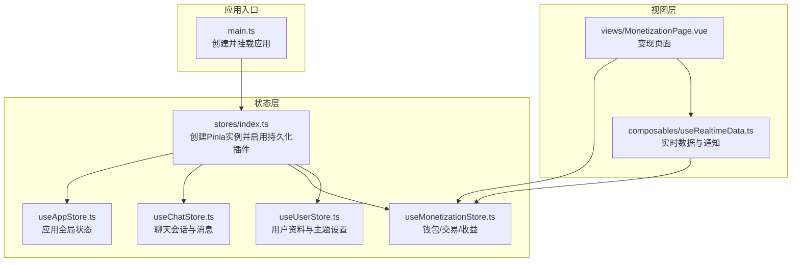
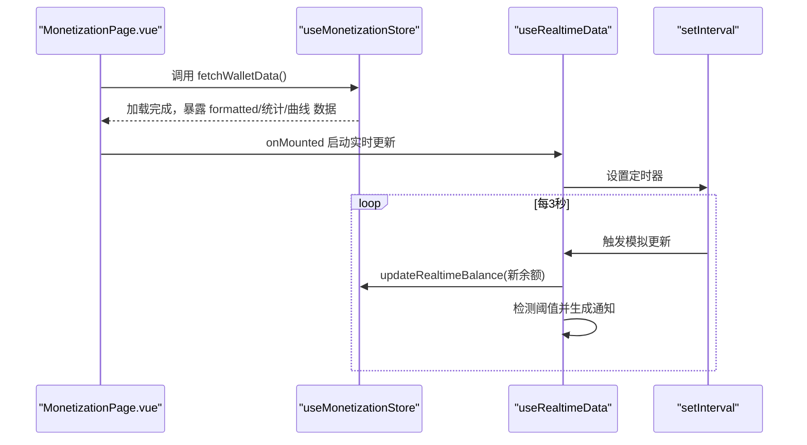
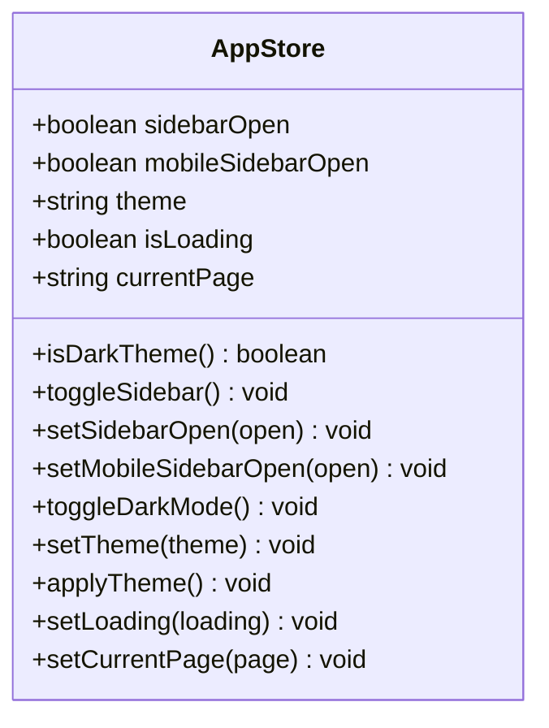
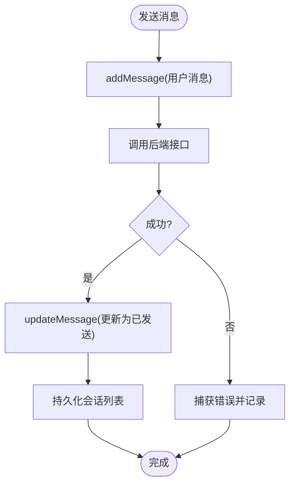
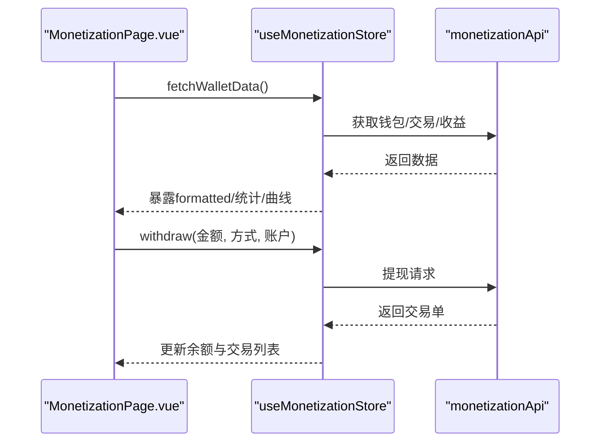
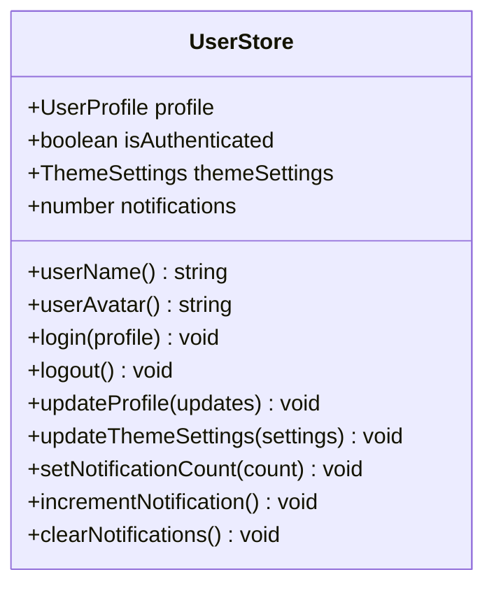
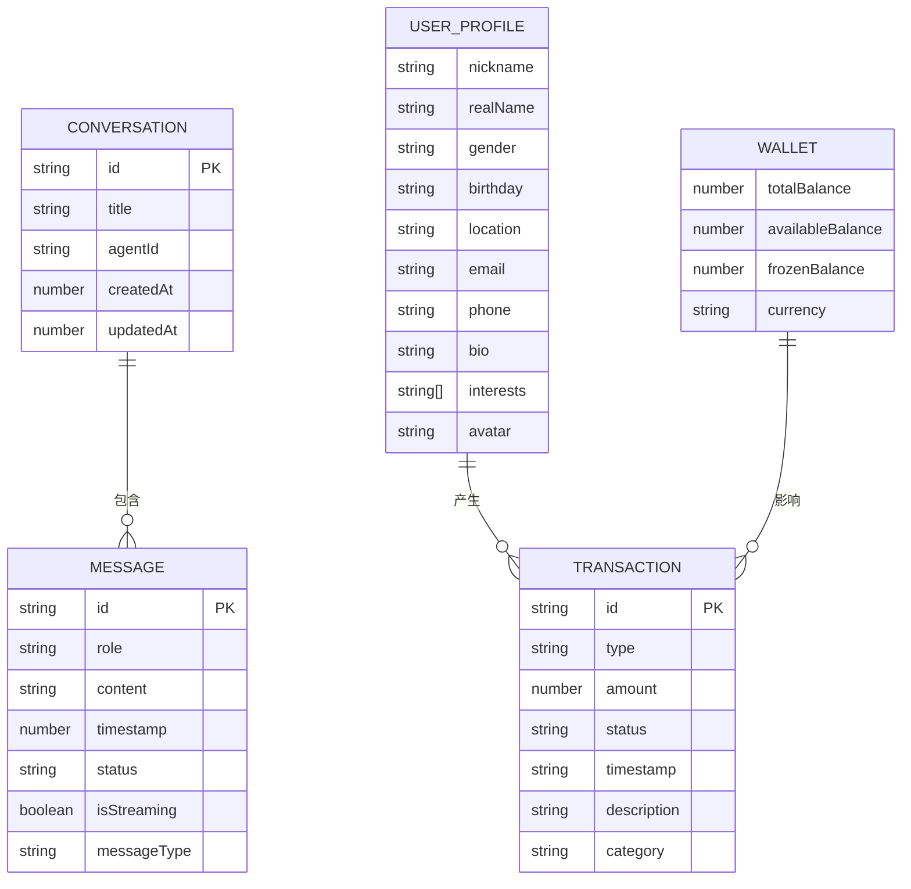
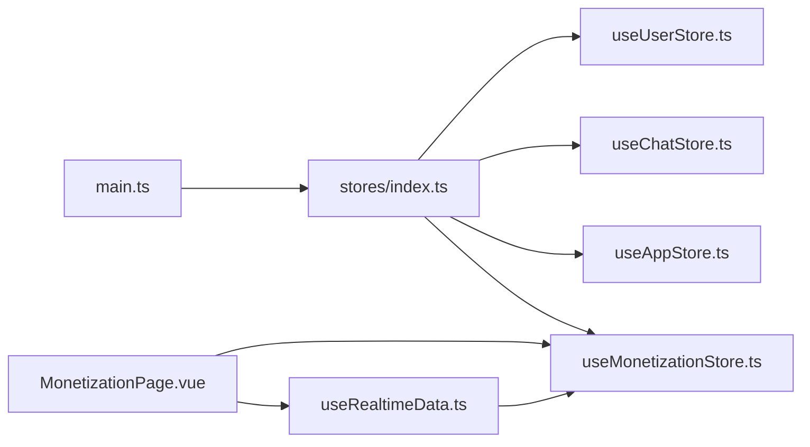

# 状态管理系统

<cite>
**本文引用的文件**
- [apps/AgentPit/src/main.ts](file://apps/AgentPit/src/main.ts)
- [apps/AgentPit/src/stores/index.ts](file://apps/AgentPit/src/stores/index.ts)
- [apps/AgentPit/src/stores/useAppStore.ts](file://apps/AgentPit/src/stores/useAppStore.ts)
- [apps/AgentPit/src/stores/useChatStore.ts](file://apps/AgentPit/src/stores/useChatStore.ts)
- [apps/AgentPit/src/stores/useMonetizationStore.ts](file://apps/AgentPit/src/stores/useMonetizationStore.ts)
- [apps/AgentPit/src/stores/useUserStore.ts](file://apps/AgentPit/src/stores/useUserStore.ts)
- [apps/AgentPit/src/types/chat.ts](file://apps/AgentPit/src/types/chat.ts)
- [apps/AgentPit/src/types/monetization.ts](file://apps/AgentPit/src/types/monetization.ts)
- [apps/AgentPit/src/types/user.ts](file://apps/AgentPit/src/types/user.ts)
- [apps/AgentPit/src/views/MonetizationPage.vue](file://apps/AgentPit/src/views/MonetizationPage.vue)
- [apps/AgentPit/src/composables/useRealtimeData.ts](file://apps/AgentPit/src/composables/useRealtimeData.ts)
</cite>

## 目录
1. [引言](#引言)
2. [项目结构](#项目结构)
3. [核心组件](#核心组件)
4. [架构总览](#架构总览)
5. [详细组件分析](#详细组件分析)
6. [依赖关系分析](#依赖关系分析)
7. [性能考量](#性能考量)
8. [故障排查指南](#故障排查指南)
9. [结论](#结论)
10. [附录](#附录)

## 引言
本文件面向AgentPit智能体平台，系统性阐述基于Pinia的状态管理架构与最佳实践。文档覆盖store组织结构、状态定义、动作处理、持久化策略、响应式更新机制、状态同步与跨组件通信，并结合实际页面与组合式函数示例，给出可操作的调试与优化建议。

## 项目结构
AgentPit前端采用Vue 3 + Pinia架构，状态管理集中于src/stores目录，类型定义位于src/types，应用入口在src/main.ts中注册Pinia实例；变现页面MonetizationPage.vue演示了store的使用方式与实时数据组合式函数的集成。

**图表来源**
- [apps/AgentPit/src/main.ts:1-13](file://apps/AgentPit/src/main.ts#L1-L13)
- [apps/AgentPit/src/stores/index.ts:1-15](file://apps/AgentPit/src/stores/index.ts#L1-L15)
- [apps/AgentPit/src/stores/useAppStore.ts:1-89](file://apps/AgentPit/src/stores/useAppStore.ts#L1-L89)
- [apps/AgentPit/src/stores/useChatStore.ts:1-218](file://apps/AgentPit/src/stores/useChatStore.ts#L1-L218)
- [apps/AgentPit/src/stores/useMonetizationStore.ts:1-153](file://apps/AgentPit/src/stores/useMonetizationStore.ts#L1-L153)
- [apps/AgentPit/src/stores/useUserStore.ts:1-72](file://apps/AgentPit/src/stores/useUserStore.ts#L1-L72)
- [apps/AgentPit/src/views/MonetizationPage.vue:1-92](file://apps/AgentPit/src/views/MonetizationPage.vue#L1-L92)
- [apps/AgentPit/src/composables/useRealtimeData.ts:1-117](file://apps/AgentPit/src/composables/useRealtimeData.ts#L1-L117)

**章节来源**
- [apps/AgentPit/src/main.ts:1-13](file://apps/AgentPit/src/main.ts#L1-L13)
- [apps/AgentPit/src/stores/index.ts:1-15](file://apps/AgentPit/src/stores/index.ts#L1-L15)

## 核心组件
- 应用状态 store（useAppStore）
  - 职责：全局主题、侧边栏、加载态、当前页面等应用级状态；提供主题切换与DOM样式应用能力；持久化关键字段。
  - 关键点：通过getters计算暗色主题；通过actions切换/设置侧边栏、切换/设置主题、设置加载态、设置当前页；持久化键名与存储位置自定义。
- 聊天状态 store（useChatStore）
  - 职责：会话列表、当前会话、当前智能体、流式输出标记、消息增删改查；本地持久化会话数据；异步拉取远端会话与消息；发送消息。
  - 关键点：getters提供当前会话、全部消息、最近N轮上下文、消息计数；actions负责创建/激活会话、增删改消息、流式状态、删除/清空会话、本地持久化与远端拉取。
- 变现状态 store（useMonetizationStore）
  - 职责：钱包余额、交易记录、收益曲线；异步获取钱包、交易与收益数据；提现流程；实时余额模拟更新。
  - 关键点：getters格式化货币、近10条交易、收支统计；actions负责拉取数据、提现、实时余额更新、新增交易。
- 用户状态 store（useUserStore）
  - 职责：用户档案、登录态、主题设置、通知计数；登出时清理持久化。
  - 关键点：getters派生用户名与头像；actions负责登录、登出、更新资料与主题设置、通知计数变更；持久化主题设置。

**章节来源**
- [apps/AgentPit/src/stores/useAppStore.ts:1-89](file://apps/AgentPit/src/stores/useAppStore.ts#L1-L89)
- [apps/AgentPit/src/stores/useChatStore.ts:1-218](file://apps/AgentPit/src/stores/useChatStore.ts#L1-L218)
- [apps/AgentPit/src/stores/useMonetizationStore.ts:1-153](file://apps/AgentPit/src/stores/useMonetizationStore.ts#L1-L153)
- [apps/AgentPit/src/stores/useUserStore.ts:1-72](file://apps/AgentPit/src/stores/useUserStore.ts#L1-L72)

## 架构总览
Pinia实例在入口处创建并注入插件，各store通过defineStore定义状态、getters与actions；页面通过组合式API直接使用store；组合式函数封装实时数据与通知逻辑并与store交互。

**图表来源**
- [apps/AgentPit/src/views/MonetizationPage.vue:18-21](file://apps/AgentPit/src/views/MonetizationPage.vue#L18-L21)
- [apps/AgentPit/src/composables/useRealtimeData.ts:83-95](file://apps/AgentPit/src/composables/useRealtimeData.ts#L83-L95)
- [apps/AgentPit/src/stores/useMonetizationStore.ts:144-146](file://apps/AgentPit/src/stores/useMonetizationStore.ts#L144-L146)

## 详细组件分析

### 应用状态 store（useAppStore）
- 状态结构
  - sidebarOpen、mobileSidebarOpen、theme、isLoading、currentPage
- 关键行为
  - 主题切换与DOM样式应用；侧边栏开关；加载态与当前页设置
- 持久化
  - 使用pinia-plugin-persistedstate，持久化键名与pick字段自定义

**图表来源**
- [apps/AgentPit/src/stores/useAppStore.ts:3-88](file://apps/AgentPit/src/stores/useAppStore.ts#L3-L88)

**章节来源**
- [apps/AgentPit/src/stores/useAppStore.ts:1-89](file://apps/AgentPit/src/stores/useAppStore.ts#L1-L89)

### 聊天状态 store（useChatStore）
- 状态结构
  - conversations、activeConversationId、activeAgent、isStreaming、streamingMessageId
- 关键行为
  - 创建/激活会话、增删改消息、流式状态、删除/清空会话、本地持久化与远端拉取
  - getters提供当前会话、全部消息、最近N轮上下文、消息计数
- 持久化
  - 自行实现localStorage持久化与加载

**图表来源**
- [apps/AgentPit/src/stores/useChatStore.ts:199-215](file://apps/AgentPit/src/stores/useChatStore.ts#L199-L215)

**章节来源**
- [apps/AgentPit/src/stores/useChatStore.ts:1-218](file://apps/AgentPit/src/stores/useChatStore.ts#L1-L218)
- [apps/AgentPit/src/types/chat.ts:38-88](file://apps/AgentPit/src/types/chat.ts#L38-L88)

### 变现状态 store（useMonetizationStore）
- 状态结构
  - wallet、transactions、revenueData、isLoading
- 关键行为
  - 异步获取钱包、交易与收益；提现流程；实时余额更新；交易记录追加
  - getters提供格式化货币、近10条交易、收支统计
- 持久化
  - 本store未启用pinia持久化插件，但可通过扩展实现

**图表来源**
- [apps/AgentPit/src/views/MonetizationPage.vue:18-21](file://apps/AgentPit/src/views/MonetizationPage.vue#L18-L21)
- [apps/AgentPit/src/stores/useMonetizationStore.ts:66-112](file://apps/AgentPit/src/stores/useMonetizationStore.ts#L66-L112)
- [apps/AgentPit/src/stores/useMonetizationStore.ts:114-142](file://apps/AgentPit/src/stores/useMonetizationStore.ts#L114-L142)

**章节来源**
- [apps/AgentPit/src/stores/useMonetizationStore.ts:1-153](file://apps/AgentPit/src/stores/useMonetizationStore.ts#L1-L153)
- [apps/AgentPit/src/types/monetization.ts:15-55](file://apps/AgentPit/src/types/monetization.ts#L15-L55)

### 用户状态 store（useUserStore）
- 状态结构
  - profile、isAuthenticated、themeSettings、notifications
- 关键行为
  - 登录/登出、更新资料与主题设置、通知计数变更
- 持久化
  - 仅持久化主题设置，登出清理用户持久化

**图表来源**
- [apps/AgentPit/src/stores/useUserStore.ts:4-64](file://apps/AgentPit/src/stores/useUserStore.ts#L4-L64)

**章节来源**
- [apps/AgentPit/src/stores/useUserStore.ts:1-72](file://apps/AgentPit/src/stores/useUserStore.ts#L1-L72)
- [apps/AgentPit/src/types/user.ts:9-33](file://apps/AgentPit/src/types/user.ts#L9-L33)

### 类型系统与数据模型
- 聊天类型（消息、会话、智能体、快捷指令等）
- 变现类型（钱包、交易、收益、提现等）
- 用户类型（资料、主题、通知、安全等）

**图表来源**
- [apps/AgentPit/src/types/chat.ts:38-88](file://apps/AgentPit/src/types/chat.ts#L38-L88)
- [apps/AgentPit/src/types/monetization.ts:15-55](file://apps/AgentPit/src/types/monetization.ts#L15-L55)
- [apps/AgentPit/src/types/user.ts:9-33](file://apps/AgentPit/src/types/user.ts#L9-L33)

**章节来源**
- [apps/AgentPit/src/types/chat.ts:1-151](file://apps/AgentPit/src/types/chat.ts#L1-L151)
- [apps/AgentPit/src/types/monetization.ts:1-135](file://apps/AgentPit/src/types/monetization.ts#L1-L135)
- [apps/AgentPit/src/types/user.ts:1-200](file://apps/AgentPit/src/types/user.ts#L1-L200)

## 依赖关系分析
- 应用入口依赖Pinia实例；Pinia实例启用持久化插件；各store相互独立，无循环依赖。
- 页面与组合式函数通过store进行跨组件通信：页面消费store状态，组合式函数订阅store变化并触发UI反馈。
- 聊天store同时维护本地localStorage与远端API；变现store主要依赖API，可按需扩展本地持久化。

**图表来源**
- [apps/AgentPit/src/main.ts:1-13](file://apps/AgentPit/src/main.ts#L1-L13)
- [apps/AgentPit/src/stores/index.ts:1-15](file://apps/AgentPit/src/stores/index.ts#L1-L15)
- [apps/AgentPit/src/views/MonetizationPage.vue:10](file://apps/AgentPit/src/views/MonetizationPage.vue#L10)
- [apps/AgentPit/src/composables/useRealtimeData.ts:13](file://apps/AgentPit/src/composables/useRealtimeData.ts#L13)

**章节来源**
- [apps/AgentPit/src/main.ts:1-13](file://apps/AgentPit/src/main.ts#L1-L13)
- [apps/AgentPit/src/stores/index.ts:1-15](file://apps/AgentPit/src/stores/index.ts#L1-L15)

## 性能考量
- 响应式粒度控制
  - 将大对象拆分为更细粒度的状态，避免不必要的重渲染（例如将聊天消息数组分段或按会话切片）。
- 持久化策略
  - 聊天store已实现本地持久化，建议对频繁写入的字段（如消息内容）考虑分页或增量持久化，降低localStorage压力。
  - 变现store可按需开启pinia持久化插件，仅pick必要字段，减少序列化开销。
- 异步操作批处理
  - 对高频更新（如实时余额）采用节流/去抖或合并更新策略，减少渲染次数。
- 渲染优化
  - 使用keep-alive缓存不常变的页面组件；对长列表使用虚拟滚动或分页加载。
- 调试与可观测性
  - 在开发环境启用Pinia Devtools；对关键actions增加日志埋点；对网络错误统一拦截与上报。

## 故障排查指南
- 主题切换无效
  - 检查主题设置是否正确持久化与DOM属性是否更新；确认系统深色偏好与手动主题优先级。
  - 参考路径：[apps/AgentPit/src/stores/useAppStore.ts:54-72](file://apps/AgentPit/src/stores/useAppStore.ts#L54-L72)
- 聊天消息丢失或不同步
  - 确认本地持久化键名与加载逻辑；检查远端拉取是否成功；关注消息状态流转。
  - 参考路径：[apps/AgentPit/src/stores/useChatStore.ts:161-174](file://apps/AgentPit/src/stores/useChatStore.ts#L161-L174)，[apps/AgentPit/src/stores/useChatStore.ts:176-184](file://apps/AgentPit/src/stores/useChatStore.ts#L176-L184)
- 变现数据不刷新
  - 确认fetchWalletData流程与API返回；检查实时更新是否启动与定时器是否被清理。
  - 参考路径：[apps/AgentPit/src/views/MonetizationPage.vue:18-21](file://apps/AgentPit/src/views/MonetizationPage.vue#L18-L21)，[apps/AgentPit/src/composables/useRealtimeData.ts:83-95](file://apps/AgentPit/src/composables/useRealtimeData.ts#L83-L95)
- 登录态异常
  - 检查登录/登出流程与持久化清理；确认store初始化与页面挂载时机。
  - 参考路径：[apps/AgentPit/src/stores/useUserStore.ts:32-41](file://apps/AgentPit/src/stores/useUserStore.ts#L32-L41)

**章节来源**
- [apps/AgentPit/src/stores/useAppStore.ts:54-72](file://apps/AgentPit/src/stores/useAppStore.ts#L54-L72)
- [apps/AgentPit/src/stores/useChatStore.ts:161-184](file://apps/AgentPit/src/stores/useChatStore.ts#L161-L184)
- [apps/AgentPit/src/views/MonetizationPage.vue:18-21](file://apps/AgentPit/src/views/MonetizationPage.vue#L18-L21)
- [apps/AgentPit/src/composables/useRealtimeData.ts:83-95](file://apps/AgentPit/src/composables/useRealtimeData.ts#L83-L95)
- [apps/AgentPit/src/stores/useUserStore.ts:32-41](file://apps/AgentPit/src/stores/useUserStore.ts#L32-L41)

## 结论
AgentPit的状态管理以Pinia为核心，采用模块化store划分职责，配合类型系统确保数据一致性。通过本地持久化与组合式函数实现跨组件通信与实时更新。建议在现有基础上进一步细化状态粒度、优化持久化策略与异步批处理，持续完善调试与可观测性，以提升用户体验与系统稳定性。

## 附录
- 最佳实践清单
  - 状态设计原则：单一职责、最小必要状态、稳定的数据结构
  - 异步处理：集中错误处理、加载态与重试策略、结果归一化
  - 调试技巧：Devtools、日志埋点、断点与快照
  - 性能优化：响应式拆分、持久化裁剪、渲染节流
- 实际使用示例（路径指引）
  - 在页面中使用store：[apps/AgentPit/src/views/MonetizationPage.vue:10](file://apps/AgentPit/src/views/MonetizationPage.vue#L10)
  - 实时数据与通知：[apps/AgentPit/src/composables/useRealtimeData.ts:13](file://apps/AgentPit/src/composables/useRealtimeData.ts#L13)
  - 聊天消息发送流程：[apps/AgentPit/src/stores/useChatStore.ts:199-215](file://apps/AgentPit/src/stores/useChatStore.ts#L199-L215)
  - 变现提现流程：[apps/AgentPit/src/stores/useMonetizationStore.ts:114-142](file://apps/AgentPit/src/stores/useMonetizationStore.ts#L114-L142)