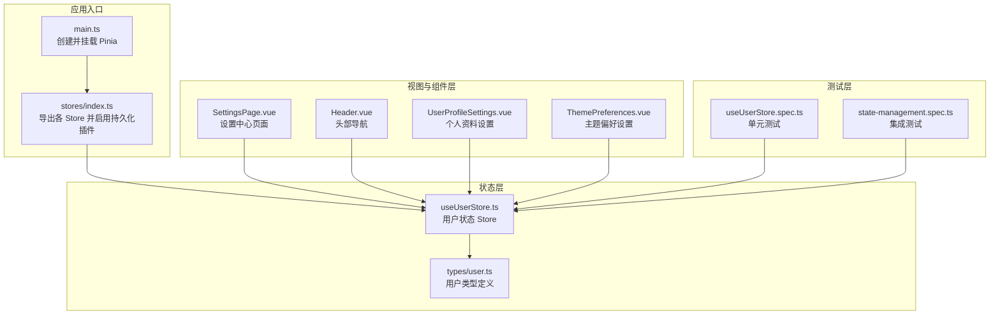
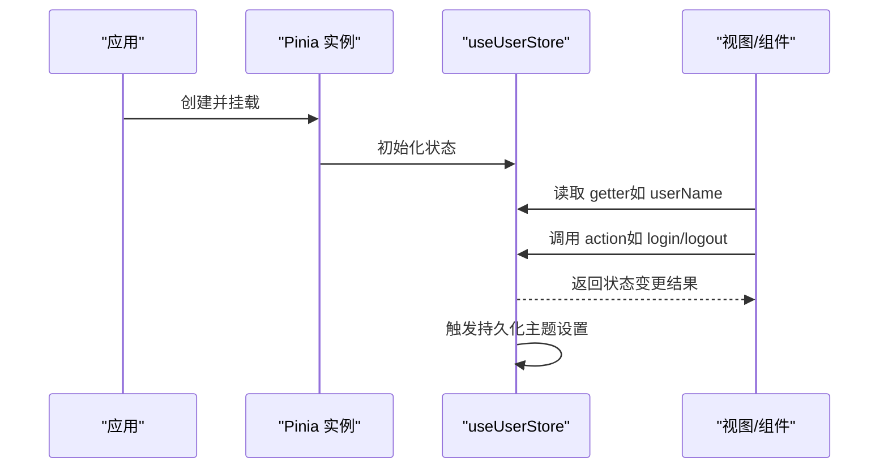
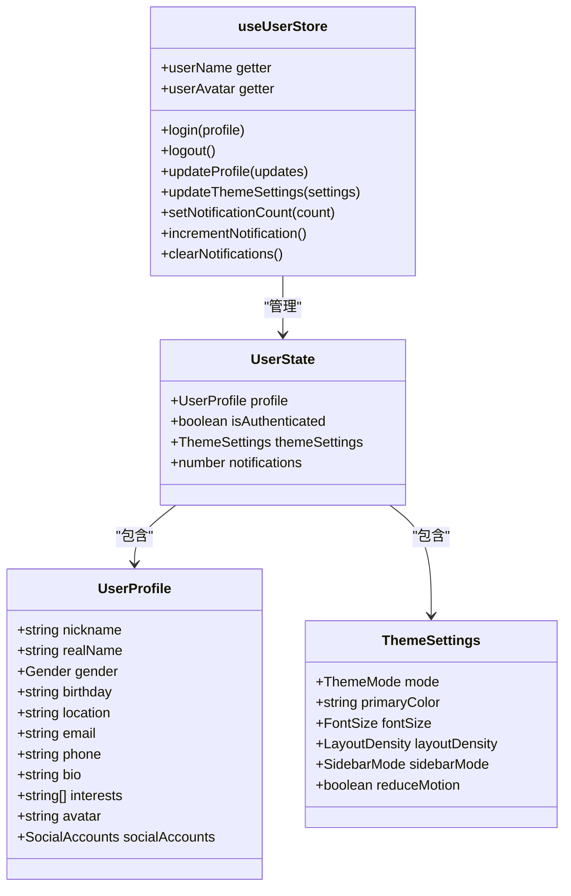
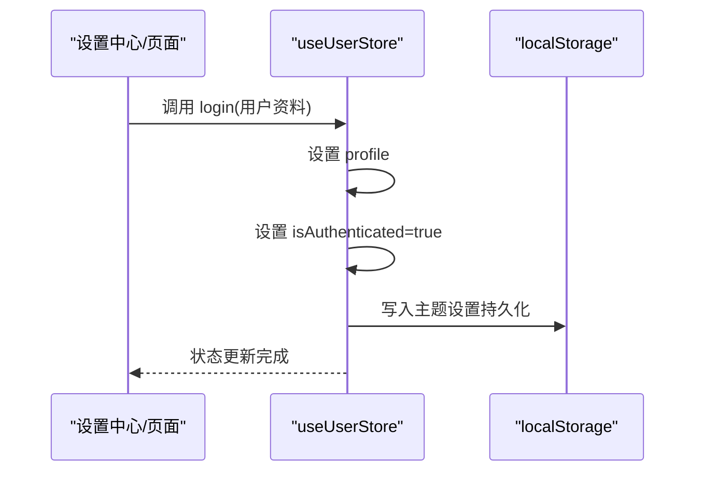
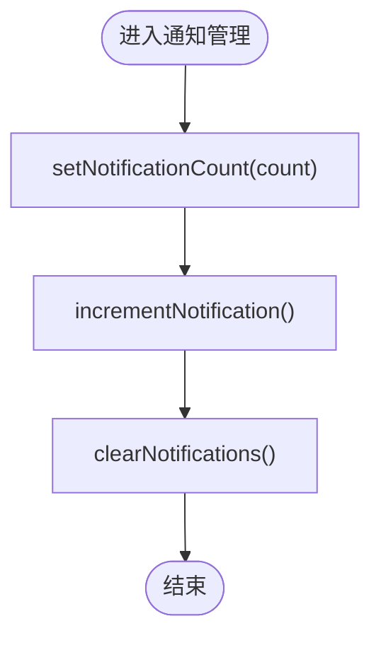
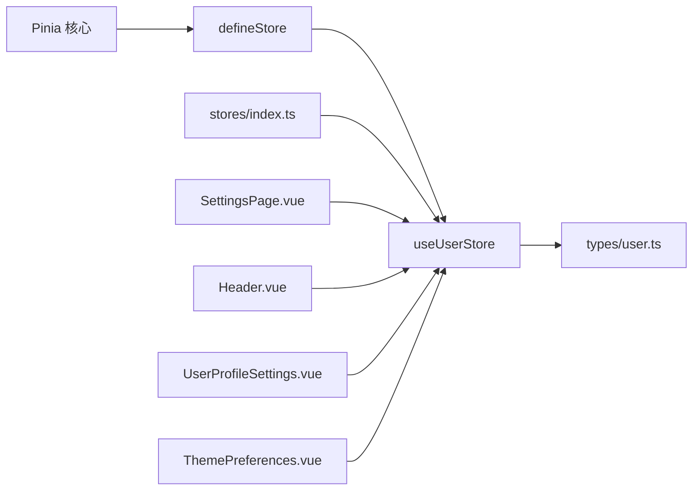

# 用户状态模块

<cite>
**本文引用的文件**
- [useUserStore.ts](file://apps/AgentPit/src/stores/useUserStore.ts)
- [user.ts](file://apps/AgentPit/src/types/user.ts)
- [index.ts](file://apps/AgentPit/src/stores/index.ts)
- [main.ts](file://apps/AgentPit/src/main.ts)
- [SettingsPage.vue](file://apps/AgentPit/src/views/SettingsPage.vue)
- [Header.vue](file://apps/AgentPit/src/components/layout/Header.vue)
- [UserProfileSettings.vue](file://apps/AgentPit/src/components/settings/UserProfileSettings.vue)
- [ThemePreferences.vue](file://apps/AgentPit/src/components/settings/ThemePreferences.vue)
- [useUserStore.spec.ts](file://apps/AgentPit/src/__tests__/stores/useUserStore.spec.ts)
- [state-management.spec.ts](file://apps/AgentPit/src/__tests__/integration/state-management.spec.ts)
- [users.ts](file://apps/config-center/src/api/users.ts)
- [authStore.ts](file://apps/config-center/src/store/authStore.ts)
</cite>

## 目录
1. [引言](#引言)
2. [项目结构](#项目结构)
3. [核心组件](#核心组件)
4. [架构总览](#架构总览)
5. [详细组件分析](#详细组件分析)
6. [依赖关系分析](#依赖关系分析)
7. [性能考量](#性能考量)
8. [故障排查指南](#故障排查指南)
9. [结论](#结论)
10. [附录](#附录)

## 引言
本文件面向“用户状态模块”的技术文档，重点围绕 Pinia Store 的 useUserStore 设计与实现进行深入解析。内容涵盖用户身份管理、认证状态与配置信息的数据结构、getter 与 action 的职责边界、与认证系统的集成方式、以及最佳实践（状态安全、数据同步、用户体验优化）。同时提供基于源码路径的示例定位，便于开发者快速查阅与调试。

## 项目结构
用户状态模块位于 AgentPit 应用的 stores 目录中，配合统一的 Pinia 初始化入口与类型定义，形成清晰的分层与职责划分：
- stores 层：集中定义 useUserStore 与其它应用级 Store
- 类型层：定义用户资料、主题设置、通知设置等强类型结构
- 视图与组件层：通过页面与组件消费用户状态，驱动 UI 行为
- 测试层：覆盖状态初始化、getter 行为、action 效果与集成场景

图表来源
- [main.ts:1-13](file://apps/AgentPit/src/main.ts#L1-L13)
- [index.ts:1-15](file://apps/AgentPit/src/stores/index.ts#L1-L15)
- [useUserStore.ts:1-72](file://apps/AgentPit/src/stores/useUserStore.ts#L1-L72)
- [user.ts:1-200](file://apps/AgentPit/src/types/user.ts#L1-L200)
- [SettingsPage.vue:1-178](file://apps/AgentPit/src/views/SettingsPage.vue#L1-L178)
- [Header.vue:1-270](file://apps/AgentPit/src/components/layout/Header.vue#L1-L270)
- [UserProfileSettings.vue:1-142](file://apps/AgentPit/src/components/settings/UserProfileSettings.vue#L1-L142)
- [ThemePreferences.vue:1-385](file://apps/AgentPit/src/components/settings/ThemePreferences.vue#L1-L385)
- [useUserStore.spec.ts:1-148](file://apps/AgentPit/src/__tests__/stores/useUserStore.spec.ts#L1-L148)
- [state-management.spec.ts:277-298](file://apps/AgentPit/src/__tests__/integration/state-management.spec.ts#L277-L298)

章节来源
- [main.ts:1-13](file://apps/AgentPit/src/main.ts#L1-L13)
- [index.ts:1-15](file://apps/AgentPit/src/stores/index.ts#L1-L15)

## 核心组件
本节聚焦 useUserStore 的设计要点与实现细节，包括状态结构、getter、action 与持久化策略。

- 状态结构（UserState）
  - profile: 用户资料对象或空；用于承载昵称、头像、联系方式等
  - isAuthenticated: 布尔值，表示当前是否已登录
  - themeSettings: 主题设置集合，包含模式、主色、字号、布局密度、侧边栏模式、是否减少动画等
  - notifications: 未读通知计数

- Getter
  - userName: 当存在 profile 时返回昵称，否则返回默认占位文本
  - userAvatar: 当存在 profile.avatar 时返回头像链接，否则返回默认头像路径

- Action
  - login(profile): 设置 profile 并标记为已认证
  - logout(): 清空 profile，取消认证，并清理本地存储中的用户键
  - updateProfile(updates): 对现有 profile 进行部分更新（防空指针处理）
  - updateThemeSettings(settings): 合并主题设置
  - setNotificationCount(count)/incrementNotification()/clearNotifications(): 通知计数管理

- 持久化
  - 使用 pinia-plugin-persistedstate 插件，将主题设置持久化到 localStorage，键名为特定字符串，仅持久化指定字段

章节来源
- [useUserStore.ts:4-24](file://apps/AgentPit/src/stores/useUserStore.ts#L4-L24)
- [useUserStore.ts:26-29](file://apps/AgentPit/src/stores/useUserStore.ts#L26-L29)
- [useUserStore.ts:31-63](file://apps/AgentPit/src/stores/useUserStore.ts#L31-L63)
- [useUserStore.ts:66-71](file://apps/AgentPit/src/stores/useUserStore.ts#L66-L71)

## 架构总览
用户状态模块与应用整体架构的关系如下：
- 应用启动时创建 Pinia 实例并在根节点挂载
- stores/index.ts 注册持久化插件并导出各 Store
- useUserStore 提供用户身份、主题与通知状态
- 视图与组件通过组合式 API 访问 Store，驱动 UI 更新
- 测试覆盖状态初始化、getter 与 action 的行为

图表来源
- [main.ts:1-13](file://apps/AgentPit/src/main.ts#L1-L13)
- [index.ts:1-15](file://apps/AgentPit/src/stores/index.ts#L1-L15)
- [useUserStore.ts:11-71](file://apps/AgentPit/src/stores/useUserStore.ts#L11-L71)

## 详细组件分析

### useUserStore 类图

图表来源
- [useUserStore.ts:4-24](file://apps/AgentPit/src/stores/useUserStore.ts#L4-L24)
- [user.ts:9-33](file://apps/AgentPit/src/types/user.ts#L9-L33)
- [user.ts:59-73](file://apps/AgentPit/src/types/user.ts#L59-L73)

章节来源
- [useUserStore.ts:11-71](file://apps/AgentPit/src/stores/useUserStore.ts#L11-L71)
- [user.ts:1-200](file://apps/AgentPit/src/types/user.ts#L1-L200)

### 登录流程序列图

图表来源
- [useUserStore.ts:32-41](file://apps/AgentPit/src/stores/useUserStore.ts#L32-L41)
- [useUserStore.ts:66-71](file://apps/AgentPit/src/stores/useUserStore.ts#L66-L71)

章节来源
- [useUserStore.ts:31-63](file://apps/AgentPit/src/stores/useUserStore.ts#L31-L63)

### 通知计数流程图

图表来源
- [useUserStore.ts:53-63](file://apps/AgentPit/src/stores/useUserStore.ts#L53-L63)

章节来源
- [useUserStore.ts:53-63](file://apps/AgentPit/src/stores/useUserStore.ts#L53-L63)

### 主题设置与持久化
- 主题设置通过 useUserStore 的 updateThemeSettings 合并到 state
- 持久化策略由 stores/index.ts 中的插件配置决定，仅持久化主题设置字段
- 该策略避免了将大型用户资料写入 localStorage，降低存储压力与序列化成本

章节来源
- [useUserStore.ts:49-51](file://apps/AgentPit/src/stores/useUserStore.ts#L49-L51)
- [index.ts:6](file://apps/AgentPit/src/stores/index.ts#L6)
- [useUserStore.ts:66-71](file://apps/AgentPit/src/stores/useUserStore.ts#L66-L71)

### 与认证系统的集成
- 用户状态模块提供基础的身份状态与资料管理能力
- 在配置中心应用中，认证状态由独立的 authStore 管理（包含令牌刷新、登出等），可与 useUserStore 协同使用
- 两者职责分离：authStore 负责登录态与令牌生命周期，useUserStore 负责用户资料与偏好设置

章节来源
- [authStore.ts:37-79](file://apps/config-center/src/store/authStore.ts#L37-L79)
- [users.ts:1-26](file://apps/config-center/src/api/users.ts#L1-L26)

## 依赖关系分析
- useUserStore 依赖 Pinia 的 defineStore 与类型 user.ts 中的 UserProfile、ThemeSettings
- stores/index.ts 注册持久化插件，使 useUserStore 的持久化配置生效
- 视图与组件通过页面与组件消费用户状态，例如设置中心页面与头部导航组件

图表来源
- [useUserStore.ts:1-2](file://apps/AgentPit/src/stores/useUserStore.ts#L1-L2)
- [user.ts:1-200](file://apps/AgentPit/src/types/user.ts#L1-L200)
- [index.ts:1-15](file://apps/AgentPit/src/stores/index.ts#L1-L15)
- [SettingsPage.vue:1-178](file://apps/AgentPit/src/views/SettingsPage.vue#L1-L178)
- [Header.vue:1-270](file://apps/AgentPit/src/components/layout/Header.vue#L1-L270)
- [UserProfileSettings.vue:1-142](file://apps/AgentPit/src/components/settings/UserProfileSettings.vue#L1-L142)
- [ThemePreferences.vue:1-385](file://apps/AgentPit/src/components/settings/ThemePreferences.vue#L1-L385)

章节来源
- [useUserStore.ts:1-72](file://apps/AgentPit/src/stores/useUserStore.ts#L1-L72)
- [user.ts:1-200](file://apps/AgentPit/src/types/user.ts#L1-L200)
- [index.ts:1-15](file://apps/AgentPit/src/stores/index.ts#L1-L15)

## 性能考量
- 状态粒度控制：仅持久化主题设置，避免将用户资料写入 localStorage，降低序列化与存储开销
- getter 计算轻量：userName 与 userAvatar 基于现有状态派生，计算成本低
- 组件按需订阅：通过组合式 API 仅订阅所需状态，减少不必要渲染
- 动作幂等：updateProfile 与 updateThemeSettings 采用合并策略，避免重复赋值

## 故障排查指南
- 登录后状态未更新
  - 检查 login 调用是否正确传入 UserProfile
  - 确认 isAuthenticated 是否被置为 true
  - 参考测试用例定位期望行为
  - 参考路径：[useUserStore.spec.ts:63-70](file://apps/AgentPit/src/__tests__/stores/useUserStore.spec.ts#L63-L70)，[state-management.spec.ts:280-284](file://apps/AgentPit/src/__tests__/integration/state-management.spec.ts#L280-L284)

- 登出后仍保留用户资料
  - 确认 logout 是否执行并清理了 profile 与认证状态
  - 参考路径：[useUserStore.spec.ts:72-82](file://apps/AgentPit/src/__tests__/stores/useUserStore.spec.ts#L72-L82)，[state-management.spec.ts:286-290](file://apps/AgentPit/src/__tests__/integration/state-management.spec.ts#L286-L290)

- 主题设置未持久化
  - 检查 stores/index.ts 中插件是否启用
  - 确认持久化 pick 列表包含 themeSettings
  - 参考路径：[index.ts:6](file://apps/AgentPit/src/stores/index.ts#L6)，[useUserStore.ts:66-71](file://apps/AgentPit/src/stores/useUserStore.ts#L66-L71)

- 通知计数异常
  - 使用 setNotificationCount/incrementNotification/clearNotifications 进行验证
  - 参考路径：[useUserStore.spec.ts:115-145](file://apps/AgentPit/src/__tests__/stores/useUserStore.spec.ts#L115-L145)

## 结论
useUserStore 以简洁的状态结构与明确的职责边界，提供了用户身份、主题偏好与通知计数的核心能力。通过 Pinia 的持久化机制与严格的类型约束，确保了状态的安全性与可维护性。结合配置中心的认证 Store，可实现登录态与用户偏好的协同管理，满足复杂业务场景下的状态一致性需求。

## 附录
- 实际使用与调试示例（以路径代替代码片段）
  - 定义与导出：[useUserStore.ts:11-71](file://apps/AgentPit/src/stores/useUserStore.ts#L11-L71)，[index.ts:14](file://apps/AgentPit/src/stores/index.ts#L14)
  - 类型定义：[user.ts:9-33](file://apps/AgentPit/src/types/user.ts#L9-L33)，[user.ts:59-73](file://apps/AgentPit/src/types/user.ts#L59-L73)
  - 页面与组件消费：[SettingsPage.vue:84-98](file://apps/AgentPit/src/views/SettingsPage.vue#L84-L98)，[Header.vue:196-252](file://apps/AgentPit/src/components/layout/Header.vue#L196-L252)
  - 个人资料设置组件：[UserProfileSettings.vue:1-142](file://apps/AgentPit/src/components/settings/UserProfileSettings.vue#L1-L142)
  - 主题偏好设置组件：[ThemePreferences.vue:1-385](file://apps/AgentPit/src/components/settings/ThemePreferences.vue#L1-L385)
  - 测试用例：[useUserStore.spec.ts:1-148](file://apps/AgentPit/src/__tests__/stores/useUserStore.spec.ts#L1-L148)，[state-management.spec.ts:277-298](file://apps/AgentPit/src/__tests__/integration/state-management.spec.ts#L277-L298)