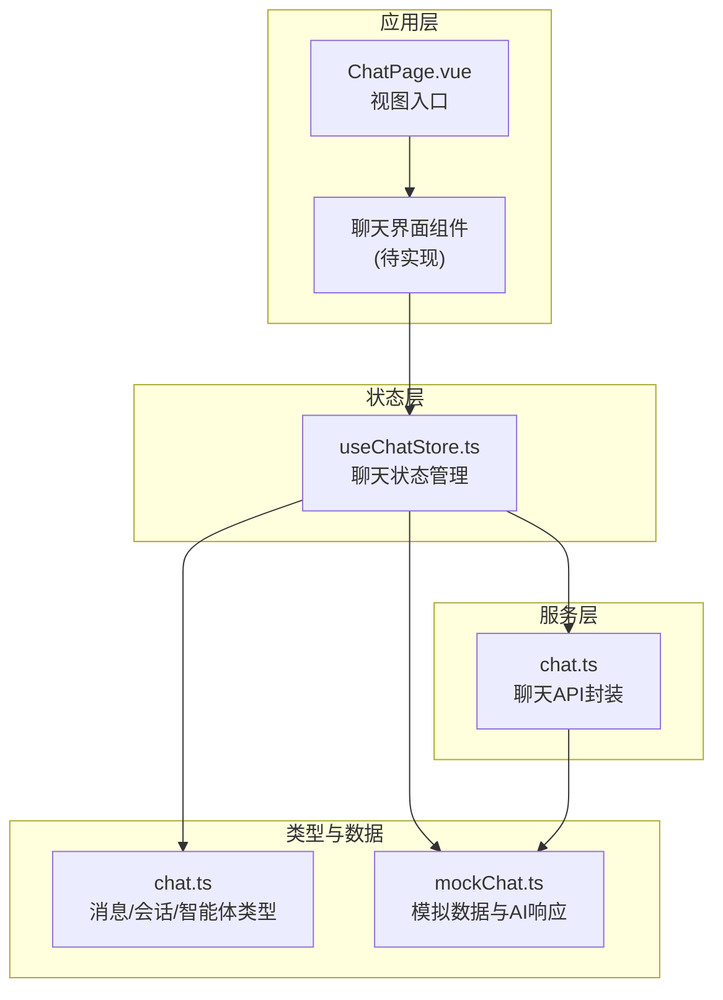
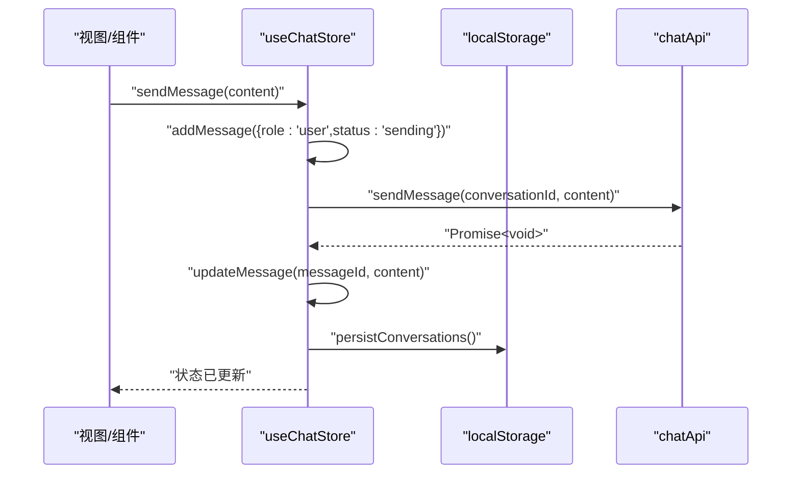
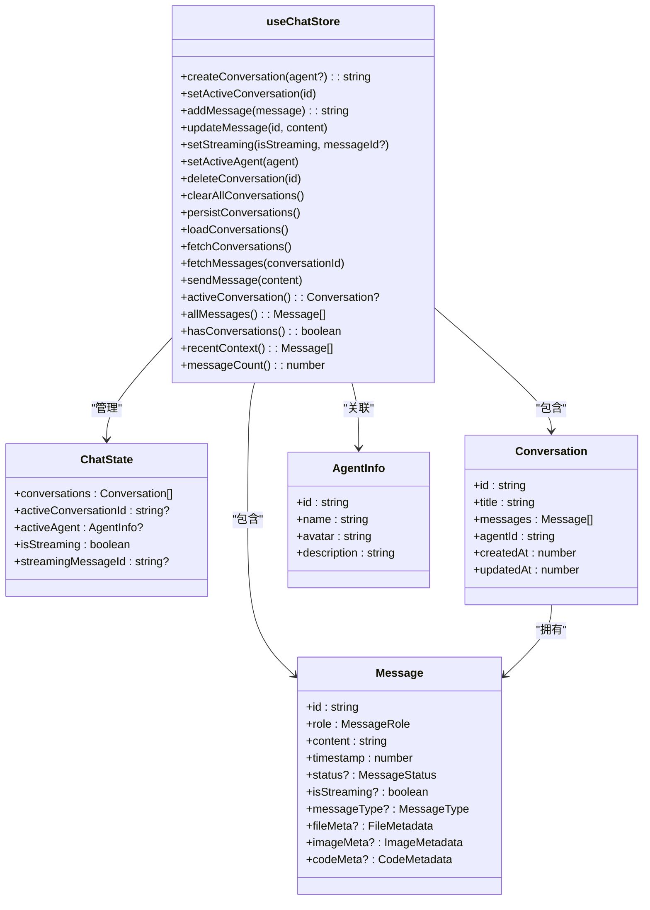
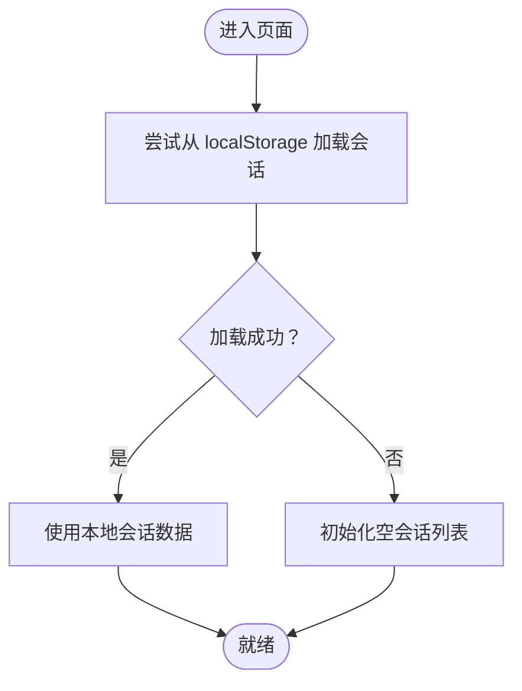
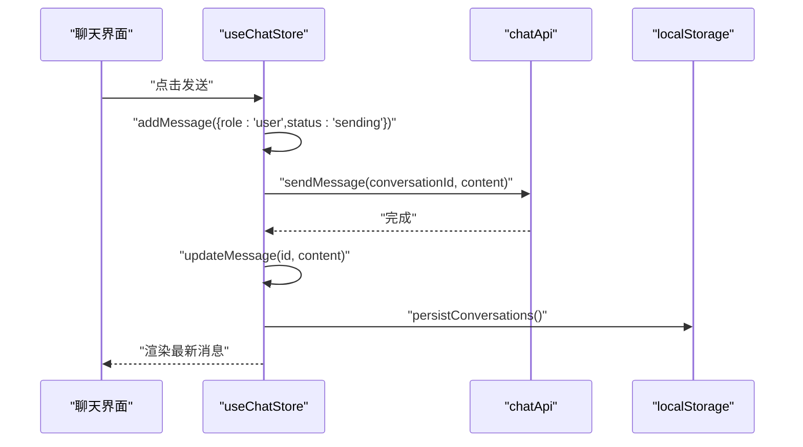
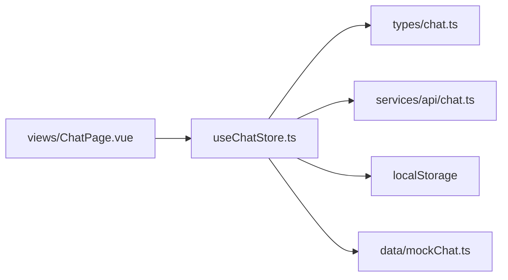

# 聊天状态模块

<cite>
**本文引用的文件**
- [useChatStore.ts](file://apps/AgentPit/src/stores/useChatStore.ts)
- [chat.ts](file://apps/AgentPit/src/types/chat.ts)
- [chat.ts](file://apps/AgentPit/src/services/api/chat.ts)
- [mockChat.ts](file://apps/AgentPit/src/data/mockChat.ts)
- [ChatPage.vue](file://apps/AgentPit/src/views/ChatPage.vue)
</cite>

## 目录
1. [简介](#简介)
2. [项目结构](#项目结构)
3. [核心组件](#核心组件)
4. [架构总览](#架构总览)
5. [详细组件分析](#详细组件分析)
6. [依赖关系分析](#依赖关系分析)
7. [性能考量](#性能考量)
8. [故障排查指南](#故障排查指南)
9. [结论](#结论)
10. [附录](#附录)

## 简介
本文件面向“聊天状态模块”的技术文档，聚焦于 useChatStore 的设计与实现，涵盖聊天会话管理、消息状态与实时通信状态的建模与更新机制。文档同时解释数据结构、消息存储与状态同步策略，并给出与 WebSocket 集成的建议路径、最佳实践（持久化、离线消息处理、性能优化），以及实际代码示例的定位路径，帮助开发者快速理解与高效使用。

## 项目结构
本模块位于 AgentPit 应用内，采用 Pinia 状态管理，围绕会话与消息两大实体构建状态模型，并通过服务层与本地存储实现数据持久化与模拟 API 调用。

**图表来源**
- [ChatPage.vue:1-8](file://apps/AgentPit/src/views/ChatPage.vue#L1-L8)
- [useChatStore.ts:1-218](file://apps/AgentPit/src/stores/useChatStore.ts#L1-L218)
- [chat.ts:1-151](file://apps/AgentPit/src/types/chat.ts#L1-L151)
- [chat.ts:1-18](file://apps/AgentPit/src/services/api/chat.ts#L1-L18)
- [mockChat.ts:1-192](file://apps/AgentPit/src/data/mockChat.ts#L1-L192)

**章节来源**
- [ChatPage.vue:1-8](file://apps/AgentPit/src/views/ChatPage.vue#L1-L8)
- [useChatStore.ts:1-218](file://apps/AgentPit/src/stores/useChatStore.ts#L1-L218)
- [chat.ts:1-151](file://apps/AgentPit/src/types/chat.ts#L1-L151)
- [chat.ts:1-18](file://apps/AgentPit/src/services/api/chat.ts#L1-L18)
- [mockChat.ts:1-192](file://apps/AgentPit/src/data/mockChat.ts#L1-L192)

## 核心组件
- useChatStore：Pinia 状态仓库，负责会话与消息的增删改查、活动会话切换、消息状态流转、本地持久化与远程数据同步。
- 类型系统：统一定义消息、会话、智能体、快捷指令等核心数据结构与状态枚举。
- API 封装：提供获取会话、获取消息、发送消息的接口，当前为模拟实现。
- 模拟数据：包含可用智能体、快捷指令、历史会话与 AI 响应库，用于演示与测试。

**章节来源**
- [useChatStore.ts:1-218](file://apps/AgentPit/src/stores/useChatStore.ts#L1-L218)
- [chat.ts:38-88](file://apps/AgentPit/src/types/chat.ts#L38-L88)
- [chat.ts:4-17](file://apps/AgentPit/src/services/api/chat.ts#L4-L17)
- [mockChat.ts:3-82](file://apps/AgentPit/src/data/mockChat.ts#L3-L82)

## 架构总览
下图展示了聊天状态模块的端到端工作流：UI 触发动作 -> 状态更新 -> 本地持久化 -> 远程 API 调用（当前为模拟）。

**图表来源**
- [useChatStore.ts:199-215](file://apps/AgentPit/src/stores/useChatStore.ts#L199-L215)
- [chat.ts:14-16](file://apps/AgentPit/src/services/api/chat.ts#L14-L16)
- [useChatStore.ts:161-163](file://apps/AgentPit/src/stores/useChatStore.ts#L161-L163)

## 详细组件分析

### useChatStore 设计与实现
- 状态结构
  - conversations：会话列表，每项包含 id、title、agentId、messages、时间戳等。
  - activeConversationId：当前活动会话标识。
  - activeAgent：当前激活的智能体信息。
  - isStreaming/streamingMessageId：流式输出状态与对应消息标识。
- Getter
  - activeConversation：按活动会话 ID 查找当前会话。
  - allMessages：返回当前会话全部消息。
  - hasConversations：是否存在会话。
  - recentContext：按最多 10 轮（assistant 完整轮次）回溯最近上下文。
  - messageCount：当前会话消息数量。
- Actions
  - createConversation(agent?)：创建新会话并设为活动，必要时记录智能体。
  - setActiveConversation(id)：切换活动会话。
  - addMessage(payload)：向当前会话追加消息，自动设置时间戳与首条用户消息标题。
  - updateMessage(id, content)：更新消息内容与状态，结束流式输出。
  - setStreaming(isStreaming, messageId?)：设置流式状态与消息标识。
  - setActiveAgent(agent)：设置活动智能体。
  - deleteConversation(id)：删除指定会话并恢复活动会话。
  - clearAllConversations()：清空并清理本地存储。
  - persistConversations()/loadConversations()：基于 localStorage 的持久化读写。
  - fetchConversations()/fetchMessages(conversationId)：从 API 拉取数据并落盘。
  - sendMessage(content)：发送消息的完整流程（本地占位 -> 远程 -> 更新）。

**图表来源**
- [useChatStore.ts:5-20](file://apps/AgentPit/src/stores/useChatStore.ts#L5-L20)
- [useChatStore.ts:65-216](file://apps/AgentPit/src/stores/useChatStore.ts#L65-L216)
- [chat.ts:38-88](file://apps/AgentPit/src/types/chat.ts#L38-L88)

**章节来源**
- [useChatStore.ts:13-218](file://apps/AgentPit/src/stores/useChatStore.ts#L13-L218)
- [chat.ts:38-88](file://apps/AgentPit/src/types/chat.ts#L38-L88)

### 数据结构与消息存储
- 消息字段：id、role、content、timestamp、status、isStreaming、messageType 及富媒体元数据（文件/图片/代码）。
- 会话字段：id、title、messages、agentId、createdAt、updatedAt。
- 存储策略：所有会话数据以 JSON 形式保存在 localStorage 中，键名固定，便于跨页面/刷新恢复。
- 加载策略：启动时尝试从本地恢复；失败则忽略并保持空状态。

**图表来源**
- [useChatStore.ts:165-174](file://apps/AgentPit/src/stores/useChatStore.ts#L165-L174)

**章节来源**
- [useChatStore.ts:161-174](file://apps/AgentPit/src/stores/useChatStore.ts#L161-L174)
- [chat.ts:38-76](file://apps/AgentPit/src/types/chat.ts#L38-L76)

### 状态更新机制与实时通信集成
- 发送流程：addMessage -> API.sendMessage -> updateMessage -> persistConversations。
- 流式状态：setStreaming(true, messageId) 标记正在流式输出；updateMessage 自动清除流式标记。
- 远程集成：当前 chatApi 为模拟实现，建议替换为真实后端或 SSE/WebSocket。

**图表来源**
- [useChatStore.ts:199-215](file://apps/AgentPit/src/stores/useChatStore.ts#L199-L215)
- [chat.ts:14-16](file://apps/AgentPit/src/services/api/chat.ts#L14-L16)

**章节来源**
- [useChatStore.ts:199-215](file://apps/AgentPit/src/stores/useChatStore.ts#L199-L215)
- [chat.ts:14-16](file://apps/AgentPit/src/services/api/chat.ts#L14-L16)

### 与 WebSocket 的集成建议
- 连接建立：在应用启动时初始化 WebSocket 连接，监听连接状态与错误。
- 消息接收：当收到服务器推送的 assistant 消息片段时，调用 setStreaming(true, messageId) 标记流式；逐段追加内容后调用 updateMessage 完成。
- 状态同步：将服务器返回的会话/消息变更映射为 store 的 actions，确保本地与远端一致。
- 断线重连：实现指数退避与队列重试，保证消息不丢失。
- 订阅频道：按会话 ID 订阅专属频道，避免无关广播干扰。

[本节为概念性建议，无需源码引用]

### 最佳实践
- 消息持久化
  - 使用统一的持久化入口（如 persistConversations），避免分散写入。
  - 在每次重要状态变更后落盘，确保崩溃/刷新可恢复。
- 离线消息处理
  - 本地维护“待发送”队列，连接恢复后批量重放。
  - 对于流式消息，采用“占位消息 + 合并更新”的策略，减少 UI 抖动。
- 性能优化
  - 消息列表虚拟化：长历史会话启用虚拟滚动。
  - 懒加载：仅在激活会话时拉取消息，其他会话延迟加载。
  - 去抖与防抖：输入联想与快捷指令触发频率控制。
  - 状态分片：将高频更新拆分为独立 store 或局部状态，降低全局重渲染。

[本节为通用实践建议，无需源码引用]

### 实际代码示例定位
- 定义与使用
  - 聊天状态定义与 getter/actions：[useChatStore.ts:13-218](file://apps/AgentPit/src/stores/useChatStore.ts#L13-L218)
  - 类型定义（消息/会话/智能体）：[chat.ts:38-88](file://apps/AgentPit/src/types/chat.ts#L38-L88)
- 数据与模拟
  - 模拟 API（会话/消息/发送）：[chat.ts:4-17](file://apps/AgentPit/src/services/api/chat.ts#L4-L17)
  - 模拟数据（智能体/快捷指令/会话/AI 响应）：[mockChat.ts:3-192](file://apps/AgentPit/src/data/mockChat.ts#L3-L192)
- 页面入口
  - 聊天页视图入口：[ChatPage.vue:1-8](file://apps/AgentPit/src/views/ChatPage.vue#L1-L8)

**章节来源**
- [useChatStore.ts:13-218](file://apps/AgentPit/src/stores/useChatStore.ts#L13-L218)
- [chat.ts:38-88](file://apps/AgentPit/src/types/chat.ts#L38-L88)
- [chat.ts:4-17](file://apps/AgentPit/src/services/api/chat.ts#L4-L17)
- [mockChat.ts:3-192](file://apps/AgentPit/src/data/mockChat.ts#L3-L192)
- [ChatPage.vue:1-8](file://apps/AgentPit/src/views/ChatPage.vue#L1-L8)

## 依赖关系分析
- 组件耦合
  - useChatStore 依赖类型定义与模拟数据，同时依赖 chatApi 进行远程同步。
  - 视图层通过组件与 store 解耦，仅通过 store 的 getter/action 交互。
- 外部依赖
  - localStorage：本地持久化。
  - chatApi：当前为模拟实现，后续需替换为真实后端或 SSE/WebSocket。
- 潜在风险
  - 模拟 API 不会触发真实网络，需在集成阶段替换。
  - 流式状态与消息更新需严格配对，避免状态错乱。

**图表来源**
- [useChatStore.ts:1-218](file://apps/AgentPit/src/stores/useChatStore.ts#L1-L218)
- [chat.ts:1-151](file://apps/AgentPit/src/types/chat.ts#L1-L151)
- [chat.ts:1-18](file://apps/AgentPit/src/services/api/chat.ts#L1-L18)
- [mockChat.ts:1-192](file://apps/AgentPit/src/data/mockChat.ts#L1-L192)
- [ChatPage.vue:1-8](file://apps/AgentPit/src/views/ChatPage.vue#L1-L8)

**章节来源**
- [useChatStore.ts:1-218](file://apps/AgentPit/src/stores/useChatStore.ts#L1-L218)
- [chat.ts:1-151](file://apps/AgentPit/src/types/chat.ts#L1-L151)
- [chat.ts:1-18](file://apps/AgentPit/src/services/api/chat.ts#L1-L18)
- [mockChat.ts:1-192](file://apps/AgentPit/src/data/mockChat.ts#L1-L192)
- [ChatPage.vue:1-8](file://apps/AgentPit/src/views/ChatPage.vue#L1-L8)

## 性能考量
- 渲染性能
  - 对长消息列表启用虚拟滚动，限制可见节点数量。
  - 将消息内容渲染与元数据渲染分离，避免重复计算。
- 状态更新
  - 使用局部状态缓存高频字段，减少全局 store 的变更频率。
  - 合并连续更新（如多轮流式片段）为单次提交。
- 网络与存储
  - 批量持久化：合并多次变更后再写入 localStorage。
  - 请求去重：对相同参数的请求进行缓存与去重。
- 内存管理
  - 限制会话保留数量与消息上限，定期清理过期会话。
  - 对富媒体资源采用懒加载与 CDN 缓存。

[本节为通用性能建议，无需源码引用]

## 故障排查指南
- 无法加载历史会话
  - 检查 localStorage 键名与 JSON 格式；若损坏则清空并重建。
  - 参考：[useChatStore.ts:165-174](file://apps/AgentPit/src/stores/useChatStore.ts#L165-L174)
- 发送消息无响应
  - 确认存在活动会话；检查 chatApi 是否正确实现；查看控制台错误。
  - 参考：[useChatStore.ts:199-215](file://apps/AgentPit/src/stores/useChatStore.ts#L199-L215)，[chat.ts:14-16](file://apps/AgentPit/src/services/api/chat.ts#L14-L16)
- 流式状态异常
  - 确保 setStreaming 与 updateMessage 成对调用；检查 messageId 是否匹配。
  - 参考：[useChatStore.ts:134-137](file://apps/AgentPit/src/stores/useChatStore.ts#L134-L137)，[useChatStore.ts:120-132](file://apps/AgentPit/src/stores/useChatStore.ts#L120-L132)
- 数据不一致
  - 在 fetchConversations/fetchMessages 后统一调用 persistConversations。
  - 参考：[useChatStore.ts:176-197](file://apps/AgentPit/src/stores/useChatStore.ts#L176-L197)

**章节来源**
- [useChatStore.ts:165-197](file://apps/AgentPit/src/stores/useChatStore.ts#L165-L197)
- [chat.ts:14-16](file://apps/AgentPit/src/services/api/chat.ts#L14-L16)

## 结论
useChatStore 提供了清晰的聊天状态模型与完善的状态管理能力，覆盖会话生命周期、消息状态与本地持久化。当前 API 为模拟实现，建议尽快接入真实后端或 WebSocket/SSE，以实现真正的实时通信与状态同步。配合虚拟化渲染、批量持久化与去重策略，可在大规模使用场景下保持良好性能与稳定性。

## 附录
- 快速上手
  - 在视图中引入 store，调用 createConversation/setActiveConversation 初始化会话。
  - 使用 sendMessage 发送消息，观察本地占位与最终更新。
  - 通过 getters 如 recentContext/allMessages 获取上下文与消息列表。
- 调试技巧
  - 在浏览器开发者工具的 Vuex/Pinia 面板观察状态变化。
  - 检查 localStorage 中的会话数据是否按预期更新。
  - 使用网络面板确认 chatApi 的调用与返回。

[本节为补充说明，无需源码引用]