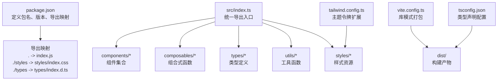
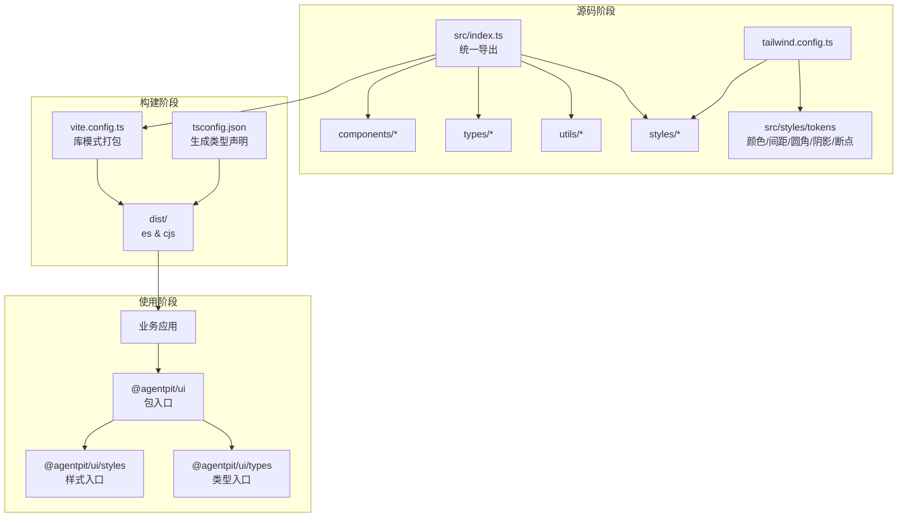
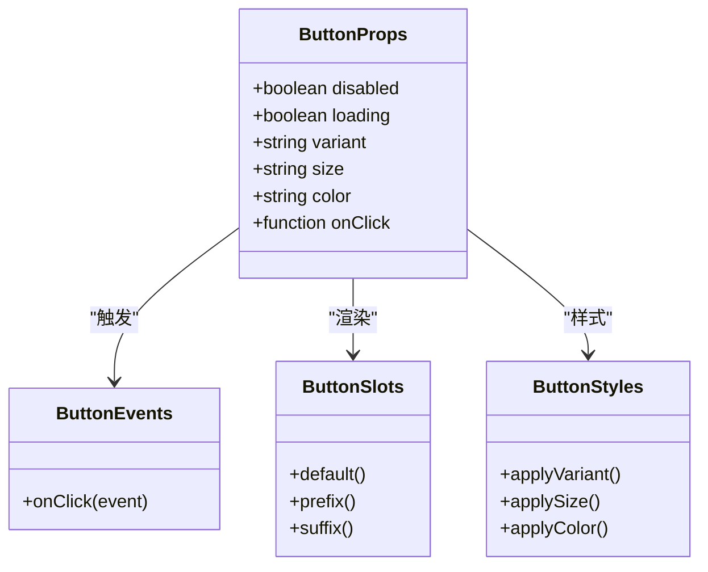
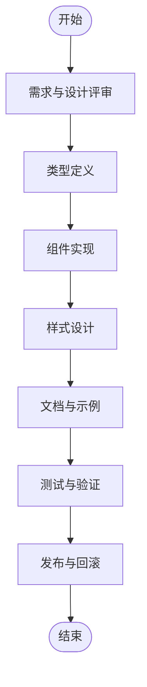
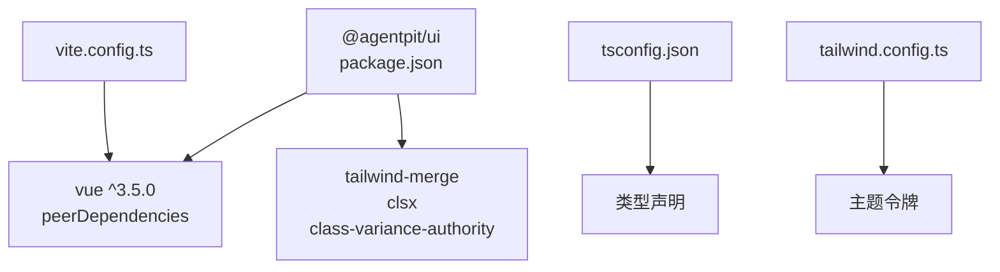

# UI组件库设计

<cite>
**本文档引用的文件**
- [package.json](file://apps/AgentPit/packages/ui/package.json)
- [index.ts](file://apps/AgentPit/packages/ui/src/index.ts)
- [index.md](file://apps/AgentPit/packages/ui/docs/index.md)
- [README.md](file://apps/AgentPit/packages/ui/README.md)
- [tailwind.config.ts](file://apps/AgentPit/packages/ui/tailwind.config.ts)
- [tsconfig.json](file://apps/AgentPit/packages/ui/tsconfig.json)
- [vite.config.ts](file://apps/AgentPit/packages/ui/vite.config.ts)
- [utils/index.ts](file://apps/AgentPit/packages/ui/src/utils/index.ts)
- [types/index.ts](file://apps/AgentPit/packages/ui/src/types/index.ts)
</cite>

## 目录
1. [引言](#引言)
2. [项目结构](#项目结构)
3. [核心组件](#核心组件)
4. [架构总览](#架构总览)
5. [详细组件分析](#详细组件分析)
6. [依赖分析](#依赖分析)
7. [性能考虑](#性能考虑)
8. [故障排除指南](#故障排除指南)
9. [结论](#结论)
10. [附录](#附录)

## 引言
本文件面向AgentPit智能体平台的UI组件库设计，聚焦于组件库的整体架构、组件分类体系、命名规范与导出机制，并以Button等核心组件为例，阐述Props定义、事件处理、插槽使用与样式定制方式。同时提供组件开发标准流程（创建、类型定义、样式设计、文档编写）以及最佳实践示例路径，帮助开发者在统一接口下实现高复用性与多场景适配。

## 项目结构
AgentPit UI组件库采用模块化组织，核心由以下部分构成：
- 包管理与导出：通过包配置定义入口与导出映射，支持ESM与CJS两种格式。
- 源码组织：src目录下按功能域划分组件、组合式函数、类型、工具与样式资源。
- 构建与文档：Vite用于打包，VitePress用于文档站点，TypeScript进行类型声明生成。
- 设计系统：Tailwind CSS作为原子化样式基础，配合主题令牌扩展。

**图表来源**
- [package.json:12-19](file://apps/AgentPit/packages/ui/package.json#L12-L19)
- [src/index.ts:1-6](file://apps/AgentPit/packages/ui/src/index.ts#L1-L6)
- [vite.config.ts:8-13](file://apps/AgentPit/packages/ui/vite.config.ts#L8-L13)
- [tsconfig.json:14-16](file://apps/AgentPit/packages/ui/tsconfig.json#L14-L16)
- [tailwind.config.ts:9-16](file://apps/AgentPit/packages/ui/tailwind.config.ts#L9-L16)

**章节来源**
- [package.json:1-58](file://apps/AgentPit/packages/ui/package.json#L1-L58)
- [src/index.ts:1-6](file://apps/AgentPit/packages/ui/src/index.ts#L1-L6)
- [vite.config.ts:1-30](file://apps/AgentPit/packages/ui/vite.config.ts#L1-L30)
- [tsconfig.json:1-29](file://apps/AgentPit/packages/ui/tsconfig.json#L1-L29)
- [tailwind.config.ts:1-20](file://apps/AgentPit/packages/ui/tailwind.config.ts#L1-L20)

## 核心组件
根据组件库文档，核心组件包括：Button、Card、Input、Avatar、Badge、Modal、Dropdown、Tabs、Loader、Toast。这些组件共同构成平台的基础视觉与交互层，支持一致的设计语言与可复用的交互模式。

- 组件分类体系
  - 行为类：Button、Dropdown、Tabs、Modal
  - 内容类：Card、Input、Avatar、Badge
  - 反馈类：Loader、Toast
- 命名规范
  - 组件文件与导出遵循大驼峰命名（如 Button.vue），便于在模板中直接使用。
  - 类型与工具采用小驼峰命名，保持与TS约定一致。
- 导出机制
  - 通过src/index.ts集中导出各域内容，简化外部导入路径。
  - 包级exports明确区分运行时入口、样式入口与类型入口，便于按需加载。

**章节来源**
- [index.md:34-46](file://apps/AgentPit/packages/ui/docs/index.md#L34-L46)
- [src/index.ts:1-6](file://apps/AgentPit/packages/ui/src/index.ts#L1-L6)
- [package.json:12-19](file://apps/AgentPit/packages/ui/package.json#L12-L19)

## 架构总览
组件库整体架构围绕“统一入口 + 分域组织 + 主题扩展 + 构建分发”展开。下图展示了从源码到产物的关键流转：

**图表来源**
- [src/index.ts:1-6](file://apps/AgentPit/packages/ui/src/index.ts#L1-L6)
- [vite.config.ts:8-13](file://apps/AgentPit/packages/ui/vite.config.ts#L8-L13)
- [tsconfig.json:14-16](file://apps/AgentPit/packages/ui/tsconfig.json#L14-L16)
- [tailwind.config.ts:2](file://apps/AgentPit/packages/ui/tailwind.config.ts#L2)
- [package.json:12-19](file://apps/AgentPit/packages/ui/package.json#L12-L19)

## 详细组件分析

### Button组件设计要点
Button作为最常用的交互元素，其设计应兼顾一致性、可访问性与可定制性。以下从实现维度拆解其关键要素：

- Props定义
  - 状态属性：禁用态、加载态、选中态等，用于控制渲染状态与交互反馈。
  - 视觉属性：尺寸、外观变体（主按钮、次按钮、危险、文本等）、颜色语义。
  - 行为属性：点击回调、跳转链接、表单提交等。
- 事件处理
  - 封装原生事件（如点击、键盘事件），确保在禁用态下不触发回调。
  - 对外暴露标准化事件（如onClick），避免直接依赖DOM细节。
- 插槽使用
  - 支持默认插槽承载按钮文本；支持前置/后置图标插槽，增强语义表达。
- 样式定制
  - 基于Tailwind原子类与主题令牌组合，保证全局风格一致。
  - 通过变体工厂（variant）与条件类合并（clsx/tailwind-merge）实现安全覆盖。
- 可复用性设计原则
  - 以最小必要Props支撑多场景：表单、导航、操作面板、对话框等。
  - 通过组合式函数（composables）封装通用逻辑（如节流、防抖、无障碍标签）。
  - 保持无副作用：不直接操作全局状态，仅通过事件向外传递。

**图表来源**
- [index.md:36](file://apps/AgentPit/packages/ui/docs/index.md#L36)

**章节来源**
- [index.md:36](file://apps/AgentPit/packages/ui/docs/index.md#L36)
- [utils/index.ts:1](file://apps/AgentPit/packages/ui/src/utils/index.ts#L1)
- [types/index.ts:1-3](file://apps/AgentPit/packages/ui/src/types/index.ts#L1-L3)

### 组件开发标准流程
为确保组件质量与一致性，建议遵循以下流程：
1. 需求与设计评审
   - 明确使用场景、交互语义与可访问性要求。
   - 输出组件API草稿（Props/Events/Slots/Classes）。
2. 类型定义先行
   - 在types域定义Props与事件类型，确保TS完整推断。
3. 组件实现
   - 优先实现默认态，再逐步添加变体与交互。
   - 使用组合式函数封装可复用逻辑。
4. 样式设计
   - 基于主题令牌与原子类，避免硬编码样式值。
   - 通过变体工厂与类名合并工具保证覆盖顺序与冲突解决。
5. 文档与示例
   - 编写组件文档页面，包含API说明、使用示例与最佳实践。
   - 提供暗色/亮色主题下的对比示例。
6. 测试与验证
   - 单元测试覆盖关键分支与边界条件。
   - 端到端测试验证真实交互链路。
7. 发布与回滚
   - 通过CI/CD自动发布，保留变更日志与兼容性说明。

[本图为概念性流程图，无需图表来源]

## 依赖分析
组件库对外部依赖与内部耦合关系如下：

**图表来源**
- [package.json:31-39](file://apps/AgentPit/packages/ui/package.json#L31-L39)
- [vite.config.ts:14-20](file://apps/AgentPit/packages/ui/vite.config.ts#L14-L20)
- [tsconfig.json:14-16](file://apps/AgentPit/packages/ui/tsconfig.json#L14-L16)
- [tailwind.config.ts:2](file://apps/AgentPit/packages/ui/tailwind.config.ts#L2)

**章节来源**
- [package.json:31-39](file://apps/AgentPit/packages/ui/package.json#L31-L39)
- [vite.config.ts:14-20](file://apps/AgentPit/packages/ui/vite.config.ts#L14-L20)
- [tsconfig.json:14-16](file://apps/AgentPit/packages/ui/tsconfig.json#L14-L16)
- [tailwind.config.ts:2](file://apps/AgentPit/packages/ui/tailwind.config.ts#L2)

## 性能考虑
- 构建优化
  - 库模式打包输出ES与CJS双格式，满足不同运行时环境。
  - 外部化Vue及其生态依赖，减少重复打包体积。
- 运行时优化
  - 使用原子类与主题令牌，避免运行时样式计算开销。
  - 通过变体工厂与类名合并工具，降低CSS覆盖复杂度。
- 文档与示例
  - 使用VitePress构建静态文档，提升加载速度与SEO友好度。

**章节来源**
- [vite.config.ts:8-13](file://apps/AgentPit/packages/ui/vite.config.ts#L8-L13)
- [vite.config.ts:14-20](file://apps/AgentPit/packages/ui/vite.config.ts#L14-L20)
- [package.json:20-29](file://apps/AgentPit/packages/ui/package.json#L20-L29)

## 故障排除指南
- 导入路径问题
  - 确认使用包级导出而非直接引用内部文件，避免破坏打包结构。
  - 如需样式，务必引入样式入口；如需类型，引入types入口。
- 样式不生效
  - 检查是否正确引入样式入口与Tailwind配置中的content范围。
  - 确认主题令牌已正确扩展至Tailwind配置。
- 类名冲突
  - 使用类名合并工具保证覆盖顺序，避免相互覆盖导致的样式错乱。
- 构建失败
  - 确保TypeScript声明生成开启且输出目录正确。
  - 检查Vite库模式配置与Rollup外部化设置。

**章节来源**
- [package.json:12-19](file://apps/AgentPit/packages/ui/package.json#L12-L19)
- [tailwind.config.ts:4-8](file://apps/AgentPit/packages/ui/tailwind.config.ts#L4-L8)
- [tsconfig.json:14-16](file://apps/AgentPit/packages/ui/tsconfig.json#L14-L16)
- [vite.config.ts:14-20](file://apps/AgentPit/packages/ui/vite.config.ts#L14-L20)

## 结论
AgentPit UI组件库通过清晰的分域组织、统一的导出机制与Tailwind主题系统，实现了高内聚、低耦合的组件架构。以Button为代表的组件在Props、事件、插槽与样式方面提供了良好的可复用性与可定制性。遵循本文提供的开发流程与最佳实践，可在保证一致性的同时快速扩展组件能力，支撑AgentPit平台多样化的业务场景。

## 附录
- 快速开始与使用示例路径
  - 安装与基础使用：[README.md:5-22](file://apps/AgentPit/packages/ui/README.md#L5-L22)
  - 组件列表与特性概览：[index.md:34-46](file://apps/AgentPit/packages/ui/docs/index.md#L34-L46)
- 开发与构建命令
  - 开发模式、构建、文档开发与预览：[package.json:20-29](file://apps/AgentPit/packages/ui/package.json#L20-L29)
- 主题与样式
  - Tailwind配置与主题令牌扩展：[tailwind.config.ts:9-16](file://apps/AgentPit/packages/ui/tailwind.config.ts#L9-L16)
- 类型与工具
  - 类型入口聚合：[types/index.ts:1-3](file://apps/AgentPit/packages/ui/src/types/index.ts#L1-L3)
  - 工具函数入口（类名合并等）：[utils/index.ts:1](file://apps/AgentPit/packages/ui/src/utils/index.ts#L1)