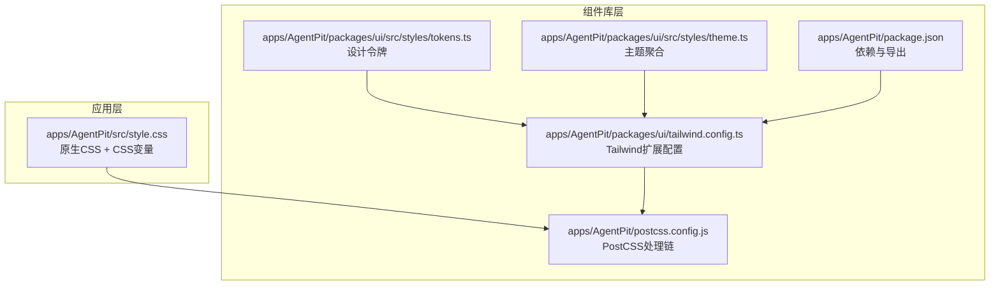
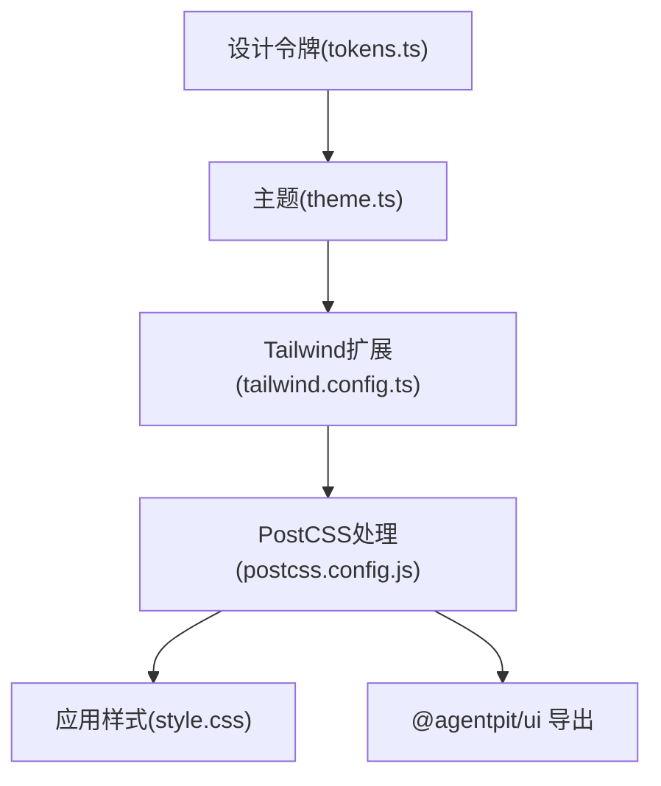
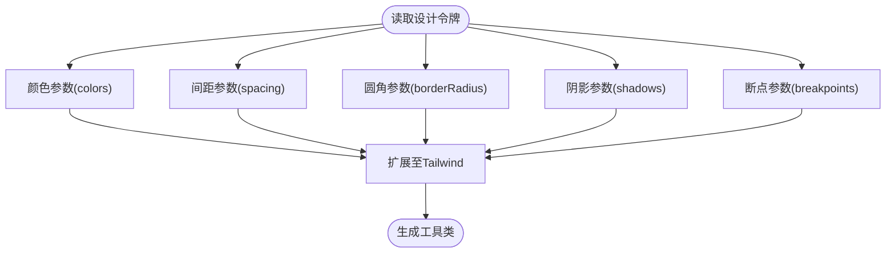
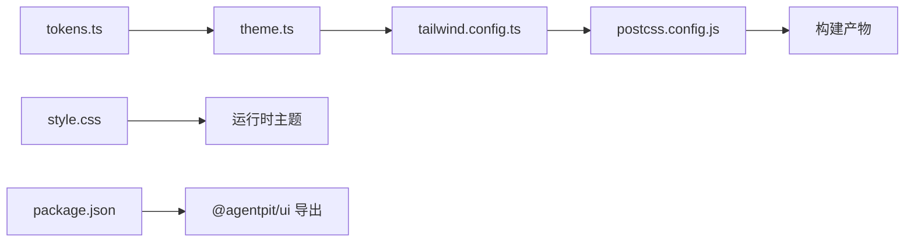

# 样式系统设计

<cite>
**本文引用的文件**
- [apps/AgentPit/packages/ui/tailwind.config.ts](file://apps/AgentPit/packages/ui/tailwind.config.ts)
- [apps/AgentPit/packages/ui/src/styles/theme.ts](file://apps/AgentPit/packages/ui/src/styles/theme.ts)
- [apps/AgentPit/packages/ui/src/styles/tokens.ts](file://apps/AgentPit/packages/ui/src/styles/tokens.ts)
- [apps/AgentPit/src/style.css](file://apps/AgentPit/src/style.css)
- [apps/AgentPit/postcss.config.js](file://apps/AgentPit/postcss.config.js)
- [apps/AgentPit/package.json](file://apps/AgentPit/package.json)
- [apps/AgentPit/e2e/theme-switching.spec.ts](file://apps/AgentPit/e2e/theme-switching.spec.ts)
</cite>

## 目录
1. [引言](#引言)
2. [项目结构](#项目结构)
3. [核心组件](#核心组件)
4. [架构总览](#架构总览)
5. [详细组件分析](#详细组件分析)
6. [依赖关系分析](#依赖关系分析)
7. [性能考量](#性能考量)
8. [故障排查指南](#故障排查指南)
9. [结论](#结论)
10. [附录](#附录)

## 引言
本文件面向AgentPit智能体平台的样式系统，系统性阐述主题定制、设计令牌与样式组织原则，并深入解析以下关键点：
- 主题配置机制（theme.ts）：颜色系统、字体规范、间距标准
- 设计令牌（tokens.ts）：统一令牌体系如何实现样式标准化与一致性
- TailwindCSS集成与配置：自定义样式、响应式设计、组件样式隔离
- 样式开发最佳实践：命名规范、主题切换、性能优化
- 实际使用示例路径：展示样式系统的使用方法与定制技巧

## 项目结构
AgentPit的样式系统由两部分组成：
- 应用层样式：以原生CSS为主，结合CSS变量实现深浅色主题与基础排版
- 组件库层样式：基于TailwindCSS的设计令牌扩展，提供可复用的主题与工具类

图表来源
- [apps/AgentPit/src/style.css:1-295](file://apps/AgentPit/src/style.css#L1-L295)
- [apps/AgentPit/packages/ui/src/styles/tokens.ts:1-121](file://apps/AgentPit/packages/ui/src/styles/tokens.ts#L1-L121)
- [apps/AgentPit/packages/ui/src/styles/theme.ts:1-12](file://apps/AgentPit/packages/ui/src/styles/theme.ts#L1-L12)
- [apps/AgentPit/packages/ui/tailwind.config.ts:1-20](file://apps/AgentPit/packages/ui/tailwind.config.ts#L1-L20)
- [apps/AgentPit/postcss.config.js](file://apps/AgentPit/postcss.config.js)
- [apps/AgentPit/package.json:1-58](file://apps/AgentPit/package.json#L1-L58)

章节来源
- [apps/AgentPit/src/style.css:1-295](file://apps/AgentPit/src/style.css#L1-L295)
- [apps/AgentPit/packages/ui/src/styles/tokens.ts:1-121](file://apps/AgentPit/packages/ui/src/styles/tokens.ts#L1-L121)
- [apps/AgentPit/packages/ui/src/styles/theme.ts:1-12](file://apps/AgentPit/packages/ui/src/styles/theme.ts#L1-L12)
- [apps/AgentPit/packages/ui/tailwind.config.ts:1-20](file://apps/AgentPit/packages/ui/tailwind.config.ts#L1-L20)
- [apps/AgentPit/postcss.config.js](file://apps/AgentPit/postcss.config.js)
- [apps/AgentPit/package.json:1-58](file://apps/AgentPit/package.json#L1-L58)

## 核心组件
- 设计令牌（tokens.ts）
  - 定义颜色、间距、圆角、阴影、断点等原子化设计参数
  - 提供统一的数据源，确保跨组件与跨页面的一致性
- 主题聚合（theme.ts）
  - 将设计令牌打包为主题对象，便于在组件库中直接消费
- Tailwind扩展（tailwind.config.ts）
  - 将设计令牌映射到Tailwind的colors、spacing、borderRadius、boxShadow、screens
  - 支持通过工具类快速应用主题参数
- 应用层样式（style.css）
  - 使用CSS变量实现深浅主题切换
  - 定义基础排版、布局与交互态
- 构建链路（postcss.config.js、package.json）
  - PostCSS处理Tailwind指令与浏览器兼容
  - package.json声明组件库导出与依赖

章节来源
- [apps/AgentPit/packages/ui/src/styles/tokens.ts:1-121](file://apps/AgentPit/packages/ui/src/styles/tokens.ts#L1-L121)
- [apps/AgentPit/packages/ui/src/styles/theme.ts:1-12](file://apps/AgentPit/packages/ui/src/styles/theme.ts#L1-L12)
- [apps/AgentPit/packages/ui/tailwind.config.ts:1-20](file://apps/AgentPit/packages/ui/tailwind.config.ts#L1-L20)
- [apps/AgentPit/src/style.css:1-295](file://apps/AgentPit/src/style.css#L1-L295)
- [apps/AgentPit/postcss.config.js](file://apps/AgentPit/postcss.config.js)
- [apps/AgentPit/package.json:1-58](file://apps/AgentPit/package.json#L1-L58)

## 架构总览
样式系统采用“令牌驱动 + Tailwind扩展 + 原生CSS变量”的分层架构：
- 令牌层：集中管理设计参数
- 扩展层：将令牌注入Tailwind，生成工具类
- 应用层：通过CSS变量与原生样式实现主题切换与基础排版
- 构建层：PostCSS处理与打包导出

图表来源
- [apps/AgentPit/packages/ui/src/styles/tokens.ts:1-121](file://apps/AgentPit/packages/ui/src/styles/tokens.ts#L1-L121)
- [apps/AgentPit/packages/ui/src/styles/theme.ts:1-12](file://apps/AgentPit/packages/ui/src/styles/theme.ts#L1-L12)
- [apps/AgentPit/packages/ui/tailwind.config.ts:1-20](file://apps/AgentPit/packages/ui/tailwind.config.ts#L1-L20)
- [apps/AgentPit/postcss.config.js](file://apps/AgentPit/postcss.config.js)
- [apps/AgentPit/src/style.css:1-295](file://apps/AgentPit/src/style.css#L1-L295)
- [apps/AgentPit/package.json:1-58](file://apps/AgentPit/package.json#L1-L58)

## 详细组件分析

### 设计令牌（tokens.ts）
- 颜色系统
  - 提供主色、强调色、成功、警告、危险、灰度等语义化色阶
  - 每个色阶包含多级透明度或强度，满足不同层级与状态需求
- 间距系统
  - 以4px为基准的离散步进，覆盖从微小到大间隔的全场景
- 圆角系统
  - 从无到全圆角的连续过渡，适配按钮、卡片、弹窗等组件
- 阴影系统
  - 提供从轻微到显著的阴影层次，支撑卡片与浮层的视觉深度
- 断点系统
  - 覆盖移动端到超宽屏的响应式断点，保证布局一致性

图表来源
- [apps/AgentPit/packages/ui/src/styles/tokens.ts:1-121](file://apps/AgentPit/packages/ui/src/styles/tokens.ts#L1-L121)
- [apps/AgentPit/packages/ui/tailwind.config.ts:1-20](file://apps/AgentPit/packages/ui/tailwind.config.ts#L1-L20)

章节来源
- [apps/AgentPit/packages/ui/src/styles/tokens.ts:1-121](file://apps/AgentPit/packages/ui/src/styles/tokens.ts#L1-L121)

### 主题聚合（theme.ts）
- 将设计令牌整合为统一主题对象，便于在组件库中按需导入
- 作为tokens.ts的上层封装，减少重复引用与命名冲突

章节来源
- [apps/AgentPit/packages/ui/src/styles/theme.ts:1-12](file://apps/AgentPit/packages/ui/src/styles/theme.ts#L1-L12)

### Tailwind扩展（tailwind.config.ts）
- 内容扫描范围限定于应用源码，避免无用样式进入产物
- 将设计令牌映射到Tailwind的内置键位，生成工具类
- 保持插件数组为空，降低复杂度并提升构建稳定性

章节来源
- [apps/AgentPit/packages/ui/tailwind.config.ts:1-20](file://apps/AgentPit/packages/ui/tailwind.config.ts#L1-L20)

### 应用层样式（style.css）
- CSS变量驱动的主题切换
  - 在根元素定义主题变量，深色模式通过媒体查询覆盖变量值
  - 用于文本、背景、边框、强调色、阴影等全局主题
- 基础排版与布局
  - 定义字号、行高、字距、字体族等基础规范
  - 通过容器与网格实现响应式布局
- 交互态与可访问性
  - 为按钮、链接等提供悬停、聚焦等状态样式
  - 使用CSS变量统一强调色与边框，确保一致的视觉反馈

章节来源
- [apps/AgentPit/src/style.css:1-295](file://apps/AgentPit/src/style.css#L1-L295)

### 构建链路（postcss.config.js、package.json）
- PostCSS负责处理Tailwind指令与浏览器兼容
- package.json声明组件库导出路径与依赖，支持外部消费

章节来源
- [apps/AgentPit/postcss.config.js](file://apps/AgentPit/postcss.config.js)
- [apps/AgentPit/package.json:1-58](file://apps/AgentPit/package.json#L1-L58)

## 依赖关系分析
- tokens.ts → theme.ts → tailwind.config.ts
- tailwind.config.ts → postcss.config.js → 构建产物
- style.css → 应用运行时主题切换
- package.json → 组件库导出与依赖管理

图表来源
- [apps/AgentPit/packages/ui/src/styles/tokens.ts:1-121](file://apps/AgentPit/packages/ui/src/styles/tokens.ts#L1-L121)
- [apps/AgentPit/packages/ui/src/styles/theme.ts:1-12](file://apps/AgentPit/packages/ui/src/styles/theme.ts#L1-L12)
- [apps/AgentPit/packages/ui/tailwind.config.ts:1-20](file://apps/AgentPit/packages/ui/tailwind.config.ts#L1-L20)
- [apps/AgentPit/postcss.config.js](file://apps/AgentPit/postcss.config.js)
- [apps/AgentPit/src/style.css:1-295](file://apps/AgentPit/src/style.css#L1-L295)
- [apps/AgentPit/package.json:1-58](file://apps/AgentPit/package.json#L1-L58)

章节来源
- [apps/AgentPit/packages/ui/src/styles/tokens.ts:1-121](file://apps/AgentPit/packages/ui/src/styles/tokens.ts#L1-L121)
- [apps/AgentPit/packages/ui/src/styles/theme.ts:1-12](file://apps/AgentPit/packages/ui/src/styles/theme.ts#L1-L12)
- [apps/AgentPit/packages/ui/tailwind.config.ts:1-20](file://apps/AgentPit/packages/ui/tailwind.config.ts#L1-L20)
- [apps/AgentPit/src/style.css:1-295](file://apps/AgentPit/src/style.css#L1-L295)
- [apps/AgentPit/postcss.config.js](file://apps/AgentPit/postcss.config.js)
- [apps/AgentPit/package.json:1-58](file://apps/AgentPit/package.json#L1-L58)

## 性能考量
- 仅在需要时引入Tailwind内容扫描范围，避免无用样式进入产物
- 使用CSS变量进行主题切换，避免重复定义与构建开销
- 通过断点与工具类减少自定义样式的编写量，提升维护效率
- 在组件库中优先使用工具类而非内联样式，降低CSS体积

## 故障排查指南
- 主题不生效
  - 检查style.css中的CSS变量是否正确覆盖
  - 确认tailwind.config.ts已正确扩展colors/spacing等键位
- 工具类无效
  - 确认tailwind.config.ts的内容扫描路径包含当前文件
  - 检查postcss.config.js是否正确加载Tailwind
- 主题切换测试
  - 参考端到端测试用例，验证深浅主题下的变量覆盖与渲染结果

章节来源
- [apps/AgentPit/e2e/theme-switching.spec.ts](file://apps/AgentPit/e2e/theme-switching.spec.ts)

## 结论
AgentPit的样式系统通过“设计令牌 + Tailwind扩展 + 原生CSS变量”的组合，实现了：
- 统一的设计语言与一致的视觉体验
- 高效的主题定制与响应式布局能力
- 易维护、可扩展的样式组织方式

## 附录

### 样式开发最佳实践
- 命名规范
  - 使用语义化类名，避免过度依赖原子类
  - 对组件样式进行命名空间隔离，防止冲突
- 主题切换
  - 优先使用CSS变量承载主题差异，其次再考虑Tailwind工具类
  - 在深色模式下保持对比度与可读性
- 性能优化
  - 合理拆分样式模块，按需加载
  - 减少内联样式的使用，优先使用工具类与CSS变量

### 实际使用示例（示例路径）
- 在组件中使用Tailwind工具类应用主题参数
  - 示例路径：[apps/AgentPit/packages/ui/tailwind.config.ts:1-20](file://apps/AgentPit/packages/ui/tailwind.config.ts#L1-L20)
- 通过CSS变量实现主题切换
  - 示例路径：[apps/AgentPit/src/style.css:34-51](file://apps/AgentPit/src/style.css#L34-L51)
- 在组件库中引用主题对象
  - 示例路径：[apps/AgentPit/packages/ui/src/styles/theme.ts:1-12](file://apps/AgentPit/packages/ui/src/styles/theme.ts#L1-L12)
- 自定义设计令牌并扩展Tailwind
  - 示例路径：[apps/AgentPit/packages/ui/src/styles/tokens.ts:1-121](file://apps/AgentPit/packages/ui/src/styles/tokens.ts#L1-L121)