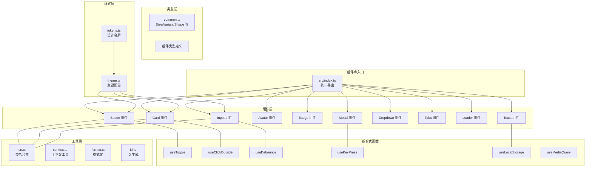
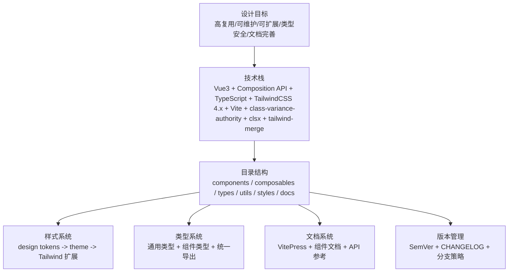
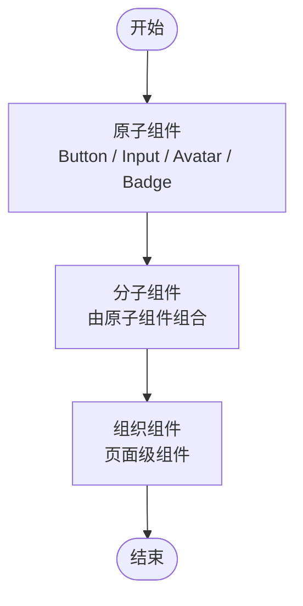
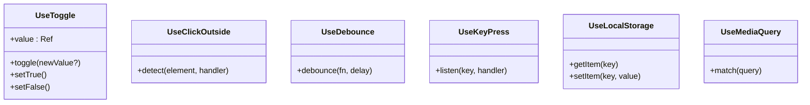
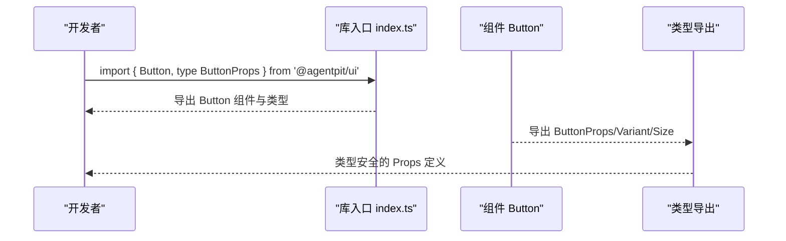
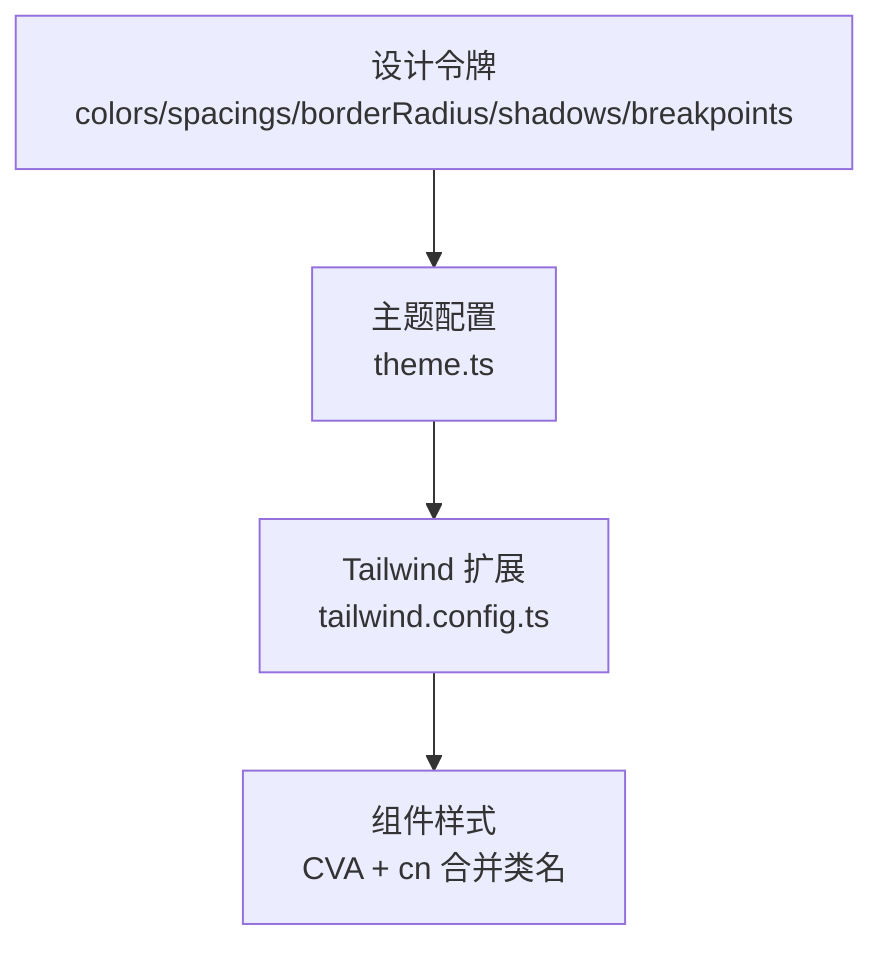
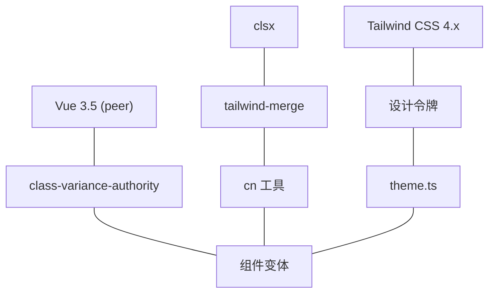

# 组件架构设计

<cite>
**本文引用的文件**
- [COMPONENT_LIBRARY_ARCHITECTURE.md](file://apps/AgentPit/docs/COMPONENT_LIBRARY_ARCHITECTURE.md)
- [VUE3_COMPONENT_GUIDE.md](file://apps/AgentPit/docs/VUE3_COMPONENT_GUIDE.md)
- [README.md](file://apps/AgentPit/packages/ui/README.md)
- [package.json](file://apps/AgentPit/packages/ui/package.json)
- [index.ts](file://apps/AgentPit/packages/ui/src/index.ts)
- [cn.ts](file://apps/AgentPit/packages/ui/src/utils/cn.ts)
- [useToggle.ts](file://apps/AgentPit/packages/ui/src/composables/useToggle.ts)
- [common.ts](file://apps/AgentPit/packages/ui/src/types/common.ts)
- [theme.ts](file://apps/AgentPit/packages/ui/src/styles/theme.ts)
</cite>

## 目录
1. [引言](#引言)
2. [项目结构](#项目结构)
3. [核心组件](#核心组件)
4. [架构总览](#架构总览)
5. [详细组件分析](#详细组件分析)
6. [依赖分析](#依赖分析)
7. [性能考量](#性能考量)
8. [故障排查指南](#故障排查指南)
9. [结论](#结论)
10. [附录](#附录)

## 引言
本文件面向 AgentPit 智能体平台的组件架构设计，系统阐述 UI 组件库的设计理念、组件分类体系、组合式 API 使用模式、层次结构与依赖关系、复用机制、响应式设计与主题定制、无障碍支持建议，以及组件开发最佳实践与示例路径。文档同时结合仓库中的架构设计文档与 Vue3 组件开发指南，帮助开发者高效理解并参与组件库的建设与使用。

## 项目结构
AgentPit UI 组件库采用“按功能分层”的模块化组织方式，核心目录包括：
- 组件层：原子组件（Button、Input、Avatar 等）、分子组件（由原子组件组合）、组织组件（页面级）
- 组合式函数层：useToggle、useClickOutside、useDebounce 等可复用逻辑
- 类型层：通用类型与组件类型定义
- 工具层：cn 类名合并、上下文创建、格式化、ID 生成等
- 样式层：设计令牌、主题配置、Tailwind 扩展

图表来源
- [COMPONENT_LIBRARY_ARCHITECTURE.md:28-93](file://apps/AgentPit/docs/COMPONENT_LIBRARY_ARCHITECTURE.md#L28-L93)
- [index.ts:1-6](file://apps/AgentPit/packages/ui/src/index.ts#L1-L6)

章节来源
- [COMPONENT_LIBRARY_ARCHITECTURE.md:28-140](file://apps/AgentPit/docs/COMPONENT_LIBRARY_ARCHITECTURE.md#L28-L140)
- [index.ts:1-6](file://apps/AgentPit/packages/ui/src/index.ts#L1-L6)

## 核心组件
- 组件分类与职责
  - 原子组件：Button、Input、Avatar、Badge 等基础 UI 元素
  - 分子组件：由原子组件组合形成（例如搜索输入 = Input + Button）
  - 组织组件：页面级组件，由分子组件与布局组件构成
- 组合式 API 使用模式
  - useToggle：开关状态管理
  - useClickOutside：点击外部检测
  - useDebounce：防抖
  - useKeyPress：键盘事件
  - useLocalStorage：本地存储
  - useMediaQuery：媒体查询
- 类型系统
  - 通用类型：Size、Variant、Shape、Placement、Alignment、Direction 等
  - 组件类型：各组件的 Props、Emits、Slots 类型定义
- 工具函数
  - cn：基于 clsx + tailwind-merge 的类名合并
  - context：Vue 上下文创建工具
  - format：日期、数字、货币格式化
  - id：唯一 ID 生成器
- 样式系统
  - 设计令牌：颜色、间距、圆角、阴影、断点
  - 主题配置：基于设计令牌扩展 Tailwind

章节来源
- [COMPONENT_LIBRARY_ARCHITECTURE.md:97-139](file://apps/AgentPit/docs/COMPONENT_LIBRARY_ARCHITECTURE.md#L97-L139)
- [useToggle.ts:1-25](file://apps/AgentPit/packages/ui/src/composables/useToggle.ts#L1-L25)
- [cn.ts:1-7](file://apps/AgentPit/packages/ui/src/utils/cn.ts#L1-L7)
- [common.ts:1-18](file://apps/AgentPit/packages/ui/src/types/common.ts#L1-L18)
- [theme.ts:1-12](file://apps/AgentPit/packages/ui/src/styles/theme.ts#L1-L12)

## 架构总览
组件库围绕“高复用性、可维护性、可扩展性”展开，采用以下关键设计：
- 目录分层：组件、类型、工具、样式分层管理，职责清晰
- 样式系统：基于设计令牌的 Tailwind CSS 配置，支持主题定制
- 类型安全：完整的 TypeScript 类型定义与导出机制
- 文档体系：VitePress 文档系统，提供组件使用指南与示例
- 版本管理：语义化版本 + CHANGELOG，规范发布流程

图表来源
- [COMPONENT_LIBRARY_ARCHITECTURE.md:3-26](file://apps/AgentPit/docs/COMPONENT_LIBRARY_ARCHITECTURE.md#L3-L26)
- [COMPONENT_LIBRARY_ARCHITECTURE.md:142-242](file://apps/AgentPit/docs/COMPONENT_LIBRARY_ARCHITECTURE.md#L142-L242)
- [COMPONENT_LIBRARY_ARCHITECTURE.md:244-305](file://apps/AgentPit/docs/COMPONENT_LIBRARY_ARCHITECTURE.md#L244-L305)
- [COMPONENT_LIBRARY_ARCHITECTURE.md:308-384](file://apps/AgentPit/docs/COMPONENT_LIBRARY_ARCHITECTURE.md#L308-L384)
- [COMPONENT_LIBRARY_ARCHITECTURE.md:387-438](file://apps/AgentPit/docs/COMPONENT_LIBRARY_ARCHITECTURE.md#L387-L438)

章节来源
- [COMPONENT_LIBRARY_ARCHITECTURE.md:3-26](file://apps/AgentPit/docs/COMPONENT_LIBRARY_ARCHITECTURE.md#L3-L26)
- [COMPONENT_LIBRARY_ARCHITECTURE.md:142-242](file://apps/AgentPit/docs/COMPONENT_LIBRARY_ARCHITECTURE.md#L142-L242)
- [COMPONENT_LIBRARY_ARCHITECTURE.md:244-305](file://apps/AgentPit/docs/COMPONENT_LIBRARY_ARCHITECTURE.md#L244-L305)
- [COMPONENT_LIBRARY_ARCHITECTURE.md:308-384](file://apps/AgentPit/docs/COMPONENT_LIBRARY_ARCHITECTURE.md#L308-L384)
- [COMPONENT_LIBRARY_ARCHITECTURE.md:387-438](file://apps/AgentPit/docs/COMPONENT_LIBRARY_ARCHITECTURE.md#L387-L438)

## 详细组件分析

### 组件分层与复用机制
- 原子组件：Button、Input、Avatar、Badge 等，职责单一，通过 Props/Slots/Events 提供扩展点
- 分子组件：由原子组件组合，如“搜索输入”（Input + Button），提升复用性
- 组织组件：页面级组件，承载路由视图与布局

图表来源
- [COMPONENT_LIBRARY_ARCHITECTURE.md:498-503](file://apps/AgentPit/docs/COMPONENT_LIBRARY_ARCHITECTURE.md#L498-L503)

章节来源
- [COMPONENT_LIBRARY_ARCHITECTURE.md:498-520](file://apps/AgentPit/docs/COMPONENT_LIBRARY_ARCHITECTURE.md#L498-L520)

### 组合式 API 使用模式
- useToggle：返回 value、toggle、setTrue、setFalse，用于开关状态管理
- useClickOutside：检测点击外部行为，常用于下拉菜单、模态框
- useDebounce：防抖，优化高频输入或搜索
- useKeyPress：键盘事件监听
- useLocalStorage：本地存储封装
- useMediaQuery：媒体查询，支持响应式布局

图表来源
- [useToggle.ts:1-25](file://apps/AgentPit/packages/ui/src/composables/useToggle.ts#L1-L25)

章节来源
- [COMPONENT_LIBRARY_ARCHITECTURE.md:504-520](file://apps/AgentPit/docs/COMPONENT_LIBRARY_ARCHITECTURE.md#L504-L520)
- [useToggle.ts:1-25](file://apps/AgentPit/packages/ui/src/composables/useToggle.ts#L1-L25)

### 类型系统与导出机制
- 通用类型：Size、Variant、Shape、Placement、Alignment、Direction 等
- 组件类型：每个组件的 Props、Emits、Slots 类型定义，统一通过组件目录下的 index.ts 导出
- 库入口：src/index.ts 统一导出 components、composables、types、utils、styles

图表来源
- [COMPONENT_LIBRARY_ARCHITECTURE.md:254-305](file://apps/AgentPit/docs/COMPONENT_LIBRARY_ARCHITECTURE.md#L254-L305)
- [index.ts:1-6](file://apps/AgentPit/packages/ui/src/index.ts#L1-L6)

章节来源
- [COMPONENT_LIBRARY_ARCHITECTURE.md:244-305](file://apps/AgentPit/docs/COMPONENT_LIBRARY_ARCHITECTURE.md#L244-L305)
- [index.ts:1-6](file://apps/AgentPit/packages/ui/src/index.ts#L1-L6)

### 样式系统与主题定制
- 设计令牌：颜色、间距、圆角、阴影、断点
- 主题配置：基于设计令牌扩展 Tailwind CSS
- 组件样式：使用 class-variance-authority（CVA）管理组件变体，cn 工具函数合并类名

图表来源
- [COMPONENT_LIBRARY_ARCHITECTURE.md:142-242](file://apps/AgentPit/docs/COMPONENT_LIBRARY_ARCHITECTURE.md#L142-L242)
- [theme.ts:1-12](file://apps/AgentPit/packages/ui/src/styles/theme.ts#L1-L12)

章节来源
- [COMPONENT_LIBRARY_ARCHITECTURE.md:142-242](file://apps/AgentPit/docs/COMPONENT_LIBRARY_ARCHITECTURE.md#L142-L242)
- [theme.ts:1-12](file://apps/AgentPit/packages/ui/src/styles/theme.ts#L1-L12)

### 响应式设计与无障碍支持
- 响应式设计：通过设计令牌中的断点与 Tailwind 屏幕配置，实现移动端优先的响应式布局
- 无障碍支持建议：为交互组件提供语义化标签、键盘可达性、焦点管理与屏幕阅读器友好文案

章节来源
- [COMPONENT_LIBRARY_ARCHITECTURE.md:175-179](file://apps/AgentPit/docs/COMPONENT_LIBRARY_ARCHITECTURE.md#L175-L179)

### 组件开发最佳实践
- 命名规范：组件文件 PascalCase.vue；类型文件 ComponentName.types.ts；组合式函数 camelCase；工具函数 camelCase
- 属性设计：使用 TypeScript 严格类型定义，提供合理默认值，避免过度 Props
- 事件处理：事件命名 kebab-case，参数简洁，支持 preventDefault/stopPropagation
- 插槽使用：提供默认插槽与命名插槽，作用域插槽传递必要数据
- 代码风格：Prettier + ESLint，遵循 Vue 3 风格指南，使用 <script setup lang="ts">

章节来源
- [COMPONENT_LIBRARY_ARCHITECTURE.md:477-491](file://apps/AgentPit/docs/COMPONENT_LIBRARY_ARCHITECTURE.md#L477-L491)
- [COMPONENT_LIBRARY_ARCHITECTURE.md:456-476](file://apps/AgentPit/docs/COMPONENT_LIBRARY_ARCHITECTURE.md#L456-L476)
- [VUE3_COMPONENT_GUIDE.md:495-505](file://apps/AgentPit/docs/VUE3_COMPONENT_GUIDE.md#L495-L505)
- [VUE3_COMPONENT_GUIDE.md:506-535](file://apps/AgentPit/docs/VUE3_COMPONENT_GUIDE.md#L506-L535)
- [VUE3_COMPONENT_GUIDE.md:575-631](file://apps/AgentPit/docs/VUE3_COMPONENT_GUIDE.md#L575-L631)

### 实际示例与集成方法
- 安装与基础使用
  - 安装：npm install @agentpit/ui
  - 基础用法：从库中导入组件并引入样式
- 文档与示例
  - 文档站点：https://ui.agentpit.com
  - 文档命令：docs:dev / docs:build / docs:preview
- 构建与发布
  - 构建：vite build
  - 类型声明：vue-tsc -b
  - peerDependencies：vue ^3.5.0

章节来源
- [README.md:1-31](file://apps/AgentPit/packages/ui/README.md#L1-L31)
- [package.json:20-30](file://apps/AgentPit/packages/ui/package.json#L20-L30)
- [package.json:620-642](file://apps/AgentPit/packages/ui/package.json#L620-L642)

## 依赖分析
- 外部依赖
  - Vue 3.5（peerDependencies）
  - Tailwind CSS 4.x（通过设计令牌扩展）
  - class-variance-authority（CVA）用于组件变体管理
  - clsx + tailwind-merge（类名合并与冲突解决）
- 内部依赖关系
  - 组件依赖工具层 cn 与类型层通用类型
  - 组合式函数被组件与更高层逻辑复用
  - 样式层为组件提供一致的主题与设计令牌

图表来源
- [package.json:31-47](file://apps/AgentPit/packages/ui/package.json#L31-L47)
- [COMPONENT_LIBRARY_ARCHITECTURE.md:20-23](file://apps/AgentPit/docs/COMPONENT_LIBRARY_ARCHITECTURE.md#L20-L23)
- [cn.ts:1-7](file://apps/AgentPit/packages/ui/src/utils/cn.ts#L1-L7)
- [theme.ts:1-12](file://apps/AgentPit/packages/ui/src/styles/theme.ts#L1-L12)

章节来源
- [package.json:31-47](file://apps/AgentPit/packages/ui/package.json#L31-L47)
- [COMPONENT_LIBRARY_ARCHITECTURE.md:20-23](file://apps/AgentPit/docs/COMPONENT_LIBRARY_ARCHITECTURE.md#L20-L23)
- [cn.ts:1-7](file://apps/AgentPit/packages/ui/src/utils/cn.ts#L1-L7)
- [theme.ts:1-12](file://apps/AgentPit/packages/ui/src/styles/theme.ts#L1-L12)

## 性能考量
- 组件变体与类名合并：使用 CVA 与 cn 合并类名，减少重复样式与冲突
- 计算属性与缓存：优先使用 computed 缓存昂贵计算
- 防抖与节流：useDebounce 与相关工具降低高频事件开销
- 虚拟滚动：长列表场景使用虚拟滚动减少 DOM 节点数量
- 样式按需：Tailwind 按需扫描 content，避免打包冗余样式

## 故障排查指南
- 类型错误
  - 确认组件类型导出是否完整（components/index.ts 与 types/index.ts）
  - 使用库入口统一导出，避免类型缺失
- 样式冲突
  - 使用 cn 合并类名，避免重复覆盖
  - 检查 Tailwind 扩展顺序与设计令牌配置
- 组合式函数未生效
  - 确认 useToggle 等组合式函数正确返回 ref 与方法
  - 检查组件是否在 <script setup> 中正确使用
- 文档构建问题
  - 确认 VitePress 命令与 docs 目录结构
  - 检查组件文档示例与 API 表格是否完整

章节来源
- [COMPONENT_LIBRARY_ARCHITECTURE.md:281-291](file://apps/AgentPit/docs/COMPONENT_LIBRARY_ARCHITECTURE.md#L281-L291)
- [COMPONENT_LIBRARY_ARCHITECTURE.md:372-383](file://apps/AgentPit/docs/COMPONENT_LIBRARY_ARCHITECTURE.md#L372-L383)
- [useToggle.ts:1-25](file://apps/AgentPit/packages/ui/src/composables/useToggle.ts#L1-L25)
- [cn.ts:1-7](file://apps/AgentPit/packages/ui/src/utils/cn.ts#L1-L7)

## 结论
AgentPit 组件库通过清晰的目录分层、完善的类型系统、可扩展的样式与主题机制、以及规范化的文档与版本管理，为智能体平台提供了高复用、可维护、可扩展的 UI 基础设施。遵循本文档的设计原则与最佳实践，开发者可以高效地创建、配置与集成组件，保障平台长期演进与一致的用户体验。

## 附录
- 快速开始
  - 安装：npm install @agentpit/ui
  - 引入样式：import '@agentpit/ui/styles'
  - 使用组件：import { Button } from '@agentpit/ui'
- 文档与示例
  - 文档站点：https://ui.agentpit.com
  - 文档命令：docs:dev / docs:build / docs:preview
- 版本与发布
  - 语义化版本：MAJOR.MINOR.PATCH
  - 发布流程：更新 CHANGELOG → 更新版本 → 构建测试 → 打标签 → 发布 npm

章节来源
- [README.md:1-31](file://apps/AgentPit/packages/ui/README.md#L1-L31)
- [COMPONENT_LIBRARY_ARCHITECTURE.md:372-383](file://apps/AgentPit/docs/COMPONENT_LIBRARY_ARCHITECTURE.md#L372-L383)
- [COMPONENT_LIBRARY_ARCHITECTURE.md:387-438](file://apps/AgentPit/docs/COMPONENT_LIBRARY_ARCHITECTURE.md#L387-L438)