# 组合式API设计

<cite>
**本文引用的文件**
- [useClickOutside.ts](file://apps/AgentPit/packages/ui/src/composables/useClickOutside.ts)
- [useDebounce.ts](file://apps/AgentPit/packages/ui/src/composables/useDebounce.ts)
- [useKeyPress.ts](file://apps/AgentPit/packages/ui/src/composables/useKeyPress.ts)
- [useLocalStorage.ts](file://apps/AgentPit/packages/ui/src/composables/useLocalStorage.ts)
- [useMediaQuery.ts](file://apps/AgentPit/packages/ui/src/composables/useMediaQuery.ts)
- [useDebounce.ts](file://apps/AgentPit/src/composables/useDebounce.ts)
- [useDeepResearch.ts](file://apps/AgentPit/src/composables/useDeepResearch.ts)
- [useFlexloop.ts](file://apps/AgentPit/src/composables/useFlexloop.ts)
- [useLanguageDetection.ts](file://apps/AgentPit/src/composables/useLanguageDetection.ts)
- [useRealtimeData.ts](file://apps/AgentPit/src/composables/useRealtimeData.ts)
- [useDebounce.spec.ts](file://apps/AgentPit/src/__tests__/composables/useDebounce.spec.ts)
- [useLanguageDetection.spec.ts](file://apps/AgentPit/src/__tests__/composables/useLanguageDetection.spec.ts)
- [useRealtimeData.spec.ts](file://apps/AgentPit/src/__tests__/composables/useRealtimeData.spec.ts)
</cite>

## 目录
1. [引言](#引言)
2. [项目结构](#项目结构)
3. [核心组件](#核心组件)
4. [架构总览](#架构总览)
5. [详细组件分析](#详细组件分析)
6. [依赖分析](#依赖分析)
7. [性能考虑](#性能考虑)
8. [故障排查指南](#故障排查指南)
9. [结论](#结论)
10. [附录](#附录)

## 引言
本文件系统化阐述 AgentPit 智能体平台的“组合式 API”设计理念与实现模式，聚焦于状态管理、事件处理与逻辑复用三方面。通过 useClickOutside、useDebounce、useKeyPress 等核心组合式函数，以及 useDeepResearch、useFlexloop、useLanguageDetection、useRealtimeData 等业务型组合式函数，展示如何将副作用、状态与行为封装为可复用、可测试、可组合的模块单元。文档同时提供开发指南、最佳实践与可视化流程图，帮助开发者快速上手并正确使用。

## 项目结构
AgentPit 的组合式 API 分布在两个层面：
- UI 层组合式（packages/ui/src/composables）：通用交互与浏览器能力封装，如点击外部关闭、键盘事件、防抖、本地存储、媒体查询等。
- 应用层组合式（src/composables）：面向业务场景的状态与副作用封装，如深度研究、工作流执行、语言检测、实时数据监控等。

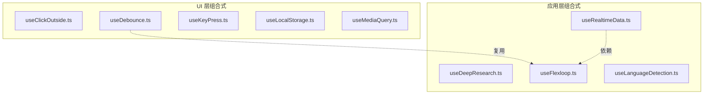

图表来源
- [useClickOutside.ts:1-18](file://apps/AgentPit/packages/ui/src/composables/useClickOutside.ts#L1-L18)
- [useDebounce.ts:1-18](file://apps/AgentPit/packages/ui/src/composables/useDebounce.ts#L1-L18)
- [useKeyPress.ts:1-18](file://apps/AgentPit/packages/ui/src/composables/useKeyPress.ts#L1-L18)
- [useLocalStorage.ts:1-15](file://apps/AgentPit/packages/ui/src/composables/useLocalStorage.ts#L1-L15)
- [useMediaQuery.ts:1-28](file://apps/AgentPit/packages/ui/src/composables/useMediaQuery.ts#L1-L28)
- [useDebounce.ts:1-21](file://apps/AgentPit/src/composables/useDebounce.ts#L1-L21)
- [useDeepResearch.ts:1-256](file://apps/AgentPit/src/composables/useDeepResearch.ts#L1-L256)
- [useFlexloop.ts:1-324](file://apps/AgentPit/src/composables/useFlexloop.ts#L1-L324)
- [useLanguageDetection.ts:1-132](file://apps/AgentPit/src/composables/useLanguageDetection.ts#L1-L132)
- [useRealtimeData.ts:1-117](file://apps/AgentPit/src/composables/useRealtimeData.ts#L1-L117)

章节来源
- [useClickOutside.ts:1-18](file://apps/AgentPit/packages/ui/src/composables/useClickOutside.ts#L1-L18)
- [useDebounce.ts:1-18](file://apps/AgentPit/packages/ui/src/composables/useDebounce.ts#L1-L18)
- [useKeyPress.ts:1-18](file://apps/AgentPit/packages/ui/src/composables/useKeyPress.ts#L1-L18)
- [useLocalStorage.ts:1-15](file://apps/AgentPit/packages/ui/src/composables/useLocalStorage.ts#L1-L15)
- [useMediaQuery.ts:1-28](file://apps/AgentPit/packages/ui/src/composables/useMediaQuery.ts#L1-L28)
- [useDebounce.ts:1-21](file://apps/AgentPit/src/composables/useDebounce.ts#L1-L21)
- [useDeepResearch.ts:1-256](file://apps/AgentPit/src/composables/useDeepResearch.ts#L1-L256)
- [useFlexloop.ts:1-324](file://apps/AgentPit/src/composables/useFlexloop.ts#L1-L324)
- [useLanguageDetection.ts:1-132](file://apps/AgentPit/src/composables/useLanguageDetection.ts#L1-L132)
- [useRealtimeData.ts:1-117](file://apps/AgentPit/src/composables/useRealtimeData.ts#L1-L117)

## 核心组件
本节聚焦三个高频组合式函数：useClickOutside、useDebounce、useKeyPress。它们分别代表“事件监听与清理”、“输入/状态去抖”、“按键触发”的典型模式。

- useClickOutside
  - 职责：监听全局点击事件，当点击目标不在指定元素内时触发回调。
  - 关键点：在挂载时注册事件，在卸载时移除；通过 Ref 持有目标元素引用。
  - 复用价值：统一处理“点击外部关闭”“下拉菜单外层收起”等交互。

- useDebounce
  - 职责：对输入值进行去抖处理，延迟更新结果，避免频繁渲染或请求。
  - 关键点：watch 源值变化，清理上次定时器，设置新定时器；支持自定义延迟。
  - 复用价值：搜索框输入、窗口尺寸变化、滚动节流等场景。

- useKeyPress
  - 职责：监听特定按键，命中即调用处理器。
  - 关键点：挂载注册、卸载移除；仅匹配目标键值。
  - 复用价值：快捷键、模态框关闭、编辑器快捷操作等。

章节来源
- [useClickOutside.ts:1-18](file://apps/AgentPit/packages/ui/src/composables/useClickOutside.ts#L1-L18)
- [useDebounce.ts:1-18](file://apps/AgentPit/packages/ui/src/composables/useDebounce.ts#L1-L18)
- [useKeyPress.ts:1-18](file://apps/AgentPit/packages/ui/src/composables/useKeyPress.ts#L1-L18)

## 架构总览
组合式 API 的整体架构遵循“状态 + 副作用 + 返回值”的模式：
- 状态：由 Vue 响应式系统（ref/watch/effect）管理。
- 副作用：在生命周期钩子中注册/清理事件、定时器、子进程等。
- 返回值：统一返回可直接在模板或逻辑中使用的响应式引用或方法集合。

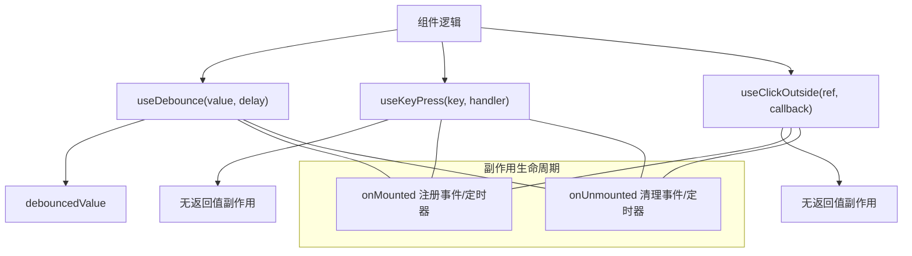

图表来源
- [useDebounce.ts:1-18](file://apps/AgentPit/packages/ui/src/composables/useDebounce.ts#L1-L18)
- [useKeyPress.ts:1-18](file://apps/AgentPit/packages/ui/src/composables/useKeyPress.ts#L1-L18)
- [useClickOutside.ts:1-18](file://apps/AgentPit/packages/ui/src/composables/useClickOutside.ts#L1-L18)

## 详细组件分析

### useClickOutside 组件分析
- 设计要点
  - 输入：Ref<HTMLElement|null> 目标元素，回调函数。
  - 行为：document 级 click 监听，若点击不在元素内部则触发回调。
  - 生命周期：onMounted/onUnmounted 注册/移除监听。
- 使用场景
  - 下拉菜单外层关闭、模态框点击遮罩关闭、弹窗外层收起等。
- 可视化序列图

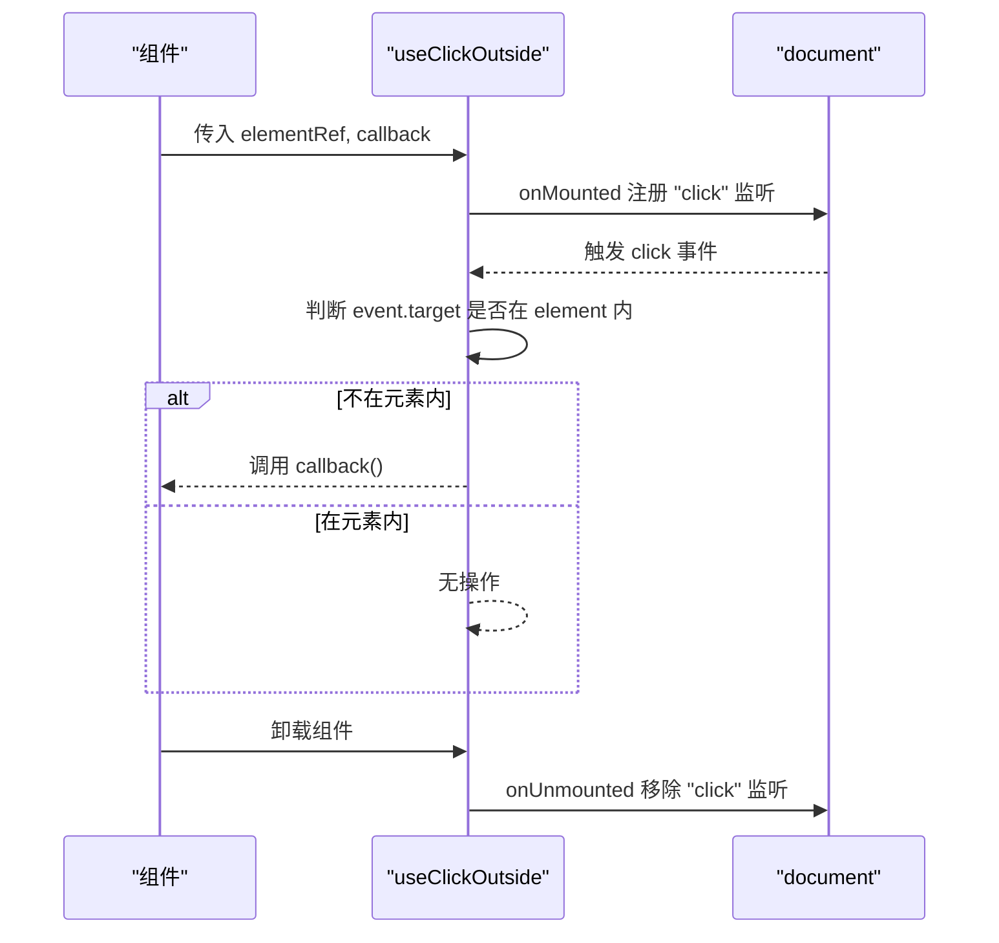

图表来源
- [useClickOutside.ts:1-18](file://apps/AgentPit/packages/ui/src/composables/useClickOutside.ts#L1-L18)

章节来源
- [useClickOutside.ts:1-18](file://apps/AgentPit/packages/ui/src/composables/useClickOutside.ts#L1-L18)

### useDebounce 组件分析
- 设计要点
  - 输入：Ref 或函数，延迟时间（毫秒）。
  - 行为：watch 源值变化，清理旧定时器，设置新定时器，最终更新 debouncedValue。
  - 类型与兼容：支持任意类型值，兼容函数式初始值。
- 使用场景
  - 搜索输入防抖、窗口尺寸变化节流、滚动事件优化。
- 可视化流程图

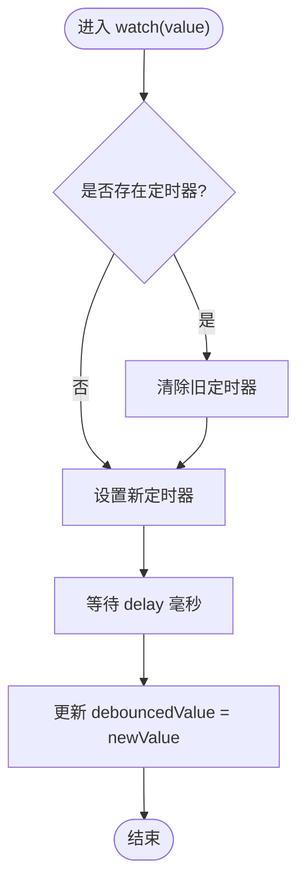

图表来源
- [useDebounce.ts:1-21](file://apps/AgentPit/src/composables/useDebounce.ts#L1-L21)

章节来源
- [useDebounce.ts:1-18](file://apps/AgentPit/packages/ui/src/composables/useDebounce.ts#L1-L18)
- [useDebounce.ts:1-21](file://apps/AgentPit/src/composables/useDebounce.ts#L1-L21)
- [useDebounce.spec.ts:1-204](file://apps/AgentPit/src/__tests__/composables/useDebounce.spec.ts#L1-L204)

### useKeyPress 组件分析
- 设计要点
  - 输入：目标键名字符串、回调处理器。
  - 行为：window 键盘事件监听，命中目标键后调用处理器。
  - 生命周期：onMounted/onUnmounted 注册/移除。
- 使用场景
  - 快捷键绑定、Esc 关闭、Enter 提交等。
- 可视化序列图

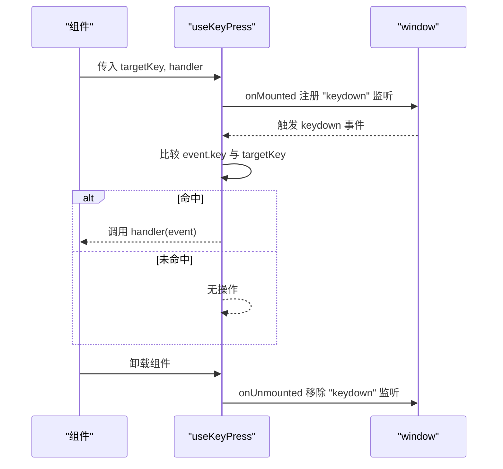

图表来源
- [useKeyPress.ts:1-18](file://apps/AgentPit/packages/ui/src/composables/useKeyPress.ts#L1-L18)

章节来源
- [useKeyPress.ts:1-18](file://apps/AgentPit/packages/ui/src/composables/useKeyPress.ts#L1-L18)

### useLocalStorage 组件分析
- 设计要点
  - 输入：键名、默认值。
  - 行为：初始化从 localStorage 读取，watch 深度监听变更写回 localStorage。
  - 场景：主题偏好、用户设置持久化。
- 可视化类图

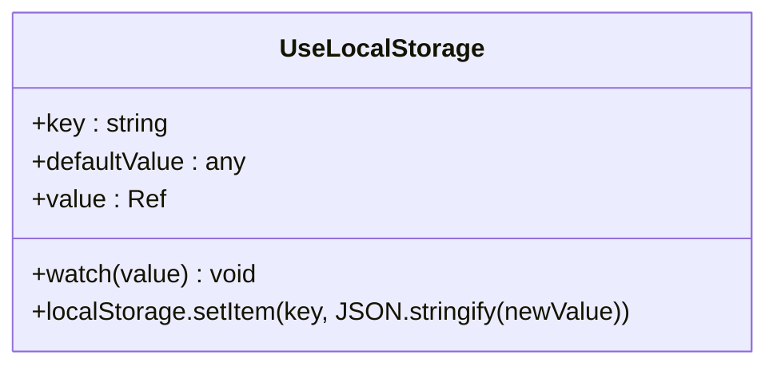

图表来源
- [useLocalStorage.ts:1-15](file://apps/AgentPit/packages/ui/src/composables/useLocalStorage.ts#L1-L15)

章节来源
- [useLocalStorage.ts:1-15](file://apps/AgentPit/packages/ui/src/composables/useLocalStorage.ts#L1-L15)

### useMediaQuery 组件分析
- 设计要点
  - 输入：CSS 媒体查询字符串。
  - 行为：matchMedia 监听变化，matches 响应式更新。
  - 场景：响应式布局、暗色模式检测。
- 可视化流程图

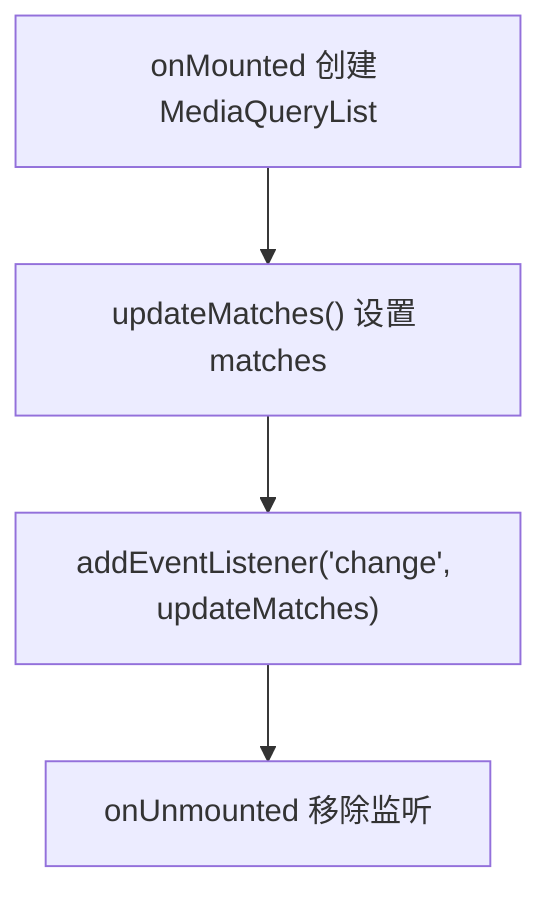

图表来源
- [useMediaQuery.ts:1-28](file://apps/AgentPit/packages/ui/src/composables/useMediaQuery.ts#L1-L28)

章节来源
- [useMediaQuery.ts:1-28](file://apps/AgentPit/packages/ui/src/composables/useMediaQuery.ts#L1-L28)

### useDeepResearch 组件分析
- 设计要点
  - 输入：查询语句、深度、格式、超时、最大结果数等。
  - 行为：校验工具可用性与依赖，执行外部工具，解析输出，记录结果与错误，支持超时与清理。
  - 返回：可用性、版本、加载状态、最近结果、错误信息、执行方法。
- 可视化类图

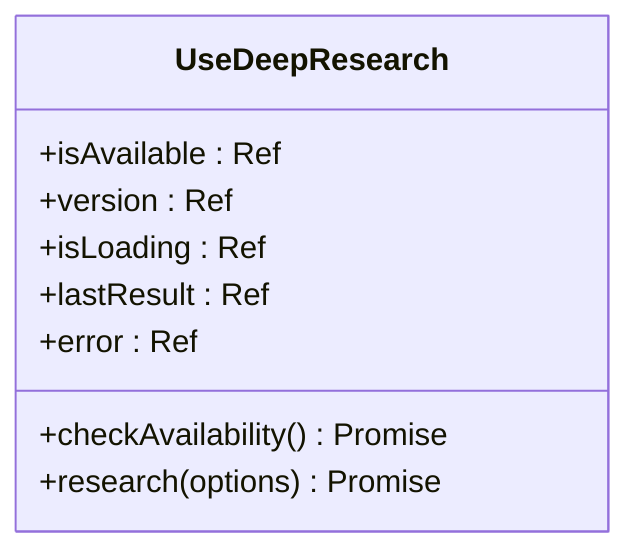

图表来源
- [useDeepResearch.ts:1-256](file://apps/AgentPit/src/composables/useDeepResearch.ts#L1-L256)

章节来源
- [useDeepResearch.ts:1-256](file://apps/AgentPit/src/composables/useDeepResearch.ts#L1-L256)

### useFlexloop 组件分析
- 设计要点
  - 输入：工作流 ID、动作（analyze/optimize/validate/execute）、配置、输入、输出格式、超时。
  - 行为：参数校验、构建命令行参数、执行外部工具、解析输出、维护历史记录、错误处理与日志。
  - 返回：可用性、版本、加载状态、最近结果、历史记录、执行方法与便捷 API。
- 可视化序列图

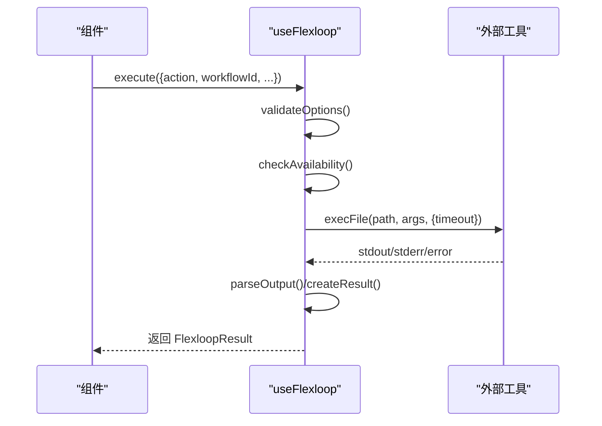

图表来源
- [useFlexloop.ts:1-324](file://apps/AgentPit/src/composables/useFlexloop.ts#L1-L324)

章节来源
- [useFlexloop.ts:1-324](file://apps/AgentPit/src/composables/useFlexloop.ts#L1-L324)

### useLanguageDetection 组件分析
- 设计要点
  - 输入：文本。
  - 行为：按字符编码范围统计中英文占比，计算置信度，提供语言标签与图标、是否以英文回复等便捷判断。
  - 返回：检测状态、置信度、计算属性标签/图标、检测方法、判断方法。
- 可视化流程图

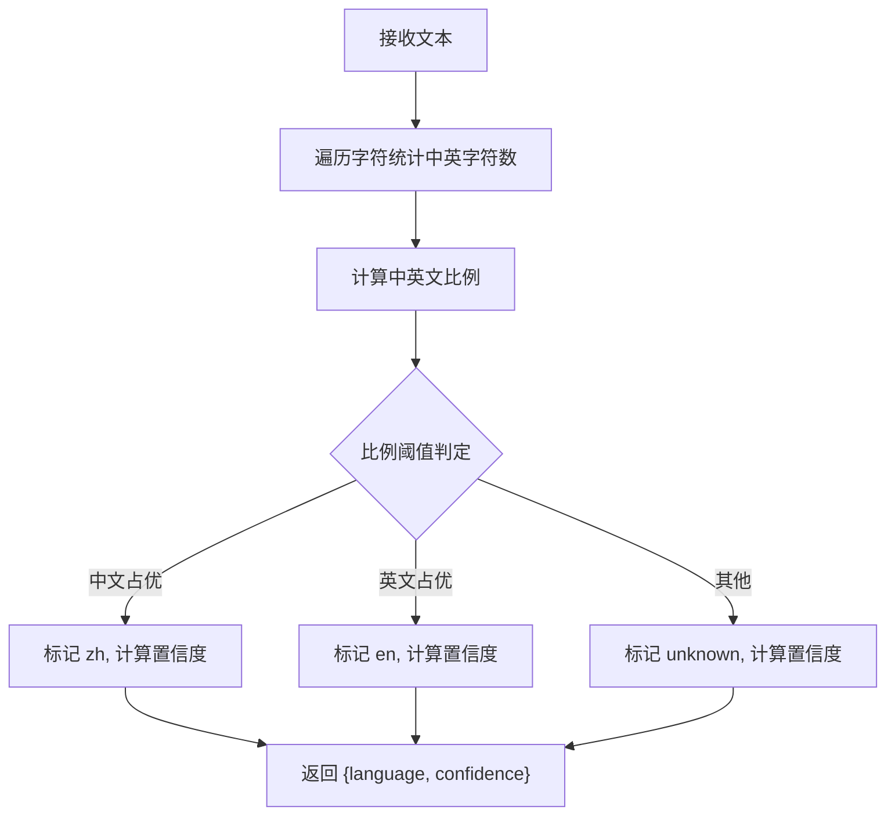

图表来源
- [useLanguageDetection.ts:1-132](file://apps/AgentPit/src/composables/useLanguageDetection.ts#L1-L132)

章节来源
- [useLanguageDetection.ts:1-132](file://apps/AgentPit/src/composables/useLanguageDetection.ts#L1-L132)
- [useLanguageDetection.spec.ts:1-234](file://apps/AgentPit/src/__tests__/composables/useLanguageDetection.spec.ts#L1-L234)

### useRealtimeData 组件分析
- 设计要点
  - 输入：依赖的业务 Store（如钱包余额）。
  - 行为：周期性模拟余额变化，根据阈值生成通知，支持手动启停与自动清理。
  - 返回：通知列表、启停控制、增删清方法。
- 可视化序列图

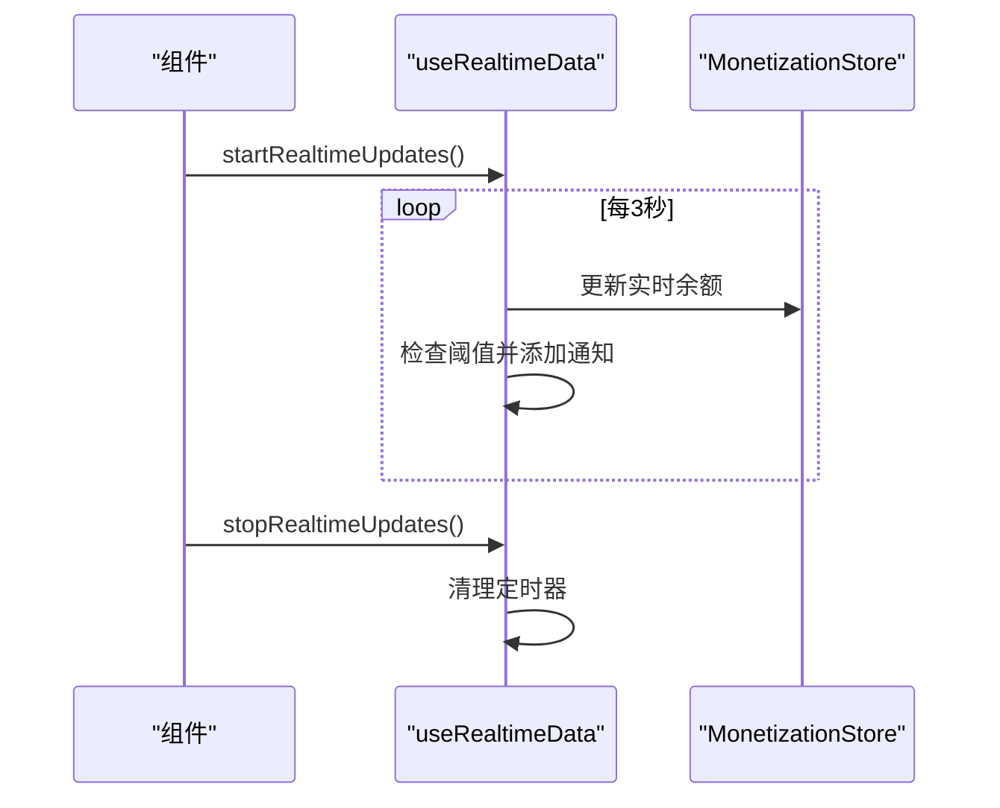

图表来源
- [useRealtimeData.ts:1-117](file://apps/AgentPit/src/composables/useRealtimeData.ts#L1-L117)

章节来源
- [useRealtimeData.ts:1-117](file://apps/AgentPit/src/composables/useRealtimeData.ts#L1-L117)
- [useRealtimeData.spec.ts:1-249](file://apps/AgentPit/src/__tests__/composables/useRealtimeData.spec.ts#L1-L249)

## 依赖分析
- 组件内聚与耦合
  - UI 层组合式高度内聚，职责单一，彼此低耦合，便于复用。
  - 应用层组合式与 Store/外部工具存在运行时耦合，但通过返回值与副作用隔离了模板层依赖。
- 外部依赖
  - useDeepResearch/useFlexloop 依赖外部可执行工具与环境变量。
  - useRealtimeData 依赖 Pinia Store 的状态。
- 循环依赖
  - 当前组合式之间无循环导入，生命周期钩子确保资源释放顺序正确。

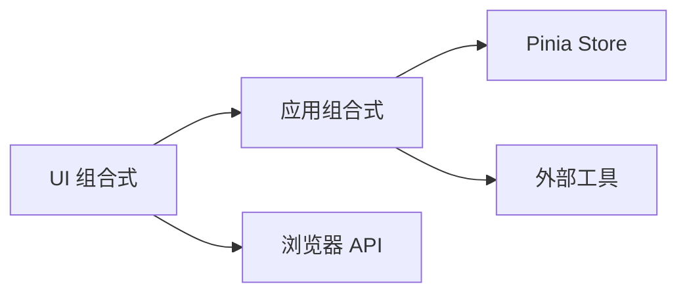

图表来源
- [useRealtimeData.ts:1-117](file://apps/AgentPit/src/composables/useRealtimeData.ts#L1-L117)
- [useDeepResearch.ts:1-256](file://apps/AgentPit/src/composables/useDeepResearch.ts#L1-L256)
- [useFlexloop.ts:1-324](file://apps/AgentPit/src/composables/useFlexloop.ts#L1-L324)

章节来源
- [useRealtimeData.ts:1-117](file://apps/AgentPit/src/composables/useRealtimeData.ts#L1-L117)
- [useDeepResearch.ts:1-256](file://apps/AgentPit/src/composables/useDeepResearch.ts#L1-L256)
- [useFlexloop.ts:1-324](file://apps/AgentPit/src/composables/useFlexloop.ts#L1-L324)

## 性能考虑
- 防抖与节流
  - 对高频输入/滚动/窗口变化使用去抖/节流，减少渲染与请求次数。
- 定时器与事件清理
  - 在 onUnmounted 中统一清理定时器与事件监听，避免内存泄漏。
- 外部工具调用
  - 合理设置超时与缓冲区大小，避免阻塞主线程；必要时在组件卸载时中断子进程。
- 响应式粒度
  - 将大对象深监听拆分为细粒度 ref，降低不必要的重渲染。

## 故障排查指南
- 常见问题
  - 事件未清理：确认 onUnmounted 中移除了监听器。
  - 去抖不生效：检查源值是否为 ref，watch 是否正确触发。
  - 外部工具不可用：检查路径与依赖，查看错误信息与可用性状态。
  - 通知未消失：确认 autoDismiss 默认行为与定时器清理。
- 测试参考
  - 使用 Vitest 的 fake timers 验证去抖时机与多次更新重置。
  - 使用 Pinia 测试 store 的集成行为与副作用清理。

章节来源
- [useDebounce.spec.ts:1-204](file://apps/AgentPit/src/__tests__/composables/useDebounce.spec.ts#L1-L204)
- [useLanguageDetection.spec.ts:1-234](file://apps/AgentPit/src/__tests__/composables/useLanguageDetection.spec.ts#L1-L234)
- [useRealtimeData.spec.ts:1-249](file://apps/AgentPit/src/__tests__/composables/useRealtimeData.spec.ts#L1-L249)

## 结论
AgentPit 的组合式 API 通过“状态 + 副作用 + 返回值”的统一范式，实现了高内聚、低耦合、易测试与强复用的前端逻辑封装。UI 层组合式覆盖常见交互与浏览器能力，应用层组合式承载业务逻辑与外部集成。遵循本文的开发指南与最佳实践，可在保证可维护性的前提下快速扩展更多组合式能力。

## 附录
- 开发指南（参数设计、返回值规范、副作用处理）
  - 参数设计
    - 明确必填项与可选项，提供合理默认值；对复杂输入提供接口类型约束。
    - 对外部工具相关参数，提供校验与容错提示。
  - 返回值规范
    - UI 层：优先返回 ref/计算属性与方法；避免直接修改父组件状态。
    - 应用层：统一返回状态 ref 与执行方法；提供最近结果与错误信息。
  - 副作用处理
    - 在 onMounted/onUnmounted 中注册/清理；对外部工具提供取消/中断能力。
    - 对异步任务提供 loading 状态与超时处理。
- 最佳实践
  - 将组合式函数拆分为“纯逻辑 + 副作用”，便于单元测试。
  - 对高频事件使用去抖/节流，避免过度渲染。
  - 对外部依赖提供可用性检查与降级策略。
- 实际应用示例（路径指引）
  - 点击外部关闭：[useClickOutside.ts:1-18](file://apps/AgentPit/packages/ui/src/composables/useClickOutside.ts#L1-L18)
  - 输入搜索防抖：[useDebounce.ts:1-21](file://apps/AgentPit/src/composables/useDebounce.ts#L1-L21)
  - 快捷键绑定：[useKeyPress.ts:1-18](file://apps/AgentPit/packages/ui/src/composables/useKeyPress.ts#L1-L18)
  - 主题/设置持久化：[useLocalStorage.ts:1-15](file://apps/AgentPit/packages/ui/src/composables/useLocalStorage.ts#L1-L15)
  - 响应式断点检测：[useMediaQuery.ts:1-28](file://apps/AgentPit/packages/ui/src/composables/useMediaQuery.ts#L1-L28)
  - 深度研究执行：[useDeepResearch.ts:1-256](file://apps/AgentPit/src/composables/useDeepResearch.ts#L1-L256)
  - 工作流分析/优化/校验：[useFlexloop.ts:1-324](file://apps/AgentPit/src/composables/useFlexloop.ts#L1-L324)
  - 语言检测与回复策略：[useLanguageDetection.ts:1-132](file://apps/AgentPit/src/composables/useLanguageDetection.ts#L1-L132)
  - 实时数据监控与告警：[useRealtimeData.ts:1-117](file://apps/AgentPit/src/composables/useRealtimeData.ts#L1-L117)