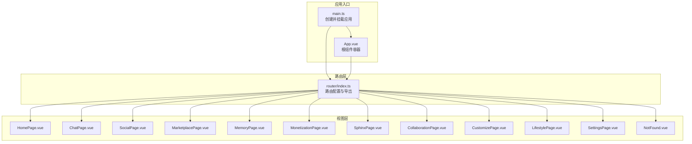
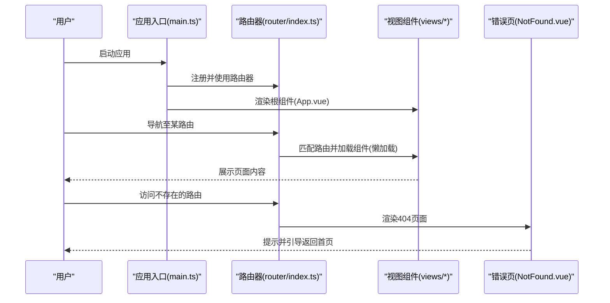
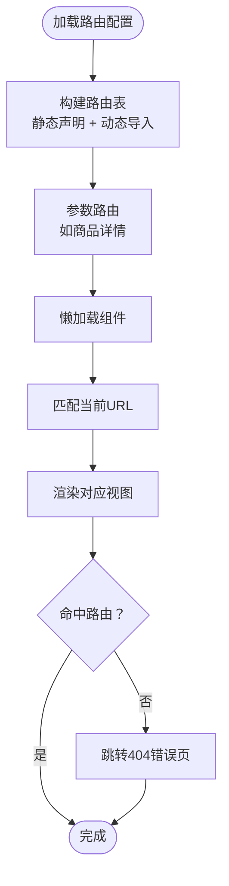
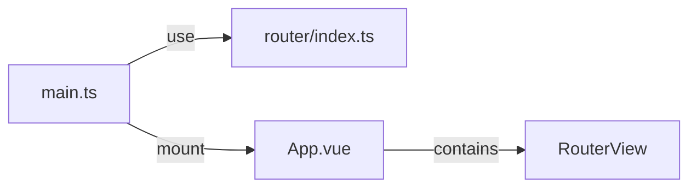
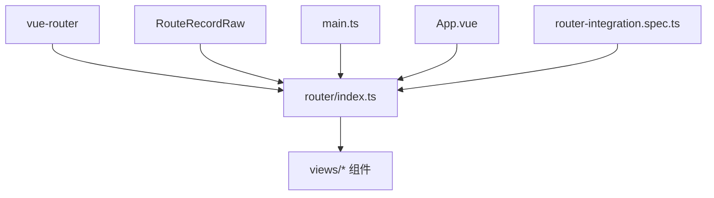

# 路由系统设计

<cite>
**本文引用的文件**
- [apps/AgentPit/src/router/index.ts](file://apps/AgentPit/src/router/index.ts)
- [apps/AgentPit/src/main.ts](file://apps/AgentPit/src/main.ts)
- [apps/AgentPit/src/App.vue](file://apps/AgentPit/src/App.vue)
- [apps/AgentPit/src/views/NotFound.vue](file://apps/AgentPit/src/views/NotFound.vue)
- [apps/AgentPit/src/__tests__/integration/router-integration.spec.ts](file://apps/AgentPit/src/__tests__/integration/router-integration.spec.ts)
</cite>

## 目录
1. [引言](#引言)
2. [项目结构](#项目结构)
3. [核心组件](#核心组件)
4. [架构总览](#架构总览)
5. [详细组件分析](#详细组件分析)
6. [依赖关系分析](#依赖关系分析)
7. [性能考虑](#性能考虑)
8. [故障排查指南](#故障排查指南)
9. [结论](#结论)
10. [附录](#附录)

## 引言
本文件面向AgentPit智能体平台的前端路由系统，围绕基于Vue Router的路由架构进行系统化技术说明。内容涵盖路由配置、动态路由与参数传递、嵌套路由（当前未启用）、路由守卫（当前未启用）以及错误页处理等主题。同时结合仓库中现有的路由配置与测试用例，给出可操作的实现路径与最佳实践建议，帮助开发者在不破坏现有结构的前提下扩展权限控制、导航拦截与性能优化能力。

## 项目结构
AgentPit前端应用采用标准的Vue 3 + Vue Router工程化组织方式，路由定义集中在路由模块中，应用入口负责挂载路由器与状态管理；视图组件按功能划分在views目录下；错误页以独立组件形式存在。

图表来源
- [apps/AgentPit/src/router/index.ts:1-73](file://apps/AgentPit/src/router/index.ts#L1-L73)
- [apps/AgentPit/src/main.ts:1-13](file://apps/AgentPit/src/main.ts#L1-L13)
- [apps/AgentPit/src/App.vue:1-8](file://apps/AgentPit/src/App.vue#L1-L8)

章节来源
- [apps/AgentPit/src/router/index.ts:1-73](file://apps/AgentPit/src/router/index.ts#L1-L73)
- [apps/AgentPit/src/main.ts:1-13](file://apps/AgentPit/src/main.ts#L1-L13)
- [apps/AgentPit/src/App.vue:1-8](file://apps/AgentPit/src/App.vue#L1-L8)

## 核心组件
- 路由器实例：通过历史模式创建，注册静态路由表，支持懒加载组件。
- 应用入口：初始化Pinia与Vue Router，统一挂载到DOM。
- 根组件：使用RouterView作为视图占位，承载所有路由视图。
- 错误页组件：提供404页面与返回首页的导航链接。

章节来源
- [apps/AgentPit/src/router/index.ts:1-73](file://apps/AgentPit/src/router/index.ts#L1-L73)
- [apps/AgentPit/src/main.ts:1-13](file://apps/AgentPit/src/main.ts#L1-L13)
- [apps/AgentPit/src/App.vue:1-8](file://apps/AgentPit/src/App.vue#L1-L8)
- [apps/AgentPit/src/views/NotFound.vue:1-35](file://apps/AgentPit/src/views/NotFound.vue#L1-L35)

## 架构总览
AgentPit的路由架构采用“单页应用 + 懒加载”的设计，通过路由表集中声明页面级视图，配合RouterView渲染对应组件。当前未启用全局前置/后置守卫与嵌套路由，但已具备扩展权限控制与多级导航的基础。

图表来源
- [apps/AgentPit/src/main.ts:1-13](file://apps/AgentPit/src/main.ts#L1-L13)
- [apps/AgentPit/src/router/index.ts:1-73](file://apps/AgentPit/src/router/index.ts#L1-L73)
- [apps/AgentPit/src/views/NotFound.vue:1-35](file://apps/AgentPit/src/views/NotFound.vue#L1-L35)

## 详细组件分析

### 路由配置与懒加载
- 路由表集中声明：包含首页、聊天、社交、市场、协作、记忆、定制、生活方式、设置及货币化等页面。
- 动态导入：每个路由的组件均通过动态导入实现懒加载，减少首屏体积。
- 参数路由：市场商品详情页使用动态段捕获ID，便于参数传递与复用同一视图。
- 历史模式：使用浏览器历史模式，适配生产环境部署。

图表来源
- [apps/AgentPit/src/router/index.ts:4-64](file://apps/AgentPit/src/router/index.ts#L4-L64)
- [apps/AgentPit/src/views/NotFound.vue:1-35](file://apps/AgentPit/src/views/NotFound.vue#L1-L35)

章节来源
- [apps/AgentPit/src/router/index.ts:1-73](file://apps/AgentPit/src/router/index.ts#L1-L73)

### 应用入口与根组件
- 入口文件负责创建应用实例、安装Pinia与Vue Router，并将应用挂载到DOM。
- 根组件仅包含RouterView，用于承载所有路由视图。

图表来源
- [apps/AgentPit/src/main.ts:1-13](file://apps/AgentPit/src/main.ts#L1-L13)
- [apps/AgentPit/src/App.vue:1-8](file://apps/AgentPit/src/App.vue#L1-L8)

章节来源
- [apps/AgentPit/src/main.ts:1-13](file://apps/AgentPit/src/main.ts#L1-L13)
- [apps/AgentPit/src/App.vue:1-8](file://apps/AgentPit/src/App.vue#L1-L8)

### 错误页处理
- 独立的404组件提供简洁的提示与返回首页的导航。
- 在当前路由表中未显式声明通配符路由时，可通过在测试中模拟兜底行为验证错误页渲染逻辑。

章节来源
- [apps/AgentPit/src/views/NotFound.vue:1-35](file://apps/AgentPit/src/views/NotFound.vue#L1-L35)
- [apps/AgentPit/src/__tests__/integration/router-integration.spec.ts:1-200](file://apps/AgentPit/src/__tests__/integration/router-integration.spec.ts#L1-L200)

## 依赖关系分析
- 路由器依赖于Vue Router库与类型定义。
- 应用入口依赖路由器与根组件。
- 视图组件依赖于路由表中的名称与路径映射。
- 测试用例依赖内存历史模式与路由器实例，用于集成测试。

图表来源
- [apps/AgentPit/src/router/index.ts:1-2](file://apps/AgentPit/src/router/index.ts#L1-L2)
- [apps/AgentPit/src/main.ts:1-13](file://apps/AgentPit/src/main.ts#L1-L13)
- [apps/AgentPit/src/App.vue:1-8](file://apps/AgentPit/src/App.vue#L1-L8)
- [apps/AgentPit/src/__tests__/integration/router-integration.spec.ts:1-200](file://apps/AgentPit/src/__tests__/integration/router-integration.spec.ts#L1-L200)

章节来源
- [apps/AgentPit/src/router/index.ts:1-73](file://apps/AgentPit/src/router/index.ts#L1-L73)
- [apps/AgentPit/src/main.ts:1-13](file://apps/AgentPit/src/main.ts#L1-L13)
- [apps/AgentPit/src/App.vue:1-8](file://apps/AgentPit/src/App.vue#L1-L8)
- [apps/AgentPit/src/__tests__/integration/router-integration.spec.ts:1-200](file://apps/AgentPit/src/__tests__/integration/router-integration.spec.ts#L1-L200)

## 性能考虑
- 懒加载与代码分割：通过动态导入实现按需加载，降低首屏资源压力。
- 路由级别拆分：将页面组件拆分为独立模块，配合打包工具进行自动分包。
- 预加载策略：对高频访问页面可考虑预加载，进一步缩短二次进入延迟。
- 缓存与持久化：结合Pinia状态管理，避免重复请求与重复渲染。

## 故障排查指南
- 路由无法匹配：检查路由表中是否正确声明路径与名称，确认动态段拼写与大小写。
- 组件未渲染：确认组件动态导入路径正确且文件存在；检查RouterView是否位于根组件。
- 404页面未显示：若未显式添加通配符路由，可在测试中验证兜底行为或在路由表末尾追加通配符路由。
- 导航异常：检查导航目标是否存在，必要时在测试中使用内存历史模式模拟导航场景。

章节来源
- [apps/AgentPit/src/router/index.ts:1-73](file://apps/AgentPit/src/router/index.ts#L1-L73)
- [apps/AgentPit/src/views/NotFound.vue:1-35](file://apps/AgentPit/src/views/NotFound.vue#L1-L35)
- [apps/AgentPit/src/__tests__/integration/router-integration.spec.ts:1-200](file://apps/AgentPit/src/__tests__/integration/router-integration.spec.ts#L1-L200)

## 结论
AgentPit的路由系统以简洁清晰的静态路由表为基础，结合懒加载与RouterView实现了良好的首屏性能与可维护性。当前未启用全局守卫与嵌套路由，但已为后续扩展权限控制、导航拦截与更复杂的页面布局预留了空间。建议在保持现有结构不变的前提下，逐步引入守卫与嵌套路由，并完善错误页与导航测试，以提升系统的安全性与用户体验。

## 附录

### 最佳实践清单
- 路由命名规范：采用帕斯卡命名法，语义明确，避免与保留关键字冲突。
- 参数传递：优先使用动态段与查询参数组合，保证URL可读性与可分享性。
- 查询字符串处理：统一通过路由对象获取与序列化，避免直接拼接字符串。
- 错误页面：提供清晰的提示与返回路径，增强用户可恢复性。
- 导航拦截：在需要权限控制时，按需引入守卫并在测试中覆盖关键分支。

### 实际代码示例路径
- 路由配置与懒加载：[apps/AgentPit/src/router/index.ts:4-64](file://apps/AgentPit/src/router/index.ts#L4-L64)
- 应用入口挂载：[apps/AgentPit/src/main.ts:1-13](file://apps/AgentPit/src/main.ts#L1-L13)
- 根组件视图容器：[apps/AgentPit/src/App.vue:1-8](file://apps/AgentPit/src/App.vue#L1-L8)
- 错误页组件：[apps/AgentPit/src/views/NotFound.vue:1-35](file://apps/AgentPit/src/views/NotFound.vue#L1-L35)
- 路由集成测试（内存历史模式）：[apps/AgentPit/src/__tests__/integration/router-integration.spec.ts:1-200](file://apps/AgentPit/src/__tests__/integration/router-integration.spec.ts#L1-L200)