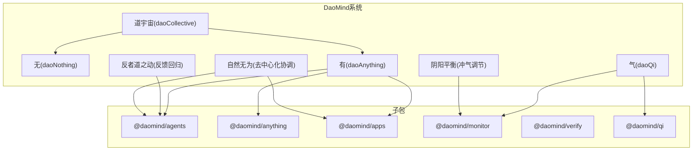
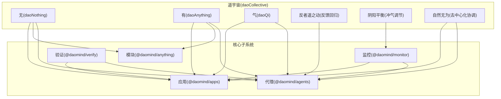
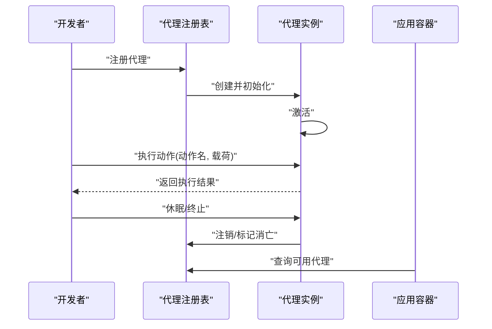
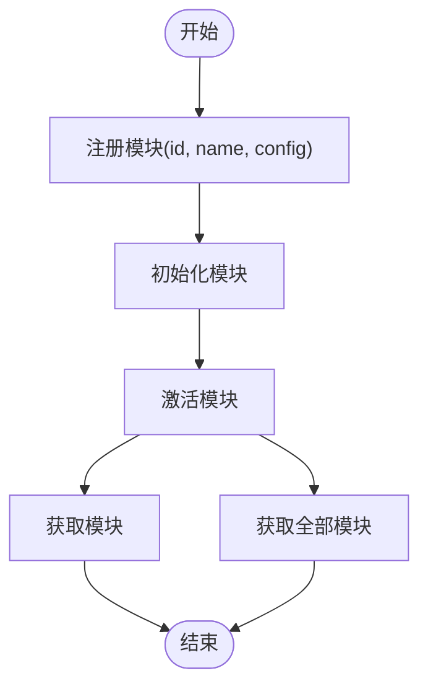
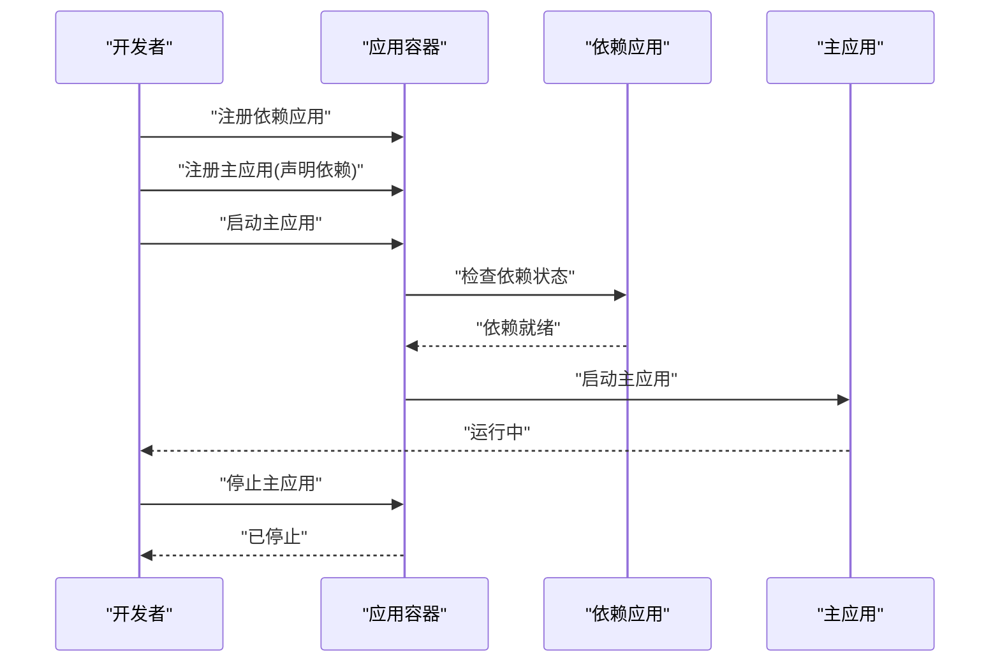
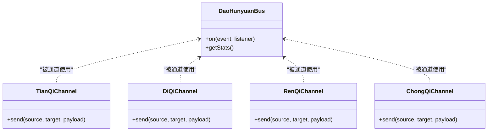
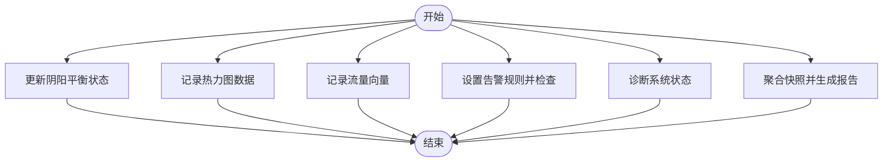
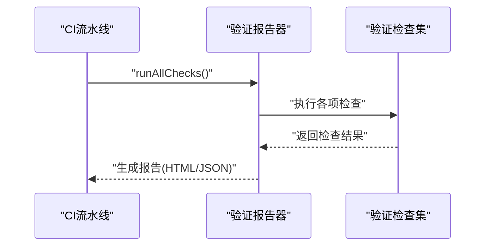
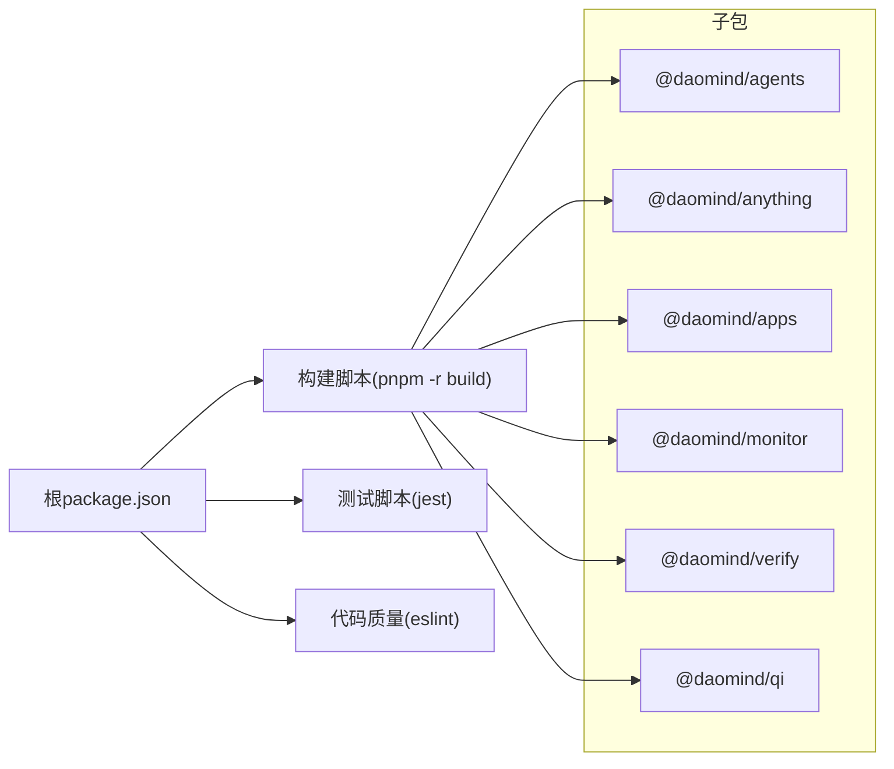

# DaoMind多智能体系统

<cite>
**本文引用的文件**
- [apps/DaoMind/README.md](file://apps/DaoMind/README.md)
- [apps/DaoMind/package.json](file://apps/DaoMind/package.json)
- [apps/DaoMind/src/__tests__/integration/agents-apps-integration.test.ts](file://apps/DaoMind/src/__tests__/integration/agents-apps-integration.test.ts)
- [apps/DaoMind/src/__tests__/integration/verify-integration.test.ts](file://apps/DaoMind/src/__tests__/integration/verify-integration.test.ts)
- [apps/DaoMind/tests/test-qi-message.js](file://apps/DaoMind/tests/test-qi-message.js)
- [apps/DaoMind/tests/test-project.js](file://apps/DaoMind/tests/test-project.js)
</cite>

## 目录
1. [引言](#引言)
2. [项目结构](#项目结构)
3. [核心组件](#核心组件)
4. [架构总览](#架构总览)
5. [详细组件分析](#详细组件分析)
6. [依赖分析](#依赖分析)
7. [性能考虑](#性能考虑)
8. [故障排查指南](#故障排查指南)
9. [结论](#结论)
10. [附录](#附录)

## 引言
DaoMind是一个融合道家哲学思想与现代技术的分布式多智能体系统框架，采用monorepo架构组织多个子包，围绕“道宇宙”“无”“有”“气”等核心概念构建。系统提供代理管理、模块管理、消息传递（DaoQi）、监控（DaoMonitor）以及验证（DaoVerify）等能力，强调去中心化协调、反馈回归生命周期与阴阳平衡调节。

DaoMind的目标是通过模块化与类型安全的设计，支撑多智能体的发现、注册、状态同步与故障恢复，并提供可视化监控与验证工具，帮助开发者在复杂分布式场景中实现稳定、可演进的协作系统。

## 项目结构
DaoMind位于apps/DaoMind目录，采用pnpm工作区管理多个子包，核心特性包括：
- 代理管理：代理的创建、初始化、激活、执行与终止
- 模块管理：模块的注册、初始化、激活与查询
- 消息传递：基于四气通道（天、地、人、冲）的混元气总线
- 监控系统：阴阳仪表盘、热力图、向量场、告警与诊断引擎
- 验证系统：哲学一致性与规范验证报告生成

图表来源
- [apps/DaoMind/README.md:482-521](file://apps/DaoMind/README.md#L482-L521)

章节来源
- [apps/DaoMind/README.md:323-378](file://apps/DaoMind/README.md#L323-L378)
- [apps/DaoMind/package.json:1-1](file://apps/DaoMind/package.json#L1-L1)

## 核心组件
- 代理管理（@daomind/agents）
  - 提供代理生命周期管理：创建、初始化、激活、执行动作、休眠与终止
  - 支持能力声明与动作执行接口
- 模块管理（@daomind/anything）
  - 提供模块注册、初始化、激活与查询
- 应用容器（@daomind/apps）
  - 提供应用注册、启动、停止与依赖管理
- 消息传递（@daomind/qi）
  - 混元气总线与四气通道（天、地、人、冲），支持跨节点消息路由与统计
- 监控系统（@daomind/monitor）
  - 阴阳仪表盘、热力图、向量场、告警引擎、诊断引擎与快照聚合器
- 验证系统（@daomind/verify）
  - 哲学一致性检验与报告生成

章节来源
- [apps/DaoMind/README.md:7-26](file://apps/DaoMind/README.md#L7-L26)
- [apps/DaoMind/README.md:109-163](file://apps/DaoMind/README.md#L109-L163)
- [apps/DaoMind/README.md:165-293](file://apps/DaoMind/README.md#L165-L293)

## 架构总览
DaoMind以“道宇宙”为顶层入口，通过“无”“有”“气”“反者道之动”“阴阳平衡”“自然无为”等哲学概念映射到系统架构：
- “无”代表类型论根基与潜在性空间，零运行时开销
- “有”代表显化容器与实例化空间，承载代理与模块
- “气”代表消息总线与数据流，四通道协同
- “反者道之动”体现反馈回归四阶段生命周期
- “阴阳平衡”通过冲气调节维持系统稳定
- “自然无为”强调去中心化协调与自适应策略

图表来源
- [apps/DaoMind/README.md:482-521](file://apps/DaoMind/README.md#L482-L521)

## 详细组件分析

### 代理管理（@daomind/agents）
- 生命周期
  - 创建：传入id、type与config
  - 初始化：准备运行所需资源
  - 激活：进入可执行状态
  - 执行：按动作名与载荷执行
  - 休眠：让代理暂时停止活跃
  - 终止：释放资源并标记为已消亡
- 能力声明
  - 代理可声明自身能力（名称、版本、描述），用于能力匹配与调度

图表来源
- [apps/DaoMind/src/__tests__/integration/agents-apps-integration.test.ts:26-80](file://apps/DaoMind/src/__tests__/integration/agents-apps-integration.test.ts#L26-L80)

章节来源
- [apps/DaoMind/README.md:109-136](file://apps/DaoMind/README.md#L109-L136)
- [apps/DaoMind/src/__tests__/integration/agents-apps-integration.test.ts:26-80](file://apps/DaoMind/src/__tests__/integration/agents-apps-integration.test.ts#L26-L80)

### 模块管理（@daomind/anything）
- 功能
  - 注册模块：提供id、name、存在性类型与配置
  - 初始化与激活：准备模块运行
  - 查询：获取单个或全部模块
- 与代理/应用的协作
  - 模块作为代理与应用的承载容器，参与系统装配与运行时组合

图表来源
- [apps/DaoMind/README.md:138-163](file://apps/DaoMind/README.md#L138-L163)

章节来源
- [apps/DaoMind/README.md:138-163](file://apps/DaoMind/README.md#L138-L163)

### 应用容器（@daomind/apps）
- 功能
  - 注册应用定义（含依赖）
  - 启动/停止应用实例
  - 列举与查询实例状态
- 依赖管理
  - 主应用启动前校验依赖是否就绪，否则拒绝启动

图表来源
- [apps/DaoMind/src/__tests__/integration/agents-apps-integration.test.ts:82-112](file://apps/DaoMind/src/__tests__/integration/agents-apps-integration.test.ts#L82-L112)

章节来源
- [apps/DaoMind/src/__tests__/integration/agents-apps-integration.test.ts:82-112](file://apps/DaoMind/src/__tests__/integration/agents-apps-integration.test.ts#L82-L112)

### 消息传递系统（@daomind/qi）
- 混元气总线
  - 统一消息协议与统计接口
- 四气通道
  - 天气通道（下行）、地气通道（上行）、人气通道（横向）、冲气通道（调和）
- 使用要点
  - 通过通道在节点间发送消息，支持不同语义通道的路由与处理
  - 可获取总线统计信息用于性能与可观测性分析

图表来源
- [apps/DaoMind/README.md:165-199](file://apps/DaoMind/README.md#L165-L199)

章节来源
- [apps/DaoMind/README.md:165-199](file://apps/DaoMind/README.md#L165-L199)

### 监控系统（@daomind/monitor）
- 引擎与组件
  - 阴阳仪表盘引擎：更新与获取平衡状态
  - 热力图引擎：记录与获取热力图数据
  - 向量场：记录流量向量与热点
  - 告警引擎：设置规则与检查告警
  - 诊断引擎：诊断系统状态
  - 快照聚合器：聚合监控指标并生成快照
- 使用要点
  - 通过各引擎采集与分析系统状态
  - 生成报告与历史快照，辅助故障定位与容量规划

图表来源
- [apps/DaoMind/README.md:201-293](file://apps/DaoMind/README.md#L201-L293)

章节来源
- [apps/DaoMind/README.md:201-293](file://apps/DaoMind/README.md#L201-L293)

### 验证系统（@daomind/verify）
- 功能
  - 运行所有/指定分类的验证检查
  - 生成Markdown与JSON报告
- 使用要点
  - 在CI/CD中集成验证，确保代码与规范一致性

图表来源
- [apps/DaoMind/src/__tests__/integration/verify-integration.test.ts:4-44](file://apps/DaoMind/src/__tests__/integration/verify-integration.test.ts#L4-L44)

章节来源
- [apps/DaoMind/src/__tests__/integration/verify-integration.test.ts:4-44](file://apps/DaoMind/src/__tests__/integration/verify-integration.test.ts#L4-L44)

## 依赖分析
- 工作区与脚本
  - 根package.json定义了工作区构建、测试与代码质量脚本
- 子包依赖
  - 各子包通过独立package.json管理依赖与构建脚本
- 测试与验证
  - 集成测试覆盖代理与应用的协作流程
  - 验证测试覆盖报告生成与分类检查

图表来源
- [apps/DaoMind/package.json:1-1](file://apps/DaoMind/package.json#L1-L1)

章节来源
- [apps/DaoMind/package.json:1-1](file://apps/DaoMind/package.json#L1-L1)

## 性能考虑
- 性能基准
  - 启动时间、内存占用、消息吞吐量、反馈回路延迟与冲气收敛时间均有明确目标
- 优化建议
  - 使用监控系统持续观测关键指标
  - 通过验证系统在CI中保持性能基线
  - 对高并发场景优先选择合适通道与路由策略

章节来源
- [apps/DaoMind/README.md:528-534](file://apps/DaoMind/README.md#L528-L534)

## 故障排查指南
- 代理与应用集成
  - 确认代理已注册并处于active状态
  - 确认应用已启动且状态为running
  - 若主应用启动失败，检查依赖应用是否已就绪
- 验证报告
  - 通过验证报告器生成Markdown与JSON报告，定位问题类别
- 消息与监控
  - 使用混元气总线统计信息与监控引擎指标定位异常

章节来源
- [apps/DaoMind/src/__tests__/integration/agents-apps-integration.test.ts:26-112](file://apps/DaoMind/src/__tests__/integration/agents-apps-integration.test.ts#L26-L112)
- [apps/DaoMind/src/__tests__/integration/verify-integration.test.ts:4-44](file://apps/DaoMind/src/__tests__/integration/verify-integration.test.ts#L4-L44)
- [apps/DaoMind/README.md:165-293](file://apps/DaoMind/README.md#L165-L293)

## 结论
DaoMind以道家哲学为指导，构建了面向多智能体的分布式系统框架。通过代理与模块的生命周期管理、四气通道的消息总线、去中心化的协调策略与全面的监控验证体系，系统在保证类型安全与可维护性的同时，提供了强大的协作与扩展能力。结合集成测试与验证报告，开发者可以更稳健地构建与运维多智能体应用。

## 附录
- 测试与验证
  - 集成测试：代理与应用协作、依赖管理
  - 验证测试：报告生成与分类检查
- 消息与项目验证脚本
  - 消息传递测试脚本
  - 项目验证脚本

章节来源
- [apps/DaoMind/tests/test-qi-message.js](file://apps/DaoMind/tests/test-qi-message.js)
- [apps/DaoMind/tests/test-project.js](file://apps/DaoMind/tests/test-project.js)