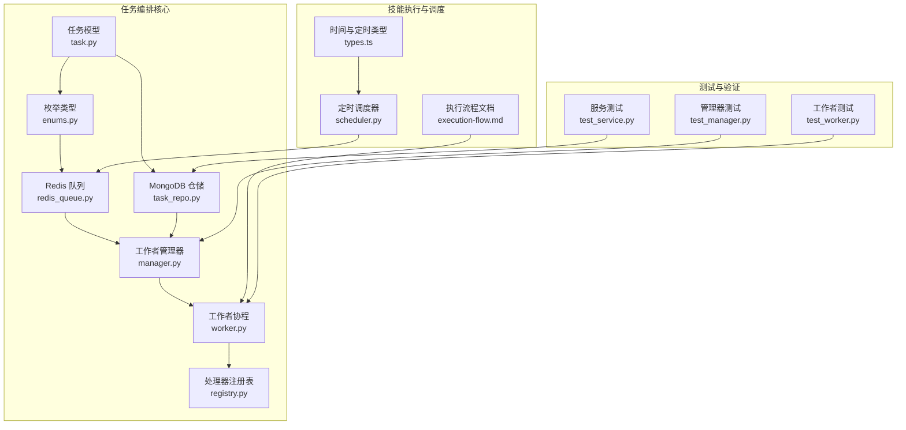
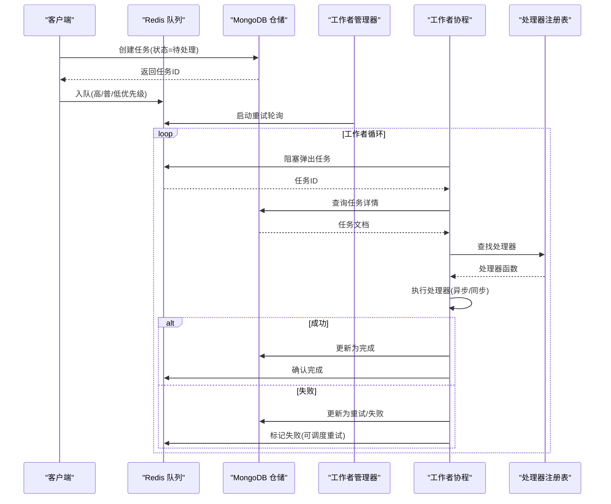
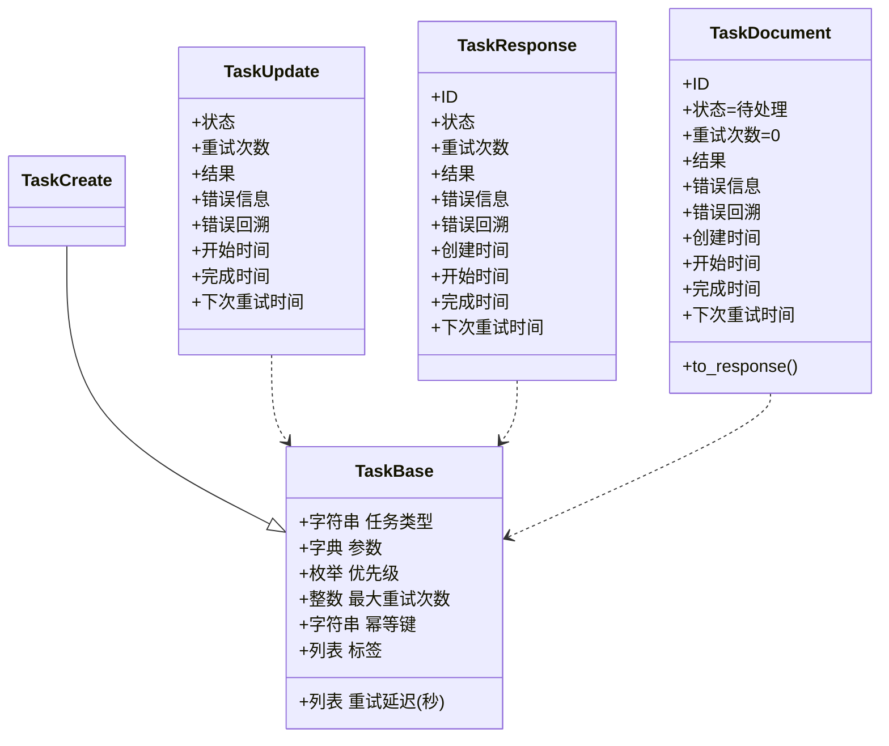
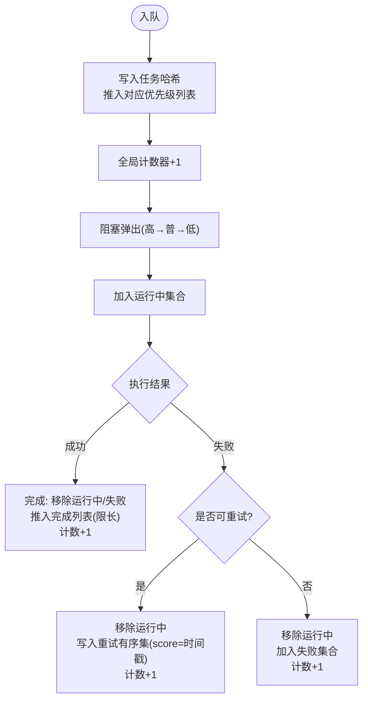
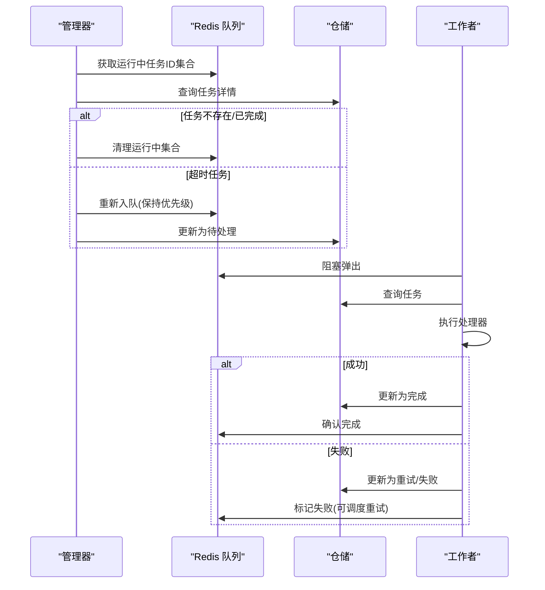
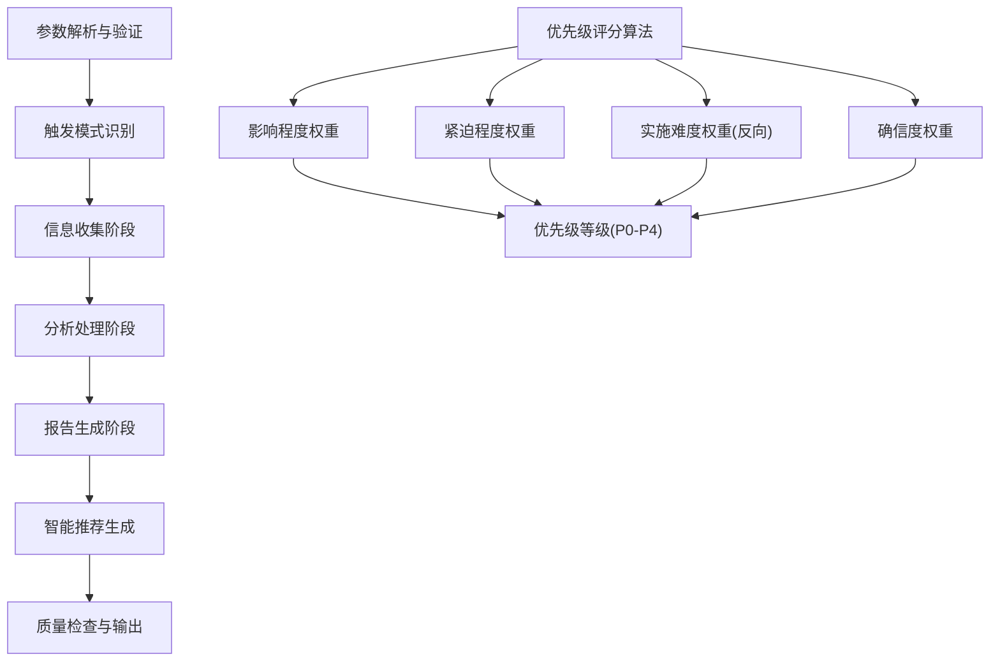
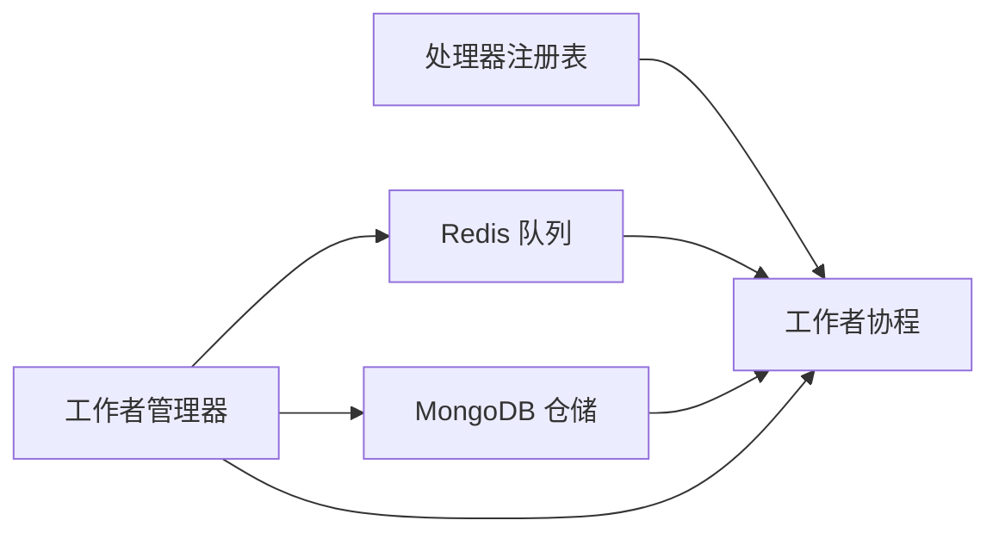
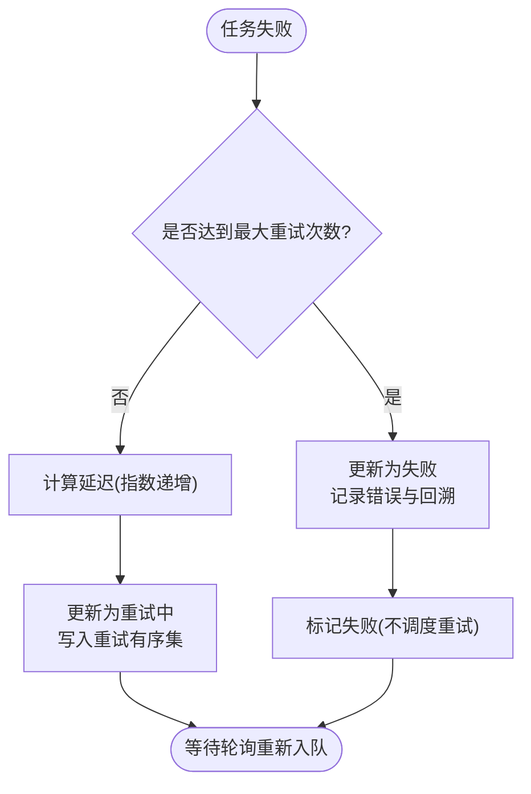

# 任务编排系统

<cite>
**本文引用的文件**
- [task.py](file://tools/flexloop/src/taolib/testing/task_queue/models/task.py)
- [enums.py](file://tools/flexloop/src/taolib/testing/task_queue/models/enums.py)
- [redis_queue.py](file://tools/flexloop/src/taolib/testing/task_queue/queue/redis_queue.py)
- [manager.py](file://tools/flexloop/src/taolib/testing/task_queue/worker/manager.py)
- [worker.py](file://tools/flexloop/src/taolib/testing/task_queue/worker/worker.py)
- [task_repo.py](file://tools/flexloop/src/taolib/testing/task_queue/repository/task_repo.py)
- [registry.py](file://tools/flexloop/src/taolib/testing/task_queue/worker/registry.py)
- [execution-flow.md](file://skills/daoSkilLs/skills/task-execution-summary/references/execution-flow.md)
- [types.ts](file://apps/DaoMind/packages/daotimes/src/types.ts)
- [scheduler.py](file://src/taolib/testing/data_sync/services/scheduler.py)
- [test_manager.py](file://tools/flexloop/tests/testing/test_task_queue/test_manager.py)
- [test_worker.py](file://tools/flexloop/tests/testing/test_task_queue/test_worker.py)
- [test_service.py](file://tools/flexloop/tests/testing/test_task_queue/test_service.py)
</cite>

## 目录
1. [简介](#简介)
2. [项目结构](#项目结构)
3. [核心组件](#核心组件)
4. [架构总览](#架构总览)
5. [详细组件分析](#详细组件分析)
6. [依赖关系分析](#依赖关系分析)
7. [性能考量](#性能考量)
8. [故障排查指南](#故障排查指南)
9. [结论](#结论)
10. [附录](#附录)

## 简介
本文件为 DaoMind 任务编排系统的技术文档，聚焦于分布式任务调度、优先级管理、资源分配、依赖解析与执行控制、结果聚合、重试与超时处理、异常恢复、监控与性能分析，以及扩展编排规则与自定义执行策略的方法。文档结合仓库中的任务队列实现与技能执行流程文档，提供从代码到实践的完整说明。

## 项目结构
DaoMind 任务编排系统由以下关键模块构成：
- 任务模型与枚举：定义任务数据结构、状态与优先级
- 队列与存储：基于 Redis 的优先级队列与 MongoDB 的持久化
- 工作者与管理器：多协程工作者、重试轮询与崩溃恢复
- 处理器注册表：任务类型到处理器的动态映射
- 技能执行流程：任务执行总结报告生成的端到端流程与优先级策略
- 定时与调度：基于 Cron 的异步调度器
- 监控与统计：队列统计接口与运行时指标

**图表来源**
- [task.py:1-107](file://tools/flexloop/src/taolib/testing/task_queue/models/task.py#L1-L107)
- [enums.py:1-28](file://tools/flexloop/src/taolib/testing/task_queue/models/enums.py#L1-L28)
- [redis_queue.py:1-317](file://tools/flexloop/src/taolib/testing/task_queue/queue/redis_queue.py#L1-L317)
- [task_repo.py:1-169](file://tools/flexloop/src/taolib/testing/task_queue/repository/task_repo.py#L1-L169)
- [manager.py:1-225](file://tools/flexloop/src/taolib/testing/task_queue/worker/manager.py#L1-L225)
- [worker.py:1-275](file://tools/flexloop/src/taolib/testing/task_queue/worker/worker.py#L1-L275)
- [registry.py:1-136](file://tools/flexloop/src/taolib/testing/task_queue/worker/registry.py#L1-L136)
- [execution-flow.md:1-800](file://skills/daoSkilLs/skills/task-execution-summary/references/execution-flow.md#L1-L800)
- [scheduler.py:1-51](file://src/taolib/testing/data_sync/services/scheduler.py#L1-L51)
- [types.ts:1-21](file://apps/DaoMind/packages/daotimes/src/types.ts#L1-L21)
- [test_manager.py:222-622](file://tools/flexloop/tests/testing/test_task_queue/test_manager.py#L222-L622)
- [test_worker.py:199-240](file://tools/flexloop/tests/testing/test_task_queue/test_worker.py#L199-L240)
- [test_service.py:263-295](file://tools/flexloop/tests/testing/test_task_queue/test_service.py#L263-L295)

**章节来源**
- [task.py:1-107](file://tools/flexloop/src/taolib/testing/task_queue/models/task.py#L1-L107)
- [enums.py:1-28](file://tools/flexloop/src/taolib/testing/task_queue/models/enums.py#L1-L28)
- [redis_queue.py:1-317](file://tools/flexloop/src/taolib/testing/task_queue/queue/redis_queue.py#L1-L317)
- [task_repo.py:1-169](file://tools/flexloop/src/taolib/testing/task_queue/repository/task_repo.py#L1-L169)
- [manager.py:1-225](file://tools/flexloop/src/taolib/testing/task_queue/worker/manager.py#L1-L225)
- [worker.py:1-275](file://tools/flexloop/src/taolib/testing/task_queue/worker/worker.py#L1-L275)
- [registry.py:1-136](file://tools/flexloop/src/taolib/testing/task_queue/worker/registry.py#L1-L136)
- [execution-flow.md:1-800](file://skills/daoSkilLs/skills/task-execution-summary/references/execution-flow.md#L1-L800)
- [scheduler.py:1-51](file://src/taolib/testing/data_sync/services/scheduler.py#L1-L51)
- [types.ts:1-21](file://apps/DaoMind/packages/daotimes/src/types.ts#L1-L21)
- [test_manager.py:222-622](file://tools/flexloop/tests/testing/test_task_queue/test_manager.py#L222-L622)
- [test_worker.py:199-240](file://tools/flexloop/tests/testing/test_task_queue/test_worker.py#L199-L240)
- [test_service.py:263-295](file://tools/flexloop/tests/testing/test_task_queue/test_service.py#L263-L295)

## 核心组件
- 任务模型与状态
  - 任务包含类型、参数、优先级、重试策略、幂等键与标签等字段，并提供创建、响应与文档三种 Pydantic 模型形态，确保 API、存储与业务层的一致性。
  - 状态涵盖待处理、运行中、完成、失败、重试中与已取消；优先级分为高、普通、低三档。
- 队列与存储
  - Redis 队列以有序列表实现高/普/低优先级队列，使用集合与有序集管理运行中、失败与重试任务，提供阻塞弹出、确认与失败标记、重试轮询与统计接口。
  - MongoDB 仓储负责任务的查询、更新与索引，支持按状态、类型、优先级过滤与 TTL 清理。
- 工作者与管理器
  - Worker 从队列拉取任务，查找处理器并执行，处理成功/失败与重试逻辑；管理器负责启动/停止工作者、重试轮询与崩溃恢复。
- 处理器注册表
  - 提供装饰器式注册与查找，支持同步与异步处理器，便于扩展新的任务类型。
- 技能执行流程
  - 任务执行总结报告生成包含参数解析、触发模式识别、信息收集、分析处理、报告生成、智能推荐与质量检查等步骤，具备可观测性与容错性设计。
- 定时与调度
  - 异步调度器基于 Cron 表达式与检查间隔驱动同步作业，支持启动/停止与后台循环。

**章节来源**
- [task.py:15-107](file://tools/flexloop/src/taolib/testing/task_queue/models/task.py#L15-L107)
- [enums.py:9-28](file://tools/flexloop/src/taolib/testing/task_queue/models/enums.py#L9-L28)
- [redis_queue.py:14-317](file://tools/flexloop/src/taolib/testing/task_queue/queue/redis_queue.py#L14-L317)
- [task_repo.py:15-169](file://tools/flexloop/src/taolib/testing/task_queue/repository/task_repo.py#L15-L169)
- [manager.py:25-225](file://tools/flexloop/src/taolib/testing/task_queue/worker/manager.py#L25-L225)
- [worker.py:21-275](file://tools/flexloop/src/taolib/testing/task_queue/worker/worker.py#L21-L275)
- [registry.py:11-136](file://tools/flexloop/src/taolib/testing/task_queue/worker/registry.py#L11-L136)
- [execution-flow.md:1-800](file://skills/daoSkilLs/skills/task-execution-summary/references/execution-flow.md#L1-L800)
- [scheduler.py:21-51](file://src/taolib/testing/data_sync/services/scheduler.py#L21-L51)

## 架构总览
系统采用“任务模型-队列-仓储-工作者-注册表”的分层架构，配合 Redis 的高性能数据结构与 MongoDB 的持久化能力，实现高吞吐、可扩展的任务编排。管理器统一编排多个工作者，定期轮询重试任务并进行崩溃恢复；技能执行流程提供端到端的业务编排范式。

**图表来源**
- [manager.py:73-102](file://tools/flexloop/src/taolib/testing/task_queue/worker/manager.py#L73-L102)
- [worker.py:79-153](file://tools/flexloop/src/taolib/testing/task_queue/worker/worker.py#L79-L153)
- [redis_queue.py:81-157](file://tools/flexloop/src/taolib/testing/task_queue/queue/redis_queue.py#L81-L157)
- [task_repo.py:92-109](file://tools/flexloop/src/taolib/testing/task_queue/repository/task_repo.py#L92-L109)
- [registry.py:39-48](file://tools/flexloop/src/taolib/testing/task_queue/worker/registry.py#L39-L48)

## 详细组件分析

### 任务模型与状态
- 任务模型提供 Base/Create/Update/Response/Document 五层结构，确保跨层数据一致性与 API 友好性。
- 状态机覆盖待处理、运行中、完成、失败、重试中与已取消，支持幂等键与 TTL 索引，便于去重与过期清理。

**图表来源**
- [task.py:15-107](file://tools/flexloop/src/taolib/testing/task_queue/models/task.py#L15-L107)

**章节来源**
- [task.py:15-107](file://tools/flexloop/src/taolib/testing/task_queue/models/task.py#L15-L107)
- [enums.py:9-28](file://tools/flexloop/src/taolib/testing/task_queue/models/enums.py#L9-L28)

### Redis 任务队列
- 优先级队列：高/普/低三个 Redis 列表，按优先级顺序弹出。
- 运行中/失败/重试：运行中集合、完成列表(限长)、失败集合、重试有序集(score=重试时间戳)。
- 统计接口：一次性批量获取队列长度、运行中、失败、完成、重试数量等指标。
- 元数据缓存：任务哈希缓存任务元数据，减少重复读取。

**图表来源**
- [redis_queue.py:58-194](file://tools/flexloop/src/taolib/testing/task_queue/queue/redis_queue.py#L58-L194)

**章节来源**
- [redis_queue.py:14-317](file://tools/flexloop/src/taolib/testing/task_queue/queue/redis_queue.py#L14-L317)

### MongoDB 任务仓储
- 提供按状态、类型、优先级过滤查询，支持幂等键唯一索引与创建时间 TTL。
- 更新状态时可同时写入结果、错误信息、重试次数与下次重试时间等字段。

**章节来源**
- [task_repo.py:15-169](file://tools/flexloop/src/taolib/testing/task_queue/repository/task_repo.py#L15-L169)

### 工作者与管理器
- 管理器启动多个工作者协程，启动重试轮询任务，执行崩溃恢复：扫描运行中任务，清理孤儿任务，识别超时任务并重新入队。
- 工作者循环拉取任务，更新状态为运行中，执行处理器，处理成功/失败与重试逻辑，最终确认完成或标记失败。

**图表来源**
- [manager.py:169-223](file://tools/flexloop/src/taolib/testing/task_queue/worker/manager.py#L169-L223)
- [worker.py:102-153](file://tools/flexloop/src/taolib/testing/task_queue/worker/worker.py#L102-L153)
- [redis_queue.py:105-157](file://tools/flexloop/src/taolib/testing/task_queue/queue/redis_queue.py#L105-L157)

**章节来源**
- [manager.py:25-225](file://tools/flexloop/src/taolib/testing/task_queue/worker/manager.py#L25-L225)
- [worker.py:21-275](file://tools/flexloop/src/taolib/testing/task_queue/worker/worker.py#L21-L275)

### 处理器注册表
- 支持装饰器注册与查找，自动识别异步/同步处理器，便于扩展新任务类型。

**章节来源**
- [registry.py:11-136](file://tools/flexloop/src/taolib/testing/task_queue/worker/registry.py#L11-L136)

### 技能执行流程与优先级策略
- 执行流程包含参数解析、触发模式识别、信息收集、分析处理、报告生成、智能推荐与质量检查等步骤，强调确定性、可观测性与容错性。
- 优先级策略通过加权评分计算优先级分数与等级，支持 P0-P4 分级与响应要求，指导任务编排与资源分配。

**图表来源**
- [execution-flow.md:1228-1265](file://skills/daoSkilLs/skills/task-execution-summary/references/execution-flow.md#L1228-L1265)

**章节来源**
- [execution-flow.md:1-800](file://skills/daoSkilLs/skills/task-execution-summary/references/execution-flow.md#L1-L800)

### 定时与调度
- 异步调度器基于 Cron 表达式与检查间隔，周期性检查到期作业并触发同步管道编排。
- 时间窗口与定时任务类型支持 interval/immediate/maxFires 等配置。

**章节来源**
- [scheduler.py:21-51](file://src/taolib/testing/data_sync/services/scheduler.py#L21-L51)
- [types.ts:3-20](file://apps/DaoMind/packages/daotimes/src/types.ts#L3-L20)

## 依赖关系分析
- 组件耦合
  - Worker 依赖 Redis 队列与仓储，通过注册表查找处理器，耦合度低、扩展性强。
  - 管理器聚合工作者、队列与仓储，承担编排职责，避免业务逻辑侵入。
- 外部依赖
  - Redis 提供高性能队列与缓存；MongoDB 提供持久化与查询能力。
- 潜在循环依赖
  - 当前模块间为单向依赖，未见循环。

**图表来源**
- [registry.py:39-48](file://tools/flexloop/src/taolib/testing/task_queue/worker/registry.py#L39-L48)
- [worker.py:28-47](file://tools/flexloop/src/taolib/testing/task_queue/worker/worker.py#L28-L47)
- [manager.py:34-56](file://tools/flexloop/src/taolib/testing/task_queue/worker/manager.py#L34-L56)

**章节来源**
- [registry.py:11-136](file://tools/flexloop/src/taolib/testing/task_queue/worker/registry.py#L11-L136)
- [worker.py:21-275](file://tools/flexloop/src/taolib/testing/task_queue/worker/worker.py#L21-L275)
- [manager.py:25-225](file://tools/flexloop/src/taolib/testing/task_queue/worker/manager.py#L25-L225)

## 性能考量
- 队列与存储
  - Redis 列表与集合操作为 O(1)/O(n) 量级，阻塞弹出降低 CPU 空转；有序集重试调度按时间戳高效轮询。
  - MongoDB 索引覆盖状态/优先级/类型/幂等键，提升查询与去重效率。
- 并发与弹性
  - 多工作者协程并发执行，重试轮询与崩溃恢复保障系统稳定性。
- 性能基线
  - 技能执行流程中，信息收集与分析处理为主要耗时阶段，分别占约 40-50% 与 35-40%。

**章节来源**
- [redis_queue.py:226-289](file://tools/flexloop/src/taolib/testing/task_queue/queue/redis_queue.py#L226-L289)
- [task_repo.py:159-166](file://tools/flexloop/src/taolib/testing/task_queue/repository/task_repo.py#L159-L166)
- [execution-flow.md:142-170](file://skills/daoSkilLs/skills/task-execution-summary/references/execution-flow.md#L142-L170)

## 故障排查指南
- 重试与失败
  - 工作者在失败时根据最大重试次数与延迟策略调度重试；最终失败会记录错误信息与回溯。
- 取消与状态约束
  - 仅待处理或重试中的任务可取消，运行中任务取消会抛出异常。
- 崩溃恢复
  - 管理器启动时扫描运行中任务，清理孤儿任务或重新入队超时任务。
- 测试验证
  - 管理器测试覆盖启动/停止、重试轮询、崩溃恢复等场景；工作者测试覆盖失败处理与错误信息存储；服务测试覆盖取消逻辑。

**图表来源**
- [worker.py:206-272](file://tools/flexloop/src/taolib/testing/task_queue/worker/worker.py#L206-L272)
- [redis_queue.py:126-157](file://tools/flexloop/src/taolib/testing/task_queue/queue/redis_queue.py#L126-L157)

**章节来源**
- [test_worker.py:199-240](file://tools/flexloop/tests/testing/test_task_queue/test_worker.py#L199-L240)
- [test_service.py:263-295](file://tools/flexloop/tests/testing/test_task_queue/test_service.py#L263-L295)
- [test_manager.py:259-290](file://tools/flexloop/tests/testing/test_task_queue/test_manager.py#L259-L290)

## 结论
DaoMind 任务编排系统通过清晰的分层设计与高效的 Redis/MongoDB 组合，实现了高吞吐、可扩展、可观测的任务调度与执行。结合技能执行流程的优先级策略与确定性设计，系统能够稳定地处理复杂业务编排与结果聚合。通过注册表与装饰器机制，可轻松扩展新的任务类型与执行策略；通过统计接口与测试用例，可有效监控与验证系统行为。

## 附录
- 扩展编排规则与自定义执行策略
  - 通过注册表装饰器注册新任务类型处理器，支持同步与异步函数。
  - 在任务模型中配置优先级与重试策略，结合 Redis 队列的优先级弹出实现差异化调度。
  - 使用仓储的过滤与索引能力，实现按状态/类型/优先级的任务管理与查询。
- 监控与性能分析
  - 使用队列统计接口获取提交、完成、失败、重试与队列长度等指标。
  - 结合技能执行流程的性能基线，定位瓶颈并优化信息收集与分析处理阶段。

**章节来源**
- [registry.py:69-89](file://tools/flexloop/src/taolib/testing/task_queue/worker/registry.py#L69-L89)
- [task.py:18-29](file://tools/flexloop/src/taolib/testing/task_queue/models/task.py#L18-L29)
- [redis_queue.py:226-289](file://tools/flexloop/src/taolib/testing/task_queue/queue/redis_queue.py#L226-L289)
- [execution-flow.md:142-170](file://skills/daoSkilLs/skills/task-execution-summary/references/execution-flow.md#L142-L170)