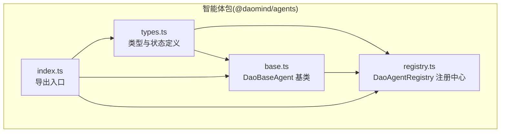
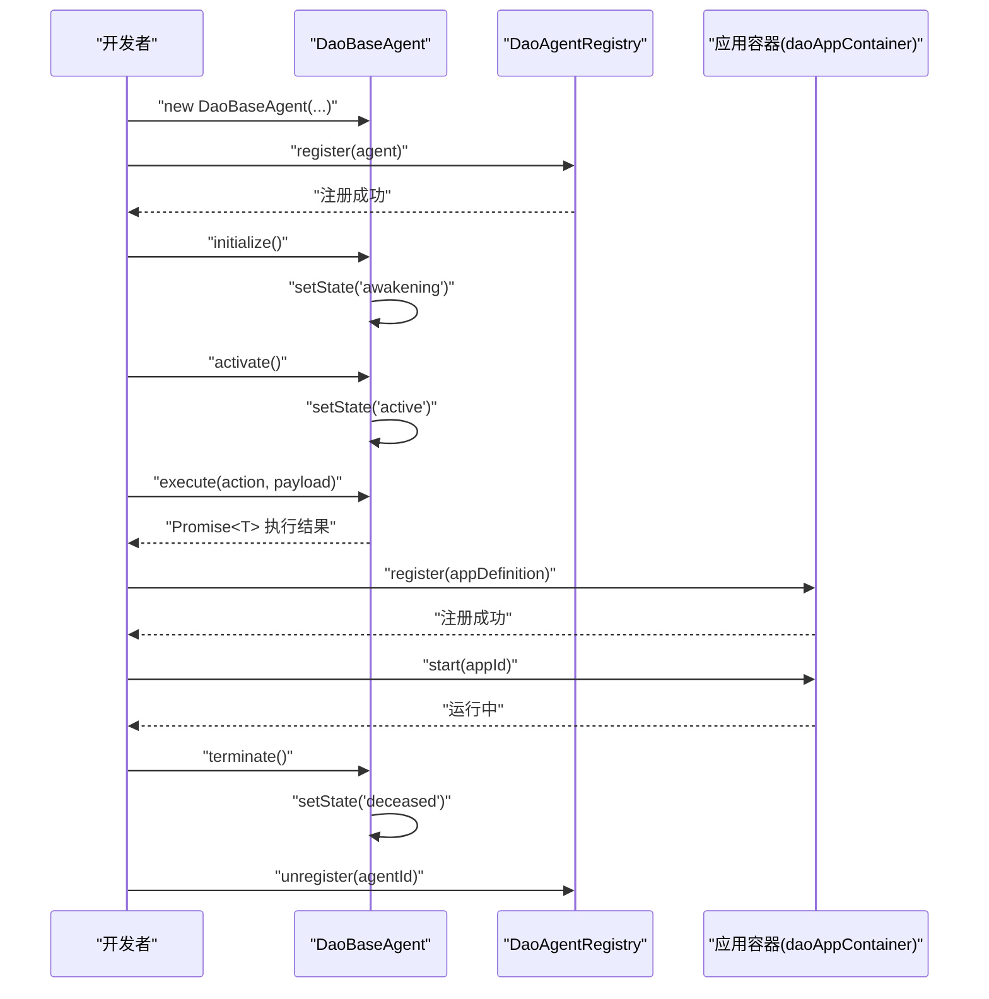
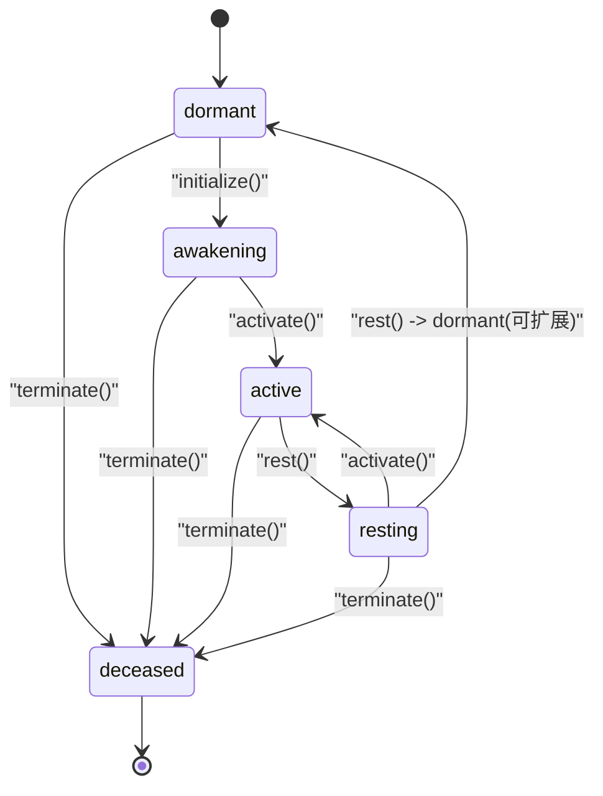
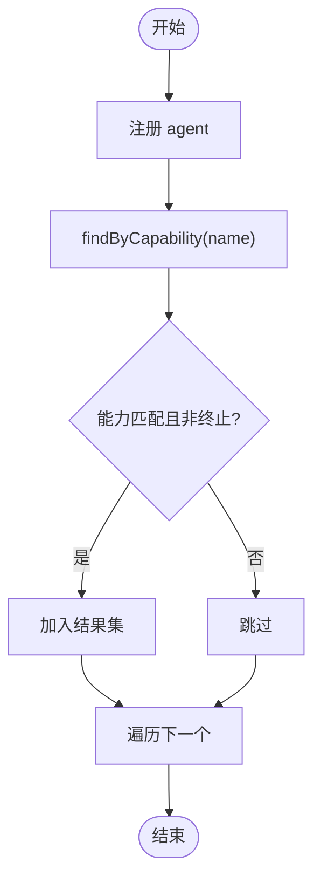
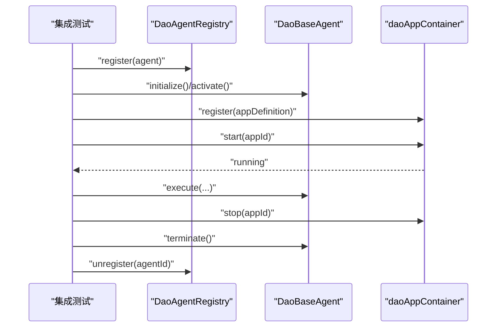
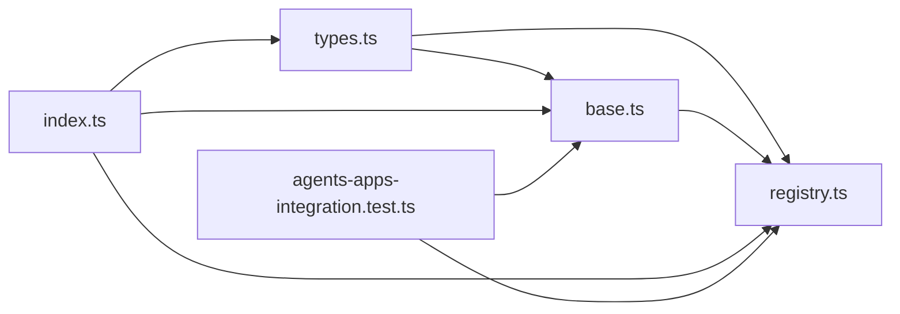

# 智能体管理系统

<cite>
**本文引用的文件**
- [apps/DaoMind/packages/daoAgents/src/base.ts](file://apps/DaoMind/packages/daoAgents/src/base.ts)
- [apps/DaoMind/packages/daoAgents/src/registry.ts](file://apps/DaoMind/packages/daoAgents/src/registry.ts)
- [apps/DaoMind/packages/daoAgents/src/types.ts](file://apps/DaoMind/packages/daoAgents/src/types.ts)
- [apps/DaoMind/packages/daoAgents/src/index.ts](file://apps/DaoMind/packages/daoAgents/src/index.ts)
- [apps/DaoMind/packages/daoAgents/src/__tests__/base.test.ts](file://apps/DaoMind/packages/daoAgents/src/__tests__/base.test.ts)
- [apps/DaoMind/packages/daoAgents/src/__tests__/registry.test.ts](file://apps/DaoMind/packages/daoAgents/src/__tests__/registry.test.ts)
- [apps/DaoMind/src/__tests__/integration/agents-apps-integration.test.ts](file://apps/DaoMind/src/__tests__/integration/agents-apps-integration.test.ts)
</cite>

## 目录
1. [简介](#简介)
2. [项目结构](#项目结构)
3. [核心组件](#核心组件)
4. [架构总览](#架构总览)
5. [详细组件分析](#详细组件分析)
6. [依赖关系分析](#依赖关系分析)
7. [性能考量](#性能考量)
8. [故障排查指南](#故障排查指南)
9. [结论](#结论)
10. [附录](#附录)

## 简介
本文件为 DaoMind 智能体管理系统提供全面实现文档，聚焦以下主题：
- 智能体生命周期管理（创建、初始化、激活、休眠、终止）
- 注册机制与查询能力（按类型、按能力、按状态统计）
- 状态监控与约束（状态机与非法转换防护）
- 与应用容器的集成（依赖管理、启动/停止控制）
- 通信协议与消息传递（execute 动作模型）
- 资源分配与负载均衡策略（基于能力匹配与状态分布）
- 开发模板、调试工具与监控仪表板使用指南
- 实际智能体集成案例与最佳实践

## 项目结构
DaoMind 智能体系统位于 apps/DaoMind/packages/daoAgents 包中，采用清晰的分层设计：
- 类型定义层：统一抽象智能体接口与状态枚举
- 基类层：提供状态机与生命周期方法
- 注册中心：集中管理智能体实例、能力检索与状态统计
- 导出入口：统一对外暴露类型、基类与注册中心

图表来源
- [apps/DaoMind/packages/daoAgents/src/types.ts:1-26](file://apps/DaoMind/packages/daoAgents/src/types.ts#L1-L26)
- [apps/DaoMind/packages/daoAgents/src/base.ts:1-59](file://apps/DaoMind/packages/daoAgents/src/base.ts#L1-L59)
- [apps/DaoMind/packages/daoAgents/src/registry.ts:1-56](file://apps/DaoMind/packages/daoAgents/src/registry.ts#L1-L56)
- [apps/DaoMind/packages/daoAgents/src/index.ts:1-9](file://apps/DaoMind/packages/daoAgents/src/index.ts#L1-L9)

章节来源
- [apps/DaoMind/packages/daoAgents/src/types.ts:1-26](file://apps/DaoMind/packages/daoAgents/src/types.ts#L1-L26)
- [apps/DaoMind/packages/daoAgents/src/base.ts:1-59](file://apps/DaoMind/packages/daoAgents/src/base.ts#L1-L59)
- [apps/DaoMind/packages/daoAgents/src/registry.ts:1-56](file://apps/DaoMind/packages/daoAgents/src/registry.ts#L1-L56)
- [apps/DaoMind/packages/daoAgents/src/index.ts:1-9](file://apps/DaoMind/packages/daoAgents/src/index.ts#L1-L9)

## 核心组件
- DaoAgent 接口：定义智能体标识、类型、能力列表、状态与动作执行方法
- AgentState 枚举：dormant → awakening → active → resting → deceased
- DaoBaseAgent 抽象类：实现状态机与生命周期方法，并提供受控的状态变更
- DaoAgentRegistry：集中注册、注销、查询与统计智能体

章节来源
- [apps/DaoMind/packages/daoAgents/src/types.ts:9-25](file://apps/DaoMind/packages/daoAgents/src/types.ts#L9-L25)
- [apps/DaoMind/packages/daoAgents/src/base.ts:11-56](file://apps/DaoMind/packages/daoAgents/src/base.ts#L11-L56)
- [apps/DaoMind/packages/daoAgents/src/registry.ts:3-52](file://apps/DaoMind/packages/daoAgents/src/registry.ts#L3-L52)

## 架构总览
下图展示了智能体生命周期、注册中心与外部应用容器的交互关系。

图表来源
- [apps/DaoMind/packages/daoAgents/src/base.ts:39-55](file://apps/DaoMind/packages/daoAgents/src/base.ts#L39-L55)
- [apps/DaoMind/packages/daoAgents/src/registry.ts:6-11](file://apps/DaoMind/packages/daoAgents/src/registry.ts#L6-L11)
- [apps/DaoMind/src/__tests__/integration/agents-apps-integration.test.ts:26-80](file://apps/DaoMind/src/__tests__/integration/agents-apps-integration.test.ts#L26-L80)

## 详细组件分析

### 状态机与生命周期
- 状态流转严格受控，仅允许在预定义路径内转换
- 提供 initialize/activate/rest/terminate 四种公开方法
- execute 动作由子类实现，支持任意 payload 与返回值泛型

图表来源
- [apps/DaoMind/packages/daoAgents/src/base.ts:3-9](file://apps/DaoMind/packages/daoAgents/src/base.ts#L3-L9)
- [apps/DaoMind/packages/daoAgents/src/base.ts:29-37](file://apps/DaoMind/packages/daoAgents/src/base.ts#L29-L37)

章节来源
- [apps/DaoMind/packages/daoAgents/src/base.ts:1-59](file://apps/DaoMind/packages/daoAgents/src/base.ts#L1-L59)
- [apps/DaoMind/packages/daoAgents/src/__tests__/base.test.ts:18-91](file://apps/DaoMind/packages/daoAgents/src/__tests__/base.test.ts#L18-L91)

### 注册中心与查询能力
- 注册去重：重复 ID 将抛出异常
- 查询能力：按能力名称过滤，排除已终止实例
- 查询类型：按 agentType 过滤
- 统计：按状态计数，便于负载与健康监控

图表来源
- [apps/DaoMind/packages/daoAgents/src/registry.ts:21-29](file://apps/DaoMind/packages/daoAgents/src/registry.ts#L21-L29)

章节来源
- [apps/DaoMind/packages/daoAgents/src/registry.ts:1-56](file://apps/DaoMind/packages/daoAgents/src/registry.ts#L1-L56)
- [apps/DaoMind/packages/daoAgents/src/__tests__/registry.test.ts:34-157](file://apps/DaoMind/packages/daoAgents/src/__tests__/registry.test.ts#L34-L157)

### 通信协议与消息传递
- execute(action, payload?)：统一的动作调用接口，返回 Promise<T>
- payload 支持任意结构；返回值通过泛型约束
- 建议在子类中实现幂等与超时控制

章节来源
- [apps/DaoMind/packages/daoAgents/src/types.ts:24-25](file://apps/DaoMind/packages/daoAgents/src/types.ts#L24-L25)
- [apps/DaoMind/packages/daoAgents/src/base.ts:55-55](file://apps/DaoMind/packages/daoAgents/src/base.ts#L55-L55)

### 与应用容器的集成
- 智能体与应用分别注册到各自容器
- 应用容器支持依赖声明与启动顺序校验
- 集成测试验证了智能体状态与应用状态的一致性

图表来源
- [apps/DaoMind/src/__tests__/integration/agents-apps-integration.test.ts:26-112](file://apps/DaoMind/src/__tests__/integration/agents-apps-integration.test.ts#L26-L112)

章节来源
- [apps/DaoMind/src/__tests__/integration/agents-apps-integration.test.ts:1-113](file://apps/DaoMind/src/__tests__/integration/agents-apps-integration.test.ts#L1-L113)

## 依赖关系分析
- DaoBaseAgent 依赖 AgentState 与 DaoAgent 能力描述
- DaoAgentRegistry 依赖 DaoAgent 接口进行注册与查询
- 导出入口统一暴露类型、基类与注册中心
- 集成测试同时依赖 @daomind/agents 与 @daomind/apps

图表来源
- [apps/DaoMind/packages/daoAgents/src/types.ts:1-26](file://apps/DaoMind/packages/daoAgents/src/types.ts#L1-L26)
- [apps/DaoMind/packages/daoAgents/src/base.ts:1-59](file://apps/DaoMind/packages/daoAgents/src/base.ts#L1-L59)
- [apps/DaoMind/packages/daoAgents/src/registry.ts:1-56](file://apps/DaoMind/packages/daoAgents/src/registry.ts#L1-L56)
- [apps/DaoMind/packages/daoAgents/src/index.ts:1-9](file://apps/DaoMind/packages/daoAgents/src/index.ts#L1-L9)
- [apps/DaoMind/src/__tests__/integration/agents-apps-integration.test.ts:1-4](file://apps/DaoMind/src/__tests__/integration/agents-apps-integration.test.ts#L1-L4)

章节来源
- [apps/DaoMind/packages/daoAgents/src/index.ts:1-9](file://apps/DaoMind/packages/daoAgents/src/index.ts#L1-L9)
- [apps/DaoMind/src/__tests__/integration/agents-apps-integration.test.ts:1-4](file://apps/DaoMind/src/__tests__/integration/agents-apps-integration.test.ts#L1-L4)

## 性能考量
- 状态查询与统计：findByCapability/findByType 为 O(N) 遍历，建议在高频场景下引入索引或缓存
- 注册中心容量：Map 存储，注册/注销/查询均为平均 O(1)，适合中小规模并发
- 并发安全：当前实现未内置锁，建议在多线程/多进程环境中加锁或使用不可变快照
- 能力匹配：按能力名称过滤时避免频繁字符串比较，可考虑预构建映射表

## 故障排查指南
- 非法状态转换
  - 现象：调用 activate() 时抛出“非法状态转换”错误
  - 原因：必须先 initialize() 再 activate()
  - 处理：确保按 dormant → awakening → active 的顺序执行
- 重复注册
  - 现象：注册相同 ID 的智能体会抛出“Agent 已注册”错误
  - 处理：确保 ID 唯一；必要时先 unregister 再 register
- 查询不到智能体
  - 现象：findByCapability/findbyType 返回空数组
  - 原因：可能被 terminate() 终止或尚未激活
  - 处理：确认状态非 deceased；必要时重新初始化并激活
- 应用启动失败（依赖未就绪）
  - 现象：启动主应用时报错“依赖未就绪”
  - 处理：先启动依赖应用，再启动主应用

章节来源
- [apps/DaoMind/packages/daoAgents/src/base.ts:32-35](file://apps/DaoMind/packages/daoAgents/src/base.ts#L32-L35)
- [apps/DaoMind/packages/daoAgents/src/registry.ts:7-10](file://apps/DaoMind/packages/daoAgents/src/registry.ts#L7-L10)
- [apps/DaoMind/src/__tests__/integration/agents-apps-integration.test.ts:102-103](file://apps/DaoMind/src/__tests__/integration/agents-apps-integration.test.ts#L102-L103)

## 结论
DaoMind 智能体管理系统以简洁的接口与严格的生命周期状态机为核心，结合集中式注册中心实现了对智能体的全生命周期管理与能力检索。通过与应用容器的集成测试，验证了智能体与应用协同工作的可行性。建议在生产环境中补充能力索引、并发控制与可观测性指标，以满足高可用与高性能需求。

## 附录

### 开发模板与最佳实践
- 开发模板
  - 继承 DaoBaseAgent，实现 agentType、capabilities 与 execute
  - 在 initialize/activate/rest/terminate 中处理资源申请与释放
  - 使用 execute(action, payload?) 承载业务逻辑
- 最佳实践
  - 明确状态转换路径，避免跨状态跳跃
  - 对外暴露能力名称与版本，便于动态匹配
  - 在高频查询场景引入缓存或索引
  - 为 execute 添加超时与重试策略
  - 使用集成测试验证智能体与应用的协作

章节来源
- [apps/DaoMind/packages/daoAgents/src/base.ts:11-56](file://apps/DaoMind/packages/daoAgents/src/base.ts#L11-L56)
- [apps/DaoMind/packages/daoAgents/src/types.ts:3-7](file://apps/DaoMind/packages/daoAgents/src/types.ts#L3-L7)
- [apps/DaoMind/src/__tests__/integration/agents-apps-integration.test.ts:26-80](file://apps/DaoMind/src/__tests__/integration/agents-apps-integration.test.ts#L26-L80)

### 调试工具与监控仪表板
- 调试工具
  - 单元测试：覆盖状态机与注册中心行为
  - 集成测试：验证智能体与应用容器协作
- 监控仪表板
  - 建议展示：智能体总数、按状态分布、按类型分布、按能力分布
  - 建议指标：活跃度、吞吐量、错误率、平均响应时间

章节来源
- [apps/DaoMind/packages/daoAgents/src/__tests__/base.test.ts:18-91](file://apps/DaoMind/packages/daoAgents/src/__tests__/base.test.ts#L18-L91)
- [apps/DaoMind/packages/daoAgents/src/__tests__/registry.test.ts:34-157](file://apps/DaoMind/packages/daoAgents/src/__tests__/registry.test.ts#L34-L157)
- [apps/DaoMind/src/__tests__/integration/agents-apps-integration.test.ts:1-113](file://apps/DaoMind/src/__tests__/integration/agents-apps-integration.test.ts#L1-L113)