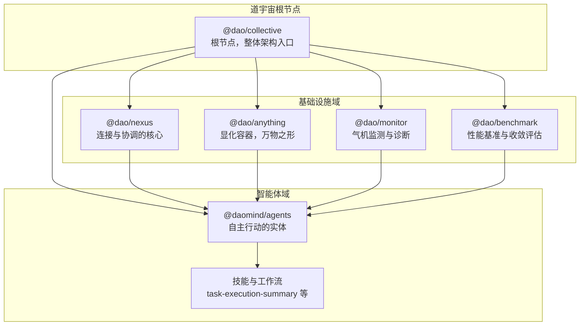
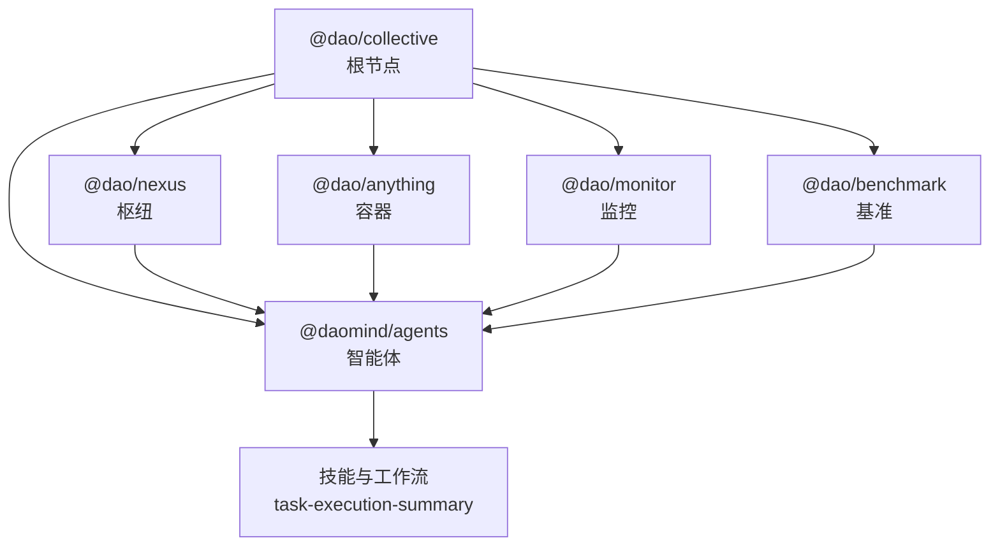
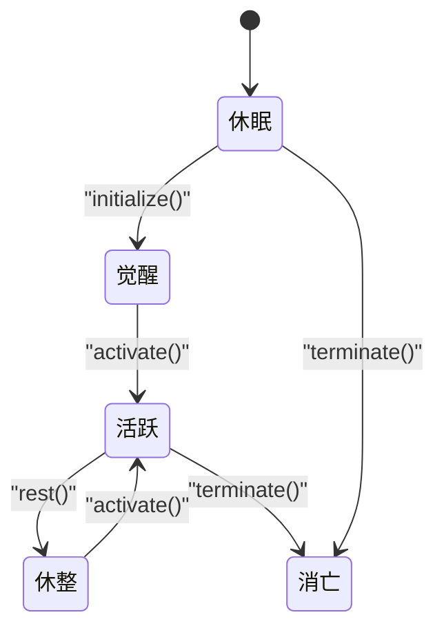
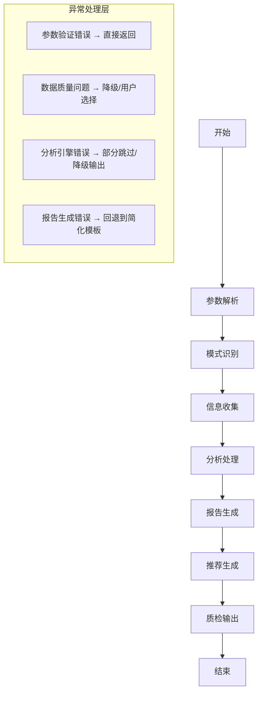
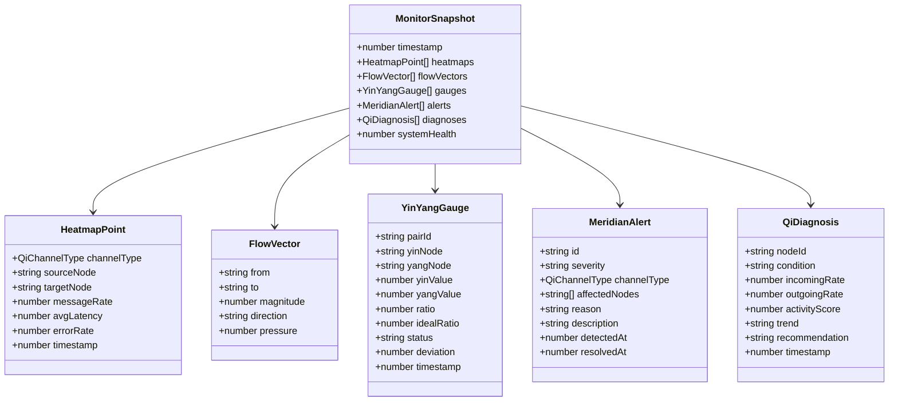
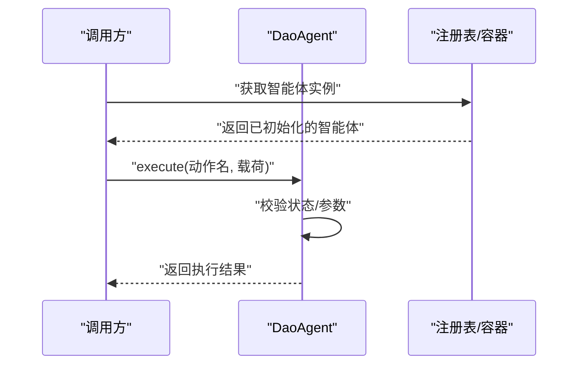
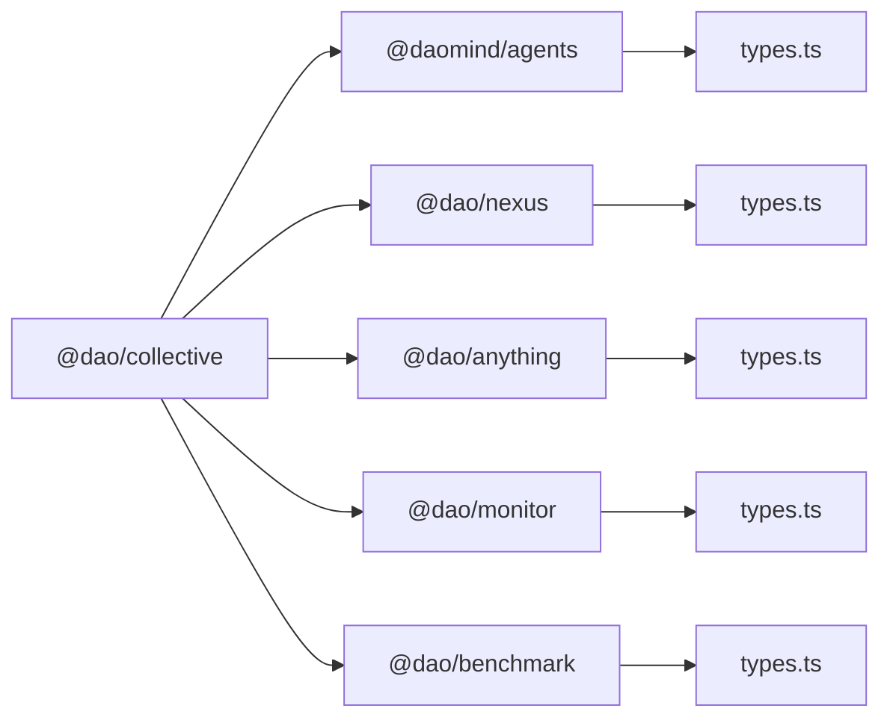

# 系统架构设计

<cite>
**本文引用的文件**
- [apps/DaoMind/packages/daoAgents/src/index.ts](file://apps/DaoMind/packages/daoAgents/src/index.ts)
- [apps/DaoMind/packages/daoAgents/src/types.ts](file://apps/DaoMind/packages/daoAgents/src/types.ts)
- [apps/DaoMind/packages/daoNexus/src/index.ts](file://apps/DaoMind/packages/daoNexus/src/index.ts)
- [apps/DaoMind/packages/daoNexus/src/types.ts](file://apps/DaoMind/packages/daoNexus/src/types.ts)
- [apps/DaoMind/packages/daoAnything/src/index.ts](file://apps/DaoMind/packages/daoAnything/src/index.ts)
- [apps/DaoMind/packages/daoAnything/src/types.ts](file://apps/DaoMind/packages/daoAnything/src/types.ts)
- [apps/DaoMind/packages/daoMonitor/src/index.ts](file://apps/DaoMind/packages/daoMonitor/src/index.ts)
- [apps/DaoMind/packages/daoMonitor/src/types.ts](file://apps/DaoMind/packages/daoMonitor/src/types.ts)
- [apps/DaoMind/packages/daoBenchmark/src/index.ts](file://apps/DaoMind/packages/daoBenchmark/src/index.ts)
- [apps/DaoMind/packages/daoBenchmark/src/types.ts](file://apps/DaoMind/packages/daoBenchmark/src/types.ts)
- [apps/DaoMind/packages/daoCollective/src/index.ts](file://apps/DaoMind/packages/daoCollective/src/index.ts)
- [skills/daoSkilLs/skills/task-execution-summary/references/execution-flow.md](file://skills/daoSkilLs/skills/task-execution-summary/references/execution-flow.md)
- [apps/DaoMind/packages/daoAgents/src/__tests__/base.test.ts](file://apps/DaoMind/packages/daoAgents/src/__tests__/base.test.ts)
</cite>

## 目录
1. [引言](#引言)
2. [项目结构](#项目结构)
3. [核心组件](#核心组件)
4. [架构总览](#架构总览)
5. [详细组件分析](#详细组件分析)
6. [依赖关系分析](#依赖关系分析)
7. [性能考量](#性能考量)
8. [故障排查指南](#故障排查指南)
9. [结论](#结论)
10. [附录](#附录)

## 引言
本技术文档面向DaoMind多智能体系统，聚焦于整体架构模式、组件层次结构与模块化设计理念，系统阐述智能体管理架构、任务调度机制与状态同步策略，并给出可扩展性设计、性能优化与容错机制的实践建议。文档以仓库中的实际模块为依据，结合可观测性与容错性原则，提供架构图表、组件交互流程与数据流向图，帮助读者快速理解并在此基础上进行功能扩展与定制开发。

## 项目结构
DaoMind采用多包（monorepo）组织方式，围绕“道宇宙”根节点抽象，形成“智能体”“枢纽”“容器”“监控”“基准测试”等核心子系统，辅以“技能”“应用”等扩展域。下图展示了顶层模块之间的关系与职责边界：

**图表来源**
- [apps/DaoMind/packages/daoCollective/src/index.ts:1-5](file://apps/DaoMind/packages/daoCollective/src/index.ts#L1-L5)
- [apps/DaoMind/packages/daoAgents/src/index.ts:1-9](file://apps/DaoMind/packages/daoAgents/src/index.ts#L1-L9)
- [apps/DaoMind/packages/daoNexus/src/index.ts:1-27](file://apps/DaoMind/packages/daoNexus/src/index.ts#L1-L27)
- [apps/DaoMind/packages/daoAnything/src/index.ts:1-13](file://apps/DaoMind/packages/daoAnything/src/index.ts#L1-L13)
- [apps/DaoMind/packages/daoMonitor/src/index.ts:1-17](file://apps/DaoMind/packages/daoMonitor/src/index.ts#L1-L17)
- [apps/DaoMind/packages/daoBenchmark/src/index.ts:1-16](file://apps/DaoMind/packages/daoBenchmark/src/index.ts#L1-L16)

**章节来源**
- [apps/DaoMind/packages/daoCollective/src/index.ts:1-5](file://apps/DaoMind/packages/daoCollective/src/index.ts#L1-L5)
- [apps/DaoMind/packages/daoAgents/src/index.ts:1-9](file://apps/DaoMind/packages/daoAgents/src/index.ts#L1-L9)
- [apps/DaoMind/packages/daoNexus/src/index.ts:1-27](file://apps/DaoMind/packages/daoNexus/src/index.ts#L1-L27)
- [apps/DaoMind/packages/daoAnything/src/index.ts:1-13](file://apps/DaoMind/packages/daoAnything/src/index.ts#L1-L13)
- [apps/DaoMind/packages/daoMonitor/src/index.ts:1-17](file://apps/DaoMind/packages/daoMonitor/src/index.ts#L1-L17)
- [apps/DaoMind/packages/daoBenchmark/src/index.ts:1-16](file://apps/DaoMind/packages/daoBenchmark/src/index.ts#L1-L16)

## 核心组件
本节对系统的关键模块进行深入剖析，包括智能体、枢纽、容器、监控与基准测试的职责、接口与协作关系。

- 智能体（@daomind/agents）
  - 职责：定义智能体生命周期、状态机与能力接口；提供注册表与基础实现。
  - 关键类型：智能体能力、状态枚举、智能体接口。
  - 导出：注册表、基础类、包元信息。
  
  **章节来源**
  - [apps/DaoMind/packages/daoAgents/src/types.ts:1-26](file://apps/DaoMind/packages/daoAgents/src/types.ts#L1-L26)
  - [apps/DaoMind/packages/daoAgents/src/index.ts:1-9](file://apps/DaoMind/packages/daoAgents/src/index.ts#L1-L9)

- 枢纽（@dao/nexus）
  - 职责：连接管理、路由、负载均衡、服务发现与指标采集，实现内外贯通的统一协调。
  - 关键类型：连接、路由规则、负载均衡策略、服务实例、请求与指标。
  - 导出：连接管理器、路由器、负载均衡器、服务发现、枢纽核心。
  
  **章节来源**
  - [apps/DaoMind/packages/daoNexus/src/types.ts:1-59](file://apps/DaoMind/packages/daoNexus/src/types.ts#L1-L59)
  - [apps/DaoMind/packages/daoNexus/src/index.ts:1-27](file://apps/DaoMind/packages/daoNexus/src/index.ts#L1-L27)

- 容器（@dao/anything）
  - 职责：模块注册与生命周期管理，作为“显化容器”，承载模块装配与运行。
  - 关键类型：模块注册、生命周期状态、模块元信息。
  - 导出：容器与包元信息。
  
  **章节来源**
  - [apps/DaoMind/packages/daoAnything/src/types.ts:1-23](file://apps/DaoMind/packages/daoAnything/src/types.ts#L1-L23)
  - [apps/DaoMind/packages/daoAnything/src/index.ts:1-13](file://apps/DaoMind/packages/daoAnything/src/index.ts#L1-L13)

- 监控（@dao/monitor）
  - 职责：基于中医经络理论抽象的气机监测，提供热力图、向量场、阴阳平衡、告警与诊断等能力。
  - 关键类型：气通道类型、热力图点、流向向量、阴阳仪表、告警、诊断、快照。
  - 导出：热力引擎、向量场、阴阳仪表引擎、告警引擎、诊断引擎、快照聚合器。
  
  **章节来源**
  - [apps/DaoMind/packages/daoMonitor/src/types.ts:1-72](file://apps/DaoMind/packages/daoMonitor/src/types.ts#L1-L72)
  - [apps/DaoMind/packages/daoMonitor/src/index.ts:1-17](file://apps/DaoMind/packages/daoMonitor/src/index.ts#L1-L17)

- 基准（@dao/benchmark）
  - 职责：性能基准测试与收敛评估，输出指标、结果与综合报告。
  - 关键类型：指标、结果、性能报告。
  - 导出：基准运行器与若干测量套件。
  
  **章节来源**
  - [apps/DaoMind/packages/daoBenchmark/src/types.ts:1-29](file://apps/DaoMind/packages/daoBenchmark/src/types.ts#L1-L29)
  - [apps/DaoMind/packages/daoBenchmark/src/index.ts:1-16](file://apps/DaoMind/packages/daoBenchmark/src/index.ts#L1-L16)

- 道宇宙根节点（@dao/collective）
  - 职责：作为整体架构入口，聚合各子系统。
  
  **章节来源**
  - [apps/DaoMind/packages/daoCollective/src/index.ts:1-5](file://apps/DaoMind/packages/daoCollective/src/index.ts#L1-L5)

## 架构总览
下图展示了DaoMind多智能体系统的核心架构：以“道宇宙”为根，智能体通过容器进行模块化装配，枢纽负责连接与路由，监控与基准贯穿系统全链路，技能域提供任务执行与工作流能力。

**图表来源**
- [apps/DaoMind/packages/daoCollective/src/index.ts:1-5](file://apps/DaoMind/packages/daoCollective/src/index.ts#L1-L5)
- [apps/DaoMind/packages/daoAgents/src/index.ts:1-9](file://apps/DaoMind/packages/daoAgents/src/index.ts#L1-L9)
- [apps/DaoMind/packages/daoNexus/src/index.ts:1-27](file://apps/DaoMind/packages/daoNexus/src/index.ts#L1-L27)
- [apps/DaoMind/packages/daoAnything/src/index.ts:1-13](file://apps/DaoMind/packages/daoAnything/src/index.ts#L1-L13)
- [apps/DaoMind/packages/daoMonitor/src/index.ts:1-17](file://apps/DaoMind/packages/daoMonitor/src/index.ts#L1-L17)
- [apps/DaoMind/packages/daoBenchmark/src/index.ts:1-16](file://apps/DaoMind/packages/daoBenchmark/src/index.ts#L1-L16)

## 详细组件分析

### 智能体管理架构
- 状态机设计
  - 状态枚举覆盖休眠、觉醒、活跃、休整、消亡，确保生命周期可控与可观测。
  - 测试覆盖了状态转换合法性与错误路径，体现容错与健壮性。
- 能力接口
  - 智能体具备初始化、激活、休整、终止与动作执行等核心方法，便于统一调度与编排。
- 注册与装配
  - 通过注册表与容器实现模块化装配，支持按需加载与动态扩展。

**图表来源**
- [apps/DaoMind/packages/daoAgents/src/types.ts:9-14](file://apps/DaoMind/packages/daoAgents/src/types.ts#L9-L14)
- [apps/DaoMind/packages/daoAgents/src/__tests__/base.test.ts:45-91](file://apps/DaoMind/packages/daoAgents/src/__tests__/base.test.ts#L45-L91)

**章节来源**
- [apps/DaoMind/packages/daoAgents/src/types.ts:1-26](file://apps/DaoMind/packages/daoAgents/src/types.ts#L1-L26)
- [apps/DaoMind/packages/daoAgents/src/index.ts:1-9](file://apps/DaoMind/packages/daoAgents/src/index.ts#L1-L9)
- [apps/DaoMind/packages/daoAgents/src/__tests__/base.test.ts:45-91](file://apps/DaoMind/packages/daoAgents/src/__tests__/base.test.ts#L45-L91)

### 任务调度机制与工作流
- 执行流水线
  - 任务执行总结报告生成器采用七步流水线：参数解析、模式识别、信息收集、分析处理、报告生成、推荐生成、质检输出。
  - 数据流层定义了内部配置、收集范围、收集数据、分析报告、草稿报告、推荐与最终响应等跨阶段数据结构。
- 可观测性与容错
  - 每步产出可审查的中间结果，关键决策点记录依据；异常分级处理（Error/Warning），支持降级运行与自动恢复。
  - 性能指标与耗时分布明确，便于瓶颈定位与优化。

**图表来源**
- [skills/daoSkilLs/skills/task-execution-summary/references/execution-flow.md:97-158](file://skills/daoSkilLs/skills/task-execution-summary/references/execution-flow.md#L97-L158)

**章节来源**
- [skills/daoSkilLs/skills/task-execution-summary/references/execution-flow.md:55-158](file://skills/daoSkilLs/skills/task-execution-summary/references/execution-flow.md#L55-L158)

### 状态同步策略
- 气机监测与诊断
  - 通过热力图点、流向向量、阴阳仪表、告警与诊断等模型，构建系统健康快照，支撑状态同步与趋势预测。
  - 快照聚合器汇总多源指标，形成全局视图，辅助决策与干预。
- 指标与告警
  - 指标维度覆盖吞吐、延迟、错误率等；告警按严重级别与阻塞类型分级，保障异常可感知与可处置。

**图表来源**
- [apps/DaoMind/packages/daoMonitor/src/types.ts:1-72](file://apps/DaoMind/packages/daoMonitor/src/types.ts#L1-L72)
- [apps/DaoMind/packages/daoMonitor/src/index.ts:1-17](file://apps/DaoMind/packages/daoMonitor/src/index.ts#L1-L17)

**章节来源**
- [apps/DaoMind/packages/daoMonitor/src/types.ts:1-72](file://apps/DaoMind/packages/daoMonitor/src/types.ts#L1-L72)
- [apps/DaoMind/packages/daoMonitor/src/index.ts:1-17](file://apps/DaoMind/packages/daoMonitor/src/index.ts#L1-L17)

### 组件交互流程（示例：智能体动作执行）
以下序列图展示从外部调用到智能体执行动作的典型交互，体现统一接口与可扩展能力。

**图表来源**
- [apps/DaoMind/packages/daoAgents/src/types.ts:16-25](file://apps/DaoMind/packages/daoAgents/src/types.ts#L16-L25)
- [apps/DaoMind/packages/daoAgents/src/index.ts:1-9](file://apps/DaoMind/packages/daoAgents/src/index.ts#L1-L9)

## 依赖关系分析
- 内聚与耦合
  - 智能体与枢纽、容器、监控、基准之间通过清晰的接口契约耦合，降低直接依赖，提升内聚。
- 外部依赖
  - 智能体接口继承存在性契约，确保生命周期一致性；枢纽类型定义连接、路由与负载均衡的通用模型。
- 循环依赖
  - 从当前导出关系看，未见循环依赖迹象；根节点聚合各子系统，避免反向依赖。

**图表来源**
- [apps/DaoMind/packages/daoAgents/src/types.ts:1-26](file://apps/DaoMind/packages/daoAgents/src/types.ts#L1-L26)
- [apps/DaoMind/packages/daoNexus/src/types.ts:1-59](file://apps/DaoMind/packages/daoNexus/src/types.ts#L1-L59)
- [apps/DaoMind/packages/daoAnything/src/types.ts:1-23](file://apps/DaoMind/packages/daoAnything/src/types.ts#L1-L23)
- [apps/DaoMind/packages/daoMonitor/src/types.ts:1-72](file://apps/DaoMind/packages/daoMonitor/src/types.ts#L1-L72)
- [apps/DaoMind/packages/daoBenchmark/src/types.ts:1-29](file://apps/DaoMind/packages/daoBenchmark/src/types.ts#L1-L29)
- [apps/DaoMind/packages/daoCollective/src/index.ts:1-5](file://apps/DaoMind/packages/daoCollective/src/index.ts#L1-L5)

**章节来源**
- [apps/DaoMind/packages/daoAgents/src/types.ts:1-26](file://apps/DaoMind/packages/daoAgents/src/types.ts#L1-L26)
- [apps/DaoMind/packages/daoNexus/src/types.ts:1-59](file://apps/DaoMind/packages/daoNexus/src/types.ts#L1-L59)
- [apps/DaoMind/packages/daoAnything/src/types.ts:1-23](file://apps/DaoMind/packages/daoAnything/src/types.ts#L1-L23)
- [apps/DaoMind/packages/daoMonitor/src/types.ts:1-72](file://apps/DaoMind/packages/daoMonitor/src/types.ts#L1-L72)
- [apps/DaoMind/packages/daoBenchmark/src/types.ts:1-29](file://apps/DaoMind/packages/daoBenchmark/src/types.ts#L1-L29)
- [apps/DaoMind/packages/daoCollective/src/index.ts:1-5](file://apps/DaoMind/packages/daoCollective/src/index.ts#L1-L5)

## 性能考量
- 指标与报告
  - 基准测试提供启动时间、内存基线、吞吐、反馈延迟、收敛时间等关键指标，支持生成综合性能报告。
- 工作流瓶颈
  - 信息收集与分析处理阶段通常占主要耗时，建议针对这两步进行缓存、并行化与资源扩容。
- 可观测性
  - 通过结构化日志、中间数据序列化与质量指标追踪，实现端到端可观测，便于定位瓶颈与回归分析。

**章节来源**
- [apps/DaoMind/packages/daoBenchmark/src/types.ts:1-29](file://apps/DaoMind/packages/daoBenchmark/src/types.ts#L1-L29)
- [apps/DaoMind/packages/daoBenchmark/src/index.ts:1-16](file://apps/DaoMind/packages/daoBenchmark/src/index.ts#L1-L16)
- [skills/daoSkilLs/skills/task-execution-summary/references/execution-flow.md:142-158](file://skills/daoSkilLs/skills/task-execution-summary/references/execution-flow.md#L142-L158)

## 故障排查指南
- 状态机异常
  - 若出现非法状态转换，应检查初始化与激活顺序；测试用例覆盖了从休眠到活跃、从休整到活跃以及非法转换抛错的场景。
- 容错策略
  - 区分致命错误与非致命异常，采用降级运行与警告式成功响应，确保系统在部分功能不可用时仍可产出可用结果。
- 监控告警
  - 使用告警引擎与诊断引擎，结合热力图与流向向量，快速定位异常节点与阻塞路径。

**章节来源**
- [apps/DaoMind/packages/daoAgents/src/__tests__/base.test.ts:80-83](file://apps/DaoMind/packages/daoAgents/src/__tests__/base.test.ts#L80-L83)
- [skills/daoSkilLs/skills/task-execution-summary/references/execution-flow.md:76-93](file://skills/daoSkilLs/skills/task-execution-summary/references/execution-flow.md#L76-L93)
- [apps/DaoMind/packages/daoMonitor/src/index.ts:1-17](file://apps/DaoMind/packages/daoMonitor/src/index.ts#L1-L17)

## 结论
DaoMind多智能体系统以“道宇宙”为根，采用模块化与可插拔的设计理念，通过智能体、枢纽、容器、监控与基准五大支柱协同工作，实现了高内聚、低耦合且具备可观测性与容错性的整体架构。工作流层面的七步执行流水线与严格的异常分级处理，确保了在复杂任务场景下的稳定性与可维护性。基于此架构，团队可在不破坏契约的前提下进行功能扩展与定制开发。

## 附录
- 架构决策的技术背景与权衡
  - 以接口契约约束模块边界，降低耦合度，提升可测试性与可替换性。
  - 采用状态机与生命周期管理，确保系统行为可预期与可审计。
  - 引入监控与基准测试，将性能与健康度纳入持续交付流程。
- 扩展与定制开发建议
  - 新增智能体：遵循现有状态机与能力接口，通过注册表与容器完成装配。
  - 新增路由规则与负载均衡策略：在枢纽模块中扩展类型与实现，保持对外接口一致。
  - 新增监控维度：在监控模块中新增指标类型与计算引擎，复用快照聚合器。
  - 新增基准场景：在基准模块中新增测量套件与报告项，统一指标输出格式。