# 通信协议与消息系统

<cite>
**本文引用的文件**
- [apps/DaoMind/packages/daoQi/src/hunyuan.ts](file://apps/DaoMind/packages/daoQi/src/hunyuan.ts)
- [apps/DaoMind/packages/daoQi/src/codec/serializer.ts](file://apps/DaoMind/packages/daoQi/src/codec/serializer.ts)
- [apps/DaoMind/packages/daoQi/src/router.ts](file://apps/DaoMind/packages/daoQi/src/router.ts)
- [apps/DaoMind/packages/daoQi/src/backpressure.ts](file://apps/DaoMind/packages/daoQi/src/backpressure.ts)
- [apps/DaoMind/packages/daoQi/src/signer.ts](file://apps/DaoMind/packages/daoQi/src/signer.ts)
- [apps/DaoMind/packages/daoQi/src/types/message.ts](file://apps/DaoMind/packages/daoQi/src/types/message.ts)
- [apps/DaoMind/packages/daoQi/src/types/channel.ts](file://apps/DaoMind/packages/daoQi/src/types/channel.ts)
- [apps/DaoMind/packages/daoNexus/src/connection-manager.ts](file://apps/DaoMind/packages/daoNexus/src/connection-manager.ts)
- [apps/DaoMind/packages/daoNexus/src/load-balancer.ts](file://apps/DaoMind/packages/daoNexus/src/load-balancer.ts)
- [apps/DaoMind/packages/daoNexus/src/index.ts](file://apps/DaoMind/packages/daoNexus/src/index.ts)
- [apps/AgentPit/src/composables/useSSE.ts](file://apps/AgentPit/src/composables/useSSE.ts)
- [apps/AgentPit/src/__tests__/composables/useSSE.spec.ts](file://apps/AgentPit/src/__tests__/composables/useSSE.spec.ts)
- [apps/DaoMind/packages/daoMonitor/src/snapshot.ts](file://apps/DaoMind/packages/daoMonitor/src/snapshot.ts)
- [tools/flexloop/tests/testing/test_config_center/test_push_service.py](file://tools/flexloop/tests/testing/test_config_center/test_push_service.py)
- [tools/flexloop/src/taolib/testing/config_center/server/websocket/manager.py](file://tools/flexloop/src/taolib/testing/config_center/server/websocket/manager.py)
- [tools/flexloop/src/taolib/testing/config_center/server/websocket/heartbeat.py](file://tools/flexloop/src/taolib/testing/config_center/server/websocket/heartbeat.py)
- [tools/flexloop/src/taolib/testing/oauth/crypto/token_encryption.py](file://tools/flexloop/src/taolib/testing/oauth/crypto/token_encryption.py)
</cite>

## 目录
1. [引言](#引言)
2. [项目结构](#项目结构)
3. [核心组件](#核心组件)
4. [架构总览](#架构总览)
5. [详细组件分析](#详细组件分析)
6. [依赖关系分析](#依赖关系分析)
7. [性能考量](#性能考量)
8. [故障排查指南](#故障排查指南)
9. [结论](#结论)
10. [附录](#附录)

## 引言
本文件面向DaoMind智能体间通信协议与消息系统，系统性阐述消息格式、事件驱动架构、消息路由与负载分发策略、实时通信实现、连接管理与断线重连机制、序列化与安全校验、以及性能优化与监控诊断方法。文档以DaoQi总线与DaoNexus枢纽为核心，结合AgentPit前端SSE示例与flexloop后端推送/心跳/ACK机制，形成从协议设计到工程落地的完整技术蓝图。

## 项目结构
围绕通信协议与消息系统的关键目录与文件如下：
- DaoQi总线与协议层：消息类型、序列化、路由、背压、签名与混元总线
- DaoNexus枢纽层：连接管理、负载均衡、服务发现与导出入口
- AgentPit前端：SSE连接与消息流演示
- flexloop后端：WebSocket连接管理、心跳、ACK重试与广播
- DaoMonitor：监控快照与健康度聚合

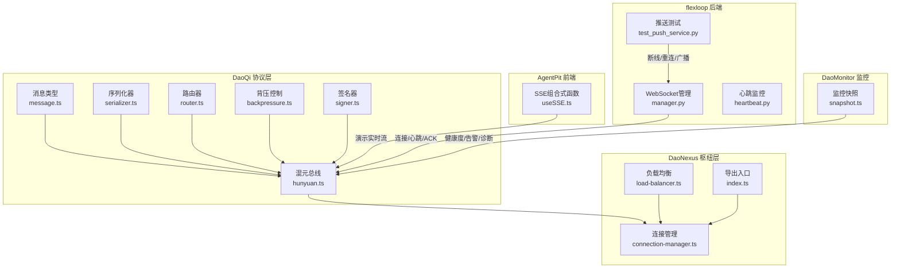

**图表来源**
- [apps/DaoMind/packages/daoQi/src/types/message.ts:1-40](file://apps/DaoMind/packages/daoQi/src/types/message.ts#L1-L40)
- [apps/DaoMind/packages/daoQi/src/codec/serializer.ts:1-75](file://apps/DaoMind/packages/daoQi/src/codec/serializer.ts#L1-L75)
- [apps/DaoMind/packages/daoQi/src/router.ts:1-47](file://apps/DaoMind/packages/daoQi/src/router.ts#L1-L47)
- [apps/DaoMind/packages/daoQi/src/backpressure.ts:1-69](file://apps/DaoMind/packages/daoQi/src/backpressure.ts#L1-L69)
- [apps/DaoMind/packages/daoQi/src/signer.ts:1-40](file://apps/DaoMind/packages/daoQi/src/signer.ts#L1-L40)
- [apps/DaoMind/packages/daoQi/src/hunyuan.ts:1-125](file://apps/DaoMind/packages/daoQi/src/hunyuan.ts#L1-L125)
- [apps/DaoMind/packages/daoNexus/src/connection-manager.ts:1-139](file://apps/DaoMind/packages/daoNexus/src/connection-manager.ts#L1-L139)
- [apps/DaoMind/packages/daoNexus/src/load-balancer.ts:1-71](file://apps/DaoMind/packages/daoNexus/src/load-balancer.ts#L1-L71)
- [apps/DaoMind/packages/daoNexus/src/index.ts:1-27](file://apps/DaoMind/packages/daoNexus/src/index.ts#L1-L27)
- [apps/AgentPit/src/composables/useSSE.ts:1-129](file://apps/AgentPit/src/composables/useSSE.ts#L1-L129)
- [tools/flexloop/src/taolib/testing/config_center/server/websocket/manager.py:43-425](file://tools/flexloop/src/taolib/testing/config_center/server/websocket/manager.py#L43-L425)
- [tools/flexloop/src/taolib/testing/config_center/server/websocket/heartbeat.py:1-49](file://tools/flexloop/src/taolib/testing/config_center/server/websocket/heartbeat.py#L1-L49)
- [tools/flexloop/tests/testing/test_config_center/test_push_service.py:251-880](file://tools/flexloop/tests/testing/test_config_center/test_push_service.py#L251-L880)
- [apps/DaoMind/packages/daoMonitor/src/snapshot.ts:1-75](file://apps/DaoMind/packages/daoMonitor/src/snapshot.ts#L1-L75)

**章节来源**
- [apps/DaoMind/packages/daoQi/src/types/message.ts:1-40](file://apps/DaoMind/packages/daoQi/src/types/message.ts#L1-L40)
- [apps/DaoMind/packages/daoQi/src/codec/serializer.ts:1-75](file://apps/DaoMind/packages/daoQi/src/codec/serializer.ts#L1-L75)
- [apps/DaoMind/packages/daoQi/src/router.ts:1-47](file://apps/DaoMind/packages/daoQi/src/router.ts#L1-L47)
- [apps/DaoMind/packages/daoQi/src/backpressure.ts:1-69](file://apps/DaoMind/packages/daoQi/src/backpressure.ts#L1-L69)
- [apps/DaoMind/packages/daoQi/src/signer.ts:1-40](file://apps/DaoMind/packages/daoQi/src/signer.ts#L1-L40)
- [apps/DaoMind/packages/daoQi/src/hunyuan.ts:1-125](file://apps/DaoMind/packages/daoQi/src/hunyuan.ts#L1-L125)
- [apps/DaoMind/packages/daoNexus/src/connection-manager.ts:1-139](file://apps/DaoMind/packages/daoNexus/src/connection-manager.ts#L1-L139)
- [apps/DaoMind/packages/daoNexus/src/load-balancer.ts:1-71](file://apps/DaoMind/packages/daoNexus/src/load-balancer.ts#L1-L71)
- [apps/DaoMind/packages/daoNexus/src/index.ts:1-27](file://apps/DaoMind/packages/daoNexus/src/index.ts#L1-L27)
- [apps/AgentPit/src/composables/useSSE.ts:1-129](file://apps/AgentPit/src/composables/useSSE.ts#L1-L129)
- [tools/flexloop/src/taolib/testing/config_center/server/websocket/manager.py:43-425](file://tools/flexloop/src/taolib/testing/config_center/server/websocket/manager.py#L43-L425)
- [tools/flexloop/src/taolib/testing/config_center/server/websocket/heartbeat.py:1-49](file://tools/flexloop/src/taolib/testing/config_center/server/websocket/heartbeat.py#L1-L49)
- [tools/flexloop/tests/testing/test_config_center/test_push_service.py:251-880](file://tools/flexloop/tests/testing/test_config_center/test_push_service.py#L251-L880)
- [apps/DaoMind/packages/daoMonitor/src/snapshot.ts:1-75](file://apps/DaoMind/packages/daoMonitor/src/snapshot.ts#L1-L75)

## 核心组件
- 消息协议与类型：统一消息头与消息体结构，支持JSON与二进制编码，定义优先级与TTL等元信息。
- 序列化引擎：根据编码格式选择JSON或二进制序列化，兼容二进制头部长度与体部。
- 路由器：基于目标节点建立订阅映射，支持广播与点对点路由，并统计丢弃计数。
- 背压控制：按节点滑动窗口速率限制，动态采样降限，保障系统“和”态稳定。
- 签名验证：基于HMAC-SHA256的时间安全比较，确保消息真实性与完整性。
- 混元总线：事件驱动的消息总线，串联序列化、路由、背压与签名，提供订阅与探测能力。
- 连接管理：维护连接生命周期、空闲清理、并发上限与消息计数。
- 负载均衡：轮询、最少连接、加权三种策略，适配不同拓扑与容量需求。
- SSE前端演示：连接状态、消息队列与模拟流输出，便于实时渲染与调试。
- WebSocket后端：连接管理、心跳检测、ACK重试与广播，支撑高可用推送。
- 监控快照：热力图、流向矢量、仪表盘、告警与诊断，聚合系统健康度。

**章节来源**
- [apps/DaoMind/packages/daoQi/src/types/message.ts:1-40](file://apps/DaoMind/packages/daoQi/src/types/message.ts#L1-L40)
- [apps/DaoMind/packages/daoQi/src/codec/serializer.ts:1-75](file://apps/DaoMind/packages/daoQi/src/codec/serializer.ts#L1-L75)
- [apps/DaoMind/packages/daoQi/src/router.ts:1-47](file://apps/DaoMind/packages/daoQi/src/router.ts#L1-L47)
- [apps/DaoMind/packages/daoQi/src/backpressure.ts:1-69](file://apps/DaoMind/packages/daoQi/src/backpressure.ts#L1-L69)
- [apps/DaoMind/packages/daoQi/src/signer.ts:1-40](file://apps/DaoMind/packages/daoQi/src/signer.ts#L1-L40)
- [apps/DaoMind/packages/daoQi/src/hunyuan.ts:1-125](file://apps/DaoMind/packages/daoQi/src/hunyuan.ts#L1-L125)
- [apps/DaoMind/packages/daoNexus/src/connection-manager.ts:1-139](file://apps/DaoMind/packages/daoNexus/src/connection-manager.ts#L1-L139)
- [apps/DaoMind/packages/daoNexus/src/load-balancer.ts:1-71](file://apps/DaoMind/packages/daoNexus/src/load-balancer.ts#L1-L71)
- [apps/AgentPit/src/composables/useSSE.ts:1-129](file://apps/AgentPit/src/composables/useSSE.ts#L1-L129)
- [tools/flexloop/src/taolib/testing/config_center/server/websocket/manager.py:43-425](file://tools/flexloop/src/taolib/testing/config_center/server/websocket/manager.py#L43-L425)
- [apps/DaoMind/packages/daoMonitor/src/snapshot.ts:1-75](file://apps/DaoMind/packages/daoMonitor/src/snapshot.ts#L1-L75)

## 架构总览
DaoQi总线作为消息中枢，负责消息的编解码、路由、背压与签名校验；DaoNexus提供连接管理与负载均衡；AgentPit通过SSE演示实时流；flexloop后端提供WebSocket连接、心跳与ACK重试；DaoMonitor聚合健康度指标。

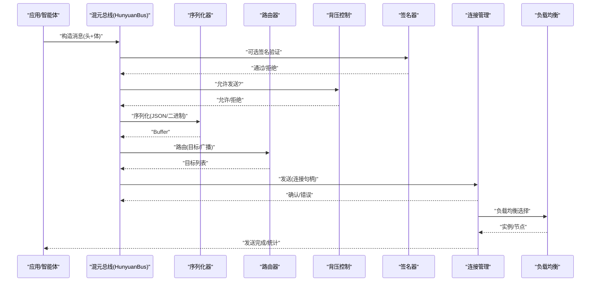

**图表来源**
- [apps/DaoMind/packages/daoQi/src/hunyuan.ts:45-92](file://apps/DaoMind/packages/daoQi/src/hunyuan.ts#L45-L92)
- [apps/DaoMind/packages/daoQi/src/codec/serializer.ts:12-25](file://apps/DaoMind/packages/daoQi/src/codec/serializer.ts#L12-L25)
- [apps/DaoMind/packages/daoQi/src/router.ts:28-42](file://apps/DaoMind/packages/daoQi/src/router.ts#L28-L42)
- [apps/DaoMind/packages/daoQi/src/backpressure.ts:32-52](file://apps/DaoMind/packages/daoQi/src/backpressure.ts#L32-L52)
- [apps/DaoMind/packages/daoQi/src/signer.ts:10-17](file://apps/DaoMind/packages/daoQi/src/signer.ts#L10-L17)
- [apps/DaoMind/packages/daoNexus/src/connection-manager.ts:84-95](file://apps/DaoMind/packages/daoNexus/src/connection-manager.ts#L84-L95)
- [apps/DaoMind/packages/daoNexus/src/load-balancer.ts:16-30](file://apps/DaoMind/packages/daoNexus/src/load-balancer.ts#L16-L30)

## 详细组件分析

### 消息协议与类型
- 消息头包含唯一ID、类型、源节点、目标节点、优先级、TTL、时间戳、签名与编码格式。
- 消息体支持对象与二进制数组，二进制体在JSON模式下以Base64承载。
- 通道类型定义了“天/地/人/冲”四种通道，用于区分消息域与流向。

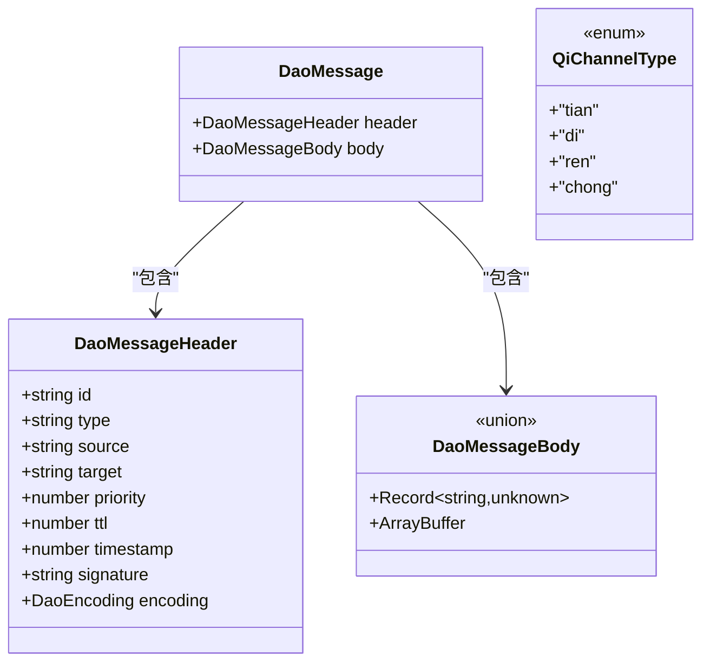

**图表来源**
- [apps/DaoMind/packages/daoQi/src/types/message.ts:17-39](file://apps/DaoMind/packages/daoQi/src/types/message.ts#L17-L39)
- [apps/DaoMind/packages/daoQi/src/types/channel.ts:8-22](file://apps/DaoMind/packages/daoQi/src/types/channel.ts#L8-L22)

**章节来源**
- [apps/DaoMind/packages/daoQi/src/types/message.ts:1-40](file://apps/DaoMind/packages/daoQi/src/types/message.ts#L1-L40)
- [apps/DaoMind/packages/daoQi/src/types/channel.ts:1-23](file://apps/DaoMind/packages/daoQi/src/types/channel.ts#L1-L23)

### 序列化与反序列化
- 支持JSON与二进制两种编码。二进制前缀包含魔数与头部长度，头部与体部分别序列化。
- JSON模式下二进制体以Base64嵌入，反序列化时还原为ArrayBuffer。

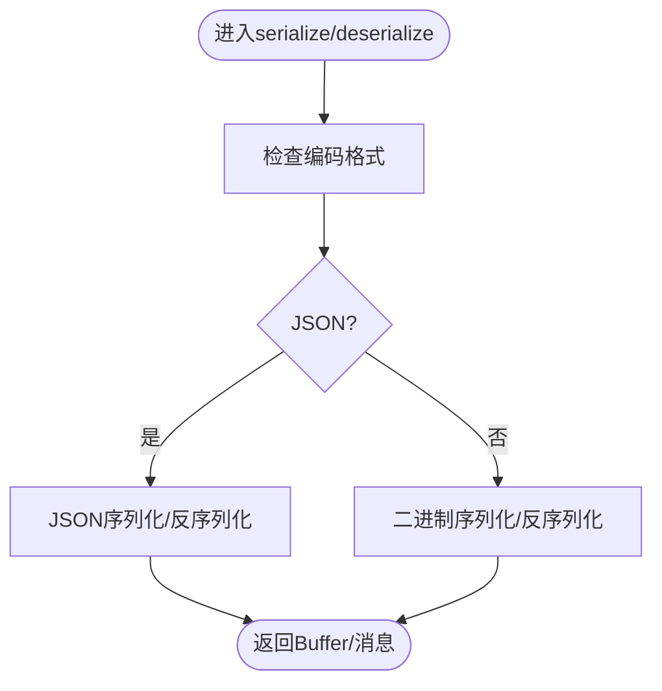

**图表来源**
- [apps/DaoMind/packages/daoQi/src/codec/serializer.ts:12-25](file://apps/DaoMind/packages/daoQi/src/codec/serializer.ts#L12-L25)
- [apps/DaoMind/packages/daoQi/src/codec/serializer.ts:37-51](file://apps/DaoMind/packages/daoQi/src/codec/serializer.ts#L37-L51)
- [apps/DaoMind/packages/daoQi/src/codec/serializer.ts:62-73](file://apps/DaoMind/packages/daoQi/src/codec/serializer.ts#L62-L73)

**章节来源**
- [apps/DaoMind/packages/daoQi/src/codec/serializer.ts:1-75](file://apps/DaoMind/packages/daoQi/src/codec/serializer.ts#L1-L75)

### 路由与广播
- 路由表以目标为键，维护订阅节点集合；TTL耗尽或目标缺失时进行广播。
- 提供订阅查询与丢弃计数统计，便于观测与治理。

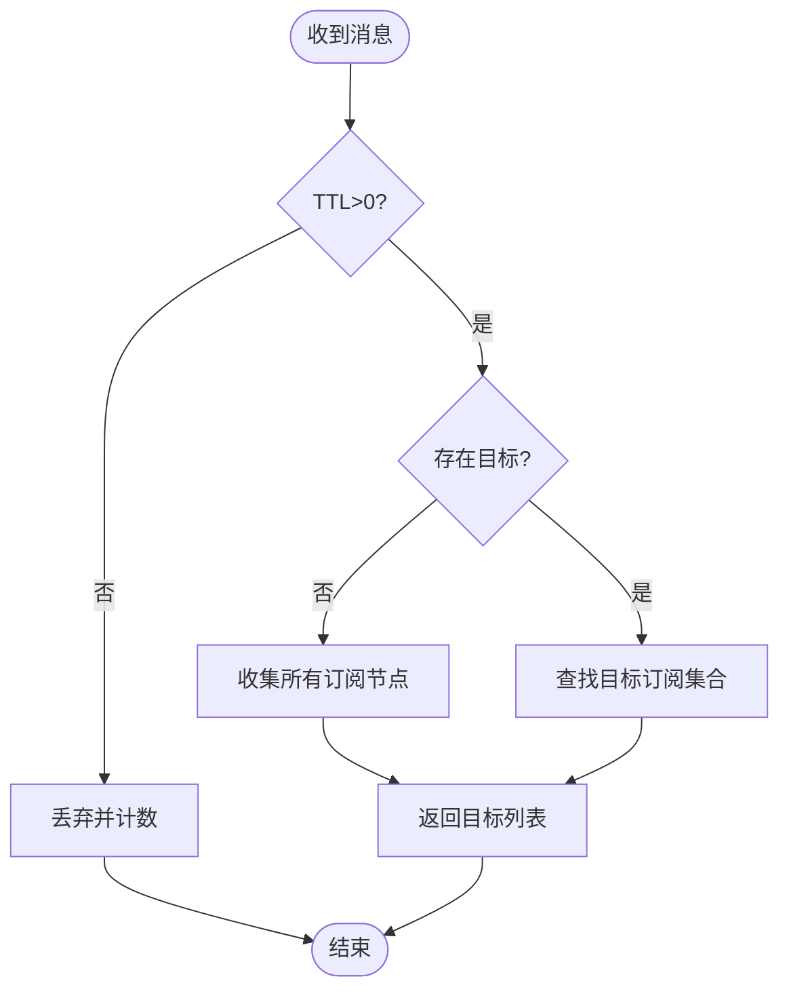

**图表来源**
- [apps/DaoMind/packages/daoQi/src/router.ts:28-42](file://apps/DaoMind/packages/daoQi/src/router.ts#L28-L42)

**章节来源**
- [apps/DaoMind/packages/daoQi/src/router.ts:1-47](file://apps/DaoMind/packages/daoQi/src/router.ts#L1-L47)

### 背压与流量控制
- 按节点维护滑动时间窗内的计数，超过阈值则降采样限流，低于阈值恢复。
- 提供当前速率与限流状态查询，便于动态调节。

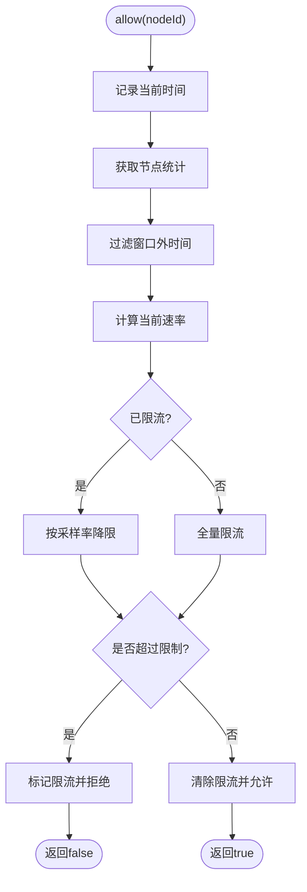

**图表来源**
- [apps/DaoMind/packages/daoQi/src/backpressure.ts:32-52](file://apps/DaoMind/packages/daoQi/src/backpressure.ts#L32-L52)

**章节来源**
- [apps/DaoMind/packages/daoQi/src/backpressure.ts:1-69](file://apps/DaoMind/packages/daoQi/src/backpressure.ts#L1-L69)

### 签名与安全
- 使用HMAC-SHA256对消息头进行签名，采用时间安全比较避免时序攻击。
- 提供密钥对生成接口，便于派生公私钥。

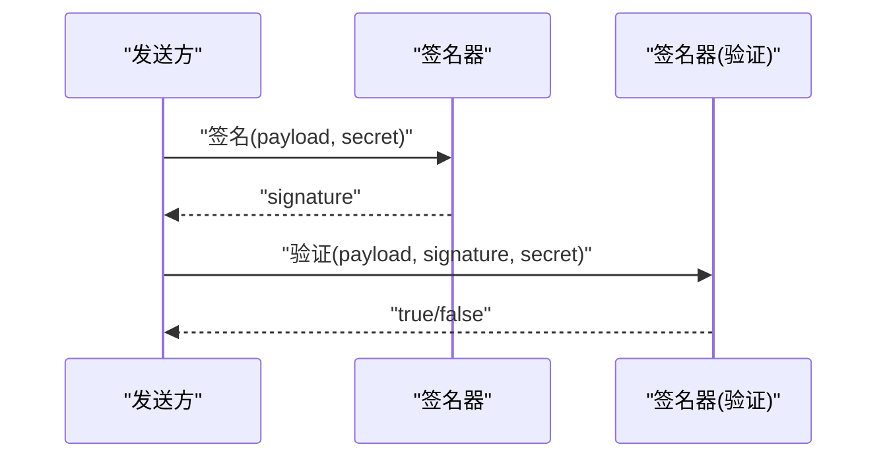

**图表来源**
- [apps/DaoMind/packages/daoQi/src/signer.ts:10-17](file://apps/DaoMind/packages/daoQi/src/signer.ts#L10-L17)
- [apps/DaoMind/packages/daoQi/src/signer.ts:29-39](file://apps/DaoMind/packages/daoQi/src/signer.ts#L29-L39)

**章节来源**
- [apps/DaoMind/packages/daoQi/src/signer.ts:1-40](file://apps/DaoMind/packages/daoQi/src/signer.ts#L1-L40)

### 混元总线（事件驱动）
- 继承事件发射器，提供send、subscribe、probe与统计接口。
- 发送路径：校验→签名→背压→序列化→路由→统计→事件发射。

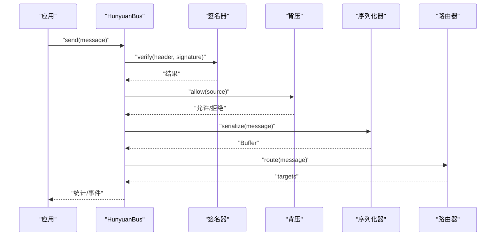

**图表来源**
- [apps/DaoMind/packages/daoQi/src/hunyuan.ts:45-92](file://apps/DaoMind/packages/daoQi/src/hunyuan.ts#L45-L92)

**章节来源**
- [apps/DaoMind/packages/daoQi/src/hunyuan.ts:1-125](file://apps/DaoMind/packages/daoQi/src/hunyuan.ts#L1-L125)

### 连接管理与负载均衡
- 连接管理：维护连接句柄、远程索引、活跃连接、空闲清理与消息计数。
- 负载均衡：轮询、最少连接、加权三种策略，支持运行时切换。

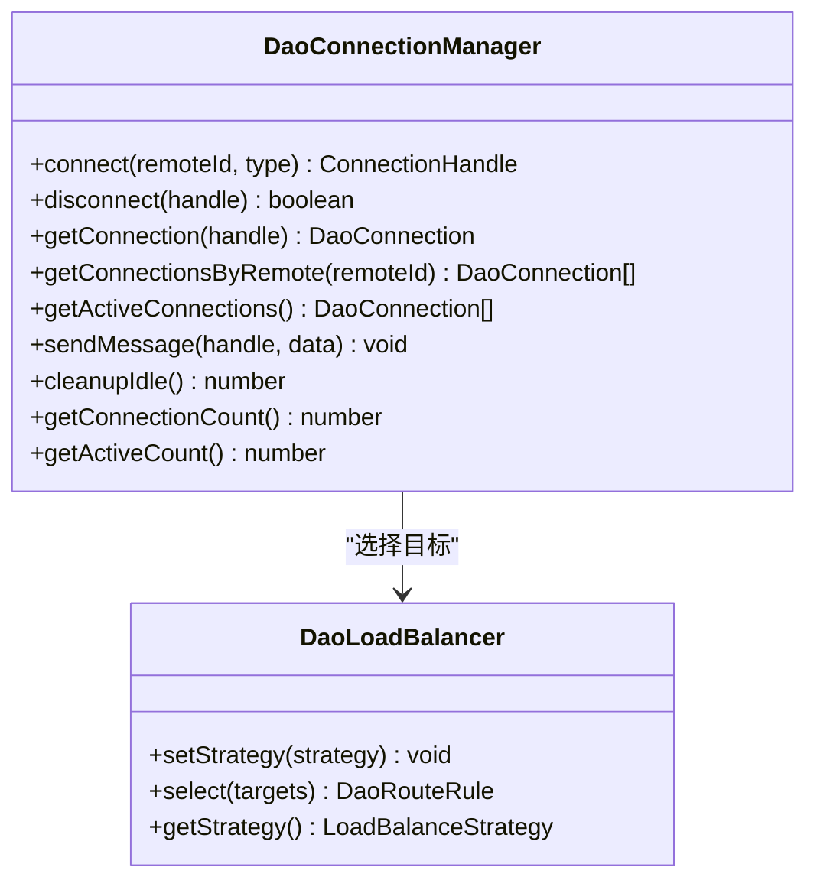

**图表来源**
- [apps/DaoMind/packages/daoNexus/src/connection-manager.ts:21-95](file://apps/DaoMind/packages/daoNexus/src/connection-manager.ts#L21-L95)
- [apps/DaoMind/packages/daoNexus/src/connection-manager.ts:97-115](file://apps/DaoMind/packages/daoNexus/src/connection-manager.ts#L97-L115)
- [apps/DaoMind/packages/daoNexus/src/load-balancer.ts:11-30](file://apps/DaoMind/packages/daoNexus/src/load-balancer.ts#L11-L30)

**章节来源**
- [apps/DaoMind/packages/daoNexus/src/connection-manager.ts:1-139](file://apps/DaoMind/packages/daoNexus/src/connection-manager.ts#L1-L139)
- [apps/DaoMind/packages/daoNexus/src/load-balancer.ts:1-71](file://apps/DaoMind/packages/daoNexus/src/load-balancer.ts#L1-L71)
- [apps/DaoMind/packages/daoNexus/src/index.ts:1-27](file://apps/DaoMind/packages/daoNexus/src/index.ts#L1-L27)

### 实时通信与SSE演示
- 前端useSSE提供连接状态、消息队列、错误与断开清理；模拟SSE流输出便于UI渲染与调试。
- 测试覆盖初始状态、连接/断开、清空消息等行为。

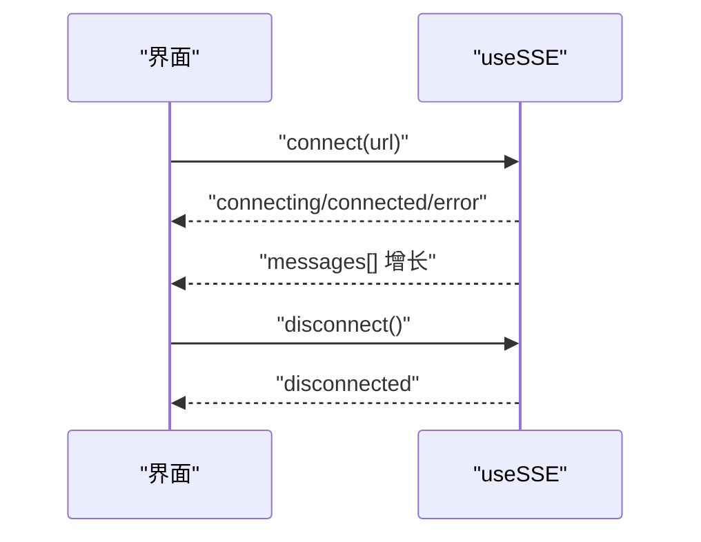

**图表来源**
- [apps/AgentPit/src/composables/useSSE.ts:18-39](file://apps/AgentPit/src/composables/useSSE.ts#L18-L39)
- [apps/AgentPit/src/composables/useSSE.ts:41-61](file://apps/AgentPit/src/composables/useSSE.ts#L41-L61)
- [apps/AgentPit/src/composables/useSSE.ts:97-109](file://apps/AgentPit/src/composables/useSSE.ts#L97-L109)

**章节来源**
- [apps/AgentPit/src/composables/useSSE.ts:1-129](file://apps/AgentPit/src/composables/useSSE.ts#L1-L129)
- [apps/AgentPit/src/__tests__/composables/useSSE.spec.ts:1-67](file://apps/AgentPit/src/__tests__/composables/useSSE.spec.ts#L1-L67)

### WebSocket连接、心跳与断线重连
- 连接管理器：支持多设备连接、在线用户统计、订阅清理与ACK超时重传。
- 心跳监控：周期性发送ping，检测僵尸连接并回调清理。
- 推送测试：覆盖连接/断开、多设备、ACK超时与缓冲落盘等场景。

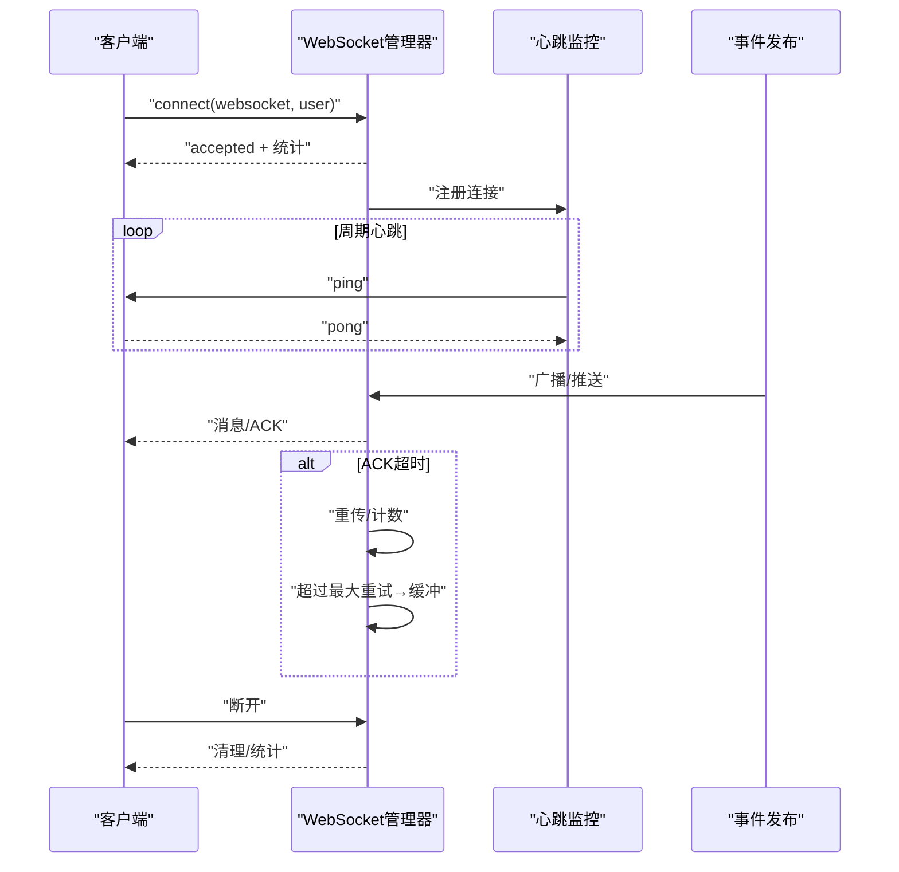

**图表来源**
- [tools/flexloop/src/taolib/testing/config_center/server/websocket/manager.py:258-286](file://tools/flexloop/src/taolib/testing/config_center/server/websocket/manager.py#L258-L286)
- [tools/flexloop/src/taolib/testing/config_center/server/websocket/manager.py:393-418](file://tools/flexloop/src/taolib/testing/config_center/server/websocket/manager.py#L393-L418)
- [tools/flexloop/src/taolib/testing/config_center/server/websocket/heartbeat.py:46-49](file://tools/flexloop/src/taolib/testing/config_center/server/websocket/heartbeat.py#L46-L49)
- [tools/flexloop/tests/testing/test_config_center/test_push_service.py:577-621](file://tools/flexloop/tests/testing/test_config_center/test_push_service.py#L577-L621)

**章节来源**
- [tools/flexloop/src/taolib/testing/config_center/server/websocket/manager.py:43-425](file://tools/flexloop/src/taolib/testing/config_center/server/websocket/manager.py#L43-L425)
- [tools/flexloop/src/taolib/testing/config_center/server/websocket/heartbeat.py:1-49](file://tools/flexloop/src/taolib/testing/config_center/server/websocket/heartbeat.py#L1-L49)
- [tools/flexloop/tests/testing/test_config_center/test_push_service.py:251-880](file://tools/flexloop/tests/testing/test_config_center/test_push_service.py#L251-L880)

### 监控与诊断
- 监控快照聚合热力图、流向矢量、仪表盘、告警与诊断，综合健康度评分。
- 健康度扣分规则：严重告警-15、一般告警-5、仪表非平衡-3、诊断非平衡-2。

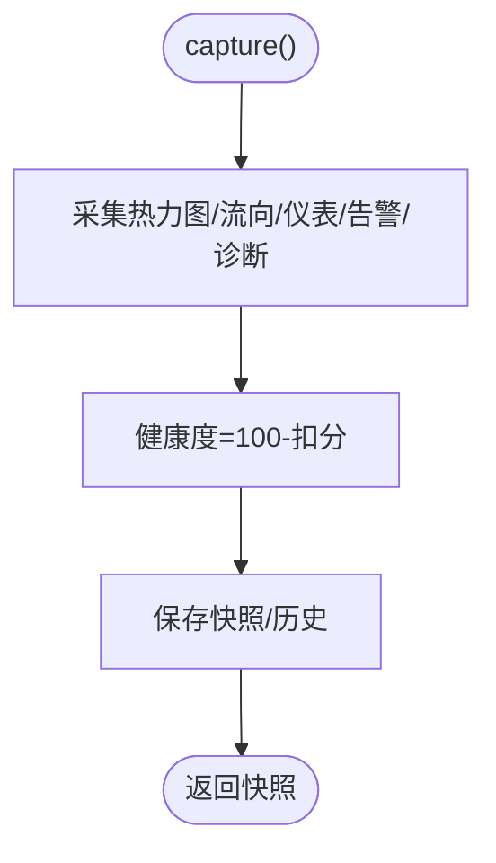

**图表来源**
- [apps/DaoMind/packages/daoMonitor/src/snapshot.ts:22-59](file://apps/DaoMind/packages/daoMonitor/src/snapshot.ts#L22-L59)

**章节来源**
- [apps/DaoMind/packages/daoMonitor/src/snapshot.ts:1-75](file://apps/DaoMind/packages/daoMonitor/src/snapshot.ts#L1-L75)

## 依赖关系分析
- DaoQi内部：消息类型被序列化器、路由器、背压与签名器共同依赖；混元总线聚合上述组件并通过事件驱动对外暴露。
- DaoNexus：连接管理器与负载均衡器通过导出入口统一对外提供能力。
- AgentPit：仅演示SSE，不直接参与总线发送。
- flexloop：WebSocket管理器与心跳监控独立于DaoQi总线，但可与总线协同工作。

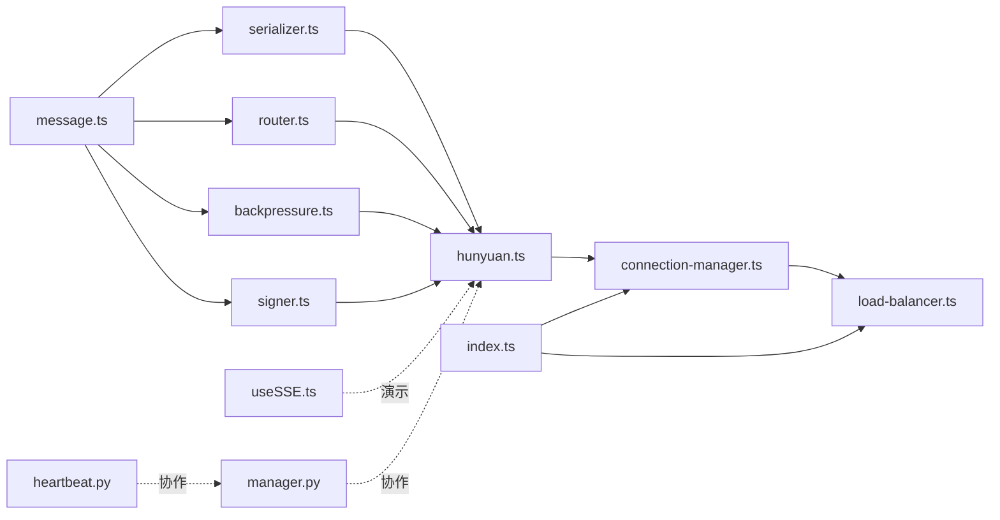

**图表来源**
- [apps/DaoMind/packages/daoQi/src/types/message.ts:1-40](file://apps/DaoMind/packages/daoQi/src/types/message.ts#L1-L40)
- [apps/DaoMind/packages/daoQi/src/codec/serializer.ts:1-75](file://apps/DaoMind/packages/daoQi/src/codec/serializer.ts#L1-L75)
- [apps/DaoMind/packages/daoQi/src/router.ts:1-47](file://apps/DaoMind/packages/daoQi/src/router.ts#L1-L47)
- [apps/DaoMind/packages/daoQi/src/backpressure.ts:1-69](file://apps/DaoMind/packages/daoQi/src/backpressure.ts#L1-L69)
- [apps/DaoMind/packages/daoQi/src/signer.ts:1-40](file://apps/DaoMind/packages/daoQi/src/signer.ts#L1-L40)
- [apps/DaoMind/packages/daoQi/src/hunyuan.ts:1-125](file://apps/DaoMind/packages/daoQi/src/hunyuan.ts#L1-L125)
- [apps/DaoMind/packages/daoNexus/src/connection-manager.ts:1-139](file://apps/DaoMind/packages/daoNexus/src/connection-manager.ts#L1-L139)
- [apps/DaoMind/packages/daoNexus/src/load-balancer.ts:1-71](file://apps/DaoMind/packages/daoNexus/src/load-balancer.ts#L1-L71)
- [apps/DaoMind/packages/daoNexus/src/index.ts:1-27](file://apps/DaoMind/packages/daoNexus/src/index.ts#L1-L27)
- [apps/AgentPit/src/composables/useSSE.ts:1-129](file://apps/AgentPit/src/composables/useSSE.ts#L1-L129)
- [tools/flexloop/src/taolib/testing/config_center/server/websocket/manager.py:43-425](file://tools/flexloop/src/taolib/testing/config_center/server/websocket/manager.py#L43-L425)
- [tools/flexloop/src/taolib/testing/config_center/server/websocket/heartbeat.py:1-49](file://tools/flexloop/src/taolib/testing/config_center/server/websocket/heartbeat.py#L1-L49)

**章节来源**
- [apps/DaoMind/packages/daoQi/src/hunyuan.ts:1-125](file://apps/DaoMind/packages/daoQi/src/hunyuan.ts#L1-L125)
- [apps/DaoMind/packages/daoNexus/src/index.ts:1-27](file://apps/DaoMind/packages/daoNexus/src/index.ts#L1-L27)

## 性能考量
- 编解码优化：二进制编码减少序列化开销，头部长度固定便于零拷贝拼接。
- 路由优化：订阅集合使用Set降低查找成本；广播路径合并收集所有节点。
- 背压策略：滑动窗口+采样降限，避免全局阻塞；动态恢复提升吞吐。
- 连接管理：空闲超时清理与最大连接数限制，防止资源枯竭。
- 负载均衡：最少连接与加权策略适配动态负载，提升整体响应。
- 实时渲染：SSE模拟流按随机块大小推送，贴近真实流式体验。
- 推送可靠性：ACK超时重传与缓冲落盘，保证消息可达性。

[本节为通用性能建议，无需特定文件引用]

## 故障排查指南
- 连接问题
  - 检查连接数是否达到上限；确认空闲清理是否触发。
  - 参考：连接管理器的异常抛出与空闲清理逻辑。
- 断线与重连
  - 关注心跳监控是否检测到僵尸连接；确认ACK超时重传与缓冲落盘。
  - 参考：心跳监控与WebSocket管理器的清理流程。
- 消息丢失
  - 校验TTL与路由表；检查背压是否导致丢弃；核对签名验证结果。
  - 参考：路由器丢弃计数、背压统计与签名验证。
- 安全风险
  - 确认签名算法与密钥配置；避免时序攻击。
  - 参考：签名器的时间安全比较与密钥生成。
- 监控诊断
  - 查看健康度评分与告警/诊断项；定位热点与异常节点。
  - 参考：监控快照聚合逻辑。

**章节来源**
- [apps/DaoMind/packages/daoNexus/src/connection-manager.ts:21-25](file://apps/DaoMind/packages/daoNexus/src/connection-manager.ts#L21-L25)
- [apps/DaoMind/packages/daoNexus/src/connection-manager.ts:97-115](file://apps/DaoMind/packages/daoNexus/src/connection-manager.ts#L97-L115)
- [tools/flexloop/src/taolib/testing/config_center/server/websocket/heartbeat.py:20-49](file://tools/flexloop/src/taolib/testing/config_center/server/websocket/heartbeat.py#L20-L49)
- [tools/flexloop/src/taolib/testing/config_center/server/websocket/manager.py:393-418](file://tools/flexloop/src/taolib/testing/config_center/server/websocket/manager.py#L393-L418)
- [apps/DaoMind/packages/daoQi/src/router.ts:44-46](file://apps/DaoMind/packages/daoQi/src/router.ts#L44-L46)
- [apps/DaoMind/packages/daoQi/src/backpressure.ts:61-67](file://apps/DaoMind/packages/daoQi/src/backpressure.ts#L61-L67)
- [apps/DaoMind/packages/daoQi/src/signer.ts:14-17](file://apps/DaoMind/packages/daoQi/src/signer.ts#L14-L17)
- [apps/DaoMind/packages/daoMonitor/src/snapshot.ts:31-42](file://apps/DaoMind/packages/daoMonitor/src/snapshot.ts#L31-L42)

## 结论
DaoMind通信协议与消息系统以DaoQi总线为核心，结合DaoNexus枢纽实现高内聚、低耦合的事件驱动架构。通过统一消息格式、序列化与签名、路由与背压、连接管理与负载均衡，系统在保证安全性与稳定性的同时，兼顾实时性与可扩展性。配合flexloop的WebSocket推送与心跳机制、AgentPit的SSE演示以及DaoMonitor的健康度聚合，形成从协议到工程的完整闭环。

[本节为总结性内容，无需特定文件引用]

## 附录
- 安全传输建议
  - 使用对称加密存储敏感令牌（参考：token_encryption.py中的Fernet封装）。
  - 在传输层启用TLS，结合签名与时间戳防重放。
- 压缩策略
  - 对大体量消息体采用二进制编码；必要时引入压缩算法（需与编码格式协商）。
- 监控指标
  - 连接数、活跃连接、消息发送/丢弃速率、通道分布、健康度评分、告警数量、诊断异常节点数。

**章节来源**
- [tools/flexloop/src/taolib/testing/oauth/crypto/token_encryption.py:1-54](file://tools/flexloop/src/taolib/testing/oauth/crypto/token_encryption.py#L1-L54)