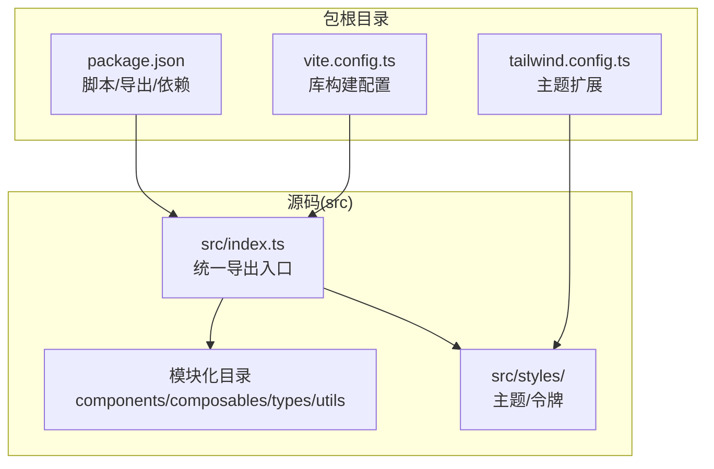
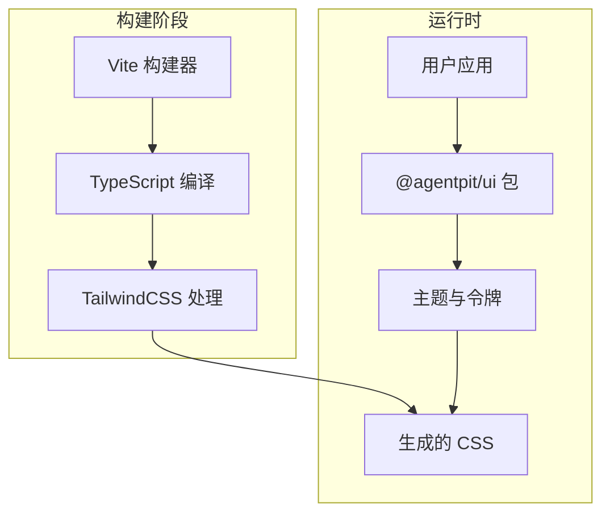
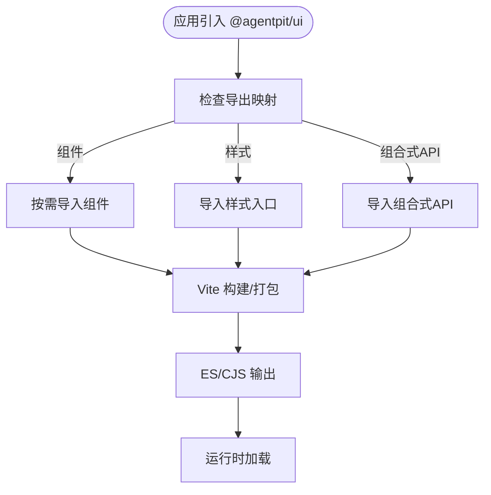
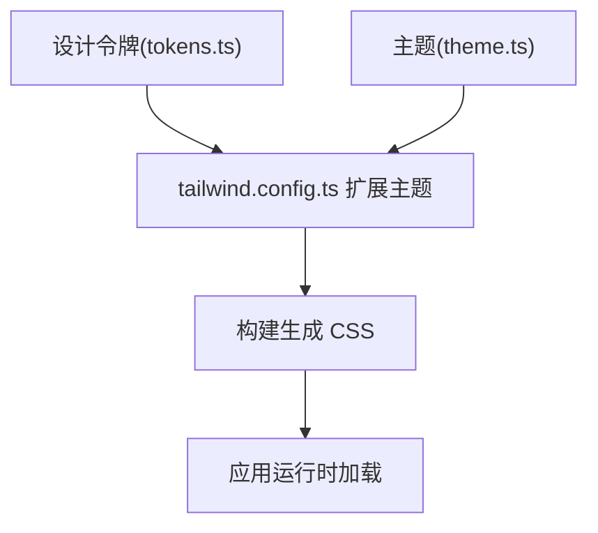
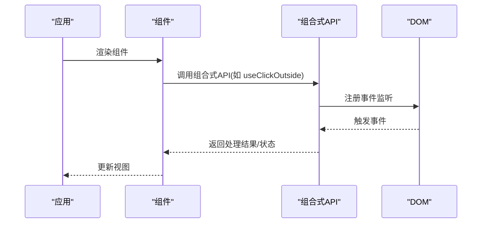
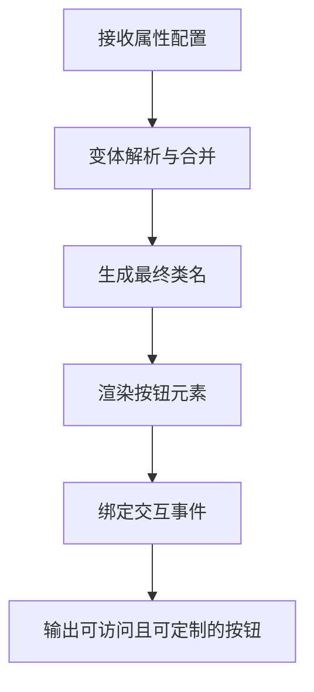
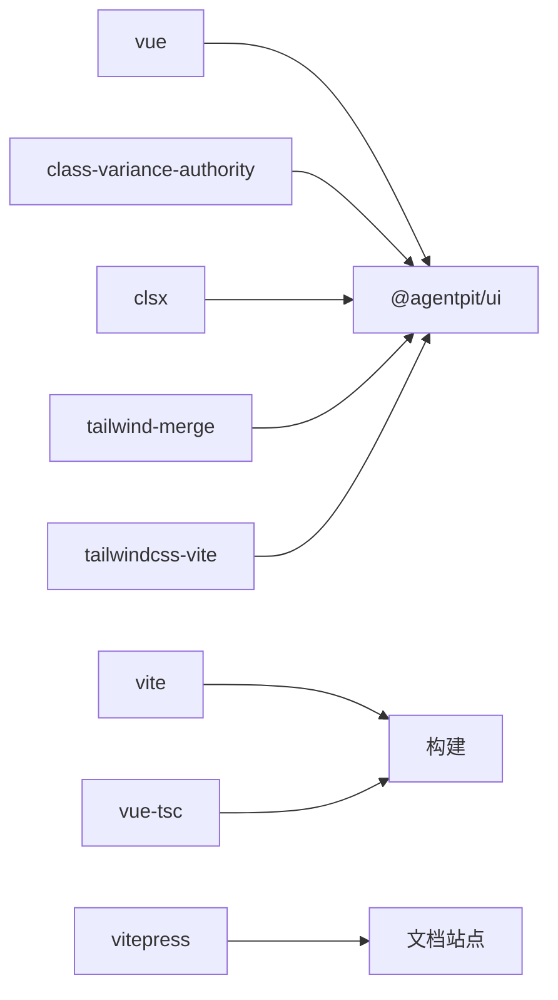

# UI组件系统

<cite>
**本文引用的文件**
- [apps/AgentPit/packages/ui/package.json](file://apps/AgentPit/packages/ui/package.json)
- [apps/AgentPit/packages/ui/src/index.ts](file://apps/AgentPit/packages/ui/src/index.ts)
- [apps/AgentPit/packages/ui/tailwind.config.ts](file://apps/AgentPit/packages/ui/tailwind.config.ts)
- [apps/AgentPit/packages/ui/vite.config.ts](file://apps/AgentPit/packages/ui/vite.config.ts)
- [apps/AgentPit/packages/ui/src/styles/index.ts](file://apps/AgentPit/packages/ui/src/styles/index.ts)
- [apps/AgentPit/packages/ui/src/styles/theme.ts](file://apps/AgentPit/packages/ui/src/styles/theme.ts)
- [apps/AgentPit/packages/ui/src/styles/tokens.ts](file://apps/AgentPit/packages/ui/src/styles/tokens.ts)
- [apps/AgentPit/docs/COMPONENT_LIBRARY_ARCHITECTURE.md](file://apps/AgentPit/docs/COMPONENT_LIBRARY_ARCHITECTURE.md)
- [apps/AgentPit/packages/ui/README.md](file://apps/AgentPit/packages/ui/README.md)
- [apps/AgentPit/packages/ui/docs/index.md](file://apps/AgentPit/packages/ui/docs/index.md)
</cite>

## 目录
1. [简介](#简介)
2. [项目结构](#项目结构)
3. [核心组件](#核心组件)
4. [架构总览](#架构总览)
5. [详细组件分析](#详细组件分析)
6. [依赖分析](#依赖分析)
7. [性能考虑](#性能考虑)
8. [故障排查指南](#故障排查指南)
9. [结论](#结论)
10. [附录](#附录)

## 简介
本文件为 DAOApps 的 UI 组件系统技术文档，聚焦于 AgentPit 应用内 @agentpit/ui 组件库的架构与实现。内容涵盖：模块化组织、组合式 API 设计、样式系统与设计令牌、工具函数、主题系统、组件开发规范、样式约定、测试策略与文档生成流程。本文以仓库中已存在的文件为依据，避免臆造信息，并通过图示与来源标注帮助读者快速定位到具体实现。

## 项目结构
AgentPit 的 UI 组件库位于 apps/AgentPit/packages/ui，采用 Vue 3 + TypeScript + Vite 构建，TailwindCSS 提供原子化样式能力。包导出遵循标准的组件库发布约定，支持 ES Module 与 CommonJS 双格式输出，并通过别名 @ 指向 src 目录。

**图表来源**
- [apps/AgentPit/packages/ui/package.json:1-58](file://apps/AgentPit/packages/ui/package.json#L1-L58)
- [apps/AgentPit/packages/ui/vite.config.ts:1-30](file://apps/AgentPit/packages/ui/vite.config.ts#L1-L30)
- [apps/AgentPit/packages/ui/tailwind.config.ts:1-20](file://apps/AgentPit/packages/ui/tailwind.config.ts#L1-L20)
- [apps/AgentPit/packages/ui/src/index.ts:1-6](file://apps/AgentPit/packages/ui/src/index.ts#L1-L6)

**章节来源**
- [apps/AgentPit/packages/ui/package.json:1-58](file://apps/AgentPit/packages/ui/package.json#L1-L58)
- [apps/AgentPit/packages/ui/vite.config.ts:1-30](file://apps/AgentPit/packages/ui/vite.config.ts#L1-L30)
- [apps/AgentPit/packages/ui/tailwind.config.ts:1-20](file://apps/AgentPit/packages/ui/tailwind.config.ts#L1-L20)
- [apps/AgentPit/packages/ui/src/index.ts:1-6](file://apps/AgentPit/packages/ui/src/index.ts#L1-L6)

## 核心组件
- 统一导出入口：通过 src/index.ts 将 components、composables、types、utils、styles 进行聚合导出，便于使用者按需引入或全量引入。
- 组件模块化：组件按功能域拆分，遵循“按需引入”的设计理念，减少打包体积。
- 组合式 API：提供可复用的逻辑封装（如事件处理、防抖、数据流等），提升组件复用性与可测试性。
- 样式系统：基于 TailwindCSS，通过 tokens 定义设计令牌，theme 扩展主题变量，实现一致的视觉语言与主题切换能力。
- 工具函数：提供类型、样式合并、类名处理等工具，保证组件间的一致性与可维护性。

**章节来源**
- [apps/AgentPit/packages/ui/src/index.ts:1-6](file://apps/AgentPit/packages/ui/src/index.ts#L1-L6)

## 架构总览
下图展示了组件库的构建与运行时关系：Vite 负责库构建与开发预览；Tailwind 读取 tokens 与 theme，生成原子化样式；用户应用通过包导出按需引入组件与样式。

**图表来源**
- [apps/AgentPit/packages/ui/vite.config.ts:1-30](file://apps/AgentPit/packages/ui/vite.config.ts#L1-L30)
- [apps/AgentPit/packages/ui/tailwind.config.ts:1-20](file://apps/AgentPit/packages/ui/tailwind.config.ts#L1-L20)
- [apps/AgentPit/packages/ui/src/styles/index.ts:1-2](file://apps/AgentPit/packages/ui/src/styles/index.ts#L1-L2)

## 详细组件分析

### 组件模块化与导出策略
- 导出入口：src/index.ts 聚合导出 components、composables、types、utils、styles，确保使用者只需从主入口导入即可获得所需能力。
- 按需引入：Vite 配置将 vue、vue-router、pinia 设为外部依赖，避免重复打包，降低最终产物体积。
- 别名配置：通过 @ 指向 src，简化路径书写，提升开发体验。

**图表来源**
- [apps/AgentPit/packages/ui/src/index.ts:1-6](file://apps/AgentPit/packages/ui/src/index.ts#L1-L6)
- [apps/AgentPit/packages/ui/vite.config.ts:14-22](file://apps/AgentPit/packages/ui/vite.config.ts#L14-L22)

**章节来源**
- [apps/AgentPit/packages/ui/src/index.ts:1-6](file://apps/AgentPit/packages/ui/src/index.ts#L1-L6)
- [apps/AgentPit/packages/ui/vite.config.ts:14-22](file://apps/AgentPit/packages/ui/vite.config.ts#L14-L22)

### 样式系统与主题设计
- 主题扩展：tailwind.config.ts 从 src/styles/tokens 中读取颜色、间距、圆角、阴影、断点等设计令牌，并在 theme.extend 中进行扩展。
- 样式入口：src/styles/index.ts 聚合 theme 与 tokens，作为样式系统的统一出口。
- 使用方式：用户应用通过 import '@agentpit/ui/styles' 引入全局样式，确保 Tailwind 原子类与设计令牌生效。

**图表来源**
- [apps/AgentPit/packages/ui/tailwind.config.ts:1-20](file://apps/AgentPit/packages/ui/tailwind.config.ts#L1-L20)
- [apps/AgentPit/packages/ui/src/styles/index.ts:1-2](file://apps/AgentPit/packages/ui/src/styles/index.ts#L1-L2)

**章节来源**
- [apps/AgentPit/packages/ui/tailwind.config.ts:1-20](file://apps/AgentPit/packages/ui/tailwind.config.ts#L1-L20)
- [apps/AgentPit/packages/ui/src/styles/index.ts:1-2](file://apps/AgentPit/packages/ui/src/styles/index.ts#L1-L2)

### 组合式 API 设计与示例
- 设计理念：将可复用的业务逻辑抽离为组合式函数，使多个组件共享状态、副作用与计算逻辑，提升可测试性与可维护性。
- 典型场景：事件监听（如点击外部区域）、输入防抖、实时数据流处理等。
- 文档与示例：COMPONENT_LIBRARY_ARCHITECTURE.md 中提供了组件库的架构说明与使用示例，可作为组合式 API 的参考。

**图表来源**
- [apps/AgentPit/docs/COMPONENT_LIBRARY_ARCHITECTURE.md:296-623](file://apps/AgentPit/docs/COMPONENT_LIBRARY_ARCHITECTURE.md#L296-L623)

**章节来源**
- [apps/AgentPit/docs/COMPONENT_LIBRARY_ARCHITECTURE.md:296-623](file://apps/AgentPit/docs/COMPONENT_LIBRARY_ARCHITECTURE.md#L296-L623)

### Button 基础组件实现要点
- 属性配置：通过 props 定义尺寸、状态、颜色、形状等变体，结合 class-variance-authority/clsx/tailwind-merge 实现变体合并与样式控制。
- 交互行为：支持点击、禁用、加载态等常见交互，事件透传与可访问性属性完善。
- 样式定制：基于 tokens 与 theme，确保 Button 在不同主题下保持一致的视觉与交互体验。
- 使用方法：在应用中通过 import { Button } from '@agentpit/ui' 引入，并在入口处 import '@agentpit/ui/styles' 加载样式。

**图表来源**
- [apps/AgentPit/packages/ui/README.md:1-16](file://apps/AgentPit/packages/ui/README.md#L1-L16)
- [apps/AgentPit/packages/ui/docs/index.md:17-26](file://apps/AgentPit/packages/ui/docs/index.md#L17-L26)

**章节来源**
- [apps/AgentPit/packages/ui/README.md:1-16](file://apps/AgentPit/packages/ui/README.md#L1-L16)
- [apps/AgentPit/packages/ui/docs/index.md:17-26](file://apps/AgentPit/packages/ui/docs/index.md#L17-L26)

## 依赖分析
- 运行时依赖
  - vue：组件库的运行时框架。
  - class-variance-authority、clsx、tailwind-merge：用于组件变体与类名合并，提升样式一致性与可维护性。
  - @tailwindcss/vite：在 Vite 环境中集成 TailwindCSS。
- 开发依赖
  - vite、@vitejs/plugin-vue、vue-tsc：构建与类型检查。
  - vitepress：文档站点开发与构建。
  - typescript：类型系统支持。

**图表来源**
- [apps/AgentPit/packages/ui/package.json:31-47](file://apps/AgentPit/packages/ui/package.json#L31-L47)

**章节来源**
- [apps/AgentPit/packages/ui/package.json:31-47](file://apps/AgentPit/packages/ui/package.json#L31-L47)

## 性能考虑
- 按需引入：通过 Vite 的外部化配置，将 vue、vue-router、pinia 设为外部依赖，避免重复打包，降低最终产物体积。
- 样式体积控制：仅引入必要的样式入口，避免全局重样式覆盖导致的体积膨胀。
- 组合式 API 复用：将通用逻辑抽取为组合式函数，减少重复计算与副作用，提升运行时性能。
- 构建优化：利用 Vite 的快速冷启动与热更新能力，缩短开发迭代周期。

**章节来源**
- [apps/AgentPit/packages/ui/vite.config.ts:14-22](file://apps/AgentPit/packages/ui/vite.config.ts#L14-L22)

## 故障排查指南
- 样式不生效
  - 确认已在应用入口引入样式入口：import '@agentpit/ui/styles'。
  - 检查 tailwind.config.ts 是否正确扩展了 tokens 与 theme。
- 组件不可用或类型错误
  - 确认从主入口按需导入组件：import { Button } from '@agentpit/ui'。
  - 检查 package.json 的 exports 字段是否正确映射到 dist。
- 构建失败
  - 运行类型检查与构建命令，确保 vue-tsc 与 vite 正常工作。
  - 检查 Vite 配置中的别名与外部化设置。

**章节来源**
- [apps/AgentPit/packages/ui/README.md:1-16](file://apps/AgentPit/packages/ui/README.md#L1-L16)
- [apps/AgentPit/packages/ui/tailwind.config.ts:1-20](file://apps/AgentPit/packages/ui/tailwind.config.ts#L1-L20)
- [apps/AgentPit/packages/ui/package.json:12-19](file://apps/AgentPit/packages/ui/package.json#L12-L19)
- [apps/AgentPit/packages/ui/vite.config.ts:14-22](file://apps/AgentPit/packages/ui/vite.config.ts#L14-L22)

## 结论
@agentpit/ui 组件库以模块化、组合式 API、设计令牌与 TailwindCSS 为核心，实现了高可复用、易定制、可维护的 UI 基础设施。通过清晰的导出入口、严格的构建配置与完善的文档与示例，开发者可以高效地在应用中集成并扩展组件能力。

## 附录
- 组件开发规范
  - 使用组合式 API 抽离可复用逻辑，保持组件职责单一。
  - 通过 tokens 与 theme 统一风格，避免硬编码样式。
  - 提供完整的类型定义与最小可用示例。
- 样式约定
  - 优先使用 Tailwind 原子类与设计令牌，避免深层嵌套。
  - 使用 clsx/tailwind-merge 合并类名，确保样式稳定。
- 测试策略
  - 单元测试：针对组合式 API 与工具函数进行行为验证。
  - 文档即测试：通过文档示例验证 API 可用性与回归。
- 文档生成流程
  - 使用 vitepress 在本地与 CI 中生成与预览文档站点。
  - 通过 package.json 中的 docs:* 脚本管理文档生命周期。

**章节来源**
- [apps/AgentPit/packages/ui/package.json:20-29](file://apps/AgentPit/packages/ui/package.json#L20-L29)
- [apps/AgentPit/packages/ui/docs/index.md:17-26](file://apps/AgentPit/packages/ui/docs/index.md#L17-L26)