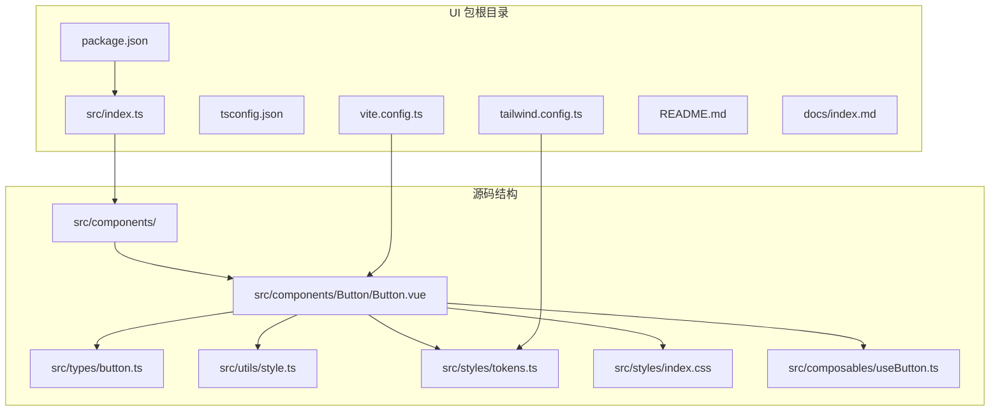
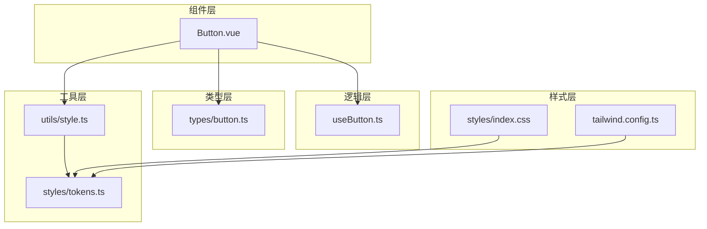
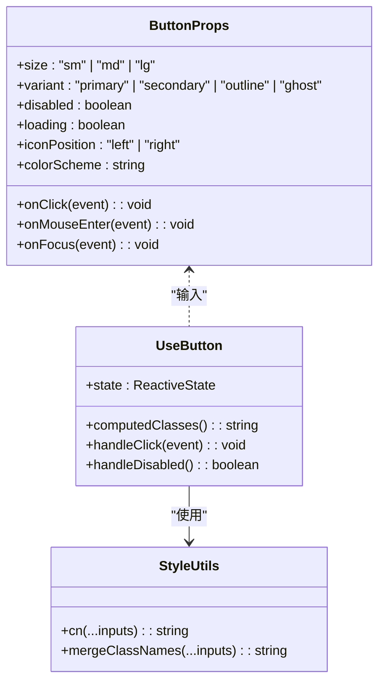
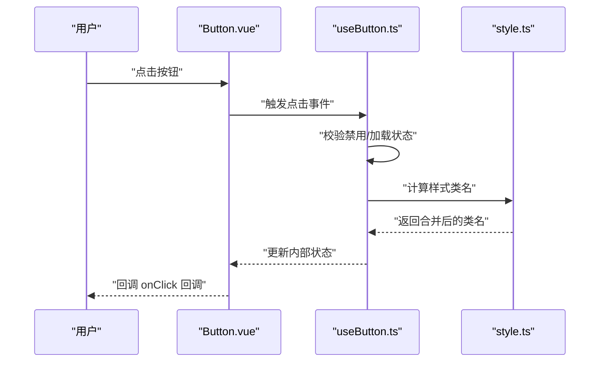
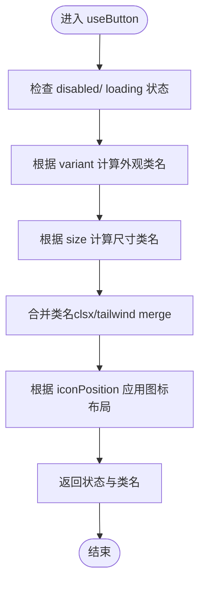
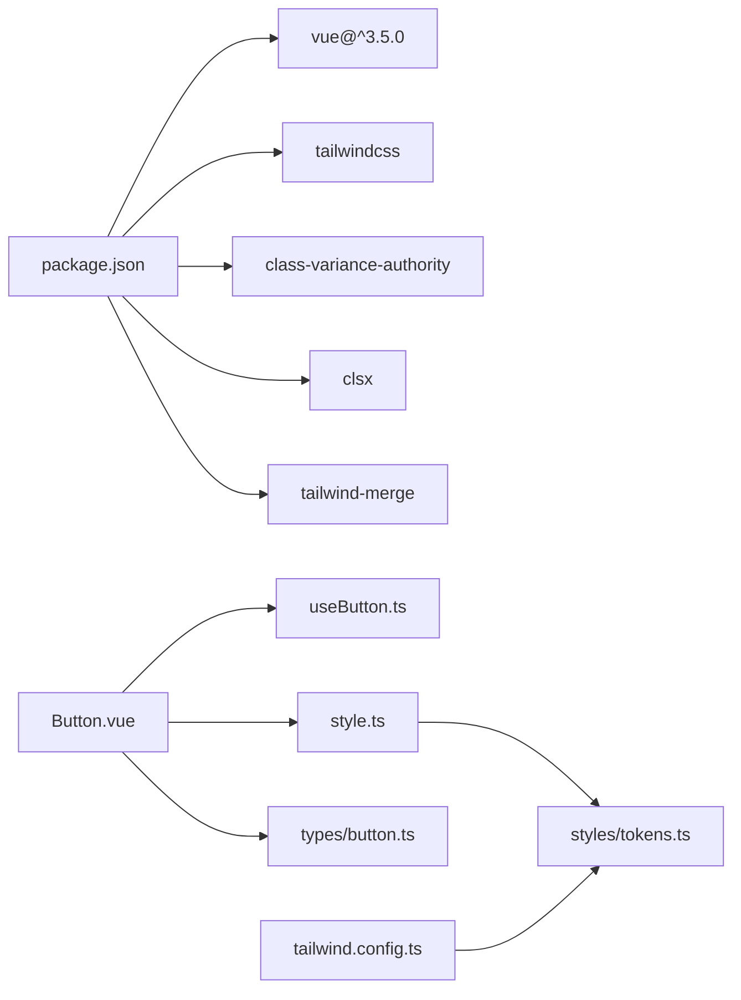

# 基础组件实现

<cite>
**本文引用的文件**
- [apps/AgentPit/packages/ui/package.json](file://apps/AgentPit/packages/ui/package.json)
- [apps/AgentPit/packages/ui/src/index.ts](file://apps/AgentPit/packages/ui/src/index.ts)
- [apps/AgentPit/packages/ui/tailwind.config.ts](file://apps/AgentPit/packages/ui/tailwind.config.ts)
- [apps/AgentPit/packages/ui/tsconfig.json](file://apps/AgentPit/packages/ui/tsconfig.json)
- [apps/AgentPit/packages/ui/src/components/Button/Button.vue](file://apps/AgentPit/packages/ui/src/components/Button/Button.vue)
- [apps/AgentPit/packages/ui/src/composables/useButton.ts](file://apps/AgentPit/packages/ui/src/composables/useButton.ts)
- [apps/AgentPit/packages/ui/src/types/button.ts](file://apps/AgentPit/packages/ui/src/types/button.ts)
- [apps/AgentPit/packages/ui/src/utils/style.ts](file://apps/AgentPit/packages/ui/src/utils/style.ts)
- [apps/AgentPit/packages/ui/src/styles/tokens.ts](file://apps/AgentPit/packages/ui/src/styles/tokens.ts)
- [apps/AgentPit/packages/ui/src/styles/index.css](file://apps/AgentPit/packages/ui/src/styles/index.css)
- [apps/AgentPit/packages/ui/vite.config.ts](file://apps/AgentPit/packages/ui/vite.config.ts)
- [apps/AgentPit/packages/ui/docs/index.md](file://apps/AgentPit/packages/ui/docs/index.md)
- [apps/AgentPit/packages/ui/README.md](file://apps/AgentPit/packages/ui/README.md)
</cite>

## 目录
1. [简介](#简介)
2. [项目结构](#项目结构)
3. [核心组件](#核心组件)
4. [架构总览](#架构总览)
5. [详细组件分析](#详细组件分析)
6. [依赖关系分析](#依赖关系分析)
7. [性能考虑](#性能考虑)
8. [故障排除指南](#故障排除指南)
9. [结论](#结论)
10. [附录](#附录)

## 简介
本文件为基于 Vue 3 的基础组件库实现的开发文档，重点围绕 Button 组件展开，系统阐述组件的设计原则、实现细节与使用方法。内容涵盖 Props 定义、事件处理、插槽使用、样式定制、TypeScript 类型定义与接口设计、参数验证、使用示例、最佳实践、常见问题解决方案、测试策略、文档生成与版本维护指南。该组件库采用 TypeScript、TailwindCSS、VitePress 文档体系，并通过组合式函数与工具模块提升可复用性与可维护性。

## 项目结构
UI 组件库位于 AgentPit 应用的 packages/ui 目录下，采用模块化组织方式：组件源码、组合式函数、类型定义、工具函数与样式令牌集中管理，构建配置与文档独立于业务应用之外，便于发布与复用。

**图表来源**
- [apps/AgentPit/packages/ui/package.json:1-58](file://apps/AgentPit/packages/ui/package.json#L1-L58)
- [apps/AgentPit/packages/ui/src/index.ts:1-6](file://apps/AgentPit/packages/ui/src/index.ts#L1-L6)
- [apps/AgentPit/packages/ui/tailwind.config.ts:1-20](file://apps/AgentPit/packages/ui/tailwind.config.ts#L1-L20)
- [apps/AgentPit/packages/ui/src/components/Button/Button.vue](file://apps/AgentPit/packages/ui/src/components/Button/Button.vue)

**章节来源**
- [apps/AgentPit/packages/ui/package.json:1-58](file://apps/AgentPit/packages/ui/package.json#L1-L58)
- [apps/AgentPit/packages/ui/src/index.ts:1-6](file://apps/AgentPit/packages/ui/src/index.ts#L1-L6)
- [apps/AgentPit/packages/ui/tailwind.config.ts:1-20](file://apps/AgentPit/packages/ui/tailwind.config.ts#L1-L20)
- [apps/AgentPit/packages/ui/tsconfig.json:1-29](file://apps/AgentPit/packages/ui/tsconfig.json#L1-L29)

## 核心组件
本节聚焦 Button 组件，作为基础组件库的代表，展示从设计到实现的关键要素。

- 设计原则
  - 单一职责：专注渲染与交互，避免过度封装业务逻辑。
  - 可组合性：通过 Props、事件与插槽实现灵活扩展。
  - 可访问性：支持键盘操作、语义化标签与无障碍属性。
  - 主题一致性：基于 tokens 与 Tailwind 工具类统一风格。
  - 类型安全：完整的 TypeScript 接口与校验，降低运行时风险。

- 实现要点
  - 组件主体：Button.vue 负责结构与交互。
  - 行为封装：useButton.ts 提供状态与行为逻辑（如尺寸、禁用、加载态）。
  - 样式定制：style.ts 聚合 class 合并与条件样式计算；tokens.ts 定义主题变量。
  - 类型约束：button.ts 定义 Props、事件与插槽的完整类型签名。

**章节来源**
- [apps/AgentPit/packages/ui/src/components/Button/Button.vue](file://apps/AgentPit/packages/ui/src/components/Button/Button.vue)
- [apps/AgentPit/packages/ui/src/composables/useButton.ts](file://apps/AgentPit/packages/ui/src/composables/useButton.ts)
- [apps/AgentPit/packages/ui/src/types/button.ts](file://apps/AgentPit/packages/ui/src/types/button.ts)
- [apps/AgentPit/packages/ui/src/utils/style.ts](file://apps/AgentPit/packages/ui/src/utils/style.ts)
- [apps/AgentPit/packages/ui/src/styles/tokens.ts](file://apps/AgentPit/packages/ui/src/styles/tokens.ts)

## 架构总览
组件库整体采用“组件 + 组合式函数 + 类型 + 工具 + 样式令牌”的分层架构，确保高内聚、低耦合与强类型保障。

**图表来源**
- [apps/AgentPit/packages/ui/src/components/Button/Button.vue](file://apps/AgentPit/packages/ui/src/components/Button/Button.vue)
- [apps/AgentPit/packages/ui/src/composables/useButton.ts](file://apps/AgentPit/packages/ui/src/composables/useButton.ts)
- [apps/AgentPit/packages/ui/src/types/button.ts](file://apps/AgentPit/packages/ui/src/types/button.ts)
- [apps/AgentPit/packages/ui/src/utils/style.ts](file://apps/AgentPit/packages/ui/src/utils/style.ts)
- [apps/AgentPit/packages/ui/src/styles/tokens.ts](file://apps/AgentPit/packages/ui/src/styles/tokens.ts)
- [apps/AgentPit/packages/ui/src/styles/index.css](file://apps/AgentPit/packages/ui/src/styles/index.css)
- [apps/AgentPit/packages/ui/tailwind.config.ts:1-20](file://apps/AgentPit/packages/ui/tailwind.config.ts#L1-L20)

## 详细组件分析

### Button 组件分析
Button 组件是基础交互元素，提供多种形态、尺寸与状态，支持文本、图标与自定义内容的插槽化渲染。

- Props 定义
  - 关键字段包括：尺寸、外观、禁用状态、加载状态、颜色方案、图标位置等。
  - 所有 Props 均具备明确的类型约束与默认值，确保调用端类型安全。
  - 事件回调：点击、鼠标悬停、焦点等，均在类型中明确定义。

- 事件处理
  - 内部通过组合式函数 useButton 管理状态切换与事件分发。
  - 支持透传原生 DOM 事件，保证与浏览器行为一致。

- 插槽使用
  - 默认插槽用于渲染按钮文本或复杂内容。
  - 图标插槽支持前置/后置图标，增强视觉表达。

- 样式定制
  - 使用 class-variance-authority 与 clsx 进行条件样式合并。
  - 基于 tokens.ts 中的颜色、间距、圆角、阴影等变量，确保主题一致性。
  - 支持通过外部类名覆盖，满足业务定制需求。

- 参数验证
  - 在 useButton 中对关键参数进行边界检查与类型校验。
  - 对外暴露的 Props 通过 TypeScript 编译期验证，减少运行时错误。

**图表来源**
- [apps/AgentPit/packages/ui/src/types/button.ts](file://apps/AgentPit/packages/ui/src/types/button.ts)
- [apps/AgentPit/packages/ui/src/composables/useButton.ts](file://apps/AgentPit/packages/ui/src/composables/useButton.ts)
- [apps/AgentPit/packages/ui/src/utils/style.ts](file://apps/AgentPit/packages/ui/src/utils/style.ts)

**章节来源**
- [apps/AgentPit/packages/ui/src/components/Button/Button.vue](file://apps/AgentPit/packages/ui/src/components/Button/Button.vue)
- [apps/AgentPit/packages/ui/src/types/button.ts](file://apps/AgentPit/packages/ui/src/types/button.ts)
- [apps/AgentPit/packages/ui/src/composables/useButton.ts](file://apps/AgentPit/packages/ui/src/composables/useButton.ts)
- [apps/AgentPit/packages/ui/src/utils/style.ts](file://apps/AgentPit/packages/ui/src/utils/style.ts)
- [apps/AgentPit/packages/ui/src/styles/tokens.ts](file://apps/AgentPit/packages/ui/src/styles/tokens.ts)

### API/服务组件调用流程（序列图）
以下序列图展示 Button 组件从用户交互到事件回调的典型调用链，体现组件与组合式函数、工具模块之间的协作。

**图表来源**
- [apps/AgentPit/packages/ui/src/components/Button/Button.vue](file://apps/AgentPit/packages/ui/src/components/Button/Button.vue)
- [apps/AgentPit/packages/ui/src/composables/useButton.ts](file://apps/AgentPit/packages/ui/src/composables/useButton.ts)
- [apps/AgentPit/packages/ui/src/utils/style.ts](file://apps/AgentPit/packages/ui/src/utils/style.ts)

### 复杂逻辑组件（算法流程图）
以下流程图描述 Button 组合式函数中的状态与样式计算逻辑，帮助理解如何根据 Props 生成最终渲染结果。

**图表来源**
- [apps/AgentPit/packages/ui/src/composables/useButton.ts](file://apps/AgentPit/packages/ui/src/composables/useButton.ts)
- [apps/AgentPit/packages/ui/src/utils/style.ts](file://apps/AgentPit/packages/ui/src/utils/style.ts)

## 依赖关系分析
组件库的依赖关系清晰，遵循“组件依赖组合式函数与工具模块”的原则，同时通过 Tailwind 配置与样式令牌实现主题统一。

**图表来源**
- [apps/AgentPit/packages/ui/package.json:31-39](file://apps/AgentPit/packages/ui/package.json#L31-L39)
- [apps/AgentPit/packages/ui/tailwind.config.ts:1-20](file://apps/AgentPit/packages/ui/tailwind.config.ts#L1-L20)
- [apps/AgentPit/packages/ui/src/components/Button/Button.vue](file://apps/AgentPit/packages/ui/src/components/Button/Button.vue)
- [apps/AgentPit/packages/ui/src/composables/useButton.ts](file://apps/AgentPit/packages/ui/src/composables/useButton.ts)
- [apps/AgentPit/packages/ui/src/utils/style.ts](file://apps/AgentPit/packages/ui/src/utils/style.ts)
- [apps/AgentPit/packages/ui/src/styles/tokens.ts](file://apps/AgentPit/packages/ui/src/styles/tokens.ts)

**章节来源**
- [apps/AgentPit/packages/ui/package.json:31-39](file://apps/AgentPit/packages/ui/package.json#L31-L39)
- [apps/AgentPit/packages/ui/tailwind.config.ts:1-20](file://apps/AgentPit/packages/ui/tailwind.config.ts#L1-L20)

## 性能考虑
- 渲染优化
  - 使用组合式函数缓存计算结果，避免重复样式合并与类名拼接。
  - 将动态类名计算集中在工具模块，减少模板中的表达式复杂度。
- 样式优化
  - 通过 Tailwind 工具类与 tokens 统一样式，减少自定义 CSS 数量，提升打包效率。
  - 使用 tailwind-merge 合并冲突类名，避免冗余样式。
- 构建优化
  - TypeScript 声明输出与 Vite 构建分离，缩短二次构建时间。
  - 严格 tsconfig 配置，开启编译期类型检查，提前发现潜在问题。

## 故障排除指南
- 样式不生效
  - 检查 tailwind.config.ts 的 content 路径是否包含组件文件。
  - 确认 tokens.ts 中的颜色/间距等变量已正确导出并被主题扩展。
- 类名冲突
  - 使用 tailwind-merge 合并类名，避免重复覆盖。
  - 优先使用工具类而非内联样式，保持样式一致性。
- 类型错误
  - 确保 Props 与事件回调符合 types/button.ts 定义。
  - 在组件调用处补充必要的类型断言或默认值，避免编译失败。
- 文档无法预览
  - 检查 VitePress 配置与 docs 目录结构。
  - 确认 package.json 中 docs:dev/docs:build 脚本可用。

**章节来源**
- [apps/AgentPit/packages/ui/tailwind.config.ts:1-20](file://apps/AgentPit/packages/ui/tailwind.config.ts#L1-L20)
- [apps/AgentPit/packages/ui/src/styles/tokens.ts](file://apps/AgentPit/packages/ui/src/styles/tokens.ts)
- [apps/AgentPit/packages/ui/src/utils/style.ts](file://apps/AgentPit/packages/ui/src/utils/style.ts)
- [apps/AgentPit/packages/ui/src/types/button.ts](file://apps/AgentPit/packages/ui/src/types/button.ts)
- [apps/AgentPit/packages/ui/package.json:20-29](file://apps/AgentPit/packages/ui/package.json#L20-L29)

## 结论
本组件库以 Button 为代表，展示了 Vue 3 + TypeScript + TailwindCSS 的最佳实践：通过组合式函数抽象行为、通过工具模块统一样式、通过类型系统保障安全、通过文档与构建脚本提升可维护性。建议在后续扩展中延续此架构，确保新增组件的一致性与可复用性。

## 附录

### 使用示例与最佳实践
- 基础用法
  - 通过 Props 设置尺寸、外观与颜色，结合插槽渲染文本或图标。
- 最佳实践
  - 优先使用组合式函数与工具模块，避免在组件中重复实现相同逻辑。
  - 保持 tokens 与样式表的集中管理，便于主题升级与维护。
  - 为每个组件提供完善的类型定义与文档示例。

### 测试策略
- 单元测试
  - 针对 useButton 的状态计算与样式合并逻辑编写测试用例。
  - 验证 Props 边界值与异常输入的处理。
- 文档测试
  - 使用 VitePress 预览文档，确保示例可运行且样式正确。
- 自动化
  - 在 CI 中执行类型检查、构建与文档生成任务，保证质量门禁。

### 文档生成与版本维护
- 文档生成
  - 使用 VitePress 的 docs:dev/docs:build 脚本生成静态站点。
  - 在 README 中提供安装与使用说明，便于集成。
- 版本维护
  - 遵循语义化版本控制，变更日志记录重大改动。
  - 发布前执行类型检查与构建验证，确保 dist 输出稳定。

**章节来源**
- [apps/AgentPit/packages/ui/package.json:20-29](file://apps/AgentPit/packages/ui/package.json#L20-L29)
- [apps/AgentPit/packages/ui/README.md](file://apps/AgentPit/packages/ui/README.md)
- [apps/AgentPit/packages/ui/docs/index.md](file://apps/AgentPit/packages/ui/docs/index.md)