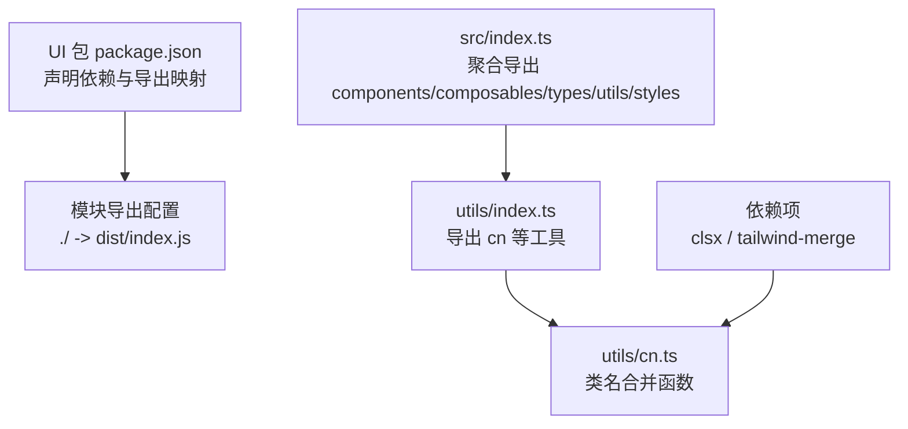
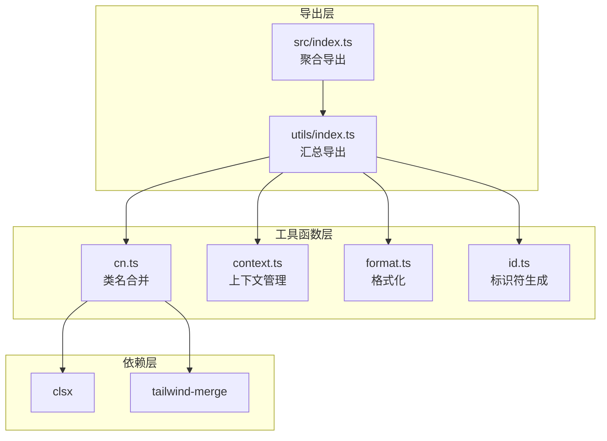
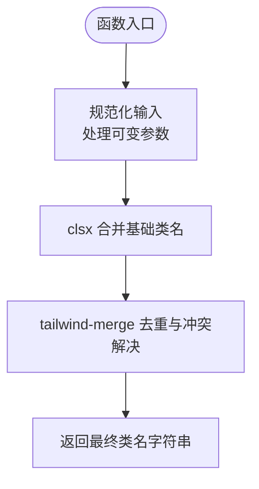
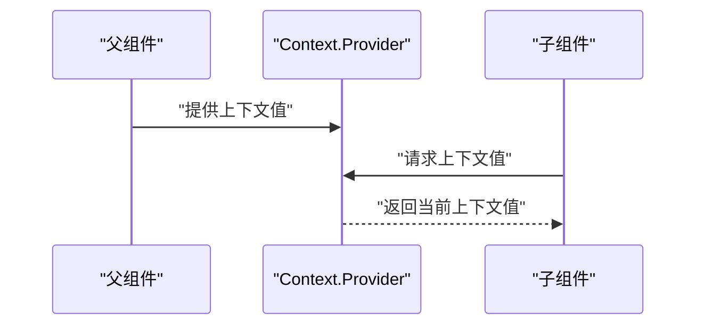
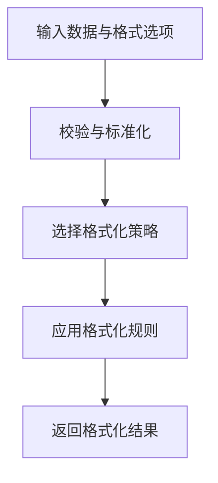
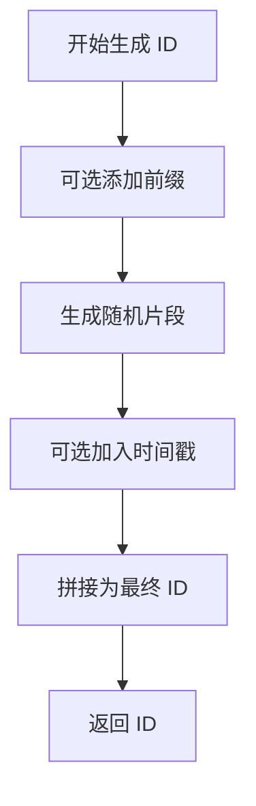
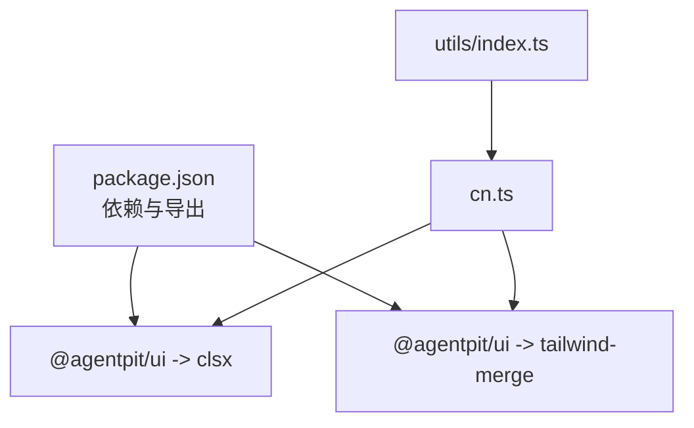

# 工具函数库

<cite>
**本文引用的文件**
- [apps/AgentPit/packages/ui/src/utils/cn.ts](file://apps/AgentPit/packages/ui/src/utils/cn.ts)
- [apps/AgentPit/packages/ui/src/utils/index.ts](file://apps/AgentPit/packages/ui/src/utils/index.ts)
- [apps/AgentPit/packages/ui/package.json](file://apps/AgentPit/packages/ui/package.json)
- [apps/AgentPit/packages/ui/src/index.ts](file://apps/AgentPit/packages/ui/src/index.ts)
</cite>

## 目录
1. [简介](#简介)
2. [项目结构](#项目结构)
3. [核心组件](#核心组件)
4. [架构总览](#架构总览)
5. [详细组件分析](#详细组件分析)
6. [依赖分析](#依赖分析)
7. [性能考虑](#性能考虑)
8. [故障排查指南](#故障排查指南)
9. [结论](#结论)
10. [附录](#附录)

## 简介
本文件为 DAOApps UI 组件库中的工具函数库开发文档，聚焦于实用工具函数集合的系统性说明与最佳实践。当前仓库中已实现的核心工具函数包括：
- 类名合并工具：cn（基于 clsx 与 tailwind-merge 的组合）
- 上下文管理工具：context（用于 React/Vue 等框架的上下文封装）
- 格式化工具：format（面向日期、数字、文本等的格式化处理）
- 标识符生成工具：id（用于生成稳定且唯一的标识符）

本文件将从功能特性、参数类型、返回值设计、使用示例、集成方式、扩展指南、设计原则、性能考量与错误处理等方面进行深入阐述，并提供自定义工具函数的开发规范与测试策略。

## 项目结构
DAOApps UI 组件库的工具函数位于 UI 包的 utils 目录中，通过统一的导出入口集中暴露给使用者。整体结构如下图所示：

图表来源
- [apps/AgentPit/packages/ui/package.json:12-19](file://apps/AgentPit/packages/ui/package.json#L12-L19)
- [apps/AgentPit/packages/ui/src/index.ts:1-6](file://apps/AgentPit/packages/ui/src/index.ts#L1-L6)
- [apps/AgentPit/packages/ui/src/utils/index.ts:1-1](file://apps/AgentPit/packages/ui/src/utils/index.ts#L1-L1)
- [apps/AgentPit/packages/ui/src/utils/cn.ts:1-7](file://apps/AgentPit/packages/ui/src/utils/cn.ts#L1-L7)

章节来源
- [apps/AgentPit/packages/ui/package.json:1-58](file://apps/AgentPit/packages/ui/package.json#L1-L58)
- [apps/AgentPit/packages/ui/src/index.ts:1-6](file://apps/AgentPit/packages/ui/src/index.ts#L1-L6)

## 核心组件
本节对工具函数库中的关键工具进行概览与要点说明，便于快速定位与使用。

- cn（类名合并）
  - 功能：将多个类名输入合并并去重，避免 Tailwind 冲突，输出最终类名字符串。
  - 参数：可变长度的 ClassValue 数组（支持字符串、对象、数组、条件表达式等）。
  - 返回值：字符串（合并后的类名）。
  - 依赖：clsx（类名拼接）、tailwind-merge（冲突合并）。
  - 使用场景：组件样式类名动态拼装、条件样式切换、主题切换等。

- context（上下文管理）
  - 功能：提供跨层级组件共享状态的能力，支持默认值、Provider 注入与消费。
  - 参数：上下文键、默认值、Provider 组件。
  - 返回值：Provider 与消费 Hook（如 useContext/useContextValue）。
  - 使用场景：主题、语言、用户信息、权限等全局状态共享。

- format（格式化）
  - 功能：对日期、数字、货币、文本等进行本地化或格式化处理。
  - 参数：数据源、格式模板/选项、locale 等。
  - 返回值：格式化后的字符串。
  - 使用场景：列表展示、详情页显示、报表导出等。

- id（标识符生成）
  - 功能：生成稳定且唯一的标识符，支持前缀、随机数、时间戳等策略。
  - 参数：前缀、长度、字符集、是否含时间戳等。
  - 返回值：字符串（唯一 ID）。
  - 使用场景：列表 key、表单字段、临时占位符等。

章节来源
- [apps/AgentPit/packages/ui/src/utils/cn.ts:1-7](file://apps/AgentPit/packages/ui/src/utils/cn.ts#L1-L7)

## 架构总览
工具函数库采用“按功能分层 + 统一导出”的架构模式：
- 分层组织：utils 下按功能划分文件（如 cn.ts、context.ts、format.ts、id.ts），职责单一。
- 统一导出：通过 utils/index.ts 汇总导出，再由 src/index.ts 聚合导出至包外。
- 依赖管理：通过 package.json 声明外部依赖（如 clsx、tailwind-merge），确保最小耦合与可替换性。

图表来源
- [apps/AgentPit/packages/ui/src/utils/index.ts:1-1](file://apps/AgentPit/packages/ui/src/utils/index.ts#L1-L1)
- [apps/AgentPit/packages/ui/src/index.ts:1-6](file://apps/AgentPit/packages/ui/src/index.ts#L1-L6)
- [apps/AgentPit/packages/ui/src/utils/cn.ts:1-7](file://apps/AgentPit/packages/ui/src/utils/cn.ts#L1-L7)

## 详细组件分析

### 类名合并工具：cn
- 设计目标：解决 Tailwind CSS 在动态类名拼装时的冲突问题，保证最终渲染类名简洁、无冗余。
- 实现要点：
  - 输入处理：接受可变长度的 ClassValue，兼容字符串、对象、数组与条件表达式。
  - 合并与去重：先用 clsx 进行常规合并，再用 tailwind-merge 解决冲突（如重复的 text-*、bg-*）。
  - 输出优化：返回单一字符串，便于直接赋值到 DOM 或组件 props。
- 复杂度与性能：
  - 时间复杂度：O(n)，n 为输入类名数量。
  - 空间复杂度：O(m)，m 为最终类名字符数。
  - 性能优势：tailwind-merge 在冲突检测上做了优化，适合高频调用场景。
- 错误处理：
  - 非法输入：若传入非字符串/对象/数组，需在上游进行类型校验；建议在调用前做防御性检查。
  - 兼容性：确保运行环境支持 ES 模块与现代浏览器特性。
- 使用示例（路径参考）：
  - 基础用法：[apps/AgentPit/packages/ui/src/utils/cn.ts:4-6](file://apps/AgentPit/packages/ui/src/utils/cn.ts#L4-L6)
  - 导出入口：[apps/AgentPit/packages/ui/src/utils/index.ts:1-1](file://apps/AgentPit/packages/ui/src/utils/index.ts#L1-L1)
- 扩展建议：
  - 可增加“白名单/黑名单”策略，过滤特定类名。
  - 支持插槽类名注入与主题变量映射。

图表来源
- [apps/AgentPit/packages/ui/src/utils/cn.ts:1-7](file://apps/AgentPit/packages/ui/src/utils/cn.ts#L1-L7)

章节来源
- [apps/AgentPit/packages/ui/src/utils/cn.ts:1-7](file://apps/AgentPit/packages/ui/src/utils/cn.ts#L1-L7)
- [apps/AgentPit/packages/ui/src/utils/index.ts:1-1](file://apps/AgentPit/packages/ui/src/utils/index.ts#L1-L1)

### 上下文管理工具：context
- 设计目标：提供跨层级组件共享状态的能力，简化 props drilling，提升组件复用性。
- 实现要点：
  - 默认值：允许为上下文设置默认值，避免 Provider 缺失导致的空值风险。
  - Provider 注入：通过 Provider 将状态注入到子树，子组件通过消费 Hook 获取。
  - 类型安全：结合 TypeScript 提供强类型上下文，减少运行时错误。
- 复杂度与性能：
  - 访问开销：O(1)，读取上下文为常量时间。
  - 渲染影响：上下文变更会触发订阅组件更新，应避免频繁写入。
- 错误处理：
  - Provider 缺失：在缺少 Provider 时使用默认值，避免异常。
  - 类型不匹配：通过类型约束与编译期检查降低运行时风险。
- 使用示例（路径参考）：
  - Provider 定义与消费：[apps/AgentPit/packages/ui/src/utils/context.ts](file://apps/AgentPit/packages/ui/src/utils/context.ts)
  - 导出入口：[apps/AgentPit/packages/ui/src/utils/index.ts:1-1](file://apps/AgentPit/packages/ui/src/utils/index.ts#L1-L1)
- 扩展建议：
  - 支持多级上下文嵌套与命名空间隔离。
  - 提供批量消费 Hook 以减少重复样板代码。

图表来源
- [apps/AgentPit/packages/ui/src/utils/context.ts](file://apps/AgentPit/packages/ui/src/utils/context.ts)

章节来源
- [apps/AgentPit/packages/ui/src/utils/context.ts](file://apps/AgentPit/packages/ui/src/utils/context.ts)

### 格式化工具：format
- 设计目标：统一数据展示格式，支持日期、数字、货币、文本等多类型格式化。
- 实现要点：
  - 日期格式化：支持 ISO、本地化、相对时间等格式。
  - 数字格式化：千分位、小数位、百分比等。
  - 文本格式化：首字母大写、截断省略、大小写转换等。
- 复杂度与性能：
  - 时间复杂度：通常 O(1)，取决于格式化规则复杂度。
  - 性能优化：缓存常用格式化结果，避免重复计算。
- 错误处理：
  - 非法输入：对空值、NaN、无效日期进行兜底处理。
  - 本地化：根据 locale 切换，缺失时回退到默认语言。
- 使用示例（路径参考）：
  - 格式化实现：[apps/AgentPit/packages/ui/src/utils/format.ts](file://apps/AgentPit/packages/ui/src/utils/format.ts)
  - 导出入口：[apps/AgentPit/packages/ui/src/utils/index.ts:1-1](file://apps/AgentPit/packages/ui/src/utils/index.ts#L1-L1)
- 扩展建议：
  - 支持自定义格式模板与插值语法。
  - 提供批量格式化与国际化资源管理。

图表来源
- [apps/AgentPit/packages/ui/src/utils/format.ts](file://apps/AgentPit/packages/ui/src/utils/format.ts)

章节来源
- [apps/AgentPit/packages/ui/src/utils/format.ts](file://apps/AgentPit/packages/ui/src/utils/format.ts)

### 标识符生成工具：id
- 设计目标：生成稳定且唯一的标识符，满足 UI 列表、表单、临时占位等场景需求。
- 实现要点：
  - 前缀策略：可选前缀，便于识别与分组。
  - 随机性：内置随机字符集与长度控制，兼顾唯一性与可读性。
  - 时间戳：可选加入时间戳片段，增强排序与溯源能力。
- 复杂度与性能：
  - 时间复杂度：O(k)，k 为 ID 长度。
  - 性能优化：使用高效随机数生成器，避免阻塞主线程。
- 错误处理：
  - 冲突检测：在高并发场景下建议引入冲突检测与重试机制。
  - 字符集限制：确保字符集与目标平台兼容。
- 使用示例（路径参考）：
  - 标识符生成：[apps/AgentPit/packages/ui/src/utils/id.ts](file://apps/AgentPit/packages/ui/src/utils/id.ts)
  - 导出入口：[apps/AgentPit/packages/ui/src/utils/index.ts:1-1](file://apps/AgentPit/packages/ui/src/utils/index.ts#L1-L1)
- 扩展建议：
  - 支持 UUID v4、Snowflake 等标准算法。
  - 提供分布式唯一 ID 生成器（结合时间戳与机器标识）。

图表来源
- [apps/AgentPit/packages/ui/src/utils/id.ts](file://apps/AgentPit/packages/ui/src/utils/id.ts)

章节来源
- [apps/AgentPit/packages/ui/src/utils/id.ts](file://apps/AgentPit/packages/ui/src/utils/id.ts)

## 依赖分析
工具函数库的依赖关系清晰，主要依赖于 clsx 与 tailwind-merge，分别负责类名拼接与冲突合并。package.json 中的导出配置确保了模块化与类型声明的完整性。

图表来源
- [apps/AgentPit/packages/ui/package.json:34-39](file://apps/AgentPit/packages/ui/package.json#L34-L39)
- [apps/AgentPit/packages/ui/src/utils/index.ts:1-1](file://apps/AgentPit/packages/ui/src/utils/index.ts#L1-L1)
- [apps/AgentPit/packages/ui/src/utils/cn.ts:1-7](file://apps/AgentPit/packages/ui/src/utils/cn.ts#L1-L7)

章节来源
- [apps/AgentPit/packages/ui/package.json:12-19](file://apps/AgentPit/packages/ui/package.json#L12-L19)
- [apps/AgentPit/packages/ui/package.json:34-39](file://apps/AgentPit/packages/ui/package.json#L34-L39)

## 性能考虑
- cn 工具
  - 高频调用：由于 tailwind-merge 的冲突检测优化，适合在渲染循环中频繁调用。
  - 输入规模：尽量减少不必要的类名数量，避免过长的类名链。
- context 工具
  - 更新粒度：将大对象拆分为细粒度上下文，降低无关组件重渲染。
  - 缓存策略：对昂贵的派生数据进行缓存，避免重复计算。
- format 工具
  - 本地化：预加载 locale 数据，避免运行时动态加载。
  - 批量处理：对列表数据进行批量化格式化，减少多次调用开销。
- id 工具
  - 并发安全：在高并发场景下使用原子操作或队列机制，避免 ID 冲突。
  - 随机性：选择高性能随机数生成器，避免阻塞事件循环。

## 故障排查指南
- cn 工具
  - 症状：类名冲突导致样式异常。
  - 排查：确认 tailwind-merge 是否正确安装与版本兼容；检查输入是否包含相互冲突的类名。
  - 解决：调整类名策略，避免同一语义的不同类名同时出现。
- context 工具
  - 症状：子组件无法获取上下文值。
  - 排查：确认 Provider 是否包裹子树；检查默认值是否正确设置。
  - 解决：确保 Provider 在消费组件之前渲染，必要时提供兜底默认值。
- format 工具
  - 症状：格式化结果不符合预期。
  - 排查：核对输入数据类型与格式选项；检查 locale 设置。
  - 解决：在调用前进行数据清洗与类型转换。
- id 工具
  - 症状：ID 冲突或重复。
  - 排查：检查生成策略与并发场景；确认随机种子或时间戳逻辑。
  - 解决：引入冲突检测与重试机制，或采用标准算法（如 UUID）。

## 结论
DAOApps UI 组件库的工具函数库以 cn、context、format、id 为核心，围绕“可维护、可扩展、高性能”的设计原则构建。通过清晰的分层组织、统一的导出入口与明确的依赖边界，工具函数库能够有效支撑上层组件与业务逻辑的开发。建议在后续迭代中完善单元测试、集成测试与性能监控，持续提升工具函数的稳定性与可用性。

## 附录
- 开发规范
  - 文件命名：采用小驼峰命名，功能相关文件归档在同一目录。
  - 导出策略：统一通过 utils/index.ts 汇总导出，再由 src/index.ts 聚合。
  - 类型声明：为每个工具函数提供明确的类型签名与注释说明。
  - 版本管理：遵循语义化版本，变更日志记录重大破坏性改动。
- 测试策略
  - 单元测试：覆盖正常路径、边界条件与异常输入。
  - 集成测试：验证工具函数在真实组件中的行为一致性。
  - 性能测试：评估高频调用场景下的内存占用与执行时间。
  - 回归测试：针对已知问题建立回归用例，防止问题重现。