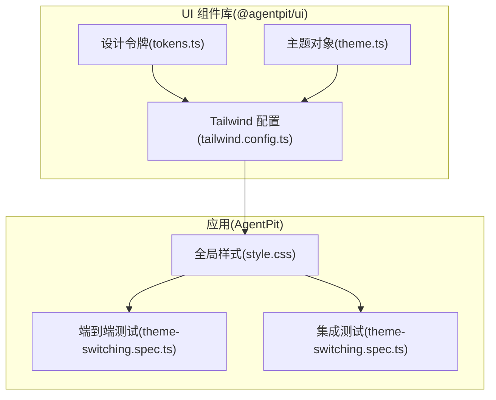
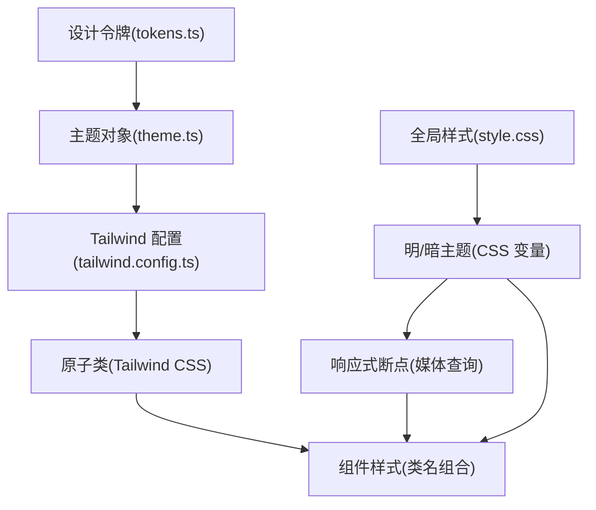
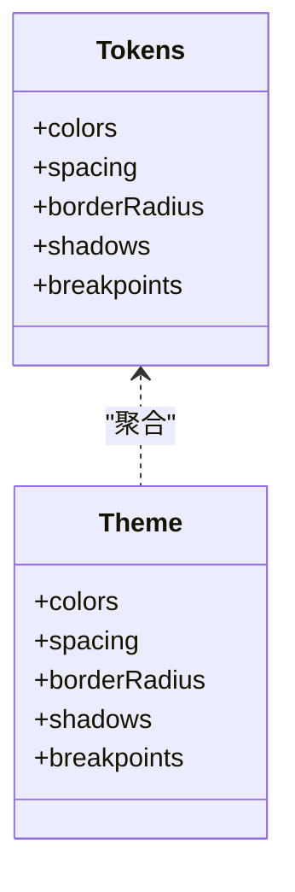
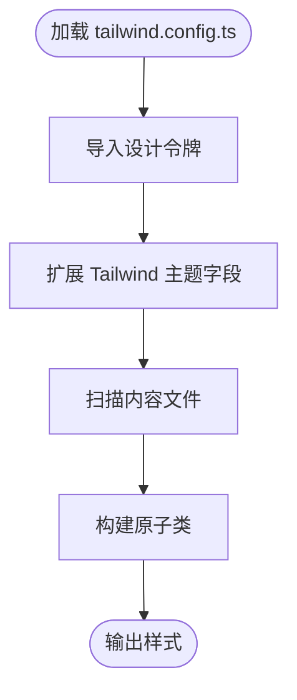
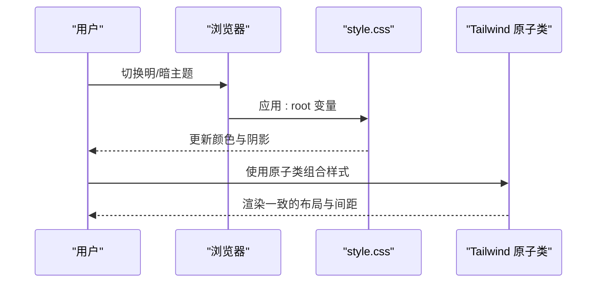
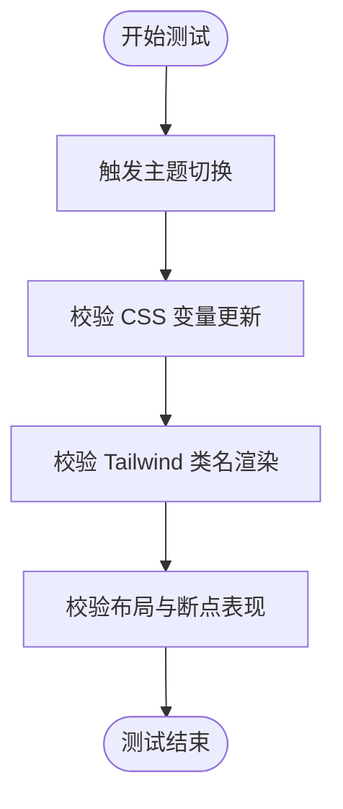
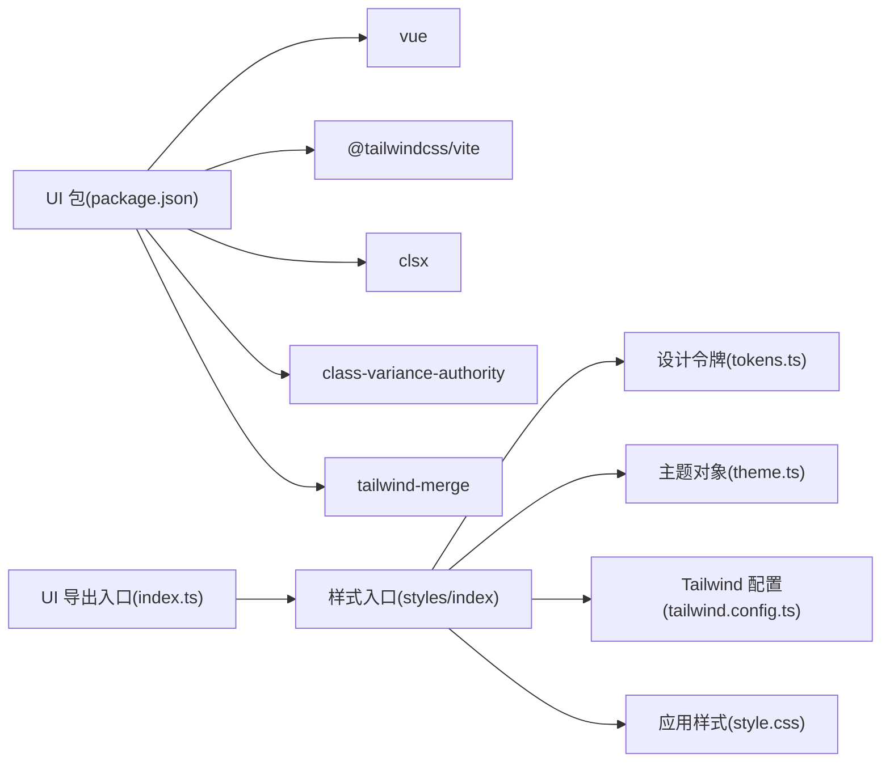

# 样式系统架构

<cite>
**本文引用的文件**
- [apps/AgentPit/packages/ui/tailwind.config.ts](file://apps/AgentPit/packages/ui/tailwind.config.ts)
- [apps/AgentPit/packages/ui/src/styles/theme.ts](file://apps/AgentPit/packages/ui/src/styles/theme.ts)
- [apps/AgentPit/packages/ui/src/styles/tokens.ts](file://apps/AgentPit/packages/ui/src/styles/tokens.ts)
- [apps/AgentPit/src/style.css](file://apps/AgentPit/src/style.css)
- [apps/AgentPit/packages/ui/package.json](file://apps/AgentPit/packages/ui/package.json)
- [apps/AgentPit/e2e/theme-switching.spec.ts](file://apps/AgentPit/e2e/theme-switching.spec.ts)
- [apps/AgentPit/src/__tests__/integration/theme-switching.spec.ts](file://apps/AgentPit/src/__tests__/integration/theme-switching.spec.ts)
- [apps/AgentPit/packages/ui/src/index.ts](file://apps/AgentPit/packages/ui/src/index.ts)
</cite>

## 目录
1. [简介](#简介)
2. [项目结构](#项目结构)
3. [核心组件](#核心组件)
4. [架构总览](#架构总览)
5. [详细组件分析](#详细组件分析)
6. [依赖关系分析](#依赖关系分析)
7. [性能考虑](#性能考虑)
8. [故障排除指南](#故障排除指南)
9. [结论](#结论)
10. [附录](#附录)

## 简介
本设计文档聚焦于 DAOApps 的样式系统架构，系统性阐述主题系统、设计令牌与 TailwindCSS 集成的设计理念与实现方式。文档覆盖主题配置、颜色系统、字体规范、间距标准与断点体系；解释设计令牌的定义、命名规范与使用场景；提供主题切换机制、暗色模式支持与响应式设计的实现方案，并给出样式定制指南、最佳实践与性能优化策略。

## 项目结构
DAOApps 的样式系统在应用层（AgentPit）采用“设计令牌 + Tailwind 扩展 + 原生 CSS 变量”的混合架构：
- 设计令牌集中定义在 UI 包中，统一导出颜色、间距、圆角、阴影与断点。
- Tailwind 配置通过扩展主题字段，将设计令牌映射到原子类名。
- 应用层主样式文件通过 CSS 变量与媒体查询实现明暗主题与响应式布局。
- UI 组件库通过包导出统一的样式入口，便于复用与版本化管理。

**图表来源**
- [apps/AgentPit/packages/ui/tailwind.config.ts:1-20](file://apps/AgentPit/packages/ui/tailwind.config.ts#L1-L20)
- [apps/AgentPit/packages/ui/src/styles/tokens.ts:1-121](file://apps/AgentPit/packages/ui/src/styles/tokens.ts#L1-L121)
- [apps/AgentPit/packages/ui/src/styles/theme.ts:1-12](file://apps/AgentPit/packages/ui/src/styles/theme.ts#L1-L12)
- [apps/AgentPit/src/style.css:1-295](file://apps/AgentPit/src/style.css#L1-L295)
- [apps/AgentPit/e2e/theme-switching.spec.ts](file://apps/AgentPit/e2e/theme-switching.spec.ts)
- [apps/AgentPit/src/__tests__/integration/theme-switching.spec.ts](file://apps/AgentPit/src/__tests__/integration/theme-switching.spec.ts)

**章节来源**
- [apps/AgentPit/packages/ui/tailwind.config.ts:1-20](file://apps/AgentPit/packages/ui/tailwind.config.ts#L1-L20)
- [apps/AgentPit/packages/ui/src/styles/tokens.ts:1-121](file://apps/AgentPit/packages/ui/src/styles/tokens.ts#L1-L121)
- [apps/AgentPit/packages/ui/src/styles/theme.ts:1-12](file://apps/AgentPit/packages/ui/src/styles/theme.ts#L1-L12)
- [apps/AgentPit/src/style.css:1-295](file://apps/AgentPit/src/style.css#L1-L295)

## 核心组件
- 设计令牌（Design Tokens）
  - 颜色：主色、强调色、成功/警告/危险、灰度等多级语义色阶。
  - 间距：以 4px 为步进的离散值集合，覆盖内边距、外边距、网格间距等。
  - 圆角：从无到全圆的标准化半径集合。
  - 阴影：轻到重的投影层级，适配不同信息密度。
  - 断点：移动端到超大屏的标准断点集。
- 主题对象（Theme）
  - 将设计令牌聚合为可直接消费的主题对象，便于在组件或工具函数中统一引用。
- Tailwind 扩展（Tailwind Config）
  - 将设计令牌映射到 Tailwind 主题字段，生成原子类名，保证样式一致性与可组合性。
- 全局样式（style.css）
  - 使用 CSS 变量承载明/暗两套调色板，结合媒体查询与用户偏好实现暗色模式。
  - 定义字体族、字号、行高、字距等排版基线，配合响应式断点调整。
- 测试与验证
  - 端到端与集成测试覆盖主题切换流程，确保明暗模式与交互状态稳定。

**章节来源**
- [apps/AgentPit/packages/ui/src/styles/tokens.ts:1-121](file://apps/AgentPit/packages/ui/src/styles/tokens.ts#L1-L121)
- [apps/AgentPit/packages/ui/src/styles/theme.ts:1-12](file://apps/AgentPit/packages/ui/src/styles/theme.ts#L1-L12)
- [apps/AgentPit/packages/ui/tailwind.config.ts:1-20](file://apps/AgentPit/packages/ui/tailwind.config.ts#L1-L20)
- [apps/AgentPit/src/style.css:1-295](file://apps/AgentPit/src/style.css#L1-L295)
- [apps/AgentPit/e2e/theme-switching.spec.ts](file://apps/AgentPit/e2e/theme-switching.spec.ts)
- [apps/AgentPit/src/__tests__/integration/theme-switching.spec.ts](file://apps/AgentPit/src/__tests__/integration/theme-switching.spec.ts)

## 架构总览
整体架构遵循“令牌驱动 + 原子类 + 原生变量”的分层设计：
- 令牌层：集中定义与版本化管理设计令牌。
- 框架层：Tailwind 将令牌映射为原子类，提升开发效率与一致性。
- 视图层：原生 CSS 变量承载明暗主题与响应式细节，保证灵活性与可控性。
- 测试层：端到端与集成测试保障主题切换与响应式行为的正确性。

**图表来源**
- [apps/AgentPit/packages/ui/src/styles/tokens.ts:1-121](file://apps/AgentPit/packages/ui/src/styles/tokens.ts#L1-L121)
- [apps/AgentPit/packages/ui/src/styles/theme.ts:1-12](file://apps/AgentPit/packages/ui/src/styles/theme.ts#L1-L12)
- [apps/AgentPit/packages/ui/tailwind.config.ts:1-20](file://apps/AgentPit/packages/ui/tailwind.config.ts#L1-L20)
- [apps/AgentPit/src/style.css:1-295](file://apps/AgentPit/src/style.css#L1-L295)

## 详细组件分析

### 设计令牌（Design Tokens）
- 颜色系统
  - 多语义色阶：主色、强调色、状态色（成功/警告/危险）、灰度，均提供 50–900 的分级映射，满足高对比度与层次表达。
  - 使用场景：语义按钮、状态徽标、强调文本、背景与边框等。
- 间距系统
  - 步进式离散值：以 4px 为基准，覆盖小到超大范围的布局间距，避免浮点误差带来的对齐问题。
  - 使用场景：卡片内外间距、网格列/行间距、元素间留白等。
- 圆角系统
  - 从无到全圆的标准化半径，适配微组件到卡片容器的圆角需求。
- 阴影系统
  - 轻到重的投影层级，区分信息层级与悬浮反馈。
- 断点系统
  - 移动端到超大屏的标准断点，确保在不同设备上保持良好的可读性与布局平衡。

**图表来源**
- [apps/AgentPit/packages/ui/src/styles/tokens.ts:1-121](file://apps/AgentPit/packages/ui/src/styles/tokens.ts#L1-L121)
- [apps/AgentPit/packages/ui/src/styles/theme.ts:1-12](file://apps/AgentPit/packages/ui/src/styles/theme.ts#L1-L12)

**章节来源**
- [apps/AgentPit/packages/ui/src/styles/tokens.ts:1-121](file://apps/AgentPit/packages/ui/src/styles/tokens.ts#L1-L121)
- [apps/AgentPit/packages/ui/src/styles/theme.ts:1-12](file://apps/AgentPit/packages/ui/src/styles/theme.ts#L1-L12)

### Tailwind 集成（tailwind.config.ts）
- 内容扫描：自动扫描应用模板与组件，按需生成原子类，减少打包体积。
- 主题扩展：将设计令牌映射到 Tailwind 主题字段，使类名与令牌一致，降低心智负担。
- 插件：预留插件扩展点，便于未来引入更多工具类或自定义规则。

**图表来源**
- [apps/AgentPit/packages/ui/tailwind.config.ts:1-20](file://apps/AgentPit/packages/ui/tailwind.config.ts#L1-L20)

**章节来源**
- [apps/AgentPit/packages/ui/tailwind.config.ts:1-20](file://apps/AgentPit/packages/ui/tailwind.config.ts#L1-L20)

### 全局样式与主题切换（style.css）
- 明/暗主题
  - 使用 CSS 变量承载两套调色板，结合用户系统偏好与媒体查询实现自动切换。
  - 在暗色模式下，对特定图标与交互元素进行滤镜与亮度调整，保证视觉一致性。
- 字体与排版
  - 定义无衬线、标题与等宽字体族，设置基础字号、行高与字距，确保可读性与节奏感。
  - 标题与段落的字号、行高与间距在不同断点下动态调整。
- 响应式设计
  - 基于断点对布局、字号与间距进行缩放，保证移动端体验。
- 交互与焦点
  - 强调色与背景色用于交互反馈，过渡动画提升可用性。

**图表来源**
- [apps/AgentPit/src/style.css:1-295](file://apps/AgentPit/src/style.css#L1-L295)

**章节来源**
- [apps/AgentPit/src/style.css:1-295](file://apps/AgentPit/src/style.css#L1-L295)

### 测试与验证
- 端到端测试
  - 验证主题切换后颜色、阴影与交互状态的一致性。
- 集成测试
  - 验证主题切换逻辑在应用内的集成效果与稳定性。

**图表来源**
- [apps/AgentPit/e2e/theme-switching.spec.ts](file://apps/AgentPit/e2e/theme-switching.spec.ts)
- [apps/AgentPit/src/__tests__/integration/theme-switching.spec.ts](file://apps/AgentPit/src/__tests__/integration/theme-switching.spec.ts)

**章节来源**
- [apps/AgentPit/e2e/theme-switching.spec.ts](file://apps/AgentPit/e2e/theme-switching.spec.ts)
- [apps/AgentPit/src/__tests__/integration/theme-switching.spec.ts](file://apps/AgentPit/src/__tests__/integration/theme-switching.spec.ts)

## 依赖关系分析
- UI 组件库依赖
  - UI 包导出统一入口，包含组件、组合式函数、类型与工具，以及样式入口。
  - 依赖 TailwindCSS 生态与合并工具，确保样式一致性与体积控制。
- 应用层依赖
  - 应用通过引入 UI 包样式入口与 Tailwind 原子类，快速搭建一致的界面风格。
  - 全局样式文件作为补充，处理明暗主题与响应式细节。

**图表来源**
- [apps/AgentPit/packages/ui/package.json:1-58](file://apps/AgentPit/packages/ui/package.json#L1-L58)
- [apps/AgentPit/packages/ui/src/index.ts:1-6](file://apps/AgentPit/packages/ui/src/index.ts#L1-L6)
- [apps/AgentPit/packages/ui/src/styles/tokens.ts:1-121](file://apps/AgentPit/packages/ui/src/styles/tokens.ts#L1-L121)
- [apps/AgentPit/packages/ui/src/styles/theme.ts:1-12](file://apps/AgentPit/packages/ui/src/styles/theme.ts#L1-L12)
- [apps/AgentPit/packages/ui/tailwind.config.ts:1-20](file://apps/AgentPit/packages/ui/tailwind.config.ts#L1-L20)
- [apps/AgentPit/src/style.css:1-295](file://apps/AgentPit/src/style.css#L1-L295)

**章节来源**
- [apps/AgentPit/packages/ui/package.json:1-58](file://apps/AgentPit/packages/ui/package.json#L1-L58)
- [apps/AgentPit/packages/ui/src/index.ts:1-6](file://apps/AgentPit/packages/ui/src/index.ts#L1-L6)

## 性能考虑
- 按需生成原子类
  - Tailwind 配置仅扫描实际使用的模板与组件，避免生成冗余类，降低 CSS 体积。
- CSS 变量与媒体查询
  - 使用 CSS 变量承载明/暗主题，减少重复样式与运行时计算成本。
- 组合式类名
  - 通过原子类组合实现样式，避免编写大量自定义样式，提升维护效率与一致性。
- 体积控制
  - 通过设计令牌的集中管理与工具类的复用，减少重复定义与冗余代码。

## 故障排除指南
- 主题切换无效
  - 检查全局样式是否正确应用 CSS 变量与媒体查询。
  - 确认测试用例覆盖了主题切换流程，定位问题范围。
- 原子类不生效
  - 确认 Tailwind 配置已正确扩展主题字段并扫描到相关文件。
  - 检查类名拼写与组合顺序，避免冲突。
- 响应式异常
  - 对照断点定义与媒体查询规则，确认断点顺序与覆盖范围。

**章节来源**
- [apps/AgentPit/src/style.css:1-295](file://apps/AgentPit/src/style.css#L1-L295)
- [apps/AgentPit/e2e/theme-switching.spec.ts](file://apps/AgentPit/e2e/theme-switching.spec.ts)
- [apps/AgentPit/src/__tests__/integration/theme-switching.spec.ts](file://apps/AgentPit/src/__tests__/integration/theme-switching.spec.ts)

## 结论
DAOApps 的样式系统以“设计令牌”为核心，通过 TailwindCSS 的原子类与原生 CSS 变量实现主题化与响应式设计。该架构在保证一致性的同时提供了灵活的定制能力，辅以完善的测试保障，适合在多应用环境中复用与演进。建议持续沉淀令牌规范与最佳实践，逐步完善暗色模式与无障碍体验。

## 附录
- 设计令牌命名规范
  - 颜色：语义前缀 + 级别（如 primary.500），避免直接使用“红色/蓝色”等非语义名称。
  - 间距：以 4px 为步进的整数索引，如 0/1/2/…/24。
  - 圆角与阴影：使用语义化名称（sm/md/lg/xl/2xl/none/full）。
  - 断点：移动端优先，使用 sm/md/lg/xl/2xl。
- 最佳实践
  - 优先使用原子类组合样式，减少自定义 CSS。
  - 通过 CSS 变量承载明/暗主题，避免硬编码颜色。
  - 在组件中统一引用主题对象，确保跨模块一致性。
  - 为关键交互添加过渡动画，提升用户体验。
- 性能优化
  - 合理拆分样式入口，按需加载。
  - 使用 Tailwind 工具类替代复杂选择器，减少样式体积。
  - 定期清理未使用类名，保持 CSS 精简。