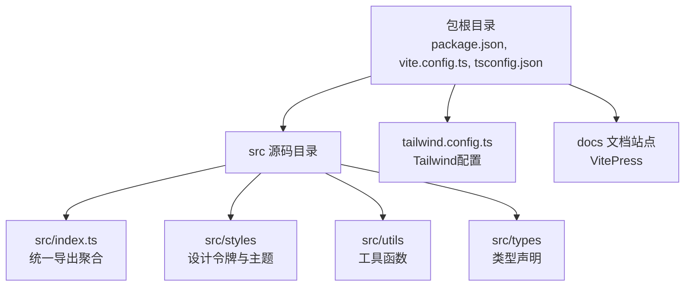
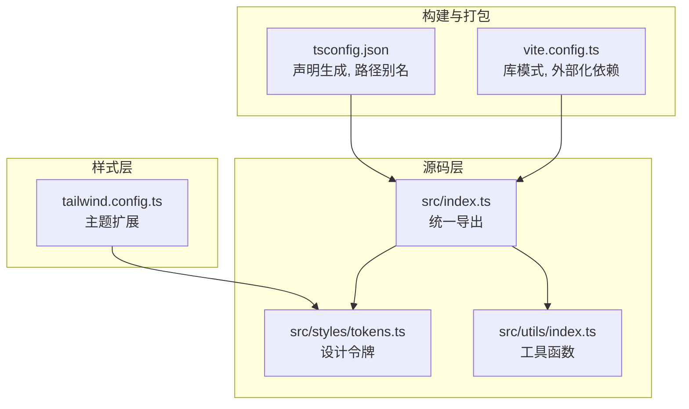
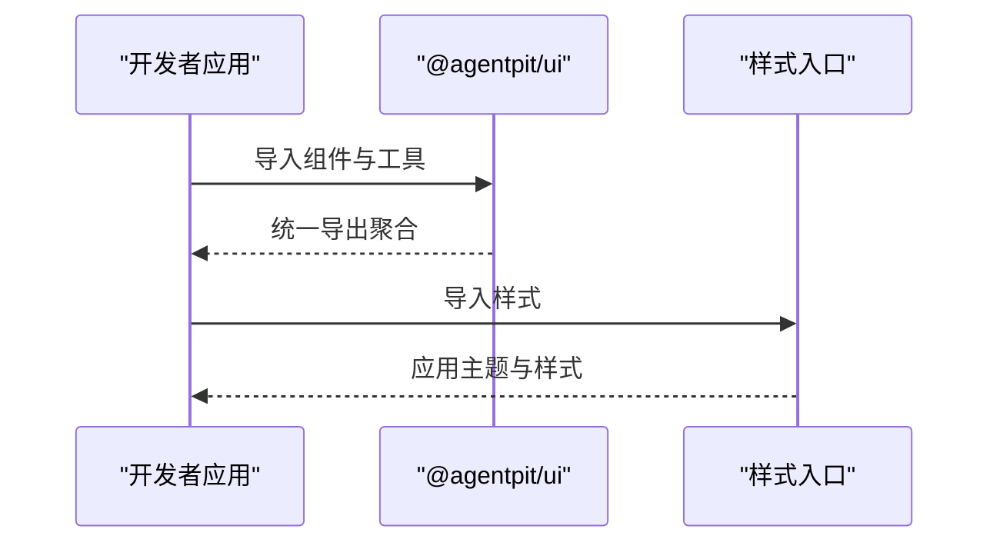
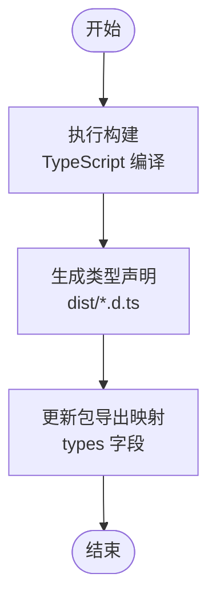
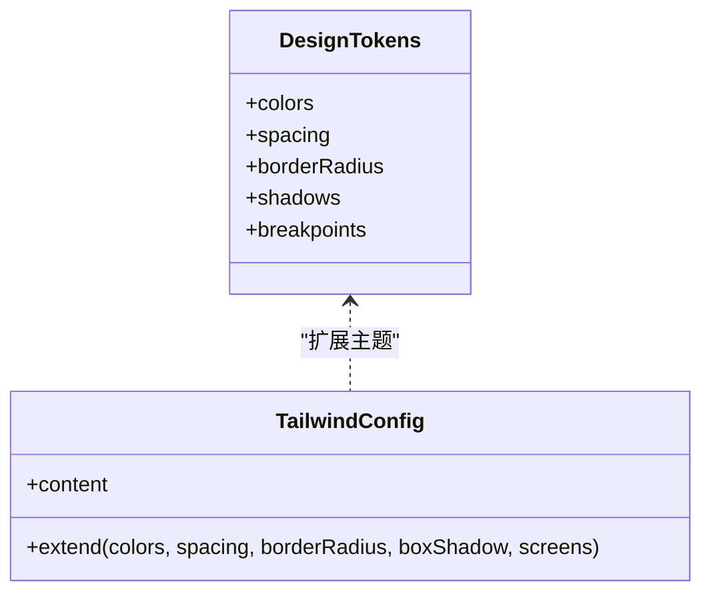
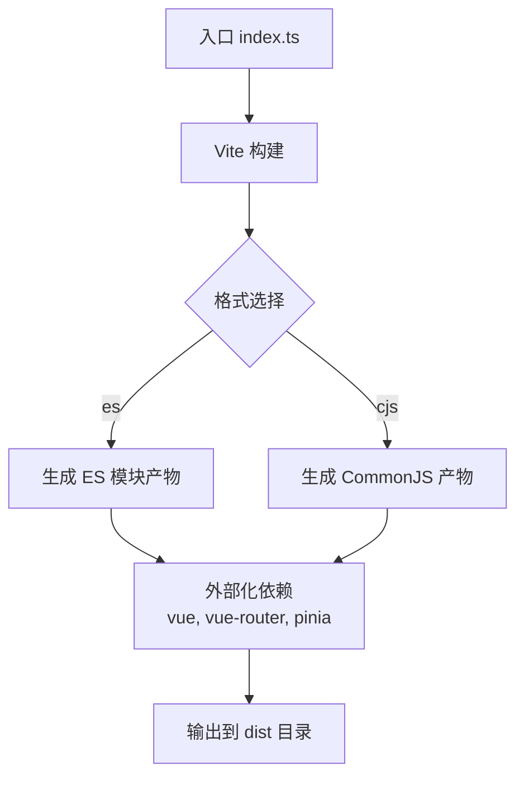
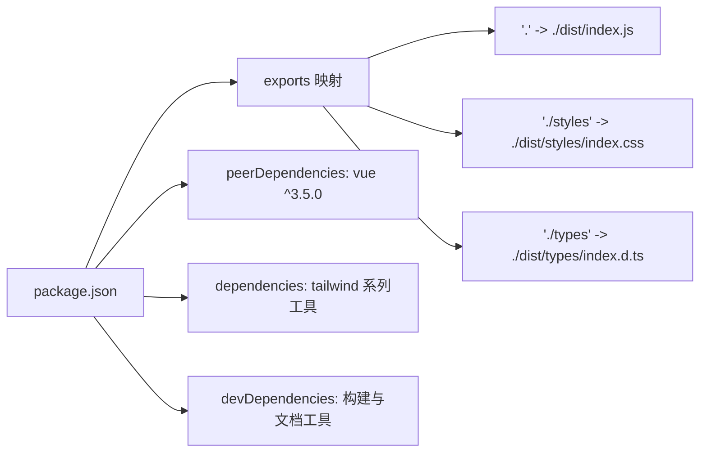

# 组件库架构设计

<cite>
**本文档引用的文件**
- [package.json](file://apps/AgentPit/packages/ui/package.json)
- [README.md](file://apps/AgentPit/packages/ui/README.md)
- [index.ts](file://apps/AgentPit/packages/ui/src/index.ts)
- [tailwind.config.ts](file://apps/AgentPit/packages/ui/tailwind.config.ts)
- [vite.config.ts](file://apps/AgentPit/packages/ui/vite.config.ts)
- [tsconfig.json](file://apps/AgentPit/packages/ui/tsconfig.json)
- [tokens.ts](file://apps/AgentPit/packages/ui/src/styles/tokens.ts)
- [utils/index.ts](file://apps/AgentPit/packages/ui/src/utils/index.ts)
</cite>

## 目录
1. [简介](#简介)
2. [项目结构](#项目结构)
3. [核心组件](#核心组件)
4. [架构总览](#架构总览)
5. [详细组件分析](#详细组件分析)
6. [依赖分析](#依赖分析)
7. [性能考虑](#性能考虑)
8. [故障排除指南](#故障排除指南)
9. [结论](#结论)
10. [附录](#附录)

## 简介
本文件面向DAOApps UI组件库（@agentpit/ui）的架构设计与实现，聚焦于模块化组织、组件导出机制、类型系统、样式体系与构建分发策略。文档旨在帮助开发者快速理解组件库的设计理念、目录结构、命名规范、依赖关系管理、注册与按需加载策略以及Tree Shaking优化，并提供版本管理、发布流程与向后兼容性保障的最佳实践建议。

## 项目结构
组件库采用“包内多模块”组织方式，核心目录与职责如下：
- 根目录：包元信息与脚本配置
  - 包描述与导出：package.json定义包名、版本、入口、类型声明与exports映射
  - 构建与文档：Vite、TypeScript、VitePress等工具链配置
- 源码根：src
  - 组件导出聚合：src/index.ts统一导出components、composables、types、utils、styles
  - 样式与主题：src/styles/tokens.ts集中定义颜色、间距、圆角、阴影、断点等设计令牌
  - 工具与类型：src/utils与src/types提供通用工具函数与类型声明
- 构建配置：vite.config.ts定义库模式打包、外部依赖与输出格式
- 类型配置：tsconfig.json启用严格模式、声明生成与路径别名

图表来源
- [package.json:1-58](file://apps/AgentPit/packages/ui/package.json#L1-L58)
- [vite.config.ts:1-30](file://apps/AgentPit/packages/ui/vite.config.ts#L1-L30)
- [tsconfig.json:1-29](file://apps/AgentPit/packages/ui/tsconfig.json#L1-L29)
- [tailwind.config.ts:1-20](file://apps/AgentPit/packages/ui/tailwind.config.ts#L1-L20)

章节来源
- [package.json:1-58](file://apps/AgentPit/packages/ui/package.json#L1-L58)
- [vite.config.ts:1-30](file://apps/AgentPit/packages/ui/vite.config.ts#L1-L30)
- [tsconfig.json:1-29](file://apps/AgentPit/packages/ui/tsconfig.json#L1-L29)
- [tailwind.config.ts:1-20](file://apps/AgentPit/packages/ui/tailwind.config.ts#L1-L20)

## 核心组件
- 统一导出聚合器：src/index.ts通过*导出聚合各模块，便于使用者从包根直接导入组件与工具
- 设计令牌：src/styles/tokens.ts集中管理颜色、间距、圆角、阴影、断点，供Tailwind扩展使用
- 构建与打包：vite.config.ts以库模式(lib)构建，支持ES与CommonJS两种格式，Rollup外部化vue等依赖
- 类型系统：tsconfig.json启用声明生成与严格编译选项，确保类型安全与良好的IDE体验
- 样式体系：tailwind.config.ts基于设计令牌扩展主题，content扫描确保Tree Shaking生效

章节来源
- [index.ts:1-6](file://apps/AgentPit/packages/ui/src/index.ts#L1-L6)
- [tokens.ts:1-121](file://apps/AgentPit/packages/ui/src/styles/tokens.ts#L1-L121)
- [vite.config.ts:1-30](file://apps/AgentPit/packages/ui/vite.config.ts#L1-L30)
- [tsconfig.json:1-29](file://apps/AgentPit/packages/ui/tsconfig.json#L1-L29)
- [tailwind.config.ts:1-20](file://apps/AgentPit/packages/ui/tailwind.config.ts#L1-L20)

## 架构总览
组件库整体采用“声明式导出 + 主题驱动 + 构建时优化”的架构：
- 声明式导出：通过src/index.ts聚合导出，简化使用者导入路径
- 主题驱动：设计令牌集中管理，Tailwind按需扩展，提升一致性与可维护性
- 构建优化：库模式打包、外部化依赖、生成多种格式与类型声明，配合Tree Shaking减少产物体积

图表来源
- [vite.config.ts:1-30](file://apps/AgentPit/packages/ui/vite.config.ts#L1-L30)
- [tsconfig.json:1-29](file://apps/AgentPit/packages/ui/tsconfig.json#L1-L29)
- [index.ts:1-6](file://apps/AgentPit/packages/ui/src/index.ts#L1-L6)
- [tokens.ts:1-121](file://apps/AgentPit/packages/ui/src/styles/tokens.ts#L1-L121)
- [tailwind.config.ts:1-20](file://apps/AgentPit/packages/ui/tailwind.config.ts#L1-L20)

## 详细组件分析

### 组件导出机制与模块化组织
- 导出聚合：src/index.ts对components、composables、types、utils、styles进行*导出，形成单一入口，降低使用者心智负担
- 目录组织：遵循功能域划分（components、composables、types、utils、styles），便于扩展与维护
- 使用示例：README展示从包中导入组件与样式的方式，体现“按需引入”的使用范式

图表来源
- [README.md:11-22](file://apps/AgentPit/packages/ui/README.md#L11-L22)
- [index.ts:1-6](file://apps/AgentPit/packages/ui/src/index.ts#L1-L6)

章节来源
- [index.ts:1-6](file://apps/AgentPit/packages/ui/src/index.ts#L1-L6)
- [README.md:11-22](file://apps/AgentPit/packages/ui/README.md#L11-L22)

### 类型系统设计与声明生成
- 编译配置：tsconfig.json启用严格模式、声明生成与路径别名，确保类型安全与良好的开发体验
- 声明产物：构建时生成.d.ts声明文件，配合package.json中的types字段，为使用者提供完整的类型提示
- 路径映射：@/*指向src，简化导入路径，提升可读性

图表来源
- [tsconfig.json:13-16](file://apps/AgentPit/packages/ui/tsconfig.json#L13-L16)
- [package.json:8](file://apps/AgentPit/packages/ui/package.json#L8)

章节来源
- [tsconfig.json:1-29](file://apps/AgentPit/packages/ui/tsconfig.json#L1-L29)
- [package.json:1-58](file://apps/AgentPit/packages/ui/package.json#L1-L58)

### 样式体系与主题令牌
- 设计令牌：colors、spacing、borderRadius、shadows、breakpoints集中定义，确保视觉一致性
- Tailwind集成：tailwind.config.ts扩展主题，content扫描确保未使用的样式被移除
- 使用建议：通过cn、clsx、tailwind-merge等工具组合类名，实现更灵活的样式控制

图表来源
- [tokens.ts:1-121](file://apps/AgentPit/packages/ui/src/styles/tokens.ts#L1-L121)
- [tailwind.config.ts:4-19](file://apps/AgentPit/packages/ui/tailwind.config.ts#L4-L19)

章节来源
- [tokens.ts:1-121](file://apps/AgentPit/packages/ui/src/styles/tokens.ts#L1-L121)
- [tailwind.config.ts:1-20](file://apps/AgentPit/packages/ui/tailwind.config.ts#L1-L20)

### 构建与打包策略
- 库模式：vite.config.ts以lib模式构建，支持es与cjs两种格式，满足不同运行环境需求
- 外部化依赖：将vue、vue-router、pinia等标记为external，避免重复打包，减小产物体积
- 输出目录：dist作为输出目录，与声明生成路径一致
- 别名配置：@指向src，提升导入可读性

图表来源
- [vite.config.ts:7-23](file://apps/AgentPit/packages/ui/vite.config.ts#L7-L23)

章节来源
- [vite.config.ts:1-30](file://apps/AgentPit/packages/ui/vite.config.ts#L1-L30)

### Tree Shaking 与按需加载
- 导出策略：通过src/index.ts聚合导出，结合库模式与external配置，使打包器能识别未使用模块并剔除
- 样式按需：README示例展示仅导入所需样式，避免全局样式污染
- 工具链支持：clsx、tailwind-merge等工具在组合类名时保持静态分析友好，有利于Tree Shaking

章节来源
- [README.md:11-22](file://apps/AgentPit/packages/ui/README.md#L11-L22)
- [vite.config.ts:14-21](file://apps/AgentPit/packages/ui/vite.config.ts#L14-L21)

## 依赖分析
- 运行时依赖
  - Vue 3.5+：peerDependencies，要求宿主应用提供
  - Tailwind相关：@tailwindcss/vite、tailwind-merge、clsx、class-variance-authority
- 开发依赖
  - 构建与类型：vite、vue-tsc、@vitejs/plugin-vue、@vue/tsconfig
  - 文档：vitepress
- 导出映射
  - 根入口：./dist/index.js
  - 样式入口：./dist/styles/index.css
  - 类型入口：./dist/types/index.d.ts

图表来源
- [package.json:12-19](file://apps/AgentPit/packages/ui/package.json#L12-L19)
- [package.json:31-47](file://apps/AgentPit/packages/ui/package.json#L31-L47)

章节来源
- [package.json:1-58](file://apps/AgentPit/packages/ui/package.json#L1-L58)

## 性能考虑
- Tree Shaking：通过库模式与external配置，结合静态导入与工具链优化，减少未使用代码
- 样式体积：基于设计令牌的主题扩展，避免重复样式；Tailwind content扫描确保未使用样式被移除
- 构建产物：同时输出es与cjs，适配现代打包器与传统环境，平衡加载性能与兼容性
- 类型声明：生成.d.ts，减少运行时类型检查开销，提升IDE性能

## 故障排除指南
- 导入失败或类型错误
  - 确认已安装Vue 3.5+且版本兼容
  - 检查是否正确导入样式入口
  - 验证tsconfig路径别名与@指向src
- 样式不生效
  - 确保已导入样式入口
  - 检查tailwind.config.ts的content扫描范围
- 构建报错
  - 确认已安装开发依赖
  - 检查vite.config.ts的external配置与输出目录

章节来源
- [package.json:31-33](file://apps/AgentPit/packages/ui/package.json#L31-L33)
- [README.md:11-22](file://apps/AgentPit/packages/ui/README.md#L11-L22)
- [tsconfig.json:22-24](file://apps/AgentPit/packages/ui/tsconfig.json#L22-L24)
- [tailwind.config.ts:5-8](file://apps/AgentPit/packages/ui/tailwind.config.ts#L5-L8)
- [vite.config.ts:14-23](file://apps/AgentPit/packages/ui/vite.config.ts#L14-L23)

## 结论
DAOApps UI组件库以“声明式导出 + 主题驱动 + 构建时优化”为核心设计思想，通过src/index.ts统一导出、设计令牌集中管理、库模式打包与external配置，实现了高一致性、低耦合与高性能的组件库架构。配合严格的类型系统与按需加载策略，能够有效提升开发效率与运行性能。

## 附录

### 组件开发规范与命名约定
- 文件组织
  - 按功能域划分目录（components、composables、types、utils、styles）
  - 统一通过src/index.ts进行聚合导出
- 命名约定
  - 组件文件采用PascalCase命名
  - 工具函数采用camelCase命名
  - 类型定义采用PascalCase命名
- 导入路径
  - 使用@/*别名指向src，提升可读性与可维护性

章节来源
- [index.ts:1-6](file://apps/AgentPit/packages/ui/src/index.ts#L1-L6)
- [tsconfig.json:22-24](file://apps/AgentPit/packages/ui/tsconfig.json#L22-L24)

### 版本管理、发布流程与向后兼容性
- 版本管理
  - 使用语义化版本（SemVer），遵循MAJOR.MINOR.PATCH
- 发布流程
  - 构建：执行构建脚本生成dist与类型声明
  - 测试：在目标环境中验证组件与样式的可用性
  - 发布：通过包管理器发布至公共仓库
- 向后兼容性
  - peerDependencies锁定Vue版本范围
  - exports映射保持稳定，避免破坏性变更
  - 逐步迁移策略：新增API时保留旧接口并标注废弃

章节来源
- [package.json:2-4](file://apps/AgentPit/packages/ui/package.json#L2-L4)
- [package.json:31-33](file://apps/AgentPit/packages/ui/package.json#L31-L33)
- [package.json:12-19](file://apps/AgentPit/packages/ui/package.json#L12-L19)