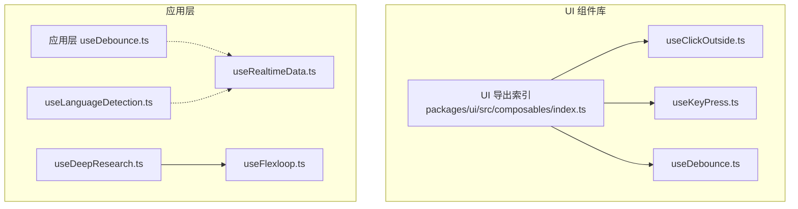
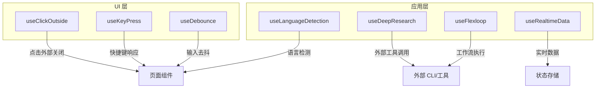
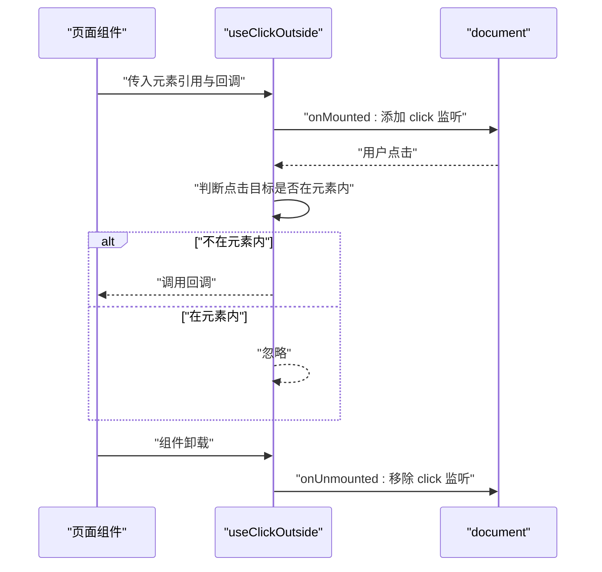
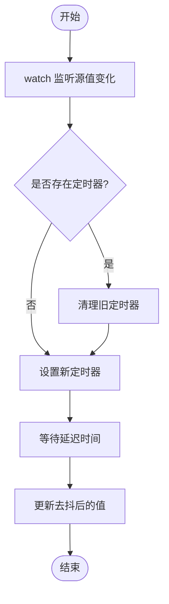
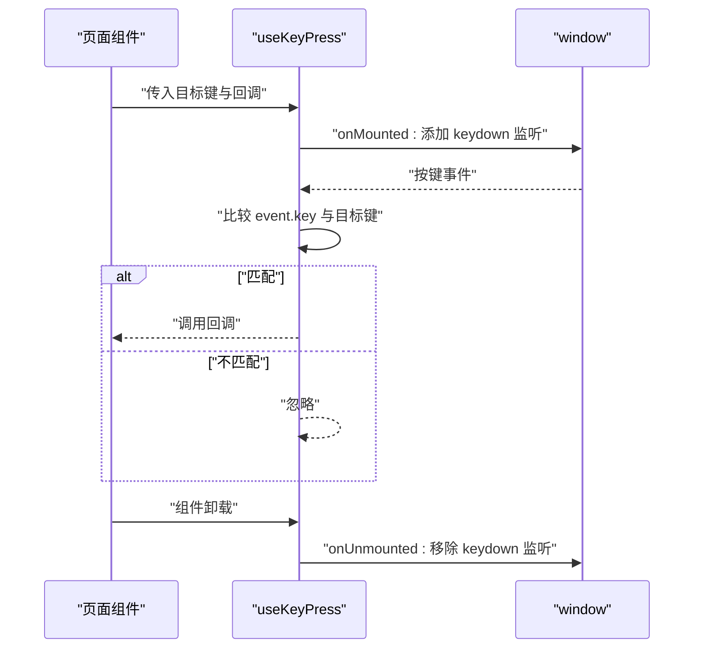
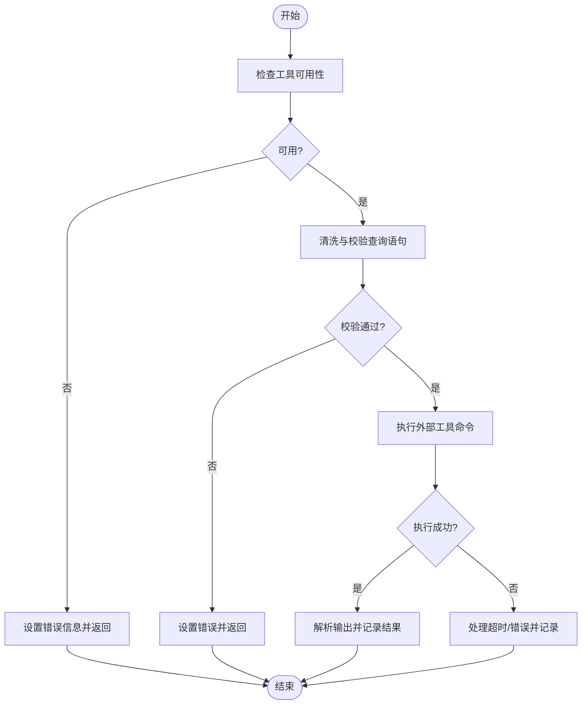
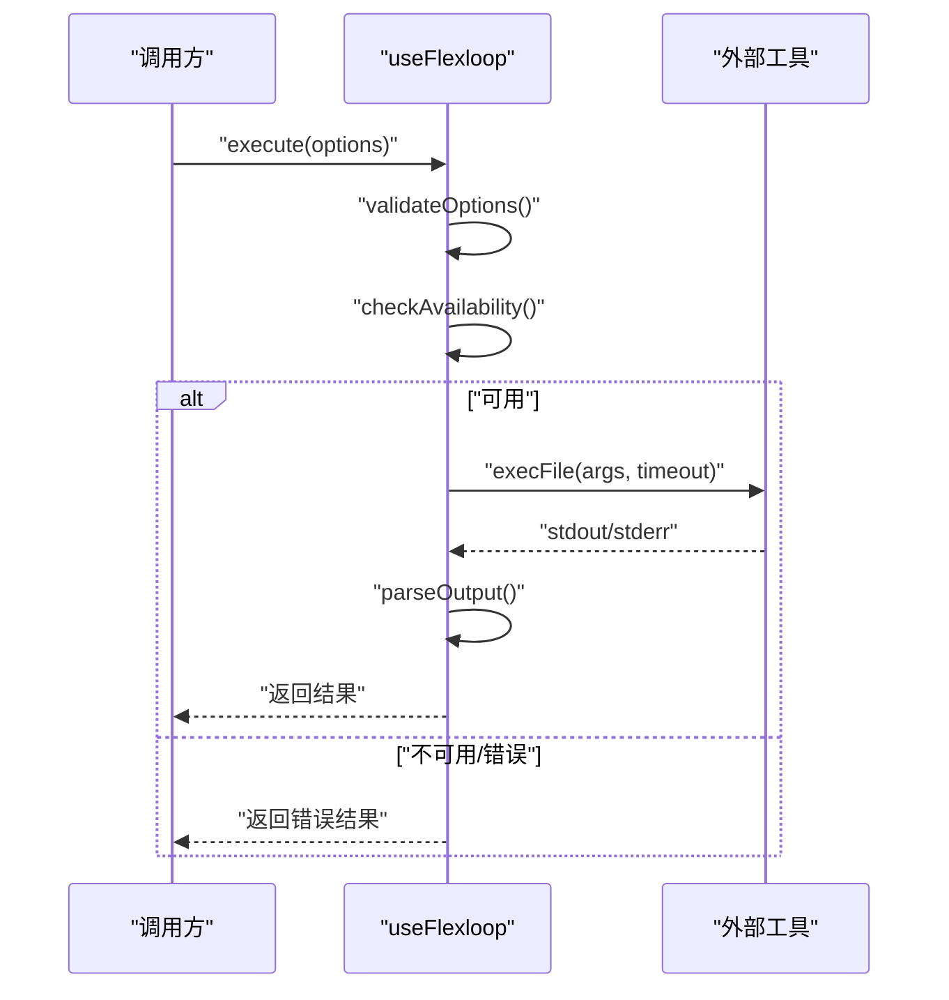
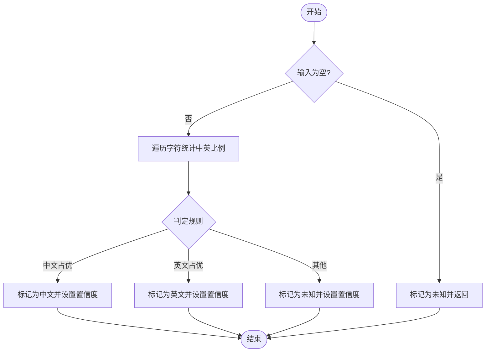
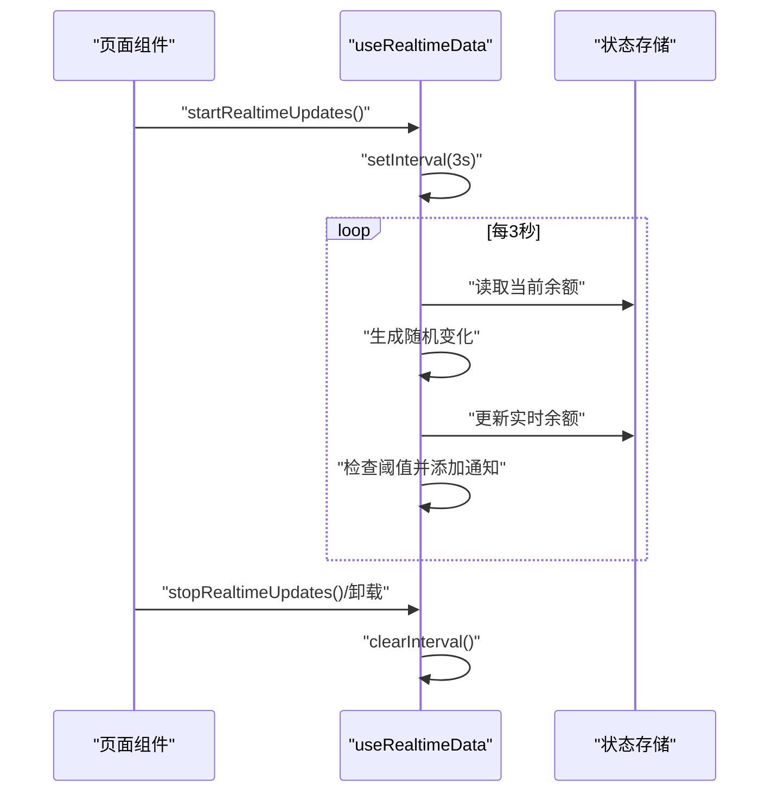
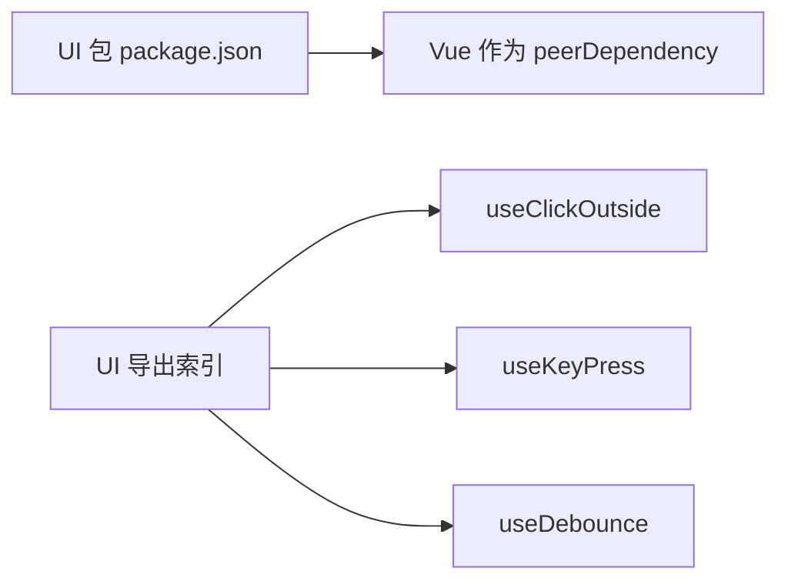

# 组合式API设计

<cite>
**本文引用的文件**
- [useDebounce.ts](file://apps/AgentPit/src/composables/useDebounce.ts)
- [useKeyPress.ts](file://apps/AgentPit/packages/ui/src/composables/useKeyPress.ts)
- [useClickOutside.ts](file://apps/AgentPit/packages/ui/src/composables/useClickOutside.ts)
- [useDeepResearch.ts](file://apps/AgentPit/src/composables/useDeepResearch.ts)
- [useFlexloop.ts](file://apps/AgentPit/src/composables/useFlexloop.ts)
- [useLanguageDetection.ts](file://apps/AgentPit/src/composables/useLanguageDetection.ts)
- [useRealtimeData.ts](file://apps/AgentPit/src/composables/useRealtimeData.ts)
- [index.ts](file://apps/AgentPit/packages/ui/src/composables/index.ts)
- [package.json](file://apps/AgentPit/packages/ui/package.json)
</cite>

## 目录
1. [引言](#引言)
2. [项目结构](#项目结构)
3. [核心组件](#核心组件)
4. [架构总览](#架构总览)
5. [详细组件分析](#详细组件分析)
6. [依赖分析](#依赖分析)
7. [性能考虑](#性能考虑)
8. [故障排查指南](#故障排查指南)
9. [结论](#结论)
10. [附录](#附录)

## 引言
本文件系统性梳理 DAOApps 中的组合式 API 设计与实现，重点覆盖可复用逻辑的抽象与封装，包括但不限于 useClickOutside、useDebounce、useKeyPress 等通用型组合式函数，以及 useDeepResearch、useFlexloop、useLanguageDetection、useRealtimeData 等业务场景化组合式 API。文档从设计理念、功能特性、参数与返回值设计、使用示例、集成方法、性能优化、状态管理与副作用处理、自定义开发指南与测试策略等方面进行深入说明，帮助开发者在不同模块间高效复用能力。

## 项目结构
AgentPit 应用内包含两套组合式 API 能力来源：
- UI 组件库层：位于 packages/ui/src/composables，提供通用交互与状态组合式函数（如点击外部关闭、按键监听、防抖等），便于跨页面/组件复用。
- 应用层：位于 src/composables，提供业务级组合式函数（如深度研究、工作流执行、语言检测、实时数据模拟等），服务于具体业务场景。

图表来源
- [index.ts:1-7](file://apps/AgentPit/packages/ui/src/composables/index.ts#L1-L7)
- [useClickOutside.ts:1-18](file://apps/AgentPit/packages/ui/src/composables/useClickOutside.ts#L1-L18)
- [useKeyPress.ts:1-18](file://apps/AgentPit/packages/ui/src/composables/useKeyPress.ts#L1-L18)
- [useDebounce.ts:1-18](file://apps/AgentPit/packages/ui/src/composables/useDebounce.ts#L1-L18)
- [useDebounce.ts:1-21](file://apps/AgentPit/src/composables/useDebounce.ts#L1-L21)
- [useDeepResearch.ts:1-256](file://apps/AgentPit/src/composables/useDeepResearch.ts#L1-L256)
- [useFlexloop.ts:1-324](file://apps/AgentPit/src/composables/useFlexloop.ts#L1-L324)
- [useLanguageDetection.ts:1-132](file://apps/AgentPit/src/composables/useLanguageDetection.ts#L1-L132)
- [useRealtimeData.ts:1-117](file://apps/AgentPit/src/composables/useRealtimeData.ts#L1-L117)

章节来源
- [index.ts:1-7](file://apps/AgentPit/packages/ui/src/composables/index.ts#L1-L7)
- [package.json:1-58](file://apps/AgentPit/packages/ui/package.json#L1-L58)

## 核心组件
本节聚焦三个高频通用组合式 API 的设计与实现要点：useClickOutside、useDebounce、useKeyPress。

- useClickOutside
  - 功能：监听全局点击事件，当点击目标不在指定元素内部时触发回调，常用于下拉菜单、模态框等“点击外部关闭”场景。
  - 参数与返回值：接收 Ref<HTMLElement | null> 类型的元素引用与回调函数；无直接返回值，通过生命周期钩子注册/卸载事件。
  - 副作用与解耦：在 onMounted/onUnmounted 中完成事件绑定/解绑，避免污染全局命名空间，与组件解耦。
  - 使用示例路径：[useClickOutside.ts:1-18](file://apps/AgentPit/packages/ui/src/composables/useClickOutside.ts#L1-L18)

- useDebounce
  - 功能：对输入值进行去抖处理，延迟更新结果，降低频繁渲染或请求开销。
  - 参数与返回值：接收 Ref 或 getter 函数与延迟时间；返回一个新的 Ref，其值在延迟后更新为最新值。
  - 实现要点：watch 监听源值变化，每次变更前清理上一个定时器，再设置新的定时器，确保最终只保留最近一次变更。
  - 使用示例路径：[useDebounce.ts:1-21](file://apps/AgentPit/src/composables/useDebounce.ts#L1-L21)

- useKeyPress
  - 功能：监听键盘按下事件，匹配目标键值时调用处理器。
  - 参数与返回值：接收目标键名与回调函数；无直接返回值，通过生命周期钩子注册/卸载事件。
  - 使用示例路径：[useKeyPress.ts:1-18](file://apps/AgentPit/packages/ui/src/composables/useKeyPress.ts#L1-L18)

章节来源
- [useClickOutside.ts:1-18](file://apps/AgentPit/packages/ui/src/composables/useClickOutside.ts#L1-L18)
- [useDebounce.ts:1-21](file://apps/AgentPit/src/composables/useDebounce.ts#L1-L21)
- [useKeyPress.ts:1-18](file://apps/AgentPit/packages/ui/src/composables/useKeyPress.ts#L1-L18)

## 架构总览
组合式 API 的整体架构遵循“分层复用、按需装配”的原则：
- UI 层组合式函数专注于通用交互与状态，保证跨组件可移植性。
- 应用层组合式函数面向业务域，封装复杂流程与外部工具调用，同时保持与 UI 层的低耦合。
- 两者均通过 Vue 响应式系统与生命周期钩子管理副作用，确保资源释放与性能可控。

图表来源
- [useClickOutside.ts:1-18](file://apps/AgentPit/packages/ui/src/composables/useClickOutside.ts#L1-L18)
- [useKeyPress.ts:1-18](file://apps/AgentPit/packages/ui/src/composables/useKeyPress.ts#L1-L18)
- [useDebounce.ts:1-21](file://apps/AgentPit/src/composables/useDebounce.ts#L1-L21)
- [useDeepResearch.ts:1-256](file://apps/AgentPit/src/composables/useDeepResearch.ts#L1-L256)
- [useFlexloop.ts:1-324](file://apps/AgentPit/src/composables/useFlexloop.ts#L1-L324)
- [useLanguageDetection.ts:1-132](file://apps/AgentPit/src/composables/useLanguageDetection.ts#L1-L132)
- [useRealtimeData.ts:1-117](file://apps/AgentPit/src/composables/useRealtimeData.ts#L1-L117)

## 详细组件分析

### useClickOutside 组件分析
- 设计理念：通过全局事件监听实现“点击外部关闭”，避免在组件内部硬编码 DOM 查询与事件处理。
- 数据结构与复杂度：仅维护一个事件监听器，时间复杂度 O(1)，内存占用极低。
- 依赖关系：依赖 Vue 生命周期钩子，确保挂载/卸载时正确注册/移除事件。
- 错误处理：通过判断元素存在性与节点包含关系，避免空引用与误判。
- 性能影响：事件监听器数量固定，对性能影响可忽略；注意避免在同一页面重复注册相同监听器。

图表来源
- [useClickOutside.ts:1-18](file://apps/AgentPit/packages/ui/src/composables/useClickOutside.ts#L1-L18)

章节来源
- [useClickOutside.ts:1-18](file://apps/AgentPit/packages/ui/src/composables/useClickOutside.ts#L1-L18)

### useDebounce 组件分析
- 设计理念：对频繁变更的值进行去抖，减少不必要的计算与网络请求。
- 数据结构与复杂度：内部使用定时器队列，watch 触发时清理旧定时器，新增定时器，平均时间复杂度 O(1)。
- 依赖关系：依赖 Vue 的 ref/watch，支持 Ref 或 getter 函数两种输入形式。
- 错误处理：若输入为 getter，需确保其稳定可预测；若输入为 Ref，需关注其响应式依赖。
- 性能影响：合理设置延迟可显著降低重渲染次数；过短延迟会抵消效果，过长延迟影响交互流畅度。

图表来源
- [useDebounce.ts:1-21](file://apps/AgentPit/src/composables/useDebounce.ts#L1-L21)

章节来源
- [useDebounce.ts:1-21](file://apps/AgentPit/src/composables/useDebounce.ts#L1-L21)

### useKeyPress 组件分析
- 设计理念：统一键盘事件处理，支持任意键位与回调，便于快捷键与热键功能。
- 数据结构与复杂度：仅维护一个事件监听器，时间复杂度 O(1)。
- 依赖关系：依赖 Vue 生命周期钩子，确保事件在组件生命周期内正确注册/移除。
- 错误处理：仅在键名匹配时触发回调，避免无关事件干扰。
- 性能影响：事件监听器数量固定，性能开销极小。

图表来源
- [useKeyPress.ts:1-18](file://apps/AgentPit/packages/ui/src/composables/useKeyPress.ts#L1-L18)

章节来源
- [useKeyPress.ts:1-18](file://apps/AgentPit/packages/ui/src/composables/useKeyPress.ts#L1-L18)

### useDeepResearch 组件分析
- 设计理念：封装外部 CLI 工具的可用性检查、参数校验、执行与结果解析，提供统一的业务接口。
- 数据结构与复杂度：内部状态通过 ref 管理，执行过程为异步 IO，受外部工具性能与网络环境影响。
- 依赖关系：依赖 Node 子进程执行外部工具，使用 DOMPurify 进行输入清洗，日志输出便于问题定位。
- 错误处理：包含工具存在性检查、依赖项检查、超时处理、解析失败回退等多层容错。
- 性能影响：IO 密集型操作，建议结合缓存与超时控制；避免在高频场景中重复调用。

图表来源
- [useDeepResearch.ts:1-256](file://apps/AgentPit/src/composables/useDeepResearch.ts#L1-L256)

章节来源
- [useDeepResearch.ts:1-256](file://apps/AgentPit/src/composables/useDeepResearch.ts#L1-L256)

### useFlexloop 组件分析
- 设计理念：封装工作流分析、优化、验证与执行的统一入口，支持多种输出格式与历史记录。
- 数据结构与复杂度：内部维护最近执行历史数组，容量上限固定，插入/截断为 O(n)。
- 依赖关系：依赖 Node 子进程执行外部工具，参数构建与输出解析逻辑清晰。
- 错误处理：参数校验、工具可用性检查、超时与信号处理、输出解析失败回退。
- 性能影响：IO 密集型，建议控制并发与合理设置超时；历史记录截断避免内存膨胀。

图表来源
- [useFlexloop.ts:1-324](file://apps/AgentPit/src/composables/useFlexloop.ts#L1-L324)

章节来源
- [useFlexloop.ts:1-324](file://apps/AgentPit/src/composables/useFlexloop.ts#L1-L324)

### useLanguageDetection 组件分析
- 设计理念：基于字符范围的简易语言检测，提供置信度与标签映射，辅助国际化与回复策略。
- 数据结构与复杂度：遍历字符串计算各类字符比例，时间复杂度 O(n)，空间复杂度 O(1)。
- 依赖关系：纯前端逻辑，无外部依赖。
- 错误处理：空字符串与空白字符返回未知语言，避免误判。
- 性能影响：线性扫描，开销极小；适合高频调用。

图表来源
- [useLanguageDetection.ts:1-132](file://apps/AgentPit/src/composables/useLanguageDetection.ts#L1-L132)

章节来源
- [useLanguageDetection.ts:1-132](file://apps/AgentPit/src/composables/useLanguageDetection.ts#L1-L132)

### useRealtimeData 组件分析
- 设计理念：模拟实时数据更新与阈值告警，配合状态存储驱动 UI 反馈。
- 数据结构与复杂度：定时器与通知列表管理，增删查改为 O(n)（n 为通知数量）。
- 依赖关系：依赖外部状态存储（钱包余额等），通过定时器周期性更新。
- 错误处理：余额为负自动告警，阈值变动触发通知；支持自动消失与手动清理。
- 性能影响：定时器周期固定，建议在组件卸载时停止，避免内存泄漏。

图表来源
- [useRealtimeData.ts:1-117](file://apps/AgentPit/src/composables/useRealtimeData.ts#L1-L117)

章节来源
- [useRealtimeData.ts:1-117](file://apps/AgentPit/src/composables/useRealtimeData.ts#L1-L117)

## 依赖分析
- UI 组件库导出索引集中暴露组合式函数，便于统一导入与版本管理。
- UI 组件库 peerDependencies 指定 Vue 版本，确保运行时兼容性。
- 应用层组合式函数之间存在弱耦合关系：业务层组合式函数可相互协作，但不强依赖彼此。

图表来源
- [package.json:31-33](file://apps/AgentPit/packages/ui/package.json#L31-L33)
- [index.ts:1-7](file://apps/AgentPit/packages/ui/src/composables/index.ts#L1-L7)

章节来源
- [package.json:1-58](file://apps/AgentPit/packages/ui/package.json#L1-L58)
- [index.ts:1-7](file://apps/AgentPit/packages/ui/src/composables/index.ts#L1-L7)

## 性能考虑
- 防抖与节流：合理设置延迟时间，避免过度渲染；在高频输入场景优先使用去抖。
- 事件监听：在组件卸载时务必移除监听器，防止内存泄漏；尽量减少全局监听器数量。
- 外部工具调用：设置合理的超时与重试策略；对大体量输出进行分页或缓存。
- 定时任务：在组件销毁时清理定时器；避免在后台标签页继续执行高开销任务。
- 输入校验：在调用外部工具前进行输入清洗与长度限制，减少无效执行。

## 故障排查指南
- 外部工具不可用
  - 症状：工具路径错误或依赖缺失导致执行失败。
  - 排查：检查工具路径与依赖项，查看可用性检查返回的错误信息。
  - 相关实现路径：[useDeepResearch.ts:96-132](file://apps/AgentPit/src/composables/useDeepResearch.ts#L96-L132)、[useFlexloop.ts:107-132](file://apps/AgentPit/src/composables/useFlexloop.ts#L107-L132)
- 执行超时
  - 症状：命令执行超过设定超时时间。
  - 排查：增大超时时间或简化输入；检查网络与外部服务状态。
  - 相关实现路径：[useDeepResearch.ts:198-234](file://apps/AgentPit/src/composables/useDeepResearch.ts#L198-L234)、[useFlexloop.ts:227-271](file://apps/AgentPit/src/composables/useFlexloop.ts#L227-L271)
- 事件未移除
  - 症状：组件卸载后仍出现事件回调。
  - 排查：确认在 onUnmounted 中移除了监听器；避免在多个地方重复注册。
  - 相关实现路径：[useClickOutside.ts:10-16](file://apps/AgentPit/packages/ui/src/composables/useClickOutside.ts#L10-L16)、[useKeyPress.ts:10-16](file://apps/AgentPit/packages/ui/src/composables/useKeyPress.ts#L10-L16)
- 去抖未生效
  - 症状：输入频繁变化，去抖未起作用。
  - 排查：确认传入的是 Ref 或 getter 返回值稳定；检查延迟时间设置。
  - 相关实现路径：[useDebounce.ts:3-19](file://apps/AgentPit/src/composables/useDebounce.ts#L3-L19)

章节来源
- [useDeepResearch.ts:96-132](file://apps/AgentPit/src/composables/useDeepResearch.ts#L96-L132)
- [useFlexloop.ts:107-132](file://apps/AgentPit/src/composables/useFlexloop.ts#L107-L132)
- [useClickOutside.ts:10-16](file://apps/AgentPit/packages/ui/src/composables/useClickOutside.ts#L10-L16)
- [useKeyPress.ts:10-16](file://apps/AgentPit/packages/ui/src/composables/useKeyPress.ts#L10-L16)
- [useDebounce.ts:3-19](file://apps/AgentPit/src/composables/useDebounce.ts#L3-L19)

## 结论
DAOApps 的组合式 API 通过分层设计实现了高复用与低耦合：UI 层提供通用交互能力，应用层封装业务流程与外部集成。这些组合式函数普遍采用 Vue 响应式与生命周期钩子管理副作用，具备良好的可测试性与可维护性。建议在实际使用中结合性能与可靠性需求，合理配置延迟、超时与缓存策略，并在组件卸载时清理资源，确保系统长期稳定运行。

## 附录
- 自定义组合式 API 开发指南
  - 明确职责边界：单一组合式函数只做一件事，避免“万能胶水”。
  - 副作用隔离：在 onMounted/onUnmounted 中注册/移除事件与定时器。
  - 参数与返回值：明确输入类型与默认值，返回值尽量简洁易用。
  - 错误处理：提供可诊断的日志与错误信息，必要时暴露重试/降级策略。
  - 测试策略：针对关键分支（可用性检查、超时、错误路径）编写单元测试；对事件与定时器使用模拟与清理。
- 集成方法
  - UI 层组合式函数：通过 UI 包导出索引统一引入，适用于通用交互场景。
  - 应用层组合式函数：按业务模块引入，适用于需要外部工具或复杂流程的场景。