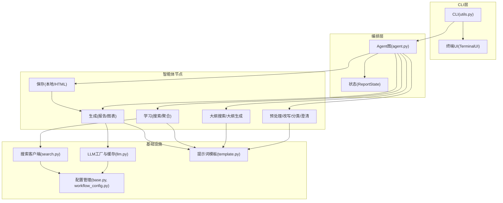
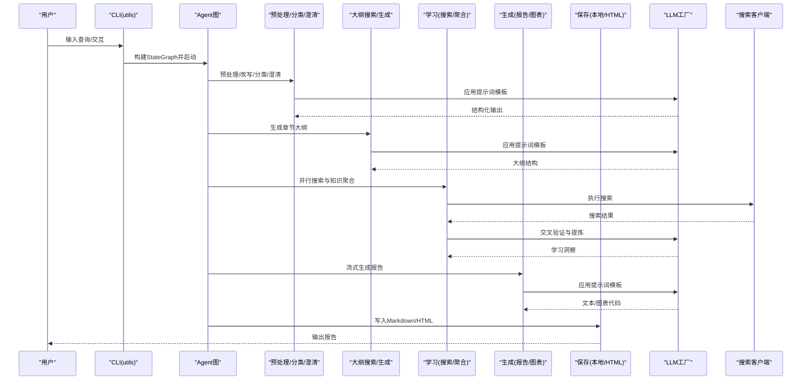
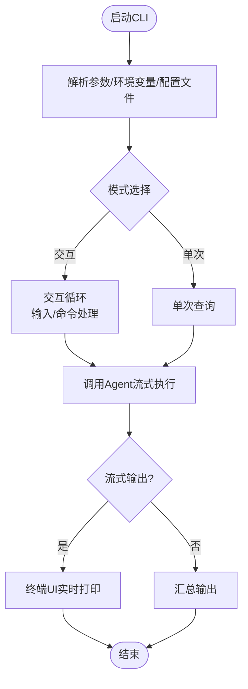
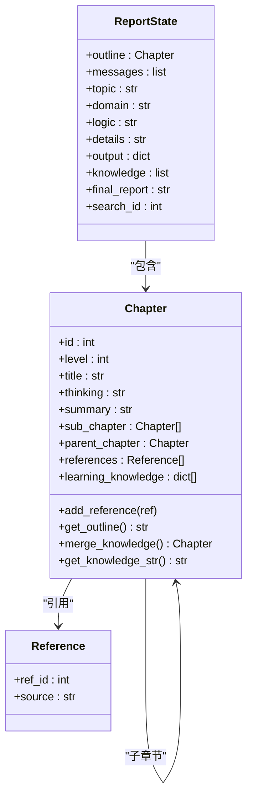
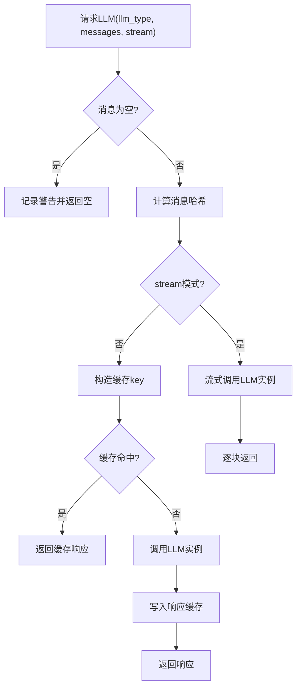
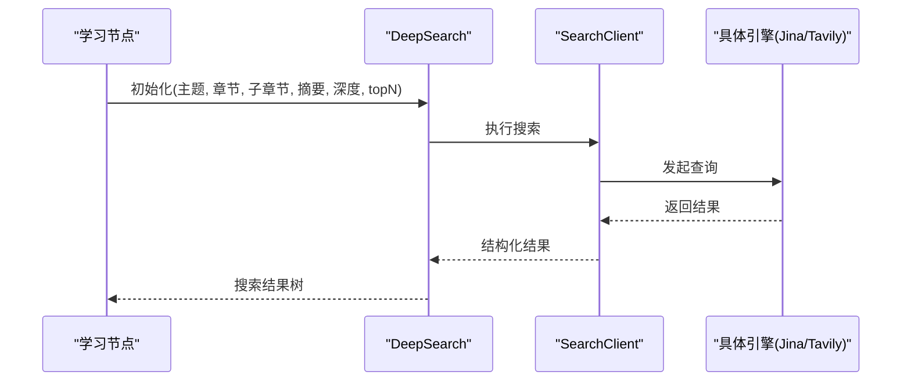
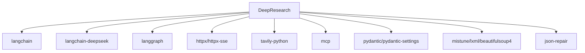

# DeepResearch深度研究工具

<cite>
**本文引用的文件**
- [pyproject.toml](file://tools/DeepResearch/pyproject.toml)
- [__init__.py](file://tools/DeepResearch/src/deepresearch/__init__.py)
- [__main__.py](file://tools/DeepResearch/src/deepresearch/cli/__main__.py)
- [utils.py](file://tools/DeepResearch/src/deepresearch/cli/utils.py)
- [base.py](file://tools/DeepResearch/src/deepresearch/config/base.py)
- [workflow_config.py](file://tools/DeepResearch/src/deepresearch/config/workflow_config.py)
- [agent.py](file://tools/DeepResearch/src/deepresearch/agent/agent.py)
- [message.py](file://tools/DeepResearch/src/deepresearch/agent/message.py)
- [learning.py](file://tools/DeepResearch/src/deepresearch/agent/learning.py)
- [generate.py](file://tools/DeepResearch/src/deepresearch/agent/generate.py)
- [llm.py](file://tools/DeepResearch/src/deepresearch/llms/llm.py)
- [search.py](file://tools/DeepResearch/src/deepresearch/tools/search.py)
- [template.py](file://tools/DeepResearch/src/deepresearch/prompts/template.py)
- [intro.md](file://tools/DeepResearch/doc/intro.md)
- [README_SPHINX.md](file://tools/DeepResearch/doc/README_SPHINX.md)
</cite>

## 目录
1. [简介](#简介)
2. [项目结构](#项目结构)
3. [核心组件](#核心组件)
4. [架构总览](#架构总览)
5. [详细组件分析](#详细组件分析)
6. [依赖关系分析](#依赖关系分析)
7. [性能考虑](#性能考虑)
8. [故障排查指南](#故障排查指南)
9. [结论](#结论)
10. [附录](#附录)

## 简介
DeepResearch是一个基于渐进式搜索与交叉评估的轻量级深度研究框架，面向复杂信息分析与可视化报告生成。其核心工作流围绕“任务规划→工具调用→评估与迭代”展开，通过模块化上下文组装与多LLM协作，实现主题聚焦、论证全面与逻辑清晰的研究产出。项目提供CLI与可扩展API，支持本地部署与灵活配置。

## 项目结构
- 核心包：tools/DeepResearch/src/deepresearch
  - agent：研究流程编排与节点实现
  - cli：命令行入口与交互UI
  - config：配置加载与校验
  - llms：LLM工厂与缓存
  - prompts：提示词模板加载与应用
  - tools：搜索客户端与工具封装
  - data：分类等数据结构
  - utils：解析与打印工具
  - logging_config：日志配置
- 配置：tools/DeepResearch/config
  - llms.toml、search.toml、workflow.toml
- 文档：tools/DeepResearch/doc
  - 包含用户手册、部署说明、架构图等

**图示来源**
- [agent.py:1-45](file://tools/DeepResearch/src/deepresearch/agent/agent.py#L1-L45)
- [utils.py:1-575](file://tools/DeepResearch/src/deepresearch/cli/utils.py#L1-L575)
- [llm.py:1-308](file://tools/DeepResearch/src/deepresearch/llms/llm.py#L1-L308)
- [search.py:1-46](file://tools/DeepResearch/src/deepresearch/tools/search.py#L1-L46)
- [template.py:1-166](file://tools/DeepResearch/src/deepresearch/prompts/template.py#L1-L166)
- [base.py:1-590](file://tools/DeepResearch/src/deepresearch/config/base.py#L1-L590)
- [workflow_config.py:1-28](file://tools/DeepResearch/src/deepresearch/config/workflow_config.py#L1-L28)

**章节来源**
- [pyproject.toml:1-93](file://tools/DeepResearch/pyproject.toml#L1-L93)
- [__main__.py:1-7](file://tools/DeepResearch/src/deepresearch/cli/__main__.py#L1-L7)
- [intro.md:1-156](file://tools/DeepResearch/doc/intro.md#L1-L156)

## 核心组件
- CLI与运行入口
  - 命令行参数解析、交互模式、单次查询模式、信号处理与异常捕获
  - 通过LangGraph流式执行研究图，支持实时输出与中断
- 编排图与状态
  - StateGraph定义节点与边，状态包含主题、领域、大纲、知识、最终报告等
- LLM工厂与缓存
  - LRU实例缓存与响应缓存，支持流式/非流式输出，带命中率统计
- 搜索与工具
  - 基于配置选择Jina或Tavily，统一返回结构化结果
- 提示词模板
  - 动态加载各模块模板，按名称注入变量，支持系统消息拼接
- 配置管理
  - 多源覆盖（默认/文件/环境/代码），字段级验证与敏感信息脱敏

**章节来源**
- [utils.py:1-575](file://tools/DeepResearch/src/deepresearch/cli/utils.py#L1-L575)
- [agent.py:1-45](file://tools/DeepResearch/src/deepresearch/agent/agent.py#L1-L45)
- [message.py:1-112](file://tools/DeepResearch/src/deepresearch/agent/message.py#L1-L112)
- [llm.py:1-308](file://tools/DeepResearch/src/deepresearch/llms/llm.py#L1-L308)
- [search.py:1-46](file://tools/DeepResearch/src/deepresearch/tools/search.py#L1-L46)
- [template.py:1-166](file://tools/DeepResearch/src/deepresearch/prompts/template.py#L1-L166)
- [base.py:1-590](file://tools/DeepResearch/src/deepresearch/config/base.py#L1-L590)
- [workflow_config.py:1-28](file://tools/DeepResearch/src/deepresearch/config/workflow_config.py#L1-L28)

## 架构总览
DeepResearch采用“多LLM协作 + 工具调用 + 评估迭代”的渐进式研究架构。CLI负责交互与调度，Agent图串联预处理、大纲生成、学习检索、报告生成与保存；LLM工厂提供稳定、可缓存的推理能力；搜索客户端与提示词模板贯穿各阶段，形成闭环的知识抽取、交叉验证与幻觉抑制。

**图示来源**
- [utils.py:106-193](file://tools/DeepResearch/src/deepresearch/cli/utils.py#L106-L193)
- [agent.py:19-44](file://tools/DeepResearch/src/deepresearch/agent/agent.py#L19-L44)
- [learning.py:15-93](file://tools/DeepResearch/src/deepresearch/agent/learning.py#L15-L93)
- [generate.py:26-111](file://tools/DeepResearch/src/deepresearch/agent/generate.py#L26-L111)
- [llm.py:146-184](file://tools/DeepResearch/src/deepresearch/llms/llm.py#L146-L184)
- [search.py:12-36](file://tools/DeepResearch/src/deepresearch/tools/search.py#L12-L36)

## 详细组件分析

### CLI与运行流程
- 参数解析与配置覆盖：支持深度、HTML保存、输出路径、日志级别、主题、配置目录等
- 交互模式：支持help/history/search/clear/quit等命令，带历史记录与搜索
- 单次查询：直接返回AI响应
- 异常处理：用户中断、Agent执行错误、配置错误等均有明确分支

**图示来源**
- [utils.py:386-575](file://tools/DeepResearch/src/deepresearch/cli/utils.py#L386-L575)
- [utils.py:195-303](file://tools/DeepResearch/src/deepresearch/cli/utils.py#L195-L303)
- [utils.py:357-383](file://tools/DeepResearch/src/deepresearch/cli/utils.py#L357-L383)

**章节来源**
- [utils.py:1-575](file://tools/DeepResearch/src/deepresearch/cli/utils.py#L1-L575)
- [__main__.py:1-7](file://tools/DeepResearch/src/deepresearch/cli/__main__.py#L1-L7)

### Agent图与状态
- 节点编排：preprocess → rewrite/classify/clarify/generic → outline_search → outline → learning → generate → save_local_node/END
- 条件边：generate后根据配置决定是否保存本地
- 状态结构：包含messages、topic、domain、logic、details、outline、knowledge、final_report、search_id等

**图示来源**
- [message.py:12-112](file://tools/DeepResearch/src/deepresearch/agent/message.py#L12-L112)
- [agent.py:19-44](file://tools/DeepResearch/src/deepresearch/agent/agent.py#L19-L44)

**章节来源**
- [agent.py:1-45](file://tools/DeepResearch/src/deepresearch/agent/agent.py#L1-L45)
- [message.py:1-112](file://tools/DeepResearch/src/deepresearch/agent/message.py#L1-L112)

### LLM工厂与缓存
- 实例缓存：LRU缓存不同参数组合的LLM实例，避免重复初始化
- 响应缓存：基于消息哈希的线程安全LRU缓存，命中即返回
- 流式/非流式：统一接口，支持分片输出与完整文本
- 统计与清理：提供命中率统计与缓存清理接口

**图示来源**
- [llm.py:146-184](file://tools/DeepResearch/src/deepresearch/llms/llm.py#L146-L184)
- [llm.py:132-144](file://tools/DeepResearch/src/deepresearch/llms/llm.py#L132-L144)

**章节来源**
- [llm.py:1-308](file://tools/DeepResearch/src/deepresearch/llms/llm.py#L1-L308)

### 搜索与工具
- 客户端工厂：根据配置选择Jina或Tavily，统一接口返回结构化结果
- 搜索结果聚合：按章节收集，分配全局引用ID，后续用于报告引用替换

**图示来源**
- [learning.py:15-93](file://tools/DeepResearch/src/deepresearch/agent/learning.py#L15-L93)
- [search.py:12-36](file://tools/DeepResearch/src/deepresearch/tools/search.py#L12-L36)

**章节来源**
- [search.py:1-46](file://tools/DeepResearch/src/deepresearch/tools/search.py#L1-L46)
- [learning.py:1-129](file://tools/DeepResearch/src/deepresearch/agent/learning.py#L1-L129)

### 提示词模板与应用
- 动态加载：扫描多个目录，导入模块并提取PROMPT与SYSTEM_PROMPT
- 应用模板：按名称查找模板，注入state变量，支持系统消息拼接

**章节来源**
- [template.py:1-166](file://tools/DeepResearch/src/deepresearch/prompts/template.py#L1-L166)

### 配置管理
- 多源覆盖：默认值 → 文件 → 环境变量 → 代码参数
- 字段验证：范围、类型、枚举等验证器
- 敏感信息：自动识别敏感键并支持脱敏输出

**章节来源**
- [base.py:1-590](file://tools/DeepResearch/src/deepresearch/config/base.py#L1-L590)
- [workflow_config.py:1-28](file://tools/DeepResearch/src/deepresearch/config/workflow_config.py#L1-L28)

## 依赖关系分析
- 语言与框架
  - Python 3.14+，LangGraph、LangChain、LangChain-DeepSeek、HTTPX等
- 关键依赖
  - httpx/httpx-sse：异步HTTP与SSE
  - mcp：模型内容协议支持
  - pydantic/pydantic-settings：结构化配置
  - tavily-python：搜索工具
  - langchain/langchain-deepseek：提示词与LLM集成
  - mistune/lxml/beautifulsoup4：内容解析
  - json-repair：JSON修复
- 可选与开发
  - sphinx系列：文档构建
  - ruff/mypy/pytest：质量与测试

**图示来源**
- [pyproject.toml:12-26](file://tools/DeepResearch/pyproject.toml#L12-L26)

**章节来源**
- [pyproject.toml:1-93](file://tools/DeepResearch/pyproject.toml#L1-L93)

## 性能考虑
- 并发控制
  - 学习节点使用线程池，最大并发不超过3，避免LLM API过载
- 缓存策略
  - LLM实例LRU缓存上限24；响应缓存上限100，命中率统计便于监控
- 流式输出
  - 生成阶段采用流式LLM输出，边生成边渲染，降低等待时间
- I/O优化
  - 搜索结果聚合与引用ID映射在内存中完成，减少重复网络请求
- 配置优化
  - 通过workflow.toml调整搜索topN与深度，平衡质量与成本

**章节来源**
- [learning.py:63-65](file://tools/DeepResearch/src/deepresearch/agent/learning.py#L63-L65)
- [llm.py:21-26](file://tools/DeepResearch/src/deepresearch/llms/llm.py#L21-L26)
- [llm.py:71-121](file://tools/DeepResearch/src/deepresearch/llms/llm.py#L71-L121)
- [generate.py:69-87](file://tools/DeepResearch/src/deepresearch/agent/generate.py#L69-L87)

## 故障排查指南
- CLI常见问题
  - 配置目录无效：检查路径存在性、可读性
  - 信号中断：Ctrl+C触发UserInterruptError，程序优雅退出
  - Agent执行失败：查看日志定位具体节点与错误
- LLM相关
  - 空消息或空响应：记录警告并返回空，检查上游状态
  - 缓存命中率低：确认消息哈希是否稳定，避免频繁微小变化
- 搜索与工具
  - 引擎不可用：确认engine配置与密钥
  - 结果为空：增大topN或调整查询关键词
- 配置问题
  - 环境变量覆盖：检查DEEPRESEARCH_*前缀变量
  - 敏感信息泄露：使用脱敏输出，避免直接打印配置

**章节来源**
- [utils.py:41-67](file://tools/DeepResearch/src/deepresearch/cli/utils.py#L41-L67)
- [utils.py:106-193](file://tools/DeepResearch/src/deepresearch/cli/utils.py#L106-L193)
- [llm.py:163-165](file://tools/DeepResearch/src/deepresearch/llms/llm.py#L163-L165)
- [llm.py:232-244](file://tools/DeepResearch/src/deepresearch/llms/llm.py#L232-L244)
- [search.py:18-23](file://tools/DeepResearch/src/deepresearch/tools/search.py#L18-L23)
- [base.py:250-276](file://tools/DeepResearch/src/deepresearch/config/base.py#L250-L276)

## 结论
DeepResearch通过“渐进式搜索+交叉评估+多LLM协作”的研究范式，提供了轻量、可控、可扩展的深度研究能力。其模块化设计与完善的配置体系，使得用户能够在本地快速部署并定制研究流程，生成高质量、可解释、可视化的研究报告。

## 附录

### 安装与配置指南
- 环境要求
  - Python 3.14+
- 安装方式
  - 本地安装：pip install .
  - 开发依赖：pip install -e ".[dev]"
  - 文档依赖：pip install -e ".[doc]"
- 配置文件
  - llms.toml：各模块LLM配置(api_base/api_key/model)
  - search.toml：engine与对应密钥(jina/tavily)
  - workflow.toml：搜索topN、深度等工作流参数
- 环境变量
  - DEEPRESEARCH_MAX_DEPTH、DEEPRESEARCH_SAVE_AS_HTML、DEEPRESEARCH_SAVE_PATH、DEEPRESEARCH_LOG_LEVEL、DEEPRESEARCH_THEME、DEEPRESEARCH_CONFIG_DIR

**章节来源**
- [intro.md:48-113](file://tools/DeepResearch/doc/intro.md#L48-L113)
- [README_SPHINX.md:1-72](file://tools/DeepResearch/doc/README_SPHINX.md#L1-L72)
- [base.py:243-276](file://tools/DeepResearch/src/deepresearch/config/base.py#L243-L276)

### CLI使用方法
- 交互模式：deepresearch
- 单次查询：deepresearch -q "主题"
- 高级参数：--depth N、--no-html、-o PATH、--log-level、--theme、--config-dir
- 帮助：deepresearch --help

**章节来源**
- [utils.py:386-482](file://tools/DeepResearch/src/deepresearch/cli/utils.py#L386-L482)

### API接口说明
- 构建Agent：from deepresearch.agent.agent import build_agent
- 日志配置：from deepresearch.logging_config import configure_logging, get_logger
- 错误类型：DeepResearchError、ConfigError、SearchError、LLMError、ReportError
- CLI入口：python -m deepresearch.run "主题"

**章节来源**
- [__init__.py:4-29](file://tools/DeepResearch/src/deepresearch/__init__.py#L4-L29)
- [__main__.py:1-7](file://tools/DeepResearch/src/deepresearch/cli/__main__.py#L1-L7)

### 实际研究案例与报告生成
- 示例报告
  - 全球AI Agent产品全景分析
  - 深度研究产品全球与国内格局分析
- 报告保存
  - Markdown与HTML双格式，默认保存至配置路径
  - 引用ID自动替换，图表通过ECharts渲染

**章节来源**
- [intro.md:42-47](file://tools/DeepResearch/doc/intro.md#L42-L47)
- [generate.py:114-159](file://tools/DeepResearch/src/deepresearch/agent/generate.py#L114-L159)

### 核心算法与技术要点
- 知识提取与聚合
  - 并行搜索、引用ID映射、洞察合并
- 交叉验证
  - 多来源对比、引用交叉核对
- 幻觉减少
  - 明确引用标注、结构化提示词、流式思考内容输出
- 评估与迭代
  - 生成阶段的条件保存与后续人工审阅

**章节来源**
- [learning.py:15-93](file://tools/DeepResearch/src/deepresearch/agent/learning.py#L15-L93)
- [generate.py:26-111](file://tools/DeepResearch/src/deepresearch/agent/generate.py#L26-L111)