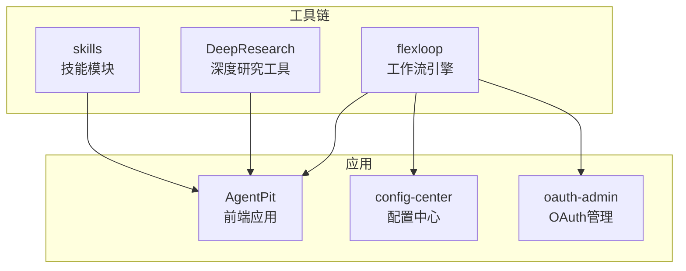
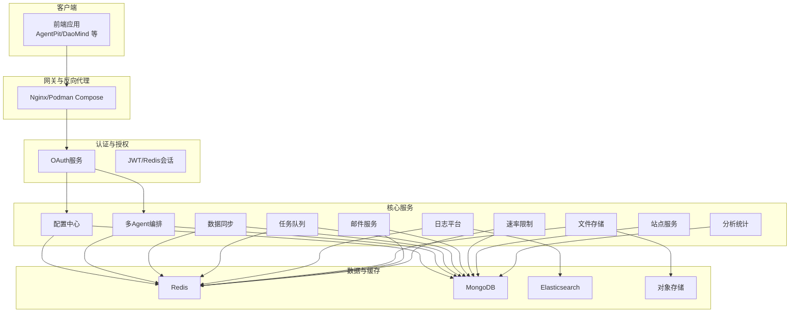
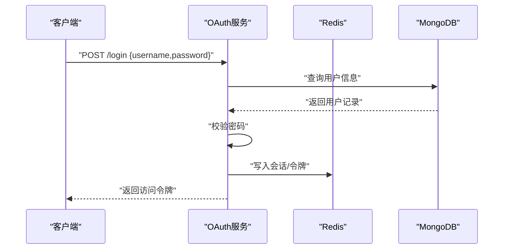
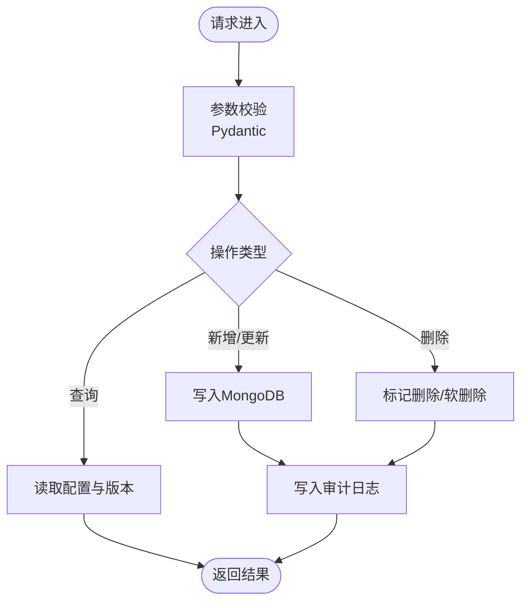
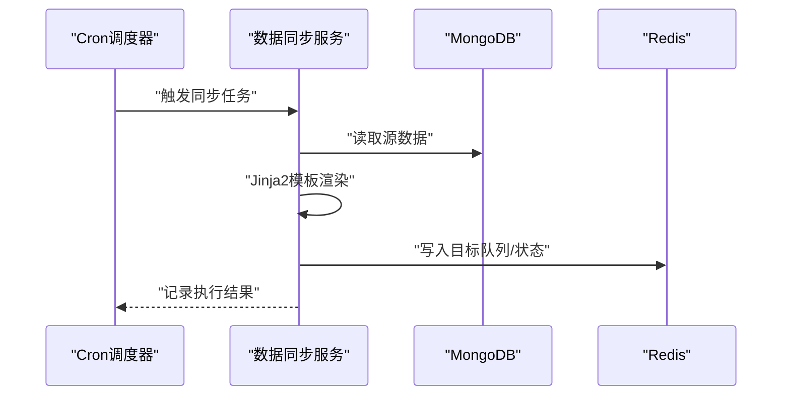
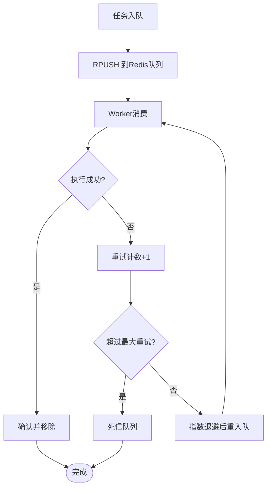
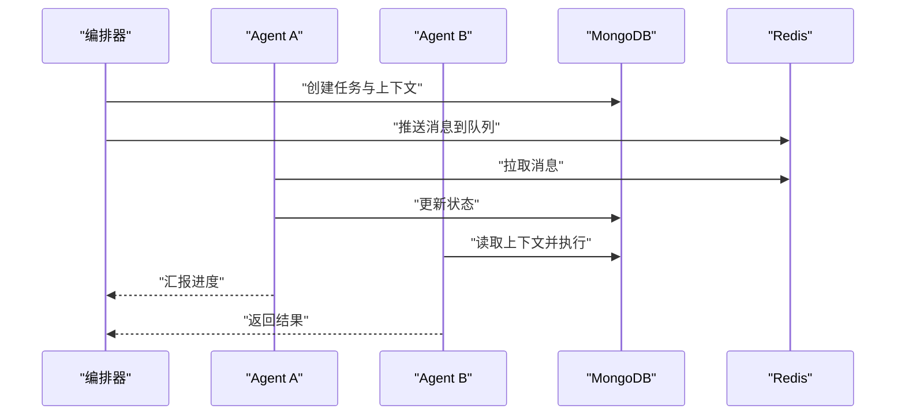
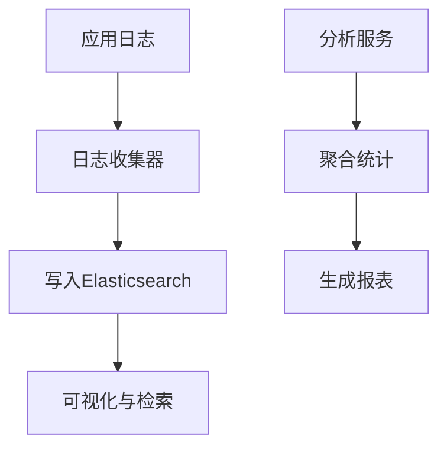
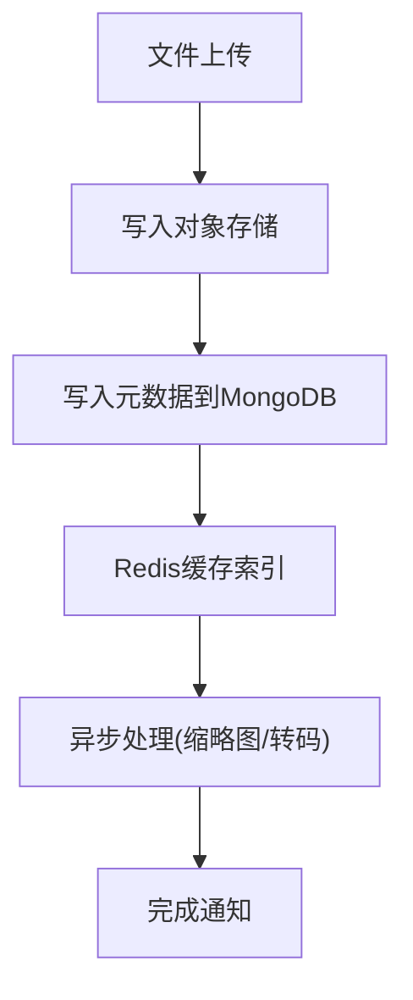
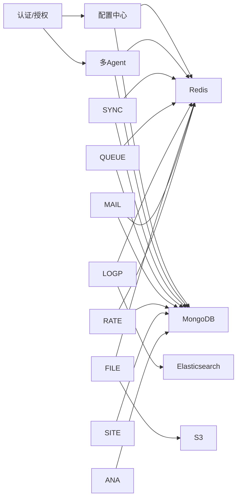

# FlexLoop工作流引擎

<cite>
**本文引用的文件**
- [README.md](file://tools/flexloop/README.md)
- [pyproject.toml](file://tools/flexloop/pyproject.toml)
- [multi_agent_example.py](file://tools/flexloop/examples/multi_agent_example.py)
- [agent.py](file://tools/flexloop/src/taolib/testing/multi_agent/models/agent.py)
- [auth.py](file://apps/AgentPit/src/services/api/auth.ts)
- [users.ts](file://apps/AgentPit/src/services/api/users.ts)
- [configs.ts](file://apps/AgentPit/src/services/api/configs.ts)
- [versions.ts](file://apps/AgentPit/src/services/api/versions.ts)
- [audit.ts](file://apps/AgentPit/src/services/api/audit.ts)
- [client.ts](file://apps/AgentPit/src/services/api/client.ts)
- [cache.ts](file://apps/AgentPit/src/services/cache.ts)
- [config.ts](file://apps/AgentPit/src/services/config.ts)
- [errors.ts](file://apps/AgentPit/src/services/errors.ts)
- [index.ts](file://apps/AgentPit/src/services/index.ts)
- [useFlexloop.ts](file://apps/AgentPit/src/composables/useFlexloop.ts)
- [logger.ts](file://apps/AgentPit/src/utils/logger.ts)
- [podman-compose.yml](file://apps/AgentPit/podman-compose.yml)
- [nginx.conf](file://apps/AgentPit/nginx.conf)
- [deploy.sh](file://apps/AgentPit/deploy.sh)
- [.dockerignore](file://apps/AgentPit/.dockerignore)
- [llms.toml](file://tools/DeepResearch/config/llms.toml)
- [workflow.toml](file://tools/DeepResearch/config/workflow.toml)
- [search.toml](file://tools/DeepResearch/config/search.toml)
</cite>

## 目录
1. [简介](#简介)
2. [项目结构](#项目结构)
3. [核心组件](#核心组件)
4. [架构总览](#架构总览)
5. [详细组件分析](#详细组件分析)
6. [依赖关系分析](#依赖关系分析)
7. [性能考虑](#性能考虑)
8. [故障排查指南](#故障排查指南)
9. [结论](#结论)
10. [附录](#附录)

## 简介
FlexLoop工作流引擎是一个面向分布式多Agent系统的工程化平台，提供容器化部署、多Agent编排、分布式任务处理、数据同步管道、任务队列管理、OAuth认证集成等核心能力。本文档基于仓库中的工具链与应用示例，系统阐述其架构设计、组件实现与运维实践，帮助开发者快速构建可靠的分布式工作流系统。

## 项目结构
仓库采用多模块组织方式，核心围绕以下几类模块展开：
- 工具链模块：tools/flexloop 提供工作流引擎的基础能力与示例
- 应用模块：apps 下的多个前端应用，提供UI与服务集成示例
- 深度研究工具：tools/DeepResearch 提供LLM与工作流配置参考
- 技能模块：skills/daoSkilLs 提供技能与任务执行参考

**章节来源**
- [README.md:1-100](file://tools/flexloop/README.md#L1-L100)
- [pyproject.toml:1-318](file://tools/flexloop/pyproject.toml#L1-L318)

## 核心组件
根据配置文件与示例，FlexLoop核心能力由以下模块构成：
- 认证与授权：taolib[auth-fastapi]、taolib[auth-server]、taolib[oauth]、taolib[oauth-server]
- 配置中心：taolib[config-server]、taolib[config-client]
- 数据同步：taolib[data-sync]、taolib[data-sync-server]
- 日志平台：taolib[log-platform]
- 速率限制：taolib[rate-limiter]
- 站点服务：taolib[site]
- 任务队列：taolib[task-queue]、taolib[task-queue-server]
- 邮件服务：taolib[email-service]、taolib[email-service-server]
- 分析统计：taolib[analytics]、taolib[analytics-server]
- 文件存储：taolib[file-storage]、taolib[file-storage-server]、taolib[file-storage-processing]
- 多Agent系统：taolib[multi-agent]、taolib[multi-agent-server]
- 其他：二维码生成、审计日志等

这些模块通过可选依赖组合，形成完整的后端服务生态，支持容器化部署与微服务拆分。

**章节来源**
- [pyproject.toml:20-235](file://tools/flexloop/pyproject.toml#L20-L235)

## 架构总览
FlexLoop采用“模块化可选依赖 + FastAPI服务 + Redis/Mongo/ES等中间件”的架构模式。典型部署包括：
- 认证与OAuth服务：负责用户认证、令牌签发与权限控制
- 配置中心：集中管理配置与版本发布
- 数据同步：基于Redis与Mongo的异步数据管道
- 任务队列：基于Redis的任务分发与重试
- 日志平台：基于Elasticsearch的日志采集与检索
- 文件存储：S3兼容对象存储与缩略图处理
- 多Agent编排：基于HTTP客户端与Mongo/Redis的状态协调

**图表来源**
- [pyproject.toml:65-235](file://tools/flexloop/pyproject.toml#L65-L235)
- [podman-compose.yml](file://apps/AgentPit/podman-compose.yml)
- [nginx.conf](file://apps/AgentPit/nginx.conf)

## 详细组件分析

### 认证与OAuth集成
- 依赖组合：taolib[oauth-server]、taolib[auth-fastapi]、taolib[auth-redis]
- 功能要点：用户注册/登录、令牌颁发、密码加密、多部分表单上传
- 集成方式：FastAPI路由 + Redis会话 + Passlib密码库

**图表来源**
- [pyproject.toml:65-78](file://tools/flexloop/pyproject.toml#L65-L78)
- [pyproject.toml:197-203](file://tools/flexloop/pyproject.toml#L197-L203)

**章节来源**
- [pyproject.toml:65-78](file://tools/flexloop/pyproject.toml#L65-L78)
- [pyproject.toml:197-203](file://tools/flexloop/pyproject.toml#L197-L203)

### 配置中心与版本管理
- 依赖组合：taolib[config-server]、taolib[config-client]
- 功能要点：配置项增删改查、版本发布、审计日志
- 集成方式：FastAPI + Motor(Mongo) + Pydantic

**图表来源**
- [pyproject.toml:71-78](file://tools/flexloop/pyproject.toml#L71-L78)

**章节来源**
- [pyproject.toml:71-78](file://tools/flexloop/pyproject.toml#L71-L78)

### 数据同步管道
- 依赖组合：taolib[data-sync]、taolib[data-sync-server]
- 功能要点：定时同步、模板渲染、Cron表达式调度
- 集成方式：FastAPI + Motor + Jinja2 + croniter

**图表来源**
- [pyproject.toml:82-95](file://tools/flexloop/pyproject.toml#L82-L95)

**章节来源**
- [pyproject.toml:82-95](file://tools/flexloop/pyproject.toml#L82-L95)

### 任务队列管理
- 依赖组合：taolib[task-queue]、taolib[task-queue-server]
- 功能要点：任务入队、重试、幂等处理
- 集成方式：Redis队列 + Motor状态持久化

**图表来源**
- [pyproject.toml:136-142](file://tools/flexloop/pyproject.toml#L136-L142)

**章节来源**
- [pyproject.toml:136-142](file://tools/flexloop/pyproject.toml#L136-L142)

### 多Agent系统编排
- 依赖组合：taolib[multi-agent]、taolib[multi-agent-server]
- 功能要点：Agent生命周期管理、状态同步、消息路由
- 示例入口：examples/multi_agent_example.py

**图表来源**
- [pyproject.toml:223-235](file://tools/flexloop/pyproject.toml#L223-L235)
- [multi_agent_example.py](file://tools/flexloop/examples/multi_agent_example.py)

**章节来源**
- [pyproject.toml:223-235](file://tools/flexloop/pyproject.toml#L223-L235)
- [multi_agent_example.py](file://tools/flexloop/examples/multi_agent_example.py)

### 日志平台与分析统计
- 依赖组合：taolib[log-platform]、taolib[analytics-server]
- 功能要点：异步日志采集、Elasticsearch索引、分析报表
- 集成方式：FastAPI + Elasticsearch + Motor + Watchfiles

**图表来源**
- [pyproject.toml:97-109](file://tools/flexloop/pyproject.toml#L97-L109)
- [pyproject.toml:162-166](file://tools/flexloop/pyproject.toml#L162-L166)

**章节来源**
- [pyproject.toml:97-109](file://tools/flexloop/pyproject.toml#L97-L109)
- [pyproject.toml:162-166](file://tools/flexloop/pyproject.toml#L162-L166)

### 文件存储与处理
- 依赖组合：taolib[file-storage]、taolib[file-storage-server]、taolib[file-storage-processing]
- 功能要点：S3兼容上传、缩略图生成、元数据管理
- 集成方式：aiobotocore + Pillow + Redis缓存

**图表来源**
- [pyproject.toml:168-183](file://tools/flexloop/pyproject.toml#L168-L183)

**章节来源**
- [pyproject.toml:168-183](file://tools/flexloop/pyproject.toml#L168-L183)

### 速率限制与站点服务
- 依赖组合：taolib[rate-limiter]、taolib[site]
- 功能要点：限流策略、站点内容管理、RSS/Feed生成
- 集成方式：FastAPI + Redis/Motor + Jinja2

**章节来源**
- [pyproject.toml:116-134](file://tools/flexloop/pyproject.toml#L116-L134)

## 依赖关系分析
FlexLoop通过可选依赖将功能模块化，避免单体服务臃肿。下图展示主要模块间的耦合关系：

**图表来源**
- [pyproject.toml:65-235](file://tools/flexloop/pyproject.toml#L65-L235)

**章节来源**
- [pyproject.toml:65-235](file://tools/flexloop/pyproject.toml#L65-L235)

## 性能考虑
- 缓存策略：Redis用于会话、队列、元数据缓存，降低数据库压力
- 异步处理：数据同步、日志、文件处理均采用异步与队列，提升吞吐
- 连接池：Mongo与Redis连接池配置，避免频繁建立连接
- 限流与熔断：速率限制模块配合队列背压，防止雪崩
- 监控与可观测性：日志平台与分析统计模块提供运行时洞察

[本节为通用指导，无需特定文件来源]

## 故障排查指南
- 认证失败：检查OAuth服务日志、Redis会话状态、密码加密算法
- 配置不生效：核对配置中心版本号、客户端拉取间隔、Mongo写入权限
- 任务积压：检查Redis队列长度、Worker并发、重试策略与死信队列
- 日志缺失：确认日志收集器是否启动、Elasticsearch索引映射、Watchfiles事件
- 文件上传失败：检查S3凭证、Bucket权限、网络连通性
- 多Agent卡顿：查看Agent状态同步、Mongo锁竞争、Redis阻塞命令

**章节来源**
- [logger.ts](file://apps/AgentPit/src/utils/logger.ts)
- [errors.ts](file://apps/AgentPit/src/services/errors.ts)

## 结论
FlexLoop通过模块化的可选依赖与标准化的FastAPI服务，提供了从认证授权到多Agent编排的完整能力集。结合Redis/Mongo/ES等中间件，能够支撑高并发、低延迟的分布式工作流场景。建议在生产环境中配套完善的监控、备份与灰度发布流程，确保系统稳定与可演进。

[本节为总结性内容，无需特定文件来源]

## 附录

### 安装与部署指南
- 环境要求：Python >= 3.14
- 安装方式：从PyPI安装或源码开发安装
- 可选依赖：按需启用对应模块（如认证、配置中心、任务队列等）
- 容器化：使用Podman Compose与Nginx进行服务编排与反向代理

**章节来源**
- [README.md:45-80](file://tools/flexloop/README.md#L45-L80)
- [podman-compose.yml](file://apps/AgentPit/podman-compose.yml)
- [nginx.conf](file://apps/AgentPit/nginx.conf)

### 配置选项
- LLM与工作流配置：参考DeepResearch的配置文件
- 工作流参数：llms.toml、workflow.toml、search.toml

**章节来源**
- [llms.toml](file://tools/DeepResearch/config/llms.toml)
- [workflow.toml](file://tools/DeepResearch/config/workflow.toml)
- [search.toml](file://tools/DeepResearch/config/search.toml)

### API接口文档
- 在线文档：参见README中提供的RTD链接
- 本地构建：安装doc依赖后使用invoke命令生成HTML文档

**章节来源**
- [README.md:70-79](file://tools/flexloop/README.md#L70-L79)

### 实际多Agent应用示例
- 示例脚本：examples/multi_agent_example.py
- Agent模型：src/taolib/testing/multi_agent/models/agent.py

**章节来源**
- [multi_agent_example.py](file://tools/flexloop/examples/multi_agent_example.py)
- [agent.py](file://tools/flexloop/src/taolib/testing/multi_agent/models/agent.py)

### 开发与运维最佳实践
- 开发：使用pytest与覆盖率配置，遵循ruff代码规范
- 部署：使用Docker镜像与Podman Compose，结合Nginx反向代理
- 运维：启用日志平台与分析统计，定期巡检Redis/Mongo/ES健康状态

**章节来源**
- [pyproject.toml:297-318](file://tools/flexloop/pyproject.toml#L297-L318)
- [deploy.sh](file://apps/AgentPit/deploy.sh)
- [podman-compose.yml](file://apps/AgentPit/podman-compose.yml)
- [nginx.conf](file://apps/AgentPit/nginx.conf)