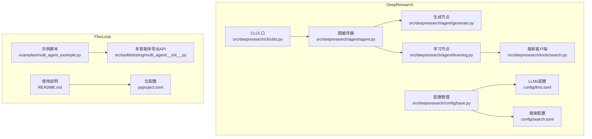
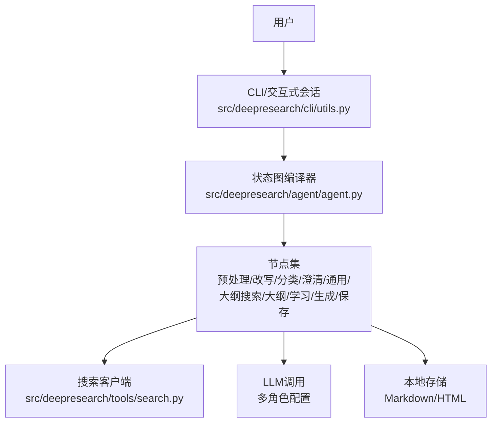
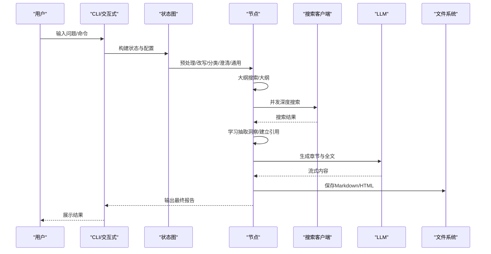
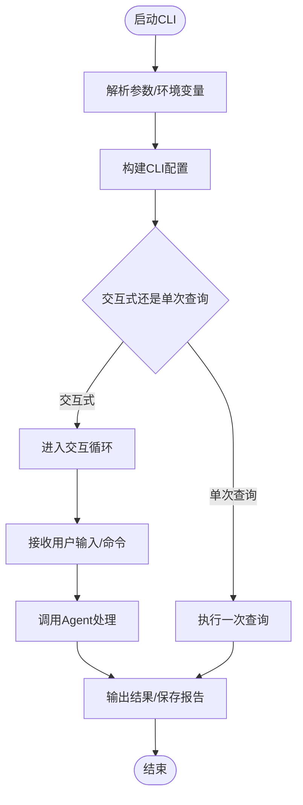
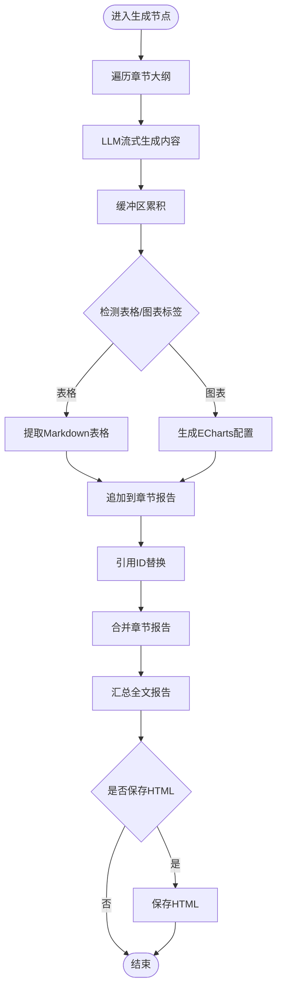
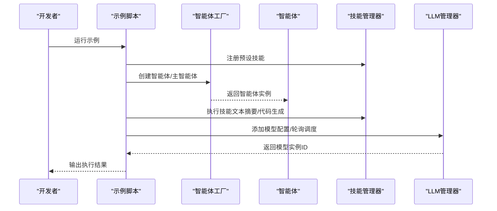
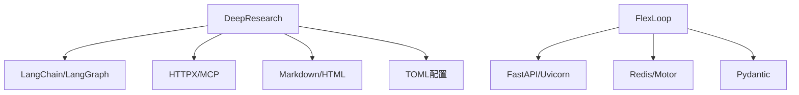

# 工具链系统

<cite>
**本文引用的文件**
- [README.md](file://tools/DeepResearch/README.md)
- [pyproject.toml](file://tools/DeepResearch/pyproject.toml)
- [src/deepresearch/__init__.py](file://tools/DeepResearch/src/deepresearch/__init__.py)
- [src/deepresearch/cli/utils.py](file://tools/DeepResearch/src/deepresearch/cli/utils.py)
- [src/deepresearch/agent/agent.py](file://tools/DeepResearch/src/deepresearch/agent/agent.py)
- [src/deepresearch/agent/generate.py](file://tools/DeepResearch/src/deepresearch/agent/generate.py)
- [src/deepresearch/agent/learning.py](file://tools/DeepResearch/src/deepresearch/agent/learning.py)
- [src/deepresearch/agent/message.py](file://tools/DeepResearch/src/deepresearch/agent/message.py)
- [src/deepresearch/config/base.py](file://tools/DeepResearch/src/deepresearch/config/base.py)
- [src/deepresearch/tools/search.py](file://tools/DeepResearch/src/deepresearch/tools/search.py)
- [config/llms.toml](file://tools/DeepResearch/config/llms.toml)
- [config/search.toml](file://tools/DeepResearch/config/search.toml)
- [README.md](file://tools/flexloop/README.md)
- [pyproject.toml](file://tools/flexloop/pyproject.toml)
- [examples/multi_agent_example.py](file://tools/flexloop/examples/multi_agent_example.py)
- [src/taolib/testing/multi_agent/__init__.py](file://tools/flexloop/src/taolib/testing/multi_agent/__init__.py)
</cite>

## 目录
1. [简介](#简介)
2. [项目结构](#项目结构)
3. [核心组件](#核心组件)
4. [架构总览](#架构总览)
5. [详细组件分析](#详细组件分析)
6. [依赖关系分析](#依赖关系分析)
7. [性能考量](#性能考量)
8. [故障排查指南](#故障排查指南)
9. [结论](#结论)
10. [附录](#附录)

## 简介
本文件面向DAOApps工具链系统，聚焦两大核心子系统：DeepResearch深度研究工具与FlexLoop工作流引擎。DeepResearch通过“任务规划→工具调用→评估与迭代”的智能工作流，实现多LLM协作、搜索集成、可视化输出与研究报告生成；FlexLoop则提供容器化部署能力、多Agent系统编排、文件分析与测试迁移策略。本文将从架构、组件、数据流、处理逻辑、集成点、错误处理与性能优化等维度进行系统化阐述，并给出安装配置、使用方法与扩展开发指南，帮助开发者高效落地。

## 项目结构
工具链位于仓库tools目录下，分别包含DeepResearch与FlexLoop两个子项目。每个子项目均提供独立的包结构、配置与示例，便于独立安装与运行。

图表来源
- [src/deepresearch/cli/utils.py:485-575](file://tools/DeepResearch/src/deepresearch/cli/utils.py#L485-L575)
- [src/deepresearch/agent/agent.py:19-45](file://tools/DeepResearch/src/deepresearch/agent/agent.py#L19-L45)
- [src/deepresearch/agent/generate.py:26-112](file://tools/DeepResearch/src/deepresearch/agent/generate.py#L26-L112)
- [src/deepresearch/agent/learning.py:15-94](file://tools/DeepResearch/src/deepresearch/agent/learning.py#L15-L94)
- [src/deepresearch/tools/search.py:12-37](file://tools/DeepResearch/src/deepresearch/tools/search.py#L12-L37)
- [src/deepresearch/config/base.py:373-456](file://tools/DeepResearch/src/deepresearch/config/base.py#L373-L456)
- [config/llms.toml:1-29](file://tools/DeepResearch/config/llms.toml#L1-L29)
- [config/search.toml:1-6](file://tools/DeepResearch/config/search.toml#L1-L6)
- [examples/multi_agent_example.py:14-33](file://tools/flexloop/examples/multi_agent_example.py#L14-L33)
- [src/taolib/testing/multi_agent/__init__.py:6-89](file://tools/flexloop/src/taolib/testing/multi_agent/__init__.py#L6-L89)

章节来源
- [README.md:15-38](file://tools/DeepResearch/README.md#L15-L38)
- [README.md:40-100](file://tools/flexloop/README.md#L40-L100)

## 核心组件
- DeepResearch
  - CLI与交互：提供命令行入口、交互式对话、单次查询、历史记录与帮助命令。
  - 图编译器：以LangGraph构建状态图，串联预处理、改写、分类、澄清、通用、大纲搜索、大纲生成、学习、生成与保存等节点。
  - 搜索与学习：多线程并发深度搜索，抽取洞察并建立引用映射，支持Jina/Tavily搜索引擎切换。
  - 报告生成：Markdown流式生成，支持表格与ECharts可视化片段嵌入，最终落盘为HTML与Markdown。
  - 配置体系：基于TOML的分层配置（文件/环境/默认），支持敏感字段脱敏与缓存清理。
- FlexLoop
  - 多智能体：提供智能体工厂、主智能体、子智能体封装、模板与能力模型。
  - 技能系统：内置文本摘要、代码生成、翻译、数据分析等技能，支持注册与执行。
  - LLM管理：负载均衡、模型注册与实例化，支持轮询策略与权重。
  - 示例与测试：提供多智能体使用示例脚本，涵盖技能使用、智能体创建、主智能体生命周期与LLM管理。

章节来源
- [src/deepresearch/cli/utils.py:195-304](file://tools/DeepResearch/src/deepresearch/cli/utils.py#L195-L304)
- [src/deepresearch/agent/agent.py:19-45](file://tools/DeepResearch/src/deepresearch/agent/agent.py#L19-L45)
- [src/deepresearch/agent/learning.py:15-94](file://tools/DeepResearch/src/deepresearch/agent/learning.py#L15-L94)
- [src/deepresearch/agent/generate.py:26-112](file://tools/DeepResearch/src/deepresearch/agent/generate.py#L26-L112)
- [src/deepresearch/tools/search.py:12-37](file://tools/DeepResearch/src/deepresearch/tools/search.py#L12-L37)
- [src/deepresearch/config/base.py:373-456](file://tools/DeepResearch/src/deepresearch/config/base.py#L373-L456)
- [examples/multi_agent_example.py:36-196](file://tools/flexloop/examples/multi_agent_example.py#L36-L196)
- [src/taolib/testing/multi_agent/__init__.py:6-89](file://tools/flexloop/src/taolib/testing/multi_agent/__init__.py#L6-L89)

## 架构总览
DeepResearch采用LangGraph状态图驱动的流水线，结合多LLM角色分工与外部搜索工具，形成“规划-检索-学习-生成-保存”的闭环。FlexLoop以多智能体为核心，围绕技能与LLM管理器提供可扩展的编排能力。

图表来源
- [src/deepresearch/cli/utils.py:195-304](file://tools/DeepResearch/src/deepresearch/cli/utils.py#L195-L304)
- [src/deepresearch/agent/agent.py:19-45](file://tools/DeepResearch/src/deepresearch/agent/agent.py#L19-L45)
- [src/deepresearch/agent/generate.py:26-112](file://tools/DeepResearch/src/deepresearch/agent/generate.py#L26-L112)
- [src/deepresearch/agent/learning.py:15-94](file://tools/DeepResearch/src/deepresearch/agent/learning.py#L15-L94)
- [src/deepresearch/tools/search.py:12-37](file://tools/DeepResearch/src/deepresearch/tools/search.py#L12-L37)

## 详细组件分析

### DeepResearch：多LLM协作与研究流程
- 状态图与节点
  - 预处理/改写/分类/澄清/通用：对输入进行规范化与分类，生成初步结构。
  - 大纲搜索/大纲：根据主题生成章节大纲，支持递归细化。
  - 学习：并发深度搜索，抽取洞察并建立全局引用ID映射。
  - 生成：基于提示词模板与上下文生成章节与全文，支持表格与图表片段。
  - 保存：按需保存为Markdown与HTML。
- 并发与引用映射
  - 使用线程池并发处理各章节搜索，避免LLM调用过载。
  - 通过URL到ID的映射，将引用占位替换为真实ID，保证报告引用一致性。
- 可视化输出
  - 表格：从LLM输出中提取Markdown表格片段。
  - 图表：从LLM输出中提取ECharts配置，注入HTML容器，实现交互式图表。
- 配置与安全
  - 分层配置：文件（TOML）→环境变量（带前缀）→默认值，支持敏感字段脱敏与缓存清理。
  - 搜索引擎：支持Jina与Tavily，可通过配置切换。

图表来源
- [src/deepresearch/cli/utils.py:106-193](file://tools/DeepResearch/src/deepresearch/cli/utils.py#L106-L193)
- [src/deepresearch/agent/agent.py:19-45](file://tools/DeepResearch/src/deepresearch/agent/agent.py#L19-L45)
- [src/deepresearch/agent/learning.py:15-94](file://tools/DeepResearch/src/deepresearch/agent/learning.py#L15-L94)
- [src/deepresearch/agent/generate.py:26-112](file://tools/DeepResearch/src/deepresearch/agent/generate.py#L26-L112)
- [src/deepresearch/tools/search.py:25-36](file://tools/DeepResearch/src/deepresearch/tools/search.py#L25-L36)

章节来源
- [src/deepresearch/agent/agent.py:19-45](file://tools/DeepResearch/src/deepresearch/agent/agent.py#L19-L45)
- [src/deepresearch/agent/learning.py:15-94](file://tools/DeepResearch/src/deepresearch/agent/learning.py#L15-L94)
- [src/deepresearch/agent/generate.py:26-112](file://tools/DeepResearch/src/deepresearch/agent/generate.py#L26-L112)
- [src/deepresearch/tools/search.py:12-37](file://tools/DeepResearch/src/deepresearch/tools/search.py#L12-L37)
- [src/deepresearch/config/base.py:373-456](file://tools/DeepResearch/src/deepresearch/config/base.py#L373-L456)
- [config/llms.toml:1-29](file://tools/DeepResearch/config/llms.toml#L1-L29)
- [config/search.toml:1-6](file://tools/DeepResearch/config/search.toml#L1-L6)

### DeepResearch：CLI与交互式会话
- 功能要点
  - 支持交互式对话、单次查询、历史记录、帮助命令与搜索历史。
  - 信号处理与中断：支持Ctrl+C/Ctrl+D中断当前操作。
  - 配置覆盖：命令行参数可覆盖默认配置（深度、HTML保存、输出路径、日志级别、主题、配置目录）。
- 错误处理
  - 配置校验、消息有效性校验、Agent执行异常、用户中断等均有明确处理与日志记录。

图表来源
- [src/deepresearch/cli/utils.py:386-483](file://tools/DeepResearch/src/deepresearch/cli/utils.py#L386-L483)
- [src/deepresearch/cli/utils.py:485-575](file://tools/DeepResearch/src/deepresearch/cli/utils.py#L485-L575)

章节来源
- [src/deepresearch/cli/utils.py:195-304](file://tools/DeepResearch/src/deepresearch/cli/utils.py#L195-L304)
- [src/deepresearch/cli/utils.py:357-384](file://tools/DeepResearch/src/deepresearch/cli/utils.py#L357-L384)

### DeepResearch：报告生成与可视化
- 内容处理
  - 流式内容拼接与缓冲，识别表格与图表标签，提取对应片段。
  - 引用ID替换：将占位引用替换为真实ID，保证引用一致性。
- 可视化
  - 表格：提取Markdown表格字符串直接渲染。
  - 图表：从LLM输出中提取ECharts配置，注入HTML容器，实现交互式图表。
- 保存策略
  - 可按需保存为Markdown与HTML，自动追加参考文献列表。

图表来源
- [src/deepresearch/agent/generate.py:26-112](file://tools/DeepResearch/src/deepresearch/agent/generate.py#L26-L112)
- [src/deepresearch/agent/generate.py:169-295](file://tools/DeepResearch/src/deepresearch/agent/generate.py#L169-L295)

章节来源
- [src/deepresearch/agent/generate.py:26-112](file://tools/DeepResearch/src/deepresearch/agent/generate.py#L26-L112)
- [src/deepresearch/agent/generate.py:169-295](file://tools/DeepResearch/src/deepresearch/agent/generate.py#L169-L295)

### FlexLoop：多智能体系统与编排
- 智能体与模板
  - 提供智能体工厂、主智能体、子智能体封装与模板注册，支持从模板创建与自定义创建。
- 技能系统
  - 内置文本摘要、代码生成、翻译、数据分析等技能，支持注册与执行。
- LLM管理
  - 负载均衡（轮询）、模型注册与实例化，支持权重与提供方配置。
- 示例
  - 展示技能使用、智能体创建、主智能体生命周期与LLM管理器的完整流程。

图表来源
- [examples/multi_agent_example.py:36-196](file://tools/flexloop/examples/multi_agent_example.py#L36-L196)
- [src/taolib/testing/multi_agent/__init__.py:6-89](file://tools/flexloop/src/taolib/testing/multi_agent/__init__.py#L6-L89)

章节来源
- [examples/multi_agent_example.py:36-196](file://tools/flexloop/examples/multi_agent_example.py#L36-L196)
- [src/taolib/testing/multi_agent/__init__.py:6-89](file://tools/flexloop/src/taolib/testing/multi_agent/__init__.py#L6-L89)

## 依赖关系分析
- DeepResearch
  - 依赖LangChain/LangGraph进行消息与图编译，依赖HTTP库与MCP进行外部工具集成，依赖解析与渲染库处理Markdown/HTML。
  - 配置系统基于TOML，支持环境变量覆盖与敏感字段脱敏。
- FlexLoop
  - 依赖FastAPI/Uvicorn作为可选服务端栈，Redis/Motor用于缓存与数据库连接，Pydantic用于配置与数据模型校验。
  - 提供多套可选依赖组合（认证、配置中心、数据同步、日志平台、速率限制、站点、任务队列、邮件服务、分析、文件存储、OAuth、二维码、审计、多智能体等）。

图表来源
- [pyproject.toml:12-26](file://tools/DeepResearch/pyproject.toml#L12-L26)
- [pyproject.toml:5-14](file://tools/flexloop/pyproject.toml#L5-L14)
- [pyproject.toml:59-235](file://tools/flexloop/pyproject.toml#L59-L235)

章节来源
- [pyproject.toml:12-26](file://tools/DeepResearch/pyproject.toml#L12-L26)
- [pyproject.toml:59-235](file://tools/flexloop/pyproject.toml#L59-L235)

## 性能考量
- 并发与限流
  - 学习节点使用线程池并发处理章节搜索，最大并发受控以避免LLM调用过载。
  - 建议在高并发场景下结合外部速率限制与重试策略，避免触发上游配额限制。
- I/O与缓存
  - 配置读取采用LRU缓存，动态更新配置时可清理缓存以生效新配置。
  - 报告保存为本地文件，建议在容器化部署时挂载持久化卷。
- 可视化渲染
  - ECharts配置注入HTML时注意DOM初始化时机，避免在流式渲染中过早访问元素。
- LLM调用
  - 多角色LLM配置分离，合理分配不同角色职责，避免重复计算与冗余调用。

## 故障排查指南
- CLI与交互式会话
  - 配置目录无效：检查路径存在性、可读性与权限。
  - Agent执行失败：查看日志定位具体节点与错误原因，必要时降低搜索深度或调整输出格式。
  - 用户中断：支持Ctrl+C/Ctrl+D中断，确保会话状态可恢复。
- 配置与环境
  - 环境变量覆盖：确认环境变量前缀与键名正确，敏感字段会被脱敏显示。
  - 配置文件解析：TOML语法错误或文件不可读会导致加载失败。
- 搜索与学习
  - 引擎选择：确保引擎与密钥配置正确，切换引擎后清理LLM配置缓存。
  - 引用映射：若出现引用缺失，检查URL匹配与ID分配逻辑。
- 多智能体
  - 模型实例化：确认提供方、基础URL与权重配置正确。
  - 技能执行：检查技能注册与参数传递，确保异步执行无阻塞。

章节来源
- [src/deepresearch/cli/utils.py:41-68](file://tools/DeepResearch/src/deepresearch/cli/utils.py#L41-L68)
- [src/deepresearch/cli/utils.py:106-193](file://tools/DeepResearch/src/deepresearch/cli/utils.py#L106-L193)
- [src/deepresearch/config/base.py:459-472](file://tools/DeepResearch/src/deepresearch/config/base.py#L459-L472)
- [src/deepresearch/agent/learning.py:104-129](file://tools/DeepResearch/src/deepresearch/agent/learning.py#L104-L129)

## 结论
DAOApps工具链通过DeepResearch与FlexLoop实现了从“信息检索—知识学习—报告生成”到“多智能体编排—技能执行—LLM调度”的全链路能力。前者强调多LLM协作与可视化输出，后者强调可扩展的多Agent系统与容器化部署。两者均可独立安装与扩展，开发者可根据场景选择或组合使用，以提升研发与分析效率。

## 附录

### 安装与配置
- DeepResearch
  - 安装：克隆仓库后以可编辑模式安装，运行CLI命令启动。
  - 配置：通过TOML文件与环境变量配置LLM与搜索引擎；支持敏感字段脱敏。
- FlexLoop
  - 安装：从PyPI安装或从源码安装，可选安装开发与文档依赖。
  - 使用：参考示例脚本了解多智能体、技能与LLM管理的基本用法。

章节来源
- [README.md:39-56](file://tools/DeepResearch/README.md#L39-L56)
- [pyproject.toml:1-11](file://tools/DeepResearch/pyproject.toml#L1-L11)
- [README.md:45-80](file://tools/flexloop/README.md#L45-L80)
- [pyproject.toml:1-14](file://tools/flexloop/pyproject.toml#L1-L14)

### 使用方法
- DeepResearch
  - 交互式：启动CLI后输入问题，支持help/history/clear等命令。
  - 单次查询：通过命令行参数直接获取结果。
  - 报告保存：可选择保存为Markdown与HTML，自动追加参考文献。
- FlexLoop
  - 示例：运行示例脚本，体验技能使用、智能体创建与LLM管理。

章节来源
- [src/deepresearch/cli/utils.py:195-304](file://tools/DeepResearch/src/deepresearch/cli/utils.py#L195-L304)
- [src/deepresearch/cli/utils.py:357-384](file://tools/DeepResearch/src/deepresearch/cli/utils.py#L357-L384)
- [examples/multi_agent_example.py:36-196](file://tools/flexloop/examples/multi_agent_example.py#L36-L196)

### 扩展开发指南
- DeepResearch
  - 新增节点：在状态图中添加新节点并定义条件边，确保状态字段完整。
  - 新增提示词模板：在提示词模板目录新增模板，按约定命名并接入生成节点。
  - 新增搜索引擎：在搜索客户端工厂中新增分支，实现统一接口。
  - 新增LLM角色：在配置文件中新增角色段落，按需调整提示词与流式输出。
- FlexLoop
  - 新增技能：实现技能接口，注册到技能管理器，支持参数校验与异步执行。
  - 新增智能体模板：定义模板结构与能力，通过工厂创建实例。
  - 新增LLM提供方：在模型注册与实例化处扩展，支持不同提供方的鉴权与URL。

章节来源
- [src/deepresearch/agent/agent.py:19-45](file://tools/DeepResearch/src/deepresearch/agent/agent.py#L19-L45)
- [src/deepresearch/tools/search.py:12-37](file://tools/DeepResearch/src/deepresearch/tools/search.py#L12-L37)
- [src/taolib/testing/multi_agent/__init__.py:74-89](file://tools/flexloop/src/taolib/testing/multi_agent/__init__.py#L74-L89)