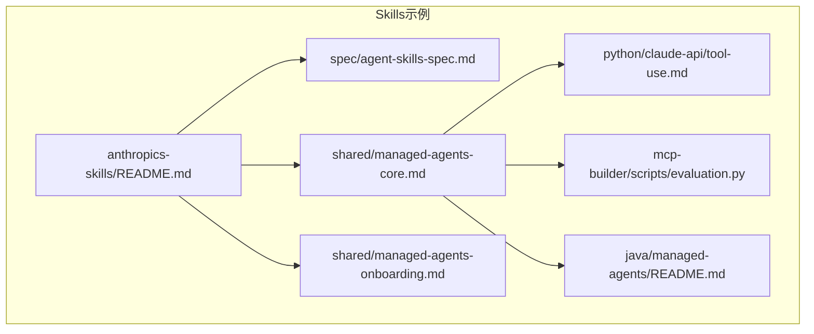
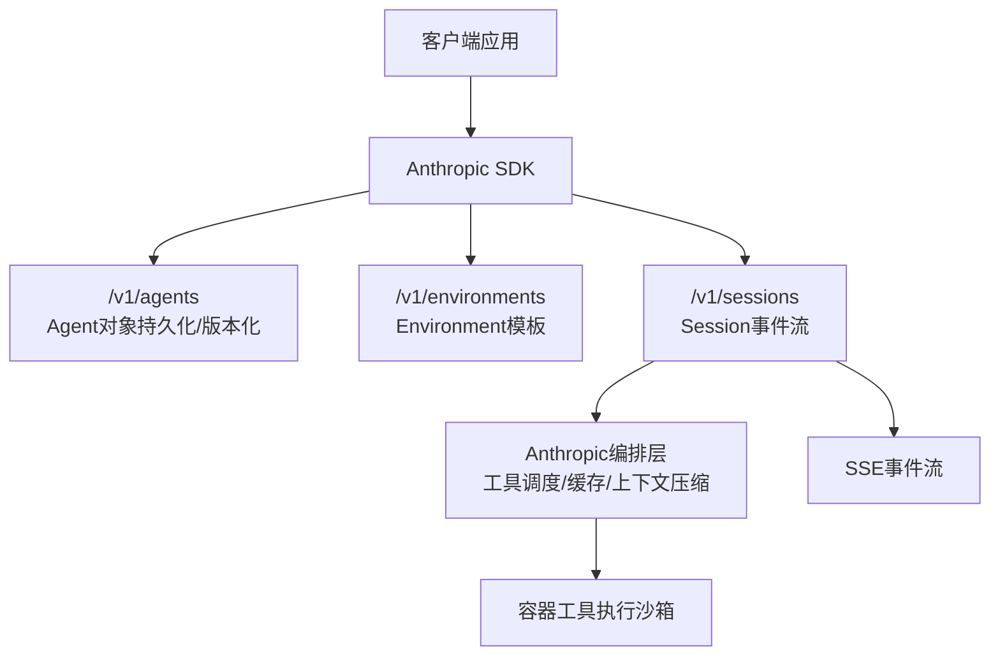
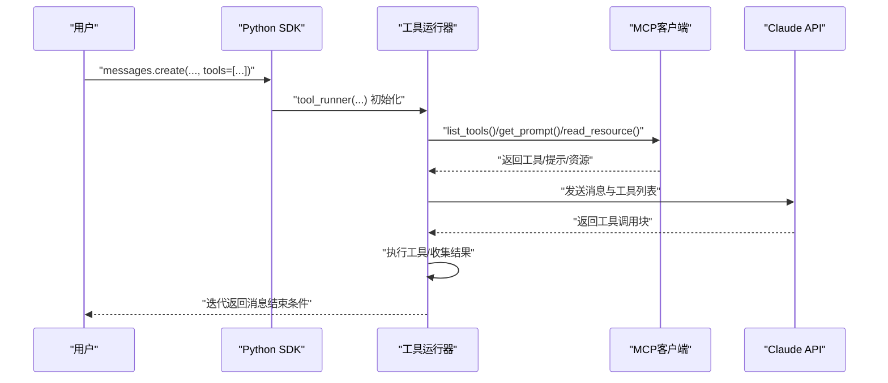
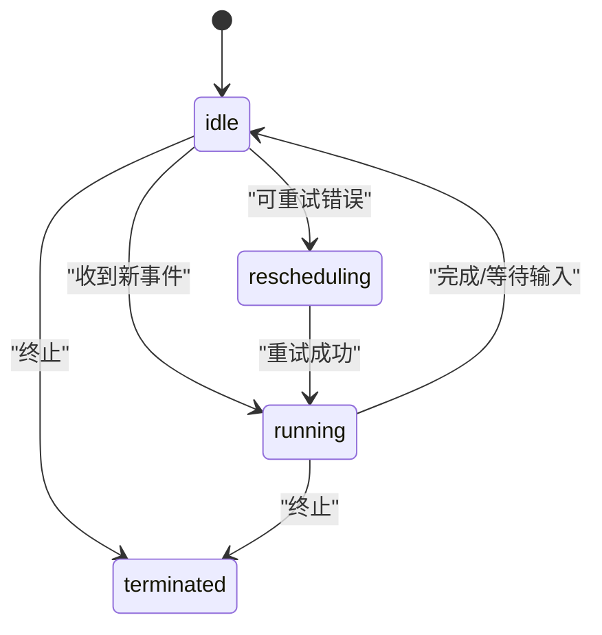
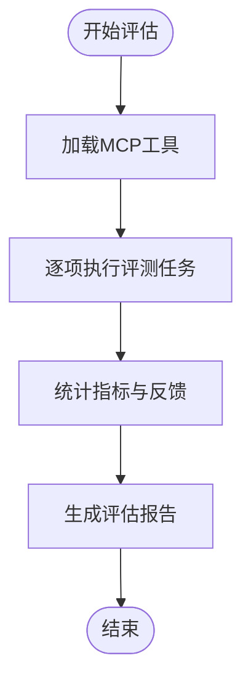
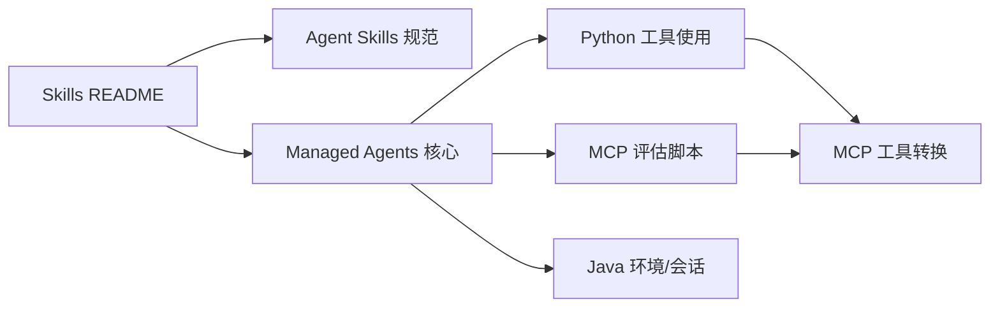

# Anthropic Skills集成

<cite>
**本文引用的文件**
- [README.md](file://skills/daoSkilLs/skills/anthropics-skills/README.md)
- [agent-skills-spec.md](file://skills/daoSkilLs/skills/anthropics-skills/spec/agent-skills-spec.md)
- [managed-agents-core.md](file://skills/daoSkilLs/skills/anthropics-skills/shared/managed-agents-core.md)
- [managed-agents-onboarding.md](file://skills/daoSkilLs/skills/anthropics-skills/shared/managed-agents-onboarding.md)
- [tool-use.md](file://skills/daoSkilLs/skills/anthropics-skills/python/claude-api/tool-use.md)
- [evaluation.py](file://skills/daoSkilLs/skills/mcp-builder/scripts/evaluation.py)
- [java/managed-agents/README.md](file://skills/daoSkilLs/skills/claude-api/java/managed-agents/README.md)
</cite>

## 目录
1. [简介](#简介)
2. [项目结构](#项目结构)
3. [核心组件](#核心组件)
4. [架构总览](#架构总览)
5. [详细组件分析](#详细组件分析)
6. [依赖分析](#依赖分析)
7. [性能考量](#性能考量)
8. [故障排除指南](#故障排除指南)
9. [结论](#结论)
10. [附录](#附录)

## 简介
本技术文档面向在DAO应用体系中集成Anthropic Skills与Managed Agents的工程团队，系统阐述以下内容：
- Claude API集成实现：SDK使用方法、API调用规范、认证机制与错误处理策略
- Managed Agents开发流程：代理创建、配置管理、工具使用与会话处理
- MCP（Model Context Protocol）服务器构建指南：FastMCP与MCP SDK的使用方法
- 多语言支持：Python、TypeScript、Java、Go、Ruby、C#、PHP的集成方案要点
- 实际集成案例与最佳实践：性能优化、安全考虑与故障排除

该文档以仓库中的Anthropic Skills示例为依据，结合Managed Agents与MCP Builder能力，提供从概念到落地的完整参考。

## 项目结构
本项目围绕“Skills”与“Managed Agents/MCP”两大主题组织：
- Skills示例：包含多种语言的Claude API工具使用、MCP工具转换、Managed Agents入门与核心概念
- MCP Builder：提供评估脚本与连接器，用于评测MCP服务器并驱动Claude进行工具调用
- Java示例：展示Managed Agents的环境与会话管理接口

图表来源
- [README.md:1-95](file://skills/daoSkilLs/skills/anthropics-skills/README.md#L1-L95)
- [agent-skills-spec.md:1-4](file://skills/daoSkilLs/skills/anthropics-skills/spec/agent-skills-spec.md#L1-L4)
- [managed-agents-core.md:1-217](file://skills/daoSkilLs/skills/anthropics-skills/shared/managed-agents-core.md#L1-L217)
- [managed-agents-onboarding.md:1-115](file://skills/daoSkilLs/skills/anthropics-skills/shared/managed-agents-onboarding.md#L1-L115)
- [tool-use.md:1-591](file://skills/daoSkilLs/skills/anthropics-skills/python/claude-api/tool-use.md#L1-L591)
- [evaluation.py:1-237](file://skills/daoSkilLs/skills/mcp-builder/scripts/evaluation.py#L1-L237)
- [java/managed-agents/README.md:268-288](file://skills/daoSkilLs/skills/claude-api/java/managed-agents/README.md#L268-L288)

章节来源
- [README.md:1-95](file://skills/daoSkilLs/skills/anthropics-skills/README.md#L1-L95)
- [agent-skills-spec.md:1-4](file://skills/daoSkilLs/skills/anthropics-skills/spec/agent-skills-spec.md#L1-L4)

## 核心组件
- Skills标准与示例：提供可复用的技能模板与示例，覆盖创意设计、开发测试、企业沟通与文档处理等场景
- Managed Agents：托管代理运行时，包含Agent对象（持久化、可版本化）、Session（有状态交互）、Environment（容器模板）与Container（工具执行沙箱）
- MCP工具链：通过MCP协议桥接第三方服务与本地工具，支持工具发现、提示与资源转换
- 多语言SDK：Python、TypeScript、Java、Go、Ruby、C#、PHP等语言的集成要点与示例路径

章节来源
- [README.md:12-27](file://skills/daoSkilLs/skills/anthropics-skills/README.md#L12-L27)
- [managed-agents-core.md:1-31](file://skills/daoSkilLs/skills/anthropics-skills/shared/managed-agents-core.md#L1-L31)
- [tool-use.md:1-591](file://skills/daoSkilLs/skills/anthropics-skills/python/claude-api/tool-use.md#L1-L591)

## 架构总览
下图展示了Managed Agents在Anthropic平台上的端到端架构：客户端通过SDK创建Agent与Environment，启动Session后进入事件流；工具在隔离容器中执行，由Anthropic编排层协调。

图表来源
- [managed-agents-core.md:14-27](file://skills/daoSkilLs/skills/anthropics-skills/shared/managed-agents-core.md#L14-L27)
- [managed-agents-core.md:67-90](file://skills/daoSkilLs/skills/anthropics-skills/shared/managed-agents-core.md#L67-L90)
- [managed-agents-core.md:141-159](file://skills/daoSkilLs/skills/anthropics-skills/shared/managed-agents-core.md#L141-L159)

## 详细组件分析

### Claude API集成与工具使用（Python）
- 工具运行器（推荐）：通过装饰器定义类型化工具，自动处理调用循环与结果回传
- MCP工具转换：将MCP工具、提示与资源转换为Claude API可用形式，支持本地MCP服务器与资源上传
- 手动工具循环：适用于需要细粒度控制的场景（自定义日志、条件执行、人工确认）
- 结果处理与错误标记：工具结果可标记为错误，便于后续重试或补偿
- 代码执行：内置代码执行工具，支持文件上传、容器复用与输出文件下载
- 内存工具：通过抽象基类扩展，实现偏好记忆与知识存储
- 结构化输出：支持JSON Schema与Pydantic模型解析，确保输出格式一致性

图表来源
- [tool-use.md:5-49](file://skills/daoSkilLs/skills/anthropics-skills/python/claude-api/tool-use.md#L5-L49)
- [tool-use.md:52-128](file://skills/daoSkilLs/skills/anthropics-skills/python/claude-api/tool-use.md#L52-L128)

章节来源
- [tool-use.md:1-591](file://skills/daoSkilLs/skills/anthropics-skills/python/claude-api/tool-use.md#L1-L591)

### Managed Agents开发流程
- 架构四要素：Agent（持久化/版本化）、Session（有状态事件流）、Environment（容器模板）、Container（工具执行）
- 生命周期：先创建Agent，再创建Session；Agent更新产生新版本，Session可固定版本以保证可复现
- 会话状态机：idle → running ↔ idle → terminated；错误以事件形式在流中呈现
- 环境与会话管理：支持环境查询、归档、删除；支持会话查询、更新、归档与删除
- 入门流程：通过引导对话帮助用户从“已知需求”或“模式探索”开始，分轮次配置工具、技能、文件与环境

图表来源
- [managed-agents-core.md:33-48](file://skills/daoSkilLs/skills/anthropics-skills/shared/managed-agents-core.md#L33-L48)

章节来源
- [managed-agents-core.md:1-217](file://skills/daoSkilLs/skills/anthropics-skills/shared/managed-agents-core.md#L1-L217)
- [managed-agents-onboarding.md:1-115](file://skills/daoSkilLs/skills/anthropics-skills/shared/managed-agents-onboarding.md#L1-L115)
- [java/managed-agents/README.md:268-288](file://skills/daoSkilLs/skills/claude-api/java/managed-agents/README.md#L268-L288)

### MCP（Model Context Protocol）服务器构建与评估
- MCP工具转换：将MCP工具注入Claude工具集，支持异步/同步工具包装、提示与资源转换
- 评估脚本：基于Claude对MCP服务器进行评测，统计准确率、平均耗时、工具调用次数，并生成报告
- 连接器：提供连接MCP服务器的通用方法，支持不同语言与运行时

图表来源
- [evaluation.py:220-237](file://skills/daoSkilLs/skills/mcp-builder/scripts/evaluation.py#L220-L237)

章节来源
- [tool-use.md:52-128](file://skills/daoSkilLs/skills/anthropics-skills/python/claude-api/tool-use.md#L52-L128)
- [evaluation.py:1-237](file://skills/daoSkilLs/skills/mcp-builder/scripts/evaluation.py#L1-L237)

### 多语言支持集成要点
- Python：推荐使用工具运行器；支持MCP工具转换、代码执行、内存工具与结构化输出
- TypeScript：遵循与Python一致的工具与会话模式，注意类型声明与异步处理
- Java：提供环境与会话管理示例，适合在JVM生态中集成Managed Agents
- Go/Ruby/C#/PHP：可在各自生态中通过HTTP客户端或官方SDK对接Anthropic API；建议参考Python/TypeScript示例的工具与会话模式，结合语言特性实现类型安全与错误处理

章节来源
- [tool-use.md:1-591](file://skills/daoSkilLs/skills/anthropics-skills/python/claude-api/tool-use.md#L1-L591)
- [managed-agents-onboarding.md:99-115](file://skills/daoSkilLs/skills/anthropics-skills/shared/managed-agents-onboarding.md#L99-L115)
- [java/managed-agents/README.md:268-288](file://skills/daoSkilLs/skills/claude-api/java/managed-agents/README.md#L268-L288)

## 依赖分析
- 技能与示例：Skills README指向Agent Skills规范与模板；Managed Agents核心文档为工具与会话实现提供基础
- MCP工具链：Python示例依赖MCP SDK与Anthropic MCP工具包；评估脚本依赖Anthropic SDK与连接器
- 多语言SDK：各语言SDK遵循统一的API契约，工具与会话模式一致，差异主要体现在类型系统与并发模型

图表来源
- [README.md:12-27](file://skills/daoSkilLs/skills/anthropics-skills/README.md#L12-L27)
- [agent-skills-spec.md:1-4](file://skills/daoSkilLs/skills/anthropics-skills/spec/agent-skills-spec.md#L1-L4)
- [managed-agents-core.md:1-31](file://skills/daoSkilLs/skills/anthropics-skills/shared/managed-agents-core.md#L1-L31)
- [tool-use.md:52-128](file://skills/daoSkilLs/skills/anthropics-skills/python/claude-api/tool-use.md#L52-L128)
- [evaluation.py:1-237](file://skills/daoSkilLs/skills/mcp-builder/scripts/evaluation.py#L1-L237)
- [java/managed-agents/README.md:268-288](file://skills/daoSkilLs/skills/claude-api/java/managed-agents/README.md#L268-L288)

章节来源
- [README.md:12-27](file://skills/daoSkilLs/skills/anthropics-skills/README.md#L12-L27)
- [agent-skills-spec.md:1-4](file://skills/daoSkilLs/skills/anthropics-skills/spec/agent-skills-spec.md#L1-L4)
- [managed-agents-core.md:1-31](file://skills/daoSkilLs/skills/anthropics-skills/shared/managed-agents-core.md#L1-L31)
- [tool-use.md:52-128](file://skills/daoSkilLs/skills/anthropics-skills/python/claude-api/tool-use.md#L52-L128)
- [evaluation.py:1-237](file://skills/daoSkilLs/skills/mcp-builder/scripts/evaluation.py#L1-L237)
- [java/managed-agents/README.md:268-288](file://skills/daoSkilLs/skills/claude-api/java/managed-agents/README.md#L268-L288)

## 性能考量
- 上下文压缩与提示缓存：在会话接近最大上下文时自动压缩历史，减少延迟与成本
- 延伸思考：默认开启，通过事件流返回中间推理过程，便于可观测性与调试
- 容器复用：代码执行支持复用容器，降低冷启动开销
- 工具批量结果：一次性提交多个工具结果，减少往返次数
- 版本化与可复现：固定Agent版本可避免因配置漂移导致的性能波动

章节来源
- [managed-agents-core.md:50-55](file://skills/daoSkilLs/skills/anthropics-skills/shared/managed-agents-core.md#L50-L55)
- [tool-use.md:362-384](file://skills/daoSkilLs/skills/anthropics-skills/python/claude-api/tool-use.md#L362-L384)

## 故障排除指南
- 错误事件流：会话错误以事件形式出现在流中，而非直接作为状态值；需在事件流处理中捕获并上报
- 可重试错误：遇到可重试错误时会进入重调度状态，稍后由编排系统恢复
- 工具错误标记：工具结果可标记为错误，便于后续补偿或重试
- 资源挂载失败：会话创建会阻塞直到资源挂载完成；若挂载失败，检查资源ID与权限
- MCP工具不可转换：当MCP值类型不受支持时抛出异常，需在上层进行降级或提示

章节来源
- [managed-agents-core.md:46-48](file://skills/daoSkilLs/skills/anthropics-skills/shared/managed-agents-core.md#L46-L48)
- [tool-use.md:257-266](file://skills/daoSkilLs/skills/anthropics-skills/python/claude-api/tool-use.md#L257-L266)
- [evaluation.py:1-237](file://skills/daoSkilLs/skills/mcp-builder/scripts/evaluation.py#L1-L237)

## 结论
通过本技术文档，团队可以基于Anthropic Skills与Managed Agents快速搭建具备工具调用、MCP集成与多语言支持的智能体系统。建议优先采用工具运行器简化开发，结合MCP评估脚本验证工具质量，并通过版本化与事件流保障可维护性与可观测性。

## 附录
- Agent Skills规范地址：[Agent Skills Spec](https://agentskills.io/specification)
- Skills示例与模板：参见Skills根目录README与template目录
- Managed Agents核心与入门：参见shared目录下的核心与入门文档
- MCP工具转换与评估：参见Python工具使用与MCP Builder评估脚本