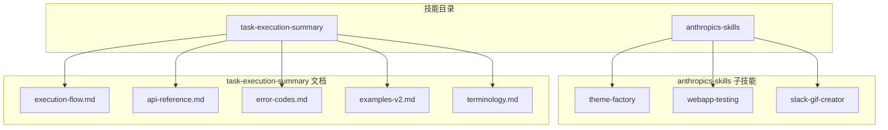
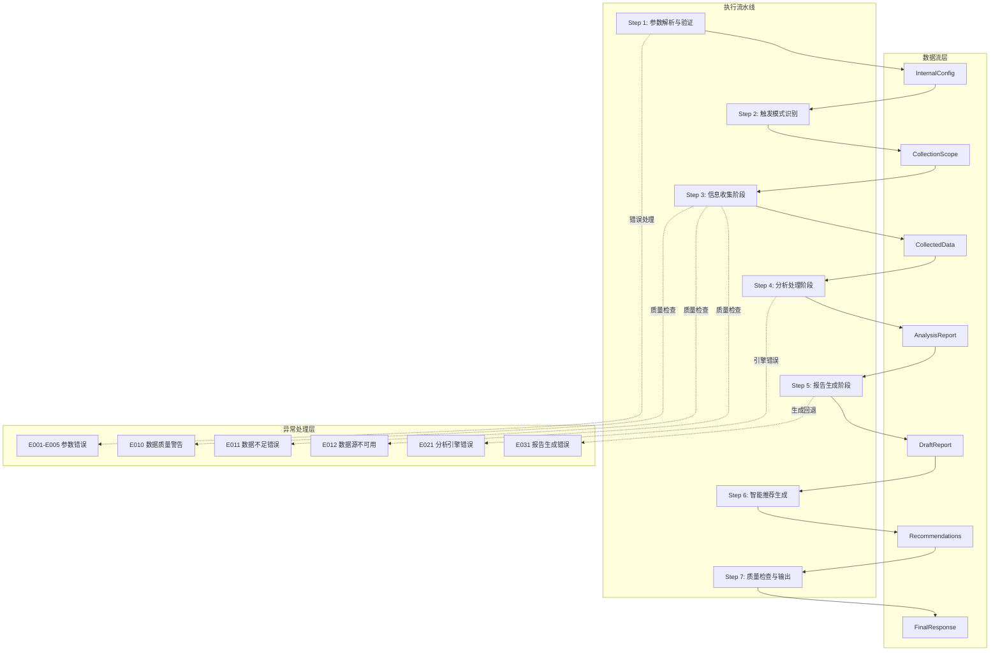
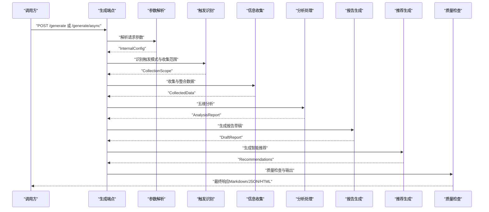
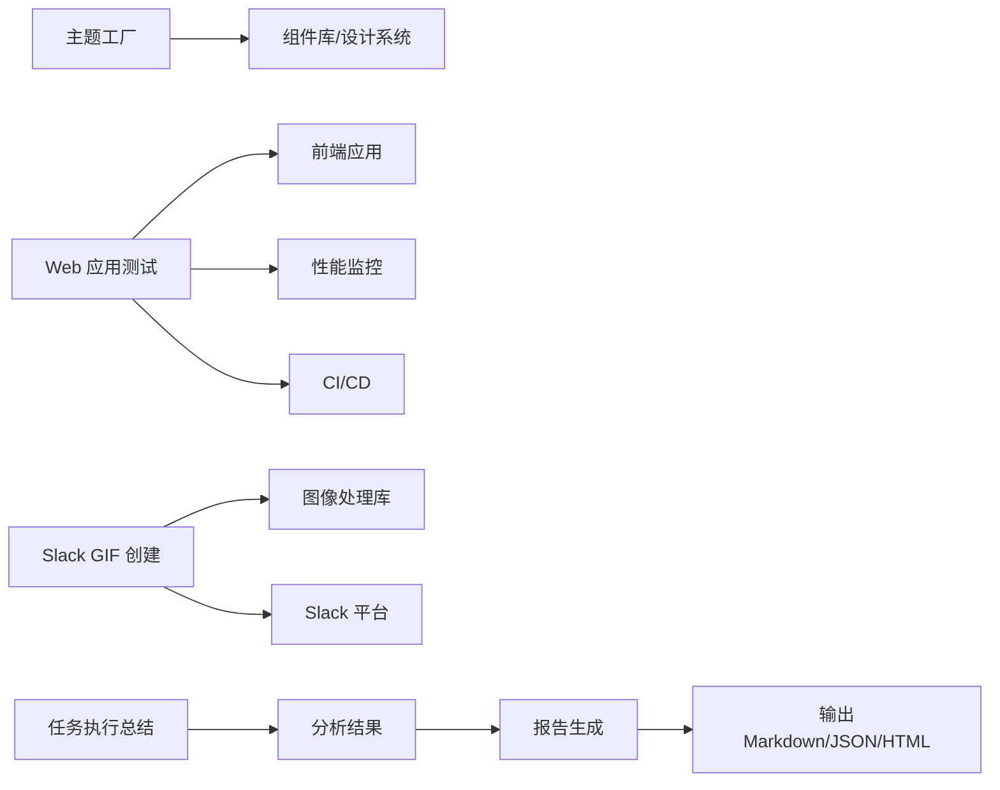

# 专用技能集合

<cite>
**本文引用的文件**
- [execution-flow.md](file://skills/daoSkilLs/skills/task-execution-summary/references/execution-flow.md)
- [api-reference.md](file://skills/daoSkilLs/skills/task-execution-summary/references/api-reference.md)
- [examples-v2.md](file://skills/daoSkilLs/skills/task-execution-summary/references/examples-v2.md)
- [error-codes.md](file://skills/daoSkilLs/skills/task-execution-summary/references/error-codes.md)
- [terminology.md](file://skills/daoSkilLs/skills/task-execution-summary/references/terminology.md)
- [SKILL.md](file://skills/daoSkilLs/skills/anthropics-skills/skills/theme-factory/SKILL.md)
- [SKILL.md](file://skills/daoSkilLs/skills/anthropics-skills/skills/slack-gif-creator/SKILL.md)
- [SKILL.md](file://skills/daoSkilLs/skills/anthropics-skills/skills/webapp-testing/SKILL.md)
</cite>

## 目录
1. [简介](#简介)
2. [项目结构](#项目结构)
3. [核心组件](#核心组件)
4. [架构总览](#架构总览)
5. [详细组件分析](#详细组件分析)
6. [依赖分析](#依赖分析)
7. [性能考量](#性能考量)
8. [故障排查指南](#故障排查指南)
9. [结论](#结论)
10. [附录](#附录)

## 简介
本文件为“专用技能集合”的技术文档，聚焦以下三项专用技能：
- 任务执行总结报告生成器：提供结构化报告生成、多章节模板系统与不同详细程度的输出选项。
- 主题工厂：负责主题创建、颜色搭配、字体选择与视觉设计原则。
- Web 应用测试：涵盖自动化测试、性能测试与用户体验测试方法。
此外，文档还介绍 Slack GIF 创建技能与任务执行总结技能的协同使用与最佳实践。

## 项目结构
本仓库中与技能相关的资料主要位于 skills/daoSkilLs/skills 下，其中：
- anthropics-skills：包含主题工厂、Web 应用测试、Slack GIF 创建等技能的说明与实现入口。
- task-execution-summary：包含执行流程、API 参考、错误码、术语表与示例等技术文档。

**图表来源**
- [execution-flow.md](file://skills/daoSkilLs/skills/task-execution-summary/references/execution-flow.md)
- [api-reference.md](file://skills/daoSkilLs/skills/task-execution-summary/references/api-reference.md)
- [SKILL.md](file://skills/daoSkilLs/skills/anthropics-skills/skills/theme-factory/SKILL.md)
- [SKILL.md](file://skills/daoSkilLs/skills/anthropics-skills/skills/webapp-testing/SKILL.md)
- [SKILL.md](file://skills/daoSkilLs/skills/anthropics-skills/skills/slack-gif-creator/SKILL.md)

**章节来源**
- [execution-flow.md](file://skills/daoSkilLs/skills/task-execution-summary/references/execution-flow.md)
- [api-reference.md](file://skills/daoSkilLs/skills/task-execution-summary/references/api-reference.md)

## 核心组件
- 任务执行总结报告生成器：以“确定性、可观测性、容错性”为设计原则，通过参数解析、触发模式识别、信息收集、分析处理、报告生成、智能推荐与质量检查七个阶段，输出结构化报告与质量度量。
- 主题工厂：提供主题创建、颜色搭配、字体选择与视觉设计原则，支持多场景主题定制。
- Web 应用测试：提供自动化测试、性能测试与用户体验测试方法，覆盖端到端流程与性能指标。
- Slack GIF 创建：实现动画制作、帧合成与格式转换，满足动态内容创作需求。

**章节来源**
- [execution-flow.md](file://skills/daoSkilLs/skills/task-execution-summary/references/execution-flow.md)
- [api-reference.md](file://skills/daoSkilLs/skills/task-execution-summary/references/api-reference.md)
- [SKILL.md](file://skills/daoSkilLs/skills/anthropics-skills/skills/theme-factory/SKILL.md)
- [SKILL.md](file://skills/daoSkilLs/skills/anthropics-skills/skills/webapp-testing/SKILL.md)
- [SKILL.md](file://skills/daoSkilLs/skills/anthropics-skills/skills/slack-gif-creator/SKILL.md)

## 架构总览
任务执行总结报告生成器的执行架构分为三层：执行流水线、数据流层与异常处理层。七步流程串联参数解析、触发识别、信息收集、分析处理、报告生成、推荐生成与质量检查，并以统一的内部配置对象与结构化数据模型贯穿始终。

**图表来源**
- [execution-flow.md](file://skills/daoSkilLs/skills/task-execution-summary/references/execution-flow.md)

**章节来源**
- [execution-flow.md](file://skills/daoSkilLs/skills/task-execution-summary/references/execution-flow.md)

## 详细组件分析

### 任务执行总结报告生成器
- 设计原则
  - 确定性：统一内部配置对象、类型化数据模型与阈值驱动的决策，确保相同输入产生可复现输出。
  - 可观测性：记录每个步骤的输入/输出、中间数据对象序列化与质量指标追踪，支持逐步调试与持续监控。
  - 容错性：区分致命错误与非致命异常，支持降级运行与带警告的成功响应。
- 执行流程
  - Step 1：参数解析与验证，支持结构化 JSON/YAML、自然语言与快捷命令，应用默认值并构建 InternalConfig。
  - Step 2：触发模式识别，自动/手动/命令行触发，确认信息收集范围与时间窗口。
  - Step 3：信息收集，多数据源适配、信息抽取、数据整合与质量检查，输出结构化 CollectedData。
  - Step 4：分析处理，五维分析引擎（目标达成度、时间效能、资源利用率、问题模式、协作效果）。
  - Step 5：报告生成，按模板与详细程度生成结构化报告草稿。
  - Step 6：智能推荐生成，结合分析结果生成改进建议。
  - Step 7：质量检查与输出，输出最终响应与质量度量。
- 性能基线
  - 总耗时约 2-8 分钟（受对话轮数与详细程度影响），信息收集与分析处理为主要瓶颈。
- API 与配置
  - 提供同步/异步生成端点、模板查询与参数验证端点；支持详细程度、模板变体、章节包含/排除、语言风格、焦点维度与输出格式等配置。
  - 输出包含报告正文、元数据、质量检查、统计指标与文件信息。

**图表来源**
- [execution-flow.md](file://skills/daoSkilLs/skills/task-execution-summary/references/execution-flow.md)
- [api-reference.md](file://skills/daoSkilLs/skills/task-execution-summary/references/api-reference.md)

**章节来源**
- [execution-flow.md](file://skills/daoSkilLs/skills/task-execution-summary/references/execution-flow.md)
- [api-reference.md](file://skills/daoSkilLs/skills/task-execution-summary/references/api-reference.md)

### 主题工厂
- 功能概述
  - 主题创建：根据业务场景与品牌要求生成统一主题。
  - 颜色搭配：提供主色、辅色、强调色与禁用/危险色的搭配建议与对比度准则。
  - 字体选择：基于可读性与品牌调性选择字体族、字号与字重。
  - 视觉设计原则：统一间距、阴影、圆角、边框与图标风格，确保跨页面一致性。
- 使用场景
  - 新产品上线前的品牌视觉统一。
  - 团队协作中的设计系统落地与规范执行。
  - 快速搭建原型或演示页面的视觉骨架。
- 配置选项
  - 主题类型（如科技蓝、商务灰、活力橙）。
  - 字体族与字号体系（标题、正文、辅助信息）。
  - 颜色变量（主色、次色、强调色、语义色）。
  - 视觉层级（阴影、圆角、边框宽度与样式）。
- 扩展方法
  - 基于现有主题生成衍生主题（如深色/浅色模式）。
  - 与组件库集成，将主题变量注入 CSS 变量或设计令牌系统。
  - 通过自动化脚本批量生成多套主题以适配不同业务线。

**章节来源**
- [SKILL.md](file://skills/daoSkilLs/skills/anthropics-skills/skills/theme-factory/SKILL.md)

### Web 应用测试
- 自动化测试
  - 端到端测试：覆盖用户关键路径（登录、下单、支付、退款），确保流程闭环。
  - 单元/集成测试：针对核心模块（支付、订单、用户中心）进行隔离验证。
  - 测试数据管理：使用可复用的 Mock 数据与数据库快照，保障测试稳定性。
- 性能测试
  - 基准测试：在不同并发下测量响应时间、吞吐量与错误率。
  - 瓶颈分析：定位数据库、缓存与网络请求的性能瓶颈。
  - 回归测试：将性能指标纳入 CI，防止回归。
- 用户体验测试
  - 可用性评估：邀请真实用户完成任务，记录时间、错误率与满意度。
  - 可访问性测试：确保色盲、键盘导航与屏幕阅读器友好。
  - A/B 测试：对新功能或界面变更进行小流量验证，基于指标决策是否全量。
- 使用场景
  - 产品迭代发布前的全链路验证。
  - 高峰期压测与容量规划。
  - 新功能上线后的持续监控与优化。
- 配置选项
  - 测试环境（本地/预发/线上）与目标浏览器。
  - 并发策略、超时阈值与重试策略。
  - 报告格式（HTML/JSON/XML）与通知渠道。
- 扩展方法
  - 与 CI/CD 集成，自动触发测试并生成报告。
  - 基于性能基线建立告警阈值，异常自动阻断发布。
  - 引入可视化测试录制与回放工具，降低手工测试成本。

**章节来源**
- [SKILL.md](file://skills/daoSkilLs/skills/anthropics-skills/skills/webapp-testing/SKILL.md)

### Slack GIF 创建
- 动画制作
  - 帧素材准备：统一分辨率与帧率，确保时序对齐。
  - 关键帧设计：突出动作转折点，减少中间帧数量以控制体积。
- 帧合成
  - 图层管理：背景、前景与特效分层，便于后期调整。
  - 过渡效果：淡入淡出、缩放与平移，增强流畅度。
- 格式转换
  - 输出格式：GIF（兼容性佳）与 AVI/WebM（体积更小）。
  - 压缩策略：色彩桶数量、抖动与渐变优化，平衡画质与体积。
- 使用场景
  - 团队沟通中的动态反馈（如进度提醒、庆祝动画）。
  - 社区运营中的互动内容（节日祝福、活动宣传）。
- 配置选项
  - 分辨率、帧率与循环次数。
  - 压缩质量与输出尺寸上限。
- 扩展方法
  - 批量处理：将多段动画合并为长图或序列帧。
  - 模板化：提供常用模板（欢迎、结束、失败）以提升效率。
  - 与工作流集成：在 CI 中自动生成 GIF 并上传至 Slack。

**章节来源**
- [SKILL.md](file://skills/daoSkilLs/skills/anthropics-skills/skills/slack-gif-creator/SKILL.md)

### 技能协同与组合应用最佳实践
- 任务执行总结 + 主题工厂
  - 在生成报告后，使用主题工厂统一报告的视觉风格（颜色、字体、排版），提升可读性与品牌一致性。
- 任务执行总结 + Web 应用测试
  - 将测试结果与问题模式分析结合，生成“测试复盘报告”，指导后续测试策略与回归计划。
- 任务执行总结 + Slack GIF 创建
  - 将关键结论与建议以 GIF 动态呈现，便于在 Slack 中快速传播与讨论。
- 组合应用建议
  - 明确触发条件：如“测试完成后自动触发总结生成”，并在总结中引用测试报告链接。
  - 保持输出一致性：统一语言风格与章节结构，避免信息割裂。
  - 建立回溯机制：为每次生成的报告附带元数据与校验信息，便于审计与溯源。

**章节来源**
- [execution-flow.md](file://skills/daoSkilLs/skills/task-execution-summary/references/execution-flow.md)
- [api-reference.md](file://skills/daoSkilLs/skills/task-execution-summary/references/api-reference.md)
- [SKILL.md](file://skills/daoSkilLs/skills/anthropics-skills/skills/theme-factory/SKILL.md)
- [SKILL.md](file://skills/daoSkilLs/skills/anthropics-skills/skills/webapp-testing/SKILL.md)
- [SKILL.md](file://skills/daoSkilLs/skills/anthropics-skills/skills/slack-gif-creator/SKILL.md)

## 依赖分析
- 任务执行总结报告生成器
  - 内部依赖：InternalConfig → CollectionScope → CollectedData → AnalysisReport → DraftReport → Recommendations → FinalResponse。
  - 异常依赖：错误码体系贯穿各阶段，形成统一的容错与回退策略。
- 主题工厂
  - 依赖设计系统（颜色、字体、间距）与组件库（按钮、表单、导航）。
- Web 应用测试
  - 依赖测试框架（端到端/单元）、性能监控工具与 CI 系统。
- Slack GIF 创建
  - 依赖图像处理库与格式转换工具，遵循平台兼容性要求。

**图表来源**
- [execution-flow.md](file://skills/daoSkilLs/skills/task-execution-summary/references/execution-flow.md)
- [api-reference.md](file://skills/daoSkilLs/skills/task-execution-summary/references/api-reference.md)
- [SKILL.md](file://skills/daoSkilLs/skills/anthropics-skills/skills/theme-factory/SKILL.md)
- [SKILL.md](file://skills/daoSkilLs/skills/anthropics-skills/skills/webapp-testing/SKILL.md)
- [SKILL.md](file://skills/daoSkilLs/skills/anthropics-skills/skills/slack-gif-creator/SKILL.md)

**章节来源**
- [execution-flow.md](file://skills/daoSkilLs/skills/task-execution-summary/references/execution-flow.md)
- [api-reference.md](file://skills/daoSkilLs/skills/task-execution-summary/references/api-reference.md)

## 性能考量
- 任务执行总结
  - 信息收集与分析处理为主要耗时环节，建议在复杂任务中使用异步生成与分片处理。
  - 通过章节选择与详细程度控制输出规模，平衡生成时间与信息密度。
- 主题工厂
  - 设计系统缓存与增量编译可显著降低主题生成时间。
- Web 应用测试
  - 合理设置并发与超时，避免测试环境过载；将性能基线纳入 CI，及时发现回归。
- Slack GIF 创建
  - 控制帧数与分辨率，采用渐进式压缩与抖动策略，在画质与体积间取得平衡。

[本节为通用性能建议，无需特定文件引用]

## 故障排查指南
- 任务执行总结
  - 参数错误（E001-E005）：检查必填参数、类型与取值范围，参考错误码索引与示例。
  - 数据质量警告（E010）：关注覆盖率与缺失项，选择降级继续或补充信息。
  - 数据不足（E011）：提供更明确的时间范围与任务边界，或增加数据源。
  - 数据源不可用（E012）：检查数据源连通性与权限。
  - 分析引擎错误（E021）：检查输入数据完整性与格式，必要时降级分析维度。
  - 报告生成错误（E031）：回退到简化模板，检查模板与变量绑定。
- 主题工厂
  - 颜色对比度不足：调整主色与文本色的明暗差，确保可读性。
  - 字体加载失败：确认字体文件路径与跨域策略。
- Web 应用测试
  - 端到端失败：检查页面元素选择器与等待策略，复现并缩小问题范围。
  - 性能波动：对比基准数据，定位数据库慢查询或网络抖动。
- Slack GIF 创建
  - 导出失败：检查帧素材完整性与格式支持，确认输出尺寸与压缩参数。

**章节来源**
- [error-codes.md](file://skills/daoSkilLs/skills/task-execution-summary/references/error-codes.md)
- [execution-flow.md](file://skills/daoSkilLs/skills/task-execution-summary/references/execution-flow.md)

## 结论
专用技能集合围绕“确定性、可观测性、容错性”的设计原则，提供了从任务总结、主题设计到测试与动态内容创作的完整能力谱系。通过统一的配置体系与可扩展的执行流程，既能满足日常复盘与知识沉淀，也能支撑复杂项目的系统化治理与品牌化输出。建议在实际落地中结合团队流程与工具链，持续优化生成质量与交付效率。

[本节为总结性内容，无需特定文件引用]

## 附录
- 术语表
  - 任务类型：开发、管理、运维、研究、学习等，影响分析维度权重与模板选择。
  - 详细程度：摘要版、标准版、详细版，分别对应不同的章节完整度与分析深度。
  - 模板变体：通用模板、学习模板等，用于适配不同场景的主题表达。
- 示例
  - 参考示例文档，了解最小调用、标准调用与完全配置调用的参数组合与预期结果。

**章节来源**
- [terminology.md](file://skills/daoSkilLs/skills/task-execution-summary/references/terminology.md)
- [examples-v2.md](file://skills/daoSkilLs/skills/task-execution-summary/references/examples-v2.md)