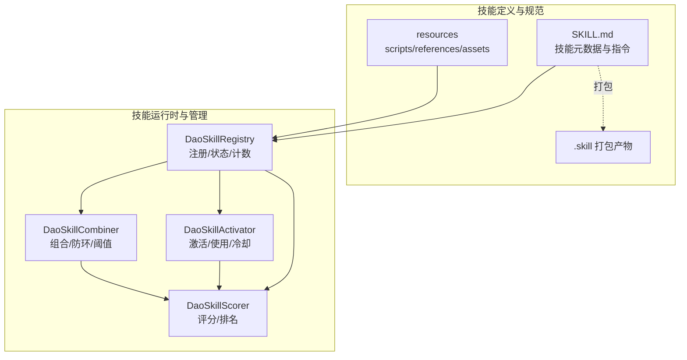
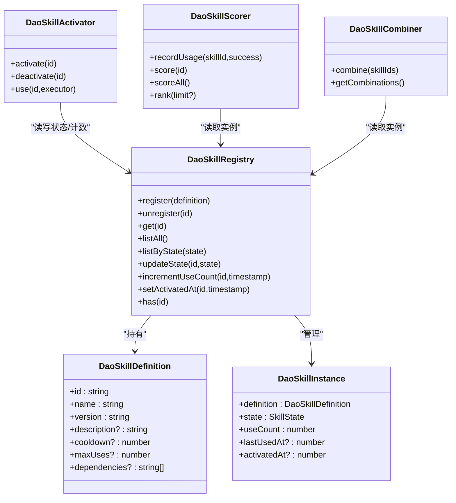
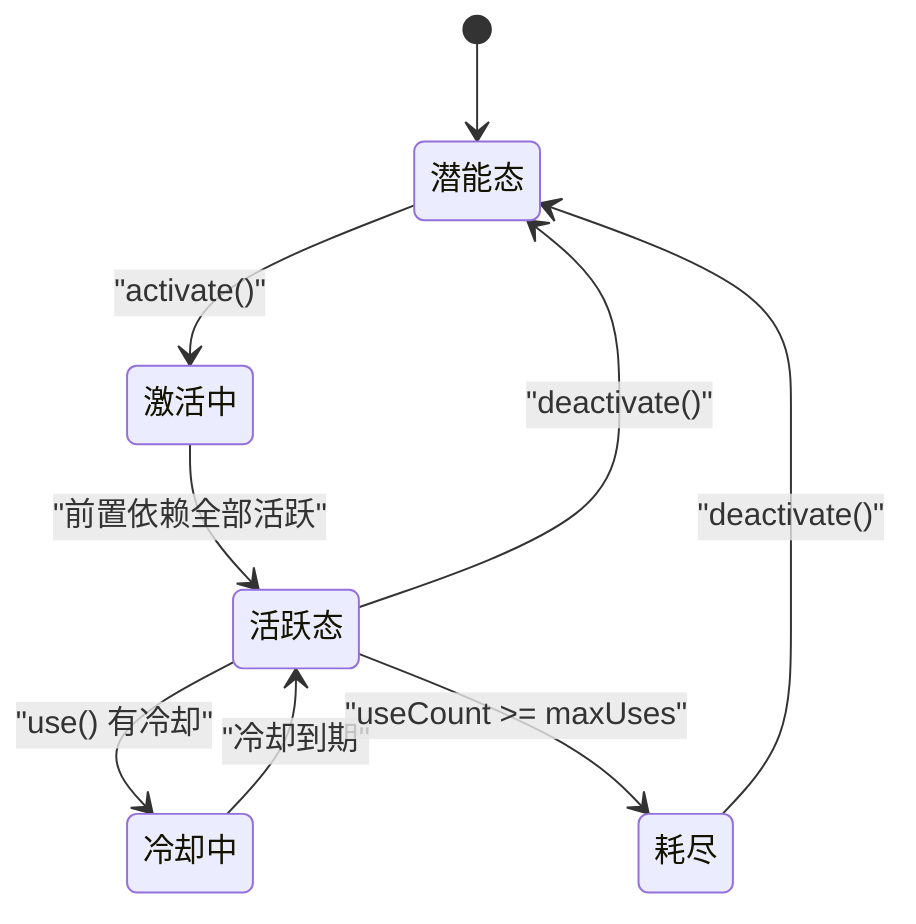
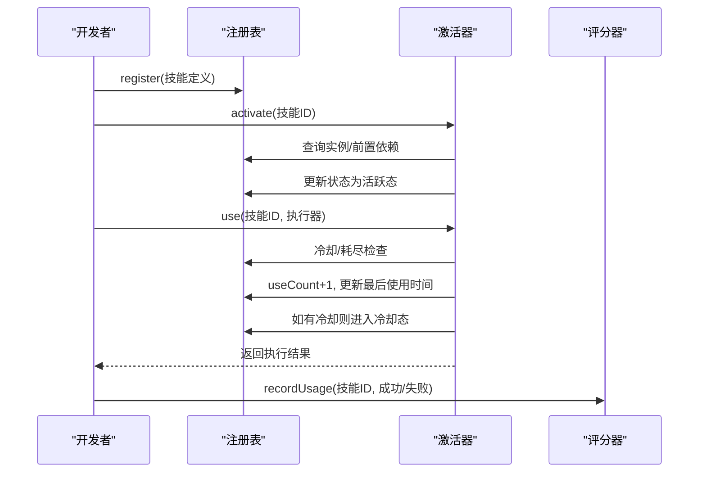
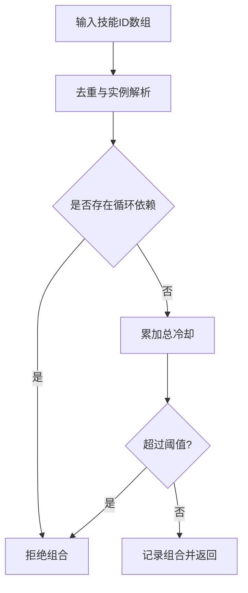
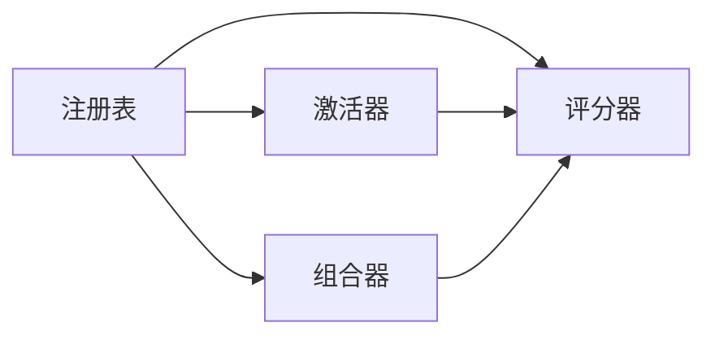

# 技能架构设计

<cite>
**本文引用的文件**
- [types.ts](file://apps/DaoMind/packages/daoSkilLs/src/types.ts)
- [skill-registry.ts](file://apps/DaoMind/packages/daoSkilLs/src/skill-registry.ts)
- [skill-activator.ts](file://apps/DaoMind/packages/daoSkilLs/src/skill-activator.ts)
- [scorer.ts](file://apps/DaoMind/packages/daoSkilLs/src/scorer.ts)
- [combiner.ts](file://apps/DaoMind/packages/daoSkilLs/src/combiner.ts)
- [index.ts](file://apps/DaoMind/packages/daoSkilLs/src/index.ts)
- [README.md](file://skills/daoSkilLs/skills/anthropics-skills/README.md)
- [SKILL.md（模板）](file://skills/daoSkilLs/skills/anthropics-skills/template/SKILL.md)
- [SKILL.md（技能创建器）](file://skills/daoSkilLs/skills/anthropics-skills/skills/skill-creator/SKILL.md)
- [execution-flow.md](file://skills/daoSkilLs/skills/task-execution-summary/references/execution-flow.md)
- [schemas.md](file://skills/daoSkilLs/skills/anthropics-skills/skills/skill-creator/references/schemas.md)
- [package_skill.py](file://skills/daoSkilLs/skills/anthropics-skills/skills/skill-creator/scripts/package_skill.py)
- [package.json（@daomind/skills）](file://apps/DaoMind/packages/daoSkilLs/package.json)
- [registry.py（flexloop测试技能注册）](file://tools/flexloop/src/taolib/testing/multi_agent/skills/registry.py)
</cite>

## 目录
1. [简介](#简介)
2. [项目结构](#项目结构)
3. [核心组件](#核心组件)
4. [架构总览](#架构总览)
5. [详细组件分析](#详细组件分析)
6. [依赖分析](#依赖分析)
7. [性能考量](#性能考量)
8. [故障排查指南](#故障排查指南)
9. [结论](#结论)
10. [附录](#附录)

## 简介
本文件面向DAOApps技能架构设计，系统阐述DAOApps技能系统的模块化理念、插件/技能系统架构、技能生命周期管理机制，以及技能注册、加载、执行与卸载的全流程。文档同时给出技能目录结构规范、文件组织方式与命名约定，技能开发框架的核心概念（接口定义、配置管理、错误处理与性能优化策略），并展示系统的扩展性与向后兼容性保障。

## 项目结构
DAOApps技能系统由“技能定义与运行时”两大部分组成：
- 技能定义与规范：以Markdown技能包（SKILL.md + 可选资源）为核心，遵循渐进披露与领域组织原则，支持按需加载与可移植打包。
- 技能运行时与管理：以TypeScript实现的技能注册表、激活器、评分器与组合器为核心，提供生命周期控制、依赖校验、冷却与耗尽管理、使用统计与评分、组合防环校验与总冷却阈值控制。

图示来源
- [types.ts:1-44](file://apps/DaoMind/packages/daoSkilLs/src/types.ts#L1-L44)
- [skill-registry.ts:1-72](file://apps/DaoMind/packages/daoSkilLs/src/skill-registry.ts#L1-L72)
- [skill-activator.ts:1-82](file://apps/DaoMind/packages/daoSkilLs/src/skill-activator.ts#L1-L82)
- [scorer.ts:1-81](file://apps/DaoMind/packages/daoSkilLs/src/scorer.ts#L1-L81)
- [combiner.ts:1-84](file://apps/DaoMind/packages/daoSkilLs/src/combiner.ts#L1-L84)
- [SKILL.md（模板）:1-7](file://skills/daoSkilLs/skills/anthropics-skills/template/SKILL.md#L1-L7)
- [package_skill.py:42-136](file://skills/daoSkilLs/skills/anthropics-skills/skills/skill-creator/scripts/package_skill.py#L42-L136)

章节来源
- [README.md:1-95](file://skills/daoSkilLs/skills/anthropics-skills/README.md#L1-L95)
- [SKILL.md（模板）:1-7](file://skills/daoSkilLs/skills/anthropics-skills/template/SKILL.md#L1-L7)
- [SKILL.md（技能创建器）:86-117](file://skills/daoSkilLs/skills/anthropics-skills/skills/skill-creator/SKILL.md#L86-L117)
- [package.json（@daomind/skills）:1-1](file://apps/DaoMind/packages/daoSkilLs/package.json#L1-L1)

## 核心组件
- 技能类型与状态
  - 技能标识、状态枚举、定义与实例接口，定义技能边界与行为契约。
- 技能注册表
  - 提供注册、注销、查询、状态更新、使用计数与激活时间记录等能力。
- 技能激活器
  - 负责技能激活（前置依赖校验）、使用（冷却与耗尽检查、计数与状态更新）、去激活。
- 技能评分器
  - 基于使用统计与配置计算综合评分，支持排名与筛选。
- 技能组合器
  - 组合多个技能形成协同能力，进行循环依赖检测与总冷却阈值控制。

章节来源
- [types.ts:1-44](file://apps/DaoMind/packages/daoSkilLs/src/types.ts#L1-L44)
- [skill-registry.ts:1-72](file://apps/DaoMind/packages/daoSkilLs/src/skill-registry.ts#L1-L72)
- [skill-activator.ts:1-82](file://apps/DaoMind/packages/daoSkilLs/src/skill-activator.ts#L1-L82)
- [scorer.ts:1-81](file://apps/DaoMind/packages/daoSkilLs/src/scorer.ts#L1-L81)
- [combiner.ts:1-84](file://apps/DaoMind/packages/daoSkilLs/src/combiner.ts#L1-L84)

## 架构总览
技能系统采用“定义即规范 + 运行时即能力”的双轨架构：
- 定义侧：以SKILL.md为中心，配合scripts、references、assets等资源，形成可移植、可评测、可打包的技能单元。
- 运行时侧：以注册表为核心枢纽，串联激活器、评分器与组合器，形成闭环的生命周期与能力管理。

图示来源
- [types.ts:16-43](file://apps/DaoMind/packages/daoSkilLs/src/types.ts#L16-L43)
- [skill-registry.ts:7-72](file://apps/DaoMind/packages/daoSkilLs/src/skill-registry.ts#L7-L72)
- [skill-activator.ts:8-82](file://apps/DaoMind/packages/daoSkilLs/src/skill-activator.ts#L8-L82)
- [scorer.ts:15-81](file://apps/DaoMind/packages/daoSkilLs/src/scorer.ts#L15-L81)
- [combiner.ts:10-84](file://apps/DaoMind/packages/daoSkilLs/src/combiner.ts#L10-L84)

## 详细组件分析

### 技能生命周期管理
- 注册：新技能以定义对象注册，初始状态为“潜能态”，等待激活。
- 激活：前置依赖全部“活跃”时方可进入“激活中”并转为“活跃态”；否则拒绝。
- 使用：仅“活跃态”可使用；若冷却中或已达最大使用次数则拒绝；成功后计数+1、更新最后使用时间；若配置冷却则进入“冷却中”，到期自动回到“活跃态”。
- 卸载/去激活：将状态回退至“潜能态”。

图示来源
- [skill-activator.ts:10-36](file://apps/DaoMind/packages/daoSkilLs/src/skill-activator.ts#L10-L36)
- [skill-registry.ts:44-64](file://apps/DaoMind/packages/daoSkilLs/src/skill-registry.ts#L44-L64)

章节来源
- [skill-activator.ts:1-82](file://apps/DaoMind/packages/daoSkilLs/src/skill-activator.ts#L1-L82)
- [skill-registry.ts:1-72](file://apps/DaoMind/packages/daoSkilLs/src/skill-registry.ts#L1-L72)

### 技能注册、加载、执行与卸载流程
- 注册：调用注册表的register，传入技能定义对象。
- 加载：技能以“定义 + 资源”形式存在，运行时通过注册表获取实例。
- 执行：通过激活器use(id, executor)执行，内部完成状态校验、冷却与耗尽检查、计数与状态更新。
- 卸载：调用deactivate(id)将状态回退至“潜能态”。

图示来源
- [skill-registry.ts:10-20](file://apps/DaoMind/packages/daoSkilLs/src/skill-registry.ts#L10-L20)
- [skill-activator.ts:38-78](file://apps/DaoMind/packages/daoSkilLs/src/skill-activator.ts#L38-L78)
- [scorer.ts:18-28](file://apps/DaoMind/packages/daoSkilLs/src/scorer.ts#L18-L28)

章节来源
- [index.ts:1-14](file://apps/DaoMind/packages/daoSkilLs/src/index.ts#L1-L14)

### 技能依赖关系与通信机制
- 依赖声明：技能定义可声明dependencies，激活时会校验前置依赖是否均为“活跃态”。
- 组合能力：组合器接收技能ID数组，进行去重、循环依赖检测与总冷却阈值校验，生成可执行组合。
- 通信：技能间通过组合器统一编排，避免直接耦合；运行时通过注册表共享状态。

图示来源
- [combiner.ts:18-40](file://apps/DaoMind/packages/daoSkilLs/src/combiner.ts#L18-L40)
- [combiner.ts:50-79](file://apps/DaoMind/packages/daoSkilLs/src/combiner.ts#L50-L79)

章节来源
- [combiner.ts:1-84](file://apps/DaoMind/packages/daoSkilLs/src/combiner.ts#L1-L84)

### 技能目录结构规范、文件组织与命名约定
- 核心文件
  - SKILL.md：技能元数据（name、description等）与指令正文，遵循渐进披露原则。
  - scripts/：可执行脚本，支持无需加载即可执行。
  - references/：按需加载的参考文档，建议超过300行时提供目录。
  - assets/：输出模板、图标、字体等资源。
- 打包与分发
  - 使用package_skill.py将技能目录打包为.skill文件，便于安装与分发。
- 示例与模板
  - 模板SKILL.md提供最小化骨架。
  - 技能创建器提供完整的创作、评测、迭代与优化流程说明。

章节来源
- [SKILL.md（模板）:1-7](file://skills/daoSkilLs/skills/anthropics-skills/template/SKILL.md#L1-L7)
- [SKILL.md（技能创建器）:86-117](file://skills/daoSkilLs/skills/anthropics-skills/skills/skill-creator/SKILL.md#L86-L117)
- [package_skill.py:42-136](file://skills/daoSkilLs/skills/anthropics-skills/skills/skill-creator/scripts/package_skill.py#L42-L136)

### 技能开发框架核心概念
- 接口定义
  - 技能定义包含基础元数据、冷却时间、最大使用次数与前置依赖。
  - 技能实例包含定义、状态、使用计数与时间戳。
- 配置管理
  - 通过注册表集中管理技能状态与计数，避免分散配置。
  - 组合器提供总冷却阈值配置，防止组合后整体过载。
- 错误处理
  - 激活失败（依赖未满足）、使用失败（冷却中/耗尽）、组合失败（环依赖/总冷却超限）均有明确错误与状态反馈。
- 性能优化
  - 渐进披露：元数据与正文始终在上下文，资源按需加载。
  - 使用统计与评分：驱动能力优化与选择。
  - 组合阈值：限制组合总冷却，避免系统抖动。

章节来源
- [types.ts:16-43](file://apps/DaoMind/packages/daoSkilLs/src/types.ts#L16-L43)
- [combiner.ts:8-16](file://apps/DaoMind/packages/daoSkilLs/src/combiner.ts#L8-L16)

### 执行流程与评测参考
- 任务执行总结报告生成器提供了完整的执行流程文档，包含参数解析、触发模式识别、信息收集、分析处理、报告生成、智能推荐与质量检查等阶段，以及异常路径与性能基线，可作为技能实现的参考范式。

章节来源
- [execution-flow.md:1-1783](file://skills/daoSkilLs/skills/task-execution-summary/references/execution-flow.md#L1-L1783)

### 插件系统架构（以Anthropic Skills为例）
- 插件/技能以目录形式存在，通过SKILL.md定义元数据与指令，支持在Claude Code/AI/API中注册与安装。
- 技能创建器提供从草稿到评测、迭代、优化描述触发词的完整工作流，包含评测集、基准聚合与可视化评审工具链。

章节来源
- [README.md:1-95](file://skills/daoSkilLs/skills/anthropics-skills/README.md#L1-L95)
- [SKILL.md（技能创建器）:1-486](file://skills/daoSkilLs/skills/anthropics-skills/skills/skill-creator/SKILL.md#L1-L486)
- [schemas.md:1-72](file://skills/daoSkilLs/skills/anthropics-skills/skills/skill-creator/references/schemas.md#L1-L72)

## 依赖分析
- 组件内聚与耦合
  - 注册表为中枢，激活器、评分器、组合器均通过注册表读取/更新技能实例，内聚高、耦合低。
- 外部依赖
  - 技能定义依赖SKILL.md与资源目录；打包依赖Python脚本与JSON Schema。
- 可能的循环依赖
  - 组合器通过DFS检测组合集合中的循环依赖，避免运行时死锁。

图示来源
- [skill-registry.ts:1-72](file://apps/DaoMind/packages/daoSkilLs/src/skill-registry.ts#L1-L72)
- [skill-activator.ts:1-82](file://apps/DaoMind/packages/daoSkilLs/src/skill-activator.ts#L1-L82)
- [scorer.ts:1-81](file://apps/DaoMind/packages/daoSkilLs/src/scorer.ts#L1-L81)
- [combiner.ts:1-84](file://apps/DaoMind/packages/daoSkilLs/src/combiner.ts#L1-L84)

章节来源
- [combiner.ts:50-79](file://apps/DaoMind/packages/daoSkilLs/src/combiner.ts#L50-L79)

## 性能考量
- 生命周期开销
  - 注册/查询/状态更新为O(1)哈希表操作；列表按状态过滤为O(n)。
- 使用统计
  - 评分器按需统计，支持批量评分与排名，时间复杂度与技能总数线性相关。
- 组合控制
  - 组合器通过阈值限制总冷却，避免组合导致系统整体延迟上升。
- 渐进披露
  - 通过SKILL.md与资源按需加载，减少上下文负担与IO开销。

## 故障排查指南
- 常见错误与处理
  - 技能不存在：注册后未正确初始化或ID错误，检查注册与导入。
  - 技能不可用（非活跃态）：检查前置依赖是否全部“活跃”。
  - 冷却中：等待冷却到期或调整冷却配置。
  - 已耗尽：达到maxUses上限，需去激活或重置。
  - 组合失败（环依赖/总冷却超限）：检查依赖图与冷却阈值设置。
- 评测与迭代
  - 使用技能创建器的评测集与基准聚合工具，结合可视化评审，定位问题并迭代优化。

章节来源
- [skill-activator.ts:40-60](file://apps/DaoMind/packages/daoSkilLs/src/skill-activator.ts#L40-L60)
- [combiner.ts:29-39](file://apps/DaoMind/packages/daoSkilLs/src/combiner.ts#L29-L39)
- [schemas.md:1-72](file://skills/daoSkilLs/skills/anthropics-skills/skills/skill-creator/references/schemas.md#L1-L72)

## 结论
DAOApps技能架构以“定义即规范 + 运行时即能力”为核心，通过注册表、激活器、评分器与组合器形成闭环的生命周期与能力管理体系。技能以SKILL.md为中心，遵循渐进披露与领域组织，具备良好的可移植性与可评测性；运行时提供完备的状态管理、依赖校验、冷却与耗尽控制、使用统计与评分、组合防环与阈值控制，既保证扩展性又兼顾性能与稳定性。配合技能创建器的评测与优化流程，系统能够持续演进并保持向后兼容。

## 附录
- 技能加载与注册（Python测试框架示例）
  - 在flexloop测试框架中，可通过从目录加载技能文件的方式注册技能类，体现技能可动态加载与注册的扩展性。

章节来源
- [registry.py（flexloop测试技能注册）:190-210](file://tools/flexloop/src/taolib/testing/multi_agent/skills/registry.py#L190-L210)