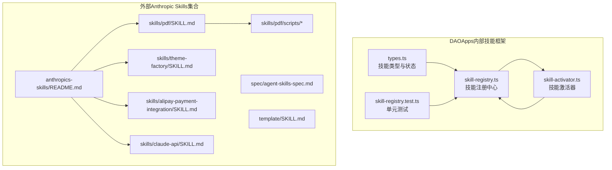
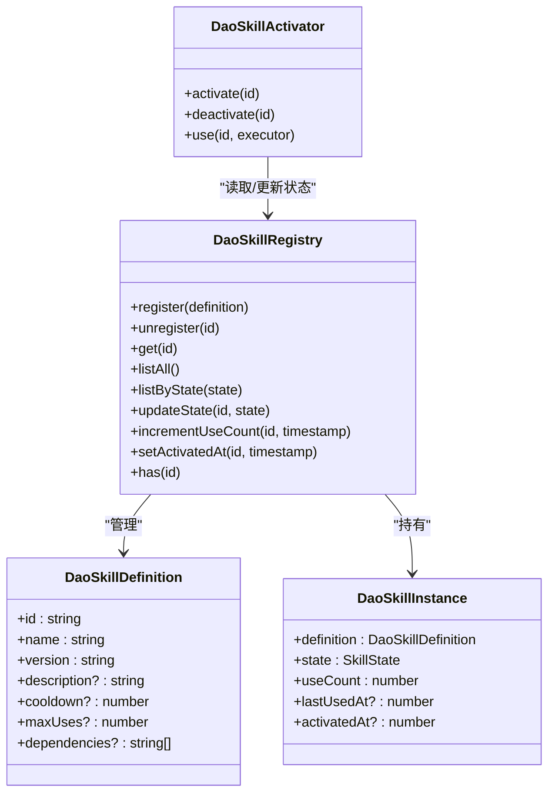
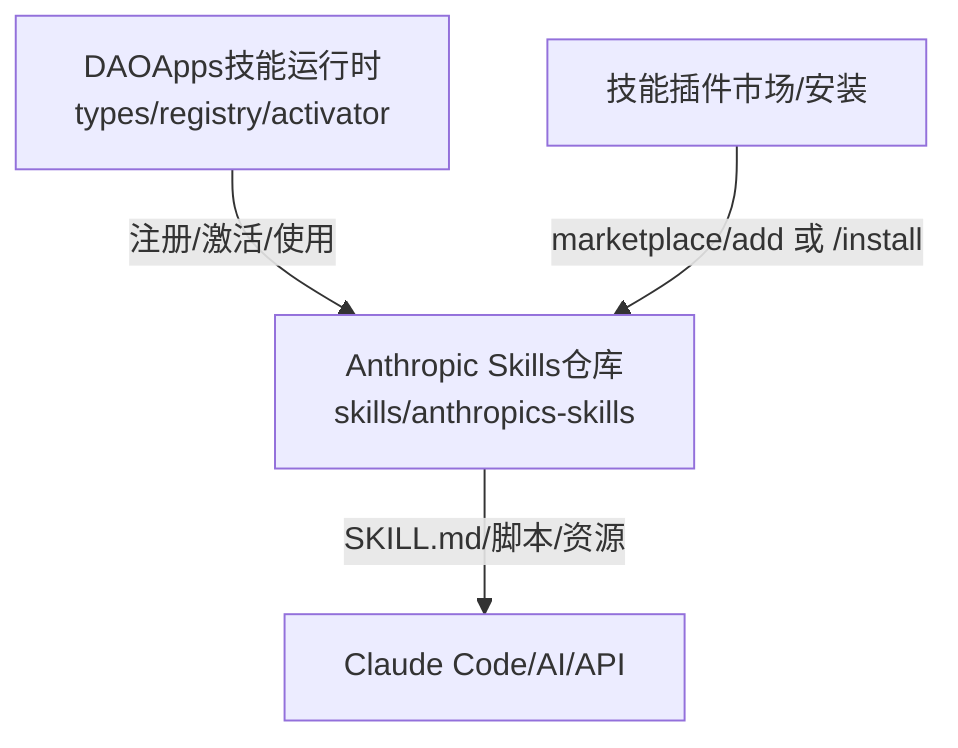
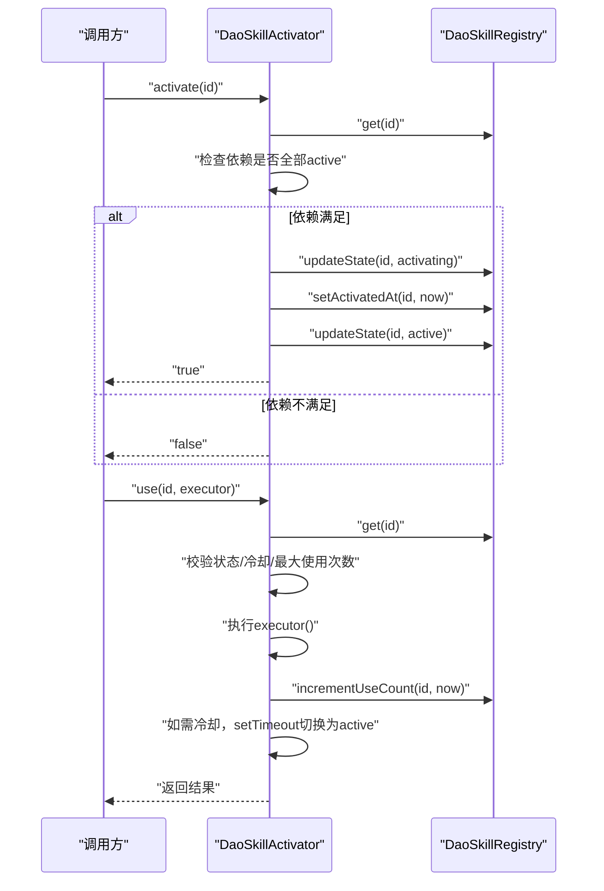
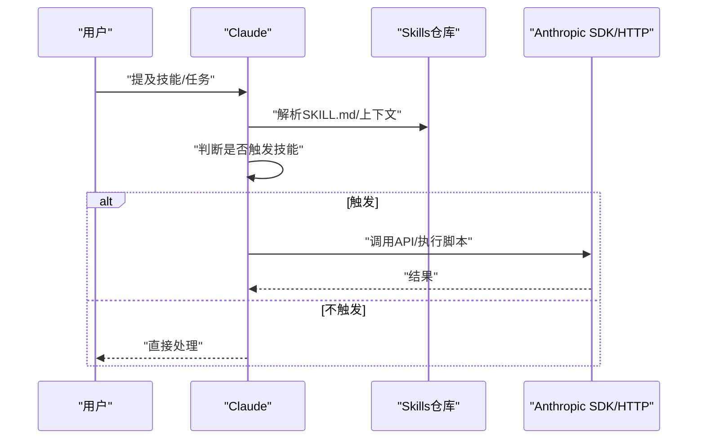
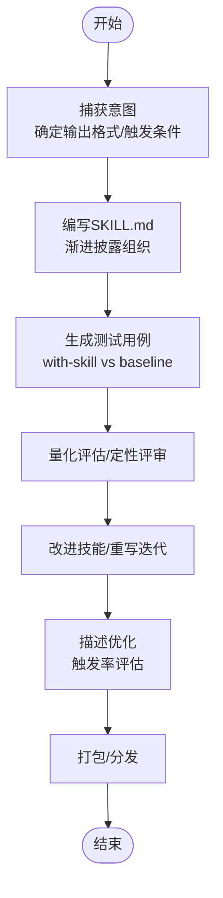
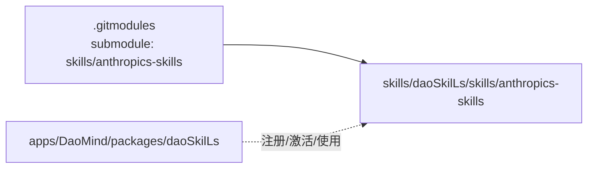

# 技能系统

<cite>
**本文引用的文件**
- [skills/daoSkilLs/skills/anthropics-skills/README.md](file://skills/daoSkilLs/skills/anthropics-skills/README.md)
- [skills/daoSkilLs/skills/anthropics-skills/template/SKILL.md](file://skills/daoSkilLs/skills/anthropics-skills/template/SKILL.md)
- [skills/daoSkilLs/skills/anthropics-skills/spec/agent-skills-spec.md](file://skills/daoSkilLs/skills/anthropics-skills/spec/agent-skills-spec.md)
- [skills/daoSkilLs/skills/anthropics-skills/skills/pdf/SKILL.md](file://skills/daoSkilLs/skills/anthropics-skills/skills/pdf/SKILL.md)
- [skills/daoSkilLs/skills/anthropics-skills/skills/theme-factory/SKILL.md](file://skills/daoSkilLs/skills/anthropics-skills/skills/theme-factory/SKILL.md)
- [skills/daoSkilLs/skills/anthropics-skills/skills/alipay-payment-integration/SKILL.md](file://skills/daoSkilLs/skills/anthropics-skils/skills/alipay-payment-integration/SKILL.md)
- [skills/daoSkilLs/skills/anthropics-skills/skills/claude-api/SKILL.md](file://skills/daoSkilLs/skills/anthropics-skills/skills/claude-api/SKILL.md)
- [skills/daoSkilLs/skills/anthropics-skills/skills/claude-api/python/claude-api/README.md](file://skills/daoSkilLs/skills/anthropics-skills/skills/claude-api/python/claude-api/README.md)
- [skills/daoSkilLs/skills/anthropics-skills/skills/pdf/scripts/convert_pdf_to_images.py](file://skills/daoSkilLs/skills/anthropics-skills/skills/pdf/scripts/convert_pdf_to_images.py)
- [skills/daoSkilLs/skills/anthropics-skills/skills/pdf/scripts/check_fillable_fields.py](file://skills/daoSkilLs/skills/anthropics-skills/skills/pdf/scripts/check_fillable_fields.py)
- [skills/daoSkilLs/skills/anthropics-skills/skills/skill-creator/SKILL.md](file://skills/daoSkilLs/skills/anthropics-skills/skills/skill-creator/SKILL.md)
- [skills/daoSkilLs/skills/anthropics-skills/skills/skill-creator/references/schemas.md](file://skills/daoSkilLs/skills/anthropics-skills/skills/skill-creator/references/schemas.md)
- [skills/daoSkilLs/skills/anthropics-skills/skills/skill-creator/scripts/aggregate_benchmark.py](file://skills/daoSkilLs/skills/anthropics-skills/skills/skill-creator/scripts/aggregate_benchmark.py)
- [skills/daoSkilLs/skills/anthropics-skills/skills/skill-creator/agents/analyzer.md](file://skills/daoSkilLs/skills/anthropics-skills/skills/skill-creator/agents/analyzer.md)
- [apps/DaoMind/packages/daoSkilLs/src/types.ts](file://apps/DaoMind/packages/daoSkilLs/src/types.ts)
- [apps/DaoMind/packages/daoSkilLs/src/skill-registry.ts](file://apps/DaoMind/packages/daoSkilLs/src/skill-registry.ts)
- [apps/DaoMind/packages/daoSkilLs/src/skill-activator.ts](file://apps/DaoMind/packages/daoSkilLs/src/skill-activator.ts)
- [apps/DaoMind/packages/daoSkilLs/src/__tests__/skill-registry.test.ts](file://apps/DaoMind/packages/daoSkilLs/src/__tests__/skill-registry.test.ts)
- [tools/flexloop/src/taolib/testing/multi_agent/models/skill.py](file://tools/flexloop/src/taolib/testing/multi_agent/models/skill.py)
- [tools/flexloop/src/taolib/testing/multi_agent/skills/manager.py](file://tools/flexloop/src/taolib/testing/multi_agent/skills/manager.py)
- [.gitmodules](file://.gitmodules)
</cite>

## 目录
1. [引言](#引言)
2. [项目结构](#项目结构)
3. [核心组件](#核心组件)
4. [架构总览](#架构总览)
5. [详细组件分析](#详细组件分析)
6. [依赖分析](#依赖分析)
7. [性能考虑](#性能考虑)
8. [故障排查指南](#故障排查指南)
9. [结论](#结论)
10. [附录](#附录)

## 引言
本技术文档面向DAOApps的可插拔技能系统，系统性阐述其模块化设计、插件体系、技能生命周期管理、与Anthropic Skills的集成方式、Claude API对接、技能模板与开发框架，并给出注册、加载、执行与卸载机制的实现要点。同时提供自定义技能开发的完整指南（规范、测试策略、发布与版本管理），并通过支付宝支付集成、PDF处理、主题工厂等真实案例解析技能落地路径。

## 项目结构
DAOApps仓库包含两套技能相关资产：
- DAOApps内部的可插拔技能运行时与管理框架（位于apps/DaoMind/packages/daoSkilLs）：提供技能注册、状态机、激活器与使用计数等能力。
- 外部Anthropic Skills集合（skills/daoSkilLs/skills/anthropics-skills）：以“技能包”形式提供，包含PDF处理、主题工厂、Claude API对接、支付宝支付集成等示例，以及技能模板与评测框架。

图表来源
- [apps/DaoMind/packages/daoSkilLs/src/types.ts:1-44](file://apps/DaoMind/packages/daoSkilLs/src/types.ts#L1-L44)
- [apps/DaoMind/packages/daoSkilLs/src/skill-registry.ts:1-72](file://apps/DaoMind/packages/daoSkilLs/src/skill-registry.ts#L1-L72)
- [apps/DaoMind/packages/daoSkilLs/src/skill-activator.ts:1-82](file://apps/DaoMind/packages/daoSkilLs/src/skill-activator.ts#L1-L82)
- [skills/daoSkilLs/skills/anthropics-skills/README.md:1-95](file://skills/daoSkilLs/skills/anthropics-skills/README.md#L1-L95)
- [skills/daoSkilLs/skills/anthropics-skills/spec/agent-skills-spec.md:1-4](file://skills/daoSkilLs/skills/anthropics-skills/spec/agent-skills-spec.md#L1-L4)
- [skills/daoSkilLs/skills/anthropics-skills/template/SKILL.md:1-7](file://skills/daoSkilLs/skills/anthropics-skills/template/SKILL.md#L1-L7)
- [skills/daoSkilLs/skills/anthropics-skills/skills/pdf/SKILL.md:1-315](file://skills/daoSkilLs/skills/anthropics-skills/skills/pdf/SKILL.md#L1-L315)
- [skills/daoSkilLs/skills/anthropics-skills/skills/theme-factory/SKILL.md:1-60](file://skills/daoSkilLs/skills/anthropics-skills/skills/theme-factory/SKILL.md#L1-L60)
- [skills/daoSkilLs/skills/anthropics-skills/skills/alipay-payment-integration/SKILL.md:1-64](file://skills/daoSkilLs/skills/anthropics-skills/skills/alipay-payment-integration/SKILL.md#L1-L64)
- [skills/daoSkilLs/skills/anthropics-skills/skills/claude-api/SKILL.md:1-21](file://skills/daoSkilLs/skills/anthropics-skills/skills/claude-api/SKILL.md#L1-L21)
- [skills/daoSkilLs/skills/anthropics-skills/skills/pdf/scripts/convert_pdf_to_images.py:1-34](file://skills/daoSkilLs/skills/anthropics-skills/skills/pdf/scripts/convert_pdf_to_images.py#L1-L34)

章节来源
- [skills/daoSkilLs/skills/anthropics-skills/README.md:1-95](file://skills/daoSkilLs/skills/anthropics-skills/README.md#L1-L95)
- [skills/daoSkilLs/skills/anthropics-skills/spec/agent-skills-spec.md:1-4](file://skills/daoSkilLs/skills/anthropics-skills/spec/agent-skills-spec.md#L1-L4)
- [skills/daoSkilLs/skills/anthropics-skills/template/SKILL.md:1-7](file://skills/daoSkilLs/skills/anthropics-skills/template/SKILL.md#L1-L7)

## 核心组件
DAOApps内部技能系统由以下核心组件构成：
- 类型与状态定义：统一技能标识、状态枚举与评分结构，确保跨模块一致的契约。
- 注册中心：负责技能注册、注销、查询、按状态筛选、状态与使用计数更新。
- 激活器：负责技能激活（含前置依赖检查）、停用、使用（含冷却、最大使用次数、错误处理）。

图表来源
- [apps/DaoMind/packages/daoSkilLs/src/types.ts:1-44](file://apps/DaoMind/packages/daoSkilLs/src/types.ts#L1-L44)
- [apps/DaoMind/packages/daoSkilLs/src/skill-registry.ts:1-72](file://apps/DaoMind/packages/daoSkilLs/src/skill-registry.ts#L1-L72)
- [apps/DaoMind/packages/daoSkilLs/src/skill-activator.ts:1-82](file://apps/DaoMind/packages/daoSkilLs/src/skill-activator.ts#L1-L82)

章节来源
- [apps/DaoMind/packages/daoSkilLs/src/types.ts:1-44](file://apps/DaoMind/packages/daoSkilLs/src/types.ts#L1-L44)
- [apps/DaoMind/packages/daoSkilLs/src/skill-registry.ts:1-72](file://apps/DaoMind/packages/daoSkilLs/src/skill-registry.ts#L1-L72)
- [apps/DaoMind/packages/daoSkilLs/src/skill-activator.ts:1-82](file://apps/DaoMind/packages/daoSkilLs/src/skill-activator.ts#L1-L82)

## 架构总览
DAOApps技能系统采用“运行时框架 + 外部技能包”的双层架构：
- 运行时框架：提供技能生命周期管理、依赖与冷却控制、使用统计与状态持久化支持。
- 外部技能包：以“技能目录 + SKILL.md + 可选脚本/资源”的形式存在，遵循Agent Skills规范，可在Claude Code/AI/API中安装与使用。

图表来源
- [skills/daoSkilLs/skills/anthropics-skills/README.md:29-59](file://skills/daoSkilLs/skills/anthropics-skills/README.md#L29-L59)
- [skills/daoSkilLs/skills/anthropics-skills/spec/agent-skills-spec.md:1-4](file://skills/daoSkilLs/skills/anthropics-skills/spec/agent-skills-spec.md#L1-L4)
- [apps/DaoMind/packages/daoSkilLs/src/skill-registry.ts:1-72](file://apps/DaoMind/packages/daoSkilLs/src/skill-registry.ts#L1-L72)
- [apps/DaoMind/packages/daoSkilLs/src/skill-activator.ts:1-82](file://apps/DaoMind/packages/daoSkilLs/src/skill-activator.ts#L1-L82)

## 详细组件分析

### DAOApps内部技能生命周期与执行流
- 注册：向注册中心登记技能定义，初始状态为“潜伏态”。
- 激活：检查前置依赖是否全部“活跃”，若满足则进入“激活中”→“活跃”；否则保持或返回不可用。
- 使用：执行前检查状态、冷却时间与最大使用次数；成功后更新使用计数与时间戳；若配置了冷却，则进入“冷却中”定时回切至“活跃”。
- 卸载：将状态回退至“潜伏态”。

图表来源
- [apps/DaoMind/packages/daoSkilLs/src/skill-activator.ts:10-78](file://apps/DaoMind/packages/daoSkilLs/src/skill-activator.ts#L10-L78)
- [apps/DaoMind/packages/daoSkilLs/src/skill-registry.ts:44-64](file://apps/DaoMind/packages/daoSkilLs/src/skill-registry.ts#L44-L64)

章节来源
- [apps/DaoMind/packages/daoSkilLs/src/skill-activator.ts:1-82](file://apps/DaoMind/packages/daoSkilLs/src/skill-activator.ts#L1-L82)
- [apps/DaoMind/packages/daoSkilLs/src/skill-registry.ts:1-72](file://apps/DaoMind/packages/daoSkilLs/src/skill-registry.ts#L1-L72)

### Anthropic Skills集成与Claude API对接
- 集成方式：通过插件市场命令在Claude Code中添加Anthropic Skills仓库，或直接安装特定技能集；也可通过Claude API上传/使用技能。
- Claude API技能：提供SDK初始化、消息请求、系统提示、视觉输入等基础用法，强调仅在目标项目语言存在官方SDK时优先使用官方SDK。
- 触发规则：技能描述决定是否触发；复杂多步任务更易触发技能，简单一步任务可能不会触发。

图表来源
- [skills/daoSkilLs/skills/anthropics-skills/README.md:29-59](file://skills/daoSkilLs/skills/anthropics-skills/README.md#L29-L59)
- [skills/daoSkilLs/skills/anthropics-skills/skills/claude-api/SKILL.md:1-21](file://skills/daoSkilLs/skills/anthropics-skills/skills/claude-api/SKILL.md#L1-L21)
- [skills/daoSkilLs/skills/anthropics-skills/skills/claude-api/python/claude-api/README.md:1-86](file://skills/daoSkilLs/skills/anthropics-skills/skills/claude-api/python/claude-api/README.md#L1-L86)

章节来源
- [skills/daoSkilLs/skills/anthropics-skills/README.md:1-95](file://skills/daoSkilLs/skills/anthropics-skills/README.md#L1-L95)
- [skills/daoSkilLs/skills/anthropics-skills/skills/claude-api/SKILL.md:1-21](file://skills/daoSkilLs/skills/anthropics-skills/skills/claude-api/SKILL.md#L1-L21)
- [skills/daoSkilLs/skills/anthropics-skills/skills/claude-api/python/claude-api/README.md:1-86](file://skills/daoSkilLs/skills/anthropics-skills/skills/claude-api/python/claude-api/README.md#L1-L86)

### 技能模板系统与开发框架
- 模板：提供最小化SKILL.md模板，包含name与description元数据。
- 开发框架：Skill Creator技能提供从意图捕获、草稿编写、测试用例、评估、迭代优化、描述优化、打包发布的完整闭环。
- 渐进披露：元数据始终在上下文，SKILL.md正文按需加载，资源按需执行，降低上下文开销。

图表来源
- [skills/daoSkilLs/skills/anthropics-skills/template/SKILL.md:1-7](file://skills/daoSkilLs/skills/anthropics-skills/template/SKILL.md#L1-L7)
- [skills/daoSkilLs/skills/anthropics-skills/skills/skill-creator/SKILL.md:1-486](file://skills/daoSkilLs/skills/anthropics-skills/skills/skill-creator/SKILL.md#L1-L486)

章节来源
- [skills/daoSkilLs/skills/anthropics-skills/template/SKILL.md:1-7](file://skills/daoSkilLs/skills/anthropics-skills/template/SKILL.md#L1-L7)
- [skills/daoSkilLs/skills/anthropics-skills/skills/skill-creator/SKILL.md:1-486](file://skills/daoSkilLs/skills/anthropics-skills/skills/skill-creator/SKILL.md#L1-L486)

### 实际技能案例解析

#### 支付宝支付集成
- 场景覆盖：当面付、订单码支付、App支付、JSAPI支付、手机/电脑网站支付、预授权支付、商家扣款等全场景产品。
- 结构化文档：通过模块化目录组织“基础信息/集成流程/安全规范/产品模块/工具模块/文档模块”，便于开发者快速定位。
- 关键点：关键词匹配与澄清话术，帮助用户准确选择支付方案。

章节来源
- [skills/daoSkilLs/skills/anthropics-skills/skills/alipay-payment-integration/SKILL.md:1-64](file://skills/daoSkilLs/skills/anthropics-skills/skills/alipay-payment-integration/SKILL.md#L1-L64)

#### PDF处理
- 功能矩阵：文本/表格提取、合并/拆分、旋转、水印、创建、表单填充、加密/解密、图片提取、OCR等。
- 工具链：Python库（pypdf、pdfplumber、reportlab）与命令行工具（pdftotext、qpdf、pdftk）并用。
- 示例脚本：提供可直接运行的脚本，如PDF转图片、检测可填写字段等。

章节来源
- [skills/daoSkilLs/skills/anthropics-skills/skills/pdf/SKILL.md:1-315](file://skills/daoSkilLs/skills/anthropics-skills/skills/pdf/SKILL.md#L1-L315)
- [skills/daoSkilLs/skills/anthropics-skills/skills/pdf/scripts/convert_pdf_to_images.py:1-34](file://skills/daoSkilLs/skills/anthropics-skills/skills/pdf/scripts/convert_pdf_to_images.py#L1-L34)
- [skills/daoSkilLs/skills/anthropics-skills/skills/pdf/scripts/check_fillable_fields.py:1-12](file://skills/daoSkilLs/skills/anthropics-skills/skills/pdf/scripts/check_fillable_fields.py#L1-L12)

#### 主题工厂
- 目标：为演示文稿、报告、HTML落地页等工件应用专业主题风格。
- 流程：展示主题展示PDF → 用户选择 → 应用颜色与字体 → 自定义主题生成与验证。
- 主题库：提供10种预设主题，每种包含配色与字体组合说明。

章节来源
- [skills/daoSkilLs/skills/anthropics-skills/skills/theme-factory/SKILL.md:1-60](file://skills/daoSkilLs/skills/anthropics-skills/skills/theme-factory/SKILL.md#L1-L60)

### 技能评测与基准聚合
- 评测闭环：with-skill与baseline并行运行，记录时间、token用量、断言通过情况。
- 基准聚合：计算均值±标准差、差异指标，生成benchmark.json与benchmark.md。
- 分析器：基于数据洞察识别断言稳定性、资源使用模式与异常项。

章节来源
- [skills/daoSkilLs/skills/anthropics-skills/skills/skill-creator/SKILL.md:163-251](file://skills/daoSkilLs/skills/anthropics-skills/skills/skill-creator/SKILL.md#L163-L251)
- [skills/daoSkilLs/skills/anthropics-skills/skills/skill-creator/scripts/aggregate_benchmark.py:267-302](file://skills/daoSkilLs/skills/anthropics-skills/skills/skill-creator/scripts/aggregate_benchmark.py#L267-L302)
- [skills/daoSkilLs/skills/anthropics-skills/skills/skill-creator/references/schemas.md:219-308](file://skills/daoSkilLs/skills/anthropics-skills/skills/skill-creator/references/schemas.md#L219-L308)
- [skills/daoSkilLs/skills/anthropics-skills/skills/skill-creator/agents/analyzer.md:195-239](file://skills/daoSkilLs/skills/anthropics-skills/skills/skill-creator/agents/analyzer.md#L195-L239)

## 依赖分析
- Git子模块：DAOApps通过.gitmodules引入skills/anthropics-skills作为子模块，便于版本化管理与复用。
- 运行时与技能包：DAOApps内部运行时与外部技能包通过“SKILL.md + 脚本/资源”进行解耦协作。
- 匹配推荐：多智能体工具链提供基于关键词的技能推荐，辅助任务与技能的匹配。

图表来源
- [.gitmodules:1-3](file://.gitmodules#L1-L3)
- [apps/DaoMind/packages/daoSkilLs/src/skill-registry.ts:1-72](file://apps/DaoMind/packages/daoSkilLs/src/skill-registry.ts#L1-L72)
- [skills/daoSkilLs/skills/anthropics-skills/README.md:1-95](file://skills/daoSkilLs/skills/anthropics-skills/README.md#L1-L95)

章节来源
- [.gitmodules:1-3](file://.gitmodules#L1-L3)
- [tools/flexloop/src/taolib/testing/multi_agent/skills/manager.py:298-323](file://tools/flexloop/src/taolib/testing/multi_agent/skills/manager.py#L298-L323)

## 性能考虑
- 上下文控制：通过渐进披露（元数据+正文+资源）减少不必要的上下文加载。
- 冷却与限频：通过cooldown与maxUses限制技能使用频率，避免过载。
- 并行评测：with-skill与baseline在同一轮次并行运行，缩短评测周期。
- 资源统计：记录时间、token与工具调用次数，便于对比与优化。

## 故障排查指南
- 技能不可用：检查状态是否为“活跃”，确认前置依赖是否满足。
- 冷却中：等待冷却时间结束后再次使用。
- 已耗尽：达到最大使用次数后会进入“耗尽”，需重新配置或更换技能。
- 评测异常：核对evals.json与eval_metadata.json结构，确保字段命名与schema一致；检查benchmark聚合脚本输出。

章节来源
- [apps/DaoMind/packages/daoSkilLs/src/skill-activator.ts:38-78](file://apps/DaoMind/packages/daoSkilLs/src/skill-activator.ts#L38-L78)
- [apps/DaoMind/packages/daoSkilLs/src/__tests__/skill-registry.test.ts:100-198](file://apps/DaoMind/packages/daoSkilLs/src/__tests__/skill-registry.test.ts#L100-L198)
- [skills/daoSkilLs/skills/anthropics-skills/skills/skill-creator/references/schemas.md:219-308](file://skills/daoSkilLs/skills/anthropics-skills/skills/skill-creator/references/schemas.md#L219-L308)

## 结论
DAOApps的技能系统以“可插拔、模块化、生命周期可控”为核心，结合Anthropic Skills的成熟范式与评测框架，形成从开发、测试、优化到发布的完整闭环。通过DAOApps内部运行时与外部技能包的协同，既能满足通用场景，又能灵活扩展到垂直领域（如支付、PDF处理、主题工厂等），为构建可复用、可演进的智能体能力体系提供了坚实基础。

## 附录

### 自定义技能开发指南
- 规范与模板
  - 使用模板SKILL.md作为起点，完善name与description元数据。
  - 采用渐进披露结构：元数据始终在上下文，正文控制在合理长度，资源按需加载。
- 测试策略
  - 编写2-3个真实用户场景的测试用例，分别运行“带技能”与“无技能”基线。
  - 量化断言与定性评审并重，持续迭代。
- 发布与版本管理
  - 使用Skill Creator的描述优化与打包流程，导出可安装的技能包。
  - 在Claude Code/AI/API中通过marketplace或API进行安装与分发。
- 评测与基准
  - 使用聚合脚本生成benchmark.json与benchmark.md，结合分析器洞察识别问题与优化方向。

章节来源
- [skills/daoSkilLs/skills/anthropics-skills/template/SKILL.md:1-7](file://skills/daoSkilLs/skills/anthropics-skills/template/SKILL.md#L1-L7)
- [skills/daoSkilLs/skills/anthropics-skills/skills/skill-creator/SKILL.md:1-486](file://skills/daoSkilLs/skills/anthropics-skills/skills/skill-creator/SKILL.md#L1-L486)
- [skills/daoSkilLs/skills/anthropics-skills/skills/skill-creator/scripts/aggregate_benchmark.py:267-302](file://skills/daoSkilLs/skills/anthropics-skills/skills/skill-creator/scripts/aggregate_benchmark.py#L267-L302)
- [skills/daoSkilLs/skills/anthropics-skills/skills/claude-api/SKILL.md:1-21](file://skills/daoSkilLs/skills/anthropics-skills/skills/claude-api/SKILL.md#L1-L21)